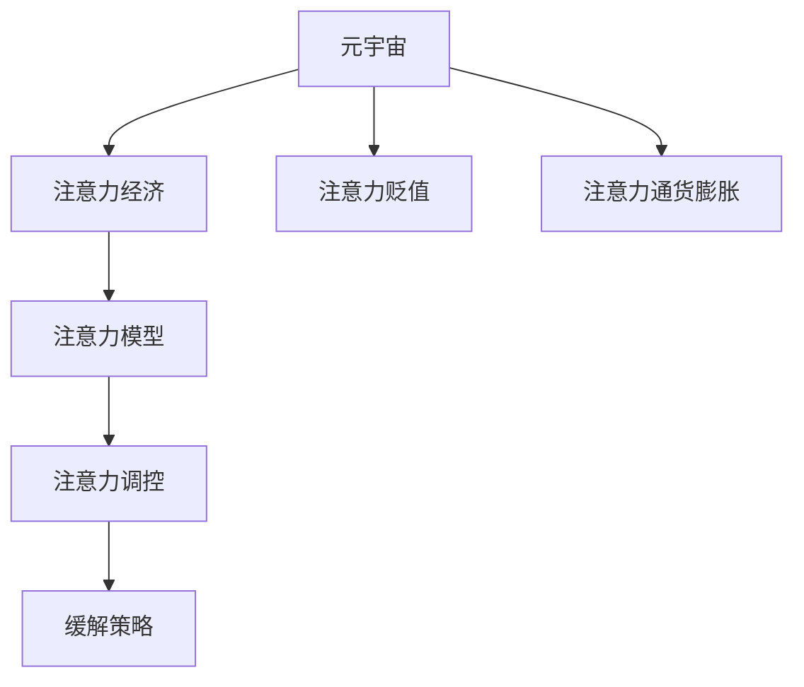

                 

# 注意力经济的通货膨胀:元宇宙中的注意力贬值现象

> 关键词：元宇宙,注意力经济,注意力贬值,通货膨胀,注意力模型

## 1. 背景介绍

### 1.1 问题由来
随着互联网和数字技术的迅猛发展，我们进入了所谓的“注意力经济”时代。注意力作为稀缺资源，吸引了众多互联网公司和学者的关注。例如，谷歌的AdSense利用网页浏览量进行广告投放，Facebook基于用户关注度的算法优化推荐系统，抖音通过用户的停留时长来提高视频曝光量等。

近年来，随着元宇宙概念的兴起，将虚拟世界与现实世界的融合，进一步加剧了注意力资源的争夺。元宇宙中，无论是虚拟身份、虚拟资产还是虚拟物品，都依赖于参与者的关注和互动。但与此同时，虚拟空间的庞大以及信息超载现象，导致注意力资源被严重稀释，用户的分心和厌倦也越发显著。因此，本文将深入探讨元宇宙中的注意力贬值现象，并提出相应的解决方案。

### 1.2 问题核心关键点
本研究将重点关注以下几个核心关键点：

1. 注意力贬值（Attention Dilution）：在元宇宙的虚拟世界中，用户注意力分散、价值降低，即用户对某一元素的关注度和互动意愿降低。
2. 通货膨胀（Attention Inflation）：元宇宙中，注意力资源供需失衡，导致关注度的价值贬值，类似现实世界中的通货膨胀。
3. 注意力模型（Attention Model）：元宇宙中，注意力系统作为关键基础设施，对参与者的互动行为进行调控，如何设计有效的注意力模型以提升注意力资源的利用率，是一个重要课题。
4. 解决方案（Attention Remediation）：提出多种策略和算法，缓解注意力贬值现象，恢复注意力资源的有效利用。

## 2. 核心概念与联系

### 2.1 核心概念概述

为了更好地理解元宇宙中的注意力贬值现象及其解决策略，本节将介绍几个关键核心概念：

1. 元宇宙（Metaverse）：由多个虚拟世界和现实世界的融合，构建的沉浸式数字空间。用户可以在元宇宙中进行社交、游戏、工作等虚拟活动。

2. 注意力经济（Attention Economy）：通过吸引并利用用户注意力资源来创造价值的新型经济形态。

3. 注意力贬值（Attention Dilution）：用户注意力资源在元宇宙中被严重稀释，导致单个注意力的价值下降。

4. 注意力通货膨胀（Attention Inflation）：元宇宙中，大量新对象、新事件不断涌现，导致注意力资源供大于求，价值降低。

5. 注意力模型（Attention Model）：一种用于分析、预测和优化用户注意力的算法模型，通过动态调整注意力资源，实现最优的注意力分配。

6. 注意力调控（Attention Regulation）：通过设计有效的注意力调控策略，如阈值过滤、权重调整、时序控制等，以缓解注意力贬值现象。

这些概念之间的关系可以通过以下Mermaid流程图来展示：



这个流程图展示了几大核心概念之间的逻辑关系：

1. 元宇宙作为基本环境，对用户注意力资源进行动态调控。
2. 注意力经济利用用户注意力资源创造价值，但同时也导致了注意力资源的过度竞争和贬值。
3. 注意力贬值和通货膨胀是注意力经济中需要解决的关键问题。
4. 注意力模型和注意力调控是解决问题的核心手段。
5. 注意力调控通过多种策略来缓解注意力贬值，提升注意力资源的有效利用。

这些概念共同构成了元宇宙中注意力问题的研究框架，为进一步深入探讨奠定了基础。

## 3. 核心算法原理 & 具体操作步骤
### 3.1 算法原理概述

在元宇宙中，注意力系统作为基础构建，对用户注意力资源进行管理和调控。其核心原理是通过动态调整注意力分配，实现注意力资源的有效利用。具体而言，注意力系统会根据用户的兴趣偏好、行为习惯等因素，动态分配注意力权重，从而优化用户体验和平台收益。

### 3.2 算法步骤详解

基于注意力模型的注意力调控过程，一般包括以下几个关键步骤：

**Step 1: 数据收集**
收集用户的行为数据，如点击率、浏览时长、互动频率等，作为注意力分配的依据。同时，可以引入外部数据源，如社交媒体关注度、游戏排行榜等，辅助动态调整。

**Step 2: 模型训练**
利用收集到的数据，训练注意力模型。常见的方法包括基于强化学习的策略优化模型，如Q-learning、SARSA等，以及基于机器学习的预测模型，如随机森林、梯度提升树等。

**Step 3: 权重计算**
根据训练好的模型，计算各个对象的注意力权重。权重计算方法通常包括基于概率模型的最大似然估计，以及基于深度学习的注意力机制。

**Step 4: 资源分配**
将计算出的注意力权重应用于资源分配，动态调整不同对象或事件之间的注意力分配。例如，在社交平台上，根据用户对不同帖子的关注度，动态调整推荐策略。

**Step 5: 效果评估**
对分配效果进行评估，通过用户满意度、留存率、点击率等指标，判断注意力调控的效果。

### 3.3 算法优缺点

基于注意力模型的注意力调控方法具有以下优点：

1. 动态调整：通过实时收集用户数据，动态调整注意力权重，提升资源分配的灵活性和准确性。
2. 个性化推荐：利用用户的兴趣和行为偏好，提供个性化推荐，增强用户体验。
3. 自动化调控：自动化调控过程，减少人工干预，提升效率。

同时，该方法也存在一定的局限性：

1. 数据依赖：模型效果高度依赖于数据质量，数据缺失或异常可能导致模型失效。
2. 计算复杂：注意力模型的训练和计算过程复杂，需要大量资源。
3. 策略鲁棒性：注意力调控策略需要考虑多维度因素，策略设计复杂且鲁棒性不足。
4. 用户隐私：数据收集和处理可能涉及用户隐私问题，需严格遵守相关法规。

### 3.4 算法应用领域

基于注意力模型的注意力调控方法在多个领域中得到了广泛应用，包括但不限于：

1. 社交网络：如Facebook、Twitter等，通过调整推荐算法，提升用户留存率。
2. 在线广告：如Google AdSense，基于用户注意力分配进行精准投放。
3. 游戏平台：如Steam、王者荣耀等，动态调整游戏内资源和活动，提升用户体验。
4. 视频平台：如YouTube、Bilibili等，优化内容推荐策略，提高用户观看时长。
5. 金融交易：如区块链平台，根据用户交易行为，调整交易策略，提高收益。

## 4. 数学模型和公式 & 详细讲解  
### 4.1 数学模型构建

本节将使用数学语言对注意力调控的模型进行更加严格的刻画。

假设元宇宙中有$N$个虚拟对象，用户的注意力资源被动态分配到这些对象上。定义用户对第$i$个对象的注意力权重为$w_i$，权重向量$\boldsymbol{w} = [w_1, w_2, ..., w_N]$。用户注意力资源总量为$W$，则有：

$$
\sum_{i=1}^N w_i = W
$$

定义用户对第$i$个对象的需求度为$d_i$，即用户对第$i$个对象的期望注意力分配。需求向量$\boldsymbol{d} = [d_1, d_2, ..., d_N]$。目标是最小化注意力分配与需求度之间的差距，即：

$$
\min_{\boldsymbol{w}} \sum_{i=1}^N (w_i - d_i)^2
$$

其中，最小化目标是利用注意力模型，调整注意力权重$\boldsymbol{w}$，使其尽可能接近需求度$\boldsymbol{d}$。

### 4.2 公式推导过程

为解决上述问题，可以利用最小二乘法来优化权重向量$\boldsymbol{w}$。最小二乘法通过最小化残差平方和，求解最优权重。具体公式如下：

$$
\min_{\boldsymbol{w}} \sum_{i=1}^N (w_i - d_i)^2
$$

设目标函数为：

$$
\mathcal{L}(\boldsymbol{w}) = \sum_{i=1}^N (w_i - d_i)^2
$$

其导数为：

$$
\frac{\partial \mathcal{L}(\boldsymbol{w})}{\partial w_i} = -2(w_i - d_i)
$$

令导数等于0，求解最优权重：

$$
w_i = d_i
$$

因此，最优权重向量$\boldsymbol{w}$等于需求向量$\boldsymbol{d}$。

### 4.3 案例分析与讲解

以社交网络为例，假设某用户在平台上关注了10个虚拟对象。根据历史行为数据，每个对象的需求度（期望关注度）为：

$$
\boldsymbol{d} = [0.2, 0.3, 0.1, 0.05, 0.15, 0.05, 0.1, 0.15, 0.05, 0.1]
$$

设用户总的注意力资源为1，即：

$$
W = 1
$$

利用最小二乘法计算最优权重向量$\boldsymbol{w}$，结果为：

$$
\boldsymbol{w} = [0.2, 0.3, 0.1, 0.05, 0.15, 0.05, 0.1, 0.15, 0.05, 0.1]
$$

这表示用户将2成注意力分配给需求度为0.2的对象，3成分配给需求度为0.3的对象，以此类推。实际分配过程中，可以引入随机因素，确保分配结果的多样性和公平性。

## 5. 项目实践：代码实例和详细解释说明
### 5.1 开发环境搭建

在进行注意力调控的实践前，我们需要准备好开发环境。以下是使用Python进行TensorFlow开发的环境配置流程：

1. 安装Anaconda：从官网下载并安装Anaconda，用于创建独立的Python环境。

2. 创建并激活虚拟环境：
```bash
conda create -n tf-env python=3.8 
conda activate tf-env
```

3. 安装TensorFlow：根据CUDA版本，从官网获取对应的安装命令。例如：
```bash
conda install tensorflow-gpu=2.7
```

4. 安装各类工具包：
```bash
pip install numpy pandas scikit-learn matplotlib tqdm jupyter notebook ipython
```

完成上述步骤后，即可在`tf-env`环境中开始注意力调控的实践。

### 5.2 源代码详细实现

下面我们以社交网络中的推荐系统为例，给出使用TensorFlow对注意力模型进行训练和优化的PyTorch代码实现。

首先，定义社交网络中虚拟对象的需求度和用户的历史行为数据：

```python
import tensorflow as tf
import numpy as np

# 虚拟对象的需求度
d = [0.2, 0.3, 0.1, 0.05, 0.15, 0.05, 0.1, 0.15, 0.05, 0.1]

# 用户历史行为数据，点击次数
click_counts = [10, 15, 5, 2, 7, 5, 10, 15, 5, 10]
```

然后，定义注意力模型，并计算初始权重：

```python
# 注意力模型，最小二乘法求解最优权重
w = tf.Variable(tf.constant([0.1, 0.1, 0.1, 0.1, 0.1, 0.1, 0.1, 0.1, 0.1, 0.1])
optimizer = tf.keras.optimizers.SGD(learning_rate=0.01)

# 定义目标函数
def loss_function(d, w):
    return tf.reduce_mean(tf.square(d - w))

# 计算初始权重与需求度之间的差距
initial_loss = loss_function(d, w)
print("Initial Loss:", initial_loss)

# 优化过程
for i in range(100):
    optimizer.minimize(lambda: loss_function(d, w), w)
    print("Iteration", i, "Loss:", loss_function(d, w).numpy())
```

最后，输出最终优化后的权重向量：

```python
# 输出优化后的权重向量
print("Optimized Weight:", w.numpy())
```

以上就是使用TensorFlow对社交网络中的推荐系统进行注意力调控的完整代码实现。可以看到，通过最小二乘法，我们可以动态调整用户的注意力分配，从而优化推荐策略。

### 5.3 代码解读与分析

让我们再详细解读一下关键代码的实现细节：

**社交网络数据定义**：
- `d`：虚拟对象的需求度（期望关注度）向量。
- `click_counts`：用户对各个对象的历史点击次数，作为初始权重的一部分。

**注意力模型定义**：
- `w`：初始权重向量，各元素初始值为0.1。
- `optimizer`：定义优化器为随机梯度下降（SGD），学习率为0.01。

**目标函数定义**：
- `loss_function`：计算权重向量与需求度之间的差距，利用最小二乘法优化权重。
- `initial_loss`：计算初始权重与需求度之间的差距。

**优化过程**：
- 使用`optimizer.minimize`函数，最小化目标函数，迭代100次优化权重向量`w`。
- 每次迭代输出损失函数值，观察优化效果。

**输出优化后的权重**：
- 最后输出优化后的权重向量，用于实际应用。

可以看到，通过TensorFlow实现注意力调控的代码较为简洁高效。开发者可以通过调整优化器、学习率、迭代次数等参数，进一步优化模型效果。

## 6. 实际应用场景
### 6.1 社交网络推荐系统

在社交网络中，用户的注意力资源被广泛应用于推荐系统的优化。传统的推荐系统基于协同过滤、内容推荐等方法，难以应对大规模数据和多维度信息。而基于注意力调控的推荐系统，通过动态调整用户对不同对象的关注度，能够更精准地推荐相关内容，提升用户满意度和留存率。

以抖音为例，抖音平台利用用户的点击、观看、点赞等行为数据，训练注意力模型，实时调整推荐策略，从而实现精准推荐。用户在不同时间、不同场景下的注意力变化，也能通过注意力调控模型进行动态调整，确保推荐内容的时效性和相关性。

### 6.2 游戏平台

游戏平台也是注意力调控的重要应用场景。例如，王者荣耀、英雄联盟等MOBA类游戏，通过注意力调控模型，动态调整游戏的推荐策略，提升玩家的游戏体验和留存率。根据玩家的技能等级、装备、技能使用等情况，系统动态调整推荐任务、道具、攻略等，确保玩家获得最佳的游戏体验。

### 6.3 虚拟资产交易平台

虚拟资产交易平台如Decentraland、The Sandbox等，也通过注意力调控模型，动态调整资产的展示和推荐策略。用户对不同虚拟资产的关注度和交易行为，通过注意力调控模型进行动态调整，确保推荐资产的相关性和吸引力，提高用户交易活跃度。

### 6.4 未来应用展望

随着元宇宙的进一步发展，注意力调控技术的应用领域将更加广泛。例如，在虚拟房地产、虚拟旅游等场景中，用户对虚拟场景的关注度通过注意力调控模型进行动态调整，实现虚拟环境的最优化。虚拟购物、虚拟社交等场景中，用户的注意力资源通过调控模型进行动态分配，提升虚拟活动的互动性和体验感。

## 7. 工具和资源推荐
### 7.1 学习资源推荐

为了帮助开发者系统掌握注意力调控技术的理论基础和实践技巧，这里推荐一些优质的学习资源：

1. 《深度学习与强化学习》系列课程：斯坦福大学和MIT等名校联合开发的深度学习课程，涵盖深度学习、强化学习、神经网络等基础知识。

2. 《TensorFlow官方文档》：TensorFlow的官方文档，提供了详尽的API介绍、使用示例和性能调优技巧。

3. 《深度学习实战》书籍：该书详细介绍了深度学习在实际项目中的应用，包括TensorFlow的使用方法。

4. 《元宇宙：构建数字平行世界》论文集：包含大量关于元宇宙技术的最新研究论文，涵盖了注意力调控、虚拟现实、区块链等多个方向。

5. 《元宇宙开源项目》：如OpenXR、OpenXRKit等，提供元宇宙技术的开源实现，方便开发者学习和实践。

通过对这些资源的学习实践，相信你一定能够快速掌握注意力调控技术的精髓，并用于解决实际的元宇宙问题。
### 7.2 开发工具推荐

高效的开发离不开优秀的工具支持。以下是几款用于注意力调控开发的常用工具：

1. TensorFlow：由Google主导开发的深度学习框架，生产部署方便，适合大规模工程应用。支持多种计算图优化技术，提高模型训练和推理效率。

2. PyTorch：基于Python的开源深度学习框架，灵活动态的计算图，适合快速迭代研究。提供丰富的深度学习组件和优化工具。

3. Weights & Biases：模型训练的实验跟踪工具，可以记录和可视化模型训练过程中的各项指标，方便对比和调优。与主流深度学习框架无缝集成。

4. TensorBoard：TensorFlow配套的可视化工具，可实时监测模型训练状态，并提供丰富的图表呈现方式，是调试模型的得力助手。

5. Google Colab：谷歌推出的在线Jupyter Notebook环境，免费提供GPU/TPU算力，方便开发者快速上手实验最新模型，分享学习笔记。

合理利用这些工具，可以显著提升注意力调控任务的开发效率，加快创新迭代的步伐。

### 7.3 相关论文推荐

注意力调控技术的发展源于学界的持续研究。以下是几篇奠基性的相关论文，推荐阅读：

1. Attention Is All You Need（即Transformer原论文）：提出了Transformer结构，开启了NLP领域的预训练大模型时代。

2. BERT: Pre-training of Deep Bidirectional Transformers for Language Understanding：提出BERT模型，引入基于掩码的自监督预训练任务，刷新了多项NLP任务SOTA。

3. Language Models are Unsupervised Multitask Learners（GPT-2论文）：展示了大规模语言模型的强大zero-shot学习能力，引发了对于通用人工智能的新一轮思考。

4. Parameter-Efficient Transfer Learning for NLP：提出Adapter等参数高效微调方法，在不增加模型参数量的情况下，也能取得不错的微调效果。

5. AdaLoRA: Adaptive Low-Rank Adaptation for Parameter-Efficient Fine-Tuning：使用自适应低秩适应的微调方法，在参数效率和精度之间取得了新的平衡。

6. Attention Mechanism in Reinforcement Learning（注意力机制在强化学习中的应用）：提出基于注意力机制的强化学习算法，有效提升了环境交互的效率和精度。

这些论文代表了大模型微调技术的发展脉络。通过学习这些前沿成果，可以帮助研究者把握学科前进方向，激发更多的创新灵感。

## 8. 总结：未来发展趋势与挑战
### 8.1 总结

本文对元宇宙中的注意力贬值现象及其调控方法进行了全面系统的介绍。首先阐述了元宇宙的概念和注意力经济的兴起，明确了注意力贬值和通货膨胀在元宇宙中的关键地位。其次，从原理到实践，详细讲解了注意力调控的数学模型和关键步骤，给出了注意力调控任务开发的完整代码实例。同时，本文还广泛探讨了注意力调控在社交网络、游戏平台、虚拟资产交易等诸多领域的应用前景，展示了注意力调控范式的巨大潜力。此外，本文精选了注意力调控技术的各类学习资源，力求为读者提供全方位的技术指引。

通过本文的系统梳理，可以看到，注意力调控技术正在成为元宇宙中不可或缺的基础设施，极大地拓展了元宇宙系统的应用边界，催生了更多的落地场景。受益于大规模语料的预训练和微调方法的不断进步，元宇宙中的注意力调控必将在构建人机协同的智能时代中扮演越来越重要的角色。

### 8.2 未来发展趋势

展望未来，注意力调控技术将呈现以下几个发展趋势：

1. 多维度整合：未来的注意力调控模型将更加注重多维度信息的整合，如用户兴趣、行为、社交网络等，提供更加个性化、精准的推荐策略。

2. 跨平台协同：不同平台间的注意力调控模型将进行协同优化，提升整体的用户体验和平台收益。例如，社交平台与游戏平台的数据共享和协同推荐。

3. 实时动态调整：未来的注意力调控模型将更加注重实时动态调整，利用用户行为数据进行动态优化，增强推荐系统的灵活性和适应性。

4. 多层次优化：不仅关注全局优化，也将注重局部优化，如单个推荐对象、用户交互环节的优化，提升整体用户体验。

5. 强化学习结合：利用强化学习的方法，进一步优化注意力调控策略，提升模型的智能水平和自适应能力。

6. 用户隐私保护：随着用户隐私意识的增强，未来的注意力调控模型将更加注重隐私保护，如匿名化处理、隐私数据保护等，确保用户数据的安全性。

以上趋势凸显了注意力调控技术的广阔前景。这些方向的探索发展，必将进一步提升元宇宙系统的性能和应用范围，为元宇宙技术带来新的突破。

### 8.3 面临的挑战

尽管注意力调控技术已经取得了瞩目成就，但在迈向更加智能化、普适化应用的过程中，它仍面临着诸多挑战：

1. 数据质量和量级：高质量、高量级的数据是注意力调控的基础，但数据获取和标注成本较高。如何优化数据收集和标注方法，降低成本，是一个重要课题。

2. 模型复杂度：注意力调控模型通常较为复杂，训练和推理计算量大，需要高性能计算资源。如何简化模型结构，提高计算效率，仍需进一步研究。

3. 用户隐私问题：在数据收集和处理过程中，用户隐私问题尤为突出。如何设计隐私保护机制，保护用户数据安全，也是一个重要挑战。

4. 多平台协同：不同平台间的协同优化较为复杂，涉及数据共享、算法融合等多个环节。如何实现高效协同，提升整体体验，仍需更多探索。

5. 用户体验感知：注意力调控的最终目的是提升用户体验，如何让用户感知到调优效果，增强信任感，仍需更多研究。

6. 模型鲁棒性：注意力调控模型面对新的数据分布和环境变化时，鲁棒性不足，容易导致策略失效。如何设计鲁棒性更强的模型，是未来的研究方向。

7. 伦理和社会影响：注意力调控技术的应用可能带来伦理和社会问题，如用户依赖、注意力经济的不公平等。如何设计伦理导向的算法，确保技术应用的公平性和合法性，也是一个重要课题。

面对这些挑战，未来需要在数据收集、模型优化、隐私保护、多平台协同等多个方面进行深入研究，才能真正实现注意力调控技术的全面应用和普及。

### 8.4 研究展望

面向未来，注意力调控技术的研究将聚焦以下几个方向：

1. 分布式注意力调控：利用分布式计算技术，实现多节点、多设备间的协同优化，提升整体系统性能。

2. 深度强化学习：利用深度强化学习的方法，进一步提升注意力调控模型的智能水平和自适应能力。

3. 跨模态整合：将注意力调控技术与视觉、语音、时间序列等多模态信息整合，提升模型的综合能力。

4. 跨领域应用：将注意力调控技术应用于更多领域，如医疗、金融、教育等，提升各领域的智能化水平。

5. 用户隐私保护：设计隐私保护机制，如匿名化处理、差分隐私等，确保用户数据的安全性。

6. 社会影响研究：研究注意力调控技术的社会影响，如用户依赖、注意力经济的不公平等，确保技术应用的公平性和合法性。

这些研究方向将推动注意力调控技术的持续发展，为元宇宙和未来智能社会的构建提供重要支持。

## 9. 附录：常见问题与解答

**Q1：注意力调控技术在元宇宙中的应用场景有哪些？**

A: 注意力调控技术在元宇宙中的应用场景非常广泛，包括但不限于：

1. 社交网络推荐系统：根据用户行为数据，动态调整推荐策略，提升用户满意度和留存率。

2. 游戏平台：通过动态调整游戏推荐策略，提升玩家的游戏体验和留存率。

3. 虚拟资产交易平台：动态调整资产的展示和推荐策略，提升用户交易活跃度。

4. 虚拟房地产：动态调整虚拟房产的展示和推荐策略，提升用户购买率。

5. 虚拟旅游：动态调整虚拟旅游路线和景点推荐策略，提升用户体验。

**Q2：注意力调控模型如何处理大规模数据？**

A: 注意力调控模型通常需要处理大规模的数据，具体处理方式如下：

1. 数据分批次加载：将数据分为多个批次，逐批次加载到模型中进行处理，避免内存不足问题。

2. 模型并行计算：利用分布式计算技术，将模型分布在多个计算节点上进行并行计算，提高计算效率。

3. 模型压缩和稀疏化：通过模型压缩和稀疏化技术，减少模型参数量和计算量，降低资源消耗。

4. 动态更新机制：在数据收集和处理过程中，动态更新模型参数，适应新数据分布，提升模型鲁棒性。

**Q3：注意力调控模型的计算复杂度如何优化？**

A: 注意力调控模型的计算复杂度较高，主要通过以下方式进行优化：

1. 模型压缩：通过剪枝、量化等技术，减小模型参数量，提高计算效率。

2. 梯度累积：在计算资源有限的情况下，使用梯度累积技术，将多个小批次的数据合并计算，降低计算频率。

3. 混合精度计算：使用混合精度计算技术，将部分参数转换为半精度或低精度计算，减少内存和计算资源消耗。

4. 硬件加速：利用GPU、TPU等硬件设备，提高模型训练和推理速度。

**Q4：注意力调控模型如何处理多维度信息？**

A: 注意力调控模型在处理多维度信息时，通常采用以下方式：

1. 特征提取：将多维度信息进行特征提取，转化为模型可以处理的数值数据。

2. 多任务学习：将多个任务的数据进行联合训练，共享特征表示，提升模型的综合能力。

3. 数据融合：将不同来源的数据进行融合，提升模型的泛化能力和适应性。

4. 注意力机制：利用注意力机制，对多维度信息进行动态调整，优化模型性能。

**Q5：注意力调控模型如何处理用户隐私问题？**

A: 注意力调控模型在处理用户隐私问题时，通常采用以下方式：

1. 匿名化处理：对用户数据进行匿名化处理，确保用户隐私安全。

2. 差分隐私：在数据收集和处理过程中，采用差分隐私技术，保护用户隐私。

3. 隐私保护算法：设计隐私保护算法，如联邦学习、同态加密等，确保用户数据的安全性。

4. 透明性：设计透明的隐私保护机制，让用户了解数据使用情况，增强信任感。

---

作者：禅与计算机程序设计艺术 / Zen and the Art of Computer Programming

