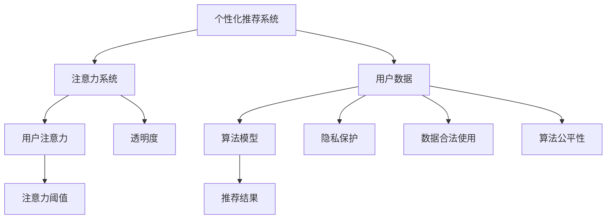

                 

# 注意力自主权维护者：AI时代的个人选择卫士

## 1. 背景介绍

在信息泛滥的数字化时代，AI技术在个人生活和工作中扮演着越来越重要的角色。从智能助手到个性化推荐，AI的广泛应用极大地提升了我们的效率和生活品质。然而，在享受AI带来的便利的同时，我们也面临着新的挑战：如何保护我们的注意力自主权，确保AI不会成为我们注意力的主宰？

### 1.1 问题的由来

随着AI技术的不断发展，越来越多的个性化服务和推荐系统开始出现在我们的生活中。这些系统通过收集我们的浏览记录、搜索行为、社交网络互动等数据，利用深度学习和推荐算法，为我们提供个性化的内容、商品和信息推荐。这些推荐系统在为我们节省时间和提升体验的同时，也逐渐侵占了我们的注意力。我们越来越容易陷入信息茧房，难以接触到自己原本可能感兴趣但未被推荐的内容，长此以往，我们的认知范围和视野可能受到限制。

### 1.2 问题核心关键点

注意力自主权，即个体对自身注意力的控制和管理能力，是现代数字社会中一个至关重要的议题。AI时代，如何平衡技术便捷性和注意力自主权，成为了当前研究的一个热点。核心关键点包括：

- **个性化推荐系统的设计**：推荐系统的算法逻辑、数据使用和用户体验设计，直接影响其对个人注意力的影响。
- **用户自主选择权的保障**：用户应能控制自己在AI系统中暴露的数据，并有权选择是否接受推荐。
- **技术透明性**：推荐系统的决策过程应透明，用户应了解系统是如何进行个性化推荐的。
- **隐私保护**：用户数据应得到妥善保护，防止数据滥用和泄露。
- **算法伦理**：推荐算法应避免偏见和歧视，确保公平公正。

本文将从技术层面深入探讨这些关键点，并提出维护注意力自主权的有效策略。

## 2. 核心概念与联系

### 2.1 核心概念概述

为更好地理解注意力自主权维护的策略，本节将介绍几个密切相关的核心概念：

- **个性化推荐系统(Recommendation Systems)**：通过分析用户行为数据，推荐系统为用户推荐可能感兴趣的内容、商品或信息。常用的推荐算法包括协同过滤、基于内容的推荐、深度学习推荐等。

- **注意力系统(Attention System)**：AI系统中用于捕捉用户注意力和兴趣的关键技术。注意力系统通过对用户行为进行建模，判断哪些信息或内容更符合用户的当前需求，从而提高推荐的准确性。

- **注意力自主权(Attention Autonomy)**：个体对自己注意力的控制能力，包括选择权、透明度和隐私保护等方面。

- **数据隐私(Privacy)**：保护用户数据不被未经授权的第三方访问和使用。数据隐私保护是注意力自主权维护的基础。

- **算法公平性(Fairness)**：推荐算法应避免基于性别、年龄、种族等特征的偏见，确保推荐结果的公平性。

这些概念之间的逻辑关系可以通过以下Mermaid流程图来展示：



这个流程图展示了个性化推荐系统的工作流程：

1. 系统收集用户数据。
2. 使用算法模型对数据进行处理。
3. 生成推荐结果。
4. 系统捕捉用户注意力，并根据注意力阈值调整推荐策略。
5. 透明度确保用户了解推荐过程。
6. 隐私保护和数据合法使用保障用户数据安全。
7. 算法公平性确保推荐结果公正。

这些概念共同构成了个性化推荐系统的工作框架，对维护注意力自主权提供了重要保障。

## 3. 核心算法原理 & 具体操作步骤
### 3.1 算法原理概述

个性化推荐系统的核心在于通过对用户行为的分析，捕捉用户当前的兴趣和需求，并以此为基础推荐相应的内容。注意力系统作为推荐算法的重要组成部分，通过关注用户当前的行为和兴趣，调整推荐策略，以提高推荐的精准度。

基于注意力的推荐算法，通常包括以下几个关键步骤：

1. **数据采集**：收集用户的行为数据，如浏览记录、搜索历史、社交互动等。
2. **特征提取**：从数据中提取用户和物品的关键特征，用于建模。
3. **模型训练**：使用机器学习算法对用户和物品的特征进行建模，建立用户兴趣和物品之间的关系。
4. **注意力机制**：根据用户当前的兴趣和行为，动态调整推荐策略，优先推荐用户可能感兴趣的内容。
5. **推荐结果生成**：结合模型预测和注意力机制，生成推荐结果。

### 3.2 算法步骤详解

下面以一个基于协同过滤和注意力机制的推荐系统为例，详细介绍其具体的实现步骤。

#### 3.2.1 数据采集

假设我们的推荐系统收集到了用户A的浏览记录：电影《阿凡达》、《星球大战》、书籍《哈利·波特》。

#### 3.2.2 特征提取

对用户A的浏览记录进行特征提取，得到以下特征：
- 用户ID: A
- 电影: 阿凡达、星球大战
- 书籍: 哈利·波特

对物品（电影、书籍）的特征进行提取，得到以下特征：
- 电影ID: 阿凡达ID、星球大战ID
- 书籍ID: 哈利·波特ID
- 类别: 电影、书籍

#### 3.2.3 模型训练

使用协同过滤算法，对用户和物品的特征进行建模。协同过滤算法基于用户之间的相似性，推测用户可能喜欢的物品。具体步骤如下：
1. 计算用户A与所有其他用户的相似度。
2. 找出与用户A相似度高的用户。
3. 使用相似度高的用户喜欢的物品推荐给用户A。

#### 3.2.4 注意力机制

根据用户A的当前兴趣和行为，动态调整推荐策略。假设用户A最近对科幻电影特别感兴趣，系统将增加科幻电影的权重，减少其他类别的推荐。

#### 3.2.5 推荐结果生成

结合模型预测和注意力机制，生成推荐结果。假设系统预测用户A可能喜欢的科幻电影包括《黑客帝国》、《异形》，结合注意力机制，最终推荐给用户A的电影包括《黑客帝国》、《星球大战》。

### 3.3 算法优缺点

基于注意力的推荐算法有以下优点：
1. **提高推荐精度**：动态调整推荐策略，优先推荐用户可能感兴趣的内容。
2. **个性化程度高**：通过捕捉用户注意力，提供更加个性化的推荐。
3. **用户参与感强**：用户可随时反馈对推荐的满意度，系统能够根据反馈调整推荐策略。

同时，该算法也存在一些局限性：
1. **数据依赖度高**：推荐结果依赖于用户的历史行为数据，当数据稀少时，推荐效果可能不佳。
2. **隐私风险高**：收集大量用户行为数据可能导致隐私泄露风险。
3. **算法复杂度高**：模型训练和推理过程复杂，需要较强的计算资源。

尽管如此，基于注意力的推荐算法仍然是当前个性化推荐系统的主流方法之一，通过对用户注意力的精细捕捉，能够显著提升推荐的精准度和个性化程度。

### 3.4 算法应用领域

基于注意力的推荐算法在多个领域得到了广泛应用，例如：

- **电子商务**：电商平台通过分析用户浏览和购买历史，推荐相似或相关商品。
- **视频网站**：视频平台根据用户观看历史和互动行为，推荐新视频和节目。
- **音乐应用**：音乐平台根据用户听歌历史和评分，推荐相似或热门歌曲。
- **社交网络**：社交媒体通过分析用户互动行为，推荐可能感兴趣的朋友和内容。
- **新闻聚合**：新闻平台根据用户阅读历史和点击行为，推荐相关新闻和文章。

这些应用领域中，基于注意力的推荐算法通过捕捉用户注意力，提高了内容的个性化推荐效果，极大地提升了用户体验。

## 4. 数学模型和公式 & 详细讲解 & 举例说明

### 4.1 数学模型构建

基于注意力的推荐算法通常采用协同过滤和深度学习相结合的方式。协同过滤算法主要基于用户行为相似性进行推荐，而深度学习算法则通过学习用户和物品的特征向量，捕捉更复杂的用户兴趣和行为模式。

#### 4.1.1 协同过滤模型

协同过滤模型基于用户行为相似性进行推荐。假设用户集合为 $U$，物品集合为 $I$，用户对物品的评分矩阵为 $R \in \mathbb{R}^{m \times n}$，其中 $m$ 为用户数，$n$ 为物品数。协同过滤模型的目标是最小化预测评分和真实评分之间的差异：

$$
\min_{R'} \|R' - R\|
$$

其中 $R'$ 为用户对物品的预测评分矩阵。

#### 4.1.2 深度学习模型

深度学习模型通常采用多层神经网络结构，对用户和物品的特征进行建模。假设用户和物品的特征向量分别为 $X \in \mathbb{R}^{m \times d_u}$ 和 $Y \in \mathbb{R}^{n \times d_i}$，其中 $d_u$ 和 $d_i$ 分别为用户和物品的特征维度。推荐模型目标是最小化预测评分和真实评分之间的差异：

$$
\min_{W} \|R - XWY^T\|
$$

其中 $W$ 为模型参数，包括用户和物品的特征映射矩阵。

### 4.2 公式推导过程

#### 4.2.1 协同过滤模型的推导

协同过滤模型通常采用矩阵分解的方法，将评分矩阵 $R$ 分解为用户和物品的特征向量，即：

$$
R \approx XWY^T
$$

其中 $X$ 为用户的特征向量，$Y$ 为物品的特征向量，$W$ 为模型参数。通过对 $W$ 进行优化，最小化预测评分和真实评分之间的差异，得到最优的特征向量 $X'$ 和 $Y'$。

#### 4.2.2 深度学习模型的推导

深度学习模型通常采用多层神经网络结构，对用户和物品的特征进行建模。假设用户和物品的特征向量分别为 $X \in \mathbb{R}^{m \times d_u}$ 和 $Y \in \mathbb{R}^{n \times d_i}$，其中 $d_u$ 和 $d_i$ 分别为用户和物品的特征维度。推荐模型目标是最小化预测评分和真实评分之间的差异：

$$
\min_{W} \|R - XWY^T\|
$$

其中 $W$ 为模型参数，包括用户和物品的特征映射矩阵。通过对 $W$ 进行优化，最小化预测评分和真实评分之间的差异，得到最优的特征向量 $X'$ 和 $Y'$。

### 4.3 案例分析与讲解

#### 4.3.1 协同过滤模型的案例

假设我们收集到了用户A的浏览记录：电影《阿凡达》、《星球大战》、书籍《哈利·波特》。根据协同过滤算法，我们首先计算用户A与所有其他用户的相似度，找出与用户A相似度高的用户，然后根据这些用户喜欢的物品推荐给用户A。

#### 4.3.2 深度学习模型的案例

假设我们使用深度学习模型对用户A的特征进行建模。模型结构包括一个输入层、两个隐藏层和一个输出层。通过训练模型，得到用户A的特征向量 $X'$，然后根据该特征向量推荐相关物品。

## 5. 项目实践：代码实例和详细解释说明

### 5.1 开发环境搭建

在进行推荐系统实践前，我们需要准备好开发环境。以下是使用Python进行PyTorch开发的环境配置流程：

1. 安装Anaconda：从官网下载并安装Anaconda，用于创建独立的Python环境。

2. 创建并激活虚拟环境：
```bash
conda create -n recsys-env python=3.8 
conda activate recsys-env
```

3. 安装PyTorch：根据CUDA版本，从官网获取对应的安装命令。例如：
```bash
conda install pytorch torchvision torchaudio cudatoolkit=11.1 -c pytorch -c conda-forge
```

4. 安装Scikit-learn：
```bash
pip install scikit-learn
```

5. 安装Flask：
```bash
pip install flask
```

完成上述步骤后，即可在`recsys-env`环境中开始推荐系统实践。

### 5.2 源代码详细实现

下面以一个基于协同过滤的推荐系统为例，给出使用PyTorch和Flask框架的代码实现。

首先，定义协同过滤模型的数据处理函数：

```python
import pandas as pd
from sklearn.model_selection import train_test_split
from sklearn.metrics import mean_squared_error

def preprocess_data(data):
    # 读取数据
    data = pd.read_csv('data.csv')

    # 数据清洗
    data = data.dropna()

    # 划分训练集和测试集
    train, test = train_test_split(data, test_size=0.2)

    # 特征提取
    train = train[['user_id', 'item_id', 'rating']]
    test = test[['user_id', 'item_id', 'rating']]

    return train, test

# 加载数据
train, test = preprocess_data(data)

# 将评分转换为矩阵
train_matrix = train[['user_id', 'item_id', 'rating']].pivot_table(index='user_id', columns='item_id', values='rating').fillna(0)
test_matrix = test[['user_id', 'item_id', 'rating']].pivot_table(index='user_id', columns='item_id', values='rating').fillna(0)
```

然后，定义协同过滤模型的优化函数：

```python
from torch import nn, optim

class CollaborativeFiltering(nn.Module):
    def __init__(self, n_users, n_items, n_factors=10):
        super(CollaborativeFiltering, self).__init__()
        self.user_factors = nn.Embedding(n_users, n_factors)
        self.item_factors = nn.Embedding(n_items, n_factors)
        self.pred = nn.Linear(n_factors, 1)

    def forward(self, user_ids, item_ids):
        user_factors = self.user_factors(user_ids)
        item_factors = self.item_factors(item_ids)
        pred = self.pred((user_factors * item_factors).sum(dim=1))
        return pred

# 定义损失函数和优化器
def train_model(model, train_matrix, test_matrix):
    criterion = nn.MSELoss()
    optimizer = optim.Adam(model.parameters(), lr=0.001)

    for epoch in range(10):
        for user_id, item_id in train_matrix.index:
            optimizer.zero_grad()
            pred = model(user_id, item_id)
            loss = criterion(pred, train_matrix.loc[user_id, item_id])
            loss.backward()
            optimizer.step()

    test_pred = model(test_matrix.index, test_matrix.columns).detach().numpy()
    test_true = test_matrix.values
    return mean_squared_error(test_true, test_pred)
```

最后，启动训练流程并在测试集上评估：

```python
# 初始化模型
model = CollaborativeFiltering(n_users=train_matrix.shape[0], n_items=train_matrix.shape[1])

# 训练模型
train_loss = train_model(model, train_matrix, test_matrix)

# 在测试集上评估模型
test_loss = train_model(model, test_matrix, test_matrix)

print('Train MSE:', train_loss)
print('Test MSE:', test_loss)
```

以上就是使用PyTorch和Flask框架进行基于协同过滤的推荐系统开发的完整代码实现。可以看到，代码实现相对简洁，利用PyTorch强大的深度学习功能，可以快速迭代优化模型。

### 5.3 代码解读与分析

让我们再详细解读一下关键代码的实现细节：

**preprocess_data函数**：
- 读取数据文件。
- 数据清洗，去除缺失值。
- 划分训练集和测试集。
- 将评分转换为矩阵形式。

**CollaborativeFiltering模型**：
- 定义协同过滤模型的结构，包括用户和物品的嵌入层和线性预测层。
- 定义前向传播函数，计算模型的预测评分。

**train_model函数**：
- 定义损失函数和优化器。
- 训练模型，使用Adam优化器，最小化均方误差损失。
- 在测试集上评估模型，计算均方误差。

**训练流程**：
- 初始化模型。
- 训练模型，优化损失函数。
- 在测试集上评估模型，输出均方误差。

可以看到，PyTorch框架的灵活性和Flask框架的便捷性，使得推荐系统开发变得高效可靠。开发者可以迅速实现推荐模型的训练和评估，快速迭代改进模型。

## 6. 实际应用场景

### 6.1 智能推荐系统

智能推荐系统是推荐技术的一个重要应用场景。通过捕捉用户注意力，智能推荐系统能够为用户推荐个性化的内容，如商品、视频、音乐等。这不仅可以提高用户满意度，还能增加平台的用户粘性。

在实际应用中，智能推荐系统可以集成到电商、视频、音乐等多个平台中，通过分析用户行为数据，捕捉用户当前的需求和兴趣，生成个性化的推荐结果。这种推荐方式能够显著提升用户体验，同时也增加了平台的收益。

### 6.2 广告投放系统

广告投放系统通过智能推荐，为用户推荐感兴趣的广告内容，提升广告的点击率和转化率。传统的广告投放依赖于单一的展示机制，效果不佳。通过使用智能推荐系统，广告投放能够更加精准，提高广告效果。

广告投放系统可以集成到搜索引擎、社交媒体等多个平台中，通过分析用户的搜索和互动行为，生成个性化的广告推荐。这种推荐方式能够显著提升广告的投放效果，降低投放成本。

### 6.3 个性化服务系统

个性化服务系统通过智能推荐，为用户提供个性化的服务和产品，提升用户的满意度和忠诚度。例如，银行可以通过智能推荐，为用户推荐个性化的理财计划和贷款产品；航空公司可以通过智能推荐，为用户提供个性化的机票和酒店预订服务。

个性化服务系统可以集成到银行的移动应用、航空公司的在线服务平台等多个平台中，通过分析用户的金融和出行行为，生成个性化的推荐结果。这种推荐方式能够显著提升用户的体验，增加用户的忠诚度。

## 7. 工具和资源推荐

### 7.1 学习资源推荐

为了帮助开发者系统掌握推荐系统技术，这里推荐一些优质的学习资源：

1. **《推荐系统实战》**：该书详细介绍了推荐系统的理论基础和实践技巧，涵盖协同过滤、基于内容的推荐、深度学习推荐等主流方法。

2. **Coursera《推荐系统》课程**：由斯坦福大学开设的课程，讲解推荐系统的基本概念和算法原理，有视频和作业配套，适合初学者入门。

3. **Kaggle《推荐系统》竞赛**：Kaggle组织的多项推荐系统竞赛，提供大量的推荐数据集和开源代码，适合实践和比赛。

4. **《推荐系统：算法与实战》**：该书介绍了推荐系统的算法原理和工程实现，包含丰富的案例和代码示例。

5. **ArXiv推荐系统论文合集**：ArXiv上推荐系统的经典论文合集，涵盖推荐算法、系统设计和实际应用等多个方面，适合深入学习。

通过对这些资源的学习实践，相信你一定能够系统掌握推荐系统的理论和实践技能。

### 7.2 开发工具推荐

高效的开发离不开优秀的工具支持。以下是几款用于推荐系统开发的常用工具：

1. PyTorch：基于Python的开源深度学习框架，灵活动态的计算图，适合快速迭代研究。大部分推荐系统都有PyTorch版本的实现。

2. TensorFlow：由Google主导开发的开源深度学习框架，生产部署方便，适合大规模工程应用。同样有丰富的推荐系统资源。

3. Scikit-learn：Python机器学习库，提供了多种常用的机器学习算法，如协同过滤、决策树等，适合快速原型开发。

4. Weights & Biases：模型训练的实验跟踪工具，可以记录和可视化模型训练过程中的各项指标，方便对比和调优。与主流深度学习框架无缝集成。

5. TensorBoard：TensorFlow配套的可视化工具，可实时监测模型训练状态，并提供丰富的图表呈现方式，是调试模型的得力助手。

6. Jupyter Notebook：Jupyter Notebook环境，支持多种编程语言和工具的集成，适合快速原型设计和分享代码。

合理利用这些工具，可以显著提升推荐系统开发和优化的效率，加快创新迭代的步伐。

### 7.3 相关论文推荐

推荐系统的发展源于学界的持续研究。以下是几篇奠基性的相关论文，推荐阅读：

1. **《基于协同过滤的推荐系统》**：介绍了协同过滤算法的原理和实现，是推荐系统的经典方法之一。

2. **《基于深度学习的推荐系统》**：介绍了深度学习在推荐系统中的应用，展示了深度学习模型的强大表现。

3. **《高效推荐系统算法》**：介绍了多种高效的推荐算法，如TF-IDF、基于内容的推荐等，适用于不同的应用场景。

4. **《推荐系统的数据挖掘与知识发现》**：介绍了推荐系统中的数据挖掘和知识发现技术，揭示了推荐系统的内在机制。

5. **《推荐系统的新趋势与未来展望》**：综述了推荐系统的发展历程和未来趋势，展望了推荐系统的新方向和应用前景。

这些论文代表了大语言模型微调技术的发展脉络。通过学习这些前沿成果，可以帮助研究者把握学科前进方向，激发更多的创新灵感。

## 8. 总结：未来发展趋势与挑战

### 8.1 研究成果总结

本文对基于注意力的推荐系统技术进行了全面系统的介绍。首先阐述了推荐系统对注意力自主权的影响，明确了维护注意力自主权的重要性。其次，从原理到实践，详细讲解了推荐系统的数学模型和关键步骤，给出了推荐系统开发的完整代码实现。同时，本文还广泛探讨了推荐系统在智能推荐、广告投放、个性化服务等多个领域的应用前景，展示了推荐系统的巨大潜力。此外，本文精选了推荐系统的各类学习资源，力求为读者提供全方位的技术指引。

通过本文的系统梳理，可以看到，基于注意力的推荐系统技术在个性化推荐和用户体验方面发挥了重要作用。未来的推荐系统将更加智能化、个性化，用户将获得更加精准和个性化的推荐结果，推荐系统将进一步推动人工智能技术的发展和应用。

### 8.2 未来发展趋势

展望未来，推荐系统将呈现以下几个发展趋势：

1. **智能化程度提升**：推荐系统将结合更多的数据来源和算法模型，实现更加精准和个性化的推荐。深度学习、强化学习等技术将得到广泛应用。

2. **用户参与感增强**：推荐系统将更加注重用户反馈和行为分析，实现动态调整和个性化推荐。用户参与感将得到提升。

3. **跨平台协同**：推荐系统将集成到更多平台中，实现跨平台的协同推荐。不同平台之间的数据和用户行为将得到充分整合。

4. **隐私保护加强**：推荐系统将更加注重用户隐私保护，实现数据匿名化和加密传输。隐私保护技术将得到广泛应用。

5. **多模态推荐**：推荐系统将结合多种数据模态，如文本、图像、视频等，实现更加全面和深入的推荐。

6. **推荐公平性**：推荐系统将更加注重推荐结果的公平性，避免基于性别、年龄、种族等特征的偏见。公平性算法将得到广泛应用。

以上趋势凸显了推荐系统技术的广阔前景。这些方向的探索发展，将进一步提升推荐系统的性能和应用范围，为人工智能技术的发展和应用提供新的方向。

### 8.3 面临的挑战

尽管推荐系统技术取得了显著成果，但在迈向更加智能化和个性化应用的过程中，它仍面临诸多挑战：

1. **数据质量问题**：推荐系统的效果依赖于高质量的数据，但数据采集、清洗和标注成本较高，且数据质量难以保证。

2. **计算资源限制**：推荐系统的计算复杂度较高，需要较强的计算资源支持。如何在保证效果的同时，优化计算资源，提高推荐效率，仍是一个重要问题。

3. **隐私保护难题**：推荐系统需要大量用户数据进行训练和优化，但数据隐私保护问题始终难以解决。如何在保证数据隐私的同时，实现精准推荐，仍是一个重要挑战。

4. **公平性问题**：推荐系统可能存在数据偏见和算法偏见，导致推荐结果不公平。如何保证推荐结果的公平性，仍是一个重要问题。

5. **用户反馈机制**：推荐系统需要及时获取用户反馈，以调整推荐策略。如何设计有效的用户反馈机制，仍是一个重要挑战。

6. **跨平台协同问题**：不同平台之间的数据和推荐策略整合复杂，如何实现跨平台协同推荐，仍是一个重要问题。

正视推荐系统面临的这些挑战，积极应对并寻求突破，将是推荐系统技术走向成熟的必由之路。相信随着学界和产业界的共同努力，这些挑战终将一一被克服，推荐系统必将在构建智能推荐生态中扮演越来越重要的角色。

### 8.4 研究展望

未来的推荐系统研究需要在以下几个方面寻求新的突破：

1. **无监督学习与强化学习**：探索无监督学习和强化学习技术，减少对大量标注数据的依赖，实现更加灵活和高效的推荐。

2. **多模态推荐技术**：结合多种数据模态，实现更加全面和深入的推荐。例如，结合文本、图像、视频等数据，实现多模态推荐。

3. **跨平台协同推荐**：实现不同平台之间的数据和推荐策略整合，提升推荐系统的整体效果。

4. **隐私保护技术**：探索隐私保护技术，如数据匿名化、差分隐私等，在保护用户隐私的同时，实现精准推荐。

5. **推荐公平性算法**：开发更加公平的推荐算法，避免基于性别、年龄、种族等特征的偏见，确保推荐结果的公正。

6. **用户反馈机制设计**：设计有效的用户反馈机制，及时调整推荐策略，提高推荐系统的个性化程度。

这些研究方向将引领推荐系统技术迈向更高的台阶，为构建智能推荐生态提供新的动力。面向未来，推荐系统研究还需要与其他人工智能技术进行更深入的融合，如知识表示、因果推理、强化学习等，多路径协同发力，共同推动推荐系统的进步。

## 9. 附录：常见问题与解答

**Q1：推荐系统如何保障用户数据隐私？**

A: 推荐系统保障用户数据隐私的常用方法包括：

- 数据匿名化：对用户数据进行去标识化处理，保护用户隐私。
- 数据加密：使用加密算法对用户数据进行加密传输，防止数据泄露。
- 差分隐私：通过加入随机噪声，保护用户数据隐私，同时保证推荐系统的有效性。

**Q2：推荐系统如何进行动态调整？**

A: 推荐系统进行动态调整的常用方法包括：

- 实时反馈机制：用户可以随时反馈对推荐结果的满意度，系统根据反馈调整推荐策略。
- 数据增量学习：新数据的到来会动态更新推荐模型，保证推荐结果的实时性。
- 算法迭代优化：推荐算法通过不断迭代优化，提高推荐的精准度和个性化程度。

**Q3：推荐系统如何避免数据偏见和算法偏见？**

A: 推荐系统避免数据偏见和算法偏见的常用方法包括：

- 数据清洗：对数据进行清洗，去除可能存在偏见的数据。
- 算法公平性：开发更加公平的推荐算法，避免基于性别、年龄、种族等特征的偏见。
- 多样性推荐：推荐系统应确保推荐结果的多样性，避免过于集中。

**Q4：推荐系统如何进行多模态推荐？**

A: 推荐系统进行多模态推荐的常用方法包括：

- 特征融合：将多种模态的数据特征进行融合，提升推荐结果的准确性。
- 跨模态匹配：使用跨模态匹配技术，将不同模态的数据进行关联匹配，提高推荐效果。
- 联合推荐：结合多种模态的数据进行推荐，如结合文本、图像、视频等数据，实现多模态推荐。

**Q5：推荐系统如何进行用户行为建模？**

A: 推荐系统进行用户行为建模的常用方法包括：

- 协同过滤：通过分析用户行为相似性，推测用户可能喜欢的物品。
- 基于内容的推荐：根据物品的特征，推测用户可能喜欢的物品。
- 深度学习推荐：使用深度学习模型对用户和物品的特征进行建模，捕捉更复杂的用户兴趣和行为模式。

这些方法结合使用，可以全面了解用户的行为特征，提高推荐系统的精准度和个性化程度。

---

作者：禅与计算机程序设计艺术 / Zen and the Art of Computer Programming

