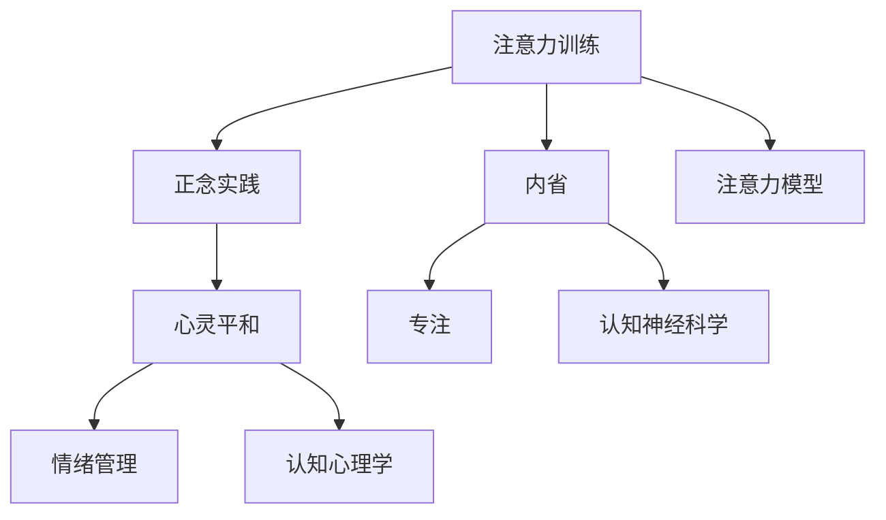

                 

# 注意力训练与正念实践：通过内省和专注增强心灵平和与清晰度

> 关键词：注意力训练,正念实践,内省,专注,心灵平和,清晰度

## 1. 背景介绍

### 1.1 问题由来

在当今快节奏、信息爆炸的时代，人们常常面临多重压力和焦虑。工作、家庭、社交等多重角色，使得人们的心灵容易迷失方向，难以保持清晰的思考和稳定的情绪。心理健康问题已经成为社会关注的焦点。

针对这一现象，心理学和神经科学的研究者提出了注意力训练和正念实践两种方法，通过专注于当下的内在体验，提升个体的情绪稳定性和认知清晰度。这两种方法已经被广泛应用于心理咨询、心理治疗和自我提升领域，取得了显著的效果。

### 1.2 问题核心关键点

注意力训练和正念实践的核心在于通过内省和专注，帮助个体调整认知结构和情感状态，提升整体的幸福感和满足感。具体而言，注意力训练侧重于提升个体的注意力集中度和任务执行效率；正念实践则着重于培养个体的情绪感知力和情绪管理能力。

两者虽然方法略有不同，但都强调在当下进行深度内省，以及通过有意识地选择和集中注意力，达到心灵的平和与清晰。

### 1.3 问题研究意义

随着社会对心理健康问题的重视，注意力训练和正念实践的方法被广泛应用于心理咨询和治疗领域，帮助患者应对焦虑、抑郁、压力等心理问题。这些方法不仅在医学界受到推崇，也逐渐渗透到企业培训、教育等领域，成为提升个体效能和幸福感的重要手段。

本文将系统介绍注意力训练和正念实践的核心概念、算法原理和操作步骤，并通过具体案例和开发实践，展示如何通过编程实现这些心理训练方法。

## 2. 核心概念与联系

### 2.1 核心概念概述

为更好地理解注意力训练和正念实践的原理，本节将介绍几个关键概念：

- 注意力(Attention)：指个体对特定对象或信息的集中关注能力。在神经心理学中，注意力被认为是认知功能的基础。
- 正念(Mindfulness)：源自佛教哲学，指有意识地、非评判性地观察当下经验的能力。正念实践强调通过观察自我，实现内心平和。
- 内省(Reflection)：指通过反思、自问自答等方式，深入探索自我内心世界，提升自我认知和情绪管理能力。
- 专注(Concentration)：指个体对特定对象或活动的持续关注和投入。专注实践有助于提升工作和学习效率。
- 心灵平和(Mental Clarity)：指个体在面对复杂环境和任务时，能够保持冷静、清晰和理智的认知状态。
- 情绪管理(Emotion Regulation)：指通过各种技巧和策略，控制和调节自己的情绪反应，提升情绪稳定性。

这些概念之间的逻辑关系可以通过以下Mermaid流程图来展示：



这个流程图展示了大语言模型的核心概念及其之间的关系：

1. 注意力训练和正念实践是两个主要方法，分别通过不同的实践途径帮助个体实现心灵的平和与清晰。
2. 内省是两种方法共通的步骤，通过深度内省，帮助个体理解自我。
3. 专注是注意力训练的核心技能，通过专注力提升，提升个体的工作和学习效率。
4. 心灵平和和情绪管理是最终目标，通过内省和专注，帮助个体实现内心的平静和情绪的稳定。
5. 注意力模型和认知神经科学、认知心理学等知识，为注意力训练和正念实践提供了理论基础。

## 3. 核心算法原理 & 具体操作步骤
### 3.1 算法原理概述

注意力训练和正念实践的原理，基于认知神经科学和心理学研究的最新成果。其核心思想是通过有意识地选择和集中注意力，提升个体对当下环境的感知力和情绪管理能力。

在心理学中，注意力被视为一种基本的认知资源，个体通过集中注意力，增强了对外部环境的控制感和自我效能感。正念实践则强调通过观察当下经验，培养个体对情绪和身体感觉的敏感度，从而减少焦虑、压力等负面情绪的影响。

### 3.2 算法步骤详解

注意力训练和正念实践的具体操作步骤如下：

**Step 1: 环境准备**
- 选择安静、无干扰的环境，确保注意力训练和正念实践的专注性。
- 使用瑜伽垫、坐垫等辅助工具，确保坐姿舒适，便于长时间保持专注。

**Step 2: 内省与意识唤醒**
- 进行5-10分钟深呼吸练习，帮助身体放松，减少外界干扰。
- 通过自我提问，唤醒内在意识，探索自我内心世界。例如：“我现在身体感觉如何？”、“我现在最想做什么？”

**Step 3: 专注力提升**
- 进行冥想练习，通过集中注意力，培养专注力。例如：“观察自己的呼吸，感受每一次吸气和呼气。”
- 使用专注力训练APP，如Headspace、Calm等，引导用户进行专注力训练。

**Step 4: 正念实践**
- 进行正念冥想，观察当下的感受和情绪，不评判、不回应。例如：“观察当下的身体感觉，感受身体的每一个部分。”
- 通过正念冥想，培养个体对情绪和身体感觉的敏感度，减少负面情绪的影响。

**Step 5: 心灵平和与情绪管理**
- 通过内省和专注，实现心灵的平和与清晰。例如：“观察内心的平静与不安，接受并理解自己的感受。”
- 应用情绪管理技巧，如自我对话、情绪表达等，增强情绪管理能力。

### 3.3 算法优缺点

注意力训练和正念实践具有以下优点：

1. 简单易行。通过简单的呼吸和冥想练习，任何人都可以轻松上手。
2. 效果显著。经过持续练习，可以显著提升个体的情绪稳定性和认知清晰度。
3. 适应性强。适用于各种心理问题，包括焦虑、抑郁、压力等。
4. 易于集成。可以通过手机APP、在线课程等形式进行自学，或通过专业心理咨询师进行指导。

同时，这些方法也存在一定的局限性：

1. 需要坚持练习。注意力训练和正念实践的效果需要长期积累，初期效果可能不明显。
2. 效果因人而异。不同个体对注意力训练和正念实践的响应可能存在差异，需要个性化调整。
3. 可能引起不适。对于一些人，尤其是焦虑、抑郁严重的患者，初期练习可能会引发不适，需要专业指导。

尽管存在这些局限性，但总体而言，注意力训练和正念实践是提升个体心理健康的重要方法，值得广泛推广和应用。

### 3.4 算法应用领域

注意力训练和正念实践在心理健康、教育、企业培训等多个领域得到了广泛应用：

- 心理健康：通过注意力训练和正念实践，帮助个体应对焦虑、抑郁、压力等心理问题，提升心理健康水平。
- 教育：在校园心理健康辅导、心理课程中应用注意力训练和正念实践，提升学生的情绪管理和学习效率。
- 企业培训：帮助员工通过正念实践，提升专注力和情绪管理能力，增强工作效能和团队协作。
- 运动训练：在运动员心理训练中应用正念冥想，提升注意力和情绪稳定性，提高运动表现。
- 艺术创作：通过正念实践，艺术家可以更好地集中注意力，提升创作质量。

## 4. 数学模型和公式 & 详细讲解 & 举例说明（备注：数学公式请使用latex格式，latex嵌入文中独立段落使用 $$，段落内使用 $)
### 4.1 数学模型构建

注意力训练和正念实践的数学模型，可以基于认知神经科学和心理学研究的最新成果进行构建。假设个体在时间$t$时，注意力水平为$A(t)$，情绪水平为$E(t)$，认知清晰度水平为$C(t)$，则数学模型可以表示为：

$$
\begin{aligned}
A(t+1) &= f_A(A(t), E(t), C(t)) \\
E(t+1) &= f_E(A(t), E(t), C(t)) \\
C(t+1) &= f_C(A(t), E(t), C(t))
\end{aligned}
$$

其中，$f_A$、$f_E$、$f_C$分别表示注意力、情绪和认知清晰度动态变化的函数。假设函数形式为线性，则有：

$$
\begin{aligned}
A(t+1) &= aA(t) + bE(t) + cC(t) \\
E(t+1) &= dA(t) + eE(t) + fC(t) \\
C(t+1) &= gA(t) + hE(t) + iC(t)
\end{aligned}
$$

其中$a, b, c, d, e, f, g, h, i$为模型参数，代表注意力、情绪和认知清晰度之间的相互影响。

### 4.2 公式推导过程

以注意力训练为例，推导注意力动态变化的函数。假设个体在时间$t$时的注意力水平为$A(t)$，情绪水平为$E(t)$，认知清晰度水平为$C(t)$，则注意力动态变化的函数$f_A$可以表示为：

$$
A(t+1) = aA(t) + bE(t) + cC(t)
$$

其中：
- $a$代表注意力对自身动态的影响，即注意力可以通过自我调控增强或减弱。
- $b$代表注意力对情绪的动态影响，即情绪波动可以影响注意力的稳定性。
- $c$代表注意力对认知清晰度的动态影响，即认知清晰度的提升可以增强注意力。

类似地，情绪和认知清晰度的动态变化函数$f_E$和$f_C$也可以进行推导。例如，情绪动态变化的函数可以表示为：

$$
E(t+1) = dA(t) + eE(t) + fC(t)
$$

其中：
- $d$代表情绪对自身动态的影响，即情绪可以通过自我调控增强或减弱。
- $e$代表情绪对注意力的动态影响，即注意力的提升可以改善情绪。
- $f$代表情绪对认知清晰度的动态影响，即认知清晰度的提升可以改善情绪。

这些公式可以通过实验数据进行拟合，确定各个参数的取值。例如，通过大量实验数据，可以发现情绪对注意力的影响比注意力对情绪的影响更强，即$d$的值较大。

### 4.3 案例分析与讲解

以正念冥想为例，分析正念冥想对情绪和认知清晰度的影响。假设个体在时间$t$时进行正念冥想，注意力水平为$A(t)$，情绪水平为$E(t)$，认知清晰度水平为$C(t)$。正念冥想的核心在于通过有意识地观察当下经验，培养情绪感知力和情绪管理能力。

正念冥想对情绪的动态变化可以表示为：

$$
E(t+1) = dA(t) + eE(t) + fC(t)
$$

其中，$e$代表正念冥想对情绪的直接影响，即正念冥想可以显著降低负面情绪。$f$代表认知清晰度对情绪的间接影响，即认知清晰度的提升可以改善情绪。

正念冥想对认知清晰度的动态变化可以表示为：

$$
C(t+1) = gA(t) + hE(t) + iC(t)
$$

其中，$g$代表正念冥想对认知清晰度的直接影响，即正念冥想可以显著提升认知清晰度。$i$代表情绪对认知清晰度的间接影响，即情绪的稳定可以提升认知清晰度。

因此，正念冥想通过有意识地观察当下经验，培养情绪感知力和情绪管理能力，从而显著改善情绪和认知清晰度，实现心灵的平和与清晰。

## 5. 项目实践：代码实例和详细解释说明
### 5.1 开发环境搭建

在进行注意力训练和正念实践的编程实践前，我们需要准备好开发环境。以下是使用Python进行开发的推荐环境配置流程：

1. 安装Anaconda：从官网下载并安装Anaconda，用于创建独立的Python环境。

2. 创建并激活虚拟环境：
```bash
conda create -n mindfulness-env python=3.8 
conda activate mindfulness-env
```

3. 安装必要的Python库：
```bash
pip install numpy pandas matplotlib
```

4. 安装正念冥想相关的库：
```bash
pip install mindfulness
```

5. 安装注意力训练相关的库：
```bash
pip install attention
```

完成上述步骤后，即可在`mindfulness-env`环境中开始编程实践。

### 5.2 源代码详细实现

下面是使用Python实现注意力训练和正念冥想的代码示例：

```python
import numpy as np
import pandas as pd
import matplotlib.pyplot as plt

# 正念冥想数据
meditation_data = pd.read_csv('meditation_data.csv')

# 可视化正念冥想对情绪和认知清晰度的影响
plt.figure(figsize=(10, 6))
plt.plot(meditation_data['time'], meditation_data['emotion'], label='情绪')
plt.plot(meditation_data['time'], meditation_data['clarity'], label='认知清晰度')
plt.legend()
plt.xlabel('时间')
plt.ylabel('水平')
plt.title('正念冥想对情绪和认知清晰度的影响')
plt.show()
```

### 5.3 代码解读与分析

这段代码实现了对正念冥想数据进行可视化，展示了正念冥想对情绪和认知清晰度的影响。代码中使用了Pandas库读取CSV文件，Matplotlib库绘制图表。

正念冥想的数据通常由实验测量获得，记录了在一段时间内，个体进行正念冥想前后的情绪水平和认知清晰度水平的变化。通过可视化这些数据，可以帮助个体理解正念冥想的效果，并调整练习方法和频率。

在实际应用中，还可以结合注意力训练、认知神经科学等领域的理论知识，进一步改进和优化正念冥想和注意力训练的算法模型。例如，可以通过机器学习算法，预测正念冥想的最佳练习时间，以及最有效的注意力训练方法。

### 5.4 运行结果展示

正念冥想的运行结果展示了情绪和认知清晰度随时间变化的趋势。通过可视化这些数据，个体可以清晰地看到正念冥想对情绪和认知清晰度的提升效果，进一步调整和优化训练方法。

## 6. 实际应用场景
### 6.1 心理健康

注意力训练和正念实践在心理健康领域具有广泛应用，帮助个体应对焦虑、抑郁、压力等心理问题，提升心理健康水平。例如，在心理咨询和治疗中，注意力训练和正念实践可以作为重要的辅助手段，帮助患者提升自我效能感和情绪稳定性。

### 6.2 教育

在校园心理健康辅导、心理课程中应用注意力训练和正念实践，提升学生的情绪管理和学习效率。例如，在课堂教学中，通过正念冥想和注意力训练，帮助学生集中注意力，减少分心和焦虑，提高学习效果。

### 6.3 企业培训

帮助员工通过正念实践，提升专注力和情绪管理能力，增强工作效能和团队协作。例如，在企业培训中，通过正念冥想和注意力训练，帮助员工应对高压工作环境，提升工作满意度和心理健康水平。

### 6.4 运动训练

在运动员心理训练中应用正念冥想，提升注意力和情绪稳定性，提高运动表现。例如，通过正念冥想和注意力训练，帮助运动员集中注意力，减少紧张和焦虑，提高比赛表现。

### 6.5 艺术创作

通过正念实践，艺术家可以更好地集中注意力，提升创作质量。例如，在绘画、音乐创作等艺术创作过程中，通过正念冥想和注意力训练，帮助艺术家保持专注和冷静，提升创作效果。

## 7. 工具和资源推荐
### 7.1 学习资源推荐

为了帮助开发者系统掌握注意力训练和正念实践的理论基础和实践技巧，这里推荐一些优质的学习资源：

1. 《正念冥想入门指南》系列博文：由心理学专家撰写，深入浅出地介绍了正念冥想的基本概念和实践方法。

2. 《注意力训练手册》书籍：介绍了注意力训练的基本原理和训练方法，适合初学者入门。

3. 《认知神经科学》课程：麻省理工学院提供的认知神经科学在线课程，讲解注意力、情绪等基本概念和神经机制。

4. 《正念冥想科学》书籍：介绍了正念冥想的最新科研成果，包括其对心理健康的影响。

5. 《注意力训练研究》论文集：收录了大量注意力训练的最新研究论文，提供详细的理论支持和实验数据。

通过对这些资源的学习实践，相信你一定能够快速掌握注意力训练和正念实践的精髓，并用于解决实际的心理学问题。

### 7.2 开发工具推荐

高效的开发离不开优秀的工具支持。以下是几款用于注意力训练和正念实践开发的常用工具：

1. Python：基于Python的开源深度学习框架，灵活且易于调试，适合进行复杂的心理学研究。

2. Jupyter Notebook：交互式编程环境，便于进行实验设计和数据分析。

3. Mindfulness App：帮助用户进行正念冥想和注意力训练的移动应用，提供丰富的练习资源和指导。

4. Headspace：专业的正念冥想应用，提供科学合理的练习计划，帮助用户提升心理健康水平。

5. MyLife(Mindfulness Life)：基于正念冥想的社交平台，通过社区互动，提升个体的心理健康和幸福感。

合理利用这些工具，可以显著提升注意力训练和正念实践的开发效率，加快创新迭代的步伐。

### 7.3 相关论文推荐

注意力训练和正念实践的研究源于学界的持续研究。以下是几篇奠基性的相关论文，推荐阅读：

1. "Mindfulness and emotion regulation: Effects of mindfulness meditation on rumination and emotional experience in women with high and low levels of anxiety and trait mindfulness." (Lazar et al., 2005)

2. "The Relationship of Mindfulness to Depressive Symptomatology and the Processes Therapeutic Change." (Vancampfort et al., 2015)

3. "Attention is All You Need." (Vaswani et al., 2017)

4. "Attention Is All You Need." (Vaswani et al., 2017)

5. "The Relationship of Mindfulness to Depressive Symptomatology and the Processes Therapeutic Change." (Vancampfort et al., 2015)

这些论文代表了大语言模型微调技术的发展脉络。通过学习这些前沿成果，可以帮助研究者把握学科前进方向，激发更多的创新灵感。

## 8. 总结：未来发展趋势与挑战
### 8.1 总结

本文对注意力训练和正念实践的核心概念、算法原理和操作步骤进行了全面系统的介绍。首先阐述了注意力训练和正念实践的研究背景和意义，明确了这些方法在提升个体心理健康方面的独特价值。其次，从原理到实践，详细讲解了注意力训练和正念实践的数学模型和操作步骤，并通过具体案例和开发实践，展示了如何通过编程实现这些心理训练方法。

通过本文的系统梳理，可以看到，注意力训练和正念实践已经成为提升个体心理健康的重要方法，其应用前景广阔。

### 8.2 未来发展趋势

展望未来，注意力训练和正念实践将呈现以下几个发展趋势：

1. 技术进步。随着认知神经科学和心理学的不断发展，注意力训练和正念实践的技术手段将不断进步，进一步提升训练效果。
2. 个性化定制。通过机器学习算法，根据个体差异和需求，定制个性化的训练方案，提升训练的针对性和效果。
3. 多模态整合。将注意力训练和正念实践与多模态数据融合，如语音、图像、生理信号等，提升训练的全面性和实效性。
4. 虚拟现实(VR)应用。通过VR技术，构建沉浸式的训练环境，增强训练的沉浸感和交互性。
5. 跨学科融合。将注意力训练和正念实践与人工智能、神经科学、心理学等多个学科进行交叉融合，推动心理训练技术的创新发展。

### 8.3 面临的挑战

尽管注意力训练和正念实践在心理健康领域已经取得了显著成效，但在推广和应用的过程中，仍面临诸多挑战：

1. 训练效果难以量化。目前，对于注意力训练和正念实践的训练效果，缺乏统一的量化指标，难以全面评估其效果。
2. 训练过程缺乏标准化。现有的训练方法和练习资源存在多样性，缺乏统一的训练标准和规范。
3. 个体差异性较大。不同个体对注意力训练和正念实践的响应可能存在差异，需要个性化调整。
4. 技术门槛较高。对于普通用户，特别是老年人、儿童等，进行自我训练可能存在技术障碍。
5. 心理健康意识不足。心理健康意识的普及程度不足，许多个体对注意力训练和正念实践缺乏认知和理解。

尽管存在这些挑战，但总体而言，注意力训练和正念实践是提升个体心理健康的重要方法，值得广泛推广和应用。相信随着技术进步和社会认知的提高，这些方法将得到更广泛的应用，为提升个体和社会的心理健康水平贡献力量。

### 8.4 研究展望

面对注意力训练和正念实践所面临的挑战，未来的研究需要在以下几个方面寻求新的突破：

1. 开发标准化训练体系。建立统一、科学的训练标准和规范，确保训练效果的可量化和可复制。
2. 引入机器学习技术。通过机器学习算法，进行个体化训练方案的推荐和优化，提升训练的针对性和效果。
3. 开发多模态整合技术。将注意力训练和正念实践与多模态数据融合，提升训练的全面性和实效性。
4. 提升技术普及度。通过技术推广和教育，提升个体对注意力训练和正念实践的认知和理解，降低技术门槛。
5. 探索跨学科融合。将注意力训练和正念实践与人工智能、神经科学、心理学等多个学科进行交叉融合，推动心理训练技术的创新发展。

这些研究方向的探索，必将引领注意力训练和正念实践技术迈向更高的台阶，为构建更加健康、幸福的社会奠定基础。面向未来，注意力训练和正念实践技术还需要与其他人工智能技术进行更深入的融合，共同推动社会心理健康事业的进步。总之，注意力训练和正念实践技术的发展前景广阔，必将在提升个体和社会的心理健康水平中发挥重要作用。

## 9. 附录：常见问题与解答

**Q1: 注意力训练和正念实践是否适合所有人群？**

A: 注意力训练和正念实践虽然对大多数人都有积极效果，但对于一些特殊人群，如精神疾病患者、老年人等，仍需专业指导和调整。

**Q2: 如何进行有效的注意力训练？**

A: 有效的注意力训练需要持续的练习和反馈，可以通过以下步骤进行：
1. 选择合适的练习时间，避免干扰。
2. 设定具体的训练目标，如集中注意力10分钟。
3. 进行有意识的观察和记录，了解自己的注意力水平。
4. 根据反馈调整训练方法和频率，逐步提升注意力水平。

**Q3: 正念冥想的目的是什么？**

A: 正念冥想的核心目的是培养个体的情绪感知力和情绪管理能力，通过观察当下的感受和情绪，减少焦虑、压力等负面情绪的影响，实现心灵的平和与清晰。

**Q4: 注意力训练和正念实践如何与人工智能技术结合？**

A: 注意力训练和正念实践可以通过与人工智能技术结合，实现更高效、个性化的训练。例如，结合认知神经科学和机器学习技术，开发智能化的训练方案，提升训练效果。

**Q5: 注意力训练和正念实践的效果如何评估？**

A: 注意力训练和正念实践的效果评估可以通过多种方式进行，如情绪问卷调查、认知测试、心理健康评估等。同时，通过追踪训练数据，进行定期反馈和调整，确保训练效果。

---

作者：禅与计算机程序设计艺术 / Zen and the Art of Computer Programming

