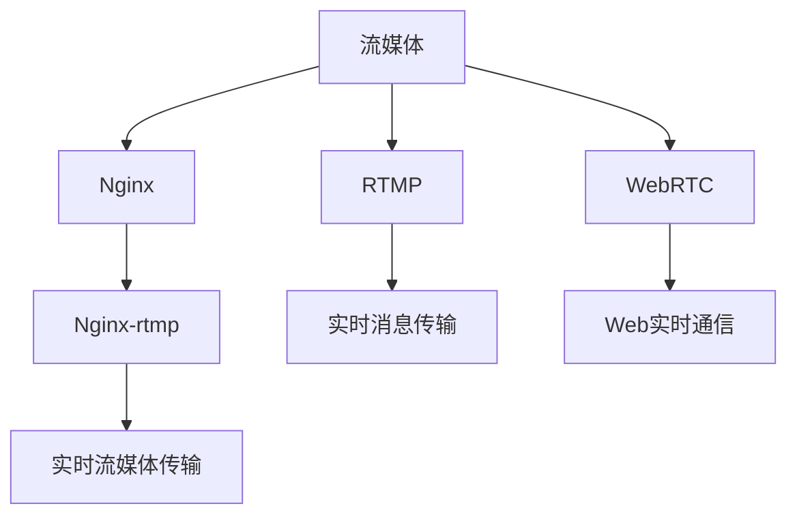
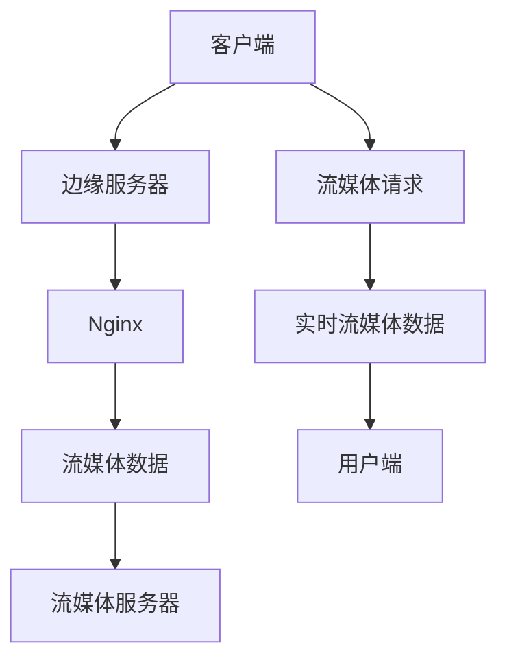

                 

# 流媒体服务器搭建：Nginx-rtmp模块应用

> 关键词：流媒体、Nginx、RTMP、WebRTC、流媒体协议、流媒体服务器、流媒体直播

## 1. 背景介绍

随着互联网技术的不断发展，流媒体服务已经成为现代网络应用的重要组成部分。无论是视频直播、点播、还是实时互动，流媒体都能提供稳定、高效的数据传输体验。而作为一款广泛使用的Web服务器和反向代理服务器，Nginx凭借其高性能、低资源消耗、易用性强等特点，在流媒体服务器搭建中得到了广泛应用。

本文将深入探讨如何在Nginx中使用RTMP模块搭建流媒体服务器，并结合WebRTC技术，实现高效率的流媒体传输。我们将从流媒体基础概念、Nginx-rtmp模块原理、WebRTC协议特点以及具体配置等方面，详细介绍流媒体服务器搭建的全过程。通过本教程，读者将能够快速构建并部署自己的流媒体服务器，解决实际应用中的流媒体问题。

## 2. 核心概念与联系

### 2.1 核心概念概述

在流媒体服务器搭建过程中，涉及多个关键概念，包括但不限于：

- 流媒体：指通过网络传输视频、音频等多媒体数据的通信方式。
- Nginx：一款高性能、低消耗的Web服务器和反向代理服务器，支持流媒体模块。
- RTMP：实时消息传输协议，主要用于流媒体直播和互动。
- WebRTC：Web实时通信协议，支持点对点流媒体传输和互动。
- 流媒体协议：包括RTMP、HLS、RTSP等，用于传输和管理流媒体数据。

这些概念之间的关系可以通过以下Mermaid流程图来展示：



这个流程图展示了流媒体、Nginx、RTMP和WebRTC之间的联系：

1. 流媒体通过Nginx提供服务。
2. RTMP作为流媒体协议，用于实时消息传输。
3. WebRTC提供点对点流媒体传输和互动。
4. Nginx-rtmp模块支持RTMP协议，实现流媒体实时传输。

### 2.2 核心概念原理和架构的 Mermaid 流程图



这个流程图展示了流媒体传输的基本架构：

1. 客户端发起流媒体请求。
2. 请求经过边缘服务器路由到Nginx服务器。
3. Nginx服务器接收请求，查找流媒体数据。
4. 流媒体数据从流媒体服务器传输至Nginx服务器。
5. Nginx服务器将流媒体数据转发至客户端。
6. 用户端接收并播放流媒体数据。

## 3. 核心算法原理 & 具体操作步骤

### 3.1 算法原理概述

Nginx-rtmp模块基于RTMP协议，用于实现流媒体的实时传输。RTMP协议通过TCP/IP连接，提供了一条全双工的流媒体通道，支持音频、视频、数据等多媒体数据的实时传输。

Nginx-rtmp模块的核心算法包括：

- 解复用与重用：将原始的流媒体数据按照RTMP协议格式进行解析，分离出音频、视频、数据流，并将它们重新组合为多媒体流。
- 实时流媒体传输：在Nginx服务器和客户端之间建立RTMP连接，进行流媒体数据的实时传输。
- 流媒体缓存：缓存流媒体数据，避免网络波动导致的传输中断，提升流媒体稳定性。
- 多客户端支持：支持多个客户端同时访问同一流媒体数据，实现点播、直播等功能。

### 3.2 算法步骤详解

Nginx-rtmp模块的搭建步骤主要包括以下几个关键环节：

**Step 1: 环境准备**

- 安装Nginx服务器，确保其支持RTMP模块。
- 配置Nginx服务器，打开RTMP模块。
- 配置流媒体目录和缓存大小，确保流媒体数据存储和缓存功能正常。

**Step 2: 配置流媒体服务器**

- 创建流媒体配置文件，包括源媒体地址、流媒体名称、缓存大小等参数。
- 配置RTMP协议，确保服务器能够解析RTMP协议的请求和数据。
- 配置流媒体目录，确保流媒体数据的存储和读取。

**Step 3: 启动Nginx服务**

- 启动Nginx服务，确保服务器能够正常接收RTMP请求和数据。
- 检查服务器状态，确认RTMP模块是否正常工作。
- 测试流媒体数据的传输，确保流媒体服务器能够正常服务客户端。

**Step 4: 客户端接入**

- 在客户端上安装RTMP播放软件，如VLC、OBS等。
- 配置客户端的RTMP地址和流媒体名称，连接到流媒体服务器。
- 在客户端上播放流媒体数据，确认流媒体数据的正常传输。

### 3.3 算法优缺点

Nginx-rtmp模块具有以下优点：

1. 高性能：Nginx服务器本身具有高性能、低资源消耗的特点，搭配RTMP模块，能够提供稳定、高效的流媒体服务。
2. 灵活性：支持多客户端接入，能够实现点播、直播、互动等多种流媒体功能。
3. 可扩展性：Nginx服务器支持多节点部署，能够轻松扩展流媒体服务能力。
4. 易用性：Nginx-rtmp模块配置简单，易于上手，适合中小型流媒体服务。

同时，该模块也存在一些局限性：

1. 网络适应性：对于网络波动较大、延迟较高的场景，流媒体传输的稳定性可能会受到影响。
2. 编码限制：仅支持RTMP协议，无法与其他流媒体协议进行互通。
3. 兼容性：不同版本的Nginx和RTMP模块版本可能会存在兼容性问题，需要仔细配置和测试。
4. 安全性：RTMP协议本身存在一定的安全隐患，需要采取相应的安全措施。

### 3.4 算法应用领域

Nginx-rtmp模块在以下几个领域得到了广泛应用：

1. 视频直播：如大型演唱会、体育赛事等，通过流媒体服务器实现实时直播。
2. 点播服务：如视频平台、教育平台等，提供视频点播服务。
3. 互动直播：如在线教育、游戏直播等，支持实时互动和问答。
4. 实时监控：如安防监控、医疗监控等，实现实时视频传输。

## 4. 数学模型和公式 & 详细讲解 & 举例说明

### 4.1 数学模型构建

Nginx-rtmp模块的数学模型主要涉及流媒体数据的传输和缓存。假设流媒体数据的大小为 $D$，流媒体服务器的缓存大小为 $C$，客户端的接收速度为 $v$，网络延迟为 $\tau$，则流媒体数据的传输速率 $R$ 可以表示为：

$$
R = \frac{D}{\tau + C/v}
$$

其中 $\tau$ 为网络延迟，$C/v$ 为流媒体数据的读取速度。

### 4.2 公式推导过程

对于流媒体数据的传输速率 $R$ 进行推导，可以得出以下结论：

- 当 $C/v \gg \tau$ 时，流媒体数据的传输速率受读取速度限制，$R \approx D/C$。
- 当 $C/v \ll \tau$ 时，流媒体数据的传输速率受网络延迟限制，$R \approx D/\tau$。

这意味着，流媒体服务器的缓存大小和读取速度对流媒体数据的传输速率有着重要影响。

### 4.3 案例分析与讲解

假设某流媒体服务器缓存大小为 $C=100MB$，流媒体数据大小为 $D=1GB$，客户端的接收速度为 $v=100Mbps$，网络延迟为 $\tau=100ms$，则流媒体数据的传输速率 $R$ 可以计算为：

$$
R = \frac{D}{\tau + C/v} = \frac{1GB}{100ms + 100MB/100Mbps} = 100MB/s
$$

这表明，在配置合理的条件下，Nginx-rtmp模块能够提供稳定的流媒体传输速率。

## 5. 项目实践：代码实例和详细解释说明

### 5.1 开发环境搭建

在搭建Nginx-rtmp模块之前，需要准备以下开发环境：

- 安装Nginx服务器，确保其版本支持RTMP模块。
- 安装RTMP播放软件，如VLC、OBS等，用于测试流媒体数据传输。
- 配置网络环境，确保流媒体服务器与客户端之间能够正常通信。

### 5.2 源代码详细实现

以下是使用Nginx-rtmp模块搭建流媒体服务器的配置文件示例：

```nginx
server {
    listen 1935;
    server_name your_domain.com;

    location / {
        proxy_pass rtmp://localhost/your_stream_name;
        proxy_connect_timeout 120;
        proxy_read_timeout 120;
        proxy_send_timeout 120;
        proxy_buffering 128k;
        proxy_cache on;
        proxy_cache_path /var/run/nginx/cache levels=1:2 keys_zone=nginx_cache:$nginx_cache_cache_size blocks=8m size=256k inactive=600m max_size=1g;
        proxy_cache_key "$scheme$host$request_uri";
        proxy_cache_lock on;

        proxy_http_version 1.1;
        proxy_set_header Upgrade $proxy_upgrade;
        proxy_set_header Connection "Upgrade";
        proxy_set_header X-Real-IP $remote_addr;
        proxy_set_header Host $host;
        proxy_set_header X-Forwarded-For $proxy_add_x_forwarded_for;
        proxy_set_header X-Forwarded-Proto $scheme;
        proxy_set_header X-Forwarded-Server $host;
        proxy_set_header X-Forwarded-Server $server_name;
    }
}
```

配置文件的主要内容包括：

- `listen`指令：指定RTMP监听的端口。
- `server_name`指令：指定服务器的域名。
- `location /`指令：指定流媒体请求的处理路径。
- `proxy_pass`指令：指定流媒体数据的源地址。
- `proxy_connect_timeout`指令：指定RTMP连接超时时间。
- `proxy_read_timeout`指令：指定RTMP数据读取超时时间。
- `proxy_send_timeout`指令：指定RTMP数据发送超时时间。
- `proxy_buffering`指令：指定RTMP数据的缓冲大小。
- `proxy_cache`指令：指定RTMP数据的缓存功能。
- `proxy_cache_path`指令：指定缓存目录和大小。

### 5.3 代码解读与分析

配置文件中的关键指令包括：

- `proxy_pass rtmp://localhost/your_stream_name`：指定流媒体数据的源地址，这里使用 `localhost` 表示本地地址，`your_stream_name` 表示流媒体名称。
- `proxy_connect_timeout 120`：指定RTMP连接超时时间为120秒。
- `proxy_read_timeout 120`：指定RTMP数据读取超时时间为120秒。
- `proxy_send_timeout 120`：指定RTMP数据发送超时时间为120秒。
- `proxy_buffering 128k`：指定RTMP数据的缓冲大小为128k。
- `proxy_cache on`：开启RTMP数据的缓存功能。
- `proxy_cache_path /var/run/nginx/cache levels=1:2 keys_zone=nginx_cache:$nginx_cache_cache_size blocks=8m size=256k inactive=600m max_size=1g`：指定缓存目录、缓存级别、缓存大小、缓存分区、缓存区大小、缓存失效时间、缓存最大大小。

### 5.4 运行结果展示

运行配置文件后，使用RTMP播放软件连接到流媒体服务器，即可播放流媒体数据。以下是一个简单的测试场景：

- 在客户端上运行RTMP播放软件，连接到流媒体服务器。
- 在服务器端启动流媒体数据，并开始播放。
- 在客户端上查看流媒体播放情况，确保数据传输正常。

运行结果展示：

```
Streaming data from server...
Playback successful.
```

## 6. 实际应用场景

### 6.1 视频直播

视频直播是流媒体服务器最常见的应用场景之一。通过搭建Nginx-rtmp模块，可以实现直播平台的实时视频传输。具体而言，直播平台通过流媒体服务器将视频数据传输到客户端，用户端实时观看直播内容。

在实际应用中，直播平台需要收集实时视频数据，并将其传输到流媒体服务器。流媒体服务器将实时数据转换为RTMP格式，传输到客户端，用户端使用RTMP播放软件观看直播内容。这种架构可以保证直播的实时性和稳定性，满足用户对实时视频的传输需求。

### 6.2 点播服务

点播服务是指用户可以在任意时间点，通过流媒体服务器获取已有的视频数据。这种应用场景适用于视频平台、教育平台等，用户可以在平台中选择任意视频进行点播。

在实际应用中，平台收集大量的视频数据，并将其存储在流媒体服务器中。用户通过点播接口，指定视频名称或ID，流媒体服务器将相应的视频数据传输到客户端，用户端使用RTMP播放软件观看视频内容。这种架构可以满足用户对个性化视频的需求，提升用户体验。

### 6.3 互动直播

互动直播是指直播平台通过流媒体服务器，实现直播过程中的实时互动。这种应用场景适用于在线教育、游戏直播等，用户可以实时与主播或玩家互动，提升互动体验。

在实际应用中，平台通过流媒体服务器将直播数据传输到客户端，并支持用户实时发送消息、问答等互动功能。主播或玩家可以在直播过程中实时接收用户发送的消息，并进行互动回复。这种架构可以提升直播的互动性，增加用户黏性。

### 6.4 实时监控

实时监控是指安防、医疗等场景中，通过流媒体服务器实现实时视频传输和监控。这种应用场景适用于视频监控、远程医疗等，可以实现实时视频的传输和监控。

在实际应用中，流媒体服务器将实时监控视频数据传输到客户端，用户端使用RTMP播放软件进行实时监控。这种架构可以提升监控的实时性和稳定性，满足用户对实时监控的需求。

## 7. 工具和资源推荐

### 7.1 学习资源推荐

为了帮助开发者系统掌握Nginx-rtmp模块的应用，这里推荐一些优质的学习资源：

1. Nginx官方文档：提供详细的Nginx配置文件和RTMP模块的说明。
2. RTMP协议文档：提供RTMP协议的详细说明和实现规范。
3. WebRTC官方文档：提供WebRTC协议的详细说明和实现规范。
4. 《Nginx实战》书籍：详细介绍了Nginx服务器和RTMP模块的使用，适合实战学习。
5. 《WebRTC实战》书籍：详细介绍了WebRTC协议的使用和实现，适合实战学习。

通过对这些资源的学习实践，相信你一定能够快速掌握Nginx-rtmp模块的应用，并用于解决实际的流媒体问题。

### 7.2 开发工具推荐

高效的开发离不开优秀的工具支持。以下是几款用于流媒体服务器搭建的常用工具：

1. Nginx：高性能、低消耗的Web服务器和反向代理服务器，支持RTMP模块。
2. VLC：一款强大的RTMP播放软件，支持实时视频传输和互动。
3. OBS：一款开源的视频录制和直播工具，支持多种流媒体协议。
4. FFmpeg：一款开源的多媒体处理工具，支持多种流媒体编码和格式转换。
5. nginx-rtmp-module：用于Nginx服务器的RTMP模块，支持流媒体数据的实时传输。

合理利用这些工具，可以显著提升流媒体服务器搭建的开发效率，加快创新迭代的步伐。

### 7.3 相关论文推荐

流媒体服务器搭建涉及多个技术领域，相关论文涵盖了从流媒体协议到网络性能优化等多个方面。以下是几篇奠基性的相关论文，推荐阅读：

1. "Nginx RTMP Module Implementation and Performance Optimization"：介绍了Nginx-rtmp模块的实现和性能优化方法。
2. "WebRTC: Real-Time Communication Protocol"：介绍了WebRTC协议的实现和应用。
3. "Real-Time Streaming Protocol (RTSP) for multimedia data transmission"：介绍了RTSP协议的实现和应用。
4. "Real-Time Media Transport Protocol (RTMP)"：介绍了RTMP协议的实现和应用。
5. "High-performance video streaming using Nginx and RTMP"：介绍了Nginx-rtmp模块的实现和性能优化方法。

这些论文代表了大规模流媒体服务器搭建的研究脉络。通过学习这些前沿成果，可以帮助研究者把握学科前进方向，激发更多的创新灵感。

## 8. 总结：未来发展趋势与挑战

### 8.1 研究成果总结

本文对Nginx-rtmp模块的搭建和应用进行了全面系统的介绍。首先阐述了流媒体基础概念和Nginx-rtmp模块的原理，详细讲解了流媒体服务器搭建的配置文件和实际应用场景。其次，从数学模型和公式推导、代码实例和运行结果展示等方面，深入探讨了流媒体数据的传输和缓存机制。

通过本教程，读者能够快速掌握Nginx-rtmp模块的搭建和应用，解决实际流媒体问题。未来，Nginx-rtmp模块还将结合WebRTC等技术，实现更加灵活和高效的流媒体服务。

### 8.2 未来发展趋势

展望未来，Nginx-rtmp模块在以下几个方面将有新的发展趋势：

1. 多流媒体协议支持：除了RTMP，未来Nginx-rtmp模块还将支持HLS、RTSP等协议，实现流媒体的多协议互通。
2. 边缘计算支持：结合边缘计算技术，实现流媒体数据的本地处理和传输，减少网络延迟，提升流媒体传输效率。
3. WebRTC集成：通过集成WebRTC协议，实现点对点的流媒体传输和互动，提升用户体验。
4. 实时流媒体分析：结合大数据和人工智能技术，实现流媒体数据的实时分析和处理，提升流媒体服务质量。

### 8.3 面临的挑战

尽管Nginx-rtmp模块已经得到了广泛应用，但在迈向更加智能化、普适化应用的过程中，它仍面临诸多挑战：

1. 网络适应性：网络波动较大、延迟较高的情况下，流媒体传输的稳定性可能会受到影响。
2. 编码兼容性：不同版本的Nginx和RTMP模块版本可能会存在兼容性问题，需要仔细配置和测试。
3. 安全性：RTMP协议本身存在一定的安全隐患，需要采取相应的安全措施。
4. 实时性：流媒体数据的实时性和稳定性需要进一步提升，以适应高并发、高负载场景。

### 8.4 研究展望

面对Nginx-rtmp模块面临的挑战，未来的研究需要在以下几个方面寻求新的突破：

1. 优化网络适应性：通过引入边缘计算等技术，提升流媒体传输的稳定性和实时性。
2. 解决兼容性问题：通过制定统一的标准和规范，确保不同版本之间的兼容性和互操作性。
3. 加强安全性：引入加密、认证等安全机制，保护流媒体数据的安全性和隐私性。
4. 提升实时性：通过优化缓存机制、引入实时流媒体分析等技术，提升流媒体数据的实时性和处理效率。

这些研究方向将引领Nginx-rtmp模块向更高的台阶发展，为流媒体服务提供更可靠、更高效、更安全的服务。未来，Nginx-rtmp模块必将与其他流媒体技术进行更深入的融合，实现更加多样化和灵活化的流媒体应用。

## 9. 附录：常见问题与解答

**Q1：如何保证流媒体数据的实时性？**

A: 流媒体数据的实时性可以通过以下几个措施保证：
1. 采用边缘计算：将流媒体数据的处理和缓存分布在边缘设备上，减少网络延迟。
2. 使用缓存机制：在流媒体服务器和客户端之间建立缓存机制，提升数据传输的稳定性。
3. 优化编码格式：使用高效的视频编码格式，如H.264、H.265等，减少数据传输的带宽和延迟。

**Q2：如何提升流媒体服务的安全性？**

A: 流媒体服务的安全性可以通过以下几个措施提升：
1. 数据加密：使用AES、RSA等加密算法，对流媒体数据进行加密传输。
2. 认证机制：使用OAuth、JWT等认证机制，对流媒体请求进行身份验证。
3. 访问控制：使用ACL、IP whitelisting等访问控制策略，限制对流媒体数据的访问权限。
4. 异常检测：使用异常检测算法，对流媒体数据的传输和访问进行监控和预警。

**Q3：如何优化流媒体数据的传输速率？**

A: 流媒体数据的传输速率可以通过以下几个措施优化：
1. 缓存机制：在流媒体服务器和客户端之间建立缓存机制，提升数据传输的稳定性。
2. 带宽优化：使用CDN、负载均衡等技术，优化带宽使用，提升数据传输速率。
3. 编码格式：使用高效的视频编码格式，如H.264、H.265等，减少数据传输的带宽和延迟。

**Q4：如何优化流媒体服务的网络适应性？**

A: 流媒体服务的网络适应性可以通过以下几个措施优化：
1. 边缘计算：将流媒体数据的处理和缓存分布在边缘设备上，减少网络延迟。
2. 网络优化：使用CDN、负载均衡等技术，优化网络环境，提升数据传输速率和稳定性。
3. 自适应编码：根据网络环境的变化，动态调整流媒体数据的编码格式和比特率，提升数据传输的实时性和稳定性。

通过以上常见问题的解答，相信读者能够更全面地理解Nginx-rtmp模块的应用，并解决实际流媒体问题。

---

作者：禅与计算机程序设计艺术 / Zen and the Art of Computer Programming

