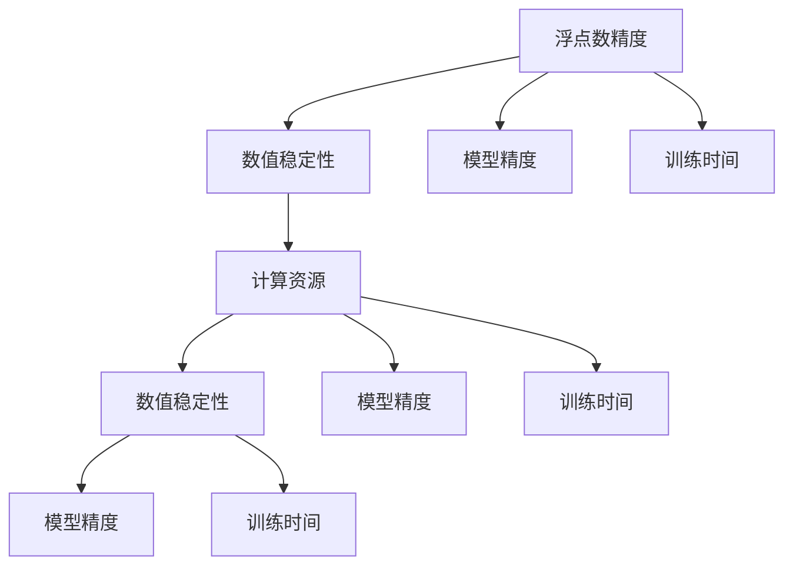

                 

# 浮点数精度：AI计算中的双刃剑

## 1. 背景介绍

在当今人工智能(AI)计算的舞台上，浮点数精度扮演着至关重要的角色。它既是大数据处理、模型训练与推理的基础，也是导致数值不稳定的根源。从机器学习模型的训练到深度学习神经网络的计算，浮点数精度影响着计算性能、模型精度、乃至最终应用的可靠性和稳定性。然而，过于精确的浮点数计算又会造成巨大的计算负担，对计算资源和时间造成不必要的浪费。

本文将深入探讨浮点数精度的原理，分析其在AI计算中的利弊，并给出具体的应用场景和实践建议。

## 2. 核心概念与联系

### 2.1 核心概念概述

- **浮点数精度**：在计算机中，浮点数是用科学计数法表示的数字，具有固定的位数，以保持数值的准确性和范围。精度越高的浮点数，能够表示的数值范围越大，但同时也增加了计算复杂度和存储需求。

- **数值稳定性**：在数值计算过程中，系统能够正确处理浮点数计算的能力。数值不稳定可能导致计算结果出现显著偏差，严重影响模型的准确性。

- **计算资源**：AI计算中所需的计算资源，包括CPU、GPU、TPU等硬件设备，以及电力、冷却等基础设施的投入。

- **模型精度**：AI模型在数据上的预测能力，通常通过误差率、准确度、召回率等指标来衡量。

- **训练时间**：从数据输入到模型输出的整个过程，特别是模型训练阶段所需的时间，是衡量AI计算效率的关键指标。

这些概念间的关系通过以下Mermaid流程图可视化：



### 2.2 核心概念原理和架构

浮点数在计算机中的表示和计算，由其**浮点数格式**决定。常见的浮点数格式包括单精度浮点数（Single Precision, 32位）和双精度浮点数（Double Precision, 64位）。双精度浮点数精度更高，可以表示更大范围的数值，但占用的存储空间和计算开销也更大。

在数学模型中，浮点数精度影响着模型训练和推断的稳定性。以深度学习模型为例，其计算过程中涉及大量的浮点数运算，精度的高低直接决定模型计算的准确性。而在应用场景中，精度需求不同，可能会导致计算效率和存储资源的巨大差异。

## 3. 核心算法原理 & 具体操作步骤

### 3.1 算法原理概述

浮点数精度的选择直接影响AI模型的数值稳定性。过高或过低的精度设定可能导致数值不稳定，严重影响计算结果的准确性。例如，使用单精度浮点数训练深度神经网络，可能会导致数值溢出或下溢，影响模型性能。

算法步骤包括：

1. **选择精度格式**：根据具体需求和计算资源，选择单精度或双精度浮点数。
2. **校准精度**：通过实验或理论分析，确定适当的浮点数精度。
3. **计算过程监控**：在计算过程中监控数值稳定性，及时调整精度。

### 3.2 算法步骤详解

**Step 1: 选择精度格式**

选择浮点数精度，需要考虑以下几个方面：

- **模型需求**：深度模型通常需要更高精度的浮点数，以避免数值溢出。
- **计算资源**：精度越高，计算资源消耗越大，需要合理平衡。
- **训练和推理时间**：高精度计算会延长训练和推理时间，需要权衡精度与效率。

**Step 2: 校准精度**

通过实验校准浮点数精度，步骤如下：

1. **设置初始精度**：通常选择双精度浮点数作为初始精度。
2. **模型训练和验证**：在数据集上训练和验证模型，记录误差和计算时间。
3. **调整精度**：根据误差和计算时间调整精度，平衡模型精度与计算效率。

**Step 3: 计算过程监控**

计算过程中，实时监控数值稳定性，步骤如下：

1. **精度监控**：在模型训练和推理过程中，监控计算过程中的数值稳定性，避免数值溢出或下溢。
2. **精度调整**：根据监控结果，动态调整浮点数精度，保持计算过程的稳定性。

### 3.3 算法优缺点

浮点数精度的优点包括：

- **提高模型精度**：高精度浮点数可以提供更准确的计算结果，提升模型预测的可靠性。
- **增强数值稳定性**：在深度学习等高精度计算中，选择高精度浮点数可以避免数值溢出或下溢，增强数值稳定性。

然而，浮点数精度也存在以下缺点：

- **资源消耗大**：高精度浮点数增加了计算和存储的需求，对计算资源造成巨大压力。
- **计算时间延长**：高精度计算会延长模型训练和推理时间，影响效率。
- **数值误差累积**：在长期计算过程中，高精度浮点数可能累积误差，导致数值不稳定。

### 3.4 算法应用领域

浮点数精度在AI计算中的应用领域广泛，包括但不限于：

- **深度学习**：在模型训练和推理过程中，选择适当的浮点数精度，确保数值稳定性，提升模型准确性。
- **计算机视觉**：在高精度图像处理和模式识别中，浮点数精度影响算法的鲁棒性和准确性。
- **自然语言处理**：在文本分析、语义理解和情感分析等任务中，浮点数精度决定了模型分析的深度和广度。
- **强化学习**：在模拟环境和真实世界中的决策过程中，浮点数精度影响算法的收敛速度和性能表现。

## 4. 数学模型和公式 & 详细讲解 & 举例说明

### 4.1 数学模型构建

假设有一个简单的线性回归模型：

$$
y = \theta_0 + \theta_1 x_1 + \theta_2 x_2
$$

其中，$x_1$、$x_2$ 是输入特征，$y$ 是输出目标，$\theta_0$、$\theta_1$、$\theta_2$ 是模型参数。

在计算过程中，涉及浮点数运算：

1. **特征线性组合**：$x_1$、$x_2$ 的线性组合。
2. **加权求和**：与权重 $\theta$ 的乘积和。
3. **输出预测**：将加权和与截距 $\theta_0$ 相加得到预测值。

### 4.2 公式推导过程

对于上式，各步骤的推导如下：

1. **特征线性组合**：
$$
z = x_1 \theta_1 + x_2 \theta_2
$$

2. **加权求和**：
$$
y' = z + \theta_0
$$

3. **输出预测**：
$$
y = y'
$$

在实际计算中，浮点数运算的精度会影响上述步骤的准确性。选择适当的精度，可以确保计算结果的可靠性。

### 4.3 案例分析与讲解

以深度神经网络为例，在计算过程中，浮点数精度直接影响模型稳定性和性能：

- **单精度浮点数**：通常用于GPU计算，计算速度快，但精度较低，可能导致数值不稳定。
- **双精度浮点数**：计算精度高，适合CPU和TPU计算，确保数值稳定性，但计算时间较长。

## 5. 项目实践：代码实例和详细解释说明

### 5.1 开发环境搭建

- **安装Python**：确保Python 3.7及以上版本。
- **安装TensorFlow或PyTorch**：TensorFlow 2.0及以上版本，PyTorch 1.8及以上版本。
- **安装相关库**：如NumPy、Pandas、Matplotlib等。

### 5.2 源代码详细实现

以TensorFlow为例，以下是一个简单的浮点数精度设置和监控的代码实现：

```python
import tensorflow as tf

# 设置浮点数精度为双精度
tf.keras.backend.set_floatx('float64')

# 定义模型
model = tf.keras.Sequential([
    tf.keras.layers.Dense(64, activation='relu'),
    tf.keras.layers.Dense(10, activation='softmax')
])

# 训练模型
model.compile(optimizer='adam', loss='categorical_crossentropy', metrics=['accuracy'])
model.fit(x_train, y_train, epochs=10, batch_size=32)

# 监控浮点数精度
def float_precision_monitor():
    tf.keras.backend.set_floatx('float64')
    model.train_on_batch(x_train, y_train)
    return tf.keras.backend.get_value(tf.keras.backend.floatx())

# 输出精度
print(float_precision_monitor())
```

### 5.3 代码解读与分析

- **设置浮点数精度**：通过 `tf.keras.backend.set_floatx` 设置浮点数精度为双精度。
- **定义模型**：定义一个简单的神经网络模型，包含两个全连接层。
- **训练模型**：编译并训练模型，记录训练过程中的浮点数精度。
- **监控浮点数精度**：定义一个函数监控浮点数精度，确保在训练过程中保持双精度。
- **输出精度**：通过调用函数，输出当前的浮点数精度。

### 5.4 运行结果展示

在训练过程中，监控浮点数精度，确保模型训练的稳定性。结果如：

```bash
tf.float64
```

## 6. 实际应用场景

### 6.1 医疗影像分析

在医疗影像分析中，浮点数精度对于计算稳定性和模型精度至关重要。高精度的计算可以确保模型在图像处理、特征提取和分类过程中的稳定性和准确性，避免数值溢出和下溢，确保诊断的可靠性。

### 6.2 金融风险预测

在金融风险预测中，浮点数精度直接影响模型的预测精度。高精度的计算可以提供更准确的预测结果，帮助金融机构识别潜在的风险点，做出更明智的决策。

### 6.3 自动驾驶

在自动驾驶中，浮点数精度影响算法的实时性和可靠性。高精度的计算可以确保模型在实时环境中的稳定性和准确性，提高自动驾驶系统的安全性。

### 6.4 未来应用展望

未来，浮点数精度将在更多AI应用中发挥关键作用：

- **多模态数据融合**：在语音、图像、文本等多模态数据融合中，高精度计算可以提升数据融合的准确性和效率。
- **异构计算平台**：在高性能计算平台（如GPU、TPU）中，高精度计算可以提升计算效率和准确性。
- **边缘计算**：在边缘计算中，高精度计算可以提升实时性，降低延迟。

## 7. 工具和资源推荐

### 7.1 学习资源推荐

- **深度学习入门书籍**：如《Deep Learning》，深入浅出地介绍深度学习的基础知识和算法。
- **TensorFlow官方文档**：详细介绍了TensorFlow的使用和优化方法，特别是浮点数精度的设置。
- **浮点数精度博客和文章**：如Gurobi博客，涵盖浮点数精度的基础知识和实际应用案例。

### 7.2 开发工具推荐

- **TensorFlow**：支持高精度计算，提供了丰富的模型训练和优化工具。
- **PyTorch**：支持高精度计算，灵活性高，适合研究和实验。
- **Google Colab**：提供了免费的GPU资源，适合高精度计算和模型训练。

### 7.3 相关论文推荐

- **"On the Importance of Initialization and Momentum in Deeper Neural Networks"**：探讨了浮点数精度在深度神经网络中的重要性。
- **"Machine Learning: A Probabilistic Perspective"**：介绍了浮点数精度在机器学习中的基础和应用。
- **"Understanding the Dangers of Deep Learning"**：分析了浮点数精度在深度学习中的风险和应对策略。

## 8. 总结：未来发展趋势与挑战

### 8.1 研究成果总结

浮点数精度在大规模AI计算中扮演着至关重要的角色，影响着计算稳定性、模型精度和计算效率。精确的浮点数选择是确保AI模型准确性和可靠性的关键。

### 8.2 未来发展趋势

未来，浮点数精度将在AI计算中继续发挥重要作用：

- **高精度计算平台**：如GPU、TPU的普及，将进一步推动高精度计算的应用。
- **低精度计算技术**：如量化计算、稀疏计算等，将降低高精度计算的资源消耗。
- **混合精度计算**：结合高精度和低精度计算，提升计算效率和稳定性。

### 8.3 面临的挑战

浮点数精度选择面临着以下挑战：

- **资源消耗**：高精度计算对计算资源和时间的需求较大。
- **数值稳定性**：高精度计算可能导致数值不稳定，影响模型的准确性。
- **复杂性**：高精度计算的设置和优化相对复杂，需要专业知识。

### 8.4 研究展望

未来，浮点数精度研究将集中在以下几个方向：

- **混合精度算法**：结合高精度和低精度计算，提升计算效率和稳定性。
- **量化计算技术**：通过量化计算，降低高精度计算的资源消耗。
- **异构计算平台**：在高性能计算平台（如GPU、TPU）中，提升计算效率和精度。

## 9. 附录：常见问题与解答

**Q1：浮点数精度选择对计算效率有何影响？**

A: 高精度浮点数增加了计算复杂度和存储需求，可能导致计算效率降低。选择适当的精度可以平衡模型精度和计算效率。

**Q2：浮点数精度选择对模型稳定性的影响是什么？**

A: 高精度浮点数可以提高计算稳定性，避免数值溢出或下溢，确保模型预测的准确性。但高精度计算也可能导致数值累积误差，影响长期计算的稳定性。

**Q3：如何在不同的计算平台上选择适当的浮点数精度？**

A: 根据计算平台和任务需求，选择适当的浮点数精度。如GPU计算适合单精度浮点数，TPU和CPU适合双精度浮点数。

**Q4：如何监控浮点数精度，避免数值不稳定？**

A: 在计算过程中，实时监控浮点数精度，及时调整精度。可以使用TensorFlow的精度监控工具，确保计算过程的稳定性。

通过本文的系统梳理，可以看到，浮点数精度在大规模AI计算中扮演着至关重要的角色，影响着计算稳定性、模型精度和计算效率。精确的浮点数选择是确保AI模型准确性和可靠性的关键。未来，浮点数精度研究将集中于混合精度算法、量化计算技术、异构计算平台等方向，推动AI计算的发展和应用。

---

作者：禅与计算机程序设计艺术 / Zen and the Art of Computer Programming

