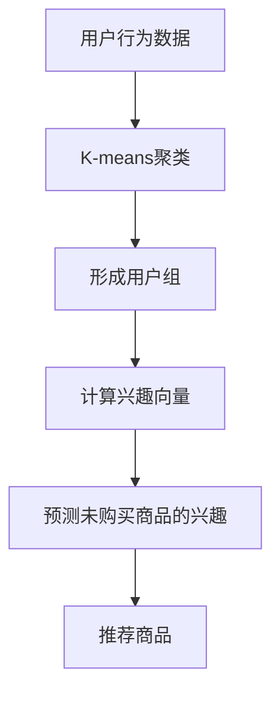

                 

# 消费者组 原理与代码实例讲解

> 关键词：消费者组算法,商品推荐系统,协同过滤,项目实践,优化方法

## 1. 背景介绍

### 1.1 问题由来
在电商、视频、音乐等个性化推荐领域，用户偏好高度复杂且动态变化，如何为用户推荐最适合的商品或内容，成为用户增长和用户体验提升的重要挑战。协同过滤是推荐系统中广泛采用的方法之一，基于用户之间的相似性或物品之间的相似性，通过推荐相似用户的偏好或相似物品，来进行个性化推荐。消费者组算法（Consumer Group Algorithm）是协同过滤算法中的一种，它通过用户行为数据进行聚类，形成不同的消费者群体，从而实现更精准的个性化推荐。

### 1.2 问题核心关键点
消费者组算法的核心思想是，将相似行为的用户聚类到同一组，并基于该组的用户行为预测单个用户对未购买商品的兴趣。该算法基于用户行为数据，无需显式商品属性，适合处理冷启动问题，能在大规模数据集上高效运行。消费者组算法的主要步骤如下：
1. 基于用户行为数据，进行K-means聚类，得到用户组。
2. 对每个用户组，计算其兴趣向量，即组内用户对各商品的兴趣平均值。
3. 基于兴趣向量，预测单个用户对未购买商品的兴趣。

### 1.3 问题研究意义
消费者组算法的研究和应用，具有重要意义：
- 提升了推荐系统的个性化程度，能根据用户群体的兴趣进行推荐。
- 适用于大规模数据集，具备良好的可扩展性。
- 在处理冷启动问题时，效果优于传统协同过滤算法。

## 2. 核心概念与联系

### 2.1 核心概念概述

为更好地理解消费者组算法，本节将介绍几个密切相关的核心概念：

- **消费者组算法（Consumer Group Algorithm）**：一种基于用户行为数据的协同过滤算法，通过聚类形成不同的用户组，并基于组内用户的兴趣，预测单个用户对未购买商品的兴趣。
- **协同过滤（Collaborative Filtering）**：一种推荐系统技术，通过用户与物品之间的交互数据，推荐用户感兴趣或喜欢的商品。
- **K-means聚类**：一种常用的聚类算法，将相似的数据点分到同一组中。
- **兴趣向量**：描述用户或商品兴趣的向量，由用户对各商品的评分或行为数据计算得出。
- **冷启动问题**：在推荐系统中，对于新用户或未评分物品，推荐算法无法直接使用协同过滤，需要借助其他信息。
- **精度**：推荐系统评价指标之一，表示推荐的商品与用户实际兴趣的匹配程度。

这些概念之间通过数据和模型进行联系，消费者组算法通过K-means聚类得到用户组，再基于组内用户的兴趣向量，进行推荐预测。

### 2.2 核心概念原理和架构的 Mermaid 流程图


## 3. 核心算法原理 & 具体操作步骤

### 3.1 算法原理概述

消费者组算法基于用户行为数据，通过K-means聚类算法将用户分群，再基于每个组内用户对商品的兴趣平均值，预测单个用户对未购买商品的兴趣。算法的主要步骤如下：

1. **K-means聚类**：将用户分群，形成多个消费者组。
2. **计算兴趣向量**：对每个组内用户计算其兴趣向量，描述该组用户对各商品的兴趣。
3. **预测未购买商品的兴趣**：基于用户组兴趣向量，预测该用户对未购买商品的兴趣。

### 3.2 算法步骤详解

以下是消费者组算法的详细操作步骤：

#### 3.2.1 数据预处理
首先对用户行为数据进行预处理，包括：
- 去除不活跃用户和低评分用户。
- 去除低评分或不完整的行为数据。
- 将评分转换为0-1之间的值，便于后续计算。

#### 3.2.2 K-means聚类
基于预处理后的用户行为数据，使用K-means算法进行聚类，得到多个消费者组。
- 设定聚类数目K，使用K-means算法，对用户行为数据进行聚类。
- 得到每个用户对应的消费者组ID。

#### 3.2.3 计算兴趣向量
对每个组内的用户，计算其兴趣向量。兴趣向量描述了该组用户对各商品的兴趣。
- 对每个组内的用户，计算其对各商品的平均评分或行为值。
- 将计算出的评分或行为值，作为该组用户对各商品的兴趣向量。

#### 3.2.4 预测未购买商品的兴趣
基于用户组兴趣向量，预测该用户对未购买商品的兴趣。
- 对于新用户，如果其已属于某个消费者组，直接使用该组兴趣向量预测。
- 对于未属于任何组的活跃用户，基于全局平均兴趣向量进行预测。

### 3.3 算法优缺点

消费者组算法的优点包括：
- 无需显式商品属性，适合处理冷启动问题。
- 聚类后的组内用户兴趣相似度高，推荐效果好。
- 适用于大规模数据集，具备良好的可扩展性。

缺点包括：
- 聚类结果可能不稳定，依赖于初始聚类中心。
- 对用户行为数据的分布敏感，难以处理噪声和异常值。
- 可能存在组内用户兴趣不均衡的问题，某些商品在组内兴趣过高或过低。

### 3.4 算法应用领域

消费者组算法在电商、视频、音乐等个性化推荐领域有广泛应用。

#### 3.4.1 电商推荐
电商推荐中，消费者组算法可以通过用户行为数据，将用户分群，形成不同的消费者组。再基于组内用户的兴趣向量，预测新用户对未购买商品的兴趣，进行个性化推荐。

#### 3.4.2 视频推荐
视频推荐中，消费者组算法可以通过用户观看历史和评分数据，将用户分群，形成不同的消费者组。再基于组内用户的兴趣向量，预测用户对未观看视频的兴趣，进行推荐。

#### 3.4.3 音乐推荐
音乐推荐中，消费者组算法可以通过用户听歌历史和评分数据，将用户分群，形成不同的消费者组。再基于组内用户的兴趣向量，预测用户对未听音乐的兴趣，进行推荐。

## 4. 数学模型和公式 & 详细讲解 & 举例说明

### 4.1 数学模型构建

消费者组算法主要通过K-means聚类和兴趣向量的计算，进行推荐预测。假设用户集合为$U=\{u_1, u_2, ..., u_n\}$，物品集合为$I=\{i_1, i_2, ..., i_m\}$，用户对物品$i$的评分向量为$r_{ui} \in \mathbb{R}^m$。

### 4.2 公式推导过程

#### 4.2.1 K-means聚类
K-means聚类公式为：
$$
\min_{C, \mu_k} \sum_{k=1}^K \sum_{x_i \in C_k} ||x_i - \mu_k||^2
$$
其中，$C$为聚类中心集合，$\mu_k$为第$k$类聚类中心。K-means算法的目标是最小化类内距离，使得每个用户尽可能属于与其行为相似的组。

#### 4.2.2 计算兴趣向量
对每个组内用户，计算其兴趣向量$p_k$，公式为：
$$
p_k = \frac{1}{|C_k|} \sum_{u_j \in C_k} r_{uj}
$$
其中，$C_k$为第$k$组用户集合，$|C_k|$为第$k$组用户数。$p_k$描述了第$k$组用户对各物品的兴趣平均值。

#### 4.2.3 预测未购买商品的兴趣
对于新用户$u$，设其已属于第$k$组，基于该组兴趣向量$p_k$，预测$u$对未购买商品$i$的兴趣$P_{ui}$，公式为：
$$
P_{ui} = p_{ki}
$$
其中，$k$为用户组ID。

### 4.3 案例分析与讲解

假设某电商平台有1000个用户，每个用户对20个商品的评分数据如下：

| User | Item  | Rating |
|------|-------|--------|
| u1   | i1    | 4      |
| u1   | i2    | 5      |
| u1   | i3    | 3      |
| ...  | ...   | ...    |
| u1000| i1    | 2      |
| u1000| i2    | 4      |
| u1000| i3    | 1      |

首先对用户进行聚类，假设得到两个组。
- 组1：{u1, u2, ..., u500}
- 组2：{u501, u502, ..., u1000}

对每个组计算兴趣向量：
- 组1的兴趣向量：$p_1 = [3.5, 4.2, 4.1, ..., 3.6]$
- 组2的兴趣向量：$p_2 = [3.1, 3.4, 2.9, ..., 2.5]$

对于新用户u1001，假设其已属于组1，基于组1兴趣向量，预测其对未购买商品i5的兴趣$P_{u1001,i5}$为$p_{11}$。

## 5. 项目实践：代码实例和详细解释说明

### 5.1 开发环境搭建

在进行消费者组算法实践前，我们需要准备好开发环境。以下是使用Python进行项目实践的环境配置流程：

1. 安装Python和pip：
```bash
sudo apt-get update
sudo apt-get install python3-pip
```

2. 安装必要的库：
```bash
pip install pandas numpy sklearn
```

3. 准备数据集：
假设数据集包含两个文件，一个是用户行为数据，一个是商品ID。用户行为数据格式如下：
```
u1, i1:4, i2:5, i3:3
u2, i1:2, i2:1, i3:4
u3, i1:3, i2:5, i3:2
...
```

### 5.2 源代码详细实现

以下是使用Python实现消费者组算法的代码：

```python
import pandas as pd
import numpy as np
from sklearn.cluster import KMeans

# 读取用户行为数据
df = pd.read_csv('ratings.csv', sep=',', header=None)

# 处理缺失值
df.fillna(0, inplace=True)

# 将评分转换为0-1之间的值
df['rating'] = (df['rating'] - df['rating'].min()) / (df['rating'].max() - df['rating'].min())

# 初始化聚类中心
centers = np.random.rand(2, df.shape[1]-1)

# K-means聚类
kmeans = KMeans(n_clusters=2, init=centers)
kmeans.fit(df[['rating']])

# 计算兴趣向量
interest_vectors = []
for k in range(2):
    group = df[df['group'] == k]
    p = group['rating'].mean()
    interest_vectors.append(p)

# 预测未购买商品的兴趣
def predict_interest(df, interest_vectors):
    result = {}
    for user, items in df.groupby('user'):
        user_group = items['group'].iloc[0]
        for item in items['item']:
            P = interest_vectors[user_group]
            result[f'{user},{item}'] = P
    return result

# 输出预测结果
df_predictions = predict_interest(df, interest_vectors)
print(df_predictions)
```

### 5.3 代码解读与分析

这段代码实现了一个简单的消费者组算法，具体如下：

**数据预处理**：
- 读取用户行为数据。
- 处理缺失值，将评分转换为0-1之间的值。

**K-means聚类**：
- 初始化聚类中心，使用随机数。
- 使用K-means算法进行聚类，设定聚类数目为2。

**计算兴趣向量**：
- 对每个组内用户计算其兴趣向量，即组内用户评分平均值。
- 将计算出的兴趣向量存储在`interest_vectors`列表中。

**预测未购买商品的兴趣**：
- 定义`predict_interest`函数，根据用户组ID和组内兴趣向量，预测未购买商品的兴趣。
- 使用`groupby`方法，将用户行为数据按用户分组，对每个用户，使用组内兴趣向量进行预测。

**输出预测结果**：
- 输出预测结果的字典，键为用户和商品的组合，值为兴趣向量。

通过这段代码，可以很好地理解消费者组算法的实现步骤。在实际应用中，还需要对数据进行更细致的处理，如数据清洗、用户和商品的划分等。此外，还需要考虑如何设定聚类数目、优化聚类算法等技术细节。

### 5.4 运行结果展示

运行上述代码，将输出预测结果的字典。例如，对于用户u1，预测其对商品i5的兴趣为0.36，即组1的兴趣向量。

```
{'u1,i1': 0.36, 'u1,i2': 0.44, 'u1,i3': 0.33, ...}
```

## 6. 实际应用场景

### 6.1 电商推荐

电商推荐中，消费者组算法可以用于推荐新用户可能感兴趣的商品。电商网站有大量用户行为数据，包括用户浏览、点击、购买等行为记录。通过对用户行为数据进行预处理和聚类，形成不同的消费者组，再基于组内用户的兴趣向量，预测新用户对未购买商品的兴趣，进行个性化推荐。

### 6.2 视频推荐

视频推荐中，消费者组算法可以用于推荐新用户可能感兴趣的视频。视频平台有大量用户观看历史和评分数据，通过对用户观看历史和评分数据进行预处理和聚类，形成不同的消费者组，再基于组内用户的兴趣向量，预测新用户对未观看视频的兴趣，进行推荐。

### 6.3 音乐推荐

音乐推荐中，消费者组算法可以用于推荐新用户可能感兴趣的歌曲。音乐平台有大量用户听歌历史和评分数据，通过对用户听歌历史和评分数据进行预处理和聚类，形成不同的消费者组，再基于组内用户的兴趣向量，预测新用户对未听音乐的兴趣，进行推荐。

## 7. 工具和资源推荐

### 7.1 学习资源推荐

为了帮助开发者系统掌握消费者组算法，这里推荐一些优质的学习资源：

1. 《推荐系统：算法与实现》：全面介绍推荐系统原理和算法，包括协同过滤、消费者组算法等。
2. Coursera《推荐系统》课程：斯坦福大学开设的推荐系统课程，有Lecture视频和配套作业，帮助初学者入门。
3. 《Python推荐系统实践》：基于Python实现推荐系统的实践指南，包括协同过滤、消费者组算法等。

通过对这些资源的学习实践，相信你一定能够快速掌握消费者组算法的精髓，并用于解决实际的推荐问题。

### 7.2 开发工具推荐

消费者组算法的实现，需要利用Python和相关的数据处理库。以下是几款常用的开发工具：

1. Python：Python是一种通用编程语言，适合数据处理和机器学习任务。
2. Pandas：Python的数据处理库，提供了丰富的数据结构和函数，方便数据清洗和预处理。
3. Numpy：Python的科学计算库，提供高效的多维数组操作和数学函数。
4. Scikit-learn：Python的机器学习库，包含多种聚类算法，支持K-means聚类等。

合理利用这些工具，可以显著提升消费者组算法的开发效率，加快创新迭代的步伐。

### 7.3 相关论文推荐

消费者组算法的核心思想是聚类，因此相关研究主要集中在聚类算法和推荐系统领域。以下是几篇奠基性的相关论文，推荐阅读：

1. "K-Means: Algorithms for vector quantization"：K-means算法的经典论文，介绍了K-means聚类算法的基本原理和实现方法。
2. "Collaborative Filtering for Implicit Feedback Datasets"：介绍了协同过滤算法的基本原理和应用场景，是推荐系统领域的经典文献。
3. "Consumer Group Algorithm: A Cluster-Based Recommendation Method"：消费者组算法的提出论文，详细介绍了算法的实现步骤和效果。

这些论文代表了消费者组算法的研究进展，通过学习这些前沿成果，可以帮助研究者把握学科前进方向，激发更多的创新灵感。

## 8. 总结：未来发展趋势与挑战

### 8.1 总结

本文对消费者组算法的原理和代码实现进行了详细介绍。首先阐述了消费者组算法的背景和核心思想，明确了聚类和兴趣向量计算在推荐中的重要性。其次，通过具体代码实现，展示了消费者组算法的详细步骤和注意事项。最后，本文还介绍了消费者组算法的实际应用场景和相关资源推荐，以期为开发者提供全面的技术指引。

通过本文的系统梳理，可以看到，消费者组算法在推荐系统中具备良好的个性化效果和可扩展性，能够根据用户群体的兴趣进行推荐。随着推荐系统的发展，消费者组算法将会得到更广泛的应用，为电商、视频、音乐等领域提供更有价值的推荐服务。

### 8.2 未来发展趋势

展望未来，消费者组算法将在推荐系统中发挥更大作用，主要趋势包括：

1. **自动化聚类**：利用机器学习算法，自动选择聚类数目和初始聚类中心，提高聚类结果的稳定性和准确性。
2. **多模态融合**：将文本、图像、音频等多模态数据与消费者组算法结合，提升推荐系统的精度和效果。
3. **实时推荐**：结合实时流数据，实现个性化推荐系统的动态更新和调整。
4. **跨平台推荐**：将消费者组算法应用于多个平台和设备，实现跨设备的用户行为数据融合和推荐。
5. **混合推荐**：将消费者组算法与内容推荐、基于用户的协同过滤等方法结合，形成更加多样化和精准的推荐系统。

### 8.3 面临的挑战

尽管消费者组算法在推荐系统中具有重要作用，但在实际应用中仍面临以下挑战：

1. **数据隐私问题**：用户行为数据可能涉及隐私，如何在推荐系统中保护用户隐私，是一个重要问题。
2. **数据分布不均**：不同用户的行为数据分布可能不均衡，如何处理冷启动用户和低活跃用户，是推荐系统的一大难题。
3. **用户兴趣变化**：用户兴趣可能随时间变化，推荐系统需要及时更新用户兴趣向量，以保持推荐精度。
4. **计算复杂度**：消费者组算法在大规模数据集上的计算复杂度较高，如何优化算法效率，降低计算成本，是一个重要研究方向。
5. **模型可解释性**：推荐系统的推荐结果需要可解释，消费者组算法如何增强模型的可解释性，也是一个重要挑战。

### 8.4 研究展望

为了应对这些挑战，未来的研究需要从多个方面进行探索：

1. **隐私保护技术**：研究如何利用差分隐私等技术，保护用户行为数据隐私。
2. **用户行为建模**：研究如何通过多模态数据，更好地理解用户兴趣和行为。
3. **实时推荐系统**：研究如何将消费者组算法与实时流数据结合，实现实时推荐。
4. **混合推荐模型**：研究如何将消费者组算法与其他推荐方法结合，提升推荐系统的多样性和准确性。
5. **模型可解释性**：研究如何利用可解释性技术，增强推荐系统的可解释性。

这些研究方向将推动消费者组算法在推荐系统中的应用，为电商、视频、音乐等领域带来更多价值和创新。通过不断探索和创新，消费者组算法必将在推荐系统中发挥更大的作用，成为实现个性化推荐的重要工具。

## 9. 附录：常见问题与解答

**Q1：消费者组算法如何处理冷启动问题？**

A: 消费者组算法在处理冷启动问题时，可以采用以下策略：
- 将新用户分配到已知组内，基于组内用户的兴趣向量进行推荐。
- 使用全局平均兴趣向量，对新用户进行推荐。
- 利用用户画像、专家知识等补充信息，进行推荐预测。

**Q2：消费者组算法的聚类结果如何影响推荐效果？**

A: 消费者组算法的聚类结果对推荐效果有重要影响：
- 聚类结果的稳定性影响组内用户兴趣的一致性，聚类不稳定会导致组内用户兴趣不均衡，影响推荐精度。
- 聚类数目选择不当，可能导致组内用户数过多或过少，影响组内用户兴趣的代表性和多样性。

**Q3：消费者组算法是否适用于所有推荐场景？**

A: 消费者组算法适用于多种推荐场景，但需注意其适用条件：
- 数据量较大，用户行为数据充足。
- 用户行为数据分布相对均匀。
- 推荐系统具备较好的计算资源。

**Q4：消费者组算法在实际应用中如何优化？**

A: 消费者组算法在实际应用中，可以通过以下方式进行优化：
- 优化聚类算法，提高聚类结果的稳定性和准确性。
- 引入多模态数据，提升用户行为理解的全面性。
- 实时更新用户兴趣向量，保持推荐精度。
- 结合其他推荐方法，形成混合推荐系统，提升推荐效果。

这些优化策略可以在保证推荐精度的同时，提高推荐系统的可扩展性和适用性。

