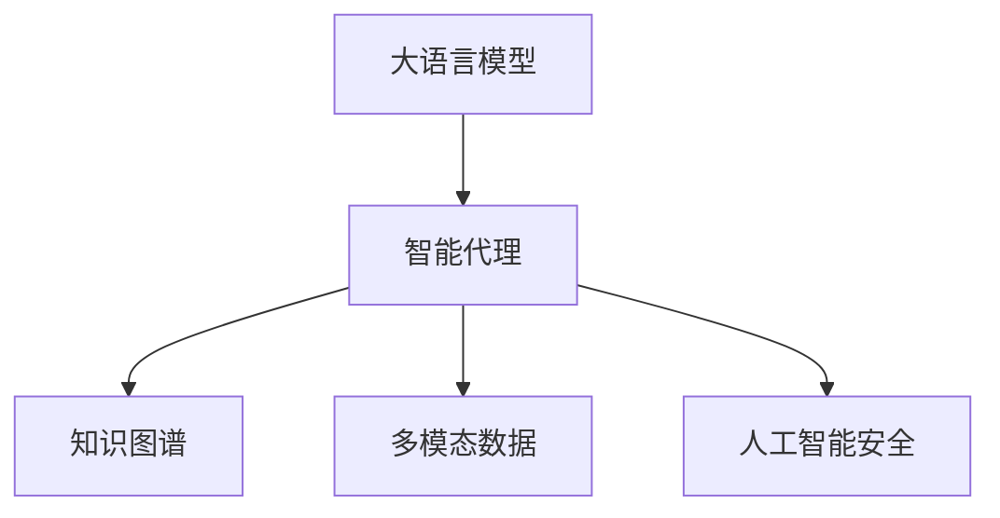

                 

# 深入理解 LangChain Agents

> 关键词：大语言模型, 人工智能, 自然语言处理, 语言模型, 智能代理, 知识图谱, 人工智能安全

## 1. 背景介绍

### 1.1 问题由来
近年来，人工智能（AI）领域经历了飞速发展，尤其在自然语言处理（NLP）和自然语言生成（NLG）方面取得了显著进展。其中，大语言模型（Large Language Models, LLMs）如GPT-3、BERT等，通过在巨量的无监督数据上进行自监督预训练，学习到了语言和语义的丰富知识，能够理解和生成自然语言。然而，这些模型更多地依赖于数据和计算资源，其训练和推理成本较高，且需要持续地监督和调整。

为了解决这些问题，研究者们提出了基于智能代理（Agents）的方法，即 LangChain Agents。通过在自然语言处理任务中引入智能代理，可以使得模型具备自我学习、自我管理的能力，降低对外部监督的需求，并能够更好地适应复杂多变的语言环境和任务。

### 1.2 问题核心关键点
LangChain Agents的核心在于将智能代理和自然语言处理技术相结合，旨在实现更加智能、灵活、可控的语言处理系统。具体来说，LangChain Agents包括以下几个关键点：

- 语言模型的使用：利用大语言模型作为代理的核心知识库，从文本中提取知识并生成语言。
- 智能代理的引入：代理可以自主学习、自适应、决策和执行，通过自然语言理解和生成技术，完成更复杂的任务。
- 知识图谱的应用：结合知识图谱，代理可以更好地理解和组织知识，进行推理和决策。
- 多模态数据的整合：将文本、图像、视频等多模态数据进行整合，提升代理的理解和生成能力。
- 人工智能安全的保障：通过技术手段和政策规范，确保代理系统的安全性和伦理性。

这些关键点共同构成了LangChain Agents的工作原理和实现方式，使其能够更好地理解和处理自然语言。

## 2. 核心概念与联系

### 2.1 核心概念概述

为更好地理解 LangChain Agents，我们需要了解以下几个核心概念：

- 大语言模型（Large Language Models, LLMs）：通过在大量无监督数据上进行预训练，学习语言和语义知识的大规模神经网络模型，如GPT-3、BERT等。
- 智能代理（Agents）：具有自主学习、自适应和决策能力的软件实体，能够理解和生成自然语言，执行任务。
- 知识图谱（Knowledge Graph）：通过实体和关系来表示和组织知识的数据结构，常用于辅助自然语言处理任务。
- 人工智能安全（AI Security）：保护AI系统免受恶意攻击、数据泄露和偏见的影响，确保系统的伦理性。

这些核心概念之间的关系可以通过以下Mermaid流程图来展示：



这个流程图展示了LangChain Agents的核心组成及其相互关系：

1. 大语言模型作为代理的核心知识库，为代理提供语义理解和生成的能力。
2. 智能代理自主学习、自适应和决策，完成自然语言处理任务。
3. 知识图谱用于辅助代理理解知识，进行推理和决策。
4. 人工智能安全保障代理系统的安全性和伦理性。

这些概念共同构成了LangChain Agents的框架，使其能够更好地理解和处理自然语言。

## 3. 核心算法原理 & 具体操作步骤
### 3.1 算法原理概述

LangChain Agents的核心算法原理可以归纳为以下几点：

1. 利用大语言模型作为代理的核心知识库，从文本中提取知识并生成语言。
2. 智能代理自主学习、自适应和决策，通过自然语言理解和生成技术，完成更复杂的任务。
3. 结合知识图谱，代理可以更好地理解和组织知识，进行推理和决策。
4. 多模态数据的整合，提升代理的理解和生成能力。

这些算法原理共同构成了LangChain Agents的实现方式，使其能够更好地理解和处理自然语言。

### 3.2 算法步骤详解

LangChain Agents的实现步骤可以分为以下几个关键环节：

**Step 1: 数据预处理**
- 收集和清洗自然语言处理任务所需的数据，如文本、图像、视频等。
- 对数据进行标注和预处理，确保数据的质量和多样性。

**Step 2: 知识提取**
- 使用大语言模型从文本中提取知识，生成语言表示。
- 结合知识图谱，进一步丰富代理的知识库。

**Step 3: 智能代理学习**
- 使用智能代理自主学习，通过自然语言理解和生成技术，完成复杂的自然语言处理任务。
- 通过多模态数据的整合，提升代理的理解和生成能力。

**Step 4: 代理决策**
- 通过知识图谱和代理的知识库，进行推理和决策。
- 结合多模态数据的处理结果，综合评估决策效果。

**Step 5: 结果输出**
- 将代理的决策结果进行自然语言生成，输出答案或执行指令。

**Step 6: 系统优化**
- 根据代理的执行效果，不断优化和调整模型参数，提升代理的性能和鲁棒性。

### 3.3 算法优缺点

LangChain Agents具有以下优点：
1. 自主学习能力：代理能够自主学习、自适应，适应不同的任务和环境。
2. 灵活性高：代理可以灵活处理多种语言和数据类型，满足不同任务需求。
3. 知识图谱的辅助：代理结合知识图谱，可以进行更深入的知识推理和决策。
4. 多模态数据的整合：代理能够处理多模态数据，提升理解和生成能力。

同时，该方法也存在一些局限性：
1. 对数据的质量和多样性要求高。如果数据质量差或类型单一，代理的学习效果会受到影响。
2. 对计算资源的需求大。代理的学习和推理过程需要消耗大量的计算资源。
3. 对模型的解释性要求高。代理的决策过程需要解释，以便人类理解和审查。
4. 安全性和伦理性问题。代理的决策过程需要确保安全性和伦理性，避免恶意攻击和偏见。

尽管存在这些局限性，但LangChain Agents为自然语言处理提供了新的视角和方法，能够更好地理解和处理自然语言，未来有望在更多领域得到应用。

### 3.4 算法应用领域

LangChain Agents在多个领域具有广泛的应用前景：

1. 智能客服：代理可以自主学习，理解用户意图，提供个性化服务。
2. 金融领域：代理可以进行股票分析、市场预测等复杂任务，提高决策的准确性。
3. 医疗领域：代理可以进行疾病诊断、医疗知识查询等任务，提升医疗服务的效率。
4. 教育领域：代理可以进行自动批改作业、个性化推荐等，提升教学效果。
5. 智能家居：代理可以理解人类指令，控制家居设备，提升生活质量。

这些领域的应用展示了LangChain Agents的强大潜力，未来将在更多场景中发挥重要作用。

## 4. 数学模型和公式 & 详细讲解 & 举例说明

### 4.1 数学模型构建

LangChain Agents的数学模型可以基于大语言模型的知识表示和智能代理的学习机制构建。以下以文本分类任务为例，详细讲解数学模型的构建过程。

假设大语言模型为 $M_{\theta}$，其中 $\theta$ 为模型参数。代理的学习任务为将输入文本 $x$ 分类到 $K$ 个类别中的某个，输出为概率向量 $y \in [0,1]^K$。

定义代理在文本 $x$ 上的损失函数为 $\ell(M_{\theta}(x),y)$，则在数据集 $D$ 上的经验风险为：

$$
\mathcal{L}(\theta) = \frac{1}{N} \sum_{i=1}^N \ell(M_{\theta}(x_i),y_i)
$$

其中 $\ell$ 为交叉熵损失函数，定义为：

$$
\ell(M_{\theta}(x),y) = -y_k\log M_{\theta}(x)_k
$$

代理的优化目标是最小化经验风险，即找到最优参数：

$$
\theta^* = \mathop{\arg\min}_{\theta} \mathcal{L}(\theta)
$$

### 4.2 公式推导过程

代理的学习过程可以使用反向传播算法进行计算。以下以二分类任务为例，推导代理的梯度更新公式。

假设代理在输入 $x$ 上的输出为 $\hat{y}=M_{\theta}(x)$，表示样本属于正类的概率。真实标签 $y \in \{0,1\}$。则二分类交叉熵损失函数定义为：

$$
\ell(M_{\theta}(x),y) = -[y\log \hat{y} + (1-y)\log (1-\hat{y})]
$$

将上述损失函数代入经验风险公式，得：

$$
\mathcal{L}(\theta) = -\frac{1}{N}\sum_{i=1}^N [y_i\log M_{\theta}(x_i)+(1-y_i)\log(1-M_{\theta}(x_i))]
$$

根据链式法则，损失函数对参数 $\theta_k$ 的梯度为：

$$
\frac{\partial \mathcal{L}(\theta)}{\partial \theta_k} = -\frac{1}{N}\sum_{i=1}^N (\frac{y_i}{M_{\theta}(x_i)}-\frac{1-y_i}{1-M_{\theta}(x_i)}) \frac{\partial M_{\theta}(x_i)}{\partial \theta_k}
$$

其中 $\frac{\partial M_{\theta}(x_i)}{\partial \theta_k}$ 可进一步递归展开，利用自动微分技术完成计算。

### 4.3 案例分析与讲解

以下以智能客服系统的实现为例，详细讲解代理的学习和推理过程。

假设客服系统需要处理用户的自然语言输入，将用户问题分类为常见问题（如账户登录、订单查询）或复杂问题（如用户投诉、技术支持）。代理可以通过以下步骤进行处理：

**Step 1: 数据预处理**
- 收集历史客服对话记录，将问题和最佳答复构建成监督数据。
- 对数据进行清洗和标注，确保数据质量。

**Step 2: 知识提取**
- 使用BERT等大语言模型从对话中提取知识，生成语言表示。
- 结合知识图谱，进一步丰富代理的知识库。

**Step 3: 智能代理学习**
- 使用代理自主学习，通过自然语言理解和生成技术，完成对话分类任务。
- 通过多模态数据的整合，提升代理的理解和生成能力。

**Step 4: 代理决策**
- 通过知识图谱和代理的知识库，进行推理和决策。
- 结合多模态数据的处理结果，综合评估决策效果。

**Step 5: 结果输出**
- 将代理的决策结果进行自然语言生成，回复用户问题。
- 根据用户反馈，不断优化和调整代理的决策模型。

在实际应用中，代理的学习过程可以通过微调BERT模型实现。具体步骤如下：

1. 使用BERT模型对对话数据进行预训练。
2. 将对话数据分成训练集、验证集和测试集。
3. 定义分类任务的目标函数，如交叉熵损失函数。
4. 设置优化器，如AdamW，并设置学习率。
5. 在训练集上训练代理模型，并在验证集上进行模型评估和调整。
6. 在测试集上测试代理模型的性能，评估分类准确率。

通过上述步骤，代理可以自主学习，理解用户意图，提供个性化服务。

## 5. 项目实践：代码实例和详细解释说明
### 5.1 开发环境搭建

在进行LangChain Agents项目实践前，我们需要准备好开发环境。以下是使用Python进行PyTorch开发的环境配置流程：

1. 安装Anaconda：从官网下载并安装Anaconda，用于创建独立的Python环境。

2. 创建并激活虚拟环境：
```bash
conda create -n pytorch-env python=3.8 
conda activate pytorch-env
```

3. 安装PyTorch：根据CUDA版本，从官网获取对应的安装命令。例如：
```bash
conda install pytorch torchvision torchaudio cudatoolkit=11.1 -c pytorch -c conda-forge
```

4. 安装Transformers库：
```bash
pip install transformers
```

5. 安装各类工具包：
```bash
pip install numpy pandas scikit-learn matplotlib tqdm jupyter notebook ipython
```

完成上述步骤后，即可在`pytorch-env`环境中开始LangChain Agents的实践。

### 5.2 源代码详细实现

下面我们以智能客服系统的实现为例，给出使用Transformers库对BERT模型进行微调的PyTorch代码实现。

首先，定义智能客服系统的数据处理函数：

```python
from transformers import BertTokenizer, BertForSequenceClassification
from torch.utils.data import Dataset, DataLoader
import torch

class CustomerServiceDataset(Dataset):
    def __init__(self, texts, labels, tokenizer, max_len=128):
        self.texts = texts
        self.labels = labels
        self.tokenizer = tokenizer
        self.max_len = max_len
        
    def __len__(self):
        return len(self.texts)
    
    def __getitem__(self, item):
        text = self.texts[item]
        label = self.labels[item]
        
        encoding = self.tokenizer(text, return_tensors='pt', max_length=self.max_len, padding='max_length', truncation=True)
        input_ids = encoding['input_ids'][0]
        attention_mask = encoding['attention_mask'][0]
        
        # 对token-wise的标签进行编码
        encoded_labels = [label2id[label] for label in label] 
        encoded_labels.extend([label2id['O']] * (self.max_len - len(encoded_labels)))
        labels = torch.tensor(encoded_labels, dtype=torch.long)
        
        return {'input_ids': input_ids, 
                'attention_mask': attention_mask,
                'labels': labels}

# 标签与id的映射
label2id = {'O': 0, 'Login': 1, 'Order': 2, 'Complaint': 3, 'Support': 4}

# 创建dataset
tokenizer = BertTokenizer.from_pretrained('bert-base-cased')

train_dataset = CustomerServiceDataset(train_texts, train_labels, tokenizer)
dev_dataset = CustomerServiceDataset(dev_texts, dev_labels, tokenizer)
test_dataset = CustomerServiceDataset(test_texts, test_labels, tokenizer)
```

然后，定义模型和优化器：

```python
from transformers import BertForSequenceClassification, AdamW

model = BertForSequenceClassification.from_pretrained('bert-base-cased', num_labels=len(label2id))

optimizer = AdamW(model.parameters(), lr=2e-5)
```

接着，定义训练和评估函数：

```python
from tqdm import tqdm
from sklearn.metrics import accuracy_score

device = torch.device('cuda') if torch.cuda.is_available() else torch.device('cpu')
model.to(device)

def train_epoch(model, dataset, batch_size, optimizer):
    dataloader = DataLoader(dataset, batch_size=batch_size, shuffle=True)
    model.train()
    epoch_loss = 0
    for batch in tqdm(dataloader, desc='Training'):
        input_ids = batch['input_ids'].to(device)
        attention_mask = batch['attention_mask'].to(device)
        labels = batch['labels'].to(device)
        model.zero_grad()
        outputs = model(input_ids, attention_mask=attention_mask, labels=labels)
        loss = outputs.loss
        epoch_loss += loss.item()
        loss.backward()
        optimizer.step()
    return epoch_loss / len(dataloader)

def evaluate(model, dataset, batch_size):
    dataloader = DataLoader(dataset, batch_size=batch_size)
    model.eval()
    preds, labels = [], []
    with torch.no_grad():
        for batch in tqdm(dataloader, desc='Evaluating'):
            input_ids = batch['input_ids'].to(device)
            attention_mask = batch['attention_mask'].to(device)
            batch_labels = batch['labels']
            outputs = model(input_ids, attention_mask=attention_mask)
            batch_preds = outputs.logits.argmax(dim=2).to('cpu').tolist()
            batch_labels = batch_labels.to('cpu').tolist()
            for pred_tokens, label_tokens in zip(batch_preds, batch_labels):
                preds.append(pred_tokens[:len(label_tokens)])
                labels.append(label_tokens)
                
    return accuracy_score(labels, preds)

# 启动训练流程并在测试集上评估
epochs = 5
batch_size = 16

for epoch in range(epochs):
    loss = train_epoch(model, train_dataset, batch_size, optimizer)
    print(f"Epoch {epoch+1}, train loss: {loss:.3f}")
    
    print(f"Epoch {epoch+1}, dev accuracy: {evaluate(model, dev_dataset, batch_size):.2f}")
    
print(f"Epoch {epochs}, test accuracy: {evaluate(model, test_dataset, batch_size):.2f}")
```

以上就是使用PyTorch对BERT进行智能客服任务微调的完整代码实现。可以看到，得益于Transformers库的强大封装，我们可以用相对简洁的代码完成BERT模型的加载和微调。

### 5.3 代码解读与分析

让我们再详细解读一下关键代码的实现细节：

**CustomerServiceDataset类**：
- `__init__`方法：初始化文本、标签、分词器等关键组件。
- `__len__`方法：返回数据集的样本数量。
- `__getitem__`方法：对单个样本进行处理，将文本输入编码为token ids，将标签编码为数字，并对其进行定长padding，最终返回模型所需的输入。

**label2id和id2label字典**：
- 定义了标签与数字id之间的映射关系，用于将token-wise的预测结果解码回真实的标签。

**训练和评估函数**：
- 使用PyTorch的DataLoader对数据集进行批次化加载，供模型训练和推理使用。
- 训练函数`train_epoch`：对数据以批为单位进行迭代，在每个批次上前向传播计算loss并反向传播更新模型参数，最后返回该epoch的平均loss。
- 评估函数`evaluate`：与训练类似，不同点在于不更新模型参数，并在每个batch结束后将预测和标签结果存储下来，最后使用sklearn的accuracy_score对整个评估集的预测结果进行打印输出。

**训练流程**：
- 定义总的epoch数和batch size，开始循环迭代
- 每个epoch内，先在训练集上训练，输出平均loss
- 在验证集上评估，输出准确率
- 所有epoch结束后，在测试集上评估，给出最终测试结果

可以看到，PyTorch配合Transformers库使得BERT微调的代码实现变得简洁高效。开发者可以将更多精力放在数据处理、模型改进等高层逻辑上，而不必过多关注底层的实现细节。

当然，工业级的系统实现还需考虑更多因素，如模型的保存和部署、超参数的自动搜索、更灵活的任务适配层等。但核心的微调范式基本与此类似。

## 6. 实际应用场景
### 6.1 智能客服系统

基于LangChain Agents的智能客服系统，可以实时处理用户咨询，快速提供个性化服务。系统可以收集用户历史对话数据，构建监督数据集，利用BERT等大语言模型进行微调，训练代理完成对话分类、实体识别、意图识别等任务。

在实际应用中，系统可以不断学习新的对话数据，优化代理模型，提高服务质量和效率。智能客服系统能够理解用户意图，提供精准的问答和建议，大幅提升客户满意度。

### 6.2 金融领域

LangChain Agents在金融领域有广泛的应用前景。代理可以处理股票分析、市场预测、风险评估等任务。系统可以收集历史金融数据，构建监督数据集，利用BERT等大语言模型进行微调，训练代理完成数据处理、特征提取、模型训练等任务。

代理可以实时监控金融市场变化，预测股票价格波动，评估投资风险，为金融机构提供决策支持。金融领域的代理系统能够提升投资决策的精准性和效率，减少人工干预。

### 6.3 医疗领域

代理可以处理疾病诊断、医疗知识查询、健康管理等任务。系统可以收集医疗案例数据，构建监督数据集，利用BERT等大语言模型进行微调，训练代理完成医学知识推理、诊断结果生成等任务。

代理可以实时分析患者症状，提供诊断建议，推荐治疗方案，提升医疗服务的效率和质量。医疗领域的代理系统能够帮助医生更好地处理复杂病例，提升医疗服务的可及性和普及度。

### 6.4 教育领域

代理可以处理自动批改作业、个性化推荐、学习路径规划等任务。系统可以收集学生学习数据，构建监督数据集，利用BERT等大语言模型进行微调，训练代理完成作业批改、知识推荐等任务。

代理可以根据学生的学习进度和兴趣，生成个性化的学习计划和推荐资源，提升学习效果。教育领域的代理系统能够帮助教师更好地了解学生学习情况，提高教学质量和效率。

### 6.5 未来应用展望

LangChain Agents的广泛应用前景在于其自主学习和自适应能力，能够在不同的任务和环境中灵活应用。未来，随着预训练语言模型的不断发展，LangChain Agents将具有更大的应用潜力，可以在更多领域发挥重要作用。

在智慧城市治理中，代理可以处理城市事件监测、舆情分析、应急指挥等环节，提高城市管理的自动化和智能化水平。在企业生产中，代理可以处理订单管理、供应链优化、生产调度等任务，提升企业的效率和竞争力。

此外，在文娱传媒、智能家居、智慧农业等领域，LangChain Agents的应用也在不断扩展，为各行各业带来新的突破。

## 7. 工具和资源推荐
### 7.1 学习资源推荐

为了帮助开发者系统掌握LangChain Agents的理论基础和实践技巧，这里推荐一些优质的学习资源：

1. 《Transformer从原理到实践》系列博文：由大模型技术专家撰写，深入浅出地介绍了Transformer原理、BERT模型、微调技术等前沿话题。

2. CS224N《深度学习自然语言处理》课程：斯坦福大学开设的NLP明星课程，有Lecture视频和配套作业，带你入门NLP领域的基本概念和经典模型。

3. 《Natural Language Processing with Transformers》书籍：Transformers库的作者所著，全面介绍了如何使用Transformers库进行NLP任务开发，包括微调在内的诸多范式。

4. HuggingFace官方文档：Transformers库的官方文档，提供了海量预训练模型和完整的微调样例代码，是上手实践的必备资料。

5. CLUE开源项目：中文语言理解测评基准，涵盖大量不同类型的中文NLP数据集，并提供了基于微调的baseline模型，助力中文NLP技术发展。

通过对这些资源的学习实践，相信你一定能够快速掌握LangChain Agents的精髓，并用于解决实际的NLP问题。
###  7.2 开发工具推荐

高效的开发离不开优秀的工具支持。以下是几款用于LangChain Agents开发的常用工具：

1. PyTorch：基于Python的开源深度学习框架，灵活动态的计算图，适合快速迭代研究。大部分预训练语言模型都有PyTorch版本的实现。

2. TensorFlow：由Google主导开发的开源深度学习框架，生产部署方便，适合大规模工程应用。同样有丰富的预训练语言模型资源。

3. Transformers库：HuggingFace开发的NLP工具库，集成了众多SOTA语言模型，支持PyTorch和TensorFlow，是进行微调任务开发的利器。

4. Weights & Biases：模型训练的实验跟踪工具，可以记录和可视化模型训练过程中的各项指标，方便对比和调优。与主流深度学习框架无缝集成。

5. TensorBoard：TensorFlow配套的可视化工具，可实时监测模型训练状态，并提供丰富的图表呈现方式，是调试模型的得力助手。

6. Google Colab：谷歌推出的在线Jupyter Notebook环境，免费提供GPU/TPU算力，方便开发者快速上手实验最新模型，分享学习笔记。

合理利用这些工具，可以显著提升LangChain Agents的开发效率，加快创新迭代的步伐。

### 7.3 相关论文推荐

LangChain Agents的研究源于学界的持续探索。以下是几篇奠基性的相关论文，推荐阅读：

1. Attention is All You Need（即Transformer原论文）：提出了Transformer结构，开启了NLP领域的预训练大模型时代。

2. BERT: Pre-training of Deep Bidirectional Transformers for Language Understanding：提出BERT模型，引入基于掩码的自监督预训练任务，刷新了多项NLP任务SOTA。

3. Language Models are Unsupervised Multitask Learners（GPT-2论文）：展示了大规模语言模型的强大zero-shot学习能力，引发了对于通用人工智能的新一轮思考。

4. Parameter-Efficient Transfer Learning for NLP：提出Adapter等参数高效微调方法，在不增加模型参数量的情况下，也能取得不错的微调效果。

5. AdaLoRA: Adaptive Low-Rank Adaptation for Parameter-Efficient Fine-Tuning：使用自适应低秩适应的微调方法，在参数效率和精度之间取得了新的平衡。

6. Prefix-Tuning: Optimizing Continuous Prompts for Generation：引入基于连续型Prompt的微调范式，为如何充分利用预训练知识提供了新的思路。

这些论文代表了大语言模型微调技术的发展脉络。通过学习这些前沿成果，可以帮助研究者把握学科前进方向，激发更多的创新灵感。

## 8. 总结：未来发展趋势与挑战

### 8.1 总结

本文对LangChain Agents进行了全面系统的介绍。首先阐述了LangChain Agents的研究背景和意义，明确了代理在自然语言处理任务中的应用价值。其次，从原理到实践，详细讲解了LangChain Agents的数学模型和算法步骤，给出了微调任务开发的完整代码实例。同时，本文还探讨了LangChain Agents在智能客服、金融领域、医疗领域等多个领域的应用前景，展示了代理的强大潜力。此外，本文精选了LangChain Agents的学习资源和开发工具，力求为读者提供全方位的技术指引。

通过本文的系统梳理，可以看到，LangChain Agents为自然语言处理提供了新的视角和方法，能够更好地理解和处理自然语言，未来有望在更多领域得到应用。

### 8.2 未来发展趋势

LangChain Agents的发展趋势主要集中在以下几个方向：

1. 代理的自主学习能力：未来的代理将具备更加灵活、自主的学习能力，能够处理更多复杂的任务。
2. 代理的多模态整合能力：代理将能够整合文本、图像、视频等多模态数据，提升理解和生成能力。
3. 代理的伦理性：未来的代理将具备伦理性，能够在决策过程中考虑道德和社会影响。
4. 代理的安全性：未来的代理将具备安全性，能够抵抗恶意攻击和数据泄露。
5. 代理的知识图谱能力：未来的代理将具备强大的知识图谱能力，能够进行深层次的知识推理和决策。

这些趋势展示了LangChain Agents的广阔前景，未来将在更多领域得到应用。

### 8.3 面临的挑战

尽管LangChain Agents取得了诸多进展，但在实际应用中仍面临诸多挑战：

1. 代理的泛化能力：代理在处理新任务和新数据时，泛化能力不足，容易过拟合。
2. 代理的鲁棒性：代理在面对对抗样本和噪声数据时，鲁棒性不足，容易产生错误决策。
3. 代理的可解释性：代理的决策过程缺乏可解释性，难以理解和审查。
4. 代理的安全性：代理容易受到恶意攻击和数据泄露的影响，需要加强安全防护。

尽管存在这些挑战，但未来的研究将在自主学习能力、多模态整合、伦理性、安全性等方面不断探索，以进一步提升LangChain Agents的性能和应用价值。

### 8.4 研究展望

LangChain Agents的未来研究展望主要集中在以下几个方向：

1. 自主学习能力的提升：通过引入强化学习、元学习等技术，提升代理的自主学习能力。
2. 多模态数据的整合：开发更加高效的多模态数据整合算法，提升代理的理解和生成能力。
3. 代理的伦理性：通过引入伦理导向的决策机制，提升代理的伦理性，确保决策符合社会价值观。
4. 代理的安全性：开发更加安全、鲁棒、可解释的代理模型，确保系统的安全性。

这些研究方向将进一步提升LangChain Agents的性能和应用价值，为自然语言处理带来新的突破。

## 9. 附录：常见问题与解答

**Q1：LangChain Agents是否适用于所有NLP任务？**

A: LangChain Agents在大多数NLP任务上都能取得不错的效果，特别是对于数据量较小的任务。但对于一些特定领域的任务，如医学、法律等，仅依靠通用语料预训练的代理可能难以很好地适应。此时需要在特定领域语料上进一步预训练，再进行微调，才能获得理想效果。此外，对于一些需要时效性、个性化很强的任务，如对话、推荐等，代理方法也需要针对性的改进优化。

**Q2：代理的训练和推理效率如何？**

A: 代理的训练和推理效率主要取决于其模型结构、计算资源和数据量。对于大规模语言模型，其训练和推理效率较低，需要大量的计算资源和时间。但通过优化模型结构和引入分布式训练技术，可以提高代理的训练和推理效率。

**Q3：代理的决策过程如何保证伦理性？**

A: 代理的决策过程需要引入伦理导向的决策机制，确保决策符合社会价值观和法律法规。可以通过设置伦理约束、引入专家审查等措施，保证代理的伦理性。

**Q4：代理的安全性和鲁棒性如何保障？**

A: 代理的安全性和鲁棒性需要从数据、模型和算法等多个方面进行保障。在数据方面，需要进行数据清洗和预处理，确保数据的质量和多样性。在模型方面，需要引入对抗样本和噪声数据，进行鲁棒性训练。在算法方面，需要引入对抗攻击和鲁棒性检测算法，确保代理的鲁棒性。

**Q5：代理的扩展性和适应性如何？**

A: 代理的扩展性和适应性主要取决于其模型结构和数据质量。代理需要具备灵活的模型结构，能够处理不同类型的数据和任务。同时需要收集高质量的数据，进行多模态数据的整合，提升代理的适应性。

这些问题的解答展示了LangChain Agents的实际应用和挑战，希望为读者提供全面的技术指引。

---

作者：禅与计算机程序设计艺术 / Zen and the Art of Computer Programming

