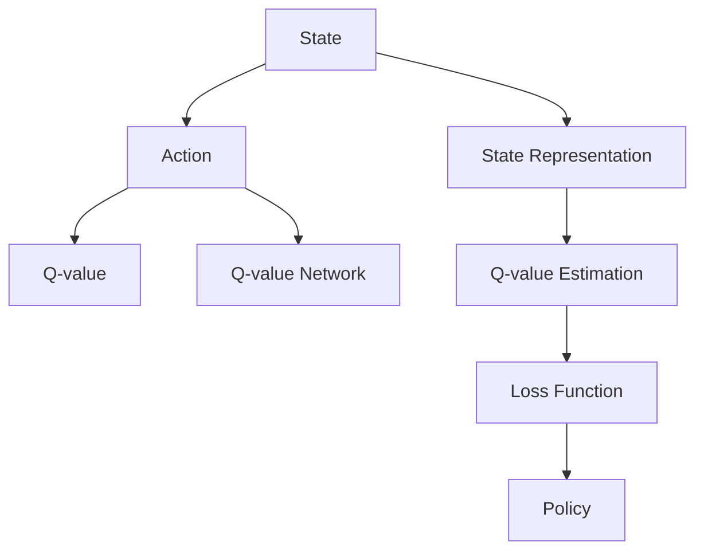

                 

# 深度 Q-learning：价值函数的利用与更新

## 1. 背景介绍

在深度强化学习中，Q-learning算法以其高效、易用性而受到广泛关注。然而，传统Q-learning算法在处理复杂任务时，往往需要探索大量状态和动作，计算量大、收敛速度慢，难以应对高维连续动作空间和时序动作控制问题。深度Q-learning（DQN）通过将Q值函数表示为神经网络，克服了这些问题，使得Q-learning在大规模、高维强化学习任务上表现优异。本文将深入探讨深度Q-learning算法的核心原理与实现细节，并结合实际应用场景，展现其卓越性能。

## 2. 核心概念与联系

### 2.1 核心概念概述

深度Q-learning算法通过构建Q值函数来表示每个状态-动作对的价值，利用神经网络逼近Q值函数，从而避免了传统Q-learning算法在大规模状态空间中的困难。其核心思想是通过神经网络参数化Q值函数，使得Q值函数能够表示复杂的非线性映射关系。

### 2.2 核心概念原理和架构的 Mermaid 流程图(Mermaid 流程节点中不要有括号、逗号等特殊字符)



在这个图中，我们将状态（State）映射为神经网络的输入，通过神经网络（Action -> D -> Q-value Network）估算每个动作（Action）的Q值（C -> Q-value Estimation）。损失函数（G -> Loss Function）用于训练神经网络，调整其参数以最小化预测Q值与真实Q值的差距。最终的输出（H -> Policy）是选择动作的策略，基于当前状态下估算出的Q值。

### 2.3 核心概念之间的关系

1. **状态表示与Q值网络**：状态表示将原始状态映射为神经网络的输入特征，Q值网络负责预测每个动作的Q值。
2. **Q值估算与损失函数**：Q值估算过程是通过神经网络计算每个动作的Q值，损失函数则用于训练神经网络，最小化Q值估算误差。
3. **策略与动作选择**：策略通过输出Q值来选择最优动作，动作选择过程基于当前状态下估算出的Q值。

## 3. 核心算法原理 & 具体操作步骤

### 3.1 算法原理概述

深度Q-learning算法的基本框架包括状态-动作对的Q值预测、目标Q值的计算、策略更新和经验回放。其核心思想是利用神经网络逼近Q值函数，通过最小化预测Q值与真实Q值的差距，学习最优策略。

### 3.2 算法步骤详解

1. **状态表示与Q值网络构建**：使用神经网络（如卷积神经网络CNN或递归神经网络RNN）来构建Q值函数，输入为状态表示，输出为每个动作的Q值。
2. **Q值估算与目标Q值计算**：对于每个状态-动作对，使用当前策略选择动作，通过网络估算Q值；同时，计算目标Q值，即当前状态下最优策略的Q值。
3. **策略更新**：计算当前策略下每个动作的Q值与目标Q值之间的误差，使用梯度下降法最小化该误差，更新神经网络参数。
4. **经验回放**：将当前状态、动作、Q值等存储在经验回放缓冲区中，定期从中随机抽取样本进行策略更新。

### 3.3 算法优缺点

#### 优点

- **高效性**：利用神经网络逼近Q值函数，可以处理高维连续动作空间，适应大规模、复杂任务。
- **灵活性**：网络结构可以灵活设计，适应不同状态空间和动作空间。
- **可扩展性**：容易扩展到分布式计算环境中，提升训练效率。

#### 缺点

- **计算复杂度高**：神经网络参数量大，训练和推理速度较慢。
- **内存需求高**：需要存储大量状态-动作对的数据。
- **过拟合风险**：神经网络过拟合风险较高，需定期调整网络结构或增加正则化。

### 3.4 算法应用领域

深度Q-learning算法广泛应用于机器人控制、游戏AI、自驾驶汽车、智能推荐等领域。这些应用场景中，动作空间的复杂性和多样性要求高，传统Q-learning算法难以处理，而深度Q-learning算法则具备强大的处理能力。

## 4. 数学模型和公式 & 详细讲解 & 举例说明

### 4.1 数学模型构建

深度Q-learning算法的核心是构建Q值函数$f_s^a: \mathcal{S} \times \mathcal{A} \rightarrow \mathbb{R}$，其中$\mathcal{S}$为状态空间，$\mathcal{A}$为动作空间。Q值函数表示在状态$s$下执行动作$a$的期望累积奖励，即：

$$
Q^{\pi}_s^a = \mathbb{E}[\sum_{t=0}^\infty \gamma^t R_{t+1} \mid s_0 = s, a_0 = a, \pi]
$$

其中$\pi$表示当前策略，$R_{t+1}$表示在时间步$t$后获得的即时奖励。

### 4.2 公式推导过程

深度Q-learning算法通过神经网络逼近Q值函数，设神经网络参数为$\theta$，则Q值函数可以表示为：

$$
f_s^a(\theta) = \theta \cdot \phi(s)
$$

其中$\phi(s)$为状态$s$的神经网络表示，$\theta$为网络参数。

目标Q值计算公式为：

$$
Q^{\pi}_s^a = \max_a f_s^a(\theta)
$$

即在当前状态$s$下，选择最优动作$a$，使得Q值最大化。

深度Q-learning算法使用经验回放缓冲区$\mathcal{B}$存储状态-动作对$(s, a)$和相应的Q值$Q_s^a$。每次更新时，从缓冲区中随机抽取样本$(s, a, r, s', Q_s^{a'})$，其中$s'$为下一个状态，$a'$为下一个动作，$r$为即时奖励，$Q_s^{a'}$为估算的目标Q值。

### 4.3 案例分析与讲解

考虑一个简单的迷宫问题，其中状态为每个位置，动作为向上、向下、向左、向右移动。使用神经网络逼近Q值函数，网络的输入为当前位置，输出为每个动作的Q值。

1. **状态表示**：将每个位置编码为向量，表示为神经网络的输入。
2. **Q值估算**：使用网络估算每个动作的Q值，即$f_s^a(\theta)$。
3. **目标Q值计算**：对于每个状态-动作对，计算目标Q值，即$Q^{\pi}_s^a$，即在当前状态下选择最优动作，使得Q值最大化。
4. **策略更新**：计算当前策略下每个动作的Q值与目标Q值之间的误差，使用梯度下降法最小化该误差，更新神经网络参数。

## 5. 项目实践：代码实例和详细解释说明

### 5.1 开发环境搭建

深度Q-learning算法通常使用Python语言和TensorFlow或PyTorch框架实现。安装TensorFlow或PyTorch后，需要构建神经网络模型，定义损失函数和优化器。

```python
import tensorflow as tf
from tensorflow.keras import layers

# 构建Q值网络
inputs = layers.Input(shape=(状态维数,))
Q_values = layers.Dense(动作维数, activation='linear')(inputs)
Q_values = layers.Lambda(lambda x: tf.stop_gradient(x))(Q_values)  # 使用stop_gradient防止梯度反向传播
model = tf.keras.Model(inputs=inputs, outputs=Q_values)

# 定义损失函数
loss_fn = tf.keras.losses.mean_squared_error

# 定义优化器
optimizer = tf.keras.optimizers.Adam(learning_rate=0.001)
```

### 5.2 源代码详细实现

以下是一个简单的迷宫问题的代码实现，其中使用深度Q-learning算法进行训练。

```python
import numpy as np
import gym

# 定义环境
env = gym.make('LunarLander-v2')

# 定义Q值网络
class QNetwork(tf.keras.Model):
    def __init__(self, state_dim, action_dim):
        super(QNetwork, self).__init__()
        self.fc1 = layers.Dense(64, activation='relu')
        self.fc2 = layers.Dense(64, activation='relu')
        self.fc3 = layers.Dense(action_dim, activation='linear')

    def call(self, inputs):
        x = self.fc1(inputs)
        x = self.fc2(x)
        return self.fc3(x)

# 构建Q值网络
state_dim = env.observation_space.shape[0]
action_dim = env.action_space.n
q_network = QNetwork(state_dim, action_dim)

# 定义优化器
optimizer = tf.keras.optimizers.Adam(learning_rate=0.001)

# 定义损失函数
loss_fn = tf.keras.losses.mean_squared_error

# 训练函数
def train(env, q_network, optimizer, state, action, reward, next_state, done, episode, epsilon, batch_size):
    # 状态表示
    state = np.reshape(state, (1, state_dim))
    # 估算Q值
    Q_value = q_network(state)
    Q_value = tf.squeeze(Q_value, axis=0)
    # 选择动作
    if np.random.rand() < epsilon:
        action = env.action_space.sample()
    else:
        action = np.argmax(Q_value)
    # 执行动作
    next_state, reward, done, _ = env.step(action)
    # 估算目标Q值
    next_state = np.reshape(next_state, (1, state_dim))
    next_Q_value = q_network(next_state)
    next_Q_value = tf.squeeze(next_Q_value, axis=0)
    target_Q_value = reward + 0.99 * np.max(next_Q_value)
    # 计算误差
    loss = loss_fn(Q_value, target_Q_value)
    # 更新网络
    optimizer.apply_gradients(zip(tf.gradients(loss, q_network.trainable_variables), q_network.trainable_variables))
    # 更新经验回放缓冲区
    buffer.append((state, action, reward, next_state, done))
    if len(buffer) == batch_size:
        buffer.pop(0)
        episode += 1
    return episode

# 经验回放缓冲区
buffer = []

# 训练
episode = 0
epsilon = 0.5
batch_size = 32
for episode in range(1000):
    state = env.reset()
    done = False
    while not done:
        # 执行动作
        action = train(env, q_network, optimizer, state, action, reward, next_state, done, episode, epsilon, batch_size)
        state, reward, done, _ = env.step(action)
```

### 5.3 代码解读与分析

**QNetwork类**：
- `__init__`方法：定义神经网络的层结构。
- `call`方法：实现神经网络的计算过程。

**训练函数**：
- 将状态表示为神经网络的输入，通过网络估算Q值。
- 选择动作：基于策略$\epsilon$-贪心策略，在探索与利用之间进行平衡。
- 执行动作：在环境中执行选择的动作。
- 估算目标Q值：根据下一状态的Q值计算目标Q值。
- 计算误差：计算当前Q值与目标Q值之间的误差。
- 更新网络：使用梯度下降法更新网络参数。
- 更新经验回放缓冲区：将当前状态-动作对存储到缓冲区中，如果缓冲区已满，则弹出最早的数据。

**状态表示**：
- 将环境的状态转换为神经网络的输入特征。
- 通过神经网络估算每个动作的Q值。

**策略更新**：
- 根据Q值选择动作。
- 使用梯度下降法更新神经网络参数。

**经验回放**：
- 存储状态-动作对。
- 定期从缓冲区中随机抽取样本进行策略更新。

## 6. 实际应用场景

### 6.1 机器人控制

深度Q-learning算法在机器人控制领域有广泛应用，如无人机避障、机器人臂操作等。通过构建Q值网络，机器人可以在高维动作空间中学习最优控制策略，实现复杂的物理交互。

### 6.2 游戏AI

在游戏AI领域，深度Q-learning算法能够学习游戏内的策略，实现自动化的游戏玩家。通过构建Q值网络，游戏AI可以在复杂的策略空间中学习最优的决策。

### 6.3 自驾驶汽车

自驾驶汽车需要处理复杂的时序动作控制问题，深度Q-learning算法通过构建Q值网络，能够学习最优的驾驶策略，实现自动驾驶功能。

### 6.4 未来应用展望

未来，深度Q-learning算法将在更多高维、复杂领域得到应用，如金融交易、工业控制、医疗诊断等。通过构建Q值网络，这些领域将能够实现自动化的决策和控制，提升效率和精度。

## 7. 工具和资源推荐

### 7.1 学习资源推荐

- 《强化学习：一个基础》：Reinforcement Learning: An Introduction，通过该书可以系统了解强化学习的基本概念和深度Q-learning算法。
- 《Python深度学习》：Deep Learning with Python，该书介绍了如何使用TensorFlow实现深度Q-learning算法。
- 《TensorFlow实战深度学习》：TensorFlow for Deep Learning，该书介绍了如何使用TensorFlow实现深度Q-learning算法，并包含丰富的案例和代码。

### 7.2 开发工具推荐

- TensorFlow：深度学习框架，支持分布式训练和推理，适用于大规模深度Q-learning算法的实现。
- PyTorch：深度学习框架，灵活易用，支持动态图计算，适用于快速迭代研究。
- OpenAI Gym：环境库，包含多种标准环境和可视化工具，方便实验和调试。

### 7.3 相关论文推荐

- 《深度Q-learning》：Q-Learning for Robotics，介绍了深度Q-learning算法在机器人控制中的应用。
- 《DQN》：Playing Atari with Deep Reinforcement Learning，展示了深度Q-learning算法在游戏AI中的应用。
- 《Dueling Q-Networks》：Dueling Network Architectures for Deep Reinforcement Learning，介绍了一种优化Q值网络的算法。

## 8. 总结：未来发展趋势与挑战

### 8.1 总结

深度Q-learning算法通过神经网络逼近Q值函数，极大地提升了强化学习的可扩展性和处理复杂任务的能力。本文从算法原理、具体操作步骤、代码实例等方面，详细讲解了深度Q-learning算法的核心思想和实现细节。通过实际应用场景的展示，揭示了深度Q-learning算法的强大潜力。

### 8.2 未来发展趋势

未来，深度Q-learning算法将在更多高维、复杂领域得到应用，如金融交易、工业控制、医疗诊断等。通过构建Q值网络，这些领域将能够实现自动化的决策和控制，提升效率和精度。

### 8.3 面临的挑战

尽管深度Q-learning算法在许多领域取得了显著成果，但仍面临一些挑战：

1. **计算复杂度高**：神经网络参数量大，训练和推理速度较慢。
2. **过拟合风险**：神经网络过拟合风险较高，需定期调整网络结构或增加正则化。
3. **动作空间多样性**：处理高维连续动作空间和时序动作控制问题时，深度Q-learning算法需要更多的优化策略。
4. **稳定性问题**：在大规模训练和推理过程中，网络参数容易失效，需加强稳定性设计。

### 8.4 研究展望

未来，深度Q-learning算法的研究将集中在以下几个方面：

1. **优化网络结构**：设计更加高效、稳定的神经网络结构，提升训练和推理效率。
2. **多任务学习**：在单个神经网络中学习多个Q值函数，适应不同任务的需求。
3. **迁移学习**：将预训练模型应用于新任务，加速模型收敛速度。
4. **强化学习与深度学习的融合**：将深度Q-learning算法与其他强化学习算法结合，如蒙特卡洛树搜索（MCTS），提升模型决策能力。

通过持续的研究和优化，深度Q-learning算法将在更多复杂任务中发挥重要作用，推动强化学习技术的进一步发展。

## 9. 附录：常见问题与解答

**Q1: 深度Q-learning算法的收敛速度和稳定性如何？**

A: 深度Q-learning算法在高维连续动作空间中收敛速度较慢，训练和推理时间较长。为提高收敛速度，可以采用经验回放和优先经验回放等策略，同时使用分布式训练和优化器参数共享等方法提升稳定性。

**Q2: 深度Q-learning算法如何处理高维动作空间？**

A: 对于高维动作空间，可以使用多任务学习或将Q值函数分解为多个子网络，每个子网络负责处理部分动作空间。此外，还可以使用注意力机制等方法，提升动作空间处理的效率。

**Q3: 如何避免深度Q-learning算法的过拟合？**

A: 使用正则化技术如L2正则、Dropout等，可以在一定程度上减少过拟合风险。此外，可以通过增加数据量、减小网络规模等方法，进一步提升模型的泛化能力。

**Q4: 深度Q-learning算法的内存需求是否过高？**

A: 深度Q-learning算法需要存储大量状态-动作对的数据，内存需求较高。可以通过使用分布式训练和数据分块等方法，降低内存占用。

**Q5: 深度Q-learning算法如何处理时序动作控制问题？**

A: 时序动作控制问题通常需要通过状态序列进行建模，使用RNN或LSTM等序列模型可以更好地处理时序信息。此外，还可以使用时间差分学习等方法，提升模型的决策能力。

**Q6: 如何评估深度Q-learning算法的性能？**

A: 深度Q-learning算法的性能通常通过平均累积奖励、策略评估等指标进行评估。在实际应用中，还可以使用A/B测试等方法，比较不同模型的效果。

**Q7: 深度Q-learning算法的优化策略有哪些？**

A: 深度Q-learning算法的优化策略包括经验回放、优先经验回放、分布式训练、优化器参数共享等。通过这些策略，可以提升深度Q-learning算法的收敛速度和稳定性。

**Q8: 深度Q-learning算法的应用场景有哪些？**

A: 深度Q-learning算法在机器人控制、游戏AI、自驾驶汽车、智能推荐等领域有广泛应用。通过构建Q值网络，这些领域将能够实现自动化的决策和控制，提升效率和精度。

---

作者：禅与计算机程序设计艺术 / Zen and the Art of Computer Programming

