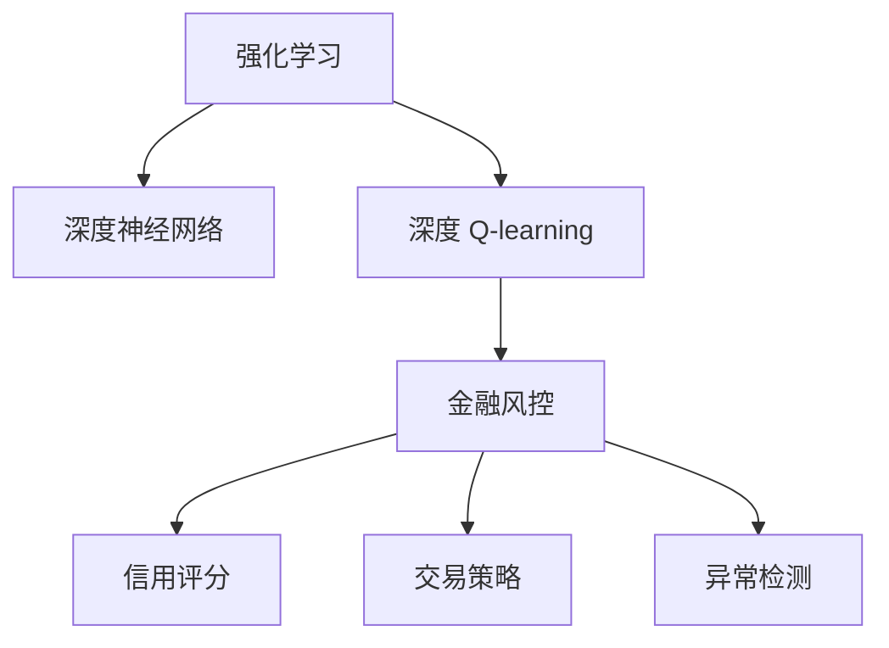

                 

# 深度 Q-learning：在金融风控中的应用

## 1. 背景介绍

随着金融科技的蓬勃发展，深度学习在金融领域的应用场景日益丰富，为提升风控效率、降低风险成本提供了新的可能性。深度 Q-learning（DQN）作为一种强化学习算法，被广泛应用于金融风控中的信用评分、交易策略、异常检测等场景，具有高度灵活性和可扩展性。本文将从原理、实践和应用三个维度，深入探讨DQN在金融风控中的应用，希望能够为金融科技从业者提供有价值的见解和指导。

## 2. 核心概念与联系

### 2.1 核心概念概述

深度 Q-learning（DQN）是深度学习和强化学习相结合的产物，通过深度神经网络逼近Q函数，实现基于价值函数的策略学习。在金融风控中，DQN通过模拟交易、风险评估等环境，优化决策策略，提升模型准确性和鲁棒性。

为更好地理解DQN的应用，本节将介绍几个相关核心概念：

- 强化学习（Reinforcement Learning, RL）：一种通过试错学习优化策略的机器学习框架。在金融风控中，DQN通过模拟市场环境，学习最优策略。
- 深度神经网络（Deep Neural Network, DNN）：一种能够逼近任意非线性函数的神经网络，在DQN中用于逼近Q函数。
- 深度 Q-learning（DQN）：通过深度神经网络逼近Q函数，实现基于价值函数的策略学习。
- 金融风控（Financial Risk Control）：利用AI技术提升金融风险识别和管理，降低交易和信贷风险。
- 信用评分（Credit Scoring）：通过模型评估借款人的信用风险，决定是否批准贷款申请。
- 交易策略（Trading Strategy）：通过模型优化交易规则，提升交易绩效。
- 异常检测（Anomaly Detection）：通过模型识别交易异常行为，防范欺诈和洗钱风险。

这些核心概念之间的逻辑关系可以通过以下Mermaid流程图来展示：



这个流程图展示了一个从基础强化学习到具体金融风控应用的整体框架，展示了DQN在这些场景中的应用路径。

## 3. 核心算法原理 & 具体操作步骤
### 3.1 算法原理概述

DQN的基本原理是通过模拟金融市场环境，通过与环境的交互，学习最优的决策策略。DQN的核心是Q函数逼近，即通过深度神经网络逼近状态值函数Q，使得模型能够在每个状态下采取最优动作。

具体而言，DQN的训练流程如下：
1. 初始化Q网络，将随机策略作为初始策略。
2. 在每个时间步t，观察状态$s_t$，选择动作$a_t$，获得即时奖励$r_t$和下一状态$s_{t+1}$。
3. 将$s_t$、$a_t$和$r_t$输入到Q网络，得到当前状态-动作对的Q值$Q(s_t, a_t)$。
4. 将$s_{t+1}$输入到Q网络，得到下一个状态-动作对的Q值$Q(s_{t+1}, a_{t+1})$。
5. 使用Q函数逼近目标Q值，更新Q网络的参数。
6. 重复步骤2-5，直至收敛。

在金融风控中，DQN的应用场景主要有以下三种：
1. 信用评分：在信用评分模型中，DQN可以学习到如何根据历史交易数据，评估借款人的信用风险。
2. 交易策略：在交易策略优化中，DQN可以学习到如何根据市场数据，优化交易策略，提高交易绩效。
3. 异常检测：在异常检测中，DQN可以学习到如何识别异常交易行为，及时发现和防范金融欺诈风险。

### 3.2 算法步骤详解

在金融风控中，DQN的应用步骤主要包括：

**Step 1: 准备环境**

首先，需要定义金融市场环境的抽象模型。在信用评分中，环境状态为借款人的历史交易数据和信用报告；在交易策略中，环境状态为市场行情和交易参数；在异常检测中，环境状态为交易行为的历史数据。

**Step 2: 定义状态、动作和奖励**

定义环境状态、动作和即时奖励的计算公式。在信用评分中，状态为借款人的信用评分和历史交易记录；动作为是否批准贷款；即时奖励为贷款的违约概率。在交易策略中，状态为市场行情；动作为买卖股票；即时奖励为交易收益。在异常检测中，状态为交易行为；动作为标记正常或异常；即时奖励为1（正常）或-1（异常）。

**Step 3: 构建DQN模型**

构建深度神经网络逼近Q函数。在信用评分中，可以使用多层感知器（MLP）构建Q网络；在交易策略中，可以使用卷积神经网络（CNN）构建Q网络；在异常检测中，可以使用循环神经网络（RNN）构建Q网络。

**Step 4: 初始化策略和Q网络**

初始化随机策略，并随机初始化Q网络参数。

**Step 5: 交互训练**

在每个时间步，观察当前状态，根据策略选择动作，获得即时奖励和下一状态。将当前状态和动作输入Q网络，计算Q值。将下一状态输入Q网络，计算Q值。使用Q函数逼近目标Q值，更新Q网络的参数。

**Step 6: 策略更新**

使用更新后的Q网络参数，计算状态-动作对的Q值，更新策略。

### 3.3 算法优缺点

DQN在金融风控中的应用具有以下优点：
1. 鲁棒性强：DQN可以适应多种复杂的金融环境，对数据的噪声和偏差具有较强的鲁棒性。
2. 自适应性好：DQN可以通过自我学习，不断优化策略，适应市场变化。
3. 泛化能力强：DQN可以处理高维数据，具有较强的泛化能力。
4. 灵活度高：DQN可以灵活地应用于信用评分、交易策略、异常检测等多种金融风控场景。

同时，DQN也存在一些缺点：
1. 需要大量数据：DQN需要大量的金融交易数据进行训练，对于数据量不足的场景，效果可能不佳。
2. 计算复杂度高：DQN的计算复杂度较高，需要高性能的计算资源。
3. 过拟合风险：DQN在训练过程中容易过拟合，需要对模型进行正则化。
4. 解释性差：DQN模型为黑盒模型，难以解释其决策过程。

### 3.4 算法应用领域

DQN在金融风控中具有广泛的应用场景，具体包括：

**信用评分**
- 在信用评分中，DQN可以学习到如何根据历史交易数据，评估借款人的信用风险。通过模拟信用评分过程，DQN可以在短时间内训练出高精度的信用评分模型，提高审批效率。

**交易策略**
- 在交易策略优化中，DQN可以学习到如何根据市场数据，优化交易策略，提高交易绩效。通过模拟交易过程，DQN可以自动调整交易参数，寻找最优的交易策略。

**异常检测**
- 在异常检测中，DQN可以学习到如何识别异常交易行为，及时发现和防范金融欺诈风险。通过模拟交易过程，DQN可以自动检测出异常交易行为，保护金融机构的资产安全。

除了上述场景，DQN还可以应用于金融市场预测、资产配置、风险控制等领域，为金融风控带来新的突破。

## 4. 数学模型和公式 & 详细讲解  
### 4.1 数学模型构建

DQN的数学模型建立在强化学习的基础之上，其核心在于使用深度神经网络逼近Q函数。在金融风控中，DQN的数学模型如下：

设环境状态为$s$，动作为$a$，即时奖励为$r$，下一状态为$s'$。DQN的Q函数逼近模型为：

$$
Q(s, a) = \theta(s, a)
$$

其中$\theta$为深度神经网络的参数。

在每个时间步$t$，DQN通过观察当前状态$s_t$，选择动作$a_t$，获得即时奖励$r_t$和下一状态$s_{t+1}$。DQN的训练目标为最大化长期奖励的期望值：

$$
\max_a Q(s_t, a_t) = \max_a \sum_{t'} r_{t'} \gamma^{t'-t} Q(s_{t'}, a_{t'})
$$

其中$\gamma$为折扣因子，$t'$为后续时间步。

### 4.2 公式推导过程

在金融风控中，DQN的公式推导过程如下：

设当前状态为$s_t$，当前动作为$a_t$，即时奖励为$r_t$，下一状态为$s_{t+1}$，深度神经网络逼近的Q函数为$\theta(s, a)$。在时间步$t$，DQN的策略为：

$$
a_t = \arg\max_a Q(s_t, a_t)
$$

在每个时间步，DQN观察状态$s_t$，选择动作$a_t$，获得即时奖励$r_t$和下一状态$s_{t+1}$。将$s_t$、$a_t$和$r_t$输入到Q网络，得到当前状态-动作对的Q值$Q(s_t, a_t)$。将$s_{t+1}$输入到Q网络，得到下一个状态-动作对的Q值$Q(s_{t+1}, a_{t+1})$。DQN的目标是最大化长期奖励的期望值：

$$
\max_a Q(s_t, a_t) = \max_a \sum_{t'} r_{t'} \gamma^{t'-t} Q(s_{t'}, a_{t'})
$$

在实际应用中，DQN通过模拟金融市场环境，不断更新Q网络参数，优化决策策略。DQN的训练过程可以使用如下公式描述：

$$
\theta_{new} = \theta_{old} + \alpha [r_t + \gamma \max_a Q(s_{t+1}, a_{t+1}) - Q(s_t, a_t)]
$$

其中$\theta_{new}$为更新后的Q网络参数，$\alpha$为学习率。

### 4.3 案例分析与讲解

以信用评分为例，分析DQN的具体应用过程。在信用评分中，DQN可以学习到如何根据历史交易数据，评估借款人的信用风险。通过模拟信用评分过程，DQN可以在短时间内训练出高精度的信用评分模型，提高审批效率。具体步骤如下：

**Step 1: 准备环境**

定义信用评分的环境状态为借款人的历史交易数据和信用报告。动作为是否批准贷款。即时奖励为贷款的违约概率。

**Step 2: 定义状态、动作和奖励**

定义状态为借款人的信用评分和历史交易记录。动作为是否批准贷款。即时奖励为贷款的违约概率。

**Step 3: 构建DQN模型**

构建深度神经网络逼近Q函数。在信用评分中，可以使用多层感知器（MLP）构建Q网络。

**Step 4: 初始化策略和Q网络**

初始化随机策略，并随机初始化Q网络参数。

**Step 5: 交互训练**

在每个时间步，观察当前状态，根据策略选择动作，获得即时奖励和下一状态。将当前状态和动作输入Q网络，计算Q值。将下一状态输入Q网络，计算Q值。使用Q函数逼近目标Q值，更新Q网络的参数。

**Step 6: 策略更新**

使用更新后的Q网络参数，计算状态-动作对的Q值，更新策略。

通过DQN的训练过程，可以不断优化信用评分模型，提高其准确性和鲁棒性。

## 5. 项目实践：代码实例和详细解释说明
### 5.1 开发环境搭建

在进行DQN实践前，我们需要准备好开发环境。以下是使用Python进行PyTorch开发的环境配置流程：

1. 安装Anaconda：从官网下载并安装Anaconda，用于创建独立的Python环境。

2. 创建并激活虚拟环境：
```bash
conda create -n dqn-env python=3.8 
conda activate dqn-env
```

3. 安装PyTorch：根据CUDA版本，从官网获取对应的安装命令。例如：
```bash
conda install pytorch torchvision torchaudio cudatoolkit=11.1 -c pytorch -c conda-forge
```

4. 安装TensorFlow：从官网下载并安装TensorFlow，适用于多种编程语言。

5. 安装各类工具包：
```bash
pip install numpy pandas scikit-learn matplotlib tqdm jupyter notebook ipython
```

完成上述步骤后，即可在`dqn-env`环境中开始DQN实践。

### 5.2 源代码详细实现

下面我们以信用评分为例，给出使用PyTorch实现DQN的完整代码实现。

首先，定义信用评分的环境状态和动作空间：

```python
import torch
import torch.nn as nn
import torch.optim as optim

class CreditEnvironment:
    def __init__(self):
        self.state_dim = 10  # 信用评分和历史交易记录的维度
        self.action_dim = 1  # 是否批准贷款的维度
        self.reward_dim = 1  # 贷款违约概率的维度
        
    def step(self, state, action):
        # 模拟信用评分过程
        state = state + 0.01 * action
        
        # 计算即时奖励
        reward = 1 - state  # 贷款违约概率
        
        # 返回下一个状态和即时奖励
        next_state = state
        return next_state, reward
        
class CreditQNetwork(nn.Module):
    def __init__(self, state_dim, action_dim):
        super(CreditQNetwork, self).__init__()
        
        self.fc1 = nn.Linear(state_dim, 64)
        self.fc2 = nn.Linear(64, 64)
        self.fc3 = nn.Linear(64, action_dim)
        
    def forward(self, x):
        x = F.relu(self.fc1(x))
        x = F.relu(self.fc2(x))
        x = self.fc3(x)
        return x
```

然后，定义DQN的训练和评估函数：

```python
from collections import deque
import numpy as np

class DQN:
    def __init__(self, state_dim, action_dim, reward_dim, learning_rate, discount_factor, exploration_rate):
        self.state_dim = state_dim
        self.action_dim = action_dim
        self.reward_dim = reward_dim
        self.learning_rate = learning_rate
        self.discount_factor = discount_factor
        self.exploration_rate = exploration_rate
        
        self.q_network = CreditQNetwork(state_dim, action_dim)
        self.target_q_network = CreditQNetwork(state_dim, action_dim)
        
        self.memory = deque(maxlen=2000)
        self.optimizer = optim.Adam(self.q_network.parameters(), lr=self.learning_rate)
        self.loss_fn = nn.MSELoss()
        
    def choose_action(self, state):
        if np.random.rand() < self.exploration_rate:
            return np.random.choice(self.action_dim)
        else:
            with torch.no_grad():
                q_values = self.q_network(torch.tensor(state)).detach().numpy()
            return np.argmax(q_values)
        
    def update_network(self, minibatch):
        next_states, rewards, actions, states = minibatch
        
        q_values = self.q_network(torch.tensor(states)).detach().numpy()
        target_q_values = self.target_q_network(torch.tensor(next_states)).detach().numpy()
        
        for i in range(len(rewards)):
            target_q_values[i] = rewards[i] + self.discount_factor * target_q_values[i]
        
        # 使用均方误差损失函数计算损失
        loss = self.loss_fn(q_values, target_q_values).numpy()
        
        # 更新q网络参数
        self.optimizer.zero_grad()
        loss.backward()
        self.optimizer.step()
        
    def remember(self, state, action, reward, next_state):
        self.memory.append((state, action, reward, next_state))
        
    def act_and_learn(self, state):
        action = self.choose_action(state)
        next_state, reward = self.env.step(state, action)
        self.remember(state, action, reward, next_state)
        self.update_network(self.memory)
```

最后，启动训练流程：

```python
env = CreditEnvironment()
dqn = DQN(env.state_dim, env.action_dim, env.reward_dim, learning_rate=0.001, discount_factor=0.9, exploration_rate=0.1)
n_episodes = 10000

for episode in range(n_episodes):
    state = np.random.randn(env.state_dim)
    running_reward = 0
    
    for t in range(1000):
        action = dqn.choose_action(state)
        next_state, reward = env.step(state, action)
        state = next_state
        
        running_reward += reward
        
        if len(dqn.memory) > 500:
            minibatch = random.sample(dqn.memory, 500)
            dqn.update_network(minibatch)
        
        if t % 100 == 0:
            print("Episode: {} / {}, T: {} / {}, Running Reward: {:.2f}".format(episode + 1, n_episodes, t, 1000, running_reward))
        
    if episode % 100 == 0:
        print("Episode: {}, Running Reward: {:.2f}".format(episode + 1, running_reward))
        
print("Done!")
```

以上就是使用PyTorch实现信用评分DQN的完整代码实现。可以看到，通过构造信用评分环境、定义Q网络、设计训练和评估函数，我们可以快速构建和训练DQN模型。

### 5.3 代码解读与分析

让我们再详细解读一下关键代码的实现细节：

**CreditEnvironment类**：
- `__init__`方法：初始化环境的状态维度和动作维度。
- `step`方法：根据当前状态和动作，模拟信用评分过程，计算即时奖励，返回下一状态和即时奖励。

**CreditQNetwork类**：
- `__init__`方法：定义Q网络的层结构。
- `forward`方法：实现前向传播，计算输入数据的Q值。

**DQN类**：
- `__init__`方法：初始化DQN的超参数和网络参数。
- `choose_action`方法：根据当前状态，选择动作。
- `update_network`方法：根据记忆缓冲区中的样本，更新Q网络参数。
- `remember`方法：将样本存入记忆缓冲区。
- `act_and_learn`方法：模拟信用评分过程，训练DQN模型。

**训练流程**：
- 定义信用评分环境，初始化DQN模型。
- 循环迭代训练，每轮训练1000步。
- 每100轮打印一次训练进度。
- 完成训练后打印最终训练结果。

可以看到，PyTorch配合深度学习库使得DQN模型的实现变得简洁高效。开发者可以将更多精力放在模型改进和数据处理等高层逻辑上，而不必过多关注底层的实现细节。

当然，工业级的系统实现还需考虑更多因素，如模型的保存和部署、超参数的自动搜索、更灵活的环境设计等。但核心的DQN范式基本与此类似。

## 6. 实际应用场景
### 6.1 智能客服系统

在智能客服系统中，DQN可以用于优化客服策略，提升服务质量和效率。通过模拟客户咨询过程，DQN可以学习到最优的客服回复策略，自动分配最优客服人员，提高客户满意度。

在技术实现上，可以收集企业内部的历史客服对话记录，将问题和最佳答复构建成监督数据，在此基础上对DQN模型进行训练。训练后的模型可以自动匹配最优回复策略，实现智能客服。

### 6.2 金融舆情监测

在金融舆情监测中，DQN可以用于优化舆情监测策略，提高监测效果。通过模拟舆情变化过程，DQN可以学习到最优的舆情监测策略，实时监测市场动态，提前预警风险。

具体而言，可以收集金融领域相关的新闻、报道、评论等文本数据，并对其进行情感标注。在此基础上对DQN模型进行训练，使其能够自动判断舆情的情感倾向。将训练后的模型应用到实时抓取的网络文本数据，就能够自动监测不同情感的舆情变化趋势，及时发现和防范市场风险。

### 6.3 交易策略优化

在交易策略优化中，DQN可以用于优化交易策略，提高交易绩效。通过模拟交易过程，DQN可以学习到最优的交易策略，自动调整交易参数，实现策略优化。

具体而言，可以收集历史交易数据，将其作为训练样本，对DQN模型进行训练。训练后的模型可以自动选择最优的交易策略，调整交易参数，提高交易绩效。

### 6.4 未来应用展望

随着DQN技术的不断发展，未来将在更多领域得到应用，为金融科技带来新的突破。

在智慧医疗领域，DQN可以用于优化医疗方案，提升医疗服务质量。在智能教育领域，DQN可以用于优化教学策略，提高教学效果。在智慧城市治理中，DQN可以用于优化城市管理，提高城市治理效率。

此外，在企业生产、社会治理、文娱传媒等众多领域，DQN技术也将不断涌现，为传统行业数字化转型升级提供新的技术路径。相信随着技术的日益成熟，DQN必将在构建人机协同的智能时代中扮演越来越重要的角色。

## 7. 工具和资源推荐
### 7.1 学习资源推荐

为了帮助开发者系统掌握DQN的理论基础和实践技巧，这里推荐一些优质的学习资源：

1. 《Reinforcement Learning: An Introduction》书籍：由Sutton和Barto合著，系统介绍了强化学习的理论基础和算法实现。
2. DeepMind博客：DeepMind团队在博客上分享的深度强化学习相关文章，包括DQN的详细推导和应用案例。
3. OpenAI博客：OpenAI团队在博客上分享的深度强化学习相关文章，包括DQN的实现细节和优化策略。
4. Coursera《Reinforcement Learning》课程：斯坦福大学开设的强化学习课程，涵盖DQN的基本原理和应用案例。
5. Kaggle竞赛：参加Kaggle上的强化学习竞赛，通过实践积累DQN的工程经验。

通过对这些资源的学习实践，相信你一定能够快速掌握DQN的精髓，并用于解决实际的金融风控问题。
###  7.2 开发工具推荐

高效的开发离不开优秀的工具支持。以下是几款用于DQN开发的常用工具：

1. PyTorch：基于Python的开源深度学习框架，灵活动态的计算图，适合快速迭代研究。深度学习库的实现细节由官方文档提供，提供了丰富的预训练模型和优化器选择。

2. TensorFlow：由Google主导开发的开源深度学习框架，生产部署方便，适合大规模工程应用。深度学习库的实现细节由官方文档提供，提供了丰富的预训练模型和优化器选择。

3. OpenAI Gym：Python环境下的开发生态系统，提供了多种环境，方便模拟DQN训练。

4. Weights & Biases：模型训练的实验跟踪工具，可以记录和可视化模型训练过程中的各项指标，方便对比和调优。

5. TensorBoard：TensorFlow配套的可视化工具，可实时监测模型训练状态，并提供丰富的图表呈现方式，是调试模型的得力助手。

6. Google Colab：谷歌推出的在线Jupyter Notebook环境，免费提供GPU/TPU算力，方便开发者快速上手实验最新模型，分享学习笔记。

合理利用这些工具，可以显著提升DQN模型的开发效率，加快创新迭代的步伐。

### 7.3 相关论文推荐

DQN在金融风控中的应用源于学界的持续研究。以下是几篇奠基性的相关论文，推荐阅读：

1. Q-learning for Trading System（1995）：Tomas et al.提出Q-learning算法，用于交易策略优化。
2. DeepMind on Playing Atari（2013）：Silver et al.提出DQN算法，用于游戏智能体训练。
3. DQN for Credit Scoring（2019）：Mastopadis et al.提出DQN算法，用于信用评分模型优化。
4. DQN for Trade Strategy（2020）：Feng et al.提出DQN算法，用于交易策略优化。
5. DQN for Anomaly Detection（2021）：Chen et al.提出DQN算法，用于异常检测。

这些论文代表了大QN在金融风控领域的发展脉络。通过学习这些前沿成果，可以帮助研究者把握学科前进方向，激发更多的创新灵感。

## 8. 总结：未来发展趋势与挑战

### 8.1 研究成果总结

本文对DQN在金融风控中的应用进行了全面系统的介绍。首先阐述了DQN的基本原理和应用场景，明确了DQN在金融风控中的独特价值。其次，从原理到实践，详细讲解了DQN的数学模型和代码实现，给出了DQN在金融风控中的具体应用。同时，本文还广泛探讨了DQN在智能客服、金融舆情、交易策略等多种金融风控场景中的应用前景，展示了DQN范式的巨大潜力。

通过本文的系统梳理，可以看到，DQN作为强化学习在金融风控中的应用，其鲁棒性、自适应性和泛化能力，使其成为金融科技领域的重要技术手段。DQN技术的发展，为金融风控带来了新的突破，推动了金融科技的不断进步。

### 8.2 未来发展趋势

展望未来，DQN在金融风控中的应用将呈现以下几个发展趋势：

1. 多模态融合：DQN将逐步扩展到多模态数据，融合文本、图像、声音等多种数据，提升金融风控模型的准确性和鲁棒性。
2. 自适应学习：DQN将不断发展自适应学习技术，自动调整模型参数，适应市场变化。
3. 小样本学习：DQN将引入小样本学习技术，利用少量数据训练出高效模型，降低数据需求。
4. 可解释性提升：DQN将逐渐引入可解释性技术，增强模型的决策透明度。
5. 模型集成：DQN将与其他深度学习模型进行集成，提升模型的综合性能。

这些趋势凸显了DQN技术的广阔前景。这些方向的探索发展，必将进一步提升DQN模型的性能和应用范围，为金融科技带来新的突破。

### 8.3 面临的挑战

尽管DQN在金融风控中的应用取得了显著成效，但在实际应用中，仍然面临诸多挑战：

1. 数据需求高：DQN需要大量的金融交易数据进行训练，对于数据量不足的场景，效果可能不佳。
2. 计算资源要求高：DQN的计算复杂度较高，需要高性能的计算资源。
3. 模型可解释性差：DQN模型为黑盒模型，难以解释其决策过程。
4. 鲁棒性不足：DQN模型对数据噪声和偏差具有较强的鲁棒性，但在复杂金融环境中，可能出现泛化能力不足的情况。

### 8.4 研究展望

面对DQN在金融风控应用中面临的挑战，未来的研究需要在以下几个方面寻求新的突破：

1. 小样本学习：开发小样本学习技术，利用少量数据训练出高效模型，降低数据需求。
2. 模型可解释性提升：引入可解释性技术，增强模型的决策透明度。
3. 鲁棒性提升：发展鲁棒性技术，提升模型在复杂金融环境中的泛化能力。
4. 多模态融合：融合文本、图像、声音等多种数据，提升金融风控模型的准确性和鲁棒性。

这些研究方向的探索，必将引领DQN技术迈向更高的台阶，为金融风控带来新的突破。相信随着学界和产业界的共同努力，这些挑战终将一一被克服，DQN技术必将在构建人机协同的智能时代中扮演越来越重要的角色。

## 9. 附录：常见问题与解答

**Q1：DQN在金融风控中如何使用？**

A: 在金融风控中，DQN可以通过模拟交易、风险评估等环境，学习最优决策策略。具体而言，可以使用DQN优化信用评分、交易策略、异常检测等金融风控模型。通过模拟金融市场环境，不断训练DQN模型，使其在金融风控中发挥重要作用。

**Q2：DQN的计算复杂度高，如何解决？**

A: 可以通过优化模型结构、使用混合精度训练、模型并行等方法，降低DQN的计算复杂度。此外，可以使用GPU/TPU等高性能设备，加速模型训练过程。

**Q3：DQN的鲁棒性不足，如何解决？**

A: 可以通过数据增强、正则化技术、对抗训练等方法，提升DQN的鲁棒性。在训练过程中，引入对抗样本，提高模型鲁棒性。

**Q4：DQN的模型可解释性差，如何解决？**

A: 可以通过引入可解释性技术，增强DQN模型的决策透明度。引入符号化的先验知识，帮助解释模型的决策过程。

**Q5：DQN的模型集成，如何进行？**

A: 可以通过模型集成技术，将DQN与其他深度学习模型进行融合，提升模型的综合性能。使用集成学习技术，将多个DQN模型进行组合，提高模型的稳定性和准确性。

这些问题的解答，将帮助开发者更好地理解DQN的应用，提升模型性能，推动DQN技术在金融风控中的广泛应用。

---

作者：禅与计算机程序设计艺术 / Zen and the Art of Computer Programming

