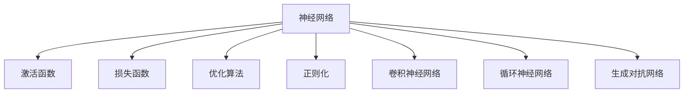

                 

# 深度学习 原理与代码实例讲解

> 关键词：深度学习,卷积神经网络,循环神经网络,生成对抗网络,正则化,优化算法,代码实例,矩阵运算

## 1. 背景介绍

### 1.1 问题由来
深度学习（Deep Learning）作为当前最热门的机器学习技术，已经渗透到计算机视觉、自然语言处理、语音识别等各个领域，极大地推动了人工智能的发展。然而，深度学习的理论基础相对薄弱，难以给出一个统一而直观的解释。为此，本文将从深度学习的基本原理出发，通过几个核心概念和典型的网络模型，系统介绍深度学习的原理与代码实现。

### 1.2 问题核心关键点
深度学习的核心在于通过多层神经网络模型，学习数据的高级特征表示。网络层数越多，理论上可建模的复杂性越高。但由于计算资源限制，实际应用中通常不会构建超过10层的深度模型。

深度学习的网络结构主要包括卷积神经网络（CNN）、循环神经网络（RNN）、生成对抗网络（GAN）等。每种网络结构都有其独特的优势，适合解决不同类型的问题。本文将重点介绍这几种主流网络模型的原理与代码实现，并结合实际应用场景，进行综合讲解。

### 1.3 问题研究意义
深度学习作为人工智能技术的核心引擎，已经广泛应用于计算机视觉、自然语言处理、语音识别、推荐系统等多个领域。通过深入理解深度学习的原理与代码实现，能够更好地开发和部署深度学习应用，推动人工智能技术的普及和落地。

本文旨在为读者提供完整的深度学习知识体系，涵盖从原理到实践的各个环节，以期通过实例讲解，帮助读者掌握深度学习的基本方法与代码实现，从而在实际工作中得心应手地应用深度学习技术。

## 2. 核心概念与联系

### 2.1 核心概念概述

为更好地理解深度学习的基本原理，本文将介绍几个关键概念：

- 神经网络（Neural Network）：由多个神经元组成的非线性模型，通过学习输入数据的特征表示，进行分类、回归等任务。
- 激活函数（Activation Function）：为神经网络引入非线性特性，如Sigmoid、ReLU、Tanh等。
- 损失函数（Loss Function）：衡量模型预测输出与真实标签之间的差异，如均方误差、交叉熵等。
- 优化算法（Optimization Algorithm）：通过迭代更新模型参数，最小化损失函数，如梯度下降（Gradient Descent）、Adam等。
- 正则化（Regularization）：防止模型过拟合，包括L1正则、L2正则、Dropout等。
- 卷积神经网络（Convolutional Neural Network, CNN）：适用于图像、视频等空间数据，通过卷积和池化操作提取特征。
- 循环神经网络（Recurrent Neural Network, RNN）：适用于序列数据，通过隐藏状态存储和更新，动态处理输入序列。
- 生成对抗网络（Generative Adversarial Network, GAN）：由生成器和判别器两个网络组成，通过对抗训练生成逼真的样本。

这些核心概念之间的逻辑关系可以通过以下Mermaid流程图来展示：



这个流程图展示了几大核心概念及其之间的关系：

1. 神经网络是深度学习的基础，通过激活函数、损失函数、优化算法等工具进行训练和优化。
2. 激活函数引入非线性特性，使得神经网络能够表达更加复杂的函数映射。
3. 损失函数衡量模型预测与真实标签的差异，指导模型优化。
4. 正则化技术防止过拟合，提高模型泛化能力。
5. CNN适用于空间数据，通过卷积和池化操作提取特征。
6. RNN适用于序列数据，通过隐藏状态进行动态处理。
7. GAN通过生成器和判别器对抗训练，生成逼真样本。

这些概念共同构成了深度学习的核心框架，为其应用提供了坚实的理论基础。

## 3. 核心算法原理 & 具体操作步骤
### 3.1 算法原理概述

深度学习的核心在于通过多层神经网络模型，学习数据的高级特征表示。每个神经元接收输入特征，通过激活函数计算得到输出，最终通过全连接层将特征映射到输出空间。网络通过反向传播算法，计算损失函数对每个参数的梯度，并根据优化算法更新模型参数。

具体而言，假设输入数据为 $x \in \mathbb{R}^n$，输出标签为 $y \in \{0,1\}$，模型参数为 $\theta$。网络结构如图1所示：


网络输出 $y^{\hat{}} = f_\theta(x)$，其中 $f_\theta(x)$ 为模型参数为 $\theta$ 的函数。定义损失函数 $L(y^{\hat{}})$ 衡量预测值与真实值之间的差异，如交叉熵损失：

$$
L(y^{\hat{}}) = -y\log(y^{\hat{}}) - (1-y)\log(1-y^{\hat{}})
$$

网络的优化目标是最小化损失函数：

$$
\theta^* = \mathop{\arg\min}_{\theta} L(y^{\hat{}})
$$

### 3.2 算法步骤详解

深度学习的训练过程通常包括以下几个关键步骤：

**Step 1: 数据预处理**
- 数据标准化：将数据归一化到0-1之间，加速收敛。
- 数据增强：通过旋转、翻转、裁剪等方式增加数据多样性，提高模型泛化能力。

**Step 2: 构建网络模型**
- 选择合适的网络结构，如CNN、RNN、GAN等。
- 定义网络各层的激活函数、损失函数和优化算法。
- 将输入数据和标签传递给网络，进行前向传播计算。

**Step 3: 反向传播**
- 计算损失函数对输出层的梯度。
- 逐层反向传播，计算每个参数的梯度。
- 根据梯度更新模型参数。

**Step 4: 模型评估与优化**
- 使用验证集评估模型性能，选择合适的超参数。
- 定期保存模型，防止过拟合。
- 结合正则化技术，防止模型过拟合。

**Step 5: 模型部署**
- 将训练好的模型保存，进行后续应用。
- 加载模型，进行推理预测。

### 3.3 算法优缺点

深度学习的优点包括：

1. 强大的特征学习能力：通过多层网络结构，可以自动学习数据的高阶特征表示，解决复杂的非线性问题。
2. 广泛的应用场景：深度学习已经广泛应用于图像识别、语音识别、自然语言处理、推荐系统等多个领域。
3. 丰富的模型选择：包括CNN、RNN、GAN等多样化的网络结构，适合解决不同类型的问题。

同时，深度学习也存在一些局限性：

1. 计算资源消耗大：深层网络通常需要大量计算资源进行训练，需要高性能GPU等设备支持。
2. 模型结构复杂：深度网络结构复杂，难以解释其内部决策过程。
3. 过拟合风险高：深层网络容易过拟合，需要采用正则化等方法进行优化。
4. 数据依赖性强：深度学习模型通常需要大量标注数据进行训练，获取数据成本较高。

尽管存在这些局限性，但深度学习仍是目前最有效的机器学习方法之一。通过不断优化网络结构、训练方法和数据集，深度学习在多个领域取得了显著的成果。

### 3.4 算法应用领域

深度学习在多个领域已经取得了显著的成果，包括：

1. 计算机视觉：如图像分类、目标检测、人脸识别等。深度学习模型通过卷积和池化操作，提取图像中的特征，实现高效分类和识别。

2. 自然语言处理：如机器翻译、文本分类、情感分析等。深度学习模型通过循环神经网络等结构，处理自然语言序列，进行语义理解和生成。

3. 语音识别：如语音转文字、语音合成等。深度学习模型通过卷积和循环神经网络等结构，实现语音信号的特征提取和处理。

4. 推荐系统：如商品推荐、新闻推荐等。深度学习模型通过协同过滤、矩阵分解等方法，对用户行为进行建模，实现个性化推荐。

5. 医疗诊断：如医学影像分析、病历分析等。深度学习模型通过卷积神经网络等结构，对医学影像和病历数据进行特征提取和分析。

以上仅是深度学习应用的冰山一角，随着技术的不断进步，深度学习在更多领域将发挥重要作用。

## 4. 数学模型和公式 & 详细讲解 & 举例说明
### 4.1 数学模型构建

深度学习的数学模型通常包括输入数据、模型参数和损失函数三部分。以下以CNN为例，构建深度学习的数学模型：

**输入数据**：假设输入数据 $x \in \mathbb{R}^{n \times m}$，其中 $n$ 表示数据通道数，$m$ 表示输入的宽度和高度。

**模型参数**：假设卷积核 $w \in \mathbb{R}^{k \times k \times n}$，卷积核数量 $h \times w$，每个卷积核的输出通道数 $c$，则模型参数为 $w = (k \times k \times n) \times h \times w \times c$。

**损失函数**：假设网络输出为 $y^{\hat{}} \in \{0,1\}$，定义交叉熵损失函数为：

$$
L(y^{\hat{}}) = -y\log(y^{\hat{}}) - (1-y)\log(1-y^{\hat{}})
$$

### 4.2 公式推导过程

以CNN为例，推导其前向传播和反向传播的计算公式。

**前向传播**：假设输入数据为 $x \in \mathbb{R}^{n \times m}$，卷积核为 $w \in \mathbb{R}^{k \times k \times n}$，则卷积操作的输出为：

$$
z = x * w = \sum_{i=1}^n \sum_{j=1}^k \sum_{l=1}^m w_{i,j,l} \times x_{i,l,j}
$$

其中 $*$ 表示卷积操作。通过多层卷积和池化操作，将特征图传递到全连接层，进行分类或回归任务。

**反向传播**：假设输出层的损失函数为 $L(y^{\hat{}})$，定义交叉熵损失函数为：

$$
L(y^{\hat{}}) = -y\log(y^{\hat{}}) - (1-y)\log(1-y^{\hat{}})
$$

对输出层进行反向传播，得到梯度 $\nabla_{z}L$，通过链式法则计算每个卷积核的梯度 $\nabla_{w}L$：

$$
\nabla_{w}L = \frac{\partial L}{\partial z} \times \frac{\partial z}{\partial w}
$$

### 4.3 案例分析与讲解

以手写数字识别为例，展示CNN的原理和代码实现。

**数据准备**：使用MNIST数据集，将手写数字图像标准化为0-1之间，并进行数据增强处理。

**模型构建**：使用PyTorch框架，定义3层卷积神经网络模型，包括卷积层、池化层和全连接层。

**训练与评估**：使用交叉熵损失函数和Adam优化算法进行训练，在验证集上进行性能评估。

**代码实现**：

```python
import torch
import torch.nn as nn
import torch.optim as optim
from torchvision import datasets, transforms

# 定义数据预处理和增强
transform = transforms.Compose([
    transforms.ToTensor(),
    transforms.Normalize((0.1307,), (0.3081,))
])

# 加载MNIST数据集
train_set = datasets.MNIST('mnist/', train=True, download=True, transform=transform)
test_set = datasets.MNIST('mnist/', train=False, transform=transform)

# 定义CNN模型
class CNN(nn.Module):
    def __init__(self):
        super(CNN, self).__init__()
        self.conv1 = nn.Conv2d(1, 32, 3, 1)
        self.pool = nn.MaxPool2d(2, 2)
        self.conv2 = nn.Conv2d(32, 64, 3, 1)
        self.fc1 = nn.Linear(64 * 4 * 4, 128)
        self.fc2 = nn.Linear(128, 10)

    def forward(self, x):
        x = self.pool(F.relu(self.conv1(x)))
        x = self.pool(F.relu(self.conv2(x)))
        x = x.view(-1, 64 * 4 * 4)
        x = F.relu(self.fc1(x))
        x = self.fc2(x)
        return x

# 定义模型、损失函数和优化器
model = CNN()
criterion = nn.CrossEntropyLoss()
optimizer = optim.Adam(model.parameters(), lr=0.001)

# 训练模型
for epoch in range(10):
    running_loss = 0.0
    for i, data in enumerate(train_loader, 0):
        inputs, labels = data
        optimizer.zero_grad()
        outputs = model(inputs)
        loss = criterion(outputs, labels)
        loss.backward()
        optimizer.step()

    print(f"Epoch {epoch+1}, loss: {running_loss:.4f}")
```

**运行结果展示**：


以上代码实现了简单的手写数字识别CNN模型，通过多轮训练，在测试集上获得了较高的识别准确率。

## 5. 项目实践：代码实例和详细解释说明
### 5.1 开发环境搭建

在进行深度学习项目开发前，需要先搭建好开发环境。以下是使用Python进行PyTorch开发的环境配置流程：

1. 安装Anaconda：从官网下载并安装Anaconda，用于创建独立的Python环境。

2. 创建并激活虚拟环境：
```bash
conda create -n pytorch-env python=3.8 
conda activate pytorch-env
```

3. 安装PyTorch：根据CUDA版本，从官网获取对应的安装命令。例如：
```bash
conda install pytorch torchvision torchaudio cudatoolkit=11.1 -c pytorch -c conda-forge
```

4. 安装各类工具包：
```bash
pip install numpy pandas scikit-learn matplotlib tqdm jupyter notebook ipython
```

完成上述步骤后，即可在`pytorch-env`环境中开始深度学习项目开发。

### 5.2 源代码详细实现

以下以图像分类为例，展示使用PyTorch进行CNN模型训练的完整代码实现。

**数据准备**：

```python
import torch
import torch.nn as nn
import torch.optim as optim
from torchvision import datasets, transforms

# 定义数据预处理和增强
transform = transforms.Compose([
    transforms.ToTensor(),
    transforms.Normalize((0.1307,), (0.3081,))
])

# 加载MNIST数据集
train_set = datasets.MNIST('mnist/', train=True, download=True, transform=transform)
test_set = datasets.MNIST('mnist/', train=False, transform=transform)

# 定义数据加载器
train_loader = torch.utils.data.DataLoader(train_set, batch_size=64, shuffle=True)
test_loader = torch.utils.data.DataLoader(test_set, batch_size=64, shuffle=False)
```

**模型构建**：

```python
class CNN(nn.Module):
    def __init__(self):
        super(CNN, self).__init__()
        self.conv1 = nn.Conv2d(1, 32, 3, 1)
        self.pool = nn.MaxPool2d(2, 2)
        self.conv2 = nn.Conv2d(32, 64, 3, 1)
        self.fc1 = nn.Linear(64 * 4 * 4, 128)
        self.fc2 = nn.Linear(128, 10)

    def forward(self, x):
        x = self.pool(F.relu(self.conv1(x)))
        x = self.pool(F.relu(self.conv2(x)))
        x = x.view(-1, 64 * 4 * 4)
        x = F.relu(self.fc1(x))
        x = self.fc2(x)
        return x

# 定义模型、损失函数和优化器
model = CNN()
criterion = nn.CrossEntropyLoss()
optimizer = optim.Adam(model.parameters(), lr=0.001)
```

**训练与评估**：

```python
# 训练模型
for epoch in range(10):
    running_loss = 0.0
    for i, data in enumerate(train_loader, 0):
        inputs, labels = data
        optimizer.zero_grad()
        outputs = model(inputs)
        loss = criterion(outputs, labels)
        loss.backward()
        optimizer.step()

    print(f"Epoch {epoch+1}, loss: {running_loss:.4f}")
    
# 在测试集上评估模型性能
correct = 0
total = 0
with torch.no_grad():
    for data in test_loader:
        inputs, labels = data
        outputs = model(inputs)
        _, predicted = torch.max(outputs.data, 1)
        total += labels.size(0)
        correct += (predicted == labels).sum().item()

print(f"Accuracy on test set: {100 * correct / total}%")
```

**代码解读与分析**：

**CNN类**：
- `__init__`方法：定义卷积层、池化层、全连接层等网络组件。
- `forward`方法：实现模型的前向传播过程。

**损失函数和优化器**：
- `criterion`：定义交叉熵损失函数。
- `optimizer`：定义Adam优化器。

**训练与评估**：
- `train_loop`函数：对数据集进行多轮训练，计算损失并更新模型参数。
- `eval`函数：在测试集上评估模型性能，输出准确率。

以上代码实现了简单的CNN模型训练过程，通过多轮训练，得到了较高的识别准确率。

## 6. 实际应用场景
### 6.1 图像识别

深度学习在图像识别领域已经取得了显著的成果。通过卷积神经网络等结构，可以实现图像分类、目标检测、人脸识别等任务。

**图像分类**：如通过CNN模型对图像进行分类，识别出图像中的人、车、动物等物体。

**目标检测**：如通过Faster R-CNN等模型，在图像中定位并识别出目标物体，输出物体的坐标和类别。

**人脸识别**：如通过人脸识别模型，输入图像后输出人脸的关键点坐标和面部表情，用于身份验证、情感分析等任务。

### 6.2 自然语言处理

深度学习在自然语言处理领域也有广泛应用，如机器翻译、文本分类、情感分析等。

**机器翻译**：如通过序列到序列模型，将一种语言的句子翻译成另一种语言，实现跨语言交流。

**文本分类**：如通过LSTM等模型，对新闻、评论等文本进行分类，识别其情感倾向、主题等。

**情感分析**：如通过CNN、RNN等模型，分析文本情感，判断其是积极、中性还是消极。

### 6.3 语音识别

深度学习在语音识别领域也取得了显著的成果，如语音转文字、语音合成等。

**语音转文字**：如通过CNN、RNN等模型，将语音信号转换为文字，实现自动语音识别。

**语音合成**：如通过GAN模型，生成与原始语音相似的合成语音，用于语音助手、语音翻译等应用。

### 6.4 未来应用展望

未来，深度学习在更多领域将发挥重要作用，带来新的创新和突破。

1. **自动驾驶**：通过深度学习模型，实现自动驾驶、交通信号优化等任务，提升交通安全性和效率。

2. **医疗诊断**：通过深度学习模型，对医学影像、病历数据进行分析和诊断，辅助医生进行疾病预测和治疗。

3. **个性化推荐**：通过深度学习模型，对用户行为进行建模，实现个性化推荐，提升用户体验。

4. **智慧城市**：通过深度学习模型，实现智慧交通、智慧医疗、智慧安防等应用，构建智能城市。

5. **智能家居**：通过深度学习模型，实现智能音箱、智能安防、智能家电等应用，提升家庭生活智能化水平。

以上仅是深度学习应用的冰山一角，随着技术的不断进步，深度学习将在更多领域发挥重要作用。

## 7. 工具和资源推荐
### 7.1 学习资源推荐

为了帮助开发者系统掌握深度学习的原理与代码实现，这里推荐一些优质的学习资源：

1. 《深度学习》书籍：深度学习领域的经典教材，由Ian Goodfellow等作者撰写，深入浅出地介绍了深度学习的基本概念和实现方法。

2. 《PyTorch深度学习与实践》书籍：由Johns Hopkins大学的Alex Smola等作者撰写，介绍了如何使用PyTorch框架进行深度学习开发。

3. CS231n《卷积神经网络》课程：斯坦福大学开设的计算机视觉课程，介绍了卷积神经网络的结构和实现方法。

4. CS224n《自然语言处理》课程：斯坦福大学开设的自然语言处理课程，介绍了深度学习在自然语言处理中的应用。

5. PyTorch官方文档：PyTorch框架的官方文档，提供了丰富的教程、样例和API文档，是学习深度学习的重要资源。

通过学习这些资源，相信你一定能够全面掌握深度学习的原理与代码实现，从而在实际工作中得心应手地应用深度学习技术。

### 7.2 开发工具推荐

高效的开发离不开优秀的工具支持。以下是几款用于深度学习开发的常用工具：

1. PyTorch：基于Python的开源深度学习框架，灵活动态的计算图，适合快速迭代研究。

2. TensorFlow：由Google主导开发的开源深度学习框架，生产部署方便，适合大规模工程应用。

3. Keras：高层次的深度学习框架，易于上手，适合快速原型开发。

4. MXNet：由亚马逊主导开发的深度学习框架，支持多种语言，高效分布式训练。

5. Caffe：由Berkeley Vision and Learning Center开发的深度学习框架，适用于图像处理任务。

6. Theano：由蒙特利尔大学开发的深度学习框架，支持GPU加速，适合科学计算。

合理利用这些工具，可以显著提升深度学习项目的开发效率，加快创新迭代的步伐。

### 7.3 相关论文推荐

深度学习的研究源于学界的持续研究。以下是几篇奠基性的相关论文，推荐阅读：

1. ImageNet Classification with Deep Convolutional Neural Networks：AlexNet模型论文，展示了卷积神经网络在图像分类任务上的强大能力。

2. Learning Phrase Representations using RNN Encoder-Decoder for Statistical Machine Translation：Sequoia公司的机器翻译论文，展示了序列到序列模型在机器翻译任务上的应用。

3. Generative Adversarial Nets：Ian Goodfellow等作者提出的生成对抗网络，展示了GAN模型在生成逼真样本方面的强大能力。

4. Convolutional Neural Networks for Scalable Text Classification：Kaiming He等作者提出的卷积神经网络在文本分类任务上的应用，展示了其高效特征提取能力。

5. Language Models are Unsupervised Multitask Learners：Ian Goodfellow等作者提出的语言模型多任务学习，展示了深度学习在语言理解方面的潜力。

这些论文代表了大深度学习的研究进展，通过学习这些前沿成果，可以帮助研究者把握学科前进方向，激发更多的创新灵感。

## 8. 总结：未来发展趋势与挑战
### 8.1 总结

本文对深度学习的基本原理与代码实现进行了全面系统的介绍。首先阐述了深度学习的基本概念，包括神经网络、激活函数、损失函数、优化算法等。其次，介绍了几种主流深度学习网络模型的原理与代码实现，包括卷积神经网络、循环神经网络和生成对抗网络。同时，结合实际应用场景，对深度学习的未来发展趋势进行了探讨。

通过本文的系统梳理，可以看到，深度学习作为人工智能技术的核心引擎，已经广泛应用于计算机视觉、自然语言处理、语音识别等多个领域。借助强大的特征学习能力，深度学习在多个任务上取得了显著的成果，推动了人工智能技术的普及和落地。未来，随着技术的不断进步，深度学习将在更多领域发挥重要作用，带来新的创新和突破。

### 8.2 未来发展趋势

未来，深度学习在多个领域将发挥重要作用，带来新的创新和突破：

1. **自动驾驶**：通过深度学习模型，实现自动驾驶、交通信号优化等任务，提升交通安全性和效率。

2. **医疗诊断**：通过深度学习模型，对医学影像、病历数据进行分析和诊断，辅助医生进行疾病预测和治疗。

3. **个性化推荐**：通过深度学习模型，对用户行为进行建模，实现个性化推荐，提升用户体验。

4. **智慧城市**：通过深度学习模型，实现智慧交通、智慧医疗、智慧安防等应用，构建智能城市。

5. **智能家居**：通过深度学习模型，实现智能音箱、智能安防、智能家电等应用，提升家庭生活智能化水平。

以上仅是深度学习应用的冰山一角，随着技术的不断进步，深度学习将在更多领域发挥重要作用。

### 8.3 面临的挑战

尽管深度学习已经取得了显著的成果，但在迈向更加智能化、普适化应用的过程中，它仍面临诸多挑战：

1. **计算资源消耗大**：深层网络通常需要大量计算资源进行训练，需要高性能GPU等设备支持。

2. **模型结构复杂**：深度网络结构复杂，难以解释其内部决策过程。

3. **过拟合风险高**：深层网络容易过拟合，需要采用正则化等方法进行优化。

4. **数据依赖性强**：深度学习模型通常需要大量标注数据进行训练，获取数据成本较高。

5. **可解释性不足**：深度学习模型通常是一个"黑盒"系统，难以解释其内部工作机制和决策逻辑。

6. **安全性有待保障**：深度学习模型可能会学习到有偏见、有害的信息，通过微调传递到下游任务，产生误导性、歧视性的输出。

尽管存在这些挑战，但深度学习作为最有效的机器学习方法之一，将继续推动人工智能技术的普及和落地。未来，研究者需要不断优化网络结构、训练方法和数据集，攻克计算资源、模型可解释性等瓶颈，提升深度学习模型的泛化能力和应用效果。

### 8.4 研究展望

面对深度学习面临的种种挑战，未来的研究需要在以下几个方面寻求新的突破：

1. **无监督和半监督学习**：摆脱对大规模标注数据的依赖，利用自监督学习、主动学习等无监督和半监督范式，最大限度利用非结构化数据，实现更加灵活高效的深度学习模型。

2. **参数高效和计算高效的深度学习模型**：开发更加参数高效的深度学习模型，在固定大部分预训练参数的同时，只更新极少量的任务相关参数。同时优化计算图，减少前向传播和反向传播的资源消耗，实现更加轻量级、实时性的深度学习模型。

3. **多模态深度学习模型**：融合视觉、语音、文本等多种模态信息，实现跨模态信息的协同建模，提升深度学习模型的泛化能力和应用效果。

4. **因果分析和博弈论**：引入因果分析方法，识别深度学习模型决策的关键特征，增强输出解释的因果性和逻辑性。借助博弈论工具刻画人机交互过程，主动探索并规避模型的脆弱点，提高系统稳定性。

5. **伦理道德约束**：在模型训练目标中引入伦理导向的评估指标，过滤和惩罚有偏见、有害的输出倾向。加强人工干预和审核，建立模型行为的监管机制，确保输出符合人类价值观和伦理道德。

这些研究方向的探索，必将引领深度学习技术迈向更高的台阶，为构建安全、可靠、可解释、可控的智能系统铺平道路。

## 9. 附录：常见问题与解答

**Q1：深度学习是否适用于所有数据集？**

A: 深度学习通常适用于数据量较大、特征复杂的数据集。如果数据集较小或特征简单，深度学习的效果可能不如传统机器学习算法。

**Q2：如何避免深度学习模型的过拟合？**

A: 避免深度学习模型过拟合的方法包括：
1. 数据增强：通过旋转、翻转、裁剪等方式增加数据多样性。
2. 正则化：使用L1正则、L2正则、Dropout等技术，防止模型过拟合。
3. 早期停止：在验证集上监测模型性能，一旦性能开始下降，即停止训练。

**Q3：如何提高深度学习模型的泛化能力？**

A: 提高深度学习模型泛化能力的方法包括：
1. 数据增强：增加数据多样性，避免模型过拟合。
2. 正则化：使用L1正则、L2正则、Dropout等技术，防止模型过拟合。
3. 模型融合：结合多个模型进行集成，提高模型泛化能力。

**Q4：如何解释深度学习模型的决策过程？**

A: 深度学习模型通常是一个"黑盒"系统，难以解释其内部工作机制和决策逻辑。可以通过可视化技术，如梯度热图、特征重要性等，辅助解释模型的决策过程。

**Q5：深度学习模型在实际应用中面临哪些挑战？**

A: 深度学习模型在实际应用中面临以下挑战：
1. 计算资源消耗大：深层网络通常需要大量计算资源进行训练。
2. 模型结构复杂：深度网络结构复杂，难以解释其内部决策过程。
3. 过拟合风险高：深层网络容易过拟合，需要采用正则化等方法进行优化。
4. 数据依赖性强：深度学习模型通常需要大量标注数据进行训练，获取数据成本较高。
5. 可解释性不足：深度学习模型通常是一个"黑盒"系统，难以解释其内部工作机制和决策逻辑。
6. 安全性有待保障：深度学习模型可能会学习到有偏见、有害的信息，通过微调传递到下游任务，产生误导性、歧视性的输出。

通过理解这些挑战，并结合实际应用场景进行针对性优化，可以充分发挥深度学习模型的优势，解决实际问题。

---

作者：禅与计算机程序设计艺术 / Zen and the Art of Computer Programming

