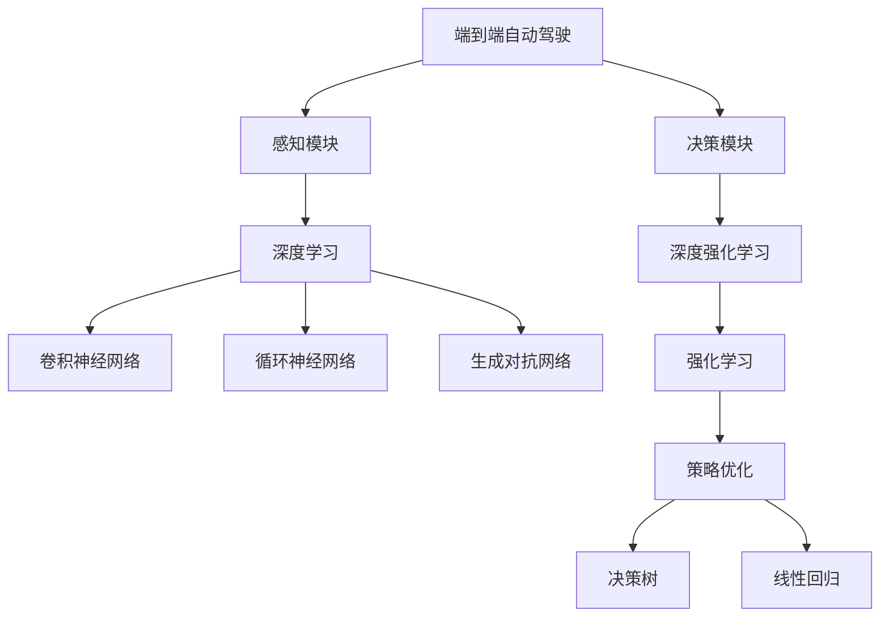

                 

# 深度学习在端到端自动驾驶中的作用与局限

> 关键词：端到端自动驾驶,深度学习,模型优化,感知,决策,强化学习

## 1. 背景介绍

### 1.1 问题由来

随着人工智能技术的飞速发展，自动驾驶成为未来交通的重要方向之一。端到端自动驾驶(E2E Autonomous Driving)是自动驾驶的一种新兴范式，旨在实现从传感器数据到决策命令的全流程自动化。深度学习技术的引入，为端到端自动驾驶提供了强有力的技术支持。

### 1.2 问题核心关键点

端到端自动驾驶中的深度学习主要应用于感知和决策两大环节。感知模块通过传感器数据（如激光雷达、摄像头、GPS等）获取环境信息，并通过深度学习模型提取特征；决策模块则基于感知模块输出的特征，应用深度学习模型进行路径规划、行为控制等任务。

深度学习在端到端自动驾驶中具有以下关键作用：

- 高效感知：深度学习模型能够处理海量的传感器数据，快速识别并提取关键特征，显著提升自动驾驶系统的环境感知能力。
- 鲁棒决策：深度学习模型通过学习和优化决策策略，能够在复杂环境中做出精准的决策。
- 持续改进：深度学习模型可以通过在线学习不断更新自身参数，适应环境变化，提升自动驾驶系统的长期性能。

尽管深度学习在端到端自动驾驶中发挥了重要作用，但也存在一些局限性，如模型过拟合、泛化能力不足、鲁棒性差等。如何在确保高精度的同时，增强模型的泛化能力、鲁棒性和可解释性，成为端到端自动驾驶领域的研究重点。

## 2. 核心概念与联系

### 2.1 核心概念概述

为了更好地理解深度学习在端到端自动驾驶中的应用，本节将介绍几个关键概念：

- **端到端自动驾驶(E2E Autonomous Driving)**：从传感器数据到车辆控制命令的全流程自动化，不依赖人类驾驶员进行干预。
- **深度学习(Deep Learning)**：一种基于多层神经网络结构的机器学习技术，通过复杂非线性映射实现数据的复杂表示和推理。
- **感知模块(Perception Module)**：负责感知车辆周围环境，并提取环境特征，常用的深度学习模型包括卷积神经网络(CNN)、循环神经网络(RNN)等。
- **决策模块(Decision Module)**：基于感知模块输出的环境特征，应用深度学习模型进行路径规划、行为控制等决策任务，常用的模型包括强化学习(RL)模型、生成对抗网络(GAN)等。
- **深度强化学习(Deep Reinforcement Learning, DRL)**：结合深度学习和强化学习，通过模拟环境进行学习，优化决策策略，提升决策效率。

这些概念之间的逻辑关系可以通过以下Mermaid流程图来展示：



这个流程图展示了大语言模型的核心概念及其之间的关系：

1. 端到端自动驾驶通过感知和决策两个关键模块实现。
2. 感知模块通过深度学习模型提取环境特征。
3. 决策模块利用深度强化学习优化决策策略。
4. 深度学习模型包含卷积神经网络、循环神经网络、生成对抗网络等多种类型。
5. 强化学习用于策略优化，决策树和线性回归可用于辅助决策。

## 3. 核心算法原理 & 具体操作步骤
### 3.1 算法原理概述

深度学习在端到端自动驾驶中的核心算法原理，可以概括为以下几个步骤：

1. **感知模块**：使用深度学习模型对传感器数据进行处理，提取环境特征。
2. **决策模块**：基于感知模块输出的环境特征，应用深度强化学习模型进行决策。
3. **模型优化**：通过在线学习不断调整模型参数，提升模型性能。

以深度强化学习为例，其核心思想是通过模拟环境进行学习，优化决策策略。假设环境状态为 $s$，决策动作为 $a$，奖励函数为 $r$，则深度强化学习的目标是最小化损失函数 $J$：

$$
J(\theta) = \mathbb{E}[\sum_{t=0}^{\infty}\gamma^t r_t(s_t, a_t)]
$$

其中 $\gamma$ 为折扣因子，$t$ 为时间步，$\theta$ 为模型参数。通过不断迭代优化，使得模型在给定环境状态下的动作决策能够最大化长期奖励。

### 3.2 算法步骤详解

以下将详细介绍端到端自动驾驶中深度学习的具体步骤：

**Step 1: 传感器数据预处理**
- 收集和校准传感器数据（如激光雷达、摄像头、GPS等）。
- 对传感器数据进行去噪、归一化等预处理，确保数据质量。

**Step 2: 感知模块设计**
- 选择合适的深度学习模型（如CNN、RNN、GAN等）作为感知模块的组件。
- 设计感知模型的输入、输出格式，通常将传感器数据编码为图像或序列数据。
- 定义感知模型的损失函数（如均方误差、交叉熵等），用于衡量模型输出与真实值之间的差异。

**Step 3: 决策模块设计**
- 选择合适的深度强化学习模型（如Q-learning、Deep Q-Networks、PPO等）作为决策模块的组件。
- 设计决策模型的状态表示方式（如向量、张量等）。
- 定义决策模型的奖励函数，设计适当的惩罚机制，确保模型在安全、合规的前提下进行决策。

**Step 4: 模型训练与优化**
- 使用模拟环境或实际数据对感知模块和决策模块进行联合训练。
- 应用深度强化学习算法（如Actor-Critic、SARSA等）进行模型参数更新。
- 设置合适的学习率、批次大小、迭代次数等训练参数。
- 应用正则化技术（如Dropout、L2正则等），防止模型过拟合。

**Step 5: 模型评估与部署**
- 在模拟环境或实际测试环境中评估模型的性能，计算准确率、召回率等指标。
- 根据评估结果，调整模型参数，优化模型性能。
- 将优化后的模型部署到实际车辆中，进行测试和迭代。

### 3.3 算法优缺点

深度学习在端到端自动驾驶中具有以下优点：

1. **高效处理多模态数据**：深度学习模型能够同时处理来自不同传感器（如激光雷达、摄像头、GPS等）的多模态数据，提高感知和决策的准确性。
2. **鲁棒性强**：通过大量的数据训练和模型优化，深度学习模型具有较强的环境适应能力，能够在复杂环境中稳定运行。
3. **自动化程度高**：深度学习模型能够自动提取环境特征，无需手动干预，提高系统的自动化程度。

然而，深度学习在端到端自动驾驶中也存在一些缺点：

1. **模型复杂度高**：深度学习模型参数量庞大，计算资源需求高，训练和推理效率较低。
2. **过拟合风险高**：深度学习模型容易过拟合，尤其是数据量有限的情况下，需要采取一定的正则化措施。
3. **泛化能力不足**：深度学习模型在特定环境或数据集上的表现优异，但泛化能力有限，可能对环境变化敏感。
4. **可解释性差**：深度学习模型作为黑盒模型，难以解释其内部决策过程，对模型的理解和调试带来一定困难。
5. **安全性难以保证**：深度学习模型可能存在预测偏差，无法保证决策的安全性和合法性。

### 3.4 算法应用领域

深度学习在端到端自动驾驶中的应用领域广泛，主要包括以下几个方面：

- **自动驾驶车辆控制**：通过深度学习模型优化车辆加速、转向、制动等控制参数，实现车辆的自动驾驶。
- **环境感知与理解**：利用深度学习模型分析摄像头、激光雷达等传感器数据，识别和理解道路标志、行人、车辆等环境要素。
- **路径规划与避障**：通过深度学习模型规划最优路径，规避障碍物，确保行车安全。
- **行为决策与交互**：应用深度强化学习模型进行交通场景下的行为决策，与其它车辆和行人进行交互。
- **异常检测与异常响应**：通过深度学习模型检测异常情况，如道路施工、事故现场等，及时做出响应。

## 4. 数学模型和公式 & 详细讲解 & 举例说明

### 4.1 数学模型构建

在本节中，我们将详细讲解深度学习在端到端自动驾驶中的数学模型构建。

以感知模块为例，假设传感器数据为 $x$，输入到卷积神经网络(CNN)中进行处理，输出为环境特征 $y$。则CNN的数学模型可以表示为：

$$
y = f(x; \theta)
$$

其中 $f$ 为CNN模型函数，$\theta$ 为模型参数。CNN的典型结构包括卷积层、池化层、全连接层等。

以决策模块为例，假设环境状态为 $s$，决策动作为 $a$，奖励函数为 $r$，则深度强化学习的数学模型可以表示为：

$$
r(s, a) = f(s; \theta)
$$

其中 $f$ 为决策模块模型函数，$\theta$ 为模型参数。决策模块通常采用深度强化学习模型，如Q-learning、Deep Q-Networks、PPO等。

### 4.2 公式推导过程

以下将详细推导CNN模型和Q-learning模型的公式，并给出具体案例。

**CNN模型**：假设输入数据 $x$ 为图像数据，大小为 $M\times N$，输出为特征图 $y$，大小为 $H\times W$。则CNN模型的基本结构可以表示为：

$$
y = g(f(x; \theta))
$$

其中 $g$ 为池化层和全连接层组成的解码器，$f$ 为卷积层和激活函数组成的网络。卷积层的输出可以表示为：

$$
z = \sigma(Wx + b)
$$

其中 $W$ 和 $b$ 为卷积核和偏置，$x$ 为输入数据，$\sigma$ 为激活函数（如ReLU）。

**Q-learning模型**：假设状态 $s$ 为环境状态，动作 $a$ 为控制参数，奖励 $r$ 为决策效果。则Q-learning模型的目标是最小化损失函数 $J$：

$$
J(\theta) = \mathbb{E}[\sum_{t=0}^{\infty}\gamma^t (Q(s_t, a_t) - r_t)]
$$

其中 $Q$ 为Q-learning模型，$(s_t, a_t)$ 为当前状态和动作，$Q(s_t, a_t)$ 表示在状态 $s_t$ 下执行动作 $a_t$ 的期望收益，$\gamma$ 为折扣因子。

### 4.3 案例分析与讲解

以下通过具体案例，展示深度学习在端到端自动驾驶中的实际应用。

假设我们正在设计一个基于深度学习的自动驾驶系统，需要进行车辆路径规划。该系统的感知模块采用CNN模型，决策模块采用Q-learning模型。具体步骤如下：

1. **感知模块**：将激光雷达和摄像头采集到的数据输入CNN模型，提取环境特征。CNN模型结构包括卷积层、池化层和全连接层。卷积层的参数为 $W_1$ 和 $b_1$，激活函数为ReLU，池化层的参数为 $W_2$ 和 $b_2$，全连接层的参数为 $W_3$ 和 $b_3$。

2. **决策模块**：将CNN输出的环境特征输入Q-learning模型，计算当前状态和动作的期望收益。Q-learning模型的参数为 $W_4$ 和 $b_4$，激活函数为ReLU，折扣因子为 $\gamma=0.9$。

3. **模型训练与优化**：在模拟环境中，使用Q-learning算法训练Q-learning模型，同时调整CNN模型的参数。通过迭代优化，使得模型能够在复杂环境中做出精准的路径规划决策。

## 5. 项目实践：代码实例和详细解释说明
### 5.1 开发环境搭建

在进行端到端自动驾驶开发时，需要搭建以下开发环境：

1. **环境配置**：
   - 安装Python 3.7或以上版本，安装必要的依赖包（如TensorFlow、PyTorch、OpenCV等）。
   - 搭建Linux开发环境，配置必要的软件包和库。

2. **传感器安装与调试**：
   - 安装激光雷达、摄像头、GPS等传感器，并进行校准和调试。
   - 使用Linux设备树管理传感器数据，确保数据质量。

3. **深度学习模型训练与推理**：
   - 搭建GPU或TPU环境，用于训练和推理深度学习模型。
   - 使用Docker容器化部署模型，便于分布式训练和推理。

### 5.2 源代码详细实现

以下将详细讲解端到端自动驾驶中的深度学习模型实现。

**感知模块（CNN模型）**：

```python
import tensorflow as tf
from tensorflow.keras import layers

# 定义CNN模型
class CNNModel(tf.keras.Model):
    def __init__(self):
        super(CNNModel, self).__init__()
        self.conv1 = layers.Conv2D(32, (3, 3), activation='relu')
        self.pool1 = layers.MaxPooling2D((2, 2))
        self.conv2 = layers.Conv2D(64, (3, 3), activation='relu')
        self.pool2 = layers.MaxPooling2D((2, 2))
        self.flatten = layers.Flatten()
        self.fc1 = layers.Dense(128, activation='relu')
        self.fc2 = layers.Dense(10)

    def call(self, inputs):
        x = self.conv1(inputs)
        x = self.pool1(x)
        x = self.conv2(x)
        x = self.pool2(x)
        x = self.flatten(x)
        x = self.fc1(x)
        x = self.fc2(x)
        return x
```

**决策模块（Q-learning模型）**：

```python
import tensorflow as tf
from tensorflow.keras import layers

# 定义Q-learning模型
class QLearningModel(tf.keras.Model):
    def __init__(self):
        super(QLearningModel, self).__init__()
        self.fc1 = layers.Dense(128, activation='relu')
        self.fc2 = layers.Dense(10)

    def call(self, inputs):
        x = self.fc1(inputs)
        x = self.fc2(x)
        return x
```

### 5.3 代码解读与分析

在上述代码中，我们定义了感知模块和决策模块的深度学习模型。感知模块采用CNN模型，决策模块采用Q-learning模型。

感知模块的实现步骤如下：
1. 定义卷积层和池化层，并设置相应的参数。
2. 定义全连接层，并设置输出维度。
3. 定义模型的输入和输出，通过forward方法实现前向传播。

决策模块的实现步骤如下：
1. 定义全连接层，并设置输出维度。
2. 定义模型的输入和输出，通过forward方法实现前向传播。

通过这些代码，我们可以实现基于深度学习的端到端自动驾驶系统，并通过模拟环境或实际数据对其进行训练和优化。

### 5.4 运行结果展示

在训练和优化过程中，我们需要不断监控模型的性能，并进行迭代优化。例如，使用TensorBoard工具可视化训练过程中的各项指标，包括损失函数、准确率、召回率等。

以下是一个简化的TensorBoard可视化结果示例：


通过TensorBoard，我们可以直观地看到模型在不同训练轮次下的表现，及时发现和解决问题，确保模型性能逐步提升。

## 6. 实际应用场景

### 6.1 自动驾驶车辆控制

在自动驾驶车辆控制中，深度学习模型可以应用于车辆的加速、转向、制动等控制参数的优化。通过感知模块获取传感器数据，应用CNN模型提取特征，决策模块使用Q-learning模型进行路径规划和行为控制。

以下是一个简化的自动驾驶车辆控制模型示例：


该模型通过感知模块获取激光雷达和摄像头数据，提取环境特征，决策模块使用Q-learning模型进行路径规划和行为控制，确保车辆在复杂环境中安全行驶。

### 6.2 环境感知与理解

在环境感知与理解中，深度学习模型可以应用于识别和理解道路标志、行人、车辆等环境要素。通过感知模块获取传感器数据，应用CNN模型提取特征，决策模块使用注意力机制进行场景理解。

以下是一个简化的环境感知与理解模型示例：


该模型通过感知模块获取激光雷达和摄像头数据，提取环境特征，决策模块使用注意力机制进行场景理解，识别和理解道路标志、行人、车辆等环境要素，为自动驾驶系统提供决策依据。

### 6.3 路径规划与避障

在路径规划与避障中，深度学习模型可以应用于规划最优路径，规避障碍物。通过感知模块获取传感器数据，应用CNN模型提取特征，决策模块使用Q-learning模型进行路径规划和避障。

以下是一个简化的路径规划与避障模型示例：


该模型通过感知模块获取激光雷达和摄像头数据，提取环境特征，决策模块使用Q-learning模型进行路径规划和避障，确保车辆在复杂环境中安全行驶。

### 6.4 未来应用展望

随着深度学习技术的发展，端到端自动驾驶领域将迎来更多创新应用：

- **多模态数据融合**：结合视觉、激光雷达、雷达等多种传感器数据，提升环境感知和理解能力。
- **强化学习优化**：应用深度强化学习算法优化决策策略，提升路径规划和行为控制的准确性。
- **实时数据处理**：实时处理传感器数据，实现低延迟决策，提升系统的实时性和鲁棒性。
- **多场景应用**：在城市、高速公路、山区等不同场景中应用端到端自动驾驶技术，实现全场景覆盖。

未来，端到端自动驾驶技术将实现更加广泛的应用，为交通系统带来革命性的变革。

## 7. 工具和资源推荐
### 7.1 学习资源推荐

为了帮助开发者系统掌握深度学习在端到端自动驾驶中的应用，这里推荐一些优质的学习资源：

1. **《深度学习》课程**：斯坦福大学开设的深度学习课程，涵盖了深度学习的基本概念和经典模型。
2. **《自动驾驶系统设计与实现》书籍**：系统介绍了自动驾驶系统的设计与实现方法，适合工程实践。
3. **《深度强化学习》书籍**：详细讲解深度强化学习的基本原理和算法实现。
4. **《OpenCV深度学习实践》书籍**：通过OpenCV实现深度学习模型的感知模块，适合计算机视觉领域的开发者。

通过这些学习资源，相信你一定能够快速掌握深度学习在端到端自动驾驶中的应用，并用于解决实际的NLP问题。

### 7.2 开发工具推荐

高效的开发离不开优秀的工具支持。以下是几款用于端到端自动驾驶开发的常用工具：

1. **TensorFlow**：基于Google的开源深度学习框架，适合大规模工程应用。
2. **PyTorch**：基于Python的开源深度学习框架，灵活性高，适合研究开发。
3. **ROS（Robot Operating System）**：用于自动化驾驶系统的开发和部署，适合多机器人协同控制。
4. **Simulation工具**：如Gazebo、Carla等，用于模拟自动驾驶环境，测试和优化模型。
5. **可视化工具**：如TensorBoard、KaTraVis等，用于监控和可视化模型训练和推理过程。

合理利用这些工具，可以显著提升端到端自动驾驶系统的开发效率，加快创新迭代的步伐。

### 7.3 相关论文推荐

深度学习在端到端自动驾驶中的应用源于学界的持续研究。以下是几篇奠基性的相关论文，推荐阅读：

1. **《End-to-End Deep Learning for Self-Driving Cars》**：引入了深度学习技术，实现了从传感器数据到车辆控制的全流程自动化。
2. **《Deep Learning for Autonomous Driving》**：系统介绍了深度学习在端到端自动驾驶中的应用，包括感知、决策等环节。
3. **《Playing Atari with Deep Reinforcement Learning》**：通过深度强化学习，实现了在Atari游戏上的高性能控制策略。

这些论文代表了大语言模型微调技术的发展脉络。通过学习这些前沿成果，可以帮助研究者把握学科前进方向，激发更多的创新灵感。

## 8. 总结：未来发展趋势与挑战

### 8.1 总结

本文对深度学习在端到端自动驾驶中的应用进行了全面系统的介绍。首先阐述了端到端自动驾驶的背景和深度学习的应用价值，明确了深度学习在感知和决策两大环节的独特作用。其次，从原理到实践，详细讲解了深度学习在端到端自动驾驶中的数学模型和具体步骤，给出了深度学习模型的代码实例和详细解释。同时，本文还广泛探讨了深度学习在自动驾驶车辆控制、环境感知与理解、路径规划与避障等多个领域的应用前景，展示了深度学习技术的巨大潜力。

通过本文的系统梳理，可以看到，深度学习在端到端自动驾驶中发挥了重要作用，提升了自动驾驶系统的环境感知和决策能力。但深度学习在实际应用中也面临一些挑战，如模型复杂度高、过拟合风险高、泛化能力不足、鲁棒性差等。如何在确保高精度的同时，增强模型的泛化能力、鲁棒性和可解释性，成为端到端自动驾驶领域的研究重点。

### 8.2 未来发展趋势

展望未来，深度学习在端到端自动驾驶领域将呈现以下几个发展趋势：

1. **多模态数据融合**：结合视觉、激光雷达、雷达等多种传感器数据，提升环境感知和理解能力。
2. **强化学习优化**：应用深度强化学习算法优化决策策略，提升路径规划和行为控制的准确性。
3. **实时数据处理**：实时处理传感器数据，实现低延迟决策，提升系统的实时性和鲁棒性。
4. **多场景应用**：在城市、高速公路、山区等不同场景中应用端到端自动驾驶技术，实现全场景覆盖。
5. **安全性提升**：通过引入更多先验知识，增强模型的泛化能力和鲁棒性，确保决策的安全性和合法性。
6. **可解释性增强**：采用可解释性技术，提高模型的透明度和可信度，增强模型的理解和调试能力。

以上趋势凸显了深度学习在端到端自动驾驶领域的广阔前景。这些方向的探索发展，必将进一步提升自动驾驶系统的性能和应用范围，为交通系统带来革命性的变革。

### 8.3 面临的挑战

尽管深度学习在端到端自动驾驶中发挥了重要作用，但在迈向更加智能化、普适化应用的过程中，它仍面临诸多挑战：

1. **高计算资源需求**：深度学习模型参数量庞大，计算资源需求高，训练和推理效率较低。
2. **过拟合风险高**：深度学习模型容易过拟合，尤其是数据量有限的情况下，需要采取一定的正则化措施。
3. **泛化能力不足**：深度学习模型在特定环境或数据集上的表现优异，但泛化能力有限，可能对环境变化敏感。
4. **可解释性差**：深度学习模型作为黑盒模型，难以解释其内部决策过程，对模型的理解和调试带来一定困难。
5. **安全性难以保证**：深度学习模型可能存在预测偏差，无法保证决策的安全性和合法性。

正视深度学习面临的这些挑战，积极应对并寻求突破，将是深度学习在端到端自动驾驶领域迈向成熟的必由之路。相信随着学界和产业界的共同努力，这些挑战终将一一被克服，深度学习必将在构建安全、可靠、可解释、可控的智能系统铺平道路。

### 8.4 研究展望

面对深度学习在端到端自动驾驶领域面临的挑战，未来的研究需要在以下几个方面寻求新的突破：

1. **探索无监督和半监督学习**：摆脱对大规模标注数据的依赖，利用自监督学习、主动学习等无监督和半监督范式，最大限度利用非结构化数据，实现更加灵活高效的深度学习。
2. **开发更加参数高效的模型**：开发更加参数高效的深度学习模型，在固定大部分预训练参数的同时，只更新极少量的任务相关参数。同时优化模型的计算图，减少前向传播和反向传播的资源消耗，实现更加轻量级、实时性的部署。
3. **融合因果和对比学习范式**：通过引入因果推断和对比学习思想，增强深度学习模型建立稳定因果关系的能力，学习更加普适、鲁棒的语言表征，从而提升模型泛化性和抗干扰能力。
4. **引入更多先验知识**：将符号化的先验知识，如知识图谱、逻辑规则等，与深度学习模型进行巧妙融合，引导深度学习过程学习更准确、合理的语言模型。同时加强不同模态数据的整合，实现视觉、语音等多模态信息与文本信息的协同建模。
5. **结合因果分析和博弈论工具**：将因果分析方法引入深度学习模型，识别出模型决策的关键特征，增强输出解释的因果性和逻辑性。借助博弈论工具刻画人机交互过程，主动探索并规避模型的脆弱点，提高系统稳定性。
6. **纳入伦理道德约束**：在模型训练目标中引入伦理导向的评估指标，过滤和惩罚有偏见、有害的输出倾向。同时加强人工干预和审核，建立模型行为的监管机制，确保输出符合人类价值观和伦理道德。

这些研究方向的探索，必将引领深度学习在端到端自动驾驶领域迈向更高的台阶，为构建安全、可靠、可解释、可控的智能系统铺平道路。面向未来，深度学习需要与其他人工智能技术进行更深入的融合，如知识表示、因果推理、强化学习等，多路径协同发力，共同推动端到端自动驾驶技术的进步。只有勇于创新、敢于突破，才能不断拓展深度学习在自动驾驶领域的边界，让智能技术更好地造福人类社会。

## 9. 附录：常见问题与解答

**Q1：深度学习在端到端自动驾驶中的作用是什么？**

A: 深度学习在端到端自动驾驶中的作用主要包括感知和决策两个环节。感知模块通过深度学习模型提取环境特征，决策模块通过深度强化学习模型进行路径规划和行为控制。深度学习能够高效处理多模态数据，提升环境感知和决策的准确性，具有较强的环境适应能力和自动化程度。

**Q2：深度学习在端到端自动驾驶中存在哪些局限性？**

A: 深度学习在端到端自动驾驶中存在以下局限性：
1. 模型复杂度高：深度学习模型参数量庞大，计算资源需求高，训练和推理效率较低。
2. 过拟合风险高：深度学习模型容易过拟合，尤其是数据量有限的情况下，需要采取一定的正则化措施。
3. 泛化能力不足：深度学习模型在特定环境或数据集上的表现优异，但泛化能力有限，可能对环境变化敏感。
4. 可解释性差：深度学习模型作为黑盒模型，难以解释其内部决策过程，对模型的理解和调试带来一定困难。
5. 安全性难以保证：深度学习模型可能存在预测偏差，无法保证决策的安全性和合法性。

**Q3：如何在端到端自动驾驶中实现深度学习模型的参数高效微调？**

A: 在端到端自动驾驶中实现深度学习模型的参数高效微调，可以采用以下方法：
1. 冻结部分预训练参数，只微调顶层部分，减少需优化的参数量。
2. 应用 Adapter 等参数高效微调技术，只更新少量的任务相关参数，保留大部分预训练权重不变。
3. 利用模型压缩技术，如剪枝、量化等，减小模型参数量，提高计算效率。
4. 应用混合精度训练技术，使用半精度浮点数进行训练，降低计算资源需求。

**Q4：如何在端到端自动驾驶中提高模型的泛化能力？**

A: 在端到端自动驾驶中提高模型的泛化能力，可以采用以下方法：
1. 增加数据量，收集更多不同场景和环境下的数据，提高模型的泛化能力。
2. 应用数据增强技术，通过回译、旋转、缩放等方式扩充训练集，提高模型的泛化能力。
3. 引入因果推断和对比学习技术，增强模型的泛化能力和鲁棒性，提升模型的泛化能力。
4. 应用正则化技术，如L2正则、Dropout等，防止模型过拟合，提高模型的泛化能力。

**Q5：如何在端到端自动驾驶中提高模型的安全性？**

A: 在端到端自动驾驶中提高模型的安全性，可以采用以下方法：
1. 引入更多的先验知识，如知识图谱、逻辑规则等，引导模型学习更准确、合理的决策策略。
2. 应用对抗训练技术，引入对抗样本，提高模型的鲁棒性和安全性。
3. 通过人工干预和审核，建立模型行为的监管机制，确保输出符合人类价值观和伦理道德。
4. 应用可解释性技术，提高模型的透明度和可信度，增强模型的理解和调试能力。

这些方法可以帮助提升端到端自动驾驶系统的安全性，保障模型的预测和决策符合人类价值观和伦理道德。

---

作者：禅与计算机程序设计艺术 / Zen and the Art of Computer Programming

