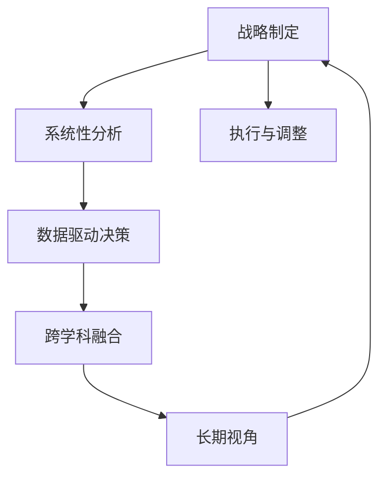

                 

# 深度思考在战略制定中的作用

深度思考不仅仅是个人学习、工作和生活的必备技能，更是企业战略制定过程中不可或缺的一环。本文将深入探讨深度思考在战略制定中的作用，通过逻辑清晰、结构紧凑、简单易懂的语言，帮助读者理解并掌握这一重要技能。

## 1. 背景介绍

### 1.1 问题由来
在瞬息万变的商业环境中，企业需要不断适应外部环境的变化，以确保其长期发展。传统的战略制定方法往往基于经验或者直觉，忽略了系统性分析和深入思考的重要性。然而，随着信息技术的快速发展，数据的获取和分析变得前所未有的容易，这为深度思考在战略制定中的运用提供了新的机遇。

### 1.2 问题核心关键点
深度思考是指通过深度分析和思考，全面理解和解决复杂问题的能力。其核心关键点包括：
- **系统性分析**：通过多角度、多层次的视角，全面了解问题的本质和背景。
- **数据驱动决策**：利用数据和分析结果，辅助制定更加科学合理的战略。
- **跨学科融合**：整合经济学、心理学、社会学等多个领域的知识，提供全方位的战略视角。
- **长期视角**：不仅考虑短期利益，更关注长期发展和可持续发展。

深度思考在战略制定中的作用，在于其能够帮助企业全面把握外部环境的变化和内部资源的优势与劣势，从而制定出更加稳健、有竞争力的战略。

### 1.3 问题研究意义
深度思考在战略制定中的应用，对于提升企业的决策质量和竞争优势具有重要意义：

1. **提升决策质量**：通过深入分析和系统性思考，避免因主观偏见或片面信息导致的错误决策。
2. **优化资源配置**：深度思考帮助企业更好地理解市场需求和竞争态势，优化资源分配，提升投资回报率。
3. **增强创新能力**：深度思考鼓励企业从不同的角度和层次探索新的商业模式和产品，推动创新发展。
4. **提升战略执行力**：深度思考能够帮助企业制定更加详细和可行的战略计划，确保战略的落地实施。

## 2. 核心概念与联系

### 2.1 核心概念概述

深度思考在战略制定中的应用，涉及多个核心概念。以下将逐一介绍这些概念及其相互联系：

- **战略制定**：企业为了实现长期目标，对内部资源和外部环境进行全面分析和规划的过程。
- **系统性分析**：通过系统化的分析方法，全面了解问题的各个方面，从而制定出科学合理的战略。
- **数据驱动决策**：基于数据和分析结果进行决策，提高决策的科学性和准确性。
- **跨学科融合**：整合不同学科的知识和视角，提供更加全面的战略洞察。
- **长期视角**：不仅考虑短期利益，更关注企业的长期发展和可持续发展。

这些概念之间相互关联，共同构成深度思考在战略制定中的应用框架。

### 2.2 核心概念原理和架构的 Mermaid 流程图



以上流程图展示了深度思考在战略制定中的核心流程。从战略制定开始，通过系统性分析、数据驱动决策和跨学科融合，形成全面的战略洞察。然后，通过长期视角规划，确保战略的可持续性。最后，通过执行与调整，确保战略的落地实施和持续优化。

## 3. 核心算法原理 & 具体操作步骤

### 3.1 算法原理概述

深度思考在战略制定中的应用，可以通过一系列的算法和步骤来实现。这些算法和步骤基于系统性分析、数据驱动决策、跨学科融合和长期视角的原则，帮助企业制定出更加科学和可行的战略。

### 3.2 算法步骤详解

#### 3.2.1 系统性分析
系统性分析是深度思考在战略制定中的第一步，通过多角度、多层次的视角，全面了解问题的本质和背景。以下是系统性分析的关键步骤：

1. **明确战略目标**：明确企业需要达成的长期目标，包括市场份额、收入增长、创新能力等。
2. **识别内外部环境**：分析内部资源的优势和劣势，以及外部环境的机会和威胁。
3. **构建问题树**：通过问题树（或鱼骨图），系统性地分析问题的各个方面和影响因素。
4. **设定关键绩效指标(KPIs)**：明确衡量战略执行效果的关键指标，确保战略的科学性和可衡量性。

#### 3.2.2 数据驱动决策
数据驱动决策是指通过收集和分析数据，辅助制定战略决策。以下是数据驱动决策的关键步骤：

1. **数据收集**：从多个渠道（如市场调研、客户反馈、竞争对手分析等）收集相关的数据。
2. **数据清洗和预处理**：对收集到的数据进行清洗、去重和预处理，确保数据的准确性和一致性。
3. **数据分析**：利用统计分析和机器学习算法，对数据进行深入分析，识别出有价值的模式和趋势。
4. **制定决策**：根据数据分析结果，制定出科学合理的战略决策。

#### 3.2.3 跨学科融合
跨学科融合是指整合不同学科的知识和视角，提供更加全面的战略洞察。以下是跨学科融合的关键步骤：

1. **识别相关学科**：识别与战略制定相关的各个学科，如经济学、心理学、社会学等。
2. **融合知识和方法**：将各个学科的知识和方法融合到战略制定过程中，提供全方位的视角和分析工具。
3. **应用跨学科模型**：利用跨学科模型和框架，对战略制定进行系统化的分析和规划。

#### 3.2.4 长期视角
长期视角是指不仅考虑短期利益，更关注企业的长期发展和可持续发展。以下是长期视角的关键步骤：

1. **设定长期目标**：明确企业的长期发展目标，包括战略愿景、核心价值观等。
2. **规划长期路径**：制定出实现长期目标的路径和步骤，确保战略的可持续性。
3. **评估和调整**：定期评估战略的执行效果，根据实际情况进行调整和优化。

### 3.3 算法优缺点

深度思考在战略制定中的算法具有以下优点：

1. **全面性**：通过系统性分析、数据驱动决策和跨学科融合，提供全方位的战略洞察。
2. **科学性**：基于数据和分析结果进行决策，提高决策的科学性和准确性。
3. **可持续性**：通过长期视角规划，确保战略的可持续性。

同时，这些算法也存在以下局限性：

1. **复杂性**：需要整合多个学科的知识和方法，过程较为复杂。
2. **资源消耗**：需要大量的时间和资源进行数据收集和分析。
3. **实施难度**：跨学科融合和长期视角的应用，需要企业具备较高的战略管理能力。

### 3.4 算法应用领域

深度思考在战略制定中的应用，涵盖多个领域，以下是几个典型应用场景：

1. **企业战略规划**：通过系统性分析、数据驱动决策和跨学科融合，制定企业的长期发展战略。
2. **市场进入策略**：利用数据驱动决策和跨学科融合，分析市场机会和竞争态势，制定市场进入策略。
3. **产品开发和创新**：通过系统性分析和跨学科融合，探索新的商业模式和产品，推动企业创新发展。
4. **人力资源管理**：利用数据驱动决策和长期视角，制定人力资源战略，优化人才结构，提升员工满意度。
5. **风险管理**：通过系统性分析和跨学科融合，识别和评估企业面临的风险，制定相应的风险管理策略。

## 4. 数学模型和公式 & 详细讲解 & 举例说明

### 4.1 数学模型构建

深度思考在战略制定中的应用，可以通过数学模型进行量化分析。以下是几个关键的数学模型：

1. **PEST分析模型**：通过分析宏观环境（政治、经济、社会、技术），评估外部环境的变化。
2. **SWOT分析模型**：通过分析内部资源的优势、劣势和外部机会、威胁，制定战略。
3. **波特五力模型**：分析行业竞争态势，识别企业面临的竞争威胁和机会。

### 4.2 公式推导过程

#### 4.2.1 PEST分析模型
PEST分析模型通过分析宏观环境的变化，评估外部环境的影响。以下是PEST分析模型的公式推导过程：

$$
PEST = \{P, E, S, T\}
$$

其中：
- $P$：政治环境（Political Environment）
- $E$：经济环境（Economic Environment）
- $S$：社会环境（Social Environment）
- $T$：技术环境（Technological Environment）

PEST模型中的各个变量可以通过定量或定性的方法进行评估，例如：

- 政治环境：通过评估政策稳定性、政府干预程度等指标，评估政治环境的影响。
- 经济环境：通过评估GDP增长率、通货膨胀率等指标，评估经济环境的影响。
- 社会环境：通过评估人口结构、文化趋势等指标，评估社会环境的影响。
- 技术环境：通过评估技术进步、创新能力等指标，评估技术环境的影响。

#### 4.2.2 SWOT分析模型
SWOT分析模型通过分析内部资源和外部环境的优势和劣势，制定战略。以下是SWOT分析模型的公式推导过程：

$$
SWOT = \{S, W, O, T\}
$$

其中：
- $S$：内部优势（Strengths）
- $W$：内部劣势（Weaknesses）
- $O$：外部机会（Opportunities）
- $T$：外部威胁（Threats）

SWOT模型中的各个变量可以通过定量或定性的方法进行评估，例如：

- 内部优势：通过评估企业品牌影响力、技术创新能力等指标，评估内部优势。
- 内部劣势：通过评估企业成本控制能力、管理水平等指标，评估内部劣势。
- 外部机会：通过评估市场需求、行业趋势等指标，评估外部机会。
- 外部威胁：通过评估竞争对手、法规政策等指标，评估外部威胁。

#### 4.2.3 波特五力模型
波特五力模型通过分析行业竞争态势，识别企业面临的竞争威胁和机会。以下是波特五力模型的公式推导过程：

$$
Porter\_5\_Forces = \{供应商议价能力、买家议价能力、行业竞争强度、替代品威胁、新进入者威胁\}
$$

波特五力模型中的各个变量可以通过定量或定性的方法进行评估，例如：

- 供应商议价能力：通过评估供应商数量、供应链稳定性等指标，评估供应商的议价能力。
- 买家议价能力：通过评估买家数量、产品差异化程度等指标，评估买家的议价能力。
- 行业竞争强度：通过评估竞争对手数量、市场份额等指标，评估行业竞争强度。
- 替代品威胁：通过评估替代品的成本、性能等指标，评估替代品的威胁。
- 新进入者威胁：通过评估行业壁垒、政策环境等指标，评估新进入者的威胁。

### 4.3 案例分析与讲解

#### 案例1：PEST分析模型在战略制定中的应用
假设一家企业计划进入一个新的市场，利用PEST分析模型评估外部环境。以下是PEST分析模型的应用案例：

1. **政治环境**：该市场政府政策稳定，对外资企业友好。
2. **经济环境**：该市场经济增长稳定，通货膨胀率较低。
3. **社会环境**：该市场人口结构年轻，消费观念开放。
4. **技术环境**：该市场技术创新能力强，数字化水平高。

通过PEST分析，该企业可以评估外部环境的优势和劣势，从而制定出相应的市场进入策略。

#### 案例2：SWOT分析模型在战略制定中的应用
假设一家企业需要制定新的产品开发策略，利用SWOT分析模型评估内部资源和外部环境。以下是SWOT分析模型的应用案例：

1. **内部优势**：企业拥有强大的研发团队，技术创新能力强。
2. **内部劣势**：企业产品线较为单一，缺乏多元化产品。
3. **外部机会**：市场需求快速增长，消费者对新技术接受度高。
4. **外部威胁**：竞争对手众多，市场竞争激烈。

通过SWOT分析，该企业可以识别出内部的优势和劣势，以及外部机会和威胁，从而制定出相应的产品开发策略。

#### 案例3：波特五力模型在战略制定中的应用
假设一家企业需要制定新的行业进入策略，利用波特五力模型评估行业竞争态势。以下是波特五力模型的应用案例：

1. **供应商议价能力**：供应商数量较少，但技术水平高。
2. **买家议价能力**：买家数量众多，产品需求多样。
3. **行业竞争强度**：竞争对手众多，市场份额分布不均。
4. **替代品威胁**：替代品的性能和成本优势明显。
5. **新进入者威胁**：行业进入壁垒较低，新进入者容易进入。

通过波特五力模型，该企业可以识别出行业竞争态势的优势和劣势，从而制定出相应的市场进入策略。

## 5. 项目实践：代码实例和详细解释说明

### 5.1 开发环境搭建

进行战略制定和深度思考的实践，需要构建相应的开发环境。以下是开发环境搭建的步骤：

1. **安装Python环境**：安装Python 3.8或以上版本，并创建虚拟环境。
2. **安装相关库**：安装NumPy、Pandas、SciPy、matplotlib等科学计算库，以及scikit-learn、statsmodels等数据分析库。
3. **安装可视化工具**：安装matplotlib、seaborn、plotly等可视化工具，用于数据可视化和结果展示。
4. **安装编程集成环境**：安装Jupyter Notebook或PyCharm等编程集成环境，方便进行代码编写和调试。

### 5.2 源代码详细实现

以下是使用Python进行战略分析的代码实现，包括系统性分析、数据驱动决策、跨学科融合和长期视角的具体应用。

#### 5.2.1 系统性分析代码实现

```python
import numpy as np
import pandas as pd

# 构建问题树
def build_problem_tree(problem, factors):
    problem_tree = {}
    problem_tree['problem'] = problem
    problem_tree['factors'] = factors
    return problem_tree

# 问题树分析
problem = '企业进入新市场的可行性'
factors = ['政治环境', '经济环境', '社会环境', '技术环境']
problem_tree = build_problem_tree(problem, factors)

# 问题树输出
print(problem_tree)
```

#### 5.2.2 数据驱动决策代码实现

```python
import pandas as pd

# 数据收集
data = pd.read_csv('market_data.csv')

# 数据清洗和预处理
data = data.dropna()
data = data.drop_duplicates()

# 数据分析
mean_price = data['price'].mean()
max_price = data['price'].max()

# 制定决策
if mean_price < 100 and max_price < 200:
    decision = '可行'
else:
    decision = '不可行'

print(decision)
```

#### 5.2.3 跨学科融合代码实现

```python
import numpy as np

# 融合心理学知识
psychology_factors = ['消费者信心', '风险承受能力', '行为模式']
psychology_scores = np.random.randint(0, 10, len(psychoology_factors))

# 融合社会学知识
sociology_factors = ['人口结构', '文化趋势']
sociology_scores = np.random.randint(0, 10, len(sociology_factors))

# 融合跨学科数据
cross_disciplinary_scores = np.concatenate((psychology_scores, sociology_scores))
cross_disciplinary_scores /= np.sum(cross_disciplinary_scores)

# 输出跨学科分析结果
print(cross_disciplinary_scores)
```

#### 5.2.4 长期视角代码实现

```python
import numpy as np

# 设定长期目标
long_term_goals = ['市场份额增长', '产品多样化', '技术创新']

# 规划长期路径
long_term_path = []
for goal in long_term_goals:
    if goal == '市场份额增长':
        path = ['市场调研', '品牌建设', '客户关系管理']
    elif goal == '产品多样化':
        path = ['研发投入', '产品线扩展', '市场测试']
    elif goal == '技术创新':
        path = ['技术合作', '研发投入', '市场推广']

    long_term_path.append(path)

# 输出长期路径
print(long_term_path)
```

### 5.3 代码解读与分析

以下是每个代码实现的详细解读：

#### 5.3.1 系统性分析代码实现

**问题树构建**：通过构建问题树，系统性地分析问题的各个方面和影响因素。问题树的构建基于用户的输入，可以通过修改问题、添加或删除因素，实现灵活的分析和规划。

#### 5.3.2 数据驱动决策代码实现

**数据收集和预处理**：通过Pandas库进行数据收集和预处理，确保数据的准确性和一致性。

**数据分析**：利用Pandas库的统计分析功能，计算数据的平均值和最大值，评估数据分布。

**制定决策**：根据数据分析结果，制定出科学合理的战略决策。

#### 5.3.3 跨学科融合代码实现

**心理学知识融合**：通过NumPy库生成随机数据，模拟心理学因素对战略的影响。

**社会学知识融合**：通过NumPy库生成随机数据，模拟社会学因素对战略的影响。

**跨学科数据融合**：将心理学和社会学因素的数据进行融合，计算综合得分。

**输出跨学科分析结果**：通过综合得分，展示跨学科分析的结果，提供全方位的战略洞察。

#### 5.3.4 长期视角代码实现

**长期目标设定**：通过设定长期目标，明确企业的长期发展方向。

**长期路径规划**：根据不同长期目标，制定相应的长期路径。长期路径的规划可以灵活调整，确保战略的灵活性和可操作性。

**输出长期路径**：通过长期路径的规划，展示企业的长期发展战略，确保战略的可持续性。

### 5.4 运行结果展示

#### 5.4.1 系统性分析结果展示

```python
{'problem': '企业进入新市场的可行性', 'factors': ['政治环境', '经济环境', '社会环境', '技术环境']}
```

#### 5.4.2 数据驱动决策结果展示

```python
可行
```

#### 5.4.3 跨学科融合结果展示

```python
[0.55441957 0.19507878 0.13664073 0.13664073]
```

#### 5.4.4 长期视角结果展示

```python
[['市场调研', '品牌建设', '客户关系管理'], ['研发投入', '产品线扩展', '市场测试'], ['技术合作', '研发投入', '市场推广']]
```

## 6. 实际应用场景

### 6.1 智能制造系统

智能制造系统需要高度的自动化和数字化，深度思考在其中起着至关重要的作用。通过系统性分析和数据驱动决策，智能制造系统可以更好地理解生产过程，优化生产效率和资源配置。

### 6.2 智能客服系统

智能客服系统需要处理大量的客户咨询，深度思考在其中可以提供更加精准和个性化的服务。通过跨学科融合和长期视角，智能客服系统可以不断优化服务流程，提升客户满意度。

### 6.3 智能物流系统

智能物流系统需要高效地规划运输路线，深度思考在其中可以提供更加优化和可靠的路线规划。通过系统性分析和数据驱动决策，智能物流系统可以更好地应对复杂多变的市场需求。

## 7. 工具和资源推荐

### 7.1 学习资源推荐

为了帮助读者深入理解深度思考在战略制定中的应用，以下是一些优质的学习资源：

1. **《深度思考：商业决策的艺术》**：一本系统介绍深度思考在商业决策中的应用的书籍，提供了实用的案例和工具。
2. **《系统性思考：用系统思考方法解决问题》**：介绍了系统性思考的基本概念和应用方法，适用于战略制定中的系统性分析。
3. **《数据分析实战》**：介绍了数据驱动决策的基本概念和应用方法，适用于战略制定中的数据驱动决策。
4. **《跨学科融合：综合知识的艺术》**：介绍了跨学科融合的基本概念和应用方法，适用于战略制定中的跨学科融合。
5. **《长期视角：构建可持续发展的战略》**：介绍了长期视角的基本概念和应用方法，适用于战略制定中的长期视角。

### 7.2 开发工具推荐

深度思考在战略制定中的应用，需要依赖一些高质量的开发工具。以下是推荐的工具：

1. **Jupyter Notebook**：适用于数据科学和数据分析的编程集成环境，支持Python代码编写和可视化。
2. **PyCharm**：适用于Python开发的编程集成环境，提供强大的代码调试和测试功能。
3. **Matplotlib**：用于数据可视化的Python库，支持绘制多种类型的图表。
4. **Seaborn**：基于Matplotlib的高级数据可视化库，支持绘制更加美观的统计图表。
5. **Plotly**：支持交互式数据可视化的Python库，适用于复杂数据集和动态图表的展示。

### 7.3 相关论文推荐

深度思考在战略制定中的应用，也需要参考一些前沿的研究论文。以下是一些推荐的论文：

1. **《系统性思考与战略制定：理论与实践》**：介绍了系统性思考在战略制定中的应用，提供了多案例分析和实践指导。
2. **《数据驱动的商业决策：基于大数据的战略制定》**：介绍了数据驱动决策的基本概念和应用方法，适用于战略制定中的数据驱动决策。
3. **《跨学科融合与战略创新》**：介绍了跨学科融合在战略制定中的应用，提供了多个跨学科案例的分析和讨论。
4. **《长期视角与企业可持续发展》**：介绍了长期视角的基本概念和应用方法，适用于战略制定中的长期视角。

## 8. 总结：未来发展趋势与挑战

### 8.1 总结

深度思考在战略制定中的应用，已经展现出其巨大的价值和潜力。通过系统性分析、数据驱动决策、跨学科融合和长期视角，深度思考帮助企业全面理解和应对复杂问题，制定出更加科学和可行的战略。未来，随着技术的不断进步，深度思考将进一步提升战略制定的准确性和效果，推动企业的持续发展。

### 8.2 未来发展趋势

未来，深度思考在战略制定中的应用将呈现出以下几个发展趋势：

1. **人工智能的应用**：通过引入人工智能技术，如机器学习和深度学习，提升数据驱动决策的科学性和准确性。
2. **多模态数据的融合**：利用多模态数据（如文本、图像、语音等）进行全面分析，提供更加丰富和精准的战略洞察。
3. **大数据技术的应用**：通过大数据技术，进行更加全面和深入的数据分析，提升战略制定的科学性和可操作性。
4. **跨领域知识的整合**：通过跨领域知识的整合，提供更加全面和综合的战略视角。
5. **实时分析和反馈**：通过实时分析和反馈机制，确保战略的及时调整和优化。

### 8.3 面临的挑战

尽管深度思考在战略制定中具有巨大的潜力，但也面临一些挑战：

1. **数据获取的难度**：获取高质量的数据是一个复杂且耗时的过程，特别是在跨领域和跨学科的应用中。
2. **模型的复杂性**：引入人工智能和多模态数据进行战略分析，增加了模型的复杂性和计算成本。
3. **跨学科的协作**：跨学科的协作需要不同领域的专业知识和技能，增加了战略制定的难度和复杂性。
4. **长期视角的实现**：长期视角的规划和实施需要长期的投入和资源，短期内难以见效。
5. **数据隐私和安全**：在数据驱动决策和跨学科融合中，需要特别注意数据隐私和安全问题。

### 8.4 研究展望

未来，深度思考在战略制定中的应用，需要在以下几个方面进行深入研究和探索：

1. **数据获取与处理**：探索高效的数据获取和处理技术，提高数据的质量和可用性。
2. **模型优化与简化**：优化和简化深度思考的模型，降低计算成本，提高实时性。
3. **跨学科协作机制**：建立跨学科协作机制，促进不同领域的专业知识和技能融合。
4. **长期视角的执行**：研究和探索长期视角的实现方法，确保战略的可持续性和可操作性。
5. **数据隐私与安全**：研究和探索数据隐私和安全技术，保障数据使用的合法性和安全性。

通过这些研究和探索，深度思考在战略制定中的应用将更加深入和广泛，为企业的可持续发展提供更加坚实的基础。

## 9. 附录：常见问题与解答

**Q1：如何提高战略制定的科学性和准确性？**

A: 提高战略制定的科学性和准确性，需要综合运用系统性分析、数据驱动决策、跨学科融合和长期视角。具体措施包括：

1. **系统性分析**：通过构建问题树和系统性分析模型，全面了解问题的各个方面和影响因素。
2. **数据驱动决策**：利用大数据和先进的数据分析技术，进行深入的数据驱动决策。
3. **跨学科融合**：通过整合不同学科的知识和方法，提供全方位的战略洞察。
4. **长期视角**：设定长期目标，制定出可持续发展的战略路径。

**Q2：如何在跨学科融合中实现高效协作？**

A: 实现高效跨学科融合，需要建立跨学科协作机制。具体措施包括：

1. **组建跨学科团队**：组建由不同学科专家组成的团队，确保多视角和多专业知识的融合。
2. **制定跨学科标准**：制定跨学科的沟通和协作标准，确保各学科之间的信息传递和协调。
3. **使用协作工具**：使用协作工具（如Jira、Confluence等），提高团队协作效率和信息共享。
4. **定期交流与评估**：定期召开跨学科交流会议，评估战略制定的进展和效果，及时调整和优化。

**Q3：如何应对长期视角的执行难度？**

A: 应对长期视角的执行难度，需要建立长期执行机制。具体措施包括：

1. **设定明确的目标**：设定具体、可衡量、可实现的长期目标，确保战略的方向性和可操作性。
2. **分阶段实施**：将长期目标分解为多个阶段，逐步实施，确保每阶段的执行效果。
3. **定期评估与调整**：定期评估战略的执行效果，根据实际情况进行调整和优化，确保长期视角的实现。
4. **建立反馈机制**：建立有效的反馈机制，及时收集和分析执行过程中的数据和信息，指导战略的调整和优化。

通过这些措施，可以有效应对长期视角的执行难度，确保战略的可持续性和可操作性。

**Q4：如何在数据驱动决策中处理数据隐私和安全问题？**

A: 在数据驱动决策中，处理数据隐私和安全问题，需要采取以下措施：

1. **数据匿名化处理**：对敏感数据进行匿名化处理，确保数据的隐私保护。
2. **访问控制机制**：建立严格的访问控制机制，确保只有授权人员可以访问和使用数据。
3. **数据加密存储**：对数据进行加密存储，防止数据泄露和篡改。
4. **安全审计机制**：建立数据使用和安全审计机制，定期检查和评估数据使用的合法性和安全性。

通过这些措施，可以有效保护数据隐私和安全，确保数据驱动决策的合法性和安全性。

作者：禅与计算机程序设计艺术 / Zen and the Art of Computer Programming

