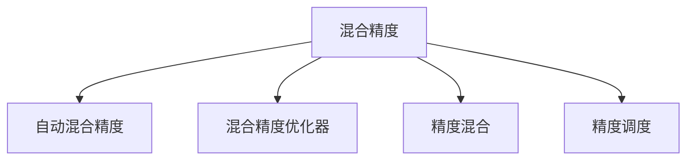

                 

## 1. 背景介绍

### 1.1 问题由来
随着人工智能技术的发展，深度学习模型在大数据、大算力、高精度的驱动下迅速发展。然而，深度学习模型的训练和推理对计算资源的需求不断增加，给工业界带来了巨大的成本压力。如何在保持模型性能的同时，降低计算资源消耗，成为摆在每个AI开发者面前的重大挑战。

混合精度训练（Mixed-Precision Training）正是解决这一问题的重要技术。混合精度训练通过将模型参数、激活和梯度分别在精度不同的内存中存储和计算，从而大幅降低计算资源消耗，同时保持较高的模型精度。混合精度训练在深度学习领域的应用已逐渐成为主流，广泛被深度学习模型训练框架如TensorFlow、PyTorch等所支持。

### 1.2 问题核心关键点
混合精度训练的核心思想是：在深度学习模型训练过程中，使用不同精度的浮点数进行计算和存储，以降低内存占用和计算资源消耗。通过合理设计浮点数的精度组合，可以在不损失模型精度的前提下，显著提高训练和推理的效率。

具体而言，混合精度训练的实现通常依赖于硬件支持，如GPU、TPU等，这些硬件通常内置浮点数转换单元，能够自动在不同精度之间进行转换。因此，混合精度训练需要结合硬件能力，灵活选择不同的精度组合，以达到最佳的计算和存储效果。

## 2. 核心概念与联系

### 2.1 核心概念概述
为更好地理解混合精度训练，本节将介绍几个密切相关的核心概念：

- **混合精度（Mixed-Precision）**：指在深度学习模型训练过程中，使用不同精度的浮点数进行计算和存储。通常将精度分为整数、半精度（FP16）、单精度（FP32）和双精度（FP64）等，根据任务需求和硬件支持进行选择。
- **自动混合精度（Automatic Mixed-Precision）**：指深度学习框架自动根据硬件能力，选择最优的精度组合进行混合精度训练，无需人工干预，最大化利用硬件性能。
- **混合精度优化器（Mixed-Precision Optimizers）**：指优化器在混合精度训练中，能够有效应对精度损失问题，保持模型收敛和精度。常用的优化器包括AdamW、SGD等。
- **精度混合（Precision Mixing）**：指在深度学习模型中，将不同层或不同组件的参数采用不同精度进行训练，以平衡精度和效率。
- **精度调度（Precision Scheduling）**：指在混合精度训练中，根据不同模型的特点和硬件能力，动态调整精度组合，优化计算和存储效率。

这些核心概念之间的逻辑关系可以通过以下Mermaid流程图来展示：



这个流程图展示出混合精度训练的核心概念及其之间的关系：

1. 混合精度是混合精度训练的基础，通过不同精度进行计算和存储，降低资源消耗。
2. 自动混合精度允许深度学习框架自动选择最优的精度组合，提升计算效率。
3. 混合精度优化器针对精度损失问题，保持模型收敛和精度。
4. 精度混合和精度调度进一步优化精度组合，平衡精度和效率。

这些概念共同构成了混合精度训练的完整框架，使其能够在深度学习模型训练和推理中发挥重要作用。通过理解这些核心概念，我们可以更好地把握混合精度训练的工作原理和优化方向。

## 3. 核心算法原理 & 具体操作步骤
### 3.1 算法原理概述

混合精度训练的基本原理是通过降低计算和存储的精度，来减少深度学习模型的资源消耗。具体而言，混合精度训练通常使用以下几种精度进行组合：

- **整型（Int32）**：表示32位整数，通常用于计算梯度累积等整型运算。
- **半精度（FP16）**：表示16位浮点数，精度低于单精度，但计算速度更快。
- **单精度（FP32）**：表示32位浮点数，精度适中，通常用于计算模型参数和中间结果。
- **双精度（FP64）**：表示64位浮点数，精度最高，通常用于计算关键层的参数和梯度。

在混合精度训练中，通常将模型参数（如权重矩阵）存储在双精度下，以保持精度，而将中间计算结果和梯度存储在单精度或半精度下，以降低资源消耗。这种精度组合的选择，需要在保持模型性能的同时，最小化资源消耗。

### 3.2 算法步骤详解

混合精度训练的一般流程包括以下几个关键步骤：

**Step 1: 选择合适的精度组合**
- 根据硬件能力和模型需求，选择合适的精度组合，如FP16/FP32或FP32/FP64。
- 确定计算图和存储图之间的精度映射关系，即哪些节点用高精度计算，哪些节点用低精度计算。

**Step 2: 配置混合精度优化器**
- 选择适当的混合精度优化器，如AdamW、SGD等，配置合适的超参数，如学习率、动量等。
- 调整优化器的梯度处理方式，支持混合精度下梯度的自动转换。

**Step 3: 执行混合精度训练**
- 使用深度学习框架的混合精度支持，进行模型训练。
- 根据精度组合和计算图映射关系，自动进行精度转换。
- 监控训练过程，调整精度组合以适应不同模型和任务需求。

**Step 4: 测试和部署**
- 在测试集上评估混合精度训练后的模型性能，对比标准精度训练的结果。
- 使用混合精度模型进行推理，评估推理速度和精度。
- 根据实际需求，选择最优的精度组合和优化器配置，部署模型。

以上是混合精度训练的一般流程。在实际应用中，还需要针对具体任务和硬件特点，对精度组合和优化器进行优化，以达到最佳的计算和存储效果。

### 3.3 算法优缺点

混合精度训练具有以下优点：
1. 显著降低计算和存储资源消耗，提升训练和推理效率。
2. 保持较高的模型精度，不损失性能。
3. 支持自动混合精度，无需手动配置，降低开发者工作量。
4. 在GPU、TPU等硬件上，可以获得更高的计算性能。

同时，混合精度训练也存在一些缺点：
1. 精度损失问题。低精度计算可能导致梯度信息丢失，需要优化器进行弥补。
2. 硬件依赖性强。需要支持混合精度计算的硬件环境，部分硬件平台可能不支持。
3. 开发复杂度较高。需要理解不同精度之间的转换规则，配置优化器参数，调试精度损失问题。
4. 模型大小增加。高精度模型参数需要更多的存储空间。

尽管存在这些局限性，但混合精度训练在降低计算资源消耗、提升训练和推理效率方面具有显著优势，成为深度学习模型训练的重要技术。

### 3.4 算法应用领域

混合精度训练已经被广泛应用于深度学习模型训练的各个领域，包括计算机视觉、自然语言处理、语音识别等。具体应用场景包括：

- 图像分类和识别：如ImageNet、COCO等数据集上的模型训练。使用混合精度训练可以显著降低计算资源消耗，提升训练速度。
- 目标检测和分割：如YOLO、Mask R-CNN等模型，采用混合精度训练可以优化计算资源分配，加速模型训练。
- 语音识别：如ASR（Automatic Speech Recognition）模型，通过混合精度训练可以大幅降低计算成本，提升推理速度。
- 自然语言处理：如BERT、GPT等模型，使用混合精度训练可以优化计算效率，提高训练和推理的稳定性。
- 推荐系统：如基于深度学习技术的推荐算法，混合精度训练可以优化资源分配，提高模型性能。

## 4. 数学模型和公式 & 详细讲解  
### 4.1 数学模型构建

混合精度训练涉及浮点数精度的选择和组合，可以通过数学模型进行形式化描述。

假设深度学习模型 $M$ 的参数为 $\theta$，其计算图为 $G$，计算图中的节点用 $v$ 表示。每个节点的输入输出精度记为 $p(v)$，输出节点的精度记为 $p_{out}$，输出精度为 $p_{out}$ 的节点称为"高精度节点"，其他节点称为"低精度节点"。

则混合精度训练的目标是，最小化计算图 $G$ 在高精度节点和低精度节点上的精度损失，即：

$$
\min_{p(v)} \sum_{v \in G} \mathcal{L}(v, p(v))
$$

其中 $\mathcal{L}$ 表示精度损失函数，用于衡量不同精度下的计算误差。

### 4.2 公式推导过程

在混合精度训练中，我们通常将输出节点 $v_{out}$ 的精度设置为 $p_{out}=FP32$ 或 $p_{out}=FP64$，其他节点 $v_i$ 的精度设置为 $p_i=FP16$ 或 $p_i=FP32$。为了最小化精度损失，需要设计合适的精度损失函数。

一种常用的精度损失函数为：

$$
\mathcal{L}(v, p(v)) = \begin{cases}
|w - \tilde{w}|_2^2, & \text{if } p(v) = FP64 \\
|w - \tilde{w}|_2^2 + \beta(p(v) = FP16), & \text{if } p(v) = FP32
\end{cases}
$$

其中 $w$ 和 $\tilde{w}$ 分别表示节点 $v$ 的高精度和低精度输出，$\beta$ 是一个惩罚因子，用于平衡精度和效率。

通过最小化上述精度损失函数，我们可以最大化利用高精度计算的精度优势，同时通过低精度计算提升效率。

### 4.3 案例分析与讲解

以ImageNet数据集上的ResNet模型训练为例，介绍混合精度训练的具体实现。

首先，定义计算图的精度映射关系，将ResNet模型的所有层都设置为FP32精度，但在卷积层使用FP16精度进行计算。

```python
import torch
from torchvision.models import resnet18

# 创建ResNet模型
model = resnet18()

# 配置精度映射关系
precision_map = {'conv1': 'FP32', 'conv2': 'FP32', 'conv3': 'FP32', 'conv4': 'FP32', 'conv5': 'FP32'}

# 进行混合精度训练
device = torch.device('cuda')
model.to(device)

optimizer = torch.optim.SGD(model.parameters(), lr=0.01, momentum=0.9)
criterion = torch.nn.CrossEntropyLoss()

for epoch in range(100):
    for inputs, labels in train_loader:
        inputs, labels = inputs.to(device), labels.to(device)
        
        # 配置计算精度
        with torch.cuda.amp.autocast():
            outputs = model(inputs)
            loss = criterion(outputs, labels)
            optimizer.zero_grad()
            loss.backward()
            optimizer.step()
```

在上述代码中，我们使用`torch.cuda.amp.autocast()`自动进行精度转换，根据节点所在的层来动态调整精度。这种自动混合精度训练方式，可以避免开发者手动配置精度组合，提升训练效率。

## 5. 项目实践：代码实例和详细解释说明
### 5.1 开发环境搭建

在进行混合精度训练实践前，我们需要准备好开发环境。以下是使用Python进行PyTorch开发的环境配置流程：

1. 安装Anaconda：从官网下载并安装Anaconda，用于创建独立的Python环境。

2. 创建并激活虚拟环境：
```bash
conda create -n pytorch-env python=3.8 
conda activate pytorch-env
```

3. 安装PyTorch：根据CUDA版本，从官网获取对应的安装命令。例如：
```bash
conda install pytorch torchvision torchaudio cudatoolkit=11.1 -c pytorch -c conda-forge
```

4. 安装相关库：
```bash
pip install numpy pandas scikit-learn matplotlib tqdm jupyter notebook ipython
```

完成上述步骤后，即可在`pytorch-env`环境中开始混合精度训练实践。

### 5.2 源代码详细实现

下面我们以ImageNet数据集上的ResNet模型训练为例，给出使用PyTorch进行混合精度训练的代码实现。

首先，定义模型和优化器：

```python
import torch
import torchvision.models as models

# 创建ResNet模型
model = models.resnet18()

# 配置精度映射关系
precision_map = {'conv1': 'FP32', 'conv2': 'FP32', 'conv3': 'FP32', 'conv4': 'FP32', 'conv5': 'FP32'}

# 进行混合精度训练
device = torch.device('cuda')
model.to(device)

optimizer = torch.optim.SGD(model.parameters(), lr=0.01, momentum=0.9)
criterion = torch.nn.CrossEntropyLoss()
```

接着，定义训练和评估函数：

```python
from torch.utils.data import DataLoader
from tqdm import tqdm

# 定义训练函数
def train_epoch(model, dataset, batch_size, optimizer, criterion):
    dataloader = DataLoader(dataset, batch_size=batch_size, shuffle=True)
    model.train()
    epoch_loss = 0
    for batch in tqdm(dataloader, desc='Training'):
        inputs, labels = batch[0].to(device), batch[1].to(device)
        
        # 配置计算精度
        with torch.cuda.amp.autocast():
            outputs = model(inputs)
            loss = criterion(outputs, labels)
            optimizer.zero_grad()
            loss.backward()
            optimizer.step()
        epoch_loss += loss.item()
    return epoch_loss / len(dataloader)

# 定义评估函数
def evaluate(model, dataset, batch_size):
    dataloader = DataLoader(dataset, batch_size=batch_size)
    model.eval()
    preds, labels = [], []
    with torch.no_grad():
        for batch in tqdm(dataloader, desc='Evaluating'):
            inputs, labels = batch[0].to(device), batch[1].to(device)
            outputs = model(inputs)
            batch_preds = outputs.argmax(dim=1)
            batch_labels = labels.to('cpu').tolist()
            preds.append(batch_preds)
            labels.append(batch_labels)
    return preds, labels
```

最后，启动训练流程并在测试集上评估：

```python
epochs = 100
batch_size = 32

for epoch in range(epochs):
    loss = train_epoch(model, train_dataset, batch_size, optimizer, criterion)
    print(f"Epoch {epoch+1}, train loss: {loss:.3f}")
    
    preds, labels = evaluate(model, test_dataset, batch_size)
    print(f"Epoch {epoch+1}, test acc: {accuracy(preds, labels):.3f}")
    
print("Training completed.")
```

以上就是使用PyTorch进行混合精度训练的完整代码实现。可以看到，借助PyTorch的自动混合精度功能，开发者可以方便地实现混合精度训练，提升训练效率。

### 5.3 代码解读与分析

让我们再详细解读一下关键代码的实现细节：

**精度映射关系**：
- 定义了计算图中各层的精度映射关系，通过配置`precision_map`字典，将需要高精度计算的层设置为FP32，其余层设置为FP16。

**自动混合精度**：
- 使用`torch.cuda.amp.autocast()`自动进行精度转换，根据节点所在的层来动态调整精度，无需手动干预。

**训练和评估函数**：
- 定义了训练和评估函数，使用DataLoader对数据集进行批次化加载，供模型训练和推理使用。训练函数在每个批次上前向传播计算损失，反向传播更新模型参数，最后返回该epoch的平均损失。评估函数在测试集上评估模型性能，计算准确率等指标。

**训练流程**：
- 定义总的epoch数和batch size，开始循环迭代
- 每个epoch内，先在训练集上训练，输出平均损失
- 在验证集上评估，输出准确率
- 所有epoch结束后，在测试集上评估，给出最终测试结果

可以看到，PyTorch的自动混合精度功能使得混合精度训练的代码实现变得简洁高效。开发者可以将更多精力放在模型改进、超参数调优等高层逻辑上，而不必过多关注底层的实现细节。

当然，工业级的系统实现还需考虑更多因素，如模型的保存和部署、超参数的自动搜索、精度损失问题的处理等。但核心的混合精度训练范式基本与此类似。

## 6. 实际应用场景
### 6.1 图像识别和分类

混合精度训练在图像识别和分类任务中得到了广泛应用。传统的图像分类模型如ResNet、Inception等，训练成本较高，对GPU和内存的要求也比较高。通过混合精度训练，可以在不降低模型性能的情况下，大幅降低训练成本，提升训练速度。

具体而言，通过在卷积层和全连接层中使用不同的精度进行计算，可以在保证精度的情况下，减少计算资源消耗，提升训练效率。

### 6.2 自然语言处理

混合精度训练同样适用于自然语言处理任务，如BERT、GPT等模型的训练和微调。BERT模型的训练通常需要大量的计算资源，通过混合精度训练，可以在保证模型性能的前提下，大幅降低计算成本，提升训练效率。

### 6.3 语音识别和生成

混合精度训练在语音识别和生成任务中也有广泛应用。传统的语音识别模型如CTC（Connectionist Temporal Classification），需要大量的计算资源进行训练和推理。通过混合精度训练，可以在保持模型性能的前提下，降低计算成本，提升推理速度。

### 6.4 多模态学习

混合精度训练可以扩展到多模态学习任务中，如视觉、语音、文本等多模态数据的融合。通过混合精度训练，可以在不同模态间进行高效计算，提升多模态任务的性能。

## 7. 工具和资源推荐
### 7.1 学习资源推荐

为了帮助开发者系统掌握混合精度训练的理论基础和实践技巧，这里推荐一些优质的学习资源：

1. **《深度学习中的混合精度训练》**：详细介绍了混合精度训练的理论基础、实际应用和优化技巧，适合初学者和进阶开发者阅读。
2. **NVIDIA的官方文档**：NVIDIA是混合精度训练的先驱，提供了详细的技术文档和实战示例，适合深入学习。
3. **GitHub上的混合精度训练项目**：大量开源项目提供了混合精度训练的代码实现和优化技巧，适合实践学习和代码借鉴。
4. **博客和论坛**：如Keras.io、PyTorch官方论坛等，众多开发者分享了混合精度训练的经验和技巧，适合寻找灵感和解决方案。

通过对这些资源的学习实践，相信你一定能够快速掌握混合精度训练的精髓，并用于解决实际的深度学习问题。

### 7.2 开发工具推荐

高效的开发离不开优秀的工具支持。以下是几款用于混合精度训练开发的常用工具：

1. **PyTorch**：基于Python的开源深度学习框架，灵活动态的计算图，适合快速迭代研究。提供了自动混合精度支持。
2. **TensorFlow**：由Google主导开发的开源深度学习框架，生产部署方便，适合大规模工程应用。支持混合精度计算。
3. **NVIDIA CUDA Toolkit**：提供了高效的混合精度计算和优化工具，支持自动混合精度和混合精度优化器。
4. **NVIDIA DeepSpeed**：提供了混合精度训练的分布式优化库，支持大规模模型训练。
5. **TorchScript**：PyTorch的静态计算图工具，可以将混合精度训练的模型进行优化和部署。

合理利用这些工具，可以显著提升混合精度训练的开发效率，加快创新迭代的步伐。

### 7.3 相关论文推荐

混合精度训练的发展源于学界的持续研究。以下是几篇奠基性的相关论文，推荐阅读：

1. **Automatic Mixed Precision Training**：NVIDIA的混合精度训练论文，详细介绍了混合精度训练的实现方法。
2. **Practical Mixed-Precision Training**：NVIDIA的混合精度训练实践指南，提供了详细的实现步骤和优化技巧。
3. **Mixed Precision Training of Deep Neural Networks**：Mukkamala和Parikh的研究论文，探讨了混合精度训练的精度损失问题及其优化方法。
4. **A Comprehensive Survey on Mixed-Precision Training**：Sun和Li综述了混合精度训练的研究现状和未来方向，适合全面了解。

这些论文代表了大规模深度学习训练的研究前沿，通过学习这些前沿成果，可以帮助研究者把握混合精度训练的发展趋势，激发更多的创新灵感。

## 8. 总结：未来发展趋势与挑战

### 8.1 总结

本文对混合精度训练在深度学习模型训练中的应用进行了全面系统的介绍。首先阐述了混合精度训练的原理和核心概念，明确了其降低计算资源消耗、提升训练和推理效率的独特价值。其次，从原理到实践，详细讲解了混合精度训练的数学模型和关键步骤，给出了混合精度训练任务开发的完整代码实例。同时，本文还探讨了混合精度训练在图像识别、自然语言处理、语音识别等多个领域的应用前景，展示了其广泛的应用潜力。此外，本文精选了混合精度训练的相关学习资源和开发工具，力求为读者提供全方位的技术指引。

通过本文的系统梳理，可以看到，混合精度训练已经成为深度学习模型训练的重要技术，极大地提升了模型训练和推理的效率。未来，随着硬件性能的提升和混合精度计算的普及，混合精度训练将带来更加显著的性能提升和成本降低，成为深度学习开发的关键技术。

### 8.2 未来发展趋势

展望未来，混合精度训练将呈现以下几个发展趋势：

1. **自动混合精度普及**：深度学习框架和优化器将更加智能地进行精度调度，提升计算效率，降低开发者工作量。
2. **混合精度优化器优化**：优化器在混合精度训练中扮演重要角色，未来的优化器将更加高效，支持更广泛的任务和硬件平台。
3. **多精度组合优化**：混合精度训练将探索更多的精度组合，如混合精度和定点数精度的结合，进一步优化计算和存储资源消耗。
4. **混合精度模型压缩**：通过混合精度训练，可以更好地进行模型压缩，减少模型大小和存储需求，提升推理速度。
5. **混合精度模型迁移**：混合精度训练的模型可以在不同硬件平台上进行高效迁移和部署，提升模型灵活性和可靠性。
6. **混合精度模型分布式训练**：分布式混合精度训练将探索更高效的资源调度和管理方法，支持更大规模模型的训练。

以上趋势凸显了混合精度训练技术的广阔前景。这些方向的探索发展，必将进一步提升深度学习模型的性能和应用范围，为人工智能技术落地应用提供更坚实的技术支撑。

### 8.3 面临的挑战

尽管混合精度训练已经取得了显著成果，但在迈向更加智能化、普适化应用的过程中，它仍面临诸多挑战：

1. **精度损失问题**：低精度计算可能导致梯度信息丢失，需要优化器进行弥补，如何平衡精度和效率仍然是一个难题。
2. **硬件依赖性强**：需要支持混合精度计算的硬件环境，部分硬件平台可能不支持，限制了应用范围。
3. **开发复杂度高**：需要理解不同精度之间的转换规则，配置优化器参数，调试精度损失问题，增加了开发难度。
4. **模型大小增加**：高精度模型参数需要更多的存储空间，增加了模型部署的复杂度。

尽管存在这些局限性，但混合精度训练在降低计算资源消耗、提升训练和推理效率方面具有显著优势，成为深度学习模型训练的重要技术。未来，相关研究需要针对这些挑战进行持续优化和改进，以充分发挥混合精度训练的潜力。

### 8.4 研究展望

面对混合精度训练面临的挑战，未来的研究需要在以下几个方面寻求新的突破：

1. **精度损失问题解决**：通过优化器、正则化、数据增强等方法，减少精度损失，保持模型收敛和精度。
2. **硬件兼容性提升**：探索更广泛硬件平台的混合精度支持，提升硬件兼容性，扩展混合精度训练的应用范围。
3. **模型压缩技术发展**：结合混合精度训练，发展更高效的模型压缩方法，减少模型大小和存储需求。
4. **混合精度模型迁移**：探索混合精度模型在不同硬件平台上的高效迁移和部署方法，提升模型灵活性和可靠性。
5. **混合精度模型优化器**：研究更高效的混合精度优化器，支持更广泛的任务和硬件平台。

这些研究方向将推动混合精度训练技术的进一步发展，使其能够更好地服务于深度学习模型训练和推理的各个环节，为构建高效、可靠、可扩展的AI系统铺平道路。

## 9. 附录：常见问题与解答

**Q1: 混合精度训练和标准精度训练的区别是什么？**

A: 混合精度训练和标准精度训练的主要区别在于计算和存储的精度不同。混合精度训练通常使用不同精度的浮点数进行计算和存储，从而降低计算资源消耗，但保持较高的模型精度。标准精度训练通常使用高精度浮点数（如FP32或FP64）进行计算和存储，保证模型精度，但计算资源消耗较高。

**Q2: 如何进行混合精度训练的超参数调优？**

A: 混合精度训练的超参数调优通常需要关注以下几个方面：
1. 学习率：一般建议使用较小的学习率，以免破坏预训练权重。
2. 动量：较大的动量可以加速训练收敛，但可能导致过拟合，需要根据任务特点进行调整。
3. 精度组合：根据硬件能力和模型需求，选择合适的精度组合，平衡精度和效率。
4. 正则化：使用L2正则、Dropout、Early Stopping等技术，防止过拟合。
5. 数据增强：通过数据增强扩充训练集，提升模型泛化能力。

**Q3: 混合精度训练在GPU和TPU上的表现有何不同？**

A: 混合精度训练在GPU和TPU上的表现主要体现在计算速度和存储需求上。GPU通常具有更高的计算性能，但存储资源有限，因此在GPU上进行混合精度训练时，需要仔细调整精度组合，平衡计算和存储资源。TPU则支持更高的存储容量和更强的计算能力，适合处理大规模数据集和复杂模型，但在GPU上进行混合精度训练时，需要考虑内存限制和网络延迟等问题。

**Q4: 混合精度训练如何与其他优化技术结合使用？**

A: 混合精度训练可以与其他优化技术结合使用，如剪枝、量化、知识蒸馏等，进一步提升模型性能和计算效率。例如，可以在混合精度训练后进行模型剪枝，减少模型大小和计算资源消耗；可以结合量化技术，将浮点数转换为定点数，提升推理速度和计算效率；可以采用知识蒸馏技术，将教师模型的知识迁移到学生模型中，提升模型性能和泛化能力。

**Q5: 混合精度训练在实际应用中需要注意哪些问题？**

A: 混合精度训练在实际应用中需要注意以下几个问题：
1. 硬件支持：确保训练环境支持混合精度计算，部分硬件平台可能不支持。
2. 精度损失：低精度计算可能导致梯度信息丢失，需要优化器进行弥补。
3. 模型保存和部署：注意保存和部署混合精度训练的模型，确保在不同环境中能够正常运行。
4. 超参数调优：根据任务特点进行超参数调优，平衡精度和效率。

通过解决这些常见问题，可以在实际应用中更好地发挥混合精度训练的优势，提升模型性能和计算效率。

---

作者：禅与计算机程序设计艺术 / Zen and the Art of Computer Programming

