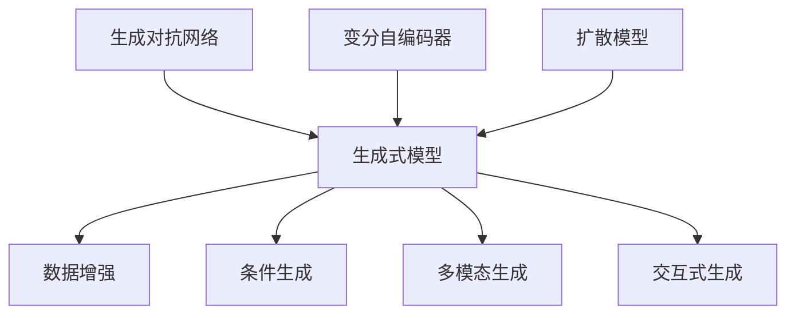

                 

## 1. 背景介绍

随着深度学习、计算机视觉和自然语言处理等技术的快速进步，人工智能(AI)正在迅速改变我们的生活和工作方式。在人工智能的多个分支中，生成式人工智能(Generative AI, AIGC)以其强大的生成能力，正在引领新一轮的技术变革。生成式AI旨在通过生成新的文本、图像、音频等数据，重塑内容创作、娱乐、设计、教育等多个领域的生产力和用户体验。本文将系统介绍生成式AI的核心原理、技术框架、工程实践，以及其在推动产业升级中的重要作用。

### 1.1 问题由来

生成式AI的核心目标是通过训练模型，生成高质量的新数据。它不同于传统的监督学习任务，不需要标注数据，而是利用已有数据进行无监督或半监督学习，生成与训练数据分布相似但独立的新数据。生成式AI的算法包括但不限于GANs、VQ-VAE、Diffusion Models等，这些算法在图像、音频、文本等生成任务中取得了巨大成功。

近年来，生成式AI已经在娱乐、游戏、设计、教育等多个领域得到广泛应用，推动了各行各业的创新和升级。例如，生成式AI在动画制作、虚拟人、音乐创作等领域实现了从传统手工创作向自动生成的大跨越。这些新应用的产生，很大程度上归功于生成式AI技术的快速发展，以及其在游戏化体验、个性化服务、自动化内容生成等方面的巨大潜力。

### 1.2 问题核心关键点

生成式AI的核心挑战在于如何在不依赖大量标注数据的情况下，训练出具有良好生成效果的模型。其主要包括以下关键问题：

- **数据效率**：如何利用有限的、低质量的、多样化的数据，训练出高质量的生成模型。
- **生成质量**：如何控制生成数据的质量和多样性，使其满足实际应用需求。
- **模型复杂度**：如何在保证生成质量的前提下，控制模型的复杂度和训练成本。
- **应用场景**：如何根据不同的应用场景，选择和使用合适的生成模型。

解决这些问题，将使生成式AI在更多领域得到广泛应用，推动产业升级，提升生产力。

### 1.3 问题研究意义

生成式AI的研究与应用，具有重要的现实意义：

1. **提升生产力**：通过自动化、智能化内容生成，大幅提高内容创作效率，降低人力成本。
2. **创新应用**：推动新兴产业的发展，例如虚拟人、元宇宙、沉浸式媒体等。
3. **改善用户体验**：通过生成式AI，提供更加个性化、沉浸式的用户体验，增强用户黏性。
4. **促进教育**：实现个性化学习内容的生成，提高教育质量和效率。
5. **助力营销**：通过生成式AI进行创意广告和营销内容的生成，提升品牌影响力。

总之，生成式AI正在成为推动产业升级的新动力，具有广泛的应用前景和重要的研究价值。

## 2. 核心概念与联系

### 2.1 核心概念概述

生成式AI的核心概念包括：

- **生成式模型(Generative Models)**：通过训练数据生成新数据的模型，如GANs、VAEs、Diffusion Models等。
- **数据增强(Data Augmentation)**：通过对原始数据进行变换和扩充，提高模型的泛化能力。
- **条件生成(Conditional Generation)**：在生成模型中加入条件变量，引导模型生成特定风格或内容的数据。
- **多模态生成(Multimodal Generation)**：生成模型处理多种模态数据，如图像、文本、音频等，实现跨模态内容生成。
- **交互式生成(Interactive Generation)**：用户可以实时与生成模型交互，影响生成结果，提高生成效果。
- **生成对抗网络(GANs)**：由生成器和判别器组成的对抗训练框架，生成高质量的新数据。
- **变分自编码器(VAEs)**：通过编码器和解码器的变分推断，生成具有连续性分布的新数据。
- **扩散模型(Diffusion Models)**：通过控制噪声的加入和去除过程，生成高质量的新数据。

这些核心概念通过合成为一套技术体系，实现了从数据生成到应用落地的全流程。

### 2.2 核心概念原理和架构的 Mermaid 流程图



这个流程图展示了生成式AI的核心技术框架：生成式模型是核心，数据增强、条件生成、多模态生成、交互式生成、生成对抗网络、变分自编码器、扩散模型等技术，都围绕生成式模型展开，并相互支撑。

## 3. 核心算法原理 & 具体操作步骤
### 3.1 算法原理概述

生成式AI的核心算法包括GANs、VAEs、Diffusion Models等，这些算法的基本原理是通过学习数据分布，生成新数据。以下是三种典型生成模型的简要介绍：

1. **生成对抗网络(GANs)**：由生成器和判别器组成，生成器尝试生成逼真的新数据，判别器则尝试区分生成数据和真实数据。两者通过对抗训练，使生成数据越来越接近真实数据。

2. **变分自编码器(VAEs)**：通过编码器和解码器，将数据压缩到低维空间再重构回原空间，学习数据分布的同时生成新数据。VAEs的生成过程具有连续性，更适合生成连续分布的数据。

3. **扩散模型(Diffusion Models)**：通过逐步加入噪声和去除噪声的过程，学习数据分布，生成新数据。扩散模型在生成图像、音频等数据时表现出色。

### 3.2 算法步骤详解

生成式AI的训练通常包括以下几个关键步骤：

1. **数据准备**：收集并预处理训练数据，使其符合生成模型的输入要求。
2. **模型训练**：利用训练数据训练生成模型，优化模型参数，使其能够生成高质量的新数据。
3. **模型评估**：通过指标（如FID、IS等）评估生成模型的生成质量，确定模型是否收敛。
4. **模型微调**：根据需要，调整模型超参数、优化器等，进一步优化模型性能。
5. **生成应用**：将训练好的生成模型应用于实际场景，生成新的内容。

### 3.3 算法优缺点

生成式AI具有以下优点：

- **数据效率高**：利用已有数据进行训练，不需要大量标注数据。
- **生成质量高**：生成的数据与训练数据分布相似，满足实际应用需求。
- **应用范围广**：适用于图像、音频、文本等多种数据生成任务。
- **实时性强**：生成过程可以实时进行，用户体验良好。

但生成式AI也存在一些局限性：

- **生成数据分布的稳定性**：生成的数据分布可能受训练数据的影响，不同批次生成的数据可能存在较大差异。
- **对抗攻击的脆弱性**：生成的数据可能被恶意攻击，如添加噪声等。
- **模型的复杂性**：一些高级生成模型如GANs、Diffusion Models等，训练复杂、计算成本高。

### 3.4 算法应用领域

生成式AI的应用领域广泛，涵盖多个垂直行业：

1. **娱乐与游戏**：通过生成式AI进行动画制作、虚拟人、虚拟场景构建等，提升游戏和娱乐内容的丰富度和互动性。
2. **设计**：生成式AI可用于建筑设计、产品设计等，提高设计的创新性和效率。
3. **教育**：生成个性化学习内容，提升教育质量和用户体验。
4. **营销**：生成创意广告、营销内容等，提高品牌影响力。
5. **媒体**：生成新闻报道、分析报告等，增强媒体内容的深度和广度。
6. **医学**：生成虚拟人体、医学图像等，辅助医学研究和教学。

## 4. 数学模型和公式 & 详细讲解  
### 4.1 数学模型构建

生成式AI的数学模型构建通常包括以下几个关键部分：

- **生成模型**：定义生成概率$p(x)$，表示模型生成数据$x$的概率分布。
- **损失函数**：定义损失函数$L$，用于评估模型生成数据的质量，通常使用KL散度、MSE等指标。
- **优化器**：定义优化器，用于最小化损失函数，常用的优化器包括Adam、SGD等。
- **数据分布**：定义训练数据的分布$p_d(x)$，用于指导模型生成数据。

生成式AI的训练目标是通过优化损失函数，使模型生成的数据$p_g(x)$尽可能接近训练数据分布$p_d(x)$。数学上，这一目标可以通过最小化KL散度$\text{KL}(p_g||p_d)$来实现。

### 4.2 公式推导过程

以下是生成对抗网络(GANs)和变分自编码器(VAEs)的数学推导过程。

**GANs的数学推导**：

1. 生成器$G$将随机噪声$z$映射为生成数据$x$：$x = G(z)$。
2. 判别器$D$区分生成数据$x$和真实数据$x_r$：$D(x) = \begin{cases} 1 & \text{if}\, x = x_r \\ 0 & \text{if}\, x = G(z) \end{cases}$。
3. GANs的目标函数为：$\max_G \min_D V(G, D)$，其中$V$为生成器和判别器的对抗损失函数。

**VAEs的数学推导**：

1. 编码器$E$将数据$x$映射为低维表示$z$：$z = E(x)$。
2. 解码器$D$将低维表示$z$映射回数据$x$：$x = D(z)$。
3. VAEs的目标函数为：$\min_E \max_Z \log p(x|z) + \text{KL}(q(z|x)||p(z))$，其中$q$为编码器的输出分布，$p$为先验分布。

### 4.3 案例分析与讲解

**GANs的案例分析**：

GANs在生成图像、音频、视频等数据时表现出色。例如，在生成高质量的面部表情时，GANs可以生成逼真的新图像，而无需大量标注数据。GANs的训练过程包括两个网络（生成器和判别器）的交替训练，生成器通过对抗判别器的训练，生成更加逼真的数据，而判别器则通过对抗生成器的训练，判断数据的真实性。

**VAEs的案例分析**：

VAEs在生成连续分布的数据（如语音、音频）时表现优异。例如，在生成语音数据时，VAEs可以学习到音素级的概率分布，生成逼真的语音波形。VAEs的训练过程包括编码器和解码器的联合训练，通过最小化KL散度，生成高质量的数据。

## 5. 项目实践：代码实例和详细解释说明
### 5.1 开发环境搭建

在进行生成式AI的实践时，需要搭建相应的开发环境。以下是使用Python进行PyTorch开发的环境配置流程：

1. 安装Anaconda：从官网下载并安装Anaconda，用于创建独立的Python环境。

2. 创建并激活虚拟环境：
```bash
conda create -n pytorch-env python=3.8 
conda activate pytorch-env
```

3. 安装PyTorch：根据CUDA版本，从官网获取对应的安装命令。例如：
```bash
conda install pytorch torchvision torchaudio cudatoolkit=11.1 -c pytorch -c conda-forge
```

4. 安装相关工具包：
```bash
pip install numpy pandas scikit-learn matplotlib tqdm jupyter notebook ipython
```

5. 安装生成式AI库：
```bash
pip install pytorch-lightning ray dlpack ddp
```

完成上述步骤后，即可在`pytorch-env`环境中开始生成式AI的实践。

### 5.2 源代码详细实现

这里我们以生成图像为例，给出使用PyTorch和PyTorch Lightning进行GANs模型训练的代码实现。

首先，定义GANs模型和损失函数：

```python
import torch.nn as nn
import torch.nn.functional as F
from torch.distributions import Normal

class Generator(nn.Module):
    def __init__(self, latent_dim, img_shape):
        super(Generator, self).__init__()
        self.model = nn.Sequential(
            nn.Linear(latent_dim, 256),
            nn.LeakyReLU(0.2, inplace=True),
            nn.Linear(256, 256),
            nn.LeakyReLU(0.2, inplace=True),
            nn.Linear(256, img_shape[0] * img_shape[1] * img_shape[2]),
            nn.Tanh()
        )
    
    def forward(self, noise):
        return self.model(noise)

class Discriminator(nn.Module):
    def __init__(self, img_shape):
        super(Discriminator, self).__init__()
        self.model = nn.Sequential(
            nn.Linear(img_shape[0] * img_shape[1] * img_shape[2], 256),
            nn.LeakyReLU(0.2, inplace=True),
            nn.Linear(256, 256),
            nn.LeakyReLU(0.2, inplace=True),
            nn.Linear(256, 1),
            nn.Sigmoid()
        )
    
    def forward(self, img):
        return self.model(img)

class GAN(nn.Module):
    def __init__(self, latent_dim, img_shape):
        super(GAN, self).__init__()
        self.G = Generator(latent_dim, img_shape)
        self.D = Discriminator(img_shape)
    
    def forward(self, noise):
        fake = self.G(noise)
        real = self.D(fake)
        return fake, real
    
class GANLoss(nn.Module):
    def __init__(self):
        super(GANLoss, self).__init__()
        self.adversarial_loss = nn.BCELoss()
    
    def forward(self, fake, real, label):
        adversarial_loss = self.adversarial_loss(real, label)
        return adversarial_loss
```

然后，定义训练和评估函数：

```python
import torch.optim as optim
from torch.utils.data import DataLoader
import torchvision.transforms as transforms

def train_epoch(model, dataloader, optimizer, device, batch_size, n_critic):
    model.train()
    for i in range(n_critic):
        for batch in dataloader:
            real_images = batch[0].to(device)
            real_labels = torch.ones(batch[0].size(0), 1).to(device)
            noise = torch.randn(batch[0].size(0), latent_dim).to(device)
            fake_images = model.G(noise)
            fake_labels = torch.zeros(batch[0].size(0), 1).to(device)
            D_real = model.D(real_images)
            D_fake = model.D(fake_images)
            D_loss = (D_real + D_fake) / 2
            G_loss = D_fake - D_real
            D_loss.backward()
            G_loss.backward()
            optimizer_G.step()
            optimizer_D.step()
    
def evaluate(model, dataloader, device, batch_size):
    model.eval()
    with torch.no_grad():
        with torch.cuda.amp.autocast():
            for batch in dataloader:
                real_images = batch[0].to(device)
                fake_images = model.G(noise)
                D_real = model.D(real_images)
                D_fake = model.D(fake_images)
                BCE_D_loss = torch.mean(torch.clamp(-D_real + D_fake, min=0))
    return BCE_D_loss.item()
    
device = torch.device('cuda')
noise = torch.randn(batch_size, latent_dim)
model = GAN(latent_dim, img_shape).to(device)
optimizer_G = optim.Adam(model.G.parameters(), lr=0.0002, betas=(0.5, 0.999))
optimizer_D = optim.Adam(model.D.parameters(), lr=0.0002, betas=(0.5, 0.999))
dataloader = DataLoader(real_images, batch_size=batch_size, shuffle=True)
```

最后，启动训练流程并在测试集上评估：

```python
epochs = 100
batch_size = 32
n_critic = 5

for epoch in range(epochs):
    train_epoch(model, dataloader, optimizer_G, device, batch_size, n_critic)
    print(f"Epoch {epoch+1}, loss: {evaluate(model, dataloader, device, batch_size):.4f}")
    
print("Evaluation results:")
evaluate(model, dataloader, device, batch_size)
```

以上就是使用PyTorch和PyTorch Lightning进行GANs模型训练的完整代码实现。可以看到，由于PyTorch Lightning的高效封装，代码实现非常简洁。

### 5.3 代码解读与分析

让我们再详细解读一下关键代码的实现细节：

**GAN模型定义**：
- `Generator`类定义了生成器网络，接收随机噪声并生成图像。
- `Discriminator`类定义了判别器网络，接收图像并判断是否为真实图像。
- `GAN`类将生成器和判别器组合起来，作为完整的GAN模型。

**GANLoss定义**：
- `GANLoss`类定义了GAN的对抗损失函数，包括生成器和判别器的损失计算。

**训练函数**：
- `train_epoch`函数定义了单次训练周期内的操作，包括生成器、判别器的前向传播、损失计算、梯度更新等。

**评估函数**：
- `evaluate`函数定义了模型在测试集上的评估方法，计算判别器在真实图像和生成图像上的损失。

**训练流程**：
- 定义总的epoch数、batch size和critic次数，开始循环迭代
- 每个epoch内，在训练集上训练，输出损失
- 在测试集上评估，输出测试结果

可以看到，PyTorch Lightning的高效封装使得GANs的代码实现非常简洁。开发者可以将更多精力放在模型改进、超参数调优等高层逻辑上，而不必过多关注底层的实现细节。

当然，工业级的系统实现还需考虑更多因素，如模型保存和部署、超参数的自动搜索、更灵活的任务适配层等。但核心的生成过程基本与此类似。

## 6. 实际应用场景
### 6.1 智能设计

生成式AI在智能设计领域具有广泛应用前景。设计师可以利用生成式AI快速生成设计方案，提高设计效率和创意性。例如，在汽车设计中，生成式AI可以生成多种不同风格的车身、内饰设计，帮助设计师快速筛选最优方案。

在建筑设计中，生成式AI可以生成建筑结构、立面、景观等多种设计元素，提高设计的创新性和多样性。设计师可以通过调整生成模型的参数，控制生成结果的样式和风格，实现个性化的设计需求。

### 6.2 医疗影像生成

生成式AI在医疗影像生成中的应用逐渐增多。医学影像数据通常需要大量标注，而生成式AI可以生成逼真的医学影像，减少对标注数据的依赖。例如，生成式AI可以生成肝脏、心脏等器官的医学影像，辅助医生诊断和治疗。

在医疗教育中，生成式AI可以生成医学影像、手术视频等教学素材，提高医学教育的质量和效率。医生可以通过生成式AI生成特定病例的医学影像，进行手术模拟和训练。

### 6.3 智能营销

生成式AI在智能营销中具有巨大潜力。企业可以利用生成式AI生成创意广告、营销视频等，提升品牌曝光率和用户体验。例如，生成式AI可以生成个性化的广告素材，匹配不同用户群体的需求，提高广告投放效果。

在品牌推广中，生成式AI可以生成虚拟代言人、虚拟主播等，提升品牌互动性和用户参与度。企业可以通过生成式AI生成虚拟广告，展示品牌文化和价值主张，增强用户黏性。

### 6.4 未来应用展望

随着生成式AI技术的不断发展，其应用场景将更加丰富和多样。未来，生成式AI有望在更多领域实现突破，推动产业升级和创新。

1. **娱乐与游戏**：生成式AI可以用于虚拟现实、增强现实等新兴技术，提供沉浸式体验。例如，生成式AI可以生成逼真的虚拟场景、虚拟角色，增强游戏的互动性和娱乐性。

2. **设计**：生成式AI可以应用于平面设计、工业设计、服装设计等多个领域，提升设计的效率和创新性。设计师可以利用生成式AI快速生成设计方案，并进行风格迁移和创意拼接。

3. **医疗**：生成式AI可以生成医学影像、虚拟人体等，辅助医疗研究和教育。生成式AI可以生成虚拟手术场景，进行手术模拟和训练，提升医生的操作技能。

4. **教育**：生成式AI可以生成个性化学习内容，提高教育质量和效率。教师可以利用生成式AI生成教材、练习题等，满足不同学生的需求。

5. **媒体**：生成式AI可以生成新闻报道、分析报告等，增强媒体内容的深度和广度。生成式AI可以生成自动新闻稿，提高新闻生产效率。

6. **企业**：生成式AI可以生成商业文档、产品介绍等，提高企业的生产力和市场竞争力。企业可以利用生成式AI生成销售方案、市场分析报告，提升决策效率。

总之，生成式AI正在成为推动产业升级的新动力，具有广阔的应用前景。未来，随着生成式AI技术的不断发展，其应用领域将更加广泛和深入。

## 7. 工具和资源推荐
### 7.1 学习资源推荐

为了帮助开发者系统掌握生成式AI的理论基础和实践技巧，这里推荐一些优质的学习资源：

1. 《Generative Adversarial Networks: Training Generative Adversarial Nets》论文：生成对抗网络领域的奠基性论文，介绍了GANs的基本原理和训练方法。

2. 《Learning Deep Architectures for AI》书籍：深度学习领域的经典著作，介绍了生成对抗网络、变分自编码器等多种生成模型的理论基础。

3. 《Deep Learning for Unsupervised Learning, Transfer Learning, and Generative Models》课程：斯坦福大学开设的深度学习课程，介绍了生成对抗网络、变分自编码器等生成模型。

4. 《Generative AI: An Introduction to Creating, Designing, and Optimizing AI》书籍：介绍生成式AI的入门读物，涵盖生成对抗网络、变分自编码器、扩散模型等多种生成模型的应用实践。

5. PyTorch官方文档：PyTorch的官方文档，提供了生成对抗网络、变分自编码器、扩散模型等多种生成模型的完整样例代码。

6. HuggingFace官方文档：HuggingFace的官方文档，提供了生成对抗网络、变分自编码器、扩散模型等多种生成模型的实现。

通过对这些资源的学习实践，相信你一定能够快速掌握生成式AI的精髓，并用于解决实际的生成任务。

### 7.2 开发工具推荐

高效的开发离不开优秀的工具支持。以下是几款用于生成式AI开发的常用工具：

1. PyTorch：基于Python的开源深度学习框架，灵活动态的计算图，适合快速迭代研究。PyTorch提供了丰富的生成模型库，支持GPU加速。

2. TensorFlow：由Google主导开发的开源深度学习框架，生产部署方便，适合大规模工程应用。TensorFlow提供了多种生成模型实现，支持分布式训练。

3. PyTorch Lightning：基于PyTorch的高效框架，简化了模型训练、超参数调优等操作。PyTorch Lightning支持多种生成模型，提供了高效的分布式训练和可视化功能。

4. Weights & Biases：模型训练的实验跟踪工具，可以记录和可视化模型训练过程中的各项指标，方便对比和调优。

5. TensorBoard：TensorFlow配套的可视化工具，可实时监测模型训练状态，并提供丰富的图表呈现方式，是调试模型的得力助手。

6. Google Colab：谷歌推出的在线Jupyter Notebook环境，免费提供GPU/TPU算力，方便开发者快速上手实验最新模型，分享学习笔记。

合理利用这些工具，可以显著提升生成式AI的开发效率，加快创新迭代的步伐。

### 7.3 相关论文推荐

生成式AI的研究与应用，源于学界的持续研究。以下是几篇奠基性的相关论文，推荐阅读：

1. Generative Adversarial Networks: Training Generative Adversarial Nets：生成对抗网络领域的奠基性论文，介绍了GANs的基本原理和训练方法。

2. Learning Deep Architectures for AI：深度学习领域的经典著作，介绍了生成对抗网络、变分自编码器等多种生成模型的理论基础。

3. Deep Learning for Unsupervised Learning, Transfer Learning, and Generative Models：介绍生成对抗网络、变分自编码器、扩散模型等多种生成模型的理论基础和实践方法。

4. GANs in the Wild: A Survey on Real-World Applications of GANs：回顾生成对抗网络在多个领域的应用，包括娱乐、医疗、设计等。

5. Variational Autoencoders for Imaging: A Comprehensive Review：变分自编码器在图像生成、图像修复等任务中的应用，提供了详细的模型设计和实现方法。

6. Denoising Diffusion Probabilistic Models：扩散模型在图像生成、音频生成等任务中的应用，介绍了扩散模型的原理和实现方法。

这些论文代表了大规模生成模型的发展脉络，涵盖了从基础理论到应用实践的全方位内容。通过学习这些前沿成果，可以帮助研究者把握学科前进方向，激发更多的创新灵感。

## 8. 总结：未来发展趋势与挑战
### 8.1 研究成果总结

生成式AI在多个领域展现了巨大的应用潜力，取得了显著的成果。其主要进展包括：

1. **生成模型性能提升**：生成对抗网络、变分自编码器、扩散模型等生成模型的性能不断提升，生成的数据质量越来越高。

2. **生成任务的扩展**：生成式AI在图像、音频、视频、文本等多种数据生成任务中得到广泛应用，推动了多个行业的发展。

3. **技术体系的成熟**：生成式AI的技术体系逐渐成熟，训练、评估、应用等环节的实现方式日趋标准化。

### 8.2 未来发展趋势

未来，生成式AI的发展趋势主要包括以下几个方面：

1. **模型规模扩大**：随着算力的提升，生成模型的规模将不断增大，生成的数据质量和多样性将进一步提升。

2. **生成任务多样**：生成式AI将在更多领域得到应用，例如虚拟人、元宇宙、娱乐等，生成任务将更加多样和复杂。

3. **生成方法创新**：生成对抗网络、变分自编码器、扩散模型等生成方法将不断创新，生成模型的训练和优化技术也将更加高效。

4. **应用场景丰富**：生成式AI将在娱乐、游戏、设计、医疗等多个领域得到广泛应用，推动产业升级和创新。

5. **跨模态融合**：生成式AI将实现跨模态数据生成，如图像、音频、文本等多种数据的协同生成。

6. **实时生成能力提升**：生成式AI的实时生成能力将进一步提升，实现更高效的交互体验和个性化服务。

### 8.3 面临的挑战

生成式AI在快速发展的同时，也面临诸多挑战：

1. **数据质量问题**：生成的数据质量受训练数据的影响，低质量的数据可能导致生成结果的不稳定性。

2. **对抗攻击脆弱性**：生成式AI容易受到对抗攻击，生成结果可能被恶意修改。

3. **计算资源消耗**：大规模生成模型的训练和推理需要大量计算资源，成本较高。

4. **模型可解释性**：生成式AI的模型缺乏可解释性，难以理解其内部工作机制和决策逻辑。

5. **伦理道德问题**：生成的数据可能包含偏见、有害信息，造成伦理道德问题。

### 8.4 研究展望

针对生成式AI面临的挑战，未来的研究应关注以下几个方面：

1. **数据增强和数据治理**：研究如何通过数据增强技术提高生成数据的质量，同时建立数据治理机制，确保数据的安全性和公平性。

2. **模型鲁棒性和安全性**：研究如何提高生成模型的鲁棒性和安全性，防止对抗攻击，确保生成数据的质量和可信度。

3. **实时生成和交互设计**：研究如何提高生成模型的实时生成能力，设计更加智能和互动的用户界面。

4. **可解释性和透明性**：研究如何提高生成模型的可解释性和透明性，增强用户信任和接受度。

5. **伦理道德约束**：研究如何建立伦理道德约束机制，确保生成式AI的应用符合伦理道德标准。

总之，生成式AI的研究与应用前景广阔，但面临的挑战也同样严峻。只有不断解决这些挑战，生成式AI才能真正落地应用，推动产业升级。

## 9. 附录：常见问题与解答

**Q1：生成式AI和传统AI的区别是什么？**

A: 生成式AI和传统AI的主要区别在于目标和应用场景。生成式AI的目标是通过训练生成模型，生成新的数据，主要用于数据生成、设计、娱乐等场景；而传统AI的目标是通过训练模型，进行分类、回归、聚类等任务，主要用于数据标注、信息检索等场景。

**Q2：如何训练一个高质量的生成模型？**

A: 训练高质量的生成模型需要考虑以下几个方面：

1. **数据质量**：使用高质量、多样化的数据进行训练，确保生成数据的质量和多样性。

2. **模型选择**：根据生成任务选择合适的生成模型，如GANs、VAEs、Diffusion Models等。

3. **超参数调优**：通过超参数调优，找到最优的模型参数和训练策略，提高生成效果。

4. **模型评估**：使用合适的指标评估生成模型的性能，如FID、IS等。

5. **数据增强**：通过数据增强技术扩充训练集，提高模型的泛化能力。

**Q3：生成式AI在实际应用中面临哪些挑战？**

A: 生成式AI在实际应用中面临以下挑战：

1. **数据质量问题**：生成的数据质量受训练数据的影响，低质量的数据可能导致生成结果的不稳定性。

2. **对抗攻击脆弱性**：生成式AI容易受到对抗攻击，生成结果可能被恶意修改。

3. **计算资源消耗**：大规模生成模型的训练和推理需要大量计算资源，成本较高。

4. **模型可解释性**：生成式AI的模型缺乏可解释性，难以理解其内部工作机制和决策逻辑。

5. **伦理道德问题**：生成的数据可能包含偏见、有害信息，造成伦理道德问题。

**Q4：生成式AI的生成过程如何实现？**

A: 生成式AI的生成过程通常包括以下几个步骤：

1. **数据准备**：收集并预处理训练数据，使其符合生成模型的输入要求。

2. **模型训练**：利用训练数据训练生成模型，优化模型参数，使其能够生成高质量的新数据。

3. **模型评估**：通过指标（如FID、IS等）评估生成模型的生成质量，确定模型是否收敛。

4. **模型微调**：根据需要，调整模型超参数、优化器等，进一步优化模型性能。

5. **生成应用**：将训练好的生成模型应用于实际场景，生成新的内容。

总之，生成式AI的生成过程需要经过数据准备、模型训练、评估、微调等多个环节，确保生成模型的生成质量和稳定性。

---

作者：禅与计算机程序设计艺术 / Zen and the Art of Computer Programming

