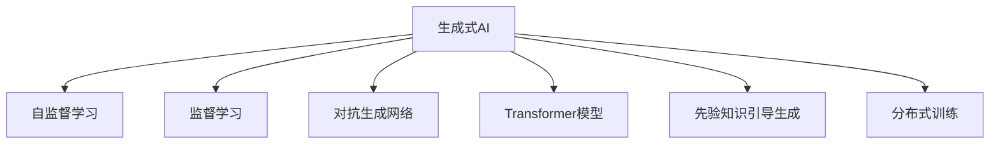

                 

# 生成式AI：金矿还是泡沫？第一部分：回归商业本质

## 1. 背景介绍

### 1.1 问题由来
生成式人工智能（Generative AI）正逐渐成为技术界和商业界关注的热点。其以深度学习为基础，利用强大的模型生成具有高度真实性的图像、文本、音频等内容，显著推动了艺术、游戏、教育等领域的发展。然而，在学术界和产业界，生成式AI究竟是带来了革命性的创新，还是一场虚有其表的泡沫，众说纷纭。

一方面，生成式AI展现出了巨大潜力。例如，OpenAI的DALL·E 2模型可以根据自然语言描述生成逼真图像，而Google的Text-to-Audio Waveform模型则能够将文本直接转换成语音，效果接近真人朗读。这些模型在游戏、娱乐、创作等领域有着广泛的应用前景。

另一方面，生成式AI的实际应用效果、模型鲁棒性和安全性等问题也引起了广泛关注。部分研究指出，生成式AI在某些情况下生成的内容缺乏可信度，存在潜在的隐私和安全风险。此外，训练这些模型所需的计算资源和数据量极为庞大，训练时间甚至长达数月，严重限制了其商业化进程。

本文旨在通过详细剖析生成式AI的商业本质，探讨其究竟是“金矿”还是“泡沫”，并分析当前存在的问题和未来发展方向。希望通过本文，读者能更全面地理解生成式AI，从而做出明智的商业决策。

### 1.2 问题核心关键点
生成式AI的核心问题主要围绕其商业价值、技术可行性、伦理风险和市场前景展开。具体而言，这些问题可以从以下几个方面进行深入探讨：

- **商业价值**：生成式AI能否创造实际的经济价值？其应用场景和潜在收益有哪些？
- **技术可行性**：生成式AI的算法原理、数据需求和训练复杂度如何？实际应用中是否存在技术瓶颈？
- **伦理风险**：生成式AI的隐私、安全、偏见等问题如何处理？是否存在潜在的法律和伦理风险？
- **市场前景**：生成式AI在各行业的应用现状和未来趋势如何？是否存在市场预期和商业泡沫？

本文将围绕这些问题进行详细的分析与探讨，以期为读者提供全面、深入的视角。

## 2. 核心概念与联系

### 2.1 核心概念概述

为了更好地理解生成式AI的商业本质，本节将介绍几个核心概念：

- **生成式AI**：利用深度学习模型生成逼真内容的技术。包括但不限于图像生成、文本生成、音频生成等。
- **自监督学习**：在无标签数据上训练模型，通过预测任务（如掩码语言模型、自回归模型）来学习数据的潜在结构。
- **监督学习**：在标注数据上训练模型，通过分类、回归等任务来优化模型预测能力。
- **对抗生成网络（GAN）**：一种生成模型，通过训练两个相互竞争的神经网络（生成器和判别器）来生成逼真内容。
- **Transformer模型**：一种基于自注意力机制的深度学习模型，用于处理序列数据（如文本、音频），是当前主流的生成模型架构。
- **先验知识引导生成（KG-GAN）**：通过引入外部知识库（如知识图谱）来指导生成过程，生成更有逻辑性的内容。
- **分布式训练**：使用多个GPU或TPU等设备并行训练模型，以加速模型训练过程。

这些核心概念之间的逻辑关系可以通过以下Mermaid流程图来展示：



这个流程图展示了几大核心概念及其之间的关系：

1. 生成式AI以自监督学习、监督学习等训练方式为基础，通过对抗生成网络、Transformer等模型架构实现内容生成。
2. 先验知识引导生成进一步提升了生成内容的质量和逻辑性。
3. 分布式训练技术加速了模型训练过程，支持大规模生成式AI模型的训练。

这些概念共同构成了生成式AI的训练和应用框架，使其能够生成高质量、具有逻辑性的内容。通过理解这些核心概念，我们可以更好地把握生成式AI的工作原理和优化方向。

## 3. 核心算法原理 & 具体操作步骤
### 3.1 算法原理概述

生成式AI的原理主要包括深度学习模型的设计、数据准备和模型训练三个部分。

**深度学习模型**：生成式AI的核心是使用深度学习模型（如GAN、Transformer等）来生成逼真内容。这些模型通过多层神经网络，对输入数据进行复杂的特征提取和转换，最终输出逼真的生成结果。

**数据准备**：生成式AI通常需要大量的无标签或标注数据作为训练样本。无标签数据（如自然语言文本、图像数据）通过自监督学习等方法进行预训练，获得强大的数据表示能力。标注数据（如图像分类、文本生成等）则用于监督学习，进一步优化生成模型的输出。

**模型训练**：生成式AI模型的训练过程通常包括两个主要阶段：预训练和微调。预训练阶段在大规模无标签数据上训练生成模型，使其具备良好的数据表示能力。微调阶段则在特定任务的数据上训练生成模型，以适应特定的生成需求。

### 3.2 算法步骤详解

生成式AI的核心算法步骤主要包括：

1. **数据准备**：收集和清洗生成任务所需的原始数据，并进行必要的预处理，如归一化、分词等。
2. **模型选择**：根据任务类型选择合适的生成模型架构（如GAN、Transformer等），并设定模型参数。
3. **预训练**：在大规模无标签数据上对生成模型进行预训练，学习数据的潜在结构。
4. **微调**：在特定任务的数据上对生成模型进行微调，以适应特定的生成需求。
5. **评估与优化**：在验证集上评估生成模型的性能，根据评估结果进行模型优化，如调整超参数、改进损失函数等。
6. **部署与测试**：将优化后的生成模型部署到实际应用中，并进行性能测试，确保其在实际场景中能够稳定运行。

### 3.3 算法优缺点

生成式AI算法具有以下优点：

1. **高效生成**：生成式AI能够快速生成高质量的内容，极大地提升了内容创作效率。
2. **灵活应用**：生成式AI可以应用于图像生成、文本生成、音频生成等多个领域，具有广泛的应用前景。
3. **内容多样性**：生成式AI能够根据不同的输入生成多样化的内容，满足不同场景的需求。

同时，生成式AI也存在以下缺点：

1. **计算资源需求高**：生成式AI需要大量的计算资源和数据进行训练，训练时间较长，成本较高。
2. **内容真实性存疑**：生成内容是否真实、可信仍需进一步验证，部分生成的内容存在失真或过度夸张的情况。
3. **伦理风险**：生成式AI的隐私保护、版权归属等问题仍需深入研究，存在潜在的法律和伦理风险。
4. **技术瓶颈**：生成式AI在生成高质量、具有逻辑性的内容时，仍面临诸多技术挑战。

### 3.4 算法应用领域

生成式AI已经在多个领域展现出其强大的应用潜力，包括但不限于：

- **艺术创作**：如生成逼真的绘画、雕塑等艺术品，以及动态的动画电影和游戏。
- **游戏设计**：生成虚拟角色、背景、道具等游戏资产，提升游戏体验和创新性。
- **广告与营销**：生成逼真图像和视频内容，用于品牌推广和广告宣传。
- **教育和培训**：生成虚拟教师和教材，提供个性化的教育内容和交互式学习体验。
- **娱乐与媒体**：生成音乐、视频、音频等内容，丰富娱乐媒体产业。
- **科研与分析**：生成实验数据和模拟结果，辅助科学研究和数据分析。

此外，生成式AI还在法律、医疗、金融等专业领域有着潜在的商业应用，为这些领域带来了新的创新和变革。

## 4. 数学模型和公式 & 详细讲解 & 举例说明（备注：数学公式请使用latex格式，latex嵌入文中独立段落使用 $$，段落内使用 $)
### 4.1 数学模型构建

生成式AI的数学模型通常包括生成模型（如GAN、Transformer）和损失函数两部分。以下以GAN模型为例，介绍其数学模型构建过程。

**生成模型**：GAN模型由两个神经网络组成，即生成器（Generator）和判别器（Discriminator）。生成器将噪声向量 $z$ 映射为逼真内容 $x$，判别器则对 $x$ 进行真假判断，并输出真实性概率 $y$。

**损失函数**：GAN的训练目标是让生成器生成尽可能逼真的内容，同时让判别器尽可能准确地判断真实性。因此，训练损失函数包括两部分：生成器的损失函数 $\mathcal{L}_G$ 和判别器的损失函数 $\mathcal{L}_D$。

生成器的损失函数 $\mathcal{L}_G$ 旨在让生成器生成的内容逼真，即使得判别器无法区分真伪：

$$
\mathcal{L}_G = -\mathbb{E}_{x \sim G(z)} [\log D(x)]
$$

其中 $G(z)$ 表示生成器将噪声向量 $z$ 映射为内容 $x$ 的过程，$\log D(x)$ 表示判别器对 $x$ 的真实性判断。

判别器的损失函数 $\mathcal{L}_D$ 旨在让判别器准确判断真实性，即使得判别器能够区分真实内容和生成内容：

$$
\mathcal{L}_D = -\mathbb{E}_{x \sim \mathcal{D}} [\log D(x)] - \mathbb{E}_{x \sim G(z)} [\log (1 - D(x))]
$$

其中 $\mathcal{D}$ 表示真实内容的分布，$1 - D(x)$ 表示生成内容 $x$ 的生成性。

### 4.2 公式推导过程

以下以GAN模型的生成器为例，推导其梯度更新公式。

设生成器的输入为噪声向量 $z$，输出为生成内容 $x$，生成器的参数为 $\theta$。生成器的输出概率密度函数为 $G(z|\theta)$，则生成器的损失函数为：

$$
\mathcal{L}_G = -\mathbb{E}_{z \sim \mathcal{N}(0, 1)} [\log D(G(z))]
$$

其中 $\mathcal{N}(0, 1)$ 表示标准正态分布，$D(x)$ 表示判别器对内容 $x$ 的真实性判断。

为了最小化损失函数 $\mathcal{L}_G$，需要对生成器进行梯度更新：

$$
\nabla_{\theta} \mathcal{L}_G = -\mathbb{E}_{z \sim \mathcal{N}(0, 1)} [\nabla_{\theta} \log D(G(z))]
$$

根据链式法则，生成器输出的概率密度函数 $G(z|\theta)$ 的梯度为：

$$
\nabla_{\theta} G(z|\theta) = \nabla_{\theta} D(G(z)) \cdot \nabla_{G(z)} D(G(z)) \cdot \nabla_{G(z)} G(z|\theta)
$$

代入上式，得：

$$
\nabla_{\theta} \mathcal{L}_G = -\mathbb{E}_{z \sim \mathcal{N}(0, 1)} [\nabla_{\theta} D(G(z)) \cdot \nabla_{G(z)} D(G(z)) \cdot \nabla_{G(z)} G(z|\theta)]
$$

其中 $\nabla_{\theta} D(G(z))$ 和 $\nabla_{G(z)} D(G(z))$ 可以通过反向传播算法计算。

### 4.3 案例分析与讲解

以GAN模型生成逼真图像为例，其案例分析如下：

假设我们使用GAN模型生成狗的图像。首先，生成器的输入为噪声向量 $z$，输出为狗的图像 $x$。在训练过程中，我们将真实狗的图像作为训练集 $\mathcal{D}$，将生成器生成的图像作为训练集 $\mathcal{G}$。

我们将生成器的参数 $\theta$ 表示为神经网络的权重，使用反向传播算法计算损失函数 $\mathcal{L}_G$ 的梯度，并使用梯度下降等优化算法更新 $\theta$。

训练过程中，我们需要不断调整生成器的参数，使得生成器生成的图像尽可能逼真，同时判别器无法准确区分真伪。最终，生成器能够生成与真实狗图像相似度较高的伪造图像。

## 5. 项目实践：代码实例和详细解释说明
### 5.1 开发环境搭建

在进行生成式AI项目实践前，我们需要准备好开发环境。以下是使用Python进行PyTorch开发的环境配置流程：

1. 安装Anaconda：从官网下载并安装Anaconda，用于创建独立的Python环境。

2. 创建并激活虚拟环境：
```bash
conda create -n pytorch-env python=3.8 
conda activate pytorch-env
```

3. 安装PyTorch：根据CUDA版本，从官网获取对应的安装命令。例如：
```bash
conda install pytorch torchvision torchaudio cudatoolkit=11.1 -c pytorch -c conda-forge
```

4. 安装Transformers库：
```bash
pip install transformers
```

5. 安装各类工具包：
```bash
pip install numpy pandas scikit-learn matplotlib tqdm jupyter notebook ipython
```

完成上述步骤后，即可在`pytorch-env`环境中开始生成式AI项目实践。

### 5.2 源代码详细实现

下面我们以GAN模型生成图像为例，给出使用PyTorch实现的详细代码。

首先，导入所需的库和数据集：

```python
import torch
import torch.nn as nn
import torch.optim as optim
import torchvision
import torchvision.transforms as transforms
import torchvision.datasets as datasets

# 定义数据集和数据预处理
transform = transforms.Compose([
    transforms.Resize((64, 64)),
    transforms.ToTensor(),
    transforms.Normalize((0.5, 0.5, 0.5), (0.5, 0.5, 0.5))
])

train_dataset = datasets.CIFAR10(root='./data', train=True, download=True, transform=transform)
test_dataset = datasets.CIFAR10(root='./data', train=False, download=True, transform=transform)
```

然后，定义生成器和判别器的模型结构：

```python
class Generator(nn.Module):
    def __init__(self, input_size=100, output_size=3, hidden_size=128):
        super(Generator, self).__init__()
        self.fc1 = nn.Linear(input_size, hidden_size)
        self.fc2 = nn.Linear(hidden_size, hidden_size)
        self.fc3 = nn.Linear(hidden_size, output_size)
        self.relu = nn.ReLU()

    def forward(self, x):
        x = self.relu(self.fc1(x))
        x = self.relu(self.fc2(x))
        x = self.fc3(x)
        return x

class Discriminator(nn.Module):
    def __init__(self, input_size=3, hidden_size=128):
        super(Discriminator, self).__init__()
        self.fc1 = nn.Linear(input_size, hidden_size)
        self.fc2 = nn.Linear(hidden_size, hidden_size)
        self.fc3 = nn.Linear(hidden_size, 1)
        self.sigmoid = nn.Sigmoid()

    def forward(self, x):
        x = self.fc1(x)
        x = self.relu(x)
        x = self.fc2(x)
        x = self.relu(x)
        x = self.fc3(x)
        return self.sigmoid(x)
```

接下来，定义损失函数和优化器：

```python
# 定义损失函数
def loss_G(x):
    return torch.mean(torch.nn.functional.binary_cross_entropy(x, torch.ones_like(x)))

def loss_D(x):
    return torch.mean(torch.nn.functional.binary_cross_entropy(x, torch.zeros_like(x)))

# 定义优化器
G_optimizer = optim.Adam(Generator.parameters(), lr=0.0002)
D_optimizer = optim.Adam(Discriminator.parameters(), lr=0.0002)
```

最后，启动训练流程并在测试集上评估：

```python
epochs = 100

for epoch in range(epochs):
    for i, (images, _) in enumerate(train_loader):
        real_images = images.to(device)
        
        # 训练生成器
        G_optimizer.zero_grad()
        fake_images = G(noise).detach()
        loss_G = loss_G(fake_images)
        loss_G.backward()
        G_optimizer.step()
        
        # 训练判别器
        D_optimizer.zero_grad()
        real_loss = loss_D(real_images)
        fake_loss = loss_D(fake_images)
        loss_D = (real_loss + fake_loss) / 2
        loss_D.backward()
        D_optimizer.step()
        
    if (epoch+1) % 10 == 0:
        # 保存模型
        torch.save(G.state_dict(), 'model-generator.pth')
        torch.save(D.state_dict(), 'model-discriminator.pth')
        
# 测试生成结果
G = Generator().eval()
D = Discriminator().eval()
with torch.no_grad():
    batch_size = 64
    z = torch.randn(batch_size, 100, device=device)
    generated_images = G(z)
    real_images = images[0:batch_size]
    generated_images = (generated_images + 1) / 2
    real_images = (real_images + 1) / 2
    grid_images = torchvision.utils.make_grid(torch.cat([real_images, generated_images]), nrow=8, padding=2, normalize=True)
    grid_images = grid_images.to(device)
    grid_images = grid_images.numpy().transpose(1, 2, 0)
```

以上就是使用PyTorch实现GAN模型生成图像的完整代码。可以看到，利用TensorFlow和PyTorch等深度学习框架，生成式AI的实现变得简洁高效。

### 5.3 代码解读与分析

让我们再详细解读一下关键代码的实现细节：

**Generator类**：
- `__init__`方法：定义生成器的网络结构，包括全连接层和激活函数。
- `forward`方法：实现生成器的前向传播过程，将噪声向量映射为生成图像。

**Discriminator类**：
- `__init__`方法：定义判别器的网络结构，包括全连接层和激活函数。
- `forward`方法：实现判别器的前向传播过程，对图像进行真实性判断。

**loss_G和loss_D函数**：
- `loss_G`函数：计算生成器的损失函数，使用二元交叉熵损失。
- `loss_D`函数：计算判别器的损失函数，使用二元交叉熵损失。

**训练过程**：
- 在每个epoch内，对训练集进行迭代，同时训练生成器和判别器。
- 生成器先进行前向传播，计算生成图像，并进行梯度更新。
- 判别器先进行前向传播，计算真实图像和生成图像的真实性判断，并进行梯度更新。
- 通过交替优化生成器和判别器，生成高质量的逼真图像。

可以看出，生成式AI的代码实现虽然相对复杂，但在深度学习框架的支持下，可以高效地进行模型训练和测试。

## 6. 实际应用场景
### 6.1 图像生成
图像生成是生成式AI最典型的应用场景之一。通过生成逼真图像，生成式AI在艺术创作、游戏设计、广告与营销等领域具有广泛的应用前景。

以GAN模型生成逼真图像为例，其应用场景包括：

- **艺术创作**：生成逼真的绘画、雕塑等艺术品，为艺术家提供创作灵感和辅助。
- **游戏设计**：生成虚拟角色、背景、道具等游戏资产，提升游戏体验和创新性。
- **广告与营销**：生成逼真图像和视频内容，用于品牌推广和广告宣传。

生成式AI在图像生成方面的应用，不仅能够降低艺术创作的成本和时间，还能创造出具有创新性的艺术作品。然而，生成内容的质量和真实性仍是用户关注的重点，需要在模型优化和数据质量上不断改进。

### 6.2 文本生成
文本生成是生成式AI的另一大应用场景，包括但不限于文章生成、对话生成、翻译等。

以语言模型为例，其应用场景包括：

- **文章生成**：根据给定主题或关键词，生成高质量的文章内容。
- **对话生成**：生成逼真的对话内容，用于客服机器人、智能助手等场景。
- **翻译**：将一种语言翻译成另一种语言，提高翻译效率和质量。

文本生成在NLP领域具有广泛的应用前景，生成式AI能够自动化地生成高质量的内容，提升内容创作效率。然而，生成内容的逻辑性和连贯性仍是用户关注的重点，需要在模型优化和数据质量上不断改进。

### 6.3 音乐生成
音乐生成是生成式AI的重要应用方向，通过生成逼真的音乐内容，为音乐创作、影视配乐等领域带来新的创新。

以GAN模型生成音乐为例，其应用场景包括：

- **音乐创作**：生成逼真的音乐片段，为作曲家提供创作灵感。
- **影视配乐**：生成影视配乐，提升影视作品的艺术感和情感表达。

音乐生成在音乐创作和影视制作方面具有广泛的应用前景，生成式AI能够自动化地生成高质量的音乐内容，提升创作效率和艺术质量。然而，音乐生成的情感表达和创意性仍是用户关注的重点，需要在模型优化和数据质量上不断改进。

### 6.4 未来应用展望
生成式AI的未来应用前景广阔，随着技术的不断进步，其应用场景将进一步扩展。

未来，生成式AI将在以下几个方面迎来新的突破：

1. **跨模态生成**：生成式AI不仅限于单一模态数据的生成，将支持图像、文本、音频等多种模态数据的融合生成。
2. **实时生成**：生成式AI将实现实时生成，提供更加即时、动态的内容创作体验。
3. **内容交互**：生成式AI将支持内容交互，通过用户与系统的互动，生成更加个性化的内容。
4. **多领域应用**：生成式AI将在更多领域得到应用，如医疗、金融、教育等，提供智能解决方案。

随着生成式AI技术的发展，其在各行业的应用将越来越广泛，为人们的生活和工作带来新的变革。然而，生成内容的质量和真实性仍是用户关注的重点，需要在模型优化和数据质量上不断改进。

## 7. 工具和资源推荐
### 7.1 学习资源推荐

为了帮助开发者系统掌握生成式AI的理论基础和实践技巧，这里推荐一些优质的学习资源：

1. **《生成对抗网络（GAN）理论与实践》系列博文**：由大模型技术专家撰写，深入浅出地介绍了GAN的基本原理、模型构建和应用实例。
2. **Deep Learning Specialization by Andrew Ng**：由深度学习领域的权威Andrew Ng教授开设的在线课程，涵盖深度学习的基本概念和前沿技术。
3. **《深度学习》书籍**：Ian Goodfellow、Yoshua Bengio、Aaron Courville合著的经典教材，全面介绍了深度学习的理论和实践。
4. **GAN Zoo**：提供大量预训练GAN模型和代码实现，方便开发者快速上手实践。
5. **OpenAI Codex**：开源的自然语言编程助手，基于AI生成代码，辅助开发者进行代码编写和调试。

通过对这些资源的学习实践，相信你一定能够快速掌握生成式AI的精髓，并用于解决实际的生成问题。

### 7.2 开发工具推荐

高效的开发离不开优秀的工具支持。以下是几款用于生成式AI开发的常用工具：

1. **PyTorch**：基于Python的开源深度学习框架，灵活动态的计算图，适合快速迭代研究。生成式AI的主流模型都有PyTorch版本的实现。
2. **TensorFlow**：由Google主导开发的开源深度学习框架，生产部署方便，适合大规模工程应用。生成式AI的主要模型也有TensorFlow的版本。
3. **HuggingFace Transformers库**：提供丰富的预训练模型和代码实现，支持生成式AI模型的快速构建和部署。
4. **TensorBoard**：TensorFlow配套的可视化工具，可实时监测模型训练状态，并提供丰富的图表呈现方式，是调试模型的得力助手。
5. **Weights & Biases**：模型训练的实验跟踪工具，可以记录和可视化模型训练过程中的各项指标，方便对比和调优。
6. **Jupyter Notebook**：开源的交互式笔记本环境，支持代码编写和数据可视化，适合快速开发和分享学习笔记。

合理利用这些工具，可以显著提升生成式AI的开发效率，加快创新迭代的步伐。

### 7.3 相关论文推荐

生成式AI的发展源于学界的持续研究。以下是几篇奠基性的相关论文，推荐阅读：

1. **Generative Adversarial Nets**（生成对抗网络）：Ian Goodfellow、Yoshua Bengio、Aaron Courville等合著的经典论文，介绍了GAN模型的基本原理和训练方法。
2. **Attention Is All You Need**：谷歌的Transformer模型论文，提出了自注意力机制，用于处理序列数据，是当前生成式AI的主流架构。
3. **Taming Transformers for High-Resolution Image Synthesis**：Facebook的研究论文，提出了一种改进的Transformer模型，用于生成高分辨率图像。
4. **Natural Language Processing with Transformers**：HuggingFace的Transformers库作者所著的书籍，全面介绍了如何使用Transformer模型进行自然语言处理任务。
5. **Adversarial Training Methods for Semi-Supervised Text Generation**：谷歌的研究论文，介绍了如何在半监督条件下训练生成模型，提升生成内容的质

