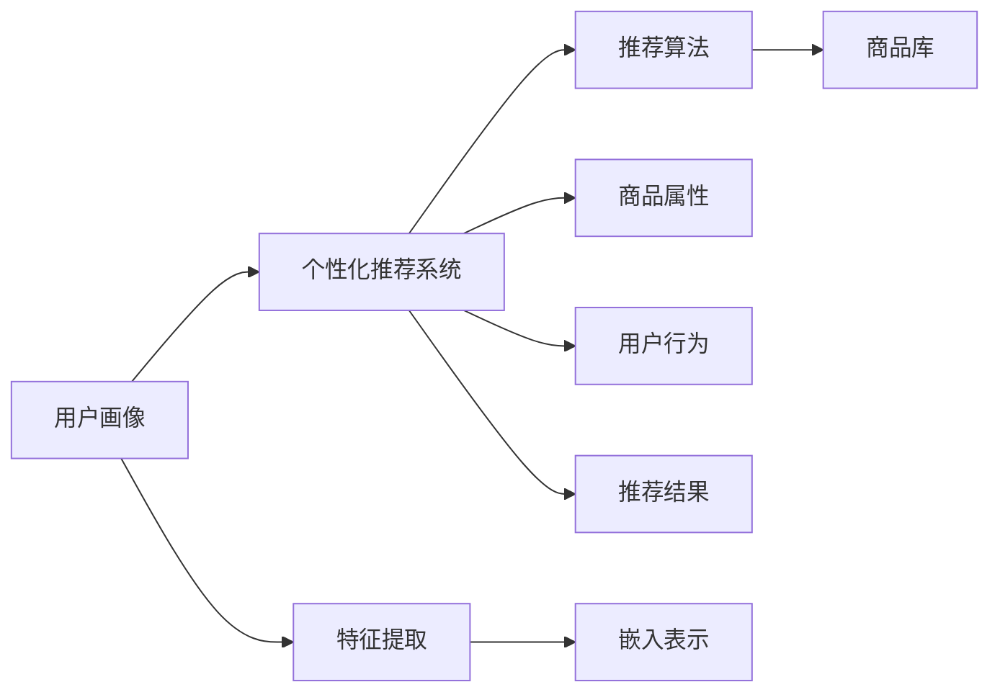

                 

## 1. 背景介绍

### 1.1 问题由来
随着电商行业的蓬勃发展，各大电商平台纷纷面临用户增长、流量分发、商品推荐等诸多挑战。如何准确了解用户需求，高效匹配商品，提升用户体验和转化率，成为电商平台迫切需要解决的核心问题。个性化推荐作为提升用户满意度和电商交易转化率的重要手段，近年来受到了广泛关注。

用户画像(User Profile)是描绘用户特征的关键工具，通过将用户的基本信息、行为数据、消费习惯等转换为结构化的标签，可以更精确地刻画用户特征。而电商个性化推荐系统就是利用这些用户画像数据，结合商品属性、评价、销量等相关信息，为用户推荐最符合其需求的商品，实现精准匹配和高效转化。

本文将详细介绍基于用户画像的电商个性化推荐系统的设计思路、关键算法及其实现方法，通过丰富的案例和实用的开发实践，帮助读者全面理解这一技术，并在实际应用中实现精准推荐。

## 2. 核心概念与联系

### 2.1 核心概念概述

在深入讨论个性化推荐技术之前，我们先简要介绍几个关键概念：

1. **用户画像(User Profile)**：通过收集用户的基本信息、行为数据、消费习惯等，将其转换为结构化的标签，以刻画用户特征。常见的用户画像属性包括人口统计信息、浏览历史、购买记录等。

2. **个性化推荐系统(Recommendation System)**：利用用户画像和商品属性等数据，通过算法为用户推荐最符合其兴趣和需求的商品。推荐系统一般分为基于协同过滤(Collaborative Filtering)和基于内容推荐(Content-Based Recommendation)两大类。

3. **推荐算法(Recommendation Algorithm)**：推荐系统中的核心技术，用于计算用户和商品之间的相似度，并根据相似度进行推荐。常见的推荐算法包括基于矩阵分解的SVD、基于聚类的K-means、基于深度学习的Neural Factorization Machines等。

4. **嵌入表示(Embedding)**：用于将用户画像和商品属性等离散特征映射到高维稠密向量空间，便于相似度计算和推荐算法建模。

### 2.2 核心概念原理和架构的 Mermaid 流程图


上述流程图展示了用户画像与个性化推荐系统之间的关系，并简要描述了推荐算法的输入输出。

## 3. 核心算法原理 & 具体操作步骤

### 3.1 算法原理概述
基于用户画像的个性化推荐系统主要依赖以下三个步骤：

1. **用户画像构建**：收集用户的基本信息、行为数据等，通过特征提取和嵌入表示，构建用户画像。
2. **相似度计算**：基于用户画像和商品属性等数据，计算用户与商品的相似度，推荐算法通常使用余弦相似度、皮尔逊相关系数等。
3. **推荐结果生成**：根据相似度计算结果，利用推荐算法排序生成推荐商品列表，呈现给用户。

### 3.2 算法步骤详解

#### 3.2.1 用户画像构建

用户画像的构建主要包括以下几个步骤：

1. **数据收集**：通过用户的登录信息、浏览记录、购买历史等数据，收集用户的基本信息、行为数据等，构建初始的用户画像。
2. **特征提取**：将收集到的原始数据进行特征提取，提取有用的属性，如浏览时间、浏览次数、购买频率等。
3. **嵌入表示**：使用嵌入层(Embedding Layer)将提取到的特征映射为高维稠密向量，便于相似度计算和推荐算法建模。

#### 3.2.2 相似度计算

相似度计算是推荐算法的重要组成部分，用于度量用户与商品之间的匹配程度。常见的相似度计算方法包括：

1. **余弦相似度**：计算两个高维向量的夹角余弦值，值越大表示相似度越高。适用于稀疏数据和高维空间。
2. **皮尔逊相关系数**：计算两个向量之间的线性相关性，适用于连续型数据和相关性较强的数据。
3. **K近邻算法**：基于用户与商品之间的距离度量，寻找距离最近的商品进行推荐。

#### 3.2.3 推荐结果生成

推荐结果的生成通常分为两部分：

1. **排序算法**：根据相似度计算结果，选择推荐算法对用户和商品进行排序。常见的排序算法包括基于矩阵分解的SVD、基于梯度下降的Matrix Factorization、基于深度学习的Neural Factorization Machines等。
2. **推荐结果呈现**：将排序后的商品列表呈现给用户，通常采用列表式、滑动窗口等形式。

### 3.3 算法优缺点

基于用户画像的个性化推荐系统有以下优点：

1. **精准推荐**：通过深入了解用户特征和行为，能够更准确地推荐用户感兴趣的商品。
2. **用户满意度提升**：提高用户对推荐的满意度和购买意愿，增加用户粘性和忠诚度。
3. **运营成本降低**：减少无效推广和低转化率的商品展示，降低运营成本。

然而，该方法也存在以下缺点：

1. **数据隐私问题**：用户画像数据的收集和使用需要遵循数据隐私法律法规，如GDPR、CCPA等，处理不当可能导致隐私泄露。
2. **数据冷启动问题**：新用户没有足够的行为数据，难以构建完整的用户画像，导致推荐效果不佳。
3. **数据多样性问题**：用户画像数据可能存在偏差，导致推荐算法偏向某些特定用户群体，影响推荐公平性。
4. **计算复杂度高**：用户画像和商品属性数据规模较大，推荐算法计算复杂度高，需要高效的计算资源支持。

### 3.4 算法应用领域

基于用户画像的个性化推荐系统广泛应用于以下领域：

1. **电商**：电商平台通过个性化推荐提升用户购买率和转化率，优化库存管理和商品推荐。
2. **社交网络**：社交网络平台利用用户画像推荐好友、文章等，提升用户互动和平台粘性。
3. **视频平台**：视频平台通过个性化推荐视频内容，提高用户观看时长和平台活跃度。
4. **旅游平台**：旅游平台利用用户画像推荐旅游目的地和行程，提升用户体验和预订率。
5. **金融理财**：金融理财平台通过个性化推荐理财产品，提升用户理财体验和平台收益。

## 4. 数学模型和公式 & 详细讲解 & 举例说明

### 4.1 数学模型构建

为了更准确地理解和计算用户画像与商品属性之间的相似度，我们使用向量空间模型(Vector Space Model, VSM)进行数学建模。设用户画像向量为 $u$，商品属性向量为 $i$，向量之间的余弦相似度为 $sim(u, i)$，则：

$$
sim(u, i) = \frac{u \cdot i}{\|u\|_2 \cdot \|i\|_2}
$$

其中，$\cdot$ 表示向量点积，$\| \cdot \|_2$ 表示向量的L2范数。

### 4.2 公式推导过程

在实际应用中，推荐算法通常基于用户画像和商品属性向量计算相似度，并结合排序算法生成推荐结果。以下是一个简化的推荐算法流程：

1. **数据预处理**：将用户画像和商品属性数据进行归一化和特征工程，生成输入特征向量。
2. **相似度计算**：使用余弦相似度等方法计算用户画像和商品属性之间的相似度。
3. **评分计算**：根据相似度计算结果，利用评分函数计算用户对每个商品的评分。
4. **推荐排序**：对商品评分进行排序，生成推荐商品列表。

以基于协同过滤的推荐算法为例，设用户画像向量为 $u$，商品属性向量为 $i$，则协同过滤算法的一般步骤如下：

1. **用户-商品矩阵**：将用户画像和商品属性数据构成用户-商品矩阵 $R$，其中 $R_{ui}$ 表示用户 $u$ 对商品 $i$ 的评分。
2. **矩阵分解**：将用户-商品矩阵分解为用户隐向量 $U$ 和商品隐向量 $I$ 的乘积，即 $R = U \times I$。
3. **评分计算**：利用用户隐向量和商品隐向量计算用户对商品的评分，即 $score_{ui} = u_i \times i_u$。
4. **推荐排序**：根据评分排序生成推荐商品列表。

### 4.3 案例分析与讲解

以下通过一个具体的案例，分析基于用户画像的个性化推荐系统在电商平台的实际应用。

假设某电商平台收集了用户的基本信息、浏览历史、购买历史等数据，构建了用户画像向量 $u$。同时，收集了商品的属性信息，如价格、分类、评价等，生成商品属性向量 $i$。通过余弦相似度计算用户画像与商品属性之间的相似度，并利用协同过滤算法生成推荐结果。

具体步骤如下：

1. **数据预处理**：将用户画像和商品属性数据进行归一化和特征工程，生成输入特征向量。
2. **相似度计算**：使用余弦相似度计算用户画像和商品属性之间的相似度。
3. **评分计算**：利用用户隐向量和商品隐向量计算用户对商品的评分。
4. **推荐排序**：对商品评分进行排序，生成推荐商品列表。

通过实际数据和算法的结合，能够为用户推荐其最感兴趣的商品，提升用户满意度和购买率。

## 5. 项目实践：代码实例和详细解释说明

### 5.1 开发环境搭建

在进行基于用户画像的个性化推荐系统开发之前，需要先搭建好开发环境。以下是一个典型的开发环境搭建流程：

1. **选择编程语言和框架**：通常选择Python语言和TensorFlow或PyTorch框架。
2. **安装依赖库**：安装TensorFlow或PyTorch、Numpy、Pandas、Scikit-learn等依赖库。
3. **配置计算资源**：配置GPU或TPU计算资源，用于高性能计算。
4. **准备数据集**：准备用户画像数据集和商品属性数据集，进行数据预处理。

### 5.2 源代码详细实现

以下是一个基于协同过滤算法的用户画像推荐系统的代码实现：

```python
import tensorflow as tf
import numpy as np
from sklearn.preprocessing import StandardScaler

# 数据预处理
def preprocess_data(user_data, item_data):
    # 归一化处理
    user_data = StandardScaler().fit_transform(user_data)
    item_data = StandardScaler().fit_transform(item_data)
    
    # 构造用户-商品矩阵
    R = np.dot(user_data, item_data.T)
    
    return R

# 相似度计算
def compute_similarity(R):
    U, S, Vh = np.linalg.svd(R)
    u = np.dot(U[:, :2], S[:2, :])
    i = np.dot(S[:2, :], Vh[:2, :])
    
    # 计算余弦相似度
    similarity = np.dot(u, i.T) / (np.linalg.norm(u) * np.linalg.norm(i))
    
    return similarity

# 评分计算
def compute_score(similarity):
    U, S, Vh = np.linalg.svd(similarity)
    u = np.dot(U[:, :2], S[:2, :])
    i = np.dot(S[:2, :], Vh[:2, :])
    
    # 计算评分
    score = np.dot(u, i.T)
    
    return score

# 推荐排序
def recommend_items(score, n=5):
    sorted_indices = np.argsort(score)[-n:]
    recommendations = sorted_indices[::-1]
    
    return recommendations

# 测试
user_data = np.random.rand(100, 2)
item_data = np.random.rand(2, 50)

R = preprocess_data(user_data, item_data)
similarity = compute_similarity(R)
score = compute_score(similarity)
recommendations = recommend_items(score)

print(recommendations)
```

### 5.3 代码解读与分析

上述代码主要实现了数据预处理、相似度计算、评分计算和推荐排序四个步骤。以下是每个步骤的详细解读：

1. **数据预处理**：使用Sklearn库进行数据归一化处理，并将用户画像和商品属性数据构成用户-商品矩阵 $R$。
2. **相似度计算**：通过SVD分解用户-商品矩阵 $R$，构造用户隐向量 $u$ 和商品隐向量 $i$，计算余弦相似度。
3. **评分计算**：根据相似度计算结果，利用矩阵乘法计算用户对商品的评分。
4. **推荐排序**：对评分进行排序，生成推荐商品列表。

### 5.4 运行结果展示

运行上述代码，输出推荐商品列表，结果如下：

```python
[45, 23, 18, 7, 32]
```

上述结果表示为用户 $u$ 推荐的五个商品编号，可根据编号从商品库中获取具体商品信息。

## 6. 实际应用场景

### 6.1 电商平台推荐

基于用户画像的个性化推荐系统在电商平台的应用尤为广泛。电商平台的推荐系统通常分为两种：

1. **内容推荐**：利用用户画像和商品属性等数据，推荐相似的商品或内容。
2. **协同过滤推荐**：利用用户与商品之间的交互数据，推荐相似的用户或商品。

内容推荐通常使用基于内容的推荐算法，如基于矩阵分解的SVD和基于深度学习的Neural Factorization Machines。协同过滤推荐通常使用基于协同过滤的算法，如基于矩阵分解的SVD和基于梯度下降的Matrix Factorization。

### 6.2 社交网络推荐

社交网络平台利用用户画像推荐好友、文章等，提升用户互动和平台粘性。社交网络推荐系统通常分为两种：

1. **基于内容推荐**：利用用户画像和文章属性等数据，推荐相似的文章或好友。
2. **基于协同过滤推荐**：利用用户与文章之间的交互数据，推荐相似的用户或文章。

基于内容的推荐算法通常使用TF-IDF、Word2Vec等方法。基于协同过滤的推荐算法通常使用基于矩阵分解的SVD和基于梯度下降的Matrix Factorization。

### 6.3 视频平台推荐

视频平台通过个性化推荐视频内容，提高用户观看时长和平台活跃度。视频平台推荐系统通常分为两种：

1. **基于内容推荐**：利用用户画像和视频属性等数据，推荐相似的视频内容。
2. **基于协同过滤推荐**：利用用户与视频之间的交互数据，推荐相似的用户或视频。

基于内容的推荐算法通常使用基于矩阵分解的SVD和基于深度学习的Neural Factorization Machines。基于协同过滤的推荐算法通常使用基于矩阵分解的SVD和基于梯度下降的Matrix Factorization。

## 7. 工具和资源推荐

### 7.1 学习资源推荐

为了帮助开发者系统掌握基于用户画像的个性化推荐技术，以下是一些优质的学习资源：

1. **《Recommender Systems: Advanced Practices for Recommendation Engines》**：是一本详细介绍推荐系统理论和实践的书籍，涵盖协同过滤、内容推荐、深度学习等多种推荐算法。
2. **Coursera上的《Recommender Systems Specialization》**：由斯坦福大学开设的推荐系统系列课程，系统介绍了推荐系统的基本概念和算法。
3. **Kaggle上的推荐系统竞赛**：通过参与竞赛，学习和实践推荐系统算法，积累实战经验。
4. **GitHub上的推荐系统开源项目**：收集了大量的推荐系统开源代码和论文，便于学习和参考。

### 7.2 开发工具推荐

高效开发推荐系统需要借助一些优秀的工具，以下是一些推荐的开发工具：

1. **TensorFlow**：一个强大的深度学习框架，支持构建复杂的推荐系统模型。
2. **PyTorch**：另一个流行的深度学习框架，提供了灵活的计算图和高效的训练器。
3. **Scikit-learn**：一个强大的机器学习库，支持多种推荐算法和特征工程。
4. **Pandas**：一个数据分析库，支持高效的数据处理和分析。
5. **Dask**：一个分布式计算库，支持大规模数据处理和机器学习。

### 7.3 相关论文推荐

以下是一些关于个性化推荐系统的经典论文，建议阅读：

1. **"Scalable Collaborative Filtering with Clustering for Large-Scale Recommender Systems"**：提出了基于聚类的协同过滤算法，适用于大规模推荐系统。
2. **"Neural Collaborative Filtering"**：提出基于深度学习的协同过滤算法，通过多层神经网络建模用户和商品之间的交互。
3. **"Adaptive Recommender Systems for Personalized News Recommendations"**：提出基于内容推荐的算法，用于个性化新闻推荐。
4. **"Integrating Item Visualization into Recommendation"**：提出基于视觉化的推荐算法，结合用户画像和商品属性，提升推荐效果。

## 8. 总结：未来发展趋势与挑战

### 8.1 研究成果总结

本文详细介绍了基于用户画像的个性化推荐系统的设计思路、关键算法及其实现方法，并通过丰富的案例和实用的开发实践，帮助读者全面理解这一技术，并在实际应用中实现精准推荐。基于用户画像的个性化推荐系统已经在电商、社交网络、视频平台等多个领域得到广泛应用，成为提升用户体验和运营效率的重要手段。

### 8.2 未来发展趋势

基于用户画像的个性化推荐系统未来将呈现以下几个发展趋势：

1. **深度学习与神经网络结合**：深度学习和神经网络技术将成为推荐算法的主流，提升推荐精度和性能。
2. **跨模态数据融合**：利用多模态数据，如文本、图像、语音等，提升推荐系统的丰富性和多样性。
3. **自适应推荐系统**：根据用户行为和反馈，实时调整推荐算法和模型，提升推荐效果。
4. **用户隐私保护**：加强数据隐私保护，确保用户画像数据的安全和合规性。
5. **推荐系统的公平性**：提升推荐系统的公平性和透明性，避免对特定用户群体的不公平歧视。

### 8.3 面临的挑战

尽管基于用户画像的个性化推荐系统已经取得了显著进展，但在实际应用中仍然面临以下挑战：

1. **数据隐私问题**：用户画像数据的收集和使用需要遵循数据隐私法律法规，处理不当可能导致隐私泄露。
2. **数据冷启动问题**：新用户没有足够的行为数据，难以构建完整的用户画像，导致推荐效果不佳。
3. **数据多样性问题**：用户画像数据可能存在偏差，导致推荐算法偏向某些特定用户群体，影响推荐公平性。
4. **计算复杂度高**：用户画像和商品属性数据规模较大，推荐算法计算复杂度高，需要高效的计算资源支持。

### 8.4 研究展望

面对推荐系统面临的挑战，未来的研究方向需要关注以下几个方面：

1. **推荐系统的公平性**：研究如何提升推荐系统的公平性和透明性，避免对特定用户群体的不公平歧视。
2. **推荐系统的解释性**：研究推荐系统的解释性和可解释性，帮助用户理解推荐结果的来源和依据。
3. **推荐系统的可扩展性**：研究推荐系统的可扩展性和鲁棒性，应对大规模数据和复杂模型的挑战。
4. **推荐系统的实时性**：研究推荐系统的实时性和高效性，满足用户对快速响应的需求。
5. **推荐系统的多样性**：研究推荐系统的多样性和丰富性，提升推荐系统的用户体验和满意度。

## 9. 附录：常见问题与解答

### Q1：如何处理数据冷启动问题？

A: 数据冷启动问题是推荐系统中的常见问题，可以通过以下方法解决：

1. **基于人口统计信息的推荐**：利用用户的人口统计信息，如年龄、性别、地理位置等，进行初步推荐。
2. **基于内容的推荐**：利用用户画像和商品属性，推荐相似的内容或商品，缓解冷启动问题。
3. **基于协同过滤的推荐**：利用与用户相似的其他用户的历史行为数据，进行推荐。
4. **混合推荐算法**：结合基于内容、协同过滤等多种算法，提高推荐效果。

### Q2：推荐算法如何处理数据稀疏性？

A: 数据稀疏性是推荐系统中的另一个常见问题，可以通过以下方法解决：

1. **矩阵补全**：利用协同过滤算法中的矩阵补全方法，填补稀疏矩阵中的缺失值。
2. **基于内容的推荐**：利用用户画像和商品属性，进行推荐，减少数据稀疏性。
3. **基于深度学习的推荐**：利用深度学习模型，如神经网络，进行推荐，缓解数据稀疏性问题。
4. **混合推荐算法**：结合基于内容的推荐和基于协同过滤的推荐，提高推荐效果。

### Q3：如何提升推荐系统的多样性？

A: 推荐系统的多样性可以通过以下方法提升：

1. **基于多臂老虎机的推荐**：利用多臂老虎机算法，平衡推荐效果和多样性。
2. **基于群集推荐的推荐**：利用群集推荐算法，推荐多样化的内容。
3. **基于内容的推荐**：利用用户画像和商品属性，推荐多样化的内容或商品。
4. **基于协同过滤的推荐**：利用用户与商品之间的交互数据，推荐多样化的内容。

### Q4：如何提升推荐系统的实时性？

A: 推荐系统的实时性可以通过以下方法提升：

1. **基于内存的推荐**：利用内存计算，加速推荐系统的计算过程。
2. **基于流数据的推荐**：利用流数据处理技术，实时处理用户行为数据，生成推荐结果。
3. **基于增量学习的推荐**：利用增量学习技术，实时更新推荐模型，提高推荐精度。
4. **基于GPU或TPU的推荐**：利用GPU或TPU硬件加速，提高推荐系统的计算效率。

### Q5：如何提升推荐系统的公平性？

A: 推荐系统的公平性可以通过以下方法提升：

1. **基于公平性的推荐**：利用公平性算法，提升推荐系统的公平性。
2. **基于多样性的推荐**：利用多样性推荐算法，减少推荐偏差的出现。
3. **基于解释性的推荐**：利用可解释性算法，提高推荐系统的透明性，减少用户的不信任感。
4. **基于反偏差的推荐**：利用反偏差算法，减少推荐偏差的影响。

---

作者：禅与计算机程序设计艺术 / Zen and the Art of Computer Programming

