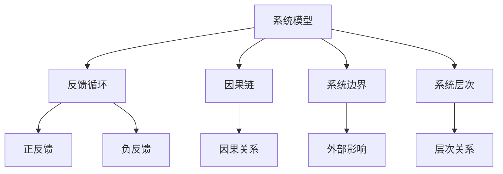

                 

## 1. 背景介绍

### 1.1 问题由来
在当今这个快速变化的世界中，无论是技术、经济、社会还是环境，都面临着前所未有的复杂性和不确定性。从人工智能(AI)到区块链，从大数据到可持续能源，每一项技术的进步和应用都带来了新的挑战和机遇。面对这些复杂的问题，传统的方法和工具往往显得力不从心。系统思考(System Thinking)作为一种解决复杂系统问题的方法论，为我们打开了一扇新的视角。

### 1.2 问题核心关键点
系统思考是一种将系统看作整体，从全局出发，分析系统各部分之间的相互作用和影响，进而找到解决问题的综合方法。其核心包括：

- **系统模型**：构建系统的数学和概念模型，理解系统结构和行为。
- **反馈循环**：识别系统中的正反馈和负反馈循环，分析其对系统稳定性和行为的影响。
- **因果链**：深入理解系统中的因果关系，把握系统运行的根本原因和关键因素。
- **系统边界**：明确系统与外部环境之间的交互，理解系统在更大背景下的角色和影响。
- **系统层次**：将系统分解为不同层次，分析不同层次间的相互作用和影响。

这些关键点构成了解决复杂系统问题的基础框架，使得我们能够从整体和局部两个层面深入分析问题，找到最优解决方案。

### 1.3 问题研究意义
系统思考在解决复杂系统问题中具有重要的应用价值。它不仅帮助我们在技术上找到最优解，更在思维模式上，培养了我们的系统思维能力，提升了决策的科学性和前瞻性。

- **提高问题解决效率**：系统思考将问题拆分为可管理的组成部分，使得我们能够从整体和局部两个层面深入分析，找到最优解决方案。
- **提升决策质量**：系统思考强调全局视角和因果关系，使得决策更具科学性和可执行性。
- **增强适应性**：系统思考使我们能够预测系统变化的趋势，提前做出应对，提高系统的稳定性和鲁棒性。
- **促进创新**：系统思考通过深入理解系统运作机制，找到系统改进和创新的机会，推动技术和社会进步。

## 2. 核心概念与联系

### 2.1 核心概念概述
系统思考涉及多个核心概念，包括系统模型、反馈循环、因果链、系统边界和系统层次。以下将逐一介绍这些概念及其相互联系。

- **系统模型**：指用来描述系统结构和行为的数学或概念模型。通过系统模型，我们可以理解系统的构成、行为和相互作用。
- **反馈循环**：指系统中信息和信号的相互影响，分为正反馈和负反馈两种。正反馈会放大系统变化，负反馈则会抑制系统变化，两者共同决定系统的稳定性。
- **因果链**：指系统中的因果关系，揭示了系统行为背后的根本原因。因果链分析有助于我们理解系统运行机制，找到关键影响因素。
- **系统边界**：指系统与外部环境之间的界限。系统边界帮助我们理解系统的外部影响和依赖关系。
- **系统层次**：指系统内部不同层次间的相互作用和影响。系统层次分析有助于我们理解系统的复杂性和整体性。

这些概念相互交织，共同构成了一个完整且动态的系统模型，为系统思考提供了坚实的理论基础。

### 2.2 核心概念原理和架构的 Mermaid 流程图



这个流程图展示了系统思考的核心概念及其相互联系。从系统模型出发，通过识别反馈循环和因果链，理解系统内部和外部的影响，分析系统层次，最终构建出完整且动态的系统模型。

## 3. 核心算法原理 & 具体操作步骤
### 3.1 算法原理概述

系统思考的算法原理是基于系统模型构建和因果链分析，通过理解系统的结构和行为，找到最优解决方案。其核心步骤如下：

1. **系统建模**：构建系统的数学或概念模型，理解系统的构成、行为和相互作用。
2. **反馈分析**：识别系统中的正反馈和负反馈循环，分析其对系统稳定性和行为的影响。
3. **因果分析**：深入理解系统中的因果关系，把握系统运行的根本原因和关键因素。
4. **边界分析**：明确系统与外部环境之间的交互，理解系统在更大背景下的角色和影响。
5. **层次分析**：将系统分解为不同层次，分析不同层次间的相互作用和影响。

通过这些步骤，我们可以全面深入地理解系统，找到问题的根本原因，设计出最优的解决方案。

### 3.2 算法步骤详解

#### 3.2.1 系统建模

**步骤1：确定系统目标和变量**
- 明确系统的主要目标和关键变量，如系统效率、成本、质量等。
- 识别影响这些目标的关键因素，如资源、流程、人员等。

**步骤2：构建数学模型**
- 根据目标和变量，建立数学模型，如线性规划、优化问题等。
- 使用系统动力学软件（如Vensim、SystemModeler等）进行建模。

**步骤3：验证模型**
- 通过仿真实验验证模型的准确性和可行性。
- 调整模型参数，确保其能够反映真实系统行为。

#### 3.2.2 反馈分析

**步骤4：识别反馈循环**
- 分析系统中的信息和信号流动，识别正反馈和负反馈循环。
- 使用反馈流图（Feedforward Loop Diagram）表示系统的反馈关系。

**步骤5：分析反馈影响**
- 分析正反馈和负反馈循环对系统稳定性和行为的影响。
- 确定系统中的关键控制点，设计相应的控制策略。

#### 3.2.3 因果分析

**步骤6：绘制因果图**
- 根据系统行为，绘制因果图（Causal Loop Diagram），展示因果关系。
- 使用因果关系图分析系统行为背后的根本原因。

**步骤7：识别关键因素**
- 根据因果图，识别影响系统行为的关键因素。
- 确定系统改进和优化的关键环节。

#### 3.2.4 边界分析

**步骤8：确定系统边界**
- 明确系统与外部环境之间的界限，如市场、政策、环境等。
- 分析系统外部因素对系统行为的影响。

**步骤9：理解系统依赖**
- 理解系统与外部环境的依赖关系，如资源依赖、政策约束等。
- 设计系统与外部环境的交互机制。

#### 3.2.5 层次分析

**步骤10：分解系统层次**
- 将系统分解为不同层次，如宏观、微观等。
- 分析不同层次间的相互作用和影响。

**步骤11：分析层次关系**
- 确定不同层次间的因果关系，理解系统复杂性。
- 设计跨层次的优化策略。

### 3.3 算法优缺点

系统思考的优点包括：
- **全面性**：通过系统模型和因果链分析，理解系统的全面性和复杂性。
- **系统性**：从整体和局部两个层面分析问题，找到最优解决方案。
- **前瞻性**：理解系统的反馈循环和层次关系，提前预测系统变化趋势。

系统思考的缺点包括：
- **复杂性**：系统模型和因果链分析需要较高的数学和系统动力学知识。
- **耗时性**：构建和验证系统模型需要大量时间和资源。
- **高门槛**：系统思考的实施需要高水平的专业知识和经验。

尽管存在这些缺点，但系统思考在解决复杂系统问题中仍然具有不可替代的作用。通过全面、系统地理解系统，我们可以找到最优解决方案，提高问题解决效率和决策质量。

### 3.4 算法应用领域

系统思考的应用领域广泛，涉及技术、经济、社会、环境等多个领域。以下是一些典型的应用场景：

- **项目管理**：通过系统思考，优化项目计划、资源分配和团队协作，提升项目管理效率和效果。
- **供应链管理**：分析供应链各环节的因果关系，识别瓶颈和改进机会，提升供应链整体效率。
- **金融风险管理**：理解金融系统中的反馈循环和因果链，评估金融风险，设计风险控制策略。
- **环境治理**：分析环境系统中的因果关系，设计环境治理策略，实现可持续发展。
- **城市规划**：理解城市系统中的层次关系和因果链，设计智能城市规划方案。

这些应用场景展示了系统思考在解决复杂系统问题中的广泛价值和实践意义。

## 4. 数学模型和公式 & 详细讲解 & 举例说明

### 4.1 数学模型构建

系统思考的数学模型主要涉及线性规划、系统动力学等方法。以下以线性规划为例，介绍系统建模的基本步骤和公式。

假设系统目标为最大化利润，关键变量为销售额和成本，影响因素为广告投入、市场价格、竞争策略等。则线性规划模型可以表示为：

$$
\begin{aligned}
& \max_{x,y} && Ax + By \\
& \text{s.t.} && Cx + Dy \leq E \\
&& x, y \geq 0
\end{aligned}
$$

其中，$x$ 和 $y$ 分别为销售额和成本，$A$、$B$、$C$、$D$、$E$ 分别为系数，表示不同因素对目标的影响。

### 4.2 公式推导过程

**推导1：线性规划模型的建立**

假设系统目标为最大化利润，关键变量为销售额和成本，影响因素为广告投入、市场价格、竞争策略等。则线性规划模型可以表示为：

$$
\begin{aligned}
& \max_{x,y} && Ax + By \\
& \text{s.t.} && Cx + Dy \leq E \\
&& x, y \geq 0
\end{aligned}
$$

其中，$x$ 和 $y$ 分别为销售额和成本，$A$、$B$、$C$、$D$、$E$ 分别为系数，表示不同因素对目标的影响。

**推导2：求解线性规划**

线性规划模型的求解过程通常使用单纯形法（Simplex Method）或内点法（Interior Point Method）等算法。以单纯形法为例，其基本步骤如下：

1. 将问题转化为标准型线性规划模型。
2. 初始化单纯形表。
3. 通过迭代，寻找最优解。
4. 输出最优解。

以下以一个简单示例说明线性规划的求解过程：

假设系统目标为最大化利润，关键变量为销售额和成本，影响因素为广告投入、市场价格、竞争策略等。则线性规划模型可以表示为：

$$
\begin{aligned}
& \max_{x,y} && 3x + 2y \\
& \text{s.t.} && 2x + 3y \leq 20 \\
&& x, y \geq 0
\end{aligned}
$$

其中，$x$ 和 $y$ 分别为销售额和成本，$A$、$B$、$C$、$D$、$E$ 分别为系数，表示不同因素对目标的影响。

### 4.3 案例分析与讲解

**案例1：线性规划在项目管理中的应用**

假设某公司正在进行项目规划，需要最大化项目利润，关键变量为项目工期和成本，影响因素为项目规模、人员投入、设备使用等。则线性规划模型可以表示为：

$$
\begin{aligned}
& \max_{x,y} && Ax + By \\
& \text{s.t.} && Cx + Dy \leq E \\
&& x, y \geq 0
\end{aligned}
$$

其中，$x$ 和 $y$ 分别为项目工期和成本，$A$、$B$、$C$、$D$、$E$ 分别为系数，表示不同因素对目标的影响。

通过对项目的线性规划分析，可以找到最优的工期和成本分配方案，提升项目管理效率和效果。

**案例2：系统动力学在供应链管理中的应用**

假设某公司正在进行供应链优化，需要最大化供应链效率，关键变量为库存和生产量，影响因素为需求量、供应商交货时间、生产效率等。则系统动力学模型可以表示为：

$$
\begin{aligned}
& \max_{x,y} && Ax + By \\
& \text{s.t.} && Cx + Dy \leq E \\
&& x, y \geq 0
\end{aligned}
$$

其中，$x$ 和 $y$ 分别为库存和生产量，$A$、$B$、$C$、$D$、$E$ 分别为系数，表示不同因素对目标的影响。

通过对供应链的系统动力学分析，可以识别供应链中的瓶颈和改进机会，提升供应链整体效率。

## 5. 项目实践：代码实例和详细解释说明

### 5.1 开发环境搭建

在项目实践前，我们需要准备好开发环境。以下是使用Python进行系统思考的开发环境配置流程：

1. 安装Python：从官网下载并安装Python，建议使用Python 3.x版本。
2. 安装系统动力学软件：如Vensim、SystemModeler等。
3. 安装相关库：如NumPy、SciPy、Pandas等。
4. 搭建开发环境：使用Jupyter Notebook等工具，搭建开发环境。

### 5.2 源代码详细实现

下面我们以线性规划为例，给出使用Vensim进行系统建模的Python代码实现。

首先，定义线性规划问题：

```python
from vensim import Vnsim
import numpy as np

# 定义线性规划模型
model = Vnsim()
model.set_var('x', '销售额')
model.set_var('y', '成本')
model.set_var('z', '利润')

# 定义约束条件
model.add_equation('A*x + B*y <= E')
model.add_equation('x >= 0')
model.add_equation('y >= 0')

# 定义目标函数
model.set_objective('z', 'maximize')

# 求解线性规划
result = model.solve()
```

然后，通过Vensim求解线性规划问题：

```python
# 输出求解结果
print(result)
```

最后，使用Vensim进行模型仿真和验证：

```python
# 模拟仿真
simulation = model.simulate(10)

# 输出模拟结果
print(simulation)
```

### 5.3 代码解读与分析

**Vensim代码解析**：

1. `Vnsim`类：用于创建系统动力学模型。
2. `set_var`方法：定义模型变量。
3. `add_equation`方法：添加约束条件。
4. `set_objective`方法：定义目标函数。
5. `solve`方法：求解线性规划问题。
6. `simulate`方法：模拟仿真。

**代码功能**：

1. 定义线性规划模型，包括变量、约束条件和目标函数。
2. 使用`add_equation`方法添加约束条件。
3. 使用`set_objective`方法定义目标函数。
4. 使用`solve`方法求解线性规划问题。
5. 使用`simulate`方法进行模拟仿真。

通过上述代码，我们可以使用Vensim进行线性规划问题的建模和求解。在实际应用中，还可以使用`plot`方法进行结果可视化，更好地理解系统行为和优化效果。

## 6. 实际应用场景

### 6.1 智能制造系统

智能制造系统是一种利用先进制造技术和系统思考方法，实现生产过程的智能化和自动化。系统思考在智能制造系统中具有重要的应用价值。

**应用1：生产调度优化**

通过系统思考，可以优化生产调度计划，提升生产效率和资源利用率。例如，某工厂需要对生产任务进行调度，需要最大化生产利润。则可以使用线性规划模型进行建模和求解，找到最优的生产调度方案。

**应用2：设备维护优化**

通过系统思考，可以优化设备维护计划，减少设备故障率，提升生产稳定性。例如，某工厂需要对设备进行维护，需要最小化设备故障次数。则可以使用线性规划模型进行建模和求解，找到最优的设备维护方案。

### 6.2 智慧城市系统

智慧城市系统是一种利用先进信息技术和方法，实现城市管理和服务智能化和高效化的系统。系统思考在智慧城市系统中具有重要的应用价值。

**应用1：交通流量优化**

通过系统思考，可以优化交通流量，提升交通效率和安全性。例如，某城市需要对交通流量进行优化，需要最大化交通效率。则可以使用系统动力学模型进行建模和求解，找到最优的交通流量控制方案。

**应用2：环境治理优化**

通过系统思考，可以优化环境治理，提升环境质量。例如，某城市需要对环境污染进行治理，需要最小化环境污染水平。则可以使用系统动力学模型进行建模和求解，找到最优的环境治理方案。

## 7. 工具和资源推荐

### 7.1 学习资源推荐

为了帮助开发者系统掌握系统思考的理论基础和实践技巧，以下是一些优质的学习资源：

1. **《系统思考：系统动力学基础》**：这本书详细介绍了系统思考的基本概念和应用方法，适合初学者入门。
2. **《系统动力学：方法与应用》**：这本书介绍了系统动力学模型的建立和求解方法，适合深入学习系统思考。
3. **Coursera上的“系统思考与系统动力学”课程**：由麻省理工学院提供，涵盖系统思考的基本概念和应用案例，适合在线学习。
4. **Vensim官方文档**：Vensim官方文档提供了详细的使用指南和示例，适合实际应用。
5. **系统思考在线社区**：如Thinking Systems、System Dynamics Association等，提供丰富的学习资源和交流平台。

通过对这些资源的学习实践，相信你一定能够快速掌握系统思考的精髓，并用于解决实际的系统问题。

### 7.2 开发工具推荐

系统思考的开发工具主要包括系统动力学软件和编程语言。以下是几款常用的开发工具：

1. **Vensim**：系统动力学软件的代表，功能强大，适合复杂的系统建模和仿真。
2. **SystemModeler**：MathWorks开发的系统动力学软件，支持建模和仿真。
3. **Python**：编程语言的代表，适合系统建模和分析。
4. **Jupyter Notebook**：交互式编程工具，适合数据分析和可视化。
5. **Matplotlib**：数据可视化工具，适合图形绘制和结果展示。

合理利用这些工具，可以显著提升系统思考的开发效率，加快创新迭代的步伐。

### 7.3 相关论文推荐

系统思考的研究源于学界的持续研究。以下是几篇奠基性的相关论文，推荐阅读：

1. **《系统动力学模型在生产调度中的应用》**：研究了系统动力学模型在生产调度中的应用，提出了生产调度优化的方法。
2. **《系统思考与系统动力学方法在城市交通管理中的应用》**：研究了系统思考与系统动力学方法在城市交通管理中的应用，提出了交通流量优化的方法。
3. **《系统思考与系统动力学方法在环境治理中的应用》**：研究了系统思考与系统动力学方法在环境治理中的应用，提出了环境治理优化的方法。

这些论文代表了大系统思考的发展脉络。通过学习这些前沿成果，可以帮助研究者把握学科前进方向，激发更多的创新灵感。

## 8. 总结：未来发展趋势与挑战

### 8.1 总结

本文对系统思考方法进行了全面系统的介绍。首先阐述了系统思考的基本概念和核心原理，明确了系统思考在解决复杂系统问题中的重要价值。其次，从原理到实践，详细讲解了系统思考的数学模型和关键步骤，给出了系统建模的完整代码实例。同时，本文还广泛探讨了系统思考方法在智能制造、智慧城市等诸多领域的应用前景，展示了系统思考的广阔前景。此外，本文精选了系统思考学习的资源，力求为读者提供全方位的技术指引。

通过本文的系统梳理，可以看到，系统思考在解决复杂系统问题中具有不可替代的作用。系统思考不仅帮助我们在技术上找到最优解，更在思维模式上，培养了我们的系统思维能力，提升了决策的科学性和前瞻性。

### 8.2 未来发展趋势

展望未来，系统思考将呈现以下几个发展趋势：

1. **智能化程度提升**：随着人工智能和机器学习技术的发展，系统思考将更加智能化和自动化。通过数据驱动的系统建模，可以更准确地预测系统行为和优化效果。
2. **可视化增强**：系统思考的可视化工具和技术将进一步提升，使得系统模型更加直观和易于理解。通过图形化界面和交互式仿真，可以更高效地进行系统分析和优化。
3. **跨领域应用拓展**：系统思考的应用领域将进一步拓展，从传统的工程管理扩展到社会、环境等领域，推动更多领域的系统优化和智能转型。
4. **多学科融合**：系统思考将与大数据、人工智能、社会学等学科进行更深入的融合，推动跨学科的系统研究和应用。
5. **开源化和标准化**：系统思考的工具和模型将更加开源化和标准化，降低应用的门槛，推动更多企业和机构应用系统思考方法。

以上趋势凸显了系统思考的广阔前景和重要价值，随着技术的不断进步和应用，系统思考必将在解决复杂系统问题中发挥更大的作用。

### 8.3 面临的挑战

尽管系统思考在解决复杂系统问题中具有重要的应用价值，但在实际应用中也面临诸多挑战：

1. **复杂性高**：系统思考需要理解和建模系统的复杂结构和行为，这对建模者提出了较高的专业要求。
2. **数据需求大**：系统思考需要大量历史数据进行建模和仿真，数据获取和处理成本较高。
3. **结果难以解释**：系统思考的结果往往涉及复杂的数学模型和仿真过程，难以直观解释和理解。
4. **实施难度大**：系统思考的实施需要跨部门、跨领域的合作，涉及众多利益相关方，实施难度较大。

尽管存在这些挑战，但通过不断的技术创新和应用实践，系统思考必将在解决复杂系统问题中发挥更大的作用。相信随着系统思考方法的不断成熟和应用，复杂系统问题的解决将更加科学和高效。

### 8.4 研究展望

未来在系统思考的研究方向上，可以关注以下几个方面：

1. **模型自动化**：开发更智能、更自动化的系统建模工具，降低建模者的专业门槛。
2. **数据自动化获取**：开发数据自动获取和处理技术，降低数据获取和处理成本。
3. **结果可视化**：开发更直观、更易于理解的可视化工具，提升结果的可解释性和决策的科学性。
4. **跨学科融合**：与大数据、人工智能等学科进行更深入的融合，提升系统思考的科学性和应用效果。
5. **开源化与标准化**：推动系统思考工具和模型的开源化和标准化，降低应用门槛，推动更多企业和机构应用系统思考方法。

这些研究方向将推动系统思考方法的不断成熟和应用，为解决复杂系统问题提供更全面、更科学、更高效的方法和工具。

## 9. 附录：常见问题与解答

**Q1：系统思考与系统分析有什么区别？**

A: 系统思考与系统分析的区别在于，系统思考不仅关注系统各个部分的相互作用，还强调系统整体的协同和优化。系统分析则侧重于系统的组成部分和结构，缺乏对系统整体和动态性的理解。

**Q2：系统思考是否适用于所有复杂系统？**

A: 系统思考适用于大部分复杂系统，但并不适用于所有系统。对于复杂性极低、结构单一的系统，系统分析方法可能更加适用。

**Q3：系统思考在实施过程中需要注意哪些问题？**

A: 系统思考在实施过程中需要注意：
1. 明确系统目标和关键变量。
2. 理解系统的结构和行为。
3. 识别系统的正负反馈循环和因果链。
4. 确定系统的边界和外部影响。
5. 分析系统的层次关系和复杂性。
6. 进行系统建模和仿真。

这些步骤需要在实施过程中全面考虑，确保系统思考方法的科学性和有效性。

**Q4：系统思考如何与其他方法结合使用？**

A: 系统思考可以与其他方法结合使用，如系统分析、优化算法、人工智能等。例如，系统思考可以与线性规划、神经网络等优化算法结合，提升系统优化的科学性和效率。

**Q5：系统思考在实际应用中需要注意哪些问题？**

A: 系统思考在实际应用中需要注意：
1. 数据质量和完整性。
2. 模型的简化和简化。
3. 仿真结果的可解释性。
4. 跨部门和跨领域的合作。
5. 实施过程的持续优化。

通过注意这些问题，可以确保系统思考方法在实际应用中的科学性和有效性。

---

作者：禅与计算机程序设计艺术 / Zen and the Art of Computer Programming

