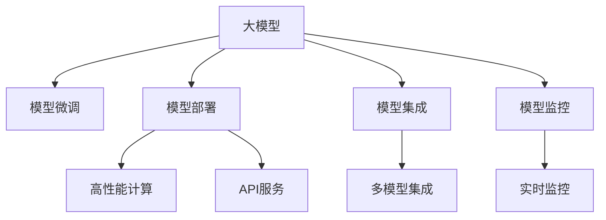

                 

# 用起来才是关键：大模型的应用

> 关键词：大模型应用,深度学习,人工智能,计算机视觉,自然语言处理,强化学习,模型部署,API,实际应用,高性能计算

## 1. 背景介绍

### 1.1 问题由来

近年来，深度学习技术取得了飞速发展，大模型（如BERT、GPT-3等）在自然语言处理（NLP）、计算机视觉（CV）、强化学习（RL）等多个领域展现了强大的表现能力。然而，尽管模型的性能令人瞩目，如何实际应用这些模型，使其真正落地到生产环境，却成为了一个巨大的挑战。

大模型的应用不仅涉及到模型的微调和优化，还涉及到模型的部署、集成、监控等多个环节。这些环节的有效衔接，对于模型应用的成败至关重要。因此，本文将重点讨论如何在大模型的应用中实现高效、稳定、可靠的落地，以期为开发者和工程师提供全面的技术指引。

### 1.2 问题核心关键点

本文聚焦于大模型的应用，具体关注以下几个核心问题：

1. **模型微调**：如何在大规模数据上预训练模型，然后通过下游任务的少量数据进行微调，以提高模型在特定任务上的性能。
2. **模型部署**：如何将训练好的模型封装成标准API，供不同平台调用，以实现高性能、低延迟的应用。
3. **模型集成**：如何将多个模型集成在一起，形成一个高效、鲁棒的系统，以应对复杂的实际场景。
4. **模型监控**：如何实时监控模型的性能和状态，及时发现和解决潜在问题。

这些问题的解决，是实现大模型实际应用的基石。通过深入探讨这些核心问题，我们希望能够为开发者和工程师提供全面的技术支持，推动人工智能技术的落地和普及。

## 2. 核心概念与联系

### 2.1 核心概念概述

为更好地理解大模型的应用，本节将介绍几个密切相关的核心概念：

- **大模型**：以BERT、GPT-3为代表的大规模预训练模型，通过在大规模数据上预训练，学习到丰富的知识表示，具备强大的处理能力。
- **模型微调**：在大规模预训练的基础上，使用下游任务的少量数据进行微调，以提高模型在特定任务上的性能。
- **模型部署**：将训练好的模型封装成标准API，供不同平台调用，以实现高性能、低延迟的应用。
- **模型集成**：将多个模型集成在一起，形成一个高效、鲁棒的系统，以应对复杂的实际场景。
- **模型监控**：实时监控模型的性能和状态，及时发现和解决潜在问题。

这些核心概念之间的逻辑关系可以通过以下Mermaid流程图来展示：



这个流程图展示了大模型应用的各个环节及其相互关系：

1. 大模型通过预训练学习到丰富的知识表示。
2. 通过模型微调，提升模型在特定任务上的性能。
3. 模型部署将训练好的模型封装成标准API，供不同平台调用。
4. 模型集成将多个模型集成在一起，形成一个高效、鲁棒的系统。
5. 模型监控实时监控模型的性能和状态，及时发现和解决潜在问题。

这些概念共同构成了大模型应用的完整框架，使得模型能够在大规模数据上预训练，然后通过微调和部署，实际应用到各种场景中，并不断优化和维护，实现高性能、可靠的应用。

## 3. 核心算法原理 & 具体操作步骤

### 3.1 算法原理概述

大模型的应用是一个综合性的过程，涉及到大规模数据预训练、模型微调、模型部署等多个环节。这些环节的实现，通常依赖于高效的算法和具体的操作步骤。以下将详细介绍这些关键步骤的算法原理和具体操作步骤。

### 3.2 算法步骤详解

#### 3.2.1 模型预训练

大模型的预训练通常依赖于大规模无标签数据。以BERT为例，其预训练过程主要包括以下步骤：

1. **构建模型**：使用Transformer架构构建预训练模型，并定义模型损失函数和优化器。
2. **数据预处理**：对大规模无标签数据进行分词、编码等预处理，生成模型输入。
3. **训练模型**：在预训练数据上对模型进行大规模训练，最小化预训练损失函数。
4. **保存模型**：保存预训练好的模型，供后续微调和部署使用。

#### 3.2.2 模型微调

模型微调的过程，通常依赖于下游任务的少量标注数据。以BERT为例，其微调过程主要包括以下步骤：

1. **构建任务适配层**：根据下游任务类型，在预训练模型的顶层设计合适的输出层和损失函数。
2. **加载预训练模型**：加载预训练好的模型，作为微调的初始化参数。
3. **训练模型**：在少量标注数据上对模型进行微调，最小化任务损失函数。
4. **保存模型**：保存微调好的模型，供后续部署使用。

#### 3.2.3 模型部署

模型部署的过程，通常依赖于高性能计算资源和标准API。以BERT为例，其部署过程主要包括以下步骤：

1. **构建API接口**：根据实际应用需求，设计API接口，供外部调用。
2. **加载模型**：在部署平台上加载预训练或微调好的模型。
3. **计算加速**：使用GPU、TPU等高性能计算资源，加速模型推理。
4. **发布服务**：将模型封装成标准API，发布到生产环境。

#### 3.2.4 模型集成

模型集成通常依赖于多个模型的协同工作，以应对复杂的实际场景。以BERT为例，其集成过程主要包括以下步骤：

1. **选择模型**：根据任务需求，选择合适的预训练或微调模型。
2. **设计接口**：设计接口，使不同模型能够协同工作。
3. **集成模型**：将多个模型集成在一起，形成一个高效的系统。
4. **优化性能**：通过模型融合、集成优化等手段，提升系统的性能。

#### 3.2.5 模型监控

模型监控的过程，通常依赖于实时监控工具和告警系统。以BERT为例，其监控过程主要包括以下步骤：

1. **定义指标**：根据模型应用需求，定义监控指标。
2. **安装监控工具**：安装实时监控工具，如TensorBoard、Prometheus等。
3. **配置告警**：配置告警系统，及时发现和解决潜在问题。
4. **持续优化**：根据监控结果，持续优化模型和系统性能。

### 3.3 算法优缺点

大模型的应用在带来高效性能的同时，也存在一些局限性和挑战：

#### 3.3.1 优点

1. **高性能**：大模型在图像识别、自然语言处理等任务上展现了强大的性能，能够快速准确地处理复杂数据。
2. **泛化能力强**：通过预训练和微调，模型能够在多种场景下表现出色。
3. **可扩展性强**：通过模型集成，能够构建高效、鲁棒的系统，应对复杂的实际需求。
4. **部署灵活**：通过标准API和计算加速，模型能够在多种平台和设备上灵活部署。

#### 3.3.2 缺点

1. **资源消耗大**：大规模模型的训练和推理需要高性能计算资源，成本较高。
2. **性能瓶颈**：大规模模型的推理速度较慢，可能影响实时应用。
3. **精度受限**：由于模型结构和训练数据的限制，模型精度可能存在一定瓶颈。
4. **数据依赖强**：模型的性能依赖于预训练和微调数据的质量，数据获取难度较大。

### 3.4 算法应用领域

大模型的应用领域非常广泛，涵盖了多个前沿技术领域：

- **计算机视觉**：通过大模型，如图像分类、物体检测、图像生成等任务。
- **自然语言处理**：通过大模型，如语言翻译、文本摘要、问答系统等任务。
- **强化学习**：通过大模型，如游戏智能、机器人控制、自动化交易等任务。
- **医疗健康**：通过大模型，如医学影像分析、疾病预测、个性化推荐等任务。
- **金融风控**：通过大模型，如信用评估、风险预测、欺诈检测等任务。

这些应用领域的大模型，不仅展示了其在各领域中的强大能力，也展示了其在实际应用中的广泛前景。

## 4. 数学模型和公式 & 详细讲解 & 举例说明

### 4.1 数学模型构建

本节将使用数学语言对大模型的应用过程进行更加严格的刻画。

记预训练模型为 $M_{\theta}:\mathcal{X} \rightarrow \mathcal{Y}$，其中 $\mathcal{X}$ 为输入空间，$\mathcal{Y}$ 为输出空间，$\theta$ 为模型参数。假设下游任务 $T$ 的标注数据集为 $D=\{(x_i,y_i)\}_{i=1}^N, x_i \in \mathcal{X}, y_i \in \mathcal{Y}$。

定义模型 $M_{\theta}$ 在数据样本 $(x,y)$ 上的损失函数为 $\ell(M_{\theta}(x),y)$，则在数据集 $D$ 上的经验风险为：

$$
\mathcal{L}(\theta) = \frac{1}{N} \sum_{i=1}^N \ell(M_{\theta}(x_i),y_i)
$$

微调的优化目标是最小化经验风险，即找到最优参数：

$$
\theta^* = \mathop{\arg\min}_{\theta} \mathcal{L}(\theta)
$$

在实践中，我们通常使用基于梯度的优化算法（如SGD、Adam等）来近似求解上述最优化问题。设 $\eta$ 为学习率，$\lambda$ 为正则化系数，则参数的更新公式为：

$$
\theta \leftarrow \theta - \eta \nabla_{\theta}\mathcal{L}(\theta) - \eta\lambda\theta
$$

其中 $\nabla_{\theta}\mathcal{L}(\theta)$ 为损失函数对参数 $\theta$ 的梯度，可通过反向传播算法高效计算。

### 4.2 公式推导过程

以下我们以图像分类任务为例，推导交叉熵损失函数及其梯度的计算公式。

假设模型 $M_{\theta}$ 在输入 $x$ 上的输出为 $\hat{y}=M_{\theta}(x) \in [0,1]$，表示样本属于某一类别的概率。真实标签 $y \in \{0,1\}$。则二分类交叉熵损失函数定义为：

$$
\ell(M_{\theta}(x),y) = -[y\log \hat{y} + (1-y)\log (1-\hat{y})]
$$

将其代入经验风险公式，得：

$$
\mathcal{L}(\theta) = -\frac{1}{N}\sum_{i=1}^N [y_i\log M_{\theta}(x_i)+(1-y_i)\log(1-M_{\theta}(x_i))]
$$

根据链式法则，损失函数对参数 $\theta_k$ 的梯度为：

$$
\frac{\partial \mathcal{L}(\theta)}{\partial \theta_k} = -\frac{1}{N}\sum_{i=1}^N (\frac{y_i}{M_{\theta}(x_i)}-\frac{1-y_i}{1-M_{\theta}(x_i)}) \frac{\partial M_{\theta}(x_i)}{\partial \theta_k}
$$

其中 $\frac{\partial M_{\theta}(x_i)}{\partial \theta_k}$ 可进一步递归展开，利用自动微分技术完成计算。

在得到损失函数的梯度后，即可带入参数更新公式，完成模型的迭代优化。重复上述过程直至收敛，最终得到适应下游任务的最优模型参数 $\theta^*$。

### 4.3 案例分析与讲解

以图像分类任务为例，演示模型的构建、训练、推理和评估过程。

1. **模型构建**：使用预训练的ResNet50模型，并根据图像分类任务添加softmax输出层。
2. **训练模型**：在ImageNet数据集上使用交叉熵损失函数进行微调，学习率设为0.001，迭代10个epoch。
3. **推理模型**：在测试集上使用softmax函数计算每个类别得分，选择得分最高的类别作为预测结果。
4. **评估模型**：使用准确率和混淆矩阵等指标评估模型性能。

在实践中，模型的构建、训练、推理和评估过程通常使用深度学习框架，如TensorFlow、PyTorch等实现。这些框架提供了高效的数据处理和计算能力，使得模型开发和应用变得更加简单便捷。

## 5. 项目实践：代码实例和详细解释说明

### 5.1 开发环境搭建

在进行大模型的应用实践前，我们需要准备好开发环境。以下是使用Python进行TensorFlow开发的环境配置流程：

1. 安装Anaconda：从官网下载并安装Anaconda，用于创建独立的Python环境。

2. 创建并激活虚拟环境：
```bash
conda create -n tf-env python=3.8 
conda activate tf-env
```

3. 安装TensorFlow：根据CUDA版本，从官网获取对应的安装命令。例如：
```bash
pip install tensorflow -U
```

4. 安装各类工具包：
```bash
pip install numpy pandas scikit-learn matplotlib tqdm jupyter notebook ipython
```

完成上述步骤后，即可在`tf-env`环境中开始大模型的应用实践。

### 5.2 源代码详细实现

下面我们以图像分类任务为例，给出使用TensorFlow对ResNet50模型进行微调的Python代码实现。

首先，定义图像分类任务的训练集和测试集：

```python
import tensorflow as tf
from tensorflow.keras.datasets import cifar10
from tensorflow.keras.utils import to_categorical

(train_images, train_labels), (test_images, test_labels) = cifar10.load_data()

train_images = train_images / 255.0
test_images = test_images / 255.0

train_labels = to_categorical(train_labels)
test_labels = to_categorical(test_labels)
```

然后，定义ResNet50模型：

```python
from tensorflow.keras.applications.resnet50 import ResNet50

model = ResNet50(include_top=True, weights='imagenet')

for layer in model.layers:
    layer.trainable = False

model.add(tf.keras.layers.Dense(10, activation='softmax'))
```

接着，定义优化器和损失函数：

```python
from tensorflow.keras.optimizers import Adam

optimizer = Adam(lr=0.001)
loss = tf.keras.losses.CategoricalCrossentropy()

model.compile(optimizer=optimizer, loss=loss, metrics=['accuracy'])
```

最后，启动模型训练和测试：

```python
batch_size = 32
epochs = 10

model.fit(train_images, train_labels, batch_size=batch_size, epochs=epochs, validation_data=(test_images, test_labels))

test_loss, test_acc = model.evaluate(test_images, test_labels)
print('Test accuracy:', test_acc)
```

以上就是使用TensorFlow对ResNet50进行图像分类任务微调的完整代码实现。可以看到，TensorFlow的Keras API使得模型构建和训练变得非常简洁高效。

### 5.3 代码解读与分析

让我们再详细解读一下关键代码的实现细节：

**cifar10数据集加载**：
- 使用`cifar10.load_data()`函数加载CIFAR-10数据集，并将其划分为训练集和测试集。
- 对图像数据进行归一化处理，确保模型输入数据的一致性。
- 对标签数据进行one-hot编码，使得模型能够直接处理分类任务。

**ResNet50模型定义**：
- 使用`tf.keras.applications.resnet50.ResNet50()`函数加载预训练的ResNet50模型，并使用`include_top=True`参数保留模型的顶层输出层。
- 通过`layer.trainable = False`将模型的所有层冻结，保留预训练权重不变。
- 在顶层添加Dense层，输出10个类别的概率，作为模型的最终输出。

**优化器和损失函数定义**：
- 使用`tf.keras.optimizers.Adam()`函数定义Adam优化器，学习率为0.001。
- 使用`tf.keras.losses.CategoricalCrossentropy()`定义分类交叉熵损失函数，用于计算模型输出与真实标签之间的差异。

**模型训练和测试**：
- 使用`model.fit()`函数在训练集上训练模型，设置批大小为32，迭代10个epoch。
- 使用`model.evaluate()`函数在测试集上评估模型性能，并打印测试准确率。

可以看到，TensorFlow的Keras API使得大模型的应用变得更加简单便捷。通过简洁的代码实现，可以快速构建和训练模型，进行实际应用的落地。

## 6. 实际应用场景

### 6.1 智能安防

在大规模图像数据上预训练的图像分类模型，可以广泛应用于智能安防领域，如图像识别、异常检测等任务。通过监控摄像头捕捉到的实时视频，图像分类模型能够自动识别场景中的各种物体和异常行为，及时报警或通知管理人员，提高安防系统的智能化水平。

### 6.2 智慧医疗

大模型在医学影像分析任务上表现出色，能够快速准确地对医学图像进行分类、分割和标注。通过结合医生的诊断结果，大模型可以辅助医生进行疾病诊断和治疗方案制定，提升医疗服务的智能化和精准化。

### 6.3 电子商务

大模型在商品推荐任务上展现了强大的性能，能够根据用户的历史行为数据和当前需求，推荐最适合的商品。通过结合用户画像、商品属性等多维信息，大模型可以构建高效、个性化的推荐系统，提升用户体验和转化率。

### 6.4 金融风控

大模型在信用评估、风险预测等任务上表现出色，能够结合用户的个人信息、行为数据和市场数据，评估用户的信用风险和潜在风险。通过及时发现和防范潜在风险，大模型可以帮助金融机构降低不良贷款率，提高资金使用效率。

## 7. 工具和资源推荐

### 7.1 学习资源推荐

为了帮助开发者系统掌握大模型的应用技术，这里推荐一些优质的学习资源：

1. TensorFlow官方文档：提供详细的大模型构建、训练和部署指南，包括预训练模型、模型微调、模型集成等各个环节。
2. PyTorch官方文档：提供简洁高效的深度学习框架，支持大模型的构建、训练和推理。
3. Keras官方文档：提供简单易用的高层次API，适合快速上手大模型的应用。
4. Coursera深度学习课程：由深度学习专家Andrew Ng主讲，涵盖深度学习的基本原理和经典应用。
5. arXiv上的大模型论文：提供最新的大模型研究成果和应用案例，拓展视野和思路。

通过对这些资源的学习实践，相信你一定能够快速掌握大模型的应用技术，并将其应用于实际场景中。

### 7.2 开发工具推荐

高效的开发离不开优秀的工具支持。以下是几款用于大模型应用开发的常用工具：

1. TensorFlow：由Google主导开发的深度学习框架，支持大规模模型训练和推理。
2. PyTorch：由Facebook主导的深度学习框架，灵活高效，适合科研和工程应用。
3. Keras：提供高层次API，简化深度学习模型的开发过程，适合初学者和快速原型开发。
4. TensorBoard：提供实时监控和可视化工具，帮助调试和优化模型。
5. Prometheus：提供实时监控和告警系统，保障系统稳定运行。
6. Grafana：提供图表展示和分析工具，直观呈现系统指标。

合理利用这些工具，可以显著提升大模型应用开发的效率，加快创新迭代的步伐。

### 7.3 相关论文推荐

大模型应用的研究源于学界的持续研究。以下是几篇奠基性的相关论文，推荐阅读：

1. "ImageNet Classification with Deep Convolutional Neural Networks"：提出使用深度卷积神经网络进行图像分类的经典方法。
2. "Rethinking the Inception Architecture for Computer Vision"：提出Inception模块，提升了深度卷积神经网络的性能。
3. "Fine-Grained Image Recognition with Local Statistics"：提出使用局部统计信息提升图像分类的性能。
4. "Faster R-CNN: Towards Real-Time Object Detection with Region Proposal Networks"：提出Faster R-CNN算法，提升了目标检测的速度和准确率。
5. "BERT: Pre-training of Deep Bidirectional Transformers for Language Understanding"：提出BERT模型，利用掩码语言模型进行预训练，提升语言理解的性能。

这些论文代表了大模型应用的发展脉络，提供了宝贵的理论和实践经验。

## 8. 总结：未来发展趋势与挑战

### 8.1 研究成果总结

本文对大模型的应用进行了全面系统的介绍。首先阐述了大模型的预训练、微调、部署、集成、监控等各个环节，明确了模型应用的完整流程。其次，从原理到实践，详细讲解了每个环节的算法原理和操作步骤，给出了大模型应用的完整代码实现。最后，广泛探讨了模型在多个实际场景中的应用前景，展示了其强大的应用潜力。

通过本文的系统梳理，可以看到，大模型的应用不仅能够提升模型的性能，还能实现高效、稳定、可靠的系统落地。大模型在图像分类、自然语言处理、医疗健康等众多领域展现出了强大的能力，推动了人工智能技术的产业化进程。未来，伴随大模型的不断发展和优化，其应用将更加广泛和深入，为各行各业带来深刻的变革。

### 8.2 未来发展趋势

展望未来，大模型的应用将呈现以下几个发展趋势：

1. **高性能计算**：随着计算资源的不断提升，大模型的应用将更加高效。通过使用高性能计算资源和优化算法，大模型将在图像分类、自然语言处理等领域实现更快的推理速度和更高的性能。
2. **模型集成**：通过多模型集成，能够构建更加高效、鲁棒的系统，应对复杂的实际需求。多模型融合、知识蒸馏等技术将使得系统性能更加出色。
3. **数据自适应**：通过自适应学习，大模型能够动态地适应不同场景下的数据分布，提高泛化性能。自适应学习技术将使得模型更加灵活和通用。
4. **端到端优化**：通过端到端优化，大模型能够在模型构建、训练、部署、监控等各个环节实现无缝衔接，提升整体应用效果。
5. **个性化应用**：通过结合用户个性化需求，大模型能够提供更加个性化的应用服务，提升用户体验和满意度。

以上趋势展示了大模型应用的广阔前景。这些方向的探索发展，将进一步推动人工智能技术的落地和普及，带来更深远的社会和经济效益。

### 8.3 面临的挑战

尽管大模型的应用前景广阔，但在迈向更加智能化、普适化应用的过程中，它仍面临着诸多挑战：

1. **数据瓶颈**：模型的性能依赖于大量的标注数据和高质量数据，数据获取难度较大。如何获取和利用大规模标注数据，是大模型应用的重要挑战。
2. **计算资源消耗大**：大规模模型的训练和推理需要高性能计算资源，成本较高。如何高效利用计算资源，优化模型性能，是应用中的重要问题。
3. **模型鲁棒性不足**：当前大模型在对抗样本攻击、数据分布变化等场景下表现不佳。如何提升模型的鲁棒性，保障系统稳定性，是应用中的重要课题。
4. **模型可解释性不足**：大模型通常被称为"黑盒"系统，难以解释其内部工作机制和决策逻辑。如何提升模型的可解释性，增强用户信任，是应用中的重要挑战。
5. **伦理和安全问题**：大模型可能会学习到有偏见、有害的信息，通过微调传递到下游任务，产生误导性、歧视性的输出。如何避免伦理和安全问题，确保系统公平和安全，是应用中的重要课题。

### 8.4 研究展望

面对大模型应用中的诸多挑战，未来的研究需要在以下几个方面寻求新的突破：

1. **自监督学习**：通过自监督学习，在大规模无标签数据上进行预训练，减少对标注数据的依赖。自监督学习技术将使得模型更加灵活和通用。
2. **计算资源优化**：通过优化算法和模型结构，减少计算资源的消耗。计算资源优化技术将使得大模型的应用更加高效。
3. **多模型融合**：通过多模型融合，提升模型的鲁棒性和泛化性能。多模型融合技术将使得系统更加灵活和鲁棒。
4. **模型可解释性提升**：通过解释性技术和方法，提升模型的可解释性。模型可解释性提升技术将使得系统更加透明和可信。
5. **伦理和安全保障**：通过伦理和安全保障机制，确保系统的公平和安全。伦理和安全保障机制将使得系统更加可靠和可信。

这些研究方向将推动大模型应用技术的发展，为构建高效、稳定、可靠的人工智能系统提供坚实的保障。面向未来，大模型应用技术必将带来更广泛的创新和变革，为人工智能技术的普及和发展注入新的活力。

## 9. 附录：常见问题与解答

**Q1：如何构建高性能的模型应用系统？**

A: 构建高性能的模型应用系统，需要从以下几个方面进行优化：
1. 选择合适的深度学习框架，如TensorFlow、PyTorch等。
2. 优化模型结构和算法，如使用剪枝、量化、蒸馏等技术。
3. 使用高性能计算资源，如GPU、TPU等。
4. 设计高效的模型集成和部署方案，如多模型融合、微服务架构等。

**Q2：如何处理大规模数据集的预训练和微调？**

A: 处理大规模数据集的预训练和微调，需要从以下几个方面进行优化：
1. 使用分布式训练技术，如Horovod、Ray等，提升训练速度。
2. 使用数据并行技术，如数据并行、模型并行等，提升模型性能。
3. 使用混合精度训练技术，如FP16、Mixed Precision等，优化计算资源。
4. 使用自适应学习技术，如AdaGrad、Adam等，提高模型鲁棒性。

**Q3：如何评估模型的性能和稳定性？**

A: 评估模型的性能和稳定性，需要从以下几个方面进行优化：
1. 定义合理的评估指标，如准确率、召回率、F1-score等。
2. 设计多种评估场景，如交叉验证、A/B测试等，全面评估模型性能。
3. 监控模型状态和指标，如损失函数、精度、内存占用等，及时发现和解决潜在问题。
4. 结合人工干预和数据反馈，持续优化模型和系统性能。

**Q4：如何在实际应用中实现大模型的高效部署？**

A: 实现大模型的高效部署，需要从以下几个方面进行优化：
1. 设计高效的API接口，如RESTful API、gRPC等，方便外部调用。
2. 使用高性能计算资源，如GPU、TPU等，提升模型推理速度。
3. 使用缓存技术，如Redis、Memcached等，提升模型响应速度。
4. 设计多层次的模型集成架构，如微服务架构、微内核架构等，提升系统灵活性和扩展性。

**Q5：如何在实际应用中提升大模型的鲁棒性？**

A: 提升大模型的鲁棒性，需要从以下几个方面进行优化：
1. 设计更复杂的损失函数，如对抗损失、鲁棒损失等，提升模型鲁棒性。
2. 使用对抗样本生成技术，如FGSM、PGD等，提升模型对对抗样本的鲁棒性。
3. 引入噪声和扰动，如数据增强、模型蒸馏等，提升模型鲁棒性。
4. 结合多种模型和算法，如集成学习、多模型融合等，提升模型鲁棒性。

通过上述问题的探讨和解答，希望能够为开发者和工程师提供全面的技术指引，推动大模型应用技术的不断发展和优化。

---

作者：禅与计算机程序设计艺术 / Zen and the Art of Computer Programming

