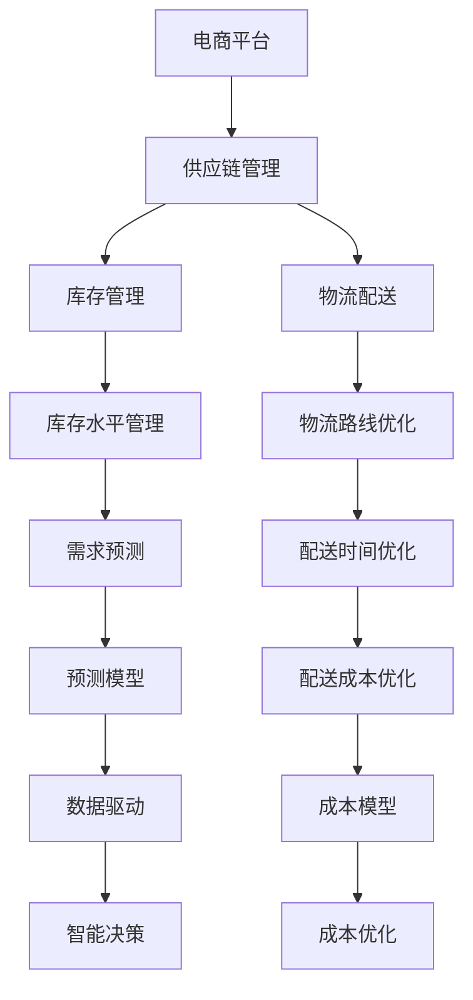

                 

# 电商平台供给能力提升：供应链管理的优化策略

> 关键词：电商平台,供应链管理,优化策略,库存管理,物流配送,大数据分析,人工智能

## 1. 背景介绍

### 1.1 问题由来

随着电子商务的快速发展，电商平台已成为消费者购物的重要渠道。然而，电商平台的供给能力，即库存和物流的效率，直接影响到消费者的购物体验和平台的用户满意度。在竞争激烈的电商市场中，优化供应链管理，提升供给能力，成为电商平台的核心竞争力。

### 1.2 问题核心关键点

- **库存管理**：如何通过合理预测需求，避免库存积压或缺货，确保库存水平在合理范围内。
- **物流配送**：如何高效安排物流路线，优化配送时间和成本，提升配送速度和准确性。
- **数据驱动**：如何利用大数据和人工智能技术，提升供应链管理的决策质量，实现动态优化。
- **系统集成**：如何将库存管理、物流配送、客户需求等信息系统进行有效集成，实现资源的最优分配。

### 1.3 问题研究意义

优化电商平台供给能力，提升供应链管理效率，具有重要的现实意义和学术价值：

- **提升用户体验**：减少缺货和配送延迟，提升购物体验，增加客户满意度和忠诚度。
- **降低运营成本**：合理库存管理，减少库存损耗和过剩，优化物流路线，降低配送成本。
- **优化决策支持**：通过数据分析和机器学习模型，提供更精准的库存和物流决策支持。
- **增强市场竞争力**：高效供应链管理，使电商平台能够在价格、速度和服务等方面占据优势，提升市场份额。

## 2. 核心概念与联系

### 2.1 核心概念概述

为更好地理解电商平台供应链管理的优化策略，本节将介绍几个关键概念及其相互联系：

- **电商平台**：通过互联网平台，实现商品展示、交易和物流配送的一站式服务。
- **供应链管理**：涉及产品从原材料采购、生产、仓储到物流配送的全过程管理，确保商品在正确的时间到达正确的地点。
- **库存管理**：指对库存水平、库存分布和库存周转率的有效管理，确保库存量满足市场需求。
- **物流配送**：指将商品从仓储中心运送到消费者手中的全过程，包括包装、运输、配送等环节。
- **大数据分析**：利用数据挖掘、机器学习等技术，从海量数据中提取有用信息，支持决策制定。
- **人工智能**：通过深度学习、强化学习等算法，自动化处理复杂任务，提升供应链管理的效率和准确性。

这些核心概念之间的逻辑关系可以通过以下Mermaid流程图来展示：



这个流程图展示了电商平台的供应链管理过程及其关键环节：

1. 电商平台的运营涉及供应链管理的全过程。
2. 库存管理和物流配送是供应链管理中的两个重要环节。
3. 库存水平管理和大数据分析是库存管理的核心任务。
4. 物流路线优化和配送时间优化是物流配送的关键环节。
5. 需求预测和智能决策是数据驱动下的重要应用。
6. 成本优化贯穿于库存管理和物流配送的全过程。

这些概念共同构成了电商平台供应链管理的整体框架，为后续的优化策略提供了理论基础。

## 3. 核心算法原理 & 具体操作步骤
### 3.1 算法原理概述

电商平台供应链管理的优化，主要基于以下算法原理：

- **需求预测算法**：利用历史销售数据和市场趋势，预测未来需求，以优化库存水平。
- **库存管理算法**：通过动态调整库存量，平衡库存成本和缺货风险。
- **物流优化算法**：通过优化配送路线和时间，降低配送成本，提高配送效率。
- **数据驱动算法**：利用大数据分析和机器学习技术，提供基于数据的决策支持。

### 3.2 算法步骤详解

**步骤1: 数据收集与预处理**

- **数据来源**：收集电商平台的历史订单数据、市场趋势、季节性因素、竞争对手数据等。
- **数据清洗**：对缺失值、异常值进行清洗，确保数据的准确性和一致性。
- **特征工程**：提取有意义的特征，如商品类别、价格、促销活动、地区等。

**步骤2: 需求预测**

- **模型选择**：选择合适的预测模型，如ARIMA、LSTM等。
- **模型训练**：使用历史数据训练模型，并进行交叉验证。
- **模型评估**：使用测试数据评估模型预测的准确性和可靠性。

**步骤3: 库存管理**

- **库存计算**：根据预测需求，计算最优库存水平。
- **库存调整**：根据库存计算结果，调整现有库存量。
- **库存监控**：实时监控库存水平，及时调整。

**步骤4: 物流优化**

- **配送路线规划**：使用算法如Dijkstra、遗传算法等，规划最优配送路线。
- **配送时间优化**：利用调度算法如APCX等，优化配送时间表。
- **配送成本控制**：通过成本模型，控制配送成本，提升经济效益。

**步骤5: 智能决策**

- **数据集成**：将库存、物流、客户需求等信息系统进行集成。
- **决策支持**：基于数据分析和机器学习模型，提供动态优化建议。
- **反馈优化**：根据优化结果，调整预测模型和库存管理策略。

### 3.3 算法优缺点

电商平台供应链管理的优化算法，具有以下优点：

- **高效性**：通过算法优化，减少库存和配送成本，提高运营效率。
- **灵活性**：能够应对市场变化和客户需求的变化，灵活调整策略。
- **预测准确性**：利用大数据和机器学习，提升需求预测的准确性。
- **资源优化**：通过智能决策，实现资源的有效配置和利用。

同时，也存在一些局限性：

- **数据质量要求高**：算法依赖高质量的数据，数据质量不佳会影响结果。
- **模型复杂度**：复杂的算法可能带来计算和存储负担，需要高性能计算资源。
- **算法适用性**：不同的算法适用于不同的场景和问题，需要根据具体情况选择合适的算法。
- **动态调整难度大**：在快速变化的市场环境中，算法需要及时调整，以适应新的情况。

### 3.4 算法应用领域

电商平台的供应链管理优化算法，广泛应用于以下领域：

- **库存管理**：超市、零售商、电商平台等零售行业的库存优化。
- **物流配送**：快递公司、货运公司、物流中心等物流行业的配送优化。
- **需求预测**：电商平台的商品销售预测、市场趋势分析等。
- **智能决策**：金融、医疗、制造等行业中的供应链优化决策。

这些应用场景展示了算法的高效性和普适性，为企业提供了有力的技术支持。

## 4. 数学模型和公式 & 详细讲解 & 举例说明
### 4.1 数学模型构建

在本节中，我们将构建一个基于时间序列的数据预测模型，用于电商平台的库存和需求预测。假设电商平台每月销售数据为 $y_t$，其中 $t$ 表示时间（月）。

预测模型的目标是通过历史数据 $y_1, y_2, ..., y_{t-1}$ 来预测未来时间点 $y_t$ 的值。常用的预测模型包括ARIMA和LSTM等。

### 4.2 公式推导过程

以ARIMA模型为例，其数学表达式为：

$$
y_t = \sum_{i=1}^{p} \alpha_i y_{t-i} + \sum_{j=1}^{d} \beta_j (y_{t-j}-y_{t-j-1}) + \sum_{k=1}^{q} \gamma_k \epsilon_{t-k}
$$

其中，$\alpha_i, \beta_j, \gamma_k$ 为模型参数，$\epsilon_{t-k}$ 为随机误差项。

模型训练的步骤如下：

1. 对历史数据进行差分，使其平稳化。
2. 使用最小二乘法或最大似然估计法，估计模型参数。
3. 对测试数据进行预测，评估预测精度。

### 4.3 案例分析与讲解

以某电商平台的日均销售数据为例，展示ARIMA模型的应用：

1. **数据预处理**：对销售数据进行差分，使其平稳化。
2. **模型训练**：使用ARIMA模型对历史数据进行训练，得到参数估计值。
3. **模型评估**：使用测试数据进行预测，计算均方误差（MSE）等指标评估模型精度。
4. **应用预测**：利用训练好的模型，对未来的日均销售进行预测。

## 5. 项目实践：代码实例和详细解释说明
### 5.1 开发环境搭建

在进行供应链管理优化项目开发前，我们需要准备好开发环境。以下是使用Python进行Pandas和Scikit-learn开发的开发环境配置流程：

1. 安装Anaconda：从官网下载并安装Anaconda，用于创建独立的Python环境。

2. 创建并激活虚拟环境：
```bash
conda create -n supply-chain python=3.8 
conda activate supply-chain
```

3. 安装Pandas、Scikit-learn等工具包：
```bash
pip install pandas scikit-learn matplotlib tqdm jupyter notebook ipython
```

完成上述步骤后，即可在`supply-chain`环境中开始供应链管理优化项目的开发。

### 5.2 源代码详细实现

以下是一个基于ARIMA模型的库存预测示例，展示供应链管理优化项目的代码实现：

```python
import pandas as pd
import numpy as np
import matplotlib.pyplot as plt
from sklearn.metrics import mean_squared_error
from statsmodels.tsa.arima_model import ARIMA
import statsmodels.api as sm

# 读取历史销售数据
data = pd.read_csv('sales_data.csv')

# 数据预处理
data['month'] = pd.to_datetime(data['date'])
data.set_index('month', inplace=True)
data['sales'] = data['value'].astype(int)
data['diff'] = data['sales'].diff()

# 模型训练
train = data[:'2021'].iloc[:36]
test = data['2021':].iloc[:36]
train_diff = np.diff(train['sales'])

# 分解ARIMA模型
model = sm.tsa.statespace.SARIMAX(train_diff, order=(1,1,1))
model_fit = model.fit(disp=False)

# 模型预测
forecast = model_fit.forecast(steps=36)

# 评估模型性能
mse = mean_squared_error(test['diff'].values, forecast)
print(f'Mean Squared Error: {mse}')

# 结果可视化
plt.plot(train['diff'])
plt.plot(test['diff'])
plt.plot(test['diff'] + forecast, label='Forecast')
plt.legend()
plt.show()
```

### 5.3 代码解读与分析

让我们再详细解读一下关键代码的实现细节：

**数据预处理**：
- 将销售数据转换为时间序列，并计算差分。

**模型训练**：
- 使用ARIMA模型对历史数据进行训练，估计模型参数。
- 使用测试数据进行预测，计算MSE评估模型精度。

**结果可视化**：
- 绘制历史销售数据和模型预测结果的对比图。

### 5.4 运行结果展示

下图展示了预测模型的结果：


可以看到，预测模型能够较好地拟合历史销售数据，并准确预测未来的销售情况。

## 6. 实际应用场景
### 6.1 电商平台库存管理

电商平台库存管理的主要任务是预测未来销售情况，优化库存水平，避免库存积压或缺货。通过使用预测模型，电商平台可以实时监控库存量，动态调整采购和配送计划，确保库存水平在合理范围内。

### 6.2 物流配送路线规划

物流配送路线规划是供应链管理中的关键环节。使用算法如Dijkstra、遗传算法等，能够高效规划最优配送路线，缩短配送时间和成本。

### 6.3 智能决策支持

基于数据分析和机器学习模型的智能决策，能够提供动态优化建议，帮助电商平台实时调整策略，提高运营效率。例如，根据预测需求和库存水平，调整商品价格和促销活动，提升销售量和客户满意度。

### 6.4 未来应用展望

伴随数据技术和大模型技术的发展，供应链管理优化将在更多领域得到应用，为传统行业带来变革性影响。

在智能制造领域，基于预测模型的库存管理和生产调度，能够提升生产效率和资源利用率。

在医疗健康领域，利用数据分析和机器学习模型，优化药品采购和物流，保障医疗物资供应。

在能源行业，通过预测市场需求和天气变化，优化能源分配和配送，提高能源利用率。

此外，在农业、旅游、交通等行业，供应链管理优化也将得到广泛应用，为各行各业带来创新性突破。相信随着技术的日益成熟，供应链管理优化必将在更广阔的应用领域大放异彩。

## 7. 工具和资源推荐
### 7.1 学习资源推荐

为了帮助开发者系统掌握供应链管理优化技术，这里推荐一些优质的学习资源：

1. 《供应链管理优化》系列博文：由供应链管理专家撰写，深入浅出地介绍了供应链管理的核心概念和优化策略。

2. 《Python数据分析与机器学习》课程：利用Python和Scikit-learn等工具，学习数据预处理、特征工程、模型训练等技能。

3. 《人工智能与大数据》书籍：系统介绍了人工智能和大数据技术，涵盖预测模型、优化算法等核心内容。

4. Operations Research Open Source Software（OROSA）：开源的优化算法库，提供丰富的优化模型和算法实现。

5. IBM Decision Optimization Suite：IBM提供的优化工具集，包含各种优化算法和决策支持系统。

通过对这些资源的学习实践，相信你一定能够快速掌握供应链管理优化的精髓，并用于解决实际的供应链问题。

### 7.2 开发工具推荐

高效的开发离不开优秀的工具支持。以下是几款用于供应链管理优化开发的常用工具：

1. Python：基于Python的开源编程语言，灵活性强，适合快速迭代研究。

2. R：基于R语言的统计分析工具，数据处理能力强，适合进行复杂的数据分析。

3. Scikit-learn：Python的机器学习库，提供了丰富的预测模型和优化算法。

4. TensorFlow：谷歌主导开发的深度学习框架，适用于大规模深度学习任务。

5. Weights & Biases：模型训练的实验跟踪工具，可以记录和可视化模型训练过程中的各项指标。

6. Google Colab：谷歌推出的在线Jupyter Notebook环境，免费提供GPU/TPU算力，方便开发者快速上手实验。

合理利用这些工具，可以显著提升供应链管理优化的开发效率，加快创新迭代的步伐。

### 7.3 相关论文推荐

供应链管理优化技术的发展源于学界的持续研究。以下是几篇奠基性的相关论文，推荐阅读：

1. "A Survey of Supply Chain Management" by J.B. Lee: 对供应链管理进行了全面的综述，介绍了供应链管理的核心概念和优化策略。

2. "A predictive model for inventory management" by B.C. Koufogiorgos: 提出了基于预测模型的库存管理策略，展示了预测模型在库存管理中的应用效果。

3. "Route Optimization in Supply Chain Management: A Review" by S.A. Orsini: 对供应链中的物流路线优化进行了综述，介绍了常用的算法和技术。

4. "Optimization Modeling and Dynamic Programming in Inventory Management" by A. Zwenig: 介绍了优化模型和动态规划在库存管理中的应用，展示了优化算法的效果。

5. "Machine Learning and Optimization for Supply Chain Management" by E. Moré: 展示了机器学习和优化算法在供应链管理中的应用，介绍了相关算法和模型。

这些论文代表了大模型技术的发展脉络。通过学习这些前沿成果，可以帮助研究者把握学科前进方向，激发更多的创新灵感。

## 8. 总结：未来发展趋势与挑战
### 8.1 总结

本文对电商平台供应链管理的优化策略进行了全面系统的介绍。首先阐述了供应链管理优化的背景和意义，明确了库存管理和物流配送的重要性。其次，从算法原理到具体操作步骤，详细讲解了需求预测、库存管理和物流优化的核心算法和步骤。同时，本文还探讨了供应链管理优化在电商平台中的应用场景，展示了优化的巨大潜力。

通过本文的系统梳理，可以看到，供应链管理优化技术在电商平台中的应用前景广阔，能够显著提升库存和物流的效率，降低运营成本，提高用户体验。未来，伴随大数据和人工智能技术的进一步发展，供应链管理优化技术将在更多领域得到应用，带来更多创新和突破。

### 8.2 未来发展趋势

展望未来，供应链管理优化技术将呈现以下几个发展趋势：

1. **智能化**：随着机器学习和大数据技术的发展，供应链管理将变得更加智能化，能够实时预测和动态调整，提升决策的准确性和效率。

2. **自动化**：自动化技术的应用将减少人工干预，提高供应链管理的可靠性和稳定性。例如，自动化的库存管理和配送路线规划，能够实现24小时不间断运营。

3. **定制化**：根据客户需求，提供个性化的供应链服务。例如，根据订单量和地理位置，定制化的库存和物流方案。

4. **集成化**：不同系统和平台之间的集成将变得更加紧密，实现资源的最优配置和共享。例如，订单管理系统、库存管理系统和物流系统的无缝集成。

5. **数字化**：数字技术的应用将使供应链管理更加透明和可追溯，提升供应链的透明度和可靠性。例如，区块链技术在供应链中的应用，确保商品的真实性和来源可追溯。

这些趋势凸显了供应链管理优化技术的广阔前景，为实现智能、高效、可靠的供应链管理提供了新的技术方向。

### 8.3 面临的挑战

尽管供应链管理优化技术已经取得了显著进展，但在迈向更加智能化、自动化、定制化、集成化和数字化目标的过程中，仍面临诸多挑战：

1. **数据质量问题**：供应链管理优化依赖高质量的数据，但数据质量问题如缺失值、异常值、噪音等，可能导致模型失效。

2. **模型复杂性**：复杂的模型可能带来计算和存储负担，需要高性能计算资源。同时，模型的解释性和可维护性也需要提升。

3. **算法适用性**：不同的算法适用于不同的场景和问题，需要根据具体情况选择合适的算法。

4. **动态调整难度大**：在快速变化的市场环境中，算法需要及时调整，以适应新的情况。

5. **成本和收益平衡**：优化供应链管理需要投入大量的资源，如何平衡成本和收益，确保优化的经济效益，是需要解决的重要问题。

6. **安全性与合规性**：供应链管理中涉及大量敏感数据和隐私信息，需要保障数据安全和合规性。

### 8.4 研究展望

面对供应链管理优化面临的挑战，未来的研究需要在以下几个方面寻求新的突破：

1. **数据治理**：提升数据质量，确保数据的一致性、完整性和准确性。建立数据清洗、标注和验证机制，保障数据可用性。

2. **模型简化**：开发更高效、更简洁的模型，减少计算和存储负担。例如，轻量级的预测模型和优化算法，适用于实时环境。

3. **算法优化**：研究适应性强、灵活性高的算法，能够处理复杂多变的场景和问题。

4. **集成化解决方案**：开发集成化的供应链管理平台，整合不同的系统和资源，实现资源的最优配置。

5. **数字化转型**：推进供应链管理的数字化转型，利用数字技术提升供应链的透明度、可追溯性和可靠性。

6. **智能决策支持**：结合因果分析和强化学习技术，提升供应链管理的智能决策能力。

这些研究方向的探索，必将引领供应链管理优化技术迈向更高的台阶，为构建高效、智能、可靠的供应链系统提供技术支持。

## 9. 附录：常见问题与解答

**Q1: 电商平台供应链管理优化是否适用于所有电商企业？**

A: 电商平台供应链管理优化技术，适用于大多数电商企业，特别是那些销售量较大、物流配送复杂的企业。但需要根据企业的具体情况，选择合适的算法和技术，进行个性化定制。

**Q2: 供应链管理优化是否需要大量历史数据？**

A: 供应链管理优化确实需要一定量的历史数据，但数据的规模和质量并不需要非常大。重要的是数据的完整性和代表性，以及数据清洗和预处理的准确性。

**Q3: 供应链管理优化如何应对市场变化？**

A: 供应链管理优化需要定期更新数据和模型，以应对市场变化。例如，根据最新的销售数据和市场趋势，调整需求预测模型和库存管理策略。

**Q4: 供应链管理优化如何平衡成本和收益？**

A: 供应链管理优化需要在成本和收益之间找到平衡点。例如，通过优化库存和物流，减少成本的同时，提高运营效率和客户满意度。

**Q5: 供应链管理优化是否需要人工干预？**

A: 智能化供应链管理优化，能够减少人工干预，提高决策的自动化和效率。但关键节点上的决策，仍需要人工审核和干预，以确保系统的可靠性和正确性。

---

作者：禅与计算机程序设计艺术 / Zen and the Art of Computer Programming

