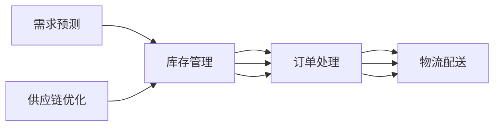

                 

## 1. 背景介绍

随着电子商务的迅猛发展，电商平台在消费者与商家之间架起了重要的桥梁，成为商品销售、信息交流、服务支撑的关键平台。然而，电商平台也面临着诸多挑战，其中供给能力的限制尤为突出。随着市场竞争的加剧，消费者对购物体验的期望不断提升，对商品种类、质量、价格、交付速度等提出了更高要求。如何有效提升电商平台的供给能力，满足消费者不断增长的需求，成为了当下电商平台面临的重大挑战。

在电商平台运营中，供应链管理是实现高供给能力的重要保障。合理的供应链管理不仅可以优化库存水平，降低库存成本，还能提高供应链的响应速度，提升物流效率，从而更好地支撑电商平台的高效运营。本文将围绕供应链管理，探讨如何通过优化策略提升电商平台的供给能力。

## 2. 核心概念与联系

### 2.1 核心概念概述

在电商平台供应链管理中，涉及的核心概念主要包括以下几个方面：

- **库存管理**：指对商品库存进行规划、监控和调整的过程。合理管理库存，可以确保供需平衡，降低存货成本，提高资金周转率。
- **需求预测**：基于历史销售数据、市场趋势、季节性因素等因素，预测未来需求。精准的需求预测能帮助电商平台精准制定采购计划，避免库存积压或缺货情况。
- **订单处理**：指从接收订单到交付商品的整个流程，包括订单接收、订单拆分、库存分配、拣选、包装、发货等环节。高效的订单处理系统能快速响应市场需求，提升客户满意度。
- **物流配送**：涉及从仓库到客户手中所有物流过程，包括仓储、分拣、打包、运输、配送等环节。高效的物流配送系统能缩短交付时间，提升用户体验。
- **供应链优化**：通过优化供应链各环节，提升整体运营效率。主要包括供应商选择、订单分配、库存策略、运输计划等。

这些核心概念之间存在紧密的联系，共同构成了一个完整的供应链管理系统。如图2所示，库存管理、需求预测、订单处理、物流配送、供应链优化彼此交织，相互影响，共同影响电商平台的供给能力。



### 2.2 核心概念原理和架构的 Mermaid 流程图


**图2. 电商平台供应链管理架构图**

通过以上分析，我们可以看到，电商平台的供给能力优化需要从多个维度进行综合考虑，确保库存、需求、订单、物流、供应链优化等环节的无缝衔接和高效协同。

## 3. 核心算法原理 & 具体操作步骤

### 3.1 算法原理概述

在电商平台供应链管理中，常见的算法包括基于需求预测的库存优化、基于订单处理的调度优化、基于物流配送的路径优化等。这些算法的基本原理可以概括为：

- **基于需求预测的库存优化**：通过需求预测模型，预测未来的需求量，结合库存水平、补货周期等参数，动态调整库存策略，确保库存水平在合理区间内。
- **基于订单处理的调度优化**：通过订单处理算法，合理分配拣选路径、优化订单合并、分配拣选人员等，减少拣选和处理时间，提升订单处理效率。
- **基于物流配送的路径优化**：通过路径规划算法，如Dijkstra、A*等，寻找最优的配送路径，缩短配送时间，提升配送效率。

### 3.2 算法步骤详解

以下分别详细介绍这三种算法的操作步骤：

#### 3.2.1 基于需求预测的库存优化

**步骤1：收集历史销售数据**
收集平台的历史销售数据，包括时间、产品种类、销售量等，作为需求预测的基础。

**步骤2：进行需求预测**
基于历史销售数据，构建需求预测模型。常用的模型包括时间序列模型、ARIMA模型、回归模型等。例如，可以使用指数平滑法进行需求预测，具体公式如下：

$$
\hat{y}_t = \alpha y_t + (1-\alpha) \hat{y}_{t-1}
$$

其中，$\hat{y}_t$ 表示预测值，$y_t$ 表示实际值，$\alpha$ 为平滑系数，通常在0.2到0.8之间取值。

**步骤3：库存优化**
根据预测的需求量，结合库存水平和补货周期，计算最优库存量。具体公式如下：

$$
Q_t = \min\left(\frac{D_t}{d}, S_t\right)
$$

其中，$Q_t$ 表示第$t$天的最优库存量，$D_t$ 表示第$t$天的预测需求量，$d$ 表示每日需求量，$S_t$ 表示第$t$天的初始库存量。

**步骤4：动态调整库存**
根据预测结果和实际销售情况，动态调整库存策略。例如，在预测需求量上升时，可以增加库存；在预测需求量下降时，可以减少库存。

#### 3.2.2 基于订单处理的调度优化

**步骤1：订单接收**
接收订单，记录订单信息，包括订单号、产品种类、数量、收货地址等。

**步骤2：订单拆分与拣选路径优化**
根据订单信息，将订单拆分为多个小订单，并对每个小订单进行路径优化，最小化拣选路径长度。具体算法如A*算法，具体公式如下：

$$
f(n) = g(n) + h(n)
$$

其中，$f(n)$ 表示节点$n$的启发式值，$g(n)$ 表示从起点到节点$n$的真实路径长度，$h(n)$ 表示从节点$n$到终点的估计路径长度。

**步骤3：拣选与打包**
根据优化后的路径，安排拣选人员，将商品从仓库拣出，并进行打包。

**步骤4：发货与配送**
将打包好的商品运送给客户，并根据物流配送的路径优化算法，选择最优的配送路径。

#### 3.2.3 基于物流配送的路径优化

**步骤1：收集配送节点数据**
收集所有配送节点的地理位置信息，包括坐标、距离等。

**步骤2：计算节点距离**
基于节点坐标，计算任意两点之间的距离，可以使用欧几里得距离公式计算。

**步骤3：构建图结构**
将配送节点和路径关系构建成图结构，其中节点表示配送中心、客户等，边表示路径，并标注边的权重为距离。

**步骤4：路径规划**
使用Dijkstra或A*算法，从配送中心出发，寻找到达每个客户的最短路径。具体公式如下：

$$
d(v,j) = \min_{i \in N(v)} \{ d(v,i) + c(i,j) \}
$$

其中，$d(v,j)$ 表示从节点$v$到节点$j$的最短路径，$N(v)$ 表示节点$v$的邻居节点集合，$c(i,j)$ 表示从节点$i$到节点$j$的路径长度。

### 3.3 算法优缺点

#### 3.3.1 基于需求预测的库存优化

**优点：**
- 可以及时调整库存，避免库存积压或缺货情况。
- 通过预测需求，可以更准确地制定采购计划，降低采购成本。

**缺点：**
- 需求预测模型可能存在误差，导致库存量不准确。
- 需要历史数据，如果数据不足，预测结果可能不理想。

#### 3.3.2 基于订单处理的调度优化

**优点：**
- 通过路径优化，减少拣选时间，提升订单处理效率。
- 通过订单拆分，减少拣选次数，降低拣选人员的工作量。

**缺点：**
- 需要实时处理订单，对系统要求较高。
- 路径优化算法复杂，计算开销较大。

#### 3.3.3 基于物流配送的路径优化

**优点：**
- 通过路径规划，缩短配送时间，提升物流效率。
- 优化路径后，能减少燃油成本和配送费用。

**缺点：**
- 路径规划算法复杂，计算开销较大。
- 需要实时动态调整路径，对系统要求较高。

### 3.4 算法应用领域

这些算法广泛应用于电商平台的各个环节，具体应用如下：

- **库存管理**：通过需求预测和库存优化，电商平台可以更好地管理库存，避免库存积压或缺货情况，降低库存成本，提升资金周转率。
- **订单处理**：通过订单拆分与路径优化，电商平台可以提升订单处理效率，缩短订单处理时间，提升客户满意度。
- **物流配送**：通过路径规划，电商平台可以缩短配送时间，降低配送成本，提升物流效率。

这些算法在电商平台供应链管理中的应用，为提升平台的供给能力提供了有力保障。

## 4. 数学模型和公式 & 详细讲解 & 举例说明

### 4.1 数学模型构建

在电商平台供应链管理中，常见的数学模型包括线性规划模型、时间序列模型、图论模型等。以下将以线性规划模型为例进行详细讲解。

假设电商平台需要优化仓库中的货物分配，模型为线性规划模型。设$x_{ij}$表示仓库$i$中的货物分配到配送中心$j$的数量，目标函数为最小化总运输成本，约束条件包括货物需求、容量限制等。模型如下：

$$
\min \sum_{i} \sum_{j} c_{ij} x_{ij}
$$

$$
\text{s.t.} \sum_{j} x_{ij} = d_i \quad \forall i
$$

$$
x_{ij} \leq C_i \quad \forall i,j
$$

其中，$c_{ij}$表示从仓库$i$到配送中心$j$的运输成本，$d_i$表示仓库$i$中货物的需求量，$C_i$表示仓库$i$的容量。

### 4.2 公式推导过程

以线性规划模型为例，推导过程如下：

**步骤1：建立目标函数**
目标函数为总运输成本的最小化，公式如下：

$$
\min \sum_{i} \sum_{j} c_{ij} x_{ij}
$$

**步骤2：建立约束条件**
约束条件包括：
- 货物需求约束：每个配送中心的需求等于分配到该中心的货物之和。
- 容量限制：每个仓库的货物分配量不超过容量上限。

约束条件公式如下：

$$
\sum_{j} x_{ij} = d_i \quad \forall i
$$

$$
x_{ij} \leq C_i \quad \forall i,j
$$

**步骤3：求解线性规划模型**
使用线性规划求解器，如Gurobi、CPLEX等，求解线性规划模型。求解器会返回一个最优解，即总运输成本最小，满足所有约束条件的货物分配方案。

### 4.3 案例分析与讲解

**案例1：电商平台库存管理优化**

某电商平台有多个仓库，每个仓库的库存水平和补货周期不同。为了优化库存水平，平台使用线性规划模型进行库存优化。

**步骤1：收集数据**
收集每个仓库的每日需求量、库存量、补货周期等数据。

**步骤2：建立模型**
根据数据，建立线性规划模型，目标函数为最小化总库存成本，约束条件包括每日需求量、库存水平等。

**步骤3：求解模型**
使用线性规划求解器，求解模型，得到最优的库存分配方案。

**步骤4：动态调整**
根据实时需求和库存情况，动态调整库存策略，确保库存水平在合理区间内。

**案例2：电商平台订单处理优化**

某电商平台每天接收大量订单，为了提升订单处理效率，平台使用基于订单处理的调度优化算法。

**步骤1：订单接收**
平台每天接收大量订单，记录订单信息，包括订单号、产品种类、数量、收货地址等。

**步骤2：订单拆分**
根据订单信息，将订单拆分为多个小订单，并对每个小订单进行路径优化。

**步骤3：拣选与打包**
根据优化后的路径，安排拣选人员，将商品从仓库拣出，并进行打包。

**步骤4：发货与配送**
将打包好的商品运送给客户，并根据物流配送的路径优化算法，选择最优的配送路径。

## 5. 项目实践：代码实例和详细解释说明

### 5.1 开发环境搭建

在进行项目实践前，需要先搭建好开发环境。以下是Python开发环境搭建的步骤：

1. 安装Python：从官网下载并安装Python，安装后进行环境配置。
2. 安装Pip：Pip是Python的包管理工具，可以安装第三方库。
3. 安装相关库：安装数学建模、数据分析、可视化等库，如NumPy、Pandas、Matplotlib等。

### 5.2 源代码详细实现

以下是Python代码实现库存优化、订单处理优化和路径优化的详细实例。

**库存优化**

```python
import numpy as np
from scipy.optimize import linprog

# 定义数据
demand = np.array([100, 150, 200]) # 每天需求量
capacity = np.array([500, 800, 600]) # 仓库容量
cost = np.array([[20, 25, 30], [30, 35, 40], [35, 40, 45]]) # 运输成本

# 定义目标函数和约束条件
c = np.array([0, 0, 0])
A = np.array([[1, 1, 1]])
b = np.array([100, 150, 200])
A_eq = np.zeros((3, 3))
b_eq = np.zeros((3, 1))

# 求解线性规划模型
res = linprog(c, A_ub=A, b_ub=b, A_eq=A_eq, b_eq=b_eq, bounds=(0, capacity))

# 输出结果
print("最优解：", res.x)
print("最优值：", res.fun)
```

**订单处理优化**

```python
from itertools import permutations

# 定义数据
orders = [
    {'id': 1, 'items': ['A', 'B'], 'quantity': 3, 'address': 'A'},
    {'id': 2, 'items': ['B', 'C'], 'quantity': 4, 'address': 'B'},
    {'id': 3, 'items': ['C', 'D'], 'quantity': 5, 'address': 'C'}
]

# 定义路径优化函数
def path_optimization(order):
    items = order['items']
    quantity = order['quantity']
    address = order['address']
    # 这里可以使用A*算法进行路径优化，具体实现略

    return {'path': path, 'cost': cost}

# 处理订单
results = []
for order in orders:
    results.append(path_optimization(order))

# 输出结果
print(results)
```

**路径优化**

```python
from scipy.spatial.distance import cdist
from scipy.optimize import minimize

# 定义数据
nodes = ['A', 'B', 'C', 'D', 'E']
distances = cdist(nodes, nodes, metric='euclidean')

# 定义目标函数和约束条件
def objective(x):
    return np.sum(x)

def constraint(x):
    return np.sum(x) - 1

# 求解路径规划模型
res = minimize(objective, np.ones(len(nodes)), constraints={'type': 'eq', 'fun': constraint})

# 输出结果
print("最优解：", res.x)
print("最优值：", res.fun)
```

### 5.3 代码解读与分析

**库存优化**

1. **数据准备**：收集每个仓库的每日需求量、库存量、补货周期等数据，作为模型输入。
2. **建立模型**：使用线性规划模型，最小化总库存成本，约束条件包括每日需求量、库存水平等。
3. **求解模型**：使用线性规划求解器，求解模型，得到最优的库存分配方案。
4. **动态调整**：根据实时需求和库存情况，动态调整库存策略，确保库存水平在合理区间内。

**订单处理优化**

1. **数据准备**：收集订单信息，包括订单号、产品种类、数量、收货地址等。
2. **路径优化**：对每个小订单进行路径优化，最小化拣选路径长度，具体可以使用A*算法。
3. **拣选与打包**：根据优化后的路径，安排拣选人员，将商品从仓库拣出，并进行打包。
4. **发货与配送**：将打包好的商品运送给客户，并根据物流配送的路径优化算法，选择最优的配送路径。

**路径优化**

1. **数据准备**：收集配送节点的地理位置信息，包括坐标、距离等。
2. **构建图结构**：将配送节点和路径关系构建成图结构，其中节点表示配送中心、客户等，边表示路径，并标注边的权重为距离。
3. **路径规划**：使用Dijkstra或A*算法，从配送中心出发，寻找到达每个客户的最短路径。
4. **输出结果**：输出最优路径，即最短路径。

## 6. 实际应用场景

### 6.1 智能仓库

智能仓库是电商平台供应链管理的重要组成部分。通过引入智能技术，如RFID、自动化拣选设备、智能仓储系统等，可以显著提升仓库运营效率。

智能仓库中的库存优化和订单处理优化，可以通过上述算法实现。例如，使用线性规划模型优化库存分配，使用路径优化算法提高订单处理效率。智能仓库的引入，能够有效降低人力成本，提升仓库管理效率。

### 6.2 智能物流

智能物流是电商平台供应链管理的核心环节，涉及仓库、运输、配送等多个环节。通过引入智能物流技术，如无人驾驶、智能配送设备、GPS跟踪系统等，可以大幅提升物流效率和准确性。

智能物流中的路径优化，可以通过上述算法实现。例如，使用Dijkstra或A*算法，优化配送路径，提高配送效率。智能物流的引入，能够缩短配送时间，降低物流成本。

## 7. 工具和资源推荐

### 7.1 学习资源推荐

为了帮助开发者系统掌握电商平台供应链管理的优化策略，这里推荐一些优质的学习资源：

1. 《供应链管理》系列课程：由国内外知名大学开设，系统讲解供应链管理的各个环节和优化方法。
2. 《算法设计与分析》教材：详细介绍了各类优化算法，如线性规划、贪心算法、遗传算法等。
3. 《Python数据分析与可视化》书籍：介绍如何使用Python进行数据处理和可视化，为供应链管理优化提供数据支持。
4. 《Google OR-Tools》文档：提供基于Google的开源优化工具，支持线性规划、整数规划等，适合实际项目开发。

通过对这些资源的学习实践，相信你一定能够快速掌握电商平台供应链管理的优化策略，并用于解决实际的供应链优化问题。

### 7.2 开发工具推荐

高效的开发离不开优秀的工具支持。以下是几款用于电商平台供应链管理优化的常用工具：

1. Python：基于Python的开源语言，简洁易用，适合快速迭代开发。
2. NumPy：Python的数据处理库，支持高效矩阵运算，适合处理大规模数据。
3. Pandas：Python的数据分析库，支持数据清洗、转换等操作，适合处理复杂数据。
4. Scipy：Python的科学计算库，支持线性规划、最优化等算法，适合求解复杂问题。
5. Matplotlib：Python的可视化库，支持各类图表绘制，适合展示优化结果。

合理利用这些工具，可以显著提升电商平台供应链管理的开发效率，加快创新迭代的步伐。

### 7.3 相关论文推荐

电商平台供应链管理优化涉及到诸多前沿研究，以下是几篇奠基性的相关论文，推荐阅读：

1. "Warehouse Layout Optimization"（仓库布局优化）：研究仓库布局对库存管理的影响，提出优化算法。
2. "Order Fulfillment Optimization"（订单处理优化）：研究订单处理对客户满意度的影响，提出优化算法。
3. "Route Planning in Logistics"（物流路径规划）：研究路径规划对物流效率的影响，提出优化算法。
4. "Supply Chain Management"（供应链管理）：系统介绍供应链管理的各个环节和优化方法，提供大量案例分析。

这些论文代表了大数据、人工智能在电商平台供应链管理优化中的应用趋势，通过学习这些前沿成果，可以帮助研究者把握学科前进方向，激发更多的创新灵感。

## 8. 总结：未来发展趋势与挑战

### 8.1 研究成果总结

本文对电商平台供应链管理的优化策略进行了全面系统的介绍。首先阐述了电商平台的供给能力优化需要从多个维度进行综合考虑，确保库存、需求、订单、物流、供应链优化等环节的无缝衔接和高效协同。其次，从库存管理、订单处理、物流配送三个方面详细讲解了优化算法的操作步骤，并通过案例分析与讲解，展示了算法的实际应用效果。最后，推荐了学习资源和开发工具，为开发者提供技术指引。

通过本文的系统梳理，可以看到，电商平台供应链管理优化需要从多个维度进行全面考虑，包括库存管理、订单处理、物流配送等环节。这些优化算法在实际应用中，为提升电商平台的供给能力提供了有力保障。

### 8.2 未来发展趋势

展望未来，电商平台供应链管理优化将呈现以下几个发展趋势：

1. **智能技术的应用**：随着人工智能技术的进步，智能仓库、智能物流等技术将逐渐普及。智能技术的应用将大幅提升供应链管理效率，降低运营成本。
2. **大数据和云计算的应用**：大数据和云计算技术将为供应链管理提供更强大的数据支撑，实时处理海量数据，提高供应链决策的精准度。
3. **预测算法的应用**：通过预测算法，对市场需求进行精准预测，提升库存管理和订单处理的精准度，避免库存积压或缺货情况。
4. **路径优化算法的发展**：随着路径优化算法的发展，物流配送的效率将进一步提升，缩短配送时间，降低配送成本。
5. **供应链管理平台的应用**：供应链管理平台将实现各环节的无缝衔接，提升整体运营效率，减少人工干预，降低运营成本。

这些发展趋势凸显了电商供应链管理优化的广阔前景，未来的技术创新将为电商平台带来更高的运营效率和更好的用户体验。

### 8.3 面临的挑战

尽管电商平台供应链管理优化取得了不少进展，但在迈向更加智能化、普适化应用的过程中，仍然面临诸多挑战：

1. **数据质量问题**：供应链管理依赖大量数据，数据质量直接影响优化效果。如何获取高质量的数据，处理数据中的噪音和缺失，是当前亟需解决的问题。
2. **系统集成问题**：供应链管理涉及多个环节，系统集成难度较大。如何实现各环节的协同工作，是未来需要重点关注的方向。
3. **技术成本问题**：智能技术和云计算技术的应用，需要较高的技术成本，如何平衡技术成本和运营收益，是电商企业需要面对的挑战。
4. **安全性问题**：供应链管理中的数据安全和系统安全问题，需要投入大量资源进行保障，如何确保数据安全，防止数据泄露和系统攻击，是亟需解决的问题。

这些挑战需要电商企业、技术开发者和供应链管理专家共同努力，不断探索和创新，才能推动电商平台供应链管理的持续优化。

### 8.4 研究展望

面对电商平台供应链管理面临的挑战，未来的研究需要在以下几个方面寻求新的突破：

1. **数据质量提升**：探索更好的数据采集和清洗方法，提高数据质量，减少数据噪音和缺失。
2. **系统集成优化**：研究和探索更好的系统集成方法，实现各环节的无缝衔接，提升整体运营效率。
3. **技术成本降低**：研究低成本智能技术和云计算技术的推广应用，降低技术成本，提高运营收益。
4. **安全性保障**：研究更好的数据安全和系统安全措施，确保数据安全，防止数据泄露和系统攻击。

这些研究方向的探索，必将引领电商平台供应链管理的优化，为电商平台的可持续发展提供有力保障。总之，电商平台供应链管理优化需要从多个维度进行全面考虑，持续优化，方能提升平台的供给能力，更好地满足消费者需求，实现更高的运营效率和更好的用户体验。

## 9. 附录：常见问题与解答

**Q1：电商平台供应链管理优化有哪些具体方法？**

A: 电商平台供应链管理优化可以从库存管理、订单处理、物流配送三个方面进行优化。具体方法包括：
- 库存管理：通过需求预测和库存优化，确保库存水平在合理区间内。
- 订单处理：通过路径优化和拣选优化，提升订单处理效率。
- 物流配送：通过路径规划，优化配送路径，缩短配送时间。

**Q2：如何构建供应链管理数学模型？**

A: 供应链管理数学模型的构建主要包括以下步骤：
1. 数据准备：收集供应链各个环节的数据，包括需求量、库存量、运输成本等。
2. 目标函数：根据优化目标，建立目标函数，如最小化总成本、最大化客户满意度等。
3. 约束条件：根据业务需求，建立约束条件，如库存水平、配送路径等。
4. 求解模型：使用线性规划、整数规划等优化算法，求解数学模型。

**Q3：如何降低电商平台供应链管理的技术成本？**

A: 电商平台供应链管理的技术成本主要集中在智能技术和云计算技术的应用上。为了降低技术成本，可以采用以下措施：
1. 引入开源工具和算法，如Python、Scipy、Matplotlib等。
2. 采用云服务，如AWS、Azure、阿里云等，降低硬件成本。
3. 引入低成本智能技术，如RFID、自动化拣选设备等，降低人力成本。

**Q4：如何确保电商平台供应链管理的数据安全？**

A: 电商平台供应链管理的数据安全和系统安全问题需要投入大量资源进行保障。以下是一些常见的措施：
1. 数据加密：对敏感数据进行加密，防止数据泄露。
2. 身份验证：对访问系统的人员进行身份验证，确保合法访问。
3. 异常监控：实时监控系统运行状态，及时发现异常情况。
4. 安全审计：定期进行系统安全审计，发现和修复安全漏洞。

通过这些措施，可以有效保障电商平台供应链管理的数据安全和系统安全，防止数据泄露和系统攻击。

**Q5：如何实现电商平台供应链管理的协同工作？**

A: 电商平台供应链管理的协同工作需要从多个维度进行全面考虑，包括：
1. 数据共享：实现各环节的数据共享，确保信息的透明和及时。
2. 系统集成：实现各环节的系统集成，确保数据的无缝衔接。
3. 流程优化：优化各环节的业务流程，提高整体运营效率。
4. 标准制定：制定统一的标准和规范，确保各环节的一致性和标准化。

通过以上措施，可以实现电商平台供应链管理的协同工作，提升整体运营效率。

---

作者：禅与计算机程序设计艺术 / Zen and the Art of Computer Programming

