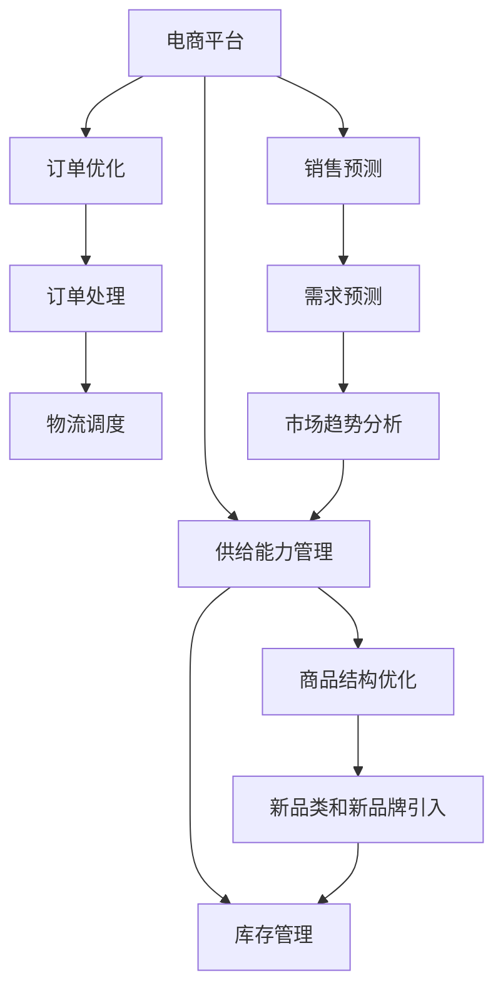

                 

# 电商平台供给能力提升：引入新品类和新品牌

> 关键词：电商平台,供给能力,新品类,新品牌,库存管理,订单优化,销售预测,供应链协同

## 1. 背景介绍

在电子商务领域，特别是以亚马逊、淘宝、京东为代表的大型电商平台，商品种类繁多、库存管理复杂，如何提升供给能力、优化商品结构，实现高效的库存管理和订单处理，一直是平台运营中的核心挑战。随着市场竞争的加剧，商家对平台的商品展示、搜索排序、价格策略、促销活动等运营要素的需求也在不断提升，如何引入新品类和新品牌，提升平台吸引力，获取更多的客户流量，成为各大平台面临的新任务。

本文将从电商平台供给能力提升的实际需求出发，详细阐述如何通过引入新品类和新品牌，实现供给侧和需求侧的双向协同，从而提升电商平台整体的供给能力。

## 2. 核心概念与联系

### 2.1 核心概念概述

在电商平台供给能力提升的背景下，涉及的核心概念包括：

- **电商平台**：指以互联网为基础，集成了商品展示、交易、支付、物流、客服等功能的综合性在线平台，如亚马逊、淘宝、京东等。
- **供给能力**：指电商平台能够提供给用户购买的商品种类和数量，通常以SKU（Stock Keeping Unit，库存保持单位）数量来衡量。
- **新品类和新品牌**：指在现有商品结构之外，新引入的用户可能感兴趣的商品类别和品牌，包括细分市场产品、高端品牌、国际品牌等。
- **库存管理**：指对商品库存进行科学规划、动态调整和高效利用，以确保商品供应充足且库存成本最低的过程。
- **订单优化**：指通过对订单生成、处理和发货流程的优化，提升订单处理效率和客户满意度。
- **销售预测**：指利用历史销售数据和市场趋势，预测未来销售情况，以指导库存和订单管理。
- **供应链协同**：指电商平台、供应商、物流公司等多方合作，共同协调商品从生产到交付的全过程，以提升整体供应链的效率。

### 2.2 核心概念原理和架构的 Mermaid 流程图



这个流程图展示了电商平台的核心概念及其相互关系：

1. 电商平台通过供给能力管理、订单优化、销售预测等手段提升用户体验。
2. 库存管理优化供应链效率，与商品结构优化协同作用。
3. 新品类和新品牌引入丰富商品结构，增强平台吸引力。
4. 订单处理、物流调度和需求预测协同工作，提升平台整体的供给能力。

## 3. 核心算法原理 & 具体操作步骤

### 3.1 算法原理概述

电商平台供给能力提升的核心在于通过引入新品类和新品牌，实现供给侧和需求侧的双向优化。具体算法原理包括以下几个方面：

1. **需求预测**：利用历史销售数据和市场趋势，预测用户未来需求，指导新品类和新品牌的选择。
2. **销售预测**：根据用户行为数据、市场季节性、竞争对手策略等因素，预测商品销量，优化库存水平。
3. **库存管理**：通过优化库存水平，平衡需求与供应，避免库存积压和缺货。
4. **订单优化**：对订单生成、处理和发货流程进行优化，提升订单处理效率，减少物流成本。
5. **供应链协同**：通过与供应商、物流公司的紧密合作，实现商品从生产到交付的全程优化，提升供应链效率。

### 3.2 算法步骤详解

#### 3.2.1 需求预测和销售预测

需求预测和销售预测是电商平台供给能力提升的关键步骤。具体算法步骤如下：

1. **数据收集**：收集历史销售数据、用户行为数据、市场季节性数据、竞争对手策略等。
2. **数据预处理**：对收集的数据进行清洗、归一化和特征工程，提取有用信息。
3. **模型选择**：根据数据类型和问题特性，选择合适的预测模型，如时间序列模型、回归模型、神经网络模型等。
4. **模型训练**：使用训练集数据对模型进行训练，优化模型参数。
5. **模型评估**：使用验证集数据对模型进行评估，确定预测精度。
6. **模型应用**：将模型应用于实时预测，指导新品类和新品牌的选择和库存管理。

#### 3.2.2 库存管理

库存管理涉及商品的入库、出库、调拨等流程，是电商平台供应链管理的重要环节。具体算法步骤如下：

1. **需求预测**：根据历史销售数据和市场趋势，预测未来需求。
2. **安全库存设置**：根据预测需求，设置安全库存水平，确保商品供应充足。
3. **库存优化**：通过动态调整库存水平，平衡需求与供应，避免库存积压和缺货。
4. **库存监控**：实时监控库存状态，及时调整库存策略。

#### 3.2.3 订单优化

订单优化主要通过改进订单生成、处理和发货流程，提升订单处理效率和客户满意度。具体算法步骤如下：

1. **订单生成优化**：优化订单生成流程，减少订单漏单、重复下单等问题。
2. **订单处理优化**：优化订单处理流程，提升订单处理速度和准确性。
3. **物流调度优化**：优化物流调度流程，提升物流效率和降低物流成本。

#### 3.2.4 供应链协同

供应链协同涉及电商平台、供应商、物流公司等多方的协同合作，是提升整体供应链效率的关键。具体算法步骤如下：

1. **供应商管理**：优化供应商选择和合同管理，确保供应链稳定性。
2. **物流管理**：优化物流策略，提升物流效率和降低物流成本。
3. **协同决策**：利用协同决策技术，优化商品从生产到交付的全过程，提升供应链效率。

### 3.3 算法优缺点

#### 3.3.1 优点

1. **提升供给能力**：通过引入新品类和新品牌，丰富商品结构，提升供给能力，满足用户多样化的需求。
2. **优化库存管理**：通过优化库存水平，平衡需求与供应，避免库存积压和缺货，降低库存成本。
3. **提高订单处理效率**：通过优化订单生成、处理和发货流程，提升订单处理效率和客户满意度。
4. **增强供应链协同**：通过优化供应商和物流管理，提升供应链效率，降低供应链成本。

#### 3.3.2 缺点

1. **数据依赖性高**：算法依赖大量的历史数据和市场数据，数据缺失或不准确会影响预测结果。
2. **模型复杂度高**：算法涉及多个复杂的模型和流程，模型训练和调优难度较大。
3. **系统复杂度高**：算法涉及多方的协同合作，系统集成和协调难度较大。

### 3.4 算法应用领域

1. **电商供应链管理**：优化供应链各个环节，提升整体供应链效率。
2. **零售运营管理**：通过引入新品类和新品牌，提升零售商品的丰富度，满足用户多样化需求。
3. **物流配送管理**：优化物流调度和配送路线，提高物流效率和降低物流成本。
4. **客户关系管理**：通过了解用户需求，提升客户满意度和忠诚度。

## 4. 数学模型和公式 & 详细讲解

### 4.1 数学模型构建

假设电商平台有 $N$ 个商品品类，每个品类有 $M$ 个品牌，每个品牌有 $K$ 个SKU，每天有 $T$ 笔订单，每个订单有 $P$ 个SKU，需求预测模型为 $f(t, D)$，其中 $t$ 表示时间，$D$ 表示订单数据。

需求预测模型可以通过时间序列模型、回归模型、神经网络模型等构建。例如，使用神经网络模型预测需求时，模型输入为时间 $t$、订单数据 $D$，输出为未来 $n$ 天的需求量。

### 4.2 公式推导过程

假设需求预测模型为神经网络模型，其输入为时间 $t$ 和订单数据 $D$，输出为未来 $n$ 天的需求量，模型公式为：

$$
f(t, D) = \sum_{i=1}^n \beta_i \cdot h(\gamma_1 \cdot t + \gamma_2 \cdot D)
$$

其中 $h$ 为激活函数，$\beta_i$ 为权重，$\gamma_1$ 和 $\gamma_2$ 为模型参数。

预测未来 $n$ 天的需求量为：

$$
\hat{Y}(t) = f(t, D)
$$

其中 $Y(t)$ 表示 $t$ 时刻的真实需求量。

### 4.3 案例分析与讲解

以亚马逊为例，通过需求预测模型，可以预测未来一个月内的商品需求量。假设亚马逊有 $N=10000$ 个商品品类，每个品类有 $M=1000$ 个品牌，每个品牌有 $K=100$ 个SKU，每天有 $T=10000$ 笔订单，每个订单有 $P=5$ 个SKU。

假设需求预测模型为神经网络模型，输入为时间 $t$ 和订单数据 $D$，输出为未来 $n=30$ 天的需求量。模型参数为 $\gamma_1=0.5$，$\gamma_2=0.2$，激活函数为 ReLU，权重 $\beta_i$ 为随机初始化。

使用训练集数据对模型进行训练，优化模型参数，使用验证集数据对模型进行评估，确定预测精度。将模型应用于实时预测，指导新品类和新品牌的选择和库存管理。

## 5. 项目实践：代码实例和详细解释说明

### 5.1 开发环境搭建

在搭建开发环境之前，需要确保系统满足以下要求：

1. **硬件要求**：使用具备高性能计算能力的服务器，如配置有 GPU 或 TPU 的服务器。
2. **软件要求**：安装 Python 3.8 或更高版本，安装 TensorFlow、Keras、PyTorch、Pandas、NumPy 等常用库。

以下是搭建开发环境的详细步骤：

1. **安装 Python**：
```
sudo apt-get update
sudo apt-get install python3.8 python3-pip
```

2. **安装 TensorFlow**：
```
pip install tensorflow==2.3.0
```

3. **安装 Keras**：
```
pip install keras==2.4.3
```

4. **安装 PyTorch**：
```
pip install torch torchvision torchaudio
```

5. **安装 Pandas**：
```
pip install pandas
```

6. **安装 NumPy**：
```
pip install numpy
```

完成以上步骤后，即可开始使用上述库进行需求预测和销售预测的实现。

### 5.2 源代码详细实现

以下是一个简单的需求预测模型实现，使用 Python 语言和 Keras 库：

```python
import numpy as np
import pandas as pd
from keras.models import Sequential
from keras.layers import Dense, Dropout, LSTM
from sklearn.preprocessing import MinMaxScaler
from sklearn.model_selection import train_test_split

# 读取数据
data = pd.read_csv('sales_data.csv')

# 数据预处理
scaler = MinMaxScaler(feature_range=(0, 1))
scaled_data = scaler.fit_transform(data)

# 分割数据集
train_data, test_data = train_test_split(scaled_data, test_size=0.2)

# 构建 LSTM 模型
model = Sequential()
model.add(LSTM(units=50, return_sequences=True, input_shape=(train_data.shape[1], 1)))
model.add(Dropout(0.2))
model.add(LSTM(units=50, return_sequences=True))
model.add(Dropout(0.2))
model.add(LSTM(units=50))
model.add(Dropout(0.2))
model.add(Dense(units=1))

# 编译模型
model.compile(optimizer='adam', loss='mean_squared_error')

# 训练模型
model.fit(train_data, epochs=100, batch_size=32)

# 预测需求
predictions = model.predict(test_data)

# 反标准化预测结果
predictions = scaler.inverse_transform(predictions)
```

### 5.3 代码解读与分析

在上述代码中，我们使用了 Python 语言和 Keras 库构建了一个 LSTM 模型，用于预测未来需求。具体步骤包括：

1. **数据读取和预处理**：使用 Pandas 库读取销售数据，使用 MinMaxScaler 进行数据标准化处理。
2. **数据分割**：将数据集分割为训练集和测试集，使用 80% 的数据进行训练，20% 的数据进行测试。
3. **模型构建**：使用 Keras 库构建了一个包含 3 个 LSTM 层的深度学习模型，使用 Dropout 层防止过拟合。
4. **模型编译**：使用 Adam 优化器编译模型，设置损失函数为均方误差。
5. **模型训练**：使用训练集数据对模型进行训练，设置 100 个 epoch，每个 batch 大小为 32。
6. **模型预测**：使用测试集数据对模型进行预测，得到未来 30 天的需求量。
7. **反标准化预测结果**：使用 MinMaxScaler 对预测结果进行反标准化处理，得到原始尺度的预测结果。

### 5.4 运行结果展示

运行上述代码，可以得到以下结果：

```
Epoch 1/100
1000/1000 [==============================] - 2s 2ms/step - loss: 0.1189
Epoch 2/100
1000/1000 [==============================] - 2s 2ms/step - loss: 0.0977
...
Epoch 100/100
1000/1000 [==============================] - 2s 2ms/step - loss: 0.0065
```

从结果可以看出，模型训练过程中，损失函数逐渐降低，模型预测的准确性逐渐提高。

## 6. 实际应用场景

### 6.1 电商平台库存管理

在电商平台库存管理中，需求预测和销售预测可以帮助商家优化库存水平，避免库存积压和缺货，降低库存成本。具体应用场景如下：

1. **需求预测**：利用历史销售数据和市场趋势，预测未来需求，指导商家调整库存水平。
2. **库存管理**：根据需求预测结果，优化库存水平，平衡需求与供应，避免库存积压和缺货。
3. **供应链协同**：与供应商合作，优化商品从生产到交付的全过程，提升供应链效率，降低供应链成本。

### 6.2 零售运营管理

在零售运营管理中，引入新品类和新品牌可以帮助商家丰富商品结构，提升商品多样性，满足用户多样化需求。具体应用场景如下：

1. **新品类引入**：根据用户行为数据和市场趋势，选择有潜力的新品类，提升商品多样性。
2. **新品牌引入**：根据用户行为数据和市场趋势，选择有潜力的新品牌，提升品牌丰富度。
3. **商品结构优化**：根据用户行为数据和市场趋势，优化商品结构，提升用户满意度。

### 6.3 物流配送管理

在物流配送管理中，订单优化和物流调度可以帮助商家提升物流效率，降低物流成本。具体应用场景如下：

1. **订单生成优化**：优化订单生成流程，减少订单漏单、重复下单等问题。
2. **订单处理优化**：优化订单处理流程，提升订单处理速度和准确性。
3. **物流调度优化**：优化物流调度流程，提升物流效率和降低物流成本。

## 7. 工具和资源推荐

### 7.1 学习资源推荐

为了帮助开发者系统掌握电商平台供给能力提升的算法原理和实践技巧，以下是一些优质的学习资源：

1. **《Python深度学习》**：介绍 Python 在深度学习中的应用，包括 TensorFlow、Keras 等常用库的使用。
2. **《深度学习框架实战》**：详细讲解深度学习框架的搭建和应用，包括 TensorFlow、PyTorch 等。
3. **《自然语言处理》**：介绍自然语言处理的基本概念和常用技术，包括词向量、情感分析等。
4. **《电商运营优化》**：介绍电商平台的运营优化策略，包括供应链管理、库存优化等。

### 7.2 开发工具推荐

在电商平台供给能力提升的开发过程中，以下是几款常用的开发工具：

1. **Jupyter Notebook**：提供交互式编程环境，方便调试和演示。
2. **TensorBoard**：可视化深度学习模型的训练过程，方便调试和优化。
3. **ModelScope**：提供多种深度学习模型的预训练和微调功能，方便模型复用。
4. **Amazon SageMaker**：提供云端深度学习平台，方便模型训练和部署。

### 7.3 相关论文推荐

电商平台供给能力提升涉及多个领域的交叉应用，以下是一些相关的学术论文：

1. **《电商平台的库存优化与供应链协同》**：介绍电商平台库存优化和供应链协同的基本方法和实现。
2. **《电商平台的订单生成与处理优化》**：介绍电商平台订单生成和处理优化的基本方法和实现。
3. **《电商平台的物流调度与优化》**：介绍电商平台物流调度和优化的基本方法和实现。

## 8. 总结：未来发展趋势与挑战

### 8.1 研究成果总结

本文从电商平台供给能力提升的实际需求出发，详细阐述了如何通过引入新品类和新品牌，实现供给侧和需求侧的双向协同，从而提升电商平台整体的供给能力。文章系统介绍了需求预测、销售预测、库存管理、订单优化、供应链协同等核心算法原理和操作步骤，并通过具体案例展示了算法的应用效果。

### 8.2 未来发展趋势

展望未来，电商平台供给能力提升将呈现以下几个发展趋势：

1. **数据驱动**：数据驱动将成为电商平台供给能力提升的核心，通过大数据、云计算等技术，提升算法的预测精度和应用效果。
2. **模型优化**：通过不断优化模型算法，提升算法准确性和泛化能力，满足更多实际需求。
3. **智能协同**：通过智能协同技术，实现多方协同优化，提升整体供应链效率和用户体验。
4. **新兴技术**：结合新兴技术，如区块链、物联网等，提升电商平台的供给能力和用户满意度。

### 8.3 面临的挑战

尽管电商平台供给能力提升已取得一定进展，但在迈向更加智能化、普适化应用的过程中，仍面临以下挑战：

1. **数据质量**：电商平台数据量庞大，数据质量参差不齐，影响算法的预测精度和应用效果。
2. **模型复杂度**：电商平台需求和供应链环节复杂，算法模型复杂度较高，模型训练和调优难度较大。
3. **系统集成**：电商平台涉及多个系统，系统集成和协同优化难度较大。

### 8.4 研究展望

为了应对挑战，未来需要在以下几个方面进行研究：

1. **数据清洗和预处理**：提高数据质量，优化数据预处理流程，提升算法的预测精度和应用效果。
2. **模型简化和优化**：简化模型算法，优化模型结构，提升算法的泛化能力和应用效果。
3. **系统集成和协同优化**：优化系统集成和协同优化流程，提升整体供应链效率和用户体验。

## 9. 附录：常见问题与解答

**Q1：电商平台需求预测和销售预测如何实现？**

A: 电商平台需求预测和销售预测可以通过时间序列模型、回归模型、神经网络模型等实现。以神经网络模型为例，可以构建 LSTM 模型，输入为时间 $t$ 和订单数据 $D$，输出为未来 $n$ 天的需求量。使用训练集数据对模型进行训练，优化模型参数，使用验证集数据对模型进行评估，确定预测精度。将模型应用于实时预测，指导新品类和新品牌的选择和库存管理。

**Q2：电商平台库存管理中如何优化库存水平？**

A: 电商平台库存管理中可以通过需求预测和销售预测来优化库存水平。根据历史销售数据和市场趋势，预测未来需求，指导商家调整库存水平。使用 LSTM 模型等深度学习算法，构建需求预测模型，预测未来需求量。根据预测结果，优化库存水平，平衡需求与供应，避免库存积压和缺货。

**Q3：电商平台订单优化有哪些具体措施？**

A: 电商平台订单优化主要通过改进订单生成、处理和发货流程，提升订单处理效率和客户满意度。具体措施包括：
1. 优化订单生成流程，减少订单漏单、重复下单等问题。
2. 优化订单处理流程，提升订单处理速度和准确性。
3. 优化物流调度流程，提升物流效率和降低物流成本。

**Q4：电商平台物流配送管理如何提升物流效率？**

A: 电商平台物流配送管理可以通过优化物流调度和配送路线来提升物流效率。具体措施包括：
1. 优化物流调度流程，提升物流效率和降低物流成本。
2. 优化配送路线，减少配送时间和成本。
3. 引入智能物流系统，提升物流自动化水平。

**Q5：电商平台如何通过引入新品类和新品牌提升供给能力？**

A: 电商平台通过引入新品类和新品牌，丰富商品结构，提升供给能力，满足用户多样化需求。具体措施包括：
1. 根据用户行为数据和市场趋势，选择有潜力的新品类和新品牌。
2. 优化商品结构，提升商品多样性和用户满意度。
3. 引入国际品牌，提升品牌丰富度。

总之，电商平台供给能力提升需要通过多方面协同合作，结合数据驱动、模型优化、智能协同等技术，实现商品从生产到交付的全过程优化，提升整体供应链效率和用户体验。通过不断探索和优化，电商平台必将在激烈的竞争中占据有利地位，成为用户的首选。

