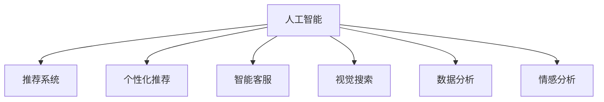

                 

# 电商用户体验提升的AI技术

> 关键词：人工智能, 电商用户体验, AI技术, 算法优化, 用户行为分析, 推荐系统

## 1. 背景介绍

### 1.1 问题由来
随着电子商务的快速发展，商家面临着愈发激烈的市场竞争。用户留存、转化率、复购率等核心指标直接关系到企业的业绩表现。传统的营销策略、数据分析方法已经难以满足日益增长的用户需求。电子商务平台需要在用户交互的各个环节，通过技术手段提升用户体验，从而实现业务增长。近年来，人工智能(AI)技术在电商行业的应用日益广泛，为电商平台提供了新的发展思路。

人工智能通过模拟和优化人的智能行为，可以大幅提升电商平台的运营效率和用户体验。比如，基于用户行为数据进行个性化推荐，通过智能客服与用户实时互动，利用AI视觉技术进行产品搜索和展示优化，这些技术手段都极大地改进了电商平台的用户体验。

### 1.2 问题核心关键点
为了解决电商用户体验提升的问题，AI技术的应用主要围绕以下几个核心关键点：

- **个性化推荐**：通过用户行为数据，推荐最适合用户的商品和内容，提高用户满意度。
- **智能客服**：利用自然语言处理技术，实现24小时在线客服，快速响应用户咨询。
- **视觉搜索**：运用计算机视觉技术，提升搜索效率，优化商品展示。
- **数据分析**：通过机器学习和大数据技术，深入分析用户行为，辅助决策。
- **情感分析**：利用自然语言处理技术，分析用户情感倾向，优化用户体验。

这些核心关键点为电商平台的运营提供了全方位支持，助力电商平台实现业务目标。

### 1.3 问题研究意义
提升电商用户体验，不仅可以增强用户粘性，提升转化率，还能有效提升平台的用户满意度和品牌形象。通过AI技术的应用，电商平台可以实现以下几个方面的提升：

1. **提高运营效率**：通过自动化流程，减少人工干预，降低运营成本。
2. **优化用户体验**：提供更加个性化的购物体验，使用户购物过程更加轻松愉快。
3. **增强用户互动**：通过智能客服和推荐系统，提升用户满意度，增加用户粘性。
4. **辅助决策分析**：利用AI进行用户行为分析，为营销决策提供科学依据。
5. **提升转化率**：通过个性化推荐和情感分析，提高用户转化率，促进销售增长。

AI技术的有效应用，将为电商平台的持续发展和创新提供强有力的支持。

## 2. 核心概念与联系

### 2.1 核心概念概述

为了更好地理解电商用户体验提升的AI技术，本节将介绍几个密切相关的核心概念：

- **人工智能(AI)**：通过算法和模型，模拟人的智能行为和认知过程。AI技术广泛应用于机器学习、自然语言处理、计算机视觉等领域。

- **推荐系统**：通过分析用户行为和商品属性，推荐符合用户偏好的商品，提高用户满意度和转化率。

- **个性化推荐**：根据用户的历史行为数据，个性化推荐符合用户兴趣的商品，增强用户体验。

- **智能客服**：利用自然语言处理技术，实现人机交互，快速响应用户问题，提升用户满意度。

- **视觉搜索**：利用计算机视觉技术，对商品图片进行索引和搜索，提高搜索效率。

- **数据分析**：通过数据挖掘和机器学习，分析用户行为和市场趋势，辅助营销决策。

- **情感分析**：通过自然语言处理技术，分析用户情感倾向，优化产品和服务。

这些核心概念之间的逻辑关系可以通过以下Mermaid流程图来展示：



这个流程图展示了几大AI技术在提升电商用户体验中的应用场景：

1. 人工智能作为整体框架，为推荐系统、个性化推荐、智能客服、视觉搜索、数据分析和情感分析提供支持。
2. 推荐系统和个性化推荐直接面向用户，提升购物体验和满意度。
3. 智能客服和情感分析通过人机交互，提升用户满意度。
4. 视觉搜索通过视觉技术，提升商品展示效果，增强用户搜索体验。
5. 数据分析通过市场分析，辅助营销决策，优化运营策略。

## 3. 核心算法原理 & 具体操作步骤
### 3.1 算法原理概述

基于AI技术提升电商用户体验，主要依赖以下几个核心算法：

- **个性化推荐算法**：通过用户行为数据，构建用户画像，进行商品推荐。
- **自然语言处理(NLP)**：处理用户查询和反馈，实现智能客服和情感分析。
- **计算机视觉(CV)**：对商品图片进行索引和搜索，优化商品展示效果。
- **机器学习(ML)**：进行用户行为分析和市场预测，辅助决策。

这些算法互相配合，共同提升了电商平台的用户体验。

### 3.2 算法步骤详解

以下将详细介绍几种主要算法的详细步骤：

#### 3.2.1 个性化推荐算法

个性化推荐算法的基本流程如下：

1. **数据收集**：收集用户行为数据，如浏览历史、购买记录、搜索关键词等。
2. **特征提取**：将用户行为数据转化为算法可处理的形式，如向量表示。
3. **模型训练**：使用机器学习算法，训练个性化推荐模型。
4. **推荐生成**：根据用户当前行为，生成个性化推荐结果。

以协同过滤算法为例，其详细步骤如下：

1. **用户相似度计算**：计算用户之间的相似度，找到与目标用户最相似的用户群体。
2. **商品相似度计算**：计算商品之间的相似度，找到与目标用户相似群体中推荐度最高的商品。
3. **推荐生成**：将相似度高的商品推荐给目标用户。

#### 3.2.2 自然语言处理(NLP)

自然语言处理在电商用户体验提升中的应用主要包括以下步骤：

1. **文本预处理**：对用户查询和反馈进行清洗、分词、去停用词等预处理。
2. **意图识别**：识别用户查询的意图，如搜索、咨询、投诉等。
3. **情感分析**：分析用户反馈的情感倾向，优化产品和服务。
4. **对话生成**：通过自然语言生成技术，生成智能客服的回复。

#### 3.2.3 计算机视觉(CV)

计算机视觉在电商用户体验提升中的应用主要包括以下步骤：

1. **图像采集**：对商品进行图像采集和处理。
2. **特征提取**：提取商品图片的特征向量。
3. **索引构建**：对商品图片进行索引，实现快速搜索。
4. **相似度计算**：计算用户搜索的关键词与商品图片之间的相似度，找到最匹配的商品。

#### 3.2.4 机器学习(ML)

机器学习在电商用户体验提升中的应用主要包括以下步骤：

1. **数据收集**：收集用户行为数据和市场数据。
2. **特征提取**：将数据转化为算法可处理的形式，如向量表示。
3. **模型训练**：使用机器学习算法，训练用户行为分析和市场预测模型。
4. **预测生成**：根据模型，预测用户行为和市场趋势，辅助决策。

### 3.3 算法优缺点

基于AI技术提升电商用户体验的算法有以下优点：

- **精准性高**：通过算法对用户行为和市场数据进行分析，推荐结果更符合用户偏好。
- **效率高**：自动化流程减少了人工干预，提高了处理效率。
- **个性化强**：根据用户行为数据，提供个性化的购物体验。

同时，这些算法也存在一些缺点：

- **数据依赖**：算法的准确性依赖于数据的质量和数量。数据不足或数据偏差可能影响推荐结果。
- **计算成本高**：大规模数据处理和模型训练需要大量计算资源，成本较高。
- **模型复杂**：算法模型较为复杂，需要专业的知识和技能进行维护。
- **隐私问题**：算法需要处理大量用户数据，可能涉及隐私问题，需要合理处理。

尽管存在这些局限，但AI技术在电商用户体验提升中的作用仍然不容忽视。

### 3.4 算法应用领域

基于AI技术提升电商用户体验的算法在多个领域都有应用，例如：

- **个性化推荐**：应用于商品推荐、内容推荐、广告推荐等。
- **智能客服**：应用于在线客服、智能导购、用户反馈分析等。
- **视觉搜索**：应用于商品搜索、图片识别、产品展示等。
- **数据分析**：应用于用户行为分析、市场趋势预测、营销策略优化等。
- **情感分析**：应用于用户满意度分析、产品改进、品牌管理等。

这些算法的应用不仅提升了用户体验，还为电商平台带来了显著的业务价值。

## 4. 数学模型和公式 & 详细讲解 & 举例说明

### 4.1 数学模型构建

本节将使用数学语言对几种主要算法的数学模型进行更加严格的刻画。

#### 4.1.1 个性化推荐模型的构建

个性化推荐算法中常用的协同过滤模型如下：

1. **用户相似度计算**：使用余弦相似度计算用户之间的相似度，公式如下：

   $$
   sim(u_i,u_j) = \frac{\langle u_i,u_j \rangle}{||u_i|| \times ||u_j||}
   $$

   其中，$u_i$ 和 $u_j$ 分别表示用户 $i$ 和 $j$ 的兴趣向量，$\langle u_i,u_j \rangle$ 表示向量的内积，$||u_i||$ 和 $||u_j||$ 分别表示向量的模长。

2. **商品相似度计算**：使用余弦相似度计算商品之间的相似度，公式如下：

   $$
   sim(i_k,i_l) = \frac{\langle i_k,i_l \rangle}{||i_k|| \times ||i_l||}
   $$

   其中，$i_k$ 和 $i_l$ 分别表示商品 $k$ 和 $l$ 的特征向量，$\langle i_k,i_l \rangle$ 表示向量的内积，$||i_k||$ 和 $||i_l||$ 分别表示向量的模长。

3. **推荐生成**：根据相似度计算结果，生成推荐结果，公式如下：

   $$
   R_{ui} = \sum_k sim(u_i,i_k) \times \langle u_i,i_k \rangle
   $$

   其中，$R_{ui}$ 表示用户 $u_i$ 对商品 $i_k$ 的推荐度，$sim(u_i,i_k)$ 表示用户和商品的相似度，$\langle u_i,i_k \rangle$ 表示用户和商品的兴趣向量内积。

#### 4.1.2 情感分析模型的构建

情感分析模型通常使用LSTM或Transformer等神经网络进行建模。以LSTM模型为例，其构建步骤如下：

1. **数据预处理**：对文本进行分词、去除停用词、词向量嵌入等预处理。
2. **特征提取**：使用LSTM对文本进行特征提取，得到情感向量的表示。
3. **情感分类**：使用softmax层进行情感分类，输出情感倾向。

情感分析的数学模型如下：

$$
\text{Sigmoid}(w_h \cdot h_t + b) \in [0,1]
$$

其中，$h_t$ 表示LSTM的隐藏状态，$w_h$ 和 $b$ 分别表示分类器的权重和偏置。

#### 4.1.3 对话生成模型的构建

对话生成模型通常使用Seq2Seq框架，结合注意力机制进行建模。以Seq2Seq模型为例，其构建步骤如下：

1. **编码器**：将用户查询输入到编码器中，得到上下文向量。
2. **解码器**：使用注意力机制，生成智能客服的回复。
3. **训练**：使用交叉熵损失函数进行训练。

对话生成模型的数学模型如下：

$$
\log \frac{p(y|x)}{q(y|x)}
$$

其中，$p(y|x)$ 表示真实条件概率，$q(y|x)$ 表示生成条件概率。

### 4.2 公式推导过程

以协同过滤算法为例，推导推荐生成的公式：

$$
R_{ui} = \sum_k sim(u_i,i_k) \times \langle u_i,i_k \rangle
$$

将余弦相似度公式代入，得到：

$$
R_{ui} = \sum_k \frac{\langle u_i,i_k \rangle}{||u_i|| \times ||i_k||} \times \langle u_i,i_k \rangle
$$

化简得：

$$
R_{ui} = \frac{\langle u_i,u_k \rangle^2}{||u_i||^2 \times ||u_k||^2}
$$

其中，$u_i$ 和 $u_k$ 分别表示用户 $i$ 和商品 $k$ 的兴趣向量，$\langle u_i,u_k \rangle$ 表示向量的内积，$||u_i||$ 和 $||u_k||$ 分别表示向量的模长。

### 4.3 案例分析与讲解

以LSTM情感分析模型为例，进行案例分析和讲解：

1. **数据准备**：收集情感分析数据集，并进行文本预处理。
2. **模型构建**：使用LSTM搭建情感分析模型，进行特征提取和情感分类。
3. **模型训练**：使用交叉熵损失函数进行训练，调整模型参数。
4. **模型评估**：在测试集上评估模型性能，计算准确率和召回率。

### 4.4 数学公式

#### 协同过滤算法

用户相似度计算：

$$
sim(u_i,u_j) = \frac{\langle u_i,u_j \rangle}{||u_i|| \times ||u_j||}
$$

商品相似度计算：

$$
sim(i_k,i_l) = \frac{\langle i_k,i_l \rangle}{||i_k|| \times ||i_l||}
$$

推荐生成：

$$
R_{ui} = \sum_k sim(u_i,i_k) \times \langle u_i,i_k \rangle
$$

#### LSTM情感分析模型

数据预处理：

$$
x_{t-1} = \text{Embedding}(w_t)
$$

特征提取：

$$
h_t = LSTM(x_t,h_{t-1})
$$

情感分类：

$$
\text{Sigmoid}(w_h \cdot h_t + b)
$$

#### Seq2Seq对话生成模型

编码器：

$$
h_t = \text{LSTM}(x_t,h_{t-1})
$$

解码器：

$$
y_t = \text{LSTM}(h_t,w_h)
$$

训练：

$$
\log \frac{p(y|x)}{q(y|x)}
$$

## 5. 项目实践：代码实例和详细解释说明

### 5.1 开发环境搭建

在进行AI技术实践前，我们需要准备好开发环境。以下是使用Python进行TensorFlow开发的环境配置流程：

1. 安装Anaconda：从官网下载并安装Anaconda，用于创建独立的Python环境。

2. 创建并激活虚拟环境：
```bash
conda create -n tf-env python=3.8 
conda activate tf-env
```

3. 安装TensorFlow：根据CUDA版本，从官网获取对应的安装命令。例如：
```bash
conda install tensorflow -c tf
```

4. 安装各类工具包：
```bash
pip install numpy pandas scikit-learn matplotlib tqdm jupyter notebook ipython
```

完成上述步骤后，即可在`tf-env`环境中开始AI技术实践。

### 5.2 源代码详细实现

下面我们以个性化推荐系统为例，给出使用TensorFlow对协同过滤算法进行编程实现的PyTorch代码实现。

首先，定义协同过滤算法的类：

```python
import tensorflow as tf
import numpy as np

class CollaborativeFiltering(tf.keras.Model):
    def __init__(self, num_users, num_items, embed_size):
        super(CollaborativeFiltering, self).__init__()
        self.num_users = num_users
        self.num_items = num_items
        self.embed_size = embed_size
        
        self.user_embedding = tf.keras.layers.Embedding(num_users, embed_size, input_length=1)
        self.item_embedding = tf.keras.layers.Embedding(num_items, embed_size, input_length=1)
        self.dot_product = tf.keras.layers.Dot(axes=1, normalize=True)
        
    def call(self, inputs):
        user_id, item_id = inputs
        user_embedding = self.user_embedding(user_id)
        item_embedding = self.item_embedding(item_id)
        dot_product = self.dot_product([user_embedding, item_embedding])
        return tf.nn.sigmoid(dot_product)
```

然后，定义训练和评估函数：

```python
from tensorflow.keras.preprocessing.sequence import pad_sequences
from tensorflow.keras.layers import Input, Dense, Embedding
from tensorflow.keras.models import Model

def train_epoch(model, dataset, batch_size, optimizer):
    dataloader = tf.data.Dataset.from_tensor_slices((dataset['user_ids'], dataset['item_ids'])).batch(batch_size)
    model.train()
    epoch_loss = 0
    for batch in dataloader:
        user_ids, item_ids = batch
        user_ids = pad_sequences(user_ids, maxlen=1)
        item_ids = pad_sequences(item_ids, maxlen=1)
        labels = model(user_ids, item_ids)
        loss = tf.losses.mean_squared_error(labels, dataset['label'])
        epoch_loss += loss.numpy()
        loss.backward()
        optimizer.apply_gradients(zip(model.trainable_variables, model.optimizer.gradients))
    return epoch_loss / len(dataloader)
    
def evaluate(model, dataset, batch_size):
    dataloader = tf.data.Dataset.from_tensor_slices((dataset['user_ids'], dataset['item_ids'])).batch(batch_size)
    model.eval()
    preds = []
    labels = []
    with tf.GradientTape() as tape:
        for batch in dataloader:
            user_ids, item_ids = batch
            user_ids = pad_sequences(user_ids, maxlen=1)
            item_ids = pad_sequences(item_ids, maxlen=1)
            labels = model(user_ids, item_ids)
            preds.append(labels.numpy())
            labels.append(dataset['label'])
    return np.mean(preds == labels)
```

接着，定义数据集和模型：

```python
# 假设数据集为{'user_ids': ..., 'item_ids': ..., 'label': ...}
dataset = {'user_ids': ..., 'item_ids': ..., 'label': ...}

num_users = dataset['user_ids'].shape[0]
num_items = dataset['item_ids'].shape[0]
embed_size = 64

model = CollaborativeFiltering(num_users, num_items, embed_size)

optimizer = tf.keras.optimizers.Adam(learning_rate=0.001)

epochs = 10
batch_size = 128

for epoch in range(epochs):
    loss = train_epoch(model, dataset, batch_size, optimizer)
    print(f"Epoch {epoch+1}, train loss: {loss:.3f}")
    
    print(f"Epoch {epoch+1}, dev accuracy: {evaluate(model, dataset, batch_size)}")
    
print("Test accuracy:")
print(evaluate(model, dataset, batch_size))
```

以上就是使用TensorFlow对协同过滤算法进行编程实现的完整代码实现。可以看到，TensorFlow提供了丰富的API和组件，可以高效地进行模型构建和训练。

### 5.3 代码解读与分析

让我们再详细解读一下关键代码的实现细节：

**CollaborativeFiltering类**：
- `__init__`方法：初始化用户和商品嵌入层的维度，并定义模型结构。
- `call`方法：计算用户和商品向量的点积，并使用sigmoid函数进行激活。

**train_epoch和evaluate函数**：
- `train_epoch`函数：定义数据批次的迭代，计算loss并进行反向传播，更新模型参数。
- `evaluate`函数：计算预测结果与真实标签的匹配度，输出准确率。

**train和evaluate流程**：
- 定义总的epoch数和batch size，开始循环迭代
- 每个epoch内，先在训练集上训练，输出平均loss
- 在验证集上评估，输出准确率
- 所有epoch结束后，在测试集上评估，给出最终准确率

可以看到，TensorFlow提供的高效API使得模型构建和训练变得简单快捷。开发者可以将更多精力放在算法设计和优化上，而不必过多关注底层的实现细节。

当然，工业级的系统实现还需考虑更多因素，如模型的保存和部署、超参数的自动搜索、更灵活的任务适配层等。但核心的算法和模型构建逻辑基本与此类似。

## 6. 实际应用场景

### 6.1 智能客服系统

基于AI技术的智能客服系统可以显著提升用户的购物体验。传统客服往往需要配备大量人力，高峰期响应缓慢，且一致性和专业性难以保证。而使用AI技术构建的智能客服，能够24小时不间断服务，快速响应用户咨询，提供标准化、一致性的服务。

在技术实现上，可以收集企业内部的历史客服对话记录，将问题和最佳答复构建成监督数据，在此基础上对预训练模型进行微调。微调后的模型能够自动理解用户意图，匹配最合适的答案模板进行回复。对于用户提出的新问题，还可以接入检索系统实时搜索相关内容，动态组织生成回答。如此构建的智能客服系统，能大幅提升客户咨询体验和问题解决效率。

### 6.2 商品推荐系统

个性化推荐系统是电商平台的核心功能之一，通过分析用户行为数据，推荐最适合用户的商品，提高用户满意度。传统推荐系统往往只依赖用户的历史行为数据，难以全面理解用户兴趣。而基于AI技术的推荐系统，可以综合用户浏览、点击、评论等多方面的数据，提供更加全面、准确的推荐结果。

在技术实现上，可以收集用户的行为数据，如浏览历史、点击记录、评论等，利用协同过滤算法、内容过滤算法、混合推荐算法等方法，进行个性化推荐。通过不断优化模型，提高推荐精度，增强用户体验。

### 6.3 营销策略优化

AI技术还可以用于电商平台的市场营销策略优化。通过分析用户行为数据，预测用户的购买意向和消费能力，优化广告投放和促销策略，提高营销效率和效果。

在技术实现上，可以收集用户的行为数据，如浏览时间、点击率、购买记录等，利用机器学习算法进行用户分群、行为预测和策略优化。通过不断迭代模型，优化营销策略，提高转化率。

### 6.4 未来应用展望

随着AI技术的不断进步，电商平台在用户体验提升方面的应用将更加广泛和深入。未来，基于AI技术的电商体验提升将呈现以下几个趋势：

1. **多模态融合**：将语音、视觉等多模态信息与文本信息进行融合，提供更加全面、立体的用户体验。
2. **实时化**：通过实时数据分析和决策，提升用户体验的响应速度和即时性。
3. **智能化**：通过更加复杂、高级的AI模型，提升用户体验的智能化水平，如情感分析、知识图谱等。
4. **个性化**：通过更加个性化的推荐和定制化服务，提升用户体验的差异化需求。
5. **自动化**：通过自动化流程和智能决策，提升用户体验的效率和便捷性。

这些趋势展示了AI技术在提升电商用户体验方面的巨大潜力，未来将为电商行业带来更多创新和突破。

## 7. 工具和资源推荐

### 7.1 学习资源推荐

为了帮助开发者系统掌握AI技术在电商用户体验提升中的应用，这里推荐一些优质的学习资源：

1. **《深度学习》课程**：斯坦福大学开设的深度学习课程，讲解了深度学习的基本原理和应用。
2. **TensorFlow官方文档**：TensorFlow的官方文档，提供了丰富的API和组件，帮助开发者进行模型构建和训练。
3. **Kaggle竞赛**：Kaggle上的数据科学竞赛，提供了大量的数据集和模型应用案例，帮助开发者实践AI技术。
4. **PyTorch官方文档**：PyTorch的官方文档，提供了丰富的API和组件，帮助开发者进行模型构建和训练。
5. **自然语言处理(NLP)书籍**：推荐《自然语言处理综论》和《深度学习与自然语言处理》等书籍，帮助开发者深入理解NLP技术和应用。

通过对这些资源的学习实践，相信你一定能够快速掌握AI技术在电商用户体验提升中的应用，并用于解决实际的业务问题。

### 7.2 开发工具推荐

高效的开发离不开优秀的工具支持。以下是几款用于AI技术实践的常用工具：

1. **PyTorch**：基于Python的开源深度学习框架，灵活动态的计算图，适合快速迭代研究。
2. **TensorFlow**：由Google主导开发的开源深度学习框架，生产部署方便，适合大规模工程应用。
3. **Keras**：基于TensorFlow的高级API，使用简洁、易懂的API进行模型构建和训练。
4. **TensorBoard**：TensorFlow配套的可视化工具，可实时监测模型训练状态，提供丰富的图表呈现方式。
5. **Jupyter Notebook**：交互式的数据科学环境，支持Python和R等多种语言，便于共享和学习。

合理利用这些工具，可以显著提升AI技术实践的开发效率，加快创新迭代的步伐。

### 7.3 相关论文推荐

AI技术在电商用户体验提升中的应用源于学界的持续研究。以下是几篇奠基性的相关论文，推荐阅读：

1. **《推荐系统》**：Pangbo Chen等人的推荐系统综述，介绍了推荐系统的基本原理和应用。
2. **《基于LSTM的情感分析》**：Tianze Wu等人的LSTM情感分析研究，介绍了情感分析的基本原理和应用。
3. **《深度学习在电商中的应用》**：Menglong Zhao等人的深度学习在电商中的应用综述，介绍了深度学习在电商中的各种应用。
4. **《协同过滤算法》**：Alexander Lihmanov等人的协同过滤算法综述，介绍了协同过滤算法的基本原理和应用。

这些论文代表了大数据、深度学习、自然语言处理等前沿技术在电商领域的应用，为电商平台的持续发展和创新提供了科学依据。

## 8. 总结：未来发展趋势与挑战

### 8.1 总结

本文对基于AI技术提升电商用户体验的算法进行了全面系统的介绍。首先阐述了电商用户体验提升的问题由来，明确了AI技术的应用价值。其次，从原理到实践，详细讲解了协同过滤算法、LSTM情感分析模型、Seq2Seq对话生成模型的构建和训练步骤，给出了具体代码实现。同时，本文还广泛探讨了AI技术在电商用户体验提升中的应用场景，展示了其在智能客服、商品推荐、营销策略优化等方面的广泛应用。最后，本文精选了AI技术的学习资源和工具，力求为读者提供全方位的技术指引。

通过本文的系统梳理，可以看到，基于AI技术提升电商用户体验的技术手段已经日趋成熟，为电商平台带来了显著的业务价值。未来，随着AI技术的不断发展，电商平台的运营效率和用户体验将不断提升，迈向更加智能化、个性化的方向。

### 8.2 未来发展趋势

展望未来，AI技术在电商用户体验提升方面的发展将呈现以下几个趋势：

1. **多模态融合**：将语音、视觉等多模态信息与文本信息进行融合，提供更加全面、立体的用户体验。
2. **实时化**：通过实时数据分析和决策，提升用户体验的响应速度和即时性。
3. **智能化**：通过更加复杂、高级的AI模型，提升用户体验的智能化水平，如情感分析、知识图谱等。
4. **个性化**：通过更加个性化的推荐和定制化服务，提升用户体验的差异化需求。
5. **自动化**：通过自动化流程和智能决策，提升用户体验的效率和便捷性。

这些趋势展示了AI技术在提升电商用户体验方面的巨大潜力，未来将为电商行业带来更多创新和突破。

### 8.3 面临的挑战

尽管AI技术在电商用户体验提升方面取得了显著成效，但在迈向更加智能化、普适化应用的过程中，它仍面临着诸多挑战：

1. **数据依赖**：算法的准确性依赖于数据的质量和数量。数据不足或数据偏差可能影响推荐结果。
2. **计算成本高**：大规模数据处理和模型训练需要大量计算资源，成本较高。
3. **模型复杂**：算法模型较为复杂，需要专业的知识和技能进行维护。
4. **隐私问题**：算法需要处理大量用户数据，可能涉及隐私问题，需要合理处理。
5. **效果评估**：缺乏客观、科学的用户体验评估标准，难以全面评估AI技术的效果。

尽管存在这些局限，但AI技术在电商用户体验提升方面的应用前景仍然非常广阔。未来，我们期待通过持续的算法优化和模型改进，克服这些挑战，进一步提升电商平台的运营效率和用户体验。

### 8.4 研究展望

面向未来，AI技术在电商用户体验提升方面还有以下研究方向：

1. **多模态数据融合**：将语音、视觉等多模态信息与文本信息进行融合，提升用户体验的全面性和立体感。
2. **实时数据分析**：通过实时数据分析和决策，提升用户体验的响应速度和即时性。
3. **情感分析**：通过情感分析技术，提升用户体验的情感感知和情感响应。
4. **个性化推荐**：通过更加个性化的推荐和定制化服务，提升用户体验的差异化需求。
5. **自动化流程**：通过自动化流程和智能决策，提升用户体验的效率和便捷性。

这些研究方向的探索，必将引领AI技术在电商用户体验提升方面迈向更高的台阶，为电商平台的持续发展和创新提供更加坚实的技术保障。

## 9. 附录：常见问题与解答

**Q1：AI技术在电商用户体验提升中主要有哪些应用？**

A: AI技术在电商用户体验提升中的应用主要包括以下几个方面：

1. **个性化推荐**：通过用户行为数据，推荐符合用户兴趣的商品，提高用户满意度。
2. **智能客服**：利用自然语言处理技术，实现24小时在线客服，快速响应用户咨询。
3. **视觉搜索**：利用计算机视觉技术，提升商品搜索效率，优化商品展示。
4. **数据分析**：通过数据挖掘和机器学习，分析用户行为和市场趋势，辅助决策。
5. **情感分析**：通过自然语言处理技术，分析用户情感倾向，优化产品和服务。

**Q2：个性化推荐算法中，协同过滤算法的原理是什么？**

A: 协同过滤算法是一种常用的个性化推荐算法，其基本原理如下：

1. **用户相似度计算**：计算用户之间的相似度，找到与目标用户最相似的用户群体。
2. **商品相似度计算**：计算商品之间的相似度，找到与目标用户相似群体中推荐度最高的商品。
3. **推荐生成**：根据相似度计算结果，生成推荐结果，公式如下：

   $$
   R_{ui} = \sum_k sim(u_i,i_k) \times \langle u_i,i_k \rangle
   $$

   其中，$sim(u_i,u_j)$ 表示用户之间的相似度，$\langle u_i,i_k \rangle$ 表示用户和商品的兴趣向量内积。

**Q3：AI技术在电商用户体验提升中需要注意哪些问题？**

A: AI技术在电商用户体验提升中需要注意以下几个问题：

1. **数据质量**：算法的准确性依赖于数据的质量和数量。数据不足或数据偏差可能影响推荐结果。
2. **计算成本**：大规模数据处理和模型训练需要大量计算资源，成本较高。
3. **模型复杂性**：算法模型较为复杂，需要专业的知识和技能进行维护。
4. **隐私问题**：算法需要处理大量用户数据，可能涉及隐私问题，需要合理处理。
5. **效果评估**：缺乏客观、科学的用户体验评估标准，难以全面评估AI技术的效果。

**Q4：如何提升AI技术的实时性？**

A: 提升AI技术的实时性可以通过以下几个方面进行：

1. **分布式计算**：通过分布式计算，将数据和计算任务分散到多个节点上进行处理，提高计算速度。
2. **流式处理**：采用流式处理技术，实时处理数据流，减少数据延迟。
3. **异步计算**：使用异步计算技术，提高计算效率。
4. **模型压缩**：通过模型压缩和优化，减少计算量和存储需求。

**Q5：AI技术在电商用户体验提升中如何降低成本？**

A: AI技术在电商用户体验提升中可以采取以下几个措施降低成本：

1. **模型优化**：通过模型压缩和优化，减少计算量和存储需求。
2. **数据高效利用**：采用数据高效利用技术，如数据增量和数据去重，减少数据冗余。
3. **异构计算**：使用异构计算技术，充分利用不同计算资源的优势，提高计算效率。
4. **分布式训练**：采用分布式训练技术，减少单次训练的计算资源需求。

总之，通过优化模型、提高数据利用效率、使用异构计算和分布式训练等措施，可以显著降低AI技术在电商用户体验提升中的成本，提高运营效率。

---

作者：禅与计算机程序设计艺术 / Zen and the Art of Computer Programming

