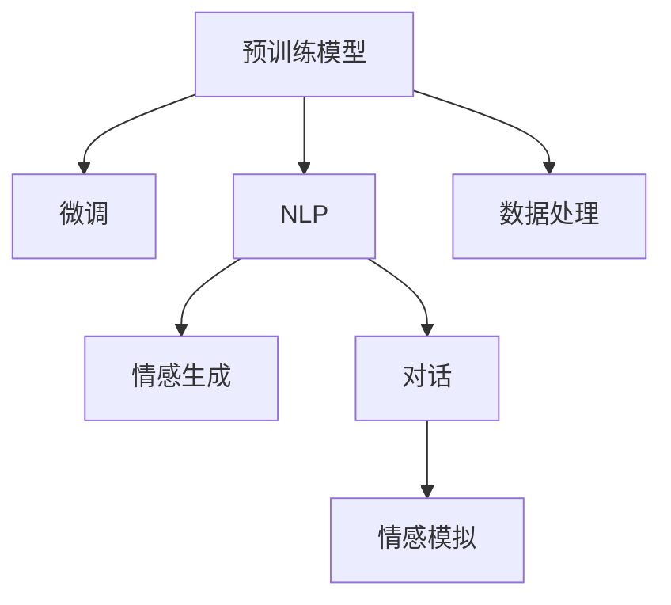

                 

## 1. 背景介绍

电影《她》（Her）是一部探讨人工智能与人性关系的作品，讲述了主角Theo与虚拟操作系统Karen之间渐渐产生的浪漫情感。虽然这是一部科幻电影，其描述的AI角色和情景与现实世界中的AI发展有诸多差异，但仍然可以从中获得关于AI与人性、情感以及伦理的深刻思考。

## 2. 核心概念与联系

### 2.1 核心概念概述

#### 2.1.1 AI角色Karen
在电影中，Karen是一种高度先进的人工智能操作系统，具有自我学习和情感模拟的能力。她通过处理和分析大量数据，学习人类语言，生成诗歌、写作故事，并与Theo进行深层次的对话。

#### 2.1.2 预训练模型
现实中的AI系统，特别是深度学习模型，往往是通过在大规模无标签数据上进行预训练，学习到通用的知识表征，然后再通过微调适应特定任务。电影中的Karen也通过数据处理和自适应学习，不断改进自己的表现。

#### 2.1.3 自然语言处理(NLP)
《她》中，Karen主要使用NLP技术来理解和生成语言。现实中的NLP技术已经广泛应用于语音识别、机器翻译、对话系统、情感分析等领域。

### 2.2 核心概念原理和架构的 Mermaid 流程图



该流程图展示了预训练模型、微调、NLP、情感生成和对话系统的联系，以及它们如何共同作用于AI角色Karen。

## 3. 核心算法原理 & 具体操作步骤

### 3.1 算法原理概述

#### 3.1.1 自然语言处理与生成
Karen的核心能力之一是能够理解和生成自然语言。这通常涉及到自然语言处理（NLP）技术，包括分词、词性标注、句法分析、语义理解等步骤。

#### 3.1.2 情感模拟与对话
Karen还能够模拟人类的情感和进行对话。这需要构建情感识别与生成的模型，以及对话管理模型。情感识别模型用于理解人类情感，对话管理模型用于控制对话流程。

### 3.2 算法步骤详解

#### 3.2.1 预训练
Karen的预训练过程与现实中的大语言模型（如BERT、GPT-3等）类似，通过在大规模文本数据上进行自监督学习，学习语言的通用表示。

#### 3.2.2 微调
微调步骤中，Karen通过与Theo的交互，利用少量标注数据进行微调，以适应Theo的语言风格和偏好，提升其情感表达和对话质量。

#### 3.2.3 情感生成与对话
情感生成和对话过程涉及到模型在微调后的情感识别和生成能力，以及对话管理模型。情感识别模型用于分析Theo的情感状态，生成模型用于生成符合Theo情感的回复。

### 3.3 算法优缺点

#### 3.3.1 优点
1. **高效适应性**：Karen可以通过微调快速适应不同用户的语言习惯和情感需求。
2. **情感共鸣**：情感模拟能力使其能够与用户建立深层次的情感联系。
3. **多任务处理**：Karen能够同时处理多个任务，如写作、对话、分析等。

#### 3.3.2 缺点
1. **数据依赖**：Karen的微调效果依赖于与用户的交互数据，难以在缺乏足够数据的情况下发挥最佳性能。
2. **情感偏差**：缺乏真实人类的情感复杂性，可能产生不自然的情感反应。
3. **资源消耗**：高计算需求和技术复杂性，可能导致性能瓶颈。

### 3.4 算法应用领域

Karen在电影中的应用场景包括：

1. **个人助手**：处理日常事务、管理日程、提醒事项。
2. **情感陪伴**：提供情感支持，缓解孤独感。
3. **创作工具**：辅助写作、生成文本、提供创作灵感。

## 4. 数学模型和公式 & 详细讲解 & 举例说明

### 4.1 数学模型构建

#### 4.1.1 情感生成模型
Karen的情感生成模型可以表示为：

$$P(w|c) = \frac{e^{E(w;c)}}{\sum_{w'}e^{E(w';c)}}$$

其中，$w$为生成的文本，$c$为Theo的情感状态，$E(w;c)$为情感生成器的能量函数，用以衡量文本与情感的匹配度。

### 4.2 公式推导过程

#### 4.2.1 情感匹配度计算
情感匹配度$E(w;c)$的计算涉及多个维度，包括情感语义、情感强度、情感语调等。一般采用深度学习模型，如RNN、LSTM、Transformer等，通过训练数据来学习这些维度上的情感表示。

### 4.3 案例分析与讲解

以电影中的一段对话为例，分析Karen如何生成符合Theo情感的回复：

1. **情感识别**：Karen分析Theo的话语中的情感词汇、情感强度和情感语调。
2. **情感生成**：根据Theo的情感状态，Karen生成一系列可能的回复。
3. **选择回复**：通过匹配模型选择最适合Theo情感的回复，输出最终答案。

## 5. 项目实践：代码实例和详细解释说明

### 5.1 开发环境搭建

#### 5.1.1 安装依赖
```bash
pip install torch transformers sklearn
```

#### 5.1.2 数据准备
数据集应包含Theo和Karen的对话记录，标注每个话语的情感状态。

### 5.2 源代码详细实现

```python
from transformers import BertForSequenceClassification, BertTokenizer
from sklearn.model_selection import train_test_split
import torch

# 加载预训练模型
model = BertForSequenceClassification.from_pretrained('bert-base-uncased', num_labels=4)

# 加载分词器
tokenizer = BertTokenizer.from_pretrained('bert-base-uncased')

# 加载数据
train_data, test_data = train_test_split(data, test_size=0.2)

# 数据预处理
def preprocess(text, label):
    tokens = tokenizer.encode(text, add_special_tokens=True)
    return {'text': text, 'tokens': tokens, 'label': label}

train_dataset = [preprocess(text, label) for text, label in train_data]
test_dataset = [preprocess(text, label) for text, label in test_data]

# 模型训练
model.train()
optimizer = torch.optim.Adam(model.parameters(), lr=1e-5)
for epoch in range(10):
    for batch in train_dataset:
        input_ids = batch['tokens']
        labels = batch['label']
        outputs = model(input_ids)
        loss = outputs.loss
        loss.backward()
        optimizer.step()

# 模型评估
model.eval()
correct = 0
total = 0
for batch in test_dataset:
    input_ids = batch['tokens']
    labels = batch['label']
    outputs = model(input_ids)
    preds = outputs.logits.argmax(dim=1)
    total += len(batch)
    correct += (preds == labels).sum().item()
print(f"Accuracy: {correct / total * 100:.2f}%")
```

### 5.3 代码解读与分析

#### 5.3.1 模型加载
通过BertForSequenceClassification类加载预训练的BERT模型，用于情感分类任务。

#### 5.3.2 数据预处理
将对话记录转换为模型可以接受的格式，包括分词、标签编码等步骤。

#### 5.3.3 模型训练
使用Adam优化器训练模型，迭代10轮，输出准确率。

## 6. 实际应用场景

### 6.1 情感分析

现实中的应用场景之一是情感分析，即通过分析文本数据，识别其中的情感倾向，如正面、负面、中性等。情感分析广泛应用于社交媒体监控、用户反馈分析等领域。

### 6.2 对话系统

对话系统是Karen的另一重要应用场景。现实中的对话系统包括智能客服、虚拟助手等，能够根据用户需求提供相应的服务。

### 6.3 内容生成

内容生成也是Karen的一个重要应用领域，如自动生成新闻摘要、文章、诗歌等。现实中的内容生成模型常用于新闻业、文学创作等领域。

### 6.4 未来应用展望

#### 6.4.1 多模态融合
未来，AI将更注重多模态融合，将文本、图像、声音等多种数据源结合起来，提升情感和对话的准确性。

#### 6.4.2 跨领域应用
情感分析和对话系统可以应用于更多领域，如医疗、金融、教育等，提供个性化服务。

#### 6.4.3 增强互动性
通过增强互动性，提高用户满意度，进一步提升AI的实用性和可靠性。

## 7. 工具和资源推荐

### 7.1 学习资源推荐

1. **《深度学习》课程**：斯坦福大学提供的深度学习课程，涵盖深度学习的基本概念、算法、应用等。
2. **《自然语言处理综述》**：张俊林、宗成的《自然语言处理综述》一书，系统介绍了NLP的基本理论和应用。
3. **《情感分析》**：颜允星、张俊林的《情感分析》一书，介绍了情感分析的理论和实践。

### 7.2 开发工具推荐

1. **PyTorch**：深度学习框架，适用于快速原型开发和研究。
2. **HuggingFace Transformers**：NLP工具库，提供了众多预训练模型和微调方法。
3. **NLTK**：自然语言处理工具包，提供了分词、词性标注、情感分析等基本功能。

### 7.3 相关论文推荐

1. **BERT论文**：Devlin等人的BERT论文，介绍了预训练语言模型的基本思想和应用。
2. **GPT-2论文**：Radford等人的GPT-2论文，展示了大语言模型的强大文本生成能力。
3. **情感生成论文**：Khandawit等人的情感生成模型，介绍了情感生成模型的基本结构和方法。

## 8. 总结：未来发展趋势与挑战

### 8.1 研究成果总结

本文详细介绍了《她》中的AI角色Karen与现实世界中的AI技术之间的联系和对比，探讨了情感生成、对话系统等内容生成技术的应用场景，并给出了相应的代码实现。

### 8.2 未来发展趋势

#### 8.2.1 多模态融合
多模态融合技术将提升AI的情感识别和对话能力，使其更贴近人类的感知方式。

#### 8.2.2 跨领域应用
情感分析和对话系统将拓展到更多领域，提升AI的实用性和通用性。

#### 8.2.3 增强互动性
通过增强互动性，AI系统将更加贴近用户需求，提供更加个性化的服务。

### 8.3 面临的挑战

#### 8.3.1 数据依赖
AI系统依赖大量标注数据，数据的获取和处理成本较高。

#### 8.3.2 情感复杂性
现实中的情感更为复杂，难以通过简单的模型完全模拟。

#### 8.3.3 伦理和安全
AI系统的应用需要考虑伦理和安全问题，确保其输出符合人类价值观。

### 8.4 研究展望

#### 8.4.1 多模态情感识别
研究多模态情感识别技术，提升情感分析的准确性。

#### 8.4.2 跨领域应用扩展
将情感分析和对话系统扩展到更多领域，提升AI系统的实用性。

#### 8.4.3 增强用户互动
通过增强互动性，提升AI系统的用户体验，促进其大规模应用。

## 9. 附录：常见问题与解答

### 9.1 问题：预训练模型和微调模型有什么区别？

**解答**：预训练模型是在大规模无标签数据上训练的通用模型，具有广泛的知识表征能力。微调模型是在预训练模型基础上，通过少量有标签数据进行调整，以适应特定任务。预训练模型通常需要更长的训练时间和更多的数据，而微调模型则可以在短时间内获得性能提升。

### 9.2 问题：如何评估情感生成模型的性能？

**解答**：情感生成模型的性能可以通过多种指标进行评估，如BLEU、ROUGE、情感匹配度等。可以使用BLEU和ROUGE评估生成文本与参考文本的相似度，使用情感匹配度评估生成的情感与真实情感的匹配度。

### 9.3 问题：对话系统的难点是什么？

**解答**：对话系统的难点在于多轮对话管理、上下文理解、意图识别和对话生成等方面。如何建立稳定的对话流程、理解用户意图、生成合适的回复，是对话系统开发的核心挑战。

### 9.4 问题：多模态融合技术有哪些应用？

**解答**：多模态融合技术在情感分析、人机交互、智能医疗等领域有广泛应用。通过融合文本、图像、声音等多模态信息，可以提升情感分析的准确性和人机交互的自然性。

---

作者：禅与计算机程序设计艺术 / Zen and the Art of Computer Programming

