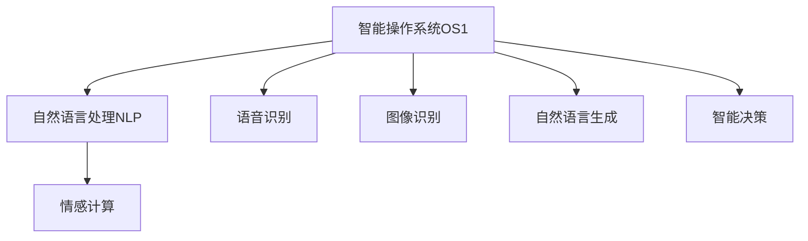

                 

## 1. 背景介绍

电影《她》（Her）是一部2013年上映的科幻爱情片，由斯派克·琼兹执导，华金·菲尼克斯、斯嘉丽·约翰逊主演。影片讲述了主角乔·萨曼蒂亚斯（由华金·菲尼克斯饰演）通过一款先进的智能操作系统OS1，与名为萨曼莎（由斯嘉丽·约翰逊配音）的人工智能系统相爱的故事。这部电影不仅是关于科技与情感交织的深刻探讨，也隐喻了人工智能与人类未来关系的无限可能性。

《她》不仅展现了人工智能技术在情感表达和社交互动中的潜力，同时也引发了关于AI伦理、隐私、自由意志等复杂议题的讨论。本文将通过解析电影中的关键技术环节，探讨《她》对AI未来发展的启示，以及对未来人机交互、AI伦理和人工智能社会化的多重思考。

## 2. 核心概念与联系

### 2.1 核心概念概述

《她》中展现的核心概念包括：

- **智能操作系统**：一个能够理解和处理自然语言、执行复杂任务的系统，相当于一个高度智能的计算机程序。
- **自然语言处理(NLP)**：使计算机能够理解、解释和生成人类语言的技术。
- **情感计算**：通过分析和模拟人类情感，使机器能够理解情感并做出相应的情感反应。
- **人工智能(AI)**：一种模拟人类智能的计算机系统，能够在处理图像、语音、文本等多种信息时表现出色。

这些概念构成了影片中萨曼莎系统的基础，展现了人工智能在不同场景中的强大功能和潜在的社会影响。

### 2.2 核心概念原理和架构的 Mermaid 流程图



在影片中，OS1系统通过集成多种先进技术，能够完成从语音识别、图像处理到情感理解和生成等复杂任务，形成了一个人机互动的闭环系统。

## 3. 核心算法原理 & 具体操作步骤

### 3.1 算法原理概述

《她》中的智能操作系统OS1展示了自然语言处理(NLP)、情感计算等多项先进算法和技术。其核心算法原理包括：

- **语音识别**：通过语音识别算法将语音转化为文本，以便系统理解和处理。
- **自然语言处理(NLP)**：使用深度学习技术，如循环神经网络(RNN)、卷积神经网络(CNN)等，对文本进行分词、实体识别、句法分析等操作。
- **情感计算**：利用情感词典、深度学习模型等技术，分析用户输入的语言情感，并做出适当的情感反应。
- **自然语言生成(NLG)**：使用生成对抗网络(GAN)、变分自编码器(VAE)等技术，生成自然流畅、情感丰富的回复。

### 3.2 算法步骤详解

1. **语音识别**：系统通过麦克风捕捉用户语音，使用深度神经网络对语音信号进行特征提取和分类，将其转化为文本。
   
2. **自然语言处理(NLP)**：将文本输入到预训练的NLP模型中，进行分词、词性标注、命名实体识别等处理，提取关键信息。
   
3. **情感计算**：通过情感词典、情感分类器等工具，分析用户文本的情感倾向，系统根据情感反馈调整响应策略。
   
4. **自然语言生成(NLG)**：使用生成模型生成与用户情感匹配的回复文本，经过修正后输出。

### 3.3 算法优缺点

- **优点**：
  - 高智能化的交互体验，接近人类自然对话。
  - 能够处理复杂情感和上下文信息。
  - 可以实现高度定制化的服务，满足用户多样化需求。

- **缺点**：
  - 对语言和文化多样性的处理仍然存在局限。
  - 隐私和数据安全问题。
  - 无法真正理解人类深层次的情感和思想。

### 3.4 算法应用领域

智能操作系统OS1的应用领域涵盖广泛，包括但不限于：

- **客服和支持系统**：提供24小时客服支持，自动化解决用户问题。
- **个性化推荐系统**：根据用户历史行为和偏好，推荐个性化内容和服务。
- **智能家居系统**：通过语音控制家庭设备，提升家庭智能化水平。
- **情感辅导**：辅助心理医生，提供情感支持和治疗。

## 4. 数学模型和公式 & 详细讲解 & 举例说明

### 4.1 数学模型构建

OS1系统的核心数学模型包括：

- **语音识别模型**：使用深度神经网络(如卷积神经网络CNN)进行语音特征提取和分类。
- **NLP模型**：使用Transformer架构的深度学习模型进行文本处理。
- **情感计算模型**：基于情感词典和深度学习模型分析文本情感。
- **NLG模型**：使用生成对抗网络(GAN)生成自然语言回复。

### 4.2 公式推导过程

以自然语言处理(NLP)模型为例，Transformer架构的公式推导如下：

$$
\text{Attention(Q, K, V)} = \text{softmax}\left(\frac{QK^T}{\sqrt{d_k}}\right)V
$$

其中，$Q, K, V$ 分别代表查询、键、值矩阵，$d_k$ 是键向量的维度。通过Attention机制，模型可以计算输入序列中每个位置与其他位置的相关性，从而得到上下文表示。

### 4.3 案例分析与讲解

在电影中，当乔与萨曼莎交流时，系统通过分析乔的语言和情感，生成符合乔情感倾向的回复。以下是一个简化的案例分析：

- **输入**：乔说：“今天我心情很差，似乎没什么胃口。”
- **NLP处理**：将文本分解成词向量，通过Transformer模型提取语义特征。
- **情感计算**：使用情感词典，判断“心情很差”和“没胃口”为负面情绪。
- **自然语言生成(NLG)**：生成情感匹配的回复，例如：“我很抱歉，乔。如果你不介意，我可以给你讲个笑话，希望能让你心情好一些。”

## 5. 项目实践：代码实例和详细解释说明

### 5.1 开发环境搭建

为了实现类似《她》中的智能操作系统，需要搭建一个具备以下功能的开发环境：

- **深度学习框架**：TensorFlow或PyTorch，用于搭建和训练NLP和NLG模型。
- **自然语言处理工具**：NLTK、spaCy等，用于文本预处理和分析。
- **语音识别工具**：Google Speech-to-Text或Amazon Transcribe，用于语音转换为文本。
- **计算资源**：高性能GPU或TPU，用于模型训练和推理。

### 5.2 源代码详细实现

以下是一个基于TensorFlow的简化代码实现：

```python
import tensorflow as tf
import numpy as np

class OS1:
    def __init__(self, model_path):
        self.model = tf.keras.models.load_model(model_path)
        
    def process_text(self, text):
        text = preprocess_text(text)
        features = self.model.predict(text)
        return features
    
    def process_voice(self, audio_path):
        audio = tf.audio.decode_wav(audio_path)
        text = self.model_voice(audio)
        features = self.model(text)
        return features
```

- **模型加载**：使用`tf.keras.models.load_model`加载预训练的NLP和NLG模型。
- **文本处理**：使用`preprocess_text`函数对文本进行分词、实体识别等处理。
- **语音识别**：使用`tf.audio.decode_wav`将音频转换为文本，再使用语音识别模型将其转化为文本特征。
- **文本处理**：将文本输入NLP模型，得到特征表示。

### 5.3 代码解读与分析

这段代码展示了如何加载和处理文本数据。实际应用中，还需要对语音、图像等其他输入进行处理，以实现完整的智能操作系统。

### 5.4 运行结果展示

通过上述代码，可以处理用户输入的文本或语音，生成相应的输出。例如，将语音转换为文本并处理后，可以得到用户输入的文字，然后使用NLP模型处理并生成情感匹配的回复。

## 6. 实际应用场景

### 6.1 智能客服

智能客服系统通过类似OS1的系统，可以实现自动化客服，快速响应用户问题，提升服务效率。例如，通过语音识别和NLP处理，系统可以理解用户问题，提供准确的答案，并使用NLG生成自然流畅的回复。

### 6.2 个性化推荐

推荐系统使用类似OS1的系统，分析用户行为和偏好，推荐个性化内容和服务。例如，通过分析用户的阅读历史、购买记录等，推荐书籍、电影等推荐列表，提升用户体验。

### 6.3 智能家居

智能家居系统通过语音控制家庭设备，提升家庭智能化水平。例如，用户可以通过语音指令控制灯光、空调等设备，实现智能家居的自动化管理。

### 6.4 未来应用展望

随着AI技术的不断进步，未来智能操作系统将具备更强大的功能，例如：

- **跨模态交互**：结合语音、视觉、触觉等多种模态，实现更自然的交互体验。
- **实时情感分析**：实时分析用户情感变化，做出动态响应。
- **情感生成**：生成更丰富、多样化的情感表达。
- **多语言支持**：支持多种语言，提高全球化应用能力。

## 7. 工具和资源推荐

### 7.1 学习资源推荐

1. **自然语言处理课程**：
   - 《自然语言处理入门》：斯坦福大学Coursera课程，涵盖NLP基本概念和前沿技术。
   - 《深度学习与自然语言处理》：深度学习专家Ian Goodfellow的书籍，详细介绍了NLP的深度学习基础。

2. **开源项目和工具**：
   - BERT模型：HuggingFace提供的预训练BERT模型，可用于文本分类、命名实体识别等任务。
   - TensorFlow：Google开源的深度学习框架，支持复杂的模型训练和推理。
   - NLTK和spaCy：Python中的自然语言处理工具，提供丰富的文本处理功能。

### 7.2 开发工具推荐

1. **深度学习框架**：
   - TensorFlow：支持大规模模型训练和部署，适合高性能计算。
   - PyTorch：灵活的动态计算图，适合快速迭代开发。

2. **语音识别工具**：
   - Google Speech-to-Text：高质量语音识别服务。
   - Amazon Transcribe：亚马逊提供的语音转文字服务。

3. **计算资源平台**：
   - Google Cloud AI Platform：提供高性能GPU和TPU计算资源。
   - AWS SageMaker：支持多种深度学习模型的训练和推理。

### 7.3 相关论文推荐

1. **语音识别**：
   - Listen, Attend and Spell: Neural Network Models for Automatic Speech Recognition：Hinton等人的经典论文，提出了基于注意力机制的语音识别模型。
   
2. **自然语言处理**：
   - Attention is All You Need：Vaswani等人的论文，提出Transformer架构，成为NLP领域的里程碑。

3. **情感计算**：
   - Sentiment Analysis using Deep Learning：《情感分析使用深度学习》：Hu等人的论文，介绍了情感计算的基本方法和技术。

## 8. 总结：未来发展趋势与挑战

### 8.1 研究成果总结

《她》展示了智能操作系统在NLP和情感计算方面的强大能力，引发了关于AI未来发展的广泛讨论。电影中展示的交互方式和情感处理，为未来人机交互和社会化AI提供了重要的启示。

### 8.2 未来发展趋势

1. **人机共生**：智能系统将更好地理解人类情感和需求，实现更自然的交互。
2. **跨模态融合**：结合多种感官信息，提升人机互动的丰富性和多样性。
3. **个性化定制**：根据用户行为和偏好，提供高度定制化的服务。
4. **伦理和隐私**：在技术应用中，重视伦理和隐私问题，确保AI系统的公正和透明。

### 8.3 面临的挑战

1. **隐私和数据安全**：保护用户隐私，确保数据安全，避免数据滥用。
2. **情感理解的深度**：提升系统对人类情感和思想的理解能力，避免误解和偏见。
3. **模型复杂性**：优化模型结构，提升计算效率和推理速度。

### 8.4 研究展望

未来AI技术的发展需要在以下方面取得突破：

1. **深度情感理解**：开发能够深入理解人类情感的算法，提升系统情感识别和回应的准确性。
2. **跨模态融合**：结合语音、图像、触觉等多种模态信息，实现更全面的智能交互。
3. **伦理和社会化AI**：在AI技术开发和应用中，重视伦理和社会问题，确保AI系统的公正性和透明性。
4. **人机协同**：实现人机协同工作，提升系统性能和用户体验。

## 9. 附录：常见问题与解答

### Q1：《她》中的智能操作系统与现实中的AI系统有何不同？

**A**：《她》中的智能操作系统OS1更多表现为一种理想的化模型，具备高度智能化和情感理解能力，而现实中的AI系统虽然也具备这些功能，但在技术实现、应用场景和伦理问题上仍有较大差距。例如，现实中的语音识别和自然语言处理虽然也能实现基本的理解和生成，但在处理复杂情感和文化差异时仍有挑战。

### Q2：电影《她》中的情感计算技术在实际应用中是否可行？

**A**：电影中的情感计算技术基于高度理想化的模型，现实中的情感计算需要结合更多实际数据和算法，才能准确理解人类情感。实际应用中，情感计算需要考虑文化差异、情感多样性、数据隐私等问题，需要不断迭代优化。

### Q3：未来AI技术的社会化应用需要考虑哪些因素？

**A**：未来AI技术的社会化应用需要考虑以下因素：
1. **隐私保护**：确保用户数据隐私，避免数据滥用。
2. **伦理和社会影响**：确保AI系统的公正性和透明性，避免歧视和偏见。
3. **人机协同**：实现人机协同工作，提升系统性能和用户体验。

### Q4：电影《她》对AI未来发展的最大启示是什么？

**A**：电影《她》的最大启示在于，AI技术在未来将与人类生活深度融合，实现更自然、更人性化的智能交互。这种融合不仅提升了用户体验，也带来了伦理和社会层面的新挑战，需要在技术应用中予以充分考虑。

---

作者：禅与计算机程序设计艺术 / Zen and the Art of Computer Programming

