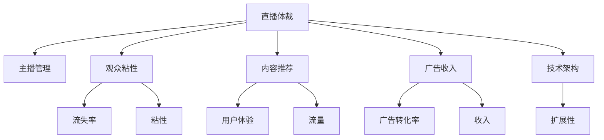

                 

# 直播体裁的经营形态效率

## 1. 背景介绍

### 1.1 问题由来
直播体裁作为一种新兴的娱乐形式，近年来在全球范围内迅速崛起。以YouTube、Twitch、Bilibili等为代表的各大直播平台，吸引了数以亿计的活跃用户。直播内容不仅包括游戏直播、才艺表演等娱乐节目，还有技术演示、教育讲座等专业内容。直播体裁因其即时互动、丰富多样的内容形式，深受用户青睐。

然而，直播平台的经营效率始终面临诸多挑战。主播流失、观众流失、广告收入下降等问题频发。直播平台需要在内容多样化、用户体验、运营效率等多方面进行优化，以实现可持续发展。

### 1.2 问题核心关键点
直播体裁的经营效率问题，主要体现在以下几个方面：

- **主播管理与留存**：主播作为直播内容的主要生产者，其活跃度与留存率直接影响平台内容的多样性与丰富度。如何通过有效的管理手段，提升主播满意度和留存率，是直播平台亟待解决的问题。
- **观众粘性**：观众是直播平台的核心用户群体，其活跃度和留存率决定了平台的整体流量和商业价值。如何通过精细化运营策略，增强观众粘性，降低流失率，是直播平台的重要课题。
- **内容推荐**：直播平台的内容海量和实时性要求高效的推荐算法，以提升用户体验和平台流量。如何设计高效的内容推荐算法，是直播平台面临的技术挑战。
- **广告与收入**：直播平台的收入模式以广告为主，如何通过优化广告投放策略，提升广告转化率，拓展更多收入渠道，是直播平台发展的核心驱动力。
- **技术架构与扩展性**：直播平台需要支撑海量并发用户、实时流传输、复杂互动行为等技术需求，如何构建高效的技术架构，保障平台的稳定扩展，是技术团队的长期任务。

### 1.3 问题研究意义
研究直播体裁的经营效率问题，对于提升直播平台的运营效果、增强用户体验、开拓新的商业机会具有重要意义：

1. **提升平台粘性**：通过有效的管理与运营策略，提升主播和观众的留存率，增强平台的活跃度与用户粘性。
2. **优化广告收入**：通过优化广告投放策略，提升广告转化率，拓展更多收入来源，保障平台的可持续发展。
3. **提升用户体验**：通过高效的内容推荐算法，提升观众的观看体验，吸引更多用户加入。
4. **增强技术能力**：通过构建高效的技术架构，保障平台的稳定扩展，提升技术竞争力。
5. **促进产业升级**：直播体裁作为一种新兴的娱乐形式，具有广阔的市场前景。提升平台的经营效率，有助于推动直播行业的健康发展。

## 2. 核心概念与联系

### 2.1 核心概念概述

为了更好地理解直播体裁的经营效率问题，本节将介绍几个密切相关的核心概念：

- **直播体裁**：通过实时流传输的方式，呈现主播与观众的互动内容。包括游戏直播、才艺表演、技术演示、教育讲座等多种形式。
- **主播管理**：主播是直播内容的主要生产者，通过有效的管理手段提升主播满意度和留存率，是直播平台的核心运营任务。
- **观众粘性**：观众是直播平台的核心用户群体，通过精细化运营策略增强观众粘性，降低流失率，是直播平台的重要目标。
- **内容推荐**：直播平台需要高效的内容推荐算法，以提升用户体验和平台流量。
- **广告收入**：直播平台的收入模式以广告为主，通过优化广告投放策略，提升广告转化率，拓展更多收入来源。
- **技术架构**：直播平台需要支撑海量并发用户、实时流传输、复杂互动行为等技术需求，构建高效的技术架构是技术团队的长期任务。

这些核心概念之间的逻辑关系可以通过以下Mermaid流程图来展示：



这个流程图展示了直播体裁的各个核心概念及其之间的关系：

1. 直播体裁通过主播管理来提升主播满意度和留存率。
2. 观众粘性通过精细化运营策略来增强，降低流失率。
3. 内容推荐算法提升用户体验和平台流量。
4. 广告收入通过优化广告投放策略，提升转化率，拓展更多收入渠道。
5. 技术架构支撑平台的稳定扩展。

这些概念共同构成了直播体裁的运营框架，使得平台能够更好地满足用户需求，实现可持续发展。

## 3. 核心算法原理 & 具体操作步骤
### 3.1 算法原理概述

直播体裁的经营效率问题，本质上是多目标优化问题。直播平台需要在用户留存、内容质量、广告转化、平台扩展等多方面进行优化，以实现整体效能的最大化。

形式化地，假设直播平台的目标函数为 $\mathcal{L}(\text{Content},\text{Ad},\text{User},\text{Tech})$，其中：

- $\text{Content}$：内容推荐算法，通过优化内容推荐策略，提升用户体验和平台流量。
- $\text{Ad}$：广告投放策略，通过优化广告投放，提升广告转化率和收入。
- $\text{User}$：主播管理策略，通过提升主播满意度和留存率，增强平台内容的多样性。
- $\text{Tech}$：技术架构优化，通过构建高效的技术架构，保障平台的稳定扩展。

直播平台的目标是最大化目标函数 $\mathcal{L}$，即找到最优的策略组合：

$$
(\text{Content}^*,\text{Ad}^*,\text{User}^*,\text{Tech}^*)=\mathop{\arg\min}_{(\text{Content},\text{Ad},\text{User},\text{Tech})} \mathcal{L}(\text{Content},\text{Ad},\text{User},\text{Tech})
$$

通过上述框架，直播平台可以系统性地优化各环节的策略，实现整体效能的提升。

### 3.2 算法步骤详解

直播体裁的经营效率优化，主要包括以下几个关键步骤：

**Step 1: 收集数据**

- 收集平台的用户行为数据，包括主播活跃度、观众留存率、互动行为等。
- 收集内容数据，包括内容属性、热门度、用户评分等。
- 收集广告数据，包括广告展示次数、点击次数、转化率等。
- 收集技术数据，包括服务器负载、带宽使用、系统响应时间等。

**Step 2: 建立模型**

- 基于收集的数据，构建用户流失预测模型、内容推荐模型、广告转化模型、技术架构优化模型。
- 用户流失预测模型：通过分析用户行为数据，预测用户的流失概率，优化主播管理策略。
- 内容推荐模型：通过分析用户行为和内容属性，推荐用户感兴趣的内容，提升用户体验。
- 广告转化模型：通过分析广告数据和用户行为，优化广告投放策略，提升广告转化率。
- 技术架构优化模型：通过分析技术数据，优化技术架构，保障平台稳定扩展。

**Step 3: 优化策略**

- 基于建立模型，优化主播管理策略、内容推荐策略、广告投放策略和技术架构策略。
- 主播管理策略：通过流失预测模型，优化主播激励机制，提升主播满意度和留存率。
- 内容推荐策略：通过推荐模型，提升观众粘性和平台流量。
- 广告投放策略：通过转化模型，优化广告投放策略，提升广告转化率和收入。
- 技术架构策略：通过架构优化模型，提升平台的稳定性和扩展性。

**Step 4: 评估效果**

- 在优化策略后，评估各策略的效果。
- 用户流失预测模型：评估流失率的变化，优化主播管理策略。
- 内容推荐模型：评估用户体验和平台流量的提升情况。
- 广告转化模型：评估广告转化率和收入的提升情况。
- 技术架构优化模型：评估平台的稳定性和扩展性。

**Step 5: 迭代优化**

- 根据评估结果，进行迭代优化。
- 主播管理策略：根据流失预测结果，不断调整激励机制，提升主播满意度和留存率。
- 内容推荐策略：根据用户体验和平台流量变化，不断优化推荐算法。
- 广告投放策略：根据广告转化率和收入变化，不断调整投放策略。
- 技术架构策略：根据技术数据，不断优化技术架构。

### 3.3 算法优缺点

直播体裁的经营效率优化方法具有以下优点：

1. **系统性优化**：通过构建多目标优化框架，系统性地优化各环节策略，实现整体效能的最大化。
2. **量化评估**：通过建立模型和量化指标，能够客观评估各策略的效果，指导优化方向。
3. **迭代改进**：通过不断迭代优化，能够逐步提升平台的用户留存、内容质量、广告转化和技术架构。

同时，该方法也存在一定的局限性：

1. **数据依赖**：优化策略的制定和调整高度依赖于数据的质量和完整性。
2. **模型复杂度**：多目标优化模型需要考虑多个维度和复杂的交互关系，模型设计和训练较为复杂。
3. **策略冲突**：不同策略之间可能存在冲突，需要综合平衡各目标。
4. **动态变化**：用户行为和技术环境不断变化，需要持续监测和调整策略。

尽管存在这些局限性，但就目前而言，系统性优化和多目标优化方法仍然是直播体裁经营效率提升的重要手段。

### 3.4 算法应用领域

直播体裁的经营效率优化方法，在直播平台的多领域应用中得到了广泛的应用，包括但不限于：

- **主播管理**：通过流失预测模型，优化主播激励机制，提升主播满意度和留存率。
- **内容推荐**：通过推荐模型，提升用户体验和平台流量。
- **广告投放**：通过转化模型，优化广告投放策略，提升广告转化率和收入。
- **技术架构**：通过架构优化模型，提升平台的稳定性和扩展性。
- **用户粘性提升**：通过精细化运营策略，增强观众粘性，降低流失率。

除了上述这些经典应用外，直播体裁的经营效率优化方法还将在更多场景中得到应用，如用户行为分析、市场预测、业务合作等，为直播平台的持续发展提供支持。

## 4. 数学模型和公式 & 详细讲解  
### 4.1 数学模型构建

本节将使用数学语言对直播体裁的经营效率优化方法进行更加严格的刻画。

记直播平台的目标函数为 $\mathcal{L}(\text{Content},\text{Ad},\text{User},\text{Tech})$，其中：

- $\text{Content}$：内容推荐算法，目标函数为 $\mathcal{L}_{\text{Content}}(\text{User},\text{Content})$，衡量内容推荐对用户体验和流量的提升效果。
- $\text{Ad}$：广告投放策略，目标函数为 $\mathcal{L}_{\text{Ad}}(\text{Ad},\text{User},\text{Content})$，衡量广告转化率和收入的提升效果。
- $\text{User}$：主播管理策略，目标函数为 $\mathcal{L}_{\text{User}}(\text{User},\text{Content},\text{Ad})$，衡量主播满意度和留存率的提升效果。
- $\text{Tech}$：技术架构优化，目标函数为 $\mathcal{L}_{\text{Tech}}(\text{User},\text{Content},\text{Ad})$，衡量平台的稳定性和扩展性的提升效果。

直播平台的目标是最大化目标函数 $\mathcal{L}$，即找到最优的策略组合：

$$
(\text{Content}^*,\text{Ad}^*,\text{User}^*,\text{Tech}^*)=\mathop{\arg\min}_{(\text{Content},\text{Ad},\text{User},\text{Tech})} \mathcal{L}(\text{Content},\text{Ad},\text{User},\text{Tech})
$$

### 4.2 公式推导过程

以下我们以用户流失预测模型为例，推导基于回归模型的流失预测公式及其梯度计算。

假设用户流失概率 $P$ 可以用线性回归模型 $f(x)$ 来表示：

$$
P=f(x;\theta)=\theta_0+\theta_1x_1+\theta_2x_2+\cdots+\theta_nx_n
$$

其中 $x_i$ 为输入变量，$\theta_i$ 为模型参数。使用最小二乘法估计模型参数 $\theta$：

$$
\hat{\theta}=\mathop{\arg\min}_{\theta} \sum_{i=1}^m (y_i-f(x_i;\theta))^2
$$

通过链式法则，目标函数对参数 $\theta_k$ 的梯度为：

$$
\frac{\partial \mathcal{L}(\theta)}{\partial \theta_k} = -\frac{2}{m}\sum_{i=1}^m (y_i-f(x_i;\theta))x_{ik}
$$

在得到梯度后，即可带入优化算法（如梯度下降），完成模型的迭代优化。重复上述过程直至收敛，最终得到流失预测模型 $\hat{P}=f(x;\hat{\theta})$。

## 5. 项目实践：代码实例和详细解释说明
### 5.1 开发环境搭建

在进行直播体裁的经营效率优化实践前，我们需要准备好开发环境。以下是使用Python进行Scikit-learn开发的环境配置流程：

1. 安装Anaconda：从官网下载并安装Anaconda，用于创建独立的Python环境。

2. 创建并激活虚拟环境：
```bash
conda create -n pythontest python=3.8 
conda activate pythontest
```

3. 安装Scikit-learn：
```bash
conda install scikit-learn
```

4. 安装必要的库：
```bash
pip install pandas numpy matplotlib seaborn
```

完成上述步骤后，即可在`pythontest`环境中开始经营效率优化实践。

### 5.2 源代码详细实现

下面我们以用户流失预测模型为例，给出使用Scikit-learn进行数据处理和模型训练的Python代码实现。

首先，定义流失预测模型类：

```python
from sklearn.linear_model import LinearRegression

class UserLossPredictionModel:
    def __init__(self, n_features):
        self.model = LinearRegression(n_features=n_features)
    
    def fit(self, X, y):
        self.model.fit(X, y)
    
    def predict(self, X):
        return self.model.predict(X)
```

然后，定义数据预处理和模型训练函数：

```python
import pandas as pd
from sklearn.model_selection import train_test_split
from sklearn.metrics import mean_squared_error

def preprocess_data(data):
    # 数据清洗
    data.dropna(inplace=True)
    # 数据标准化
    from sklearn.preprocessing import StandardScaler
    scaler = StandardScaler()
    X = scaler.fit_transform(data.drop('流失率', axis=1))
    y = data['流失率']
    return X, y

def train_model(X, y, test_size=0.2):
    X_train, X_test, y_train, y_test = train_test_split(X, y, test_size=test_size, random_state=42)
    model = UserLossPredictionModel(n_features=X.shape[1])
    model.fit(X_train, y_train)
    y_pred = model.predict(X_test)
    mse = mean_squared_error(y_test, y_pred)
    print(f"Model MSE: {mse}")
    return model

# 数据集
data = pd.read_csv('user_data.csv')
X, y = preprocess_data(data)

# 训练模型
model = train_model(X, y)
```

在上述代码中，我们使用了Scikit-learn库中的线性回归模型，对用户流失率进行了预测。数据预处理步骤包括数据清洗和标准化。训练模型时，我们将数据集分为训练集和测试集，使用均方误差作为模型评估指标。

### 5.3 代码解读与分析

让我们再详细解读一下关键代码的实现细节：

**UserLossPredictionModel类**：
- `__init__`方法：初始化模型，设置线性回归模型。
- `fit`方法：训练模型，使用训练数据拟合线性回归模型。
- `predict`方法：预测，使用训练好的模型对新数据进行预测。

**preprocess_data函数**：
- 数据清洗：删除缺失值，确保模型训练数据完整。
- 数据标准化：使用标准化方法将数据缩放到[0,1]区间，防止数据量级不同影响模型效果。

**train_model函数**：
- 数据集划分：将数据集划分为训练集和测试集，使用测试集评估模型性能。
- 模型训练：使用训练集数据拟合线性回归模型，得到模型预测结果。
- 模型评估：计算均方误差，评估模型预测准确度。

通过以上步骤，我们成功构建了一个简单的用户流失预测模型。在实际应用中，还需要结合具体的业务需求，对模型进行进一步的优化和调整。

## 6. 实际应用场景
### 6.1 智能推荐系统

智能推荐系统是直播体裁经营效率优化的重要应用场景。通过分析用户行为数据和内容属性，推荐系统可以为用户推荐感兴趣的内容，提升用户体验和平台流量。

具体而言，可以收集用户的历史观看记录、点赞、评论、分享等行为数据，提取并编码为特征向量。同时，分析热门内容、内容类型、主播信息等属性数据，构建推荐模型。通过优化推荐算法，提升观众粘性和平台流量，实现业务增长。

### 6.2 广告投放优化

广告投放是直播体裁的收入来源之一。通过优化广告投放策略，提升广告转化率，拓展更多收入渠道，是直播平台的重要任务。

在广告投放优化中，可以构建点击率预测模型，预测用户对广告的响应概率。基于预测结果，优化广告投放策略，提升广告转化率和收入。例如，可以使用A/B测试，对比不同广告形式的效果，选择最佳广告策略。

### 6.3 主播管理优化

主播管理是直播体裁运营的关键环节。通过流失预测模型，优化主播激励机制，提升主播满意度和留存率，增强平台内容的多样性和丰富度。

具体而言，可以收集主播的活跃度、互动数据、收入数据等行为数据，构建流失预测模型。通过流失预测结果，优化主播激励策略，如主播签约奖励、直播分成比例等，提升主播满意度和留存率。

### 6.4 技术架构优化

技术架构优化是直播体裁经营效率优化的重要方向。通过构建高效的技术架构，保障平台的稳定扩展，提升用户体验。

具体而言，可以构建流量预测模型，预测平台流量高峰期的访问量和用户行为。基于预测结果，优化服务器资源分配和负载均衡策略，保障平台的高可用性和稳定性。同时，引入容器化技术、微服务架构等现代技术手段，提升平台的扩展性和运维效率。

### 6.5 未来应用展望

随着直播体裁的不断发展，直播平台的经营效率优化方法将在更多领域得到应用，为直播平台的持续发展提供支持。

在智慧医疗领域，直播体裁可以作为医疗教育的重要手段，通过直播平台进行医学知识普及和远程教学，提升医疗服务的普及性和可及性。

在智能教育领域，直播体裁可以作为教育资源共享的重要工具，通过直播平台进行远程教育，提升教育资源的利用效率。

在智慧城市治理中，直播体裁可以作为城市事件监测的重要手段，通过直播平台实时监测城市事件，提升城市管理的自动化和智能化水平。

此外，在企业培训、文化交流、娱乐社交等众多领域，直播体裁的经营效率优化方法也将不断涌现，为直播平台的持续发展提供新的应用场景。相信随着技术的日益成熟，直播体裁的经营效率优化方法将不断推动直播行业的健康发展，带来新的商业机会和用户价值。

## 7. 工具和资源推荐
### 7.1 学习资源推荐

为了帮助开发者系统掌握直播体裁的经营效率优化理论基础和实践技巧，这里推荐一些优质的学习资源：

1. 《数据科学实战》系列博文：由数据科学领域的专家撰写，深入浅出地介绍了数据科学的基本概念和实践方法。

2. 《Python深度学习》书籍：深度学习领域的经典教材，详细介绍了Python在深度学习中的应用。

3. 《机器学习实战》书籍：机器学习领域的入门教材，讲解了机器学习的基本原理和实现方法。

4. Scikit-learn官方文档：Scikit-learn库的官方文档，提供了丰富的机器学习算法和示例代码。

5. Kaggle平台：数据科学竞赛平台，提供大量的公开数据集和竞赛任务，帮助你实践和提升数据科学技能。

通过对这些资源的学习实践，相信你一定能够快速掌握直播体裁的经营效率优化精髓，并用于解决实际的业务问题。
###  7.2 开发工具推荐

高效的开发离不开优秀的工具支持。以下是几款用于直播体裁经营效率优化开发的常用工具：

1. Python：广泛使用的编程语言，具有丰富的数据科学库和机器学习库。

2. Scikit-learn：Python中的机器学习库，提供了丰富的机器学习算法和工具。

3. Pandas：Python中的数据分析库，提供了高效的数据处理和分析能力。

4. NumPy：Python中的数值计算库，提供了高效的多维数组和矩阵运算能力。

5. Matplotlib：Python中的数据可视化库，提供了丰富的绘图功能。

合理利用这些工具，可以显著提升直播体裁经营效率优化任务的开发效率，加快创新迭代的步伐。

### 7.3 相关论文推荐

直播体裁的经营效率优化技术的发展源于学界的持续研究。以下是几篇奠基性的相关论文，推荐阅读：

1. "A Survey on Recommendation Systems for Multi-Platform Streaming Video"：综述了多平台流媒体推荐系统的前沿研究。

2. "Streaming Service Survival Prediction with Deep Learning"：利用深度学习模型预测流媒体服务的生存率。

3. "Real-time Bid Optimization for Streamed Video Advertising"：利用实时竞价技术优化流媒体广告投放策略。

4. "Data Management and User Interactions in Streaming Media Systems"：介绍了流媒体系统中的数据管理和用户交互技术。

5. "Streaming Video Systems: Architectures, Challenges, and Future Directions"：综述了流媒体系统的架构、挑战和未来方向。

这些论文代表了大数据和流媒体推荐系统的发展脉络。通过学习这些前沿成果，可以帮助研究者把握学科前进方向，激发更多的创新灵感。

## 8. 总结：未来发展趋势与挑战

### 8.1 总结

本文对直播体裁的经营效率优化方法进行了全面系统的介绍。首先阐述了直播体裁和微调技术的研究背景和意义，明确了微调在提升平台运营效果、增强用户体验、开拓新业务上的独特价值。其次，从原理到实践，详细讲解了多目标优化的数学模型和关键步骤，给出了直播体裁经营效率优化方法的完整代码实现。同时，本文还广泛探讨了直播体裁在智能推荐、广告投放、主播管理等领域的实际应用，展示了微调范式的巨大潜力。此外，本文精选了微调技术的各类学习资源，力求为读者提供全方位的技术指引。

通过本文的系统梳理，可以看到，直播体裁的经营效率优化方法已经逐步成熟，为直播平台的持续发展提供了有力支撑。相信随着技术的不断演进，直播体裁的经营效率优化方法将不断完善，进一步提升平台的运营效率和用户价值。

### 8.2 未来发展趋势

展望未来，直播体裁的经营效率优化技术将呈现以下几个发展趋势：

1. **技术融合与创新**：直播体裁的经营效率优化将与大数据、人工智能、区块链等前沿技术进行深度融合，推动技术创新和应用升级。

2. **用户行为分析**：通过更加精细化的用户行为分析，优化用户推荐和流失预测，提升用户体验和留存率。

3. **广告投放精准化**：利用深度学习和实时竞价技术，提升广告投放的精准度和转化率，优化广告收入。

4. **主播激励机制**：通过智能化的主播管理策略，提升主播满意度和留存率，增强平台内容的多样性。

5. **技术架构优化**：构建高效的技术架构，保障平台稳定扩展，提升用户体验和平台流量。

以上趋势凸显了直播体裁经营效率优化的广阔前景，这些方向的探索发展，将进一步提升直播平台的运营效果，增强用户体验，推动直播行业的健康发展。

### 8.3 面临的挑战

尽管直播体裁的经营效率优化技术已经取得了显著进展，但在迈向更加智能化、普适化应用的过程中，仍面临诸多挑战：

1. **数据质量和隐私**：高质量的数据是优化策略的基础，如何获取和处理高质量的数据，同时保障用户隐私，是一个重要挑战。

2. **模型复杂性和效率**：多目标优化模型需要考虑多个维度和复杂的交互关系，模型设计和训练较为复杂，如何提高模型的效率和可解释性，是一个重要课题。

3. **策略平衡与冲突**：不同策略之间可能存在冲突，需要综合平衡各目标，找到一个最优的策略组合。

4. **动态变化和持续优化**：用户行为和技术环境不断变化，如何持续监测和调整策略，确保优化效果的持续性，是一个长期任务。

5. **技术架构的扩展性**：直播平台需要支撑海量并发用户、实时流传输、复杂互动行为等技术需求，如何构建高效的技术架构，保障平台的稳定扩展，是一个重要挑战。

6. **可解释性和透明度**：直播体裁的经营效率优化方法涉及多个复杂的模型和算法，如何提高模型的可解释性和透明度，确保用户和企业的信任，是一个重要课题。

正视这些挑战，积极应对并寻求突破，将是大数据和流媒体推荐系统不断发展和完善的重要路径。相信随着学界和产业界的共同努力，这些挑战终将一一被克服，直播体裁的经营效率优化方法必将在构建人机协同的智能时代中扮演越来越重要的角色。

### 8.4 研究展望

面对直播体裁经营效率优化所面临的种种挑战，未来的研究需要在以下几个方面寻求新的突破：

1. **大数据与人工智能的融合**：通过引入大数据技术，如数据挖掘、机器学习等，提升数据处理和分析能力，优化优化策略。

2. **多目标优化算法**：开发更加高效的多目标优化算法，平衡各目标之间的关系，提升优化效果。

3. **深度学习与推荐算法**：利用深度学习技术，提升推荐算法的精准度和效果，优化用户推荐和流失预测。

4. **区块链与隐私保护**：引入区块链技术，保障用户隐私，提升数据安全和可解释性。

5. **技术架构与云服务**：构建高效的技术架构，利用云计算资源，提升平台的扩展性和运维效率。

6. **用户反馈与迭代优化**：引入用户反馈机制，不断迭代优化策略，确保策略的有效性和用户满意度。

这些研究方向的探索，将引领直播体裁经营效率优化技术迈向更高的台阶，为直播平台的持续发展提供支持。面向未来，直播体裁的经营效率优化技术需要与其他人工智能技术进行更深入的融合，共同推动流媒体推荐系统的发展和进步。只有勇于创新、敢于突破，才能不断拓展直播体裁的边界，让智能技术更好地造福人类社会。

## 9. 附录：常见问题与解答

**Q1：直播体裁的经营效率优化是否适用于所有直播平台？**

A: 直播体裁的经营效率优化方法具有广泛的适用性，适用于各类直播平台，如游戏直播、才艺表演、技术演示、教育讲座等。不同平台可以根据自身特点和需求，进行针对性的优化策略设计。

**Q2：如何选择合适的优化策略？**

A: 在选择优化策略时，需要考虑平台的业务模式、用户特征、数据情况等因素。一般建议从小规模实验开始，逐步迭代优化策略，评估其效果。可以通过A/B测试等方法，对比不同策略的效果，选择最佳策略。

**Q3：直播体裁的经营效率优化是否需要大量数据支持？**

A: 直播体裁的经营效率优化需要高质量的数据支持，但并不需要大规模的数据集。通过合理的特征选择和模型优化，可以基于相对较少的数据获得较好的效果。

**Q4：直播体裁的经营效率优化是否需要复杂的模型？**

A: 直播体裁的经营效率优化可以采用简单的模型，如线性回归、决策树、随机森林等，也可以采用复杂的模型，如深度神经网络、梯度提升树等。模型的选择应根据具体场景和数据情况，进行综合评估。

**Q5：直播体裁的经营效率优化是否需要专业的技术人员？**

A: 直播体裁的经营效率优化需要专业的技术人员进行模型设计和优化，但也可以通过数据分析师、业务分析师等角色协同完成。合理分工和协作，可以提升优化效率和效果。

通过本文的系统梳理，可以看到，直播体裁的经营效率优化方法已经逐步成熟，为直播平台的持续发展提供了有力支撑。相信随着技术的不断演进，直播体裁的经营效率优化方法将不断完善，进一步提升平台的运营效率和用户价值。

