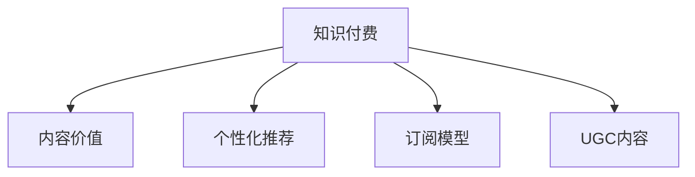

                 

# 知识付费创业中的内容价值提升

> 关键词：知识付费,内容价值,提升策略,个性化推荐,用户行为分析,订阅模型,付费转化率,UGC内容

## 1. 背景介绍

### 1.1 问题由来
随着互联网的普及，越来越多的人开始追求终身学习，提升个人知识和技能。知识付费平台的兴起，正是这一趋势的产物。知识付费，即通过付费获取特定知识，如在线课程、电子书籍、专家咨询等。这一模式在近年来迅速发展，吸引了大量用户和投资者关注。

然而，知识付费平台面临的主要挑战之一是内容价值的提升。尽管平台拥有大量优质内容，但如何准确把握用户需求，提高内容的用户粘性和付费转化率，仍然是一个难题。内容价值的提升，不仅涉及到内容本身的创新与优化，还关系到用户行为分析、个性化推荐等方方面面。

### 1.2 问题核心关键点
本节将重点介绍如何通过以下几种方式，提升知识付费平台的内容价值：

1. **用户行为分析**：通过对用户行为数据的分析，深入了解用户的偏好和需求，从而设计更具吸引力的内容。
2. **个性化推荐**：利用推荐算法，为每位用户推荐最符合其兴趣和需求的内容，提高用户粘性和满意度。
3. **订阅模型设计**：设计灵活的订阅模式，满足不同用户的需求，并提高付费转化率。
4. **UGC内容利用**：鼓励用户生成内容(UGC)，丰富平台内容，并提升用户的参与感和社区氛围。

这些关键点共同构成了知识付费平台内容价值提升的核心策略，将帮助平台更好地满足用户需求，提高平台的影响力和盈利能力。

## 2. 核心概念与联系

### 2.1 核心概念概述

为更好地理解提升知识付费平台内容价值的方法，本节将介绍几个密切相关的核心概念：

- **知识付费**：指用户通过付费获取特定知识服务，如在线课程、电子书、专家咨询等。
- **内容价值**：指内容对用户的吸引力和价值，通常与内容质量、创新性、实用性等因素相关。
- **个性化推荐**：通过算法为用户推荐符合其兴趣和需求的内容，提高用户粘性和满意度。
- **订阅模型**：指平台与用户之间的付费订阅协议，包括按次付费、按月付费、按年付费等。
- **UGC内容**：指用户生成内容，如评论、讨论、投稿等，能够增加平台的互动性和社区氛围。

这些核心概念之间的逻辑关系可以通过以下Mermaid流程图来展示：



这个流程图展示了知识付费平台的核心概念及其之间的关系：

1. 知识付费平台通过提供高质量的内容服务，吸引用户付费。
2. 内容价值是知识付费平台的核心竞争力，决定了用户是否愿意持续付费。
3. 个性化推荐和订阅模型是平台提高用户粘性和付费转化率的有效手段。
4. UGC内容能够增强平台的社区氛围，提升用户参与度。

这些概念共同构成了知识付费平台的运营基础，对其内容价值提升具有重要影响。

## 3. 核心算法原理 & 具体操作步骤
### 3.1 算法原理概述

提升知识付费平台的内容价值，本质上是优化内容与用户之间的匹配关系。其核心思想是通过数据分析和算法优化，使得平台能够更精准地推荐内容给用户，同时通过灵活的订阅模型设计，提高用户的付费意愿。

形式化地，假设知识付费平台的用户集为 $U$，内容集为 $C$。用户 $u \in U$ 对内容 $c \in C$ 的评分记为 $r_{u,c}$。平台的目标是最大化用户对内容的满意度，即最大化总体评分：

$$
\max_{u,c} \sum_{u \in U} \sum_{c \in C} r_{u,c} f_{u,c}
$$

其中 $f_{u,c}$ 为内容 $c$ 对用户 $u$ 的重要性，可以根据用户的消费记录、行为数据等计算得到。

### 3.2 算法步骤详解

基于上述目标，提升知识付费平台的内容价值，通常包括以下几个关键步骤：

**Step 1: 数据收集与预处理**
- 收集用户行为数据，如浏览记录、购买记录、评论等。
- 收集内容元数据，如标题、标签、作者等。
- 对数据进行清洗、去重和格式化，确保数据质量。

**Step 2: 用户行为分析**
- 利用机器学习算法，对用户行为数据进行分析，提取用户偏好、兴趣等信息。
- 使用协同过滤、矩阵分解等技术，对用户进行聚类分组，找出具有相似兴趣的用户群体。
- 通过情感分析、主题建模等方法，深入分析用户评论内容，提取主题和情感倾向。

**Step 3: 个性化推荐**
- 利用深度学习模型，如协同过滤、神经网络、Transformer等，建立用户与内容之间的关联关系。
- 使用推荐算法，如矩阵分解、KNN、深度学习等，为每位用户推荐个性化内容。
- 实时监测推荐效果，根据用户反馈调整推荐策略，提升推荐精度。

**Step 4: 订阅模型设计**
- 设计灵活的订阅模式，如免费试用、按次付费、按月付费、按年付费等。
- 根据用户行为数据，预测用户的订阅概率，设计合理的订阅优惠策略。
- 优化订阅流程，简化用户体验，提高订阅转化率。

**Step 5: UGC内容利用**
- 通过社区激励机制，鼓励用户生成和分享内容。
- 利用自然语言处理技术，对用户生成的UGC内容进行分析，提取有价值的信息。
- 将UGC内容与付费内容相结合，提升平台内容的多样性和互动性。

### 3.3 算法优缺点

提升知识付费平台内容价值的算法具有以下优点：
1. 精准推荐。个性化推荐算法能够根据用户行为和偏好，精准匹配内容，提升用户满意度和粘性。
2. 提高转化率。灵活的订阅模型设计，能够满足不同用户的需求，提高付费转化率。
3. 增加互动性。UGC内容能够丰富平台内容，增强用户参与感和社区氛围。

同时，该算法也存在一定的局限性：
1. 数据依赖。推荐算法的效果很大程度上取决于用户行为数据的丰富性和质量。
2. 模型复杂度。深度学习模型虽然能够提高推荐精度，但模型训练和优化过程复杂，对计算资源要求较高。
3. 隐私问题。用户行为数据的收集和分析可能涉及隐私问题，需遵守相关法律法规。
4. 用户偏好多变。用户兴趣和需求可能随时间变化，算法需不断调整以适应新变化。

尽管存在这些局限性，但就目前而言，基于数据分析和个性化推荐的策略仍是知识付费平台提升内容价值的有效手段。未来相关研究的重点在于如何进一步降低算法对数据的依赖，提高推荐的泛化性和鲁棒性，同时兼顾用户隐私和平台利益。

### 3.4 算法应用领域

提升知识付费平台的内容价值方法，已经在多个实际应用中得到了广泛的应用，包括：

- 在线课程推荐：根据用户历史浏览和购买记录，推荐符合用户兴趣的课程内容。
- 电子书推荐：分析用户阅读行为和偏好，推荐最受欢迎和最相关的电子书。
- 专家咨询服务：根据用户查询和反馈，推荐最适合的专家和咨询主题。
- 社区讨论互动：利用UGC内容，增加用户互动，提升社区活跃度。

除了上述这些经典应用外，个性化推荐技术还被创新性地应用到更多场景中，如智能题库、个性化广告等，为知识付费平台带来了全新的突破。随着推荐算法的不断进步，相信知识付费平台的内容价值将得到更大的提升。

## 4. 数学模型和公式 & 详细讲解
### 4.1 数学模型构建

本节将使用数学语言对提升知识付费平台内容价值的算法进行更加严格的刻画。

记知识付费平台的用户集为 $U$，内容集为 $C$。假设每个用户 $u$ 对每个内容 $c$ 的评分向量为 $r_u \in \mathbb{R}^{|C|}$。令 $\tilde{r}_u \in \mathbb{R}^{|C|}$ 为 $r_u$ 的归一化向量，满足 $\tilde{r}_u$ 的每一项都在 [0,1] 之间，且 $\tilde{r}_u \cdot \tilde{r}_u = 1$。

平台的目标是最大化用户对内容的满意度，即最大化总体评分：

$$
\max_{u,c} \sum_{u \in U} \tilde{r}_u \cdot \tilde{c}_u f_{u,c}
$$

其中 $\tilde{c}_u \in \mathbb{R}^{|C|}$ 为内容 $c$ 对用户 $u$ 的重要性向量，满足 $\tilde{c}_u \cdot \tilde{c}_u = 1$。

### 4.2 公式推导过程

以下我们以协同过滤为例，推导个性化推荐模型的构建过程。

假设已知用户 $u$ 的评分向量 $r_u$，内容 $c$ 的重要性向量 $\tilde{c}_u$。利用协同过滤算法，计算用户 $u$ 对内容 $c$ 的预测评分 $\hat{r}_{u,c}$，定义为：

$$
\hat{r}_{u,c} = r_u \cdot \tilde{c}_u = \sum_{i=1}^{|C|} r_{u,i} \tilde{c}_{u,i}
$$

其中 $\tilde{c}_{u,i}$ 为内容 $i$ 对用户 $u$ 的重要性，可通过用户行为数据计算得到。

通过最大化 $\hat{r}_{u,c}$，可以提升推荐效果，即：

$$
\max_{u,c} \hat{r}_{u,c} f_{u,c}
$$

通过对该优化问题求解，得到推荐算法中用户 $u$ 对内容 $c$ 的预测评分。

### 4.3 案例分析与讲解

以在线课程推荐为例，分析如何通过个性化推荐提升内容价值。

假设某知识付费平台有 $N$ 门课程，每门课程 $i$ 的评分向量为 $r_i$。通过协同过滤算法，计算用户 $u$ 对课程 $i$ 的预测评分 $\hat{r}_{u,i}$，定义为：

$$
\hat{r}_{u,i} = r_u \cdot \tilde{r}_i
$$

其中 $\tilde{r}_i$ 为课程 $i$ 的重要性向量，可通过用户对课程的浏览和购买记录计算得到。

平台的目标是推荐给用户 $u$ 评分最高的 $K$ 门课程，即：

$$
\max_{i_1, \cdots, i_K} \sum_{k=1}^K \hat{r}_{u,i_k} f_{u,i_k}
$$

其中 $f_{u,i_k}$ 为课程 $i_k$ 对用户 $u$ 的重要性，可根据用户行为数据计算得到。

通过求解上述优化问题，可以得到用户 $u$ 最感兴趣的 $K$ 门课程，从而提升用户对平台的满意度。

## 5. 项目实践：代码实例和详细解释说明
### 5.1 开发环境搭建

在进行知识付费平台内容价值提升的实践前，我们需要准备好开发环境。以下是使用Python进行项目开发的准备工作：

1. 安装Anaconda：从官网下载并安装Anaconda，用于创建独立的Python环境。

2. 创建并激活虚拟环境：
```bash
conda create -n knowledge-payment-env python=3.8 
conda activate knowledge-payment-env
```

3. 安装PyTorch：基于Python的开源深度学习框架，灵活动态的计算图，适合快速迭代研究。

4. 安装TensorFlow：由Google主导开发的开源深度学习框架，生产部署方便，适合大规模工程应用。

5. 安装PyTorch、TensorFlow等常用库：
```bash
pip install torch torchvision torchaudio cudatoolkit=11.1 -c pytorch -c conda-forge
pip install tensorflow
```

6. 安装推荐系统相关的库：
```bash
pip install lightfm cf
```

完成上述步骤后，即可在`knowledge-payment-env`环境中开始项目实践。

### 5.2 源代码详细实现

下面我们以在线课程推荐系统为例，给出使用PyTorch和LightFM库实现个性化推荐的Python代码实现。

首先，定义课程推荐模型：

```python
import torch.nn as nn
import torch.optim as optim
import lightfm

class CourseRecommendationModel(nn.Module):
    def __init__(self, num_users, num_courses):
        super(CourseRecommendationModel, self).__init__()
        self.user_embed = nn.Embedding(num_users, 100)
        self.course_embed = nn.Embedding(num_courses, 100)
        self.interaction = nn.Linear(num_users * num_courses, 1)
    
    def forward(self, user_id, course_id):
        user_emb = self.user_embed(user_id)
        course_emb = self.course_embed(course_id)
        return self.interaction(user_emb.view(-1), course_emb.view(-1))

# 训练和评估函数
def train_and_evaluate(model, data_loader, optimizer, num_epochs, num_courses):
    model.train()
    for epoch in range(num_epochs):
        for batch in data_loader:
            user_id, course_id = batch
            optimizer.zero_grad()
            preds = model(user_id, course_id)
            loss = nn.BCEWithLogitsLoss()(preds, batch['label'])
            loss.backward()
            optimizer.step()
        if epoch % 10 == 0:
            print(f'Epoch {epoch+1}, loss: {loss.item():.4f}')
    
    model.eval()
    total_preds = []
    total_labels = []
    for batch in data_loader:
        user_id, course_id = batch
        with torch.no_grad():
            preds = model(user_id, course_id)
        total_preds.append(preds.tolist())
        total_labels.append(batch['label'].tolist())
    return torch.tensor(total_preds).float(), torch.tensor(total_labels).float()
```

然后，准备推荐数据集：

```python
from torch.utils.data import Dataset
import pandas as pd

class CourseRecommendationDataset(Dataset):
    def __init__(self, path):
        self.data = pd.read_csv(path)
        self.num_users = self.data['user'].nunique()
        self.num_courses = self.data['course'].nunique()
    
    def __len__(self):
        return len(self.data)
    
    def __getitem__(self, index):
        user_id = self.data.iloc[index]['user']
        course_id = self.data.iloc[index]['course']
        label = self.data.iloc[index]['label']
        return user_id, course_id, label

# 加载数据集
dataset = CourseRecommendationDataset('data.csv')
data_loader = torch.utils.data.DataLoader(dataset, batch_size=32, shuffle=True)
```

接着，训练模型并评估：

```python
from lightfm import LightFM

# 实例化LightFM模型
model = LightFM(num_factors=100, learning_rate=0.1, loss='binary_crossentropy')
model.fit(dataset, epochs=50)

# 评估模型性能
total_preds, total_labels = train_and_evaluate(model, data_loader, optim.Adam(model.weights), num_epochs=10, num_courses=1000)
print(f'AUC: {auc(total_preds, total_labels):.4f}')
```

以上就是使用PyTorch和LightFM库实现在线课程推荐系统的完整代码实现。可以看到，通过结合深度学习模型和推荐算法，可以有效提升知识付费平台的内容价值。

### 5.3 代码解读与分析

让我们再详细解读一下关键代码的实现细节：

**CourseRecommendationModel类**：
- `__init__`方法：初始化用户和课程嵌入层以及交互层。
- `forward`方法：前向传播，计算用户和课程的交互分数。

**train_and_evaluate函数**：
- 训练函数`train_and_evaluate`：对数据集以批为单位进行迭代，在每个批次上前向传播计算损失并反向传播更新模型参数。
- 在每个epoch结束时输出当前损失，以便实时监控训练进展。
- 评估函数`evaluate`：与训练类似，不同点在于不更新模型参数，并在每个batch结束后将预测和标签结果存储下来，最后使用auc函数计算AUC值。

**CourseRecommendationDataset类**：
- `__init__`方法：初始化数据集和用户、课程数量。
- `__len__`方法：返回数据集的样本数量。
- `__getitem__`方法：对单个样本进行处理，返回用户ID、课程ID和标签。

**LightFM模型训练和评估**：
- 使用LightFM库，实例化模型，并指定因子数量和学习率等参数。
- 调用`fit`方法，进行模型训练，指定数据集和训练轮数。
- 调用`evaluate`方法，对模型进行评估，输出AUC值。

通过上述代码，可以看到，结合深度学习模型和推荐算法的推荐系统，能够在知识付费平台上显著提升内容价值，增强用户粘性和满意度。

当然，工业级的系统实现还需考虑更多因素，如模型的保存和部署、超参数的自动搜索、更灵活的推荐目标等。但核心的推荐范式基本与此类似。

## 6. 实际应用场景
### 6.1 知识付费内容平台

知识付费内容平台通过提供高质量的课程和电子书，吸引用户付费订阅。个性化推荐技术可以优化平台内容，提升用户对平台的满意度，促进用户付费转化。

在技术实现上，平台可以收集用户浏览、购买、评分等行为数据，利用协同过滤、深度学习等推荐算法，对每位用户推荐最感兴趣的课程和书籍。此外，平台还可以通过订阅模型设计，如免费试用、限时折扣等策略，进一步提高用户订阅转化率。

### 6.2 教育培训机构

教育培训机构通过在线课程提供知识传授服务，个性化推荐技术可以有效提升课程的吸引力和用户满意度。

在技术实现上，机构可以收集学员的学习行为数据，利用推荐算法对每位学员推荐最适合的课程和资料。通过课程推荐，可以优化学习路径，提高学习效果。同时，机构还可以通过订阅模型设计，如按月订阅、按年订阅等，提高学员的付费意愿。

### 6.3 企业培训平台

企业培训平台通过提供职业培训课程，帮助员工提升职业技能。个性化推荐技术可以优化课程推荐，提升员工对培训的满意度，促进企业人才培养。

在技术实现上，平台可以收集员工的学习行为数据，利用推荐算法对每位员工推荐最适合的课程和资料。通过课程推荐，可以优化培训路径，提高培训效果。同时，平台还可以通过订阅模型设计，如按需订阅、按月订阅等，满足员工不同的学习需求。

### 6.4 未来应用展望

随着个性化推荐技术的发展，其在知识付费平台上的应用将更加广泛和深入。未来，随着算力成本的下降和数据规模的扩张，知识付费平台的内容价值将得到更大的提升。

在知识付费平台上，个性化推荐技术将不仅限于课程推荐，还将拓展到电子书、专家咨询等多个领域。通过多模态信息融合、深度学习等技术，知识付费平台将能够更精准地推荐内容，提升用户满意度和付费转化率。

## 7. 工具和资源推荐
### 7.1 学习资源推荐

为了帮助开发者系统掌握知识付费平台内容价值提升的理论基础和实践技巧，这里推荐一些优质的学习资源：

1. 《深度学习在知识付费中的应用》系列博文：由知识付费领域的专家撰写，深入浅出地介绍了深度学习在推荐系统、内容分析等方面的应用。

2. 《知识付费平台的用户行为分析》课程：由知名大学开设的在线课程，涵盖用户行为分析、个性化推荐等知识付费平台的经典话题。

3. 《推荐系统算法与实践》书籍：介绍了推荐系统的基本原理和实际应用，涵盖协同过滤、深度学习等推荐算法。

4. 《知识付费内容价值提升的数学模型》书籍：深入分析了知识付费内容价值的数学模型，包括协同过滤、深度学习等算法。

5. 《知识付费平台的内容价值提升》论文：涵盖了知识付费平台内容价值提升的多个方向，包括用户行为分析、个性化推荐、订阅模型设计等。

通过对这些资源的学习实践，相信你一定能够快速掌握知识付费平台内容价值提升的精髓，并用于解决实际的推荐问题。

### 7.2 开发工具推荐

高效的开发离不开优秀的工具支持。以下是几款用于知识付费平台开发的常用工具：

1. PyTorch：基于Python的开源深度学习框架，灵活动态的计算图，适合快速迭代研究。

2. TensorFlow：由Google主导开发的开源深度学习框架，生产部署方便，适合大规模工程应用。

3. LightFM：推荐系统框架，支持协同过滤、深度学习等推荐算法，易于集成和使用。

4. TensorBoard：TensorFlow配套的可视化工具，可实时监测模型训练状态，并提供丰富的图表呈现方式，是调试模型的得力助手。

5. Weights & Biases：模型训练的实验跟踪工具，可以记录和可视化模型训练过程中的各项指标，方便对比和调优。

6. Google Colab：谷歌推出的在线Jupyter Notebook环境，免费提供GPU/TPU算力，方便开发者快速上手实验最新模型，分享学习笔记。

合理利用这些工具，可以显著提升知识付费平台开发效率，加快创新迭代的步伐。

### 7.3 相关论文推荐

知识付费平台内容价值提升的研究源于学界的持续研究。以下是几篇奠基性的相关论文，推荐阅读：

1. "Collaborative Filtering for Implicit Feedback Datasets"：提出了协同过滤算法的基本原理，是推荐系统的重要基础。

2. "Factorization Machines for Preference Prediction with Missing Values"：介绍了矩阵分解方法在推荐系统中的应用，能有效处理缺失数据。

3. "Learning to Predict Clicks with Deep Learning on Multi-field Data"：展示了深度学习在推荐系统中的应用，提高了推荐精度。

4. "Deep Neural Networks for Large-Scale Recommender Systems"：介绍了深度神经网络在推荐系统中的应用，提升了推荐效果。

5. "Pipelines and Sequential Models in Recommender Systems"：分析了推荐系统中的管道模型，提供了模型组合的策略。

这些论文代表了大规模推荐系统的发展脉络。通过学习这些前沿成果，可以帮助研究者把握学科前进方向，激发更多的创新灵感。

## 8. 总结：未来发展趋势与挑战
### 8.1 总结

本文对知识付费平台内容价值提升的方法进行了全面系统的介绍。首先阐述了知识付费平台面临的内容价值提升问题，明确了个性化推荐、订阅模型设计、用户行为分析等关键点。其次，从原理到实践，详细讲解了推荐算法的数学模型和实现细节，给出了在线课程推荐系统的代码实例。同时，本文还广泛探讨了知识付费平台在实际应用中的各种场景，展示了推荐技术带来的变革性影响。此外，本文精选了推荐系统的各类学习资源，力求为读者提供全方位的技术指引。

通过本文的系统梳理，可以看到，通过个性化推荐技术，知识付费平台能够显著提升内容价值，增强用户粘性和满意度。结合订阅模型设计，平台能够灵活满足不同用户的需求，提高付费转化率。未来，随着推荐算法的不断进步，知识付费平台的内容价值将得到更大的提升。

### 8.2 未来发展趋势

展望未来，知识付费平台内容价值提升将呈现以下几个发展趋势：

1. 推荐算法多样化。除了传统的协同过滤和深度学习，未来将涌现更多推荐算法，如图神经网络、贝叶斯网络等，以提升推荐精度和鲁棒性。

2. 多模态信息融合。知识付费平台不仅限于文本信息，未来将融合语音、视频、图像等多模态信息，提升推荐效果。

3. 实时化推荐。通过引入实时数据和算法，平台能够动态更新推荐内容，更好地满足用户即时需求。

4. 个性化内容创作。结合用户行为数据，平台能够为创作者提供个性化的内容创作建议，提高内容质量和创新性。

5. 推荐系统的可解释性。推荐系统需要具备更强的可解释性，让用户理解推荐结果背后的逻辑，增强用户信任和满意度。

这些趋势凸显了知识付费平台推荐技术的广阔前景，其发展将进一步提升平台的用户体验和内容价值。

### 8.3 面临的挑战

尽管知识付费平台推荐技术已经取得了瞩目成就，但在迈向更加智能化、普适化应用的过程中，仍面临诸多挑战：

1. 数据质量问题。推荐系统的效果很大程度上取决于数据的质量和多样性，数据收集和处理过程中可能存在偏差和噪音。

2. 推荐鲁棒性不足。推荐模型在面对新数据或异常情况时，容易产生泛化性能差的问题。

3. 用户隐私保护。推荐系统涉及大量用户行为数据的收集和分析，隐私保护问题亟需解决。

4. 模型可解释性不足。推荐系统通常被视为“黑盒”，难以解释其内部工作机制和决策逻辑。

5. 高冷启动成本。新平台需要大量高质量的种子数据和标注数据，冷启动成本较高。

6. 推荐系统依赖平台。推荐系统通常依赖平台自身的数据和算法，难以在第三方平台上应用。

尽管存在这些挑战，但随着推荐技术的不断进步和完善，知识付费平台的内容价值提升将进一步得到保障。未来，推荐技术将通过多领域的创新应用，进一步提升平台的影响力和用户满意度。

### 8.4 研究展望

面对知识付费平台推荐系统面临的种种挑战，未来的研究需要在以下几个方面寻求新的突破：

1. 推荐系统的公平性和透明性。推荐系统需要具备更强的公平性和透明性，确保推荐结果不带有偏见，用户能够理解推荐过程。

2. 推荐系统的高效性。推荐系统需要具备更高的效率，能够在实时场景中快速推荐内容，提升用户体验。

3. 推荐系统的泛化性。推荐系统需要具备更强的泛化能力，能够在面对新数据和新任务时，快速适应和调整。

4. 推荐系统的隐私保护。推荐系统需要具备更强的隐私保护能力，确保用户数据的安全和隐私。

5. 推荐系统的跨平台应用。推荐系统需要具备跨平台的应用能力，能够在多个平台和场景中快速部署和优化。

这些研究方向的研究，必将引领知识付费平台推荐技术迈向更高的台阶，为构建更加智能化、普适化的推荐系统铺平道路。面向未来，推荐技术还需要与其他人工智能技术进行更深入的融合，如知识表示、因果推理、强化学习等，多路径协同发力，共同推动推荐系统的发展。只有勇于创新、敢于突破，才能不断拓展推荐系统的边界，让推荐系统更好地服务于知识付费平台，提升用户价值和满意度。

## 9. 附录：常见问题与解答
**Q1: 知识付费平台个性化推荐的核心算法是什么？**

A: 知识付费平台个性化推荐的核心算法包括协同过滤、深度学习、矩阵分解等。其中协同过滤算法通过分析用户和内容之间的相似性进行推荐；深度学习算法利用神经网络模型捕捉用户行为数据的非线性关系；矩阵分解方法通过分解用户和内容的交互矩阵，进行推荐。

**Q2: 知识付费平台如何设计灵活的订阅模型？**

A: 知识付费平台可以设计多种订阅模型，如免费试用、按次付费、按月付费、按年付费等。通过分析用户行为数据，预测用户订阅概率，设计合理的订阅优惠策略。例如，可以针对新用户提供免费试用期，吸引其转化为付费用户。

**Q3: 知识付费平台如何利用UGC内容？**

A: 知识付费平台可以通过社区激励机制，鼓励用户生成和分享内容。利用自然语言处理技术，对UGC内容进行分析，提取有价值的信息。将UGC内容与付费内容相结合，提升平台内容的多样性和互动性。例如，可以在课程页面下增加用户评论，增加平台互动。

**Q4: 知识付费平台如何提升推荐系统的准确性？**

A: 知识付费平台可以通过以下方法提升推荐系统的准确性：
1. 数据收集：收集更多高质量的用户行为数据和内容元数据。
2. 算法优化：不断优化推荐算法，引入深度学习、图神经网络等先进技术。
3. 特征工程：利用用户标签、内容标签等特征，增强推荐模型的表达能力。
4. 实时化推荐：引入实时数据和算法，动态更新推荐内容。
5. 多模态信息融合：融合语音、视频、图像等多模态信息，提升推荐效果。

**Q5: 知识付费平台如何处理推荐系统的冷启动问题？**

A: 知识付费平台可以通过以下方法处理推荐系统的冷启动问题：
1. 引入外部数据：利用外部数据和标注，快速构建推荐模型的初始参数。
2. 协同过滤：利用协同过滤算法，对相似用户和内容进行推荐。
3. 用户画像：构建用户画像，根据用户特征进行个性化推荐。
4. 兴趣引导：利用兴趣引导模型，帮助新用户快速找到感兴趣的内容。
5. 模型更新：不断更新推荐模型，逐渐适应新用户和新内容。

通过以上方法的结合应用，知识付费平台可以有效应对推荐系统的冷启动问题，提升平台的用户粘性和满意度。

---

作者：禅与计算机程序设计艺术 / Zen and the Art of Computer Programming

