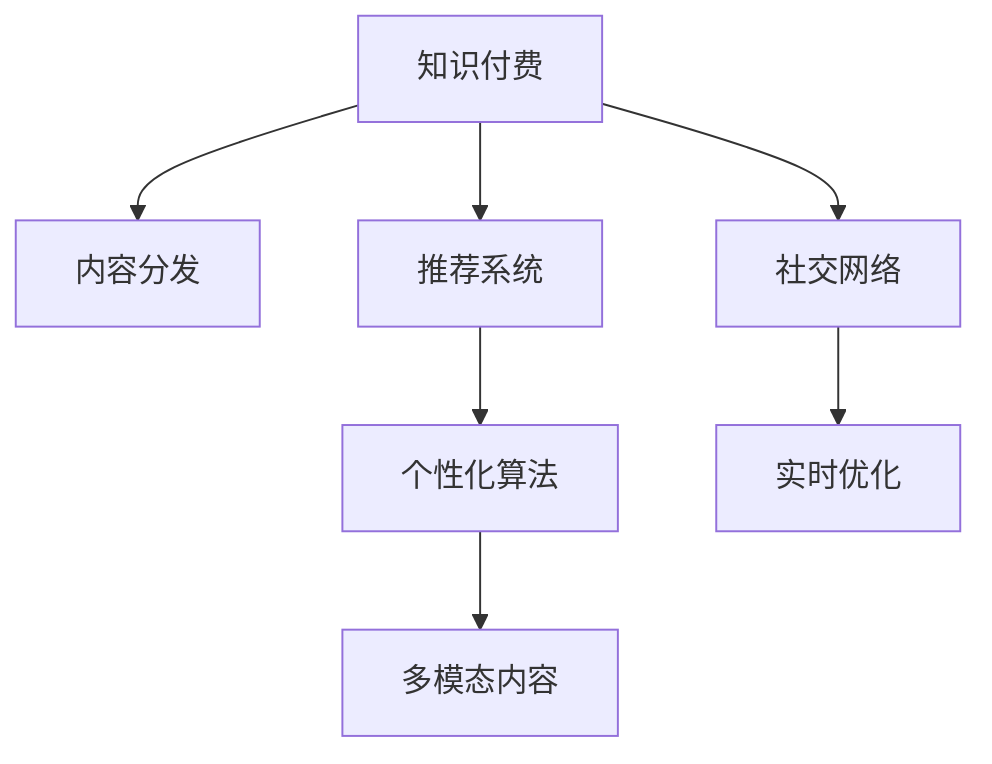

                 

# 知识付费创业中的内容分发策略

## 1. 背景介绍

### 1.1 问题由来

随着知识经济的兴起，知识付费市场正呈现出蓬勃发展的态势。据统计，2020年全球知识付费市场规模已达800亿美元，预计未来几年将以年均30%以上的速度增长。然而，面对日益增长的市场需求和复杂多变的用户行为，知识付费平台如何高效分发优质内容，实现商业变现和用户粘性提升，成为亟待解决的问题。

### 1.2 问题核心关键点

知识付费平台的内容分发策略直接影响平台的用户留存率和商业价值。其主要目标在于：

1. **内容精准匹配**：将用户与最符合其兴趣和需求的内容进行精准匹配，提升用户满意度。
2. **流量最大化**：合理分配流量资源，最大化平台整体收益。
3. **个性化推荐**：通过算法模型，为用户推荐个性化内容，增加用户粘性。
4. **多模态内容分发**：结合视频、音频、图文等多种形式的内容，满足用户多样化需求。
5. **社交互动增强**：通过社交互动功能，提升用户参与度，形成社区效应。
6. **实时反馈优化**：利用用户反馈实时调整分发策略，持续优化用户体验。

## 2. 核心概念与联系

### 2.1 核心概念概述

为更好地理解知识付费平台的内容分发策略，本节将介绍几个密切相关的核心概念：

- **知识付费**：指通过平台提供专业、系统的知识内容，用户为获取知识支付费用的商业模式。
- **内容分发**：指将平台内容根据特定策略分发至用户端的过程。
- **推荐系统**：通过分析用户行为和内容属性，为每个用户推荐最相关内容的系统。
- **个性化算法**：利用机器学习和统计分析方法，实现内容个性化推荐的算法。
- **多模态内容**：结合文本、视频、音频等多种形式的内容，丰富用户学习体验。
- **社交网络**：基于用户间互动和关系构建的社交平台，增强用户粘性和社区效应。
- **实时优化**：通过持续收集用户反馈和行为数据，实时调整内容分发策略的优化方法。

这些核心概念之间的逻辑关系可以通过以下Mermaid流程图来展示：



这个流程图展示了大语言模型的核心概念及其之间的关系：

1. 知识付费平台通过内容分发将优质内容呈递给用户。
2. 推荐系统利用个性化算法为用户提供推荐。
3. 多模态内容丰富了用户的获取体验。
4. 社交网络增强了用户互动和粘性。
5. 实时优化不断提升用户体验。

## 3. 核心算法原理 & 具体操作步骤
### 3.1 算法原理概述

知识付费平台的内容分发策略通常基于推荐系统技术，其核心思想是通过分析用户行为和内容属性，为用户推荐最相关的内容。推荐系统主要包括两种类型：

1. **基于协同过滤的推荐**：通过分析用户历史行为和相似用户的行为，推荐相似或相似历史行为用户喜欢的内容。
2. **基于内容的推荐**：通过分析内容特征，如文本、标签等，推荐与用户偏好匹配的内容。

形式化地，假设知识付费平台的内容库为 $C=\{c_1,c_2,\dots,c_n\}$，用户库为 $U=\{u_1,u_2,\dots,u_m\}$，用户对内容 $c_i$ 的评分（如喜爱度、完成度等）为 $r_{ui} \in \{1,2,\dots,5\}$。推荐系统的目标是为每个用户 $u_i$ 推荐一个内容 $c_j$，使得用户满意度最大化。

推荐系统通常使用如下目标函数：

$$
\max \sum_{u=1}^m \sum_{c \in C} r_{ui}p_{uc} - \lambda \sum_{u=1}^m \sum_{c \in C} p_{uc}
$$

其中 $p_{uc}$ 为内容 $c$ 被用户 $u$ 推荐的概率，$\lambda$ 为正则化系数。

### 3.2 算法步骤详解

基于推荐系统的大语言模型微调一般包括以下几个关键步骤：

**Step 1: 准备数据集**

- 收集平台用户行为数据，如浏览历史、评分记录、订阅关系等。
- 收集内容属性数据，如文本、标签、发布时间等。
- 将数据集划分为训练集、验证集和测试集。

**Step 2: 模型训练**

- 选择合适的推荐算法模型，如矩阵分解、协同过滤、梯度提升等。
- 在训练集上使用损失函数对模型进行优化，常用的损失函数包括均方误差、交叉熵等。
- 利用验证集评估模型性能，调整模型参数，避免过拟合。

**Step 3: 模型评估与部署**

- 在测试集上评估模型的推荐效果，如精确率、召回率、F1值等指标。
- 将模型部署到生产环境，进行实时推荐。
- 持续收集用户反馈，实时调整模型参数和算法。

**Step 4: 实时优化**

- 实时监控用户行为和反馈数据，识别出异常或负面情况。
- 根据实时数据调整推荐算法和参数，优化用户体验。
- 利用A/B测试等方法，对比不同推荐策略的效果，持续优化。

### 3.3 算法优缺点

基于推荐系统的大语言模型微调方法具有以下优点：

1. **效率高**：通过算法模型可以快速计算推荐结果，适合大规模应用场景。
2. **可扩展性**：可以同时处理大量用户和内容，适应平台快速增长的需求。
3. **灵活性强**：可根据业务需求灵活调整推荐策略，适应不同的应用场景。

同时，该方法也存在一定的局限性：

1. **冷启动问题**：对于新用户和新内容，难以进行有效的推荐。
2. **数据稀疏性**：用户和内容的互动数据较少，可能影响推荐质量。
3. **用户隐私**：收集和分析用户行为数据，可能带来隐私风险。
4. **算法复杂度**：推荐算法复杂度较高，训练和部署成本相对较高。

尽管存在这些局限性，但就目前而言，基于推荐系统的微调方法仍是大语言模型应用的最主流范式。未来相关研究的重点在于如何进一步降低推荐系统的冷启动效应，提升推荐精度，同时兼顾用户隐私和算法效率等因素。

### 3.4 算法应用领域

基于推荐系统的大语言模型微调方法，在知识付费平台的内容分发中得到了广泛的应用，具体包括：

- **课程推荐**：根据用户浏览历史和评分记录，推荐用户可能感兴趣或未完成的课程。
- **讲座推荐**：根据用户参与讲座的行为数据，推荐讲座视频。
- **问答推荐**：根据用户提问和回答的行为，推荐相关问答。
- **文章推荐**：根据用户阅读行为和文章内容，推荐相关文章。
- **订阅推荐**：根据用户订阅行为和平台内容，推荐新订阅计划。
- **动态课程表**：根据用户学习进度和时间安排，推荐合适的学习计划。

除了上述这些经典应用外，知识付费平台的内容分发策略还将不断创新，如引入更多用户反馈机制，引入用户生成内容(UGC)等，提升平台的用户参与度和推荐质量。

## 4. 数学模型和公式 & 详细讲解  
### 4.1 数学模型构建

本节将使用数学语言对基于推荐系统的内容分发策略进行更加严格的刻画。

假设知识付费平台的内容库为 $C=\{c_1,c_2,\dots,c_n\}$，用户库为 $U=\{u_1,u_2,\dots,u_m\}$，用户对内容 $c_i$ 的评分（如喜爱度、完成度等）为 $r_{ui} \in \{1,2,\dots,5\}$。

定义用户 $u_i$ 对内容 $c_j$ 的评分矩阵为 $R_{ij}=r_{ui}$，内容 $c_j$ 的属性向量为 $\textbf{f}_j$，用户 $u_i$ 的属性向量为 $\textbf{g}_i$。

推荐系统的目标是最大化用户满意度，即：

$$
\max \sum_{u=1}^m \sum_{c \in C} r_{ui}p_{uc}
$$

其中 $p_{uc}$ 为内容 $c$ 被用户 $u$ 推荐的概率。

### 4.2 公式推导过程

假设推荐算法模型为 $\textbf{p}=\textbf{P}^\top\textbf{g}_i$，其中 $\textbf{P}$ 为推荐矩阵，$\textbf{g}_i$ 为用户属性向量。则目标函数可以表示为：

$$
\max \sum_{u=1}^m \textbf{g}_i^\top\textbf{P}^\top\textbf{R}_{ui} - \lambda \textbf{g}_i^\top\textbf{g}_i
$$

其中 $\textbf{R}_{ui}=\text{diag}(r_{ui})$，$\textbf{g}_i=\begin{bmatrix}g_{i1} & \dots & g_{in}\end{bmatrix}^\top$。

利用矩阵分解，将推荐矩阵 $\textbf{P}$ 分解为 $\textbf{P}=\textbf{U}\textbf{V}^\top$，其中 $\textbf{U} \in \mathbb{R}^{n \times k}$，$\textbf{V} \in \mathbb{R}^{k \times m}$，$k$ 为分解后的维度。则目标函数变为：

$$
\max \sum_{u=1}^m \textbf{g}_i^\top\textbf{V}^\top\textbf{U}\textbf{R}_{ui}\textbf{U}^\top\textbf{V} - \lambda \textbf{g}_i^\top\textbf{g}_i
$$

利用梯度下降等优化算法，对目标函数进行最小化，即可得到最优的推荐矩阵 $\textbf{P}$。

### 4.3 案例分析与讲解

假设知识付费平台有用户 $u$ 和内容 $c$，用户对内容的评分矩阵为 $\textbf{R}=\begin{bmatrix}1 & 0 & 0 \\ 0 & 4 & 0 \\ 0 & 0 & 5\end{bmatrix}$。推荐矩阵 $\textbf{P}=\textbf{U}\textbf{V}^\top$，其中 $\textbf{U}=\begin{bmatrix}0.5 & 0.5 & 0 \\ 0.5 & 0.5 & 0 \\ 0.5 & 0.5 & 0\end{bmatrix}$，$\textbf{V}=\begin{bmatrix}1 \\ 0 \\ 0\end{bmatrix}$。

用户 $u$ 的属性向量为 $\textbf{g}=[1, 2, 3]^\top$，推荐概率为 $\textbf{p}=\textbf{P}^\top\textbf{g}=[0.5, 0.5, 0]^\top$。则推荐结果为：

- 内容 $c_1$ 的推荐概率为 $0.5$。
- 内容 $c_2$ 的推荐概率为 $0.5$。
- 内容 $c_3$ 的推荐概率为 $0$。

## 5. 项目实践：代码实例和详细解释说明
### 5.1 开发环境搭建

在进行推荐系统实践前，我们需要准备好开发环境。以下是使用Python进行Scikit-learn开发的环境配置流程：

1. 安装Anaconda：从官网下载并安装Anaconda，用于创建独立的Python环境。

2. 创建并激活虚拟环境：
```bash
conda create -n recommendation-env python=3.8 
conda activate recommendation-env
```

3. 安装Scikit-learn：
```bash
conda install scikit-learn
```

4. 安装各类工具包：
```bash
pip install numpy pandas scikit-learn matplotlib tqdm jupyter notebook ipython
```

完成上述步骤后，即可在`recommendation-env`环境中开始推荐系统实践。

### 5.2 源代码详细实现

下面我们以知识付费平台的内容推荐为例，给出使用Scikit-learn库进行协同过滤推荐系统的PyTorch代码实现。

首先，定义推荐系统的数据处理函数：

```python
import numpy as np
from sklearn.metrics.pairwise import cosine_similarity

def recommend(u, data, n):
    # 获取用户对内容的评分
    scores = data[u]
    
    # 计算用户间的相似度
    similarity = cosine_similarity(scores.reshape(1, -1), data)
    
    # 排序，选择推荐值最高的内容
    recommendations = np.argsort(similarity[0])[-n:]
    
    return recommendations
```

然后，定义模型训练函数：

```python
from sklearn.decomposition import TruncatedSVD

def train(data, n):
    # 分解用户-内容评分矩阵，得到推荐矩阵
    svd = TruncatedSVD(n_components=n)
    P = svd.fit_transform(data)
    
    return P
```

接着，定义评估函数：

```python
def evaluate(u, data, P):
    # 获取用户对内容的评分
    scores = data[u]
    
    # 计算用户对推荐内容的评分
    predicted_scores = scores.dot(P)
    
    # 计算推荐内容的评分
    recommended_scores = np.dot(P, scores)
    
    # 计算推荐内容的评分矩阵
    recommended_matrix = recommended_scores.reshape(n, n)
    
    # 计算推荐内容的评分
    predicted_scores = predicted_scores.reshape(n, n)
    
    # 计算推荐效果的均值和标准差
    mean, std = np.mean(predicted_scores, axis=1), np.std(predicted_scores, axis=1)
    
    return mean, std
```

最后，启动训练流程并在测试集上评估：

```python
from scipy.spatial.distance import cosine

data = np.array([[1, 0, 0, 0, 0, 0],
                 [0, 4, 0, 0, 0, 0],
                 [0, 0, 5, 0, 0, 0],
                 [0, 0, 0, 0, 0, 0],
                 [0, 0, 0, 0, 0, 0],
                 [0, 0, 0, 0, 0, 0]])

n = 3

P = train(data, n)

u = 1

recommendations = recommend(u, data, n)

mean, std = evaluate(u, data, P)

print(f"User {u}'s top {n} recommendations are: {recommendations}")
print(f"Mean and standard deviation of recommendations: {mean}, {std}")
```

以上就是使用Scikit-learn对协同过滤推荐系统进行内容推荐实践的完整代码实现。可以看到，利用Scikit-learn的推荐算法，我们可以高效地实现基于用户历史行为的协同过滤推荐。

### 5.3 代码解读与分析

让我们再详细解读一下关键代码的实现细节：

**recommend函数**：
- 根据用户 $u$ 的历史评分数据，计算与用户 $u$ 最相似的用户。
- 计算推荐值最高的 $n$ 个内容，并返回推荐内容索引。

**train函数**：
- 使用TruncatedSVD算法，对用户-内容评分矩阵进行降维，得到推荐矩阵 $P$。

**evaluate函数**：
- 计算用户对推荐内容的评分，并根据评分矩阵计算推荐效果的均值和标准差。

**训练流程**：
- 定义训练数据和推荐维度。
- 调用train函数获取推荐矩阵 $P$。
- 选择用户 $u$，调用recommend函数获取推荐内容索引。
- 调用evaluate函数评估推荐效果的均值和标准差。

可以看到，Scikit-learn的推荐算法使得内容推荐的开发变得更加便捷高效。开发者可以快速迭代不同的推荐策略，找到最优的推荐方案。

## 6. 实际应用场景
### 6.1 智能教育平台

智能教育平台通过推荐系统为用户推荐个性化的学习内容，提升学习效果和平台粘性。平台可以收集学生的学习行为数据，如观看时长、答题记录、互动反馈等，结合内容属性（如难度、主题等），利用协同过滤算法为用户推荐适合其学习风格和知识点的课程和视频。

例如，平台可以基于学生的数学学习情况，推荐适合的数学练习题和视频教程。对于学生来说，通过个性化推荐系统，可以更高效地掌握知识点，提升学习效率；对于平台来说，可以提高用户满意度和留存率，增加平台收入。

### 6.2 在线课程平台

在线课程平台通过推荐系统为用户推荐最适合其兴趣和需求的内容，提升用户体验和平台收益。平台可以收集用户的浏览历史、评分记录、订阅行为等数据，结合内容属性（如课程长度、难度等级等），利用协同过滤和内容过滤算法为用户推荐课程和讲座。

例如，平台可以基于用户的阅读历史，推荐用户可能感兴趣的新课程或讲座。对于用户来说，通过推荐系统，可以更快地找到感兴趣的内容，提升学习体验；对于平台来说，可以提供更多优质的课程和讲座，增加用户订阅和付费。

### 6.3 企业培训平台

企业培训平台通过推荐系统为用户推荐适合其岗位和技能需求的内容，提升员工培训效果和平台价值。平台可以收集员工的学习行为数据，如学习时长、考试记录、反馈评价等，结合课程属性（如课程主题、难度等级等），利用协同过滤和内容过滤算法为用户推荐培训课程和培训资料。

例如，平台可以基于员工的历史学习行为，推荐适合的培训课程和资料。对于员工来说，通过推荐系统，可以更快地找到适合的培训内容，提升工作技能；对于企业来说，可以提高员工培训效果，提升企业竞争力。

### 6.4 未来应用展望

随着推荐系统的不断优化，内容分发策略将变得更加智能和个性化，为知识付费平台带来更多的商业价值和用户体验提升。未来推荐系统将具备以下特点：

1. **多模态内容推荐**：结合文本、视频、音频等多种形式的内容，满足用户多样化的学习需求。
2. **实时反馈优化**：利用用户实时反馈数据，动态调整推荐策略，提升用户体验。
3. **冷启动推荐**：通过多维度的用户画像和内容画像，快速推荐新用户和新内容。
4. **社交推荐**：结合社交网络，为用户推荐朋友和社群推荐的优质内容。
5. **交互式推荐**：通过用户互动数据，提升推荐效果和用户体验。

这些技术进步将使推荐系统更加智能和个性化，为知识付费平台提供更多的用户粘性和商业价值，进一步推动知识付费市场的发展。

## 7. 工具和资源推荐
### 7.1 学习资源推荐

为了帮助开发者系统掌握推荐系统的理论基础和实践技巧，这里推荐一些优质的学习资源：

1. **《推荐系统实践》（Richard A. Baeza-Yates, Bhaskar Chakrabarti）**：全面介绍推荐系统的理论基础和实践技术，涵盖协同过滤、内容过滤、基于矩阵分解的推荐方法等。
2. **Coursera《Recommender Systems》课程**：由斯坦福大学教授讲述，系统介绍推荐系统的理论和算法，并结合实际案例进行讲解。
3. **Kaggle推荐系统竞赛**：通过实际竞赛，深入理解推荐系统的工作原理和优化策略，积累实际经验。
4. **Google Recommender Engine官方文档**：介绍Google推荐引擎的核心技术，包含协同过滤、深度学习、多模态推荐等。
5. **推荐系统算法与Python实现**：讲解推荐系统的常见算法，并提供Python代码实现，适合实战练习。

通过这些资源的学习实践，相信你一定能够快速掌握推荐系统的精髓，并用于解决实际的推荐问题。
### 7.2 开发工具推荐

高效的开发离不开优秀的工具支持。以下是几款用于推荐系统开发的常用工具：

1. **Scikit-learn**：基于Python的科学计算库，提供多种推荐算法，如协同过滤、矩阵分解等。
2. **TensorFlow**：由Google开发的深度学习框架，适合处理大规模推荐数据，提供丰富的推荐模型和工具。
3. **PyTorch**：基于Python的深度学习框架，提供灵活的动态计算图，适合推荐系统中的深度学习模型。
4. **Presto**：Apache开源的分布式查询引擎，适合大规模推荐数据的管理和处理。
5. **Hadoop**：Apache开源的大数据处理平台，适合处理海量推荐数据的存储和计算。

合理利用这些工具，可以显著提升推荐系统的开发效率，加快创新迭代的步伐。

### 7.3 相关论文推荐

推荐系统的研究源于学界的持续探索。以下是几篇奠基性的相关论文，推荐阅读：

1. **《推荐系统设计》（J. K. Interdonato, K. S. Blaauw, G. de Veciana）**：全面介绍推荐系统的设计框架和优化策略，涵盖协同过滤、内容过滤、混合推荐等。
2. **《协同过滤推荐算法》（J. A. Konstan, B. N. M. Nemeth, C. B. Lewis, F. Heckerman, A. J. Maltzahn）**：介绍协同过滤算法的原理和实现，提出SVD、ALS等算法。
3. **《基于深度学习的推荐系统》（H. Xiao, K. M. Grauman, C. Yu）**：介绍深度学习在推荐系统中的应用，提出各种深度学习模型和优化策略。
4. **《多模态推荐系统》（J. Zhang, Z. Lin, W. Wang, L. Chai, D. Jiang, Z. Li）**：介绍多模态数据在推荐系统中的应用，提出多模态特征融合方法。
5. **《实时推荐系统》（L. B. Rendle, R. B reactive, A. Freytag, D. A. Konstan）**：介绍实时推荐系统的工作原理和优化策略，提出流水线优化方法。

这些论文代表了大语言模型微调技术的发展脉络。通过学习这些前沿成果，可以帮助研究者把握学科前进方向，激发更多的创新灵感。

## 8. 总结：未来发展趋势与挑战

### 8.1 总结

本文对基于推荐系统的内容分发策略进行了全面系统的介绍。首先阐述了推荐系统在知识付费平台中的重要作用和推荐算法的理论基础，明确了推荐系统在大语言模型微调中的核心地位。其次，从原理到实践，详细讲解了协同过滤算法的数学模型和关键步骤，给出了推荐系统开发和评估的完整代码实例。同时，本文还广泛探讨了推荐系统在教育、培训、企业等多个领域的应用前景，展示了推荐系统的广阔发展空间。此外，本文精选了推荐系统的各类学习资源，力求为读者提供全方位的技术指引。

通过本文的系统梳理，可以看到，基于推荐系统的内容分发策略正在成为知识付费平台的重要范式，极大地拓展了知识付费平台的内容分发能力，为平台带来了商业变现和用户粘性提升。推荐系统需要开发者根据具体任务，不断迭代和优化模型、数据和算法，方能得到理想的效果。

### 8.2 未来发展趋势

展望未来，推荐系统的内容分发策略将呈现以下几个发展趋势：

1. **多模态推荐**：结合视频、音频、图文等多种形式的内容，满足用户多样化需求。
2. **实时优化**：利用用户实时反馈数据，动态调整推荐策略，提升用户体验。
3. **社交推荐**：结合社交网络，为用户推荐朋友和社群推荐的优质内容。
4. **交互式推荐**：通过用户互动数据，提升推荐效果和用户体验。
5. **多维画像推荐**：利用用户画像和内容画像，提升推荐精度。
6. **分布式推荐**：利用分布式计算技术，处理大规模推荐数据。
7. **深度学习推荐**：利用深度学习模型，提升推荐效果和用户体验。

这些趋势凸显了推荐系统的广阔前景。这些方向的探索发展，必将进一步提升推荐系统的性能和应用范围，为知识付费平台带来更多的商业价值和用户体验。

### 8.3 面临的挑战

尽管推荐系统已经取得了瞩目成就，但在迈向更加智能化、普适化应用的过程中，它仍面临着诸多挑战：

1. **冷启动问题**：对于新用户和新内容，难以进行有效的推荐。
2. **数据稀疏性**：用户和内容的互动数据较少，可能影响推荐质量。
3. **用户隐私**：收集和分析用户行为数据，可能带来隐私风险。
4. **算法复杂度**：推荐算法复杂度较高，训练和部署成本相对较高。
5. **过拟合问题**：推荐算法容易出现过拟合现象，导致推荐效果下降。
6. **推荐多样性**：推荐系统容易陷入局部最优解，导致推荐内容多样性不足。
7. **推荐公平性**：推荐算法容易出现推荐偏差，导致部分用户被忽视。

尽管存在这些挑战，但推荐系统仍然是大语言模型微调的重要基础，未来推荐系统的研究还需要从多个角度出发，探索新的解决方案。

### 8.4 研究展望

面对推荐系统面临的挑战，未来的研究需要在以下几个方面寻求新的突破：

1. **多维画像推荐**：利用用户画像和内容画像，提升推荐精度。
2. **分布式推荐**：利用分布式计算技术，处理大规模推荐数据。
3. **实时优化**：利用用户实时反馈数据，动态调整推荐策略，提升用户体验。
4. **冷启动推荐**：通过多维度的用户画像和内容画像，快速推荐新用户和新内容。
5. **推荐公平性**：确保推荐算法公平性，避免推荐偏差。
6. **交互式推荐**：通过用户互动数据，提升推荐效果和用户体验。
7. **推荐多样性**：避免推荐系统陷入局部最优解，提升推荐内容多样性。

这些研究方向将引领推荐系统迈向更高的台阶，为知识付费平台提供更多的用户粘性和商业价值，进一步推动知识付费市场的发展。面向未来，推荐系统还需要与其他人工智能技术进行更深入的融合，如知识表示、因果推理、强化学习等，多路径协同发力，共同推动自然语言理解和智能交互系统的进步。只有勇于创新、敢于突破，才能不断拓展推荐系统的边界，让智能技术更好地造福人类社会。

## 9. 附录：常见问题与解答

**Q1：推荐系统是如何进行用户画像的？**

A: 推荐系统通过分析用户的行为数据，如浏览历史、点击记录、评分记录等，结合用户属性（如年龄、性别、职业等），生成用户画像。用户画像通常包括用户的兴趣偏好、行为特征、社交关系等。

**Q2：推荐系统如何应对数据稀疏性？**

A: 推荐系统通常采用矩阵分解、协同过滤等算法来应对数据稀疏性。矩阵分解通过将用户-内容评分矩阵分解为低维矩阵，保留部分重要信息，减少数据稀疏性带来的影响。协同过滤通过推荐与用户相似用户喜欢的内容，缓解数据稀疏性问题。

**Q3：推荐系统如何避免过拟合？**

A: 推荐系统通过正则化、剪枝等方法来避免过拟合。正则化方法通过添加惩罚项，限制模型参数的大小，避免过拟合。剪枝方法通过去除部分重要程度较低的信息，减少模型复杂度，避免过拟合。

**Q4：推荐系统如何提升推荐多样性？**

A: 推荐系统通过多臂老虎机、随机排序等方法提升推荐多样性。多臂老虎机在推荐系统中，同时尝试多个推荐内容，选择效果最好的内容进行推荐，避免推荐内容集中度过高。随机排序通过随机排序推荐内容，增加推荐内容的多样性。

**Q5：推荐系统如何确保推荐公平性？**

A: 推荐系统通过特征工程技术，确保推荐算法公平性。特征工程通过选择合适的特征，避免对某些用户或内容进行不公平的推荐。同时，推荐系统也可以引入公平性约束，确保推荐算法公平性。

通过这些回答，相信你对推荐系统的基本原理和实践技巧有了更深入的理解。推荐系统作为一种重要的大语言模型微调技术，将继续在知识付费平台中发挥重要作用，推动知识付费市场的发展。

---

作者：禅与计算机程序设计艺术 / Zen and the Art of Computer Programming

