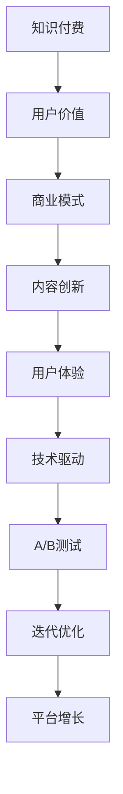

                 

# 知识付费创业的用户价值 Maximization

> 关键词：知识付费,用户价值,商业模式,内容创新,用户体验,技术驱动

## 1. 背景介绍

### 1.1 问题由来

在信息爆炸的互联网时代，人们获取知识的途径变得愈加多样。从传统的书籍、电视节目到互联网视频、在线课程，再到社交媒体、论坛，各种知识传播渠道层出不穷。然而，这些渠道面临的一个共同问题是信息过载和信息碎片化，使得用户难以在短时间内快速找到自己真正需要的知识，影响了学习效率和效果。

与此同时，知识付费作为一种新型商业模式，正在逐渐崛起。通过订阅、单次付费、按需付费等多种形式，平台为优质内容提供者提供了变现渠道，同时用户也能通过付费获取更专业、系统、深度的知识内容。这种模式不仅满足了用户对高效学习的需求，也促进了知识的系统化生产和传播。

但现实中，知识付费行业也存在一些问题。如平台内容同质化、用户体验不友好、市场竞争激烈、付费转化率低等。这些问题不仅限制了知识付费行业的进一步发展，也影响了平台和用户的双赢效果。因此，本文旨在探讨如何通过优化知识付费平台的商业模式和用户体验，最大化用户价值，推动行业健康发展。

### 1.2 问题核心关键点

知识付费创业的核心在于如何最大化用户价值，即在满足用户需求的同时实现平台的可持续盈利。这需要从以下几个方面进行深入研究：

- 用户需求分析：了解用户真实的学习需求和支付意愿，针对性地提供高价值内容。
- 内容生产优化：提升内容的质量和多样性，通过创新驱动持续产出优质内容。
- 商业模式设计：构建良性循环的收费模式，保持用户粘性和持续付费。
- 用户体验改进：通过技术手段和设计优化提升用户使用体验，减少流失率。

以下将从核心概念、核心算法、数学模型、项目实践、实际应用、工具和资源、总结等方面，系统介绍知识付费创业的各个关键环节，以期为从业者提供全面的指导。

## 2. 核心概念与联系

### 2.1 核心概念概述

为更好地理解知识付费创业的核心思想，本节将介绍几个关键概念：

- **知识付费(Knowledge-Paying)：** 用户通过支付一定费用，获取系统化、专业化的知识内容，以提高学习效率和效果。
- **用户价值(User Value)：** 用户通过平台获取的知识价值，即用户在平台上花费的货币和时间所获得的收益，包括知识含量、应用场景等。
- **商业模式(Commercial Model)：** 平台通过精准定位用户需求，合理定价，设计可持续的收费策略，实现盈利。
- **内容创新(Content Innovation)：** 平台通过持续的创新驱动，推出有深度、有趣味的内容，满足用户不断变化的需求。
- **用户体验(User Experience)：** 通过技术和设计手段，提升用户在使用平台时的满足度和舒适度，提高用户粘性。
- **技术驱动(Technology-Driven)：** 平台利用先进技术手段，如AI推荐系统、大数据分析等，提升内容的精准推送和用户体验。

这些概念之间的联系可以通过以下Mermaid流程图来展示：



这个流程图展示了知识付费平台的核心概念及其之间的相互影响：

1. 平台通过知识付费获取用户价值。
2. 用户价值驱动商业模式设计。
3. 商业模式引导内容创新。
4. 内容创新提升用户体验。
5. 技术驱动增强用户体验。
6. 用户体验通过A/B测试进行迭代优化。
7. 持续优化带动平台增长。

## 3. 核心算法原理 & 具体操作步骤

### 3.1 算法原理概述

知识付费平台的用户价值最大化，可通过系统化的商业模式设计和用户体验优化实现。核心算法原理包括以下几个关键环节：

- **用户需求分析**：通过问卷调查、行为分析等方式，了解用户的知识需求和支付意愿，为内容设计提供指导。
- **内容推荐系统**：利用协同过滤、基于内容的推荐、深度学习推荐等算法，根据用户历史行为和偏好，精准推送个性化内容。
- **用户行为分析**：通过用户行为数据和反馈，优化推荐算法和内容呈现方式，提升用户满意度。
- **收费策略设计**：设计合理的订阅制、按需付费制和单次付费制，保障平台可持续盈利。

### 3.2 算法步骤详解

以下详细介绍知识付费平台的算法步骤：

**Step 1: 用户需求分析**
1. **问卷调查**：设计问卷，覆盖不同年龄段、职业、学习目的的用户，了解他们的知识需求和付费意愿。
2. **行为分析**：通过平台数据，分析用户的学习行为和偏好，如常关注领域、浏览时间等。
3. **市场调研**：分析行业趋势和竞争态势，确定核心用户群和市场缺口。

**Step 2: 内容推荐系统**
1. **数据准备**：收集用户行为数据、内容元数据、用户反馈等，构建推荐系统所需的数据集。
2. **算法选择**：选择合适的推荐算法，如协同过滤、基于内容的推荐、深度学习推荐等。
3. **模型训练**：对算法进行模型训练，优化推荐效果。
4. **个性化推荐**：根据用户行为，实时生成个性化内容推荐列表。

**Step 3: 用户行为分析**
1. **数据采集**：收集用户的行为数据，如浏览次数、停留时间、点击率、完成率等。
2. **模型建立**：基于用户行为数据，构建行为分析模型，识别用户的兴趣点和行为模式。
3. **行为预测**：使用机器学习算法，预测用户未来的行为，提前调整推荐策略。

**Step 4: 收费策略设计**
1. **定价策略**：根据内容价值、用户需求等因素，设计不同的收费策略。
2. **优惠活动**：通过限时优惠、团购活动等手段，刺激用户付费。
3. **定价测试**：通过A/B测试，确定最优的定价策略，保持用户粘性和持续付费。

**Step 5: 迭代优化**
1. **数据反馈**：收集用户反馈，及时调整平台功能。
2. **A/B测试**：对算法、界面、功能等进行A/B测试，验证优化效果。
3. **持续优化**：根据测试结果，进行迭代优化，提升平台的用户价值。

### 3.3 算法优缺点

知识付费平台的算法设计有以下优点：

- **精准推送**：推荐算法能够根据用户历史行为和偏好，精准推送个性化内容，提升用户满意度。
- **用户粘性**：通过多样化的内容形式和丰富的互动方式，增加用户粘性，促进持续付费。
- **动态优化**：用户行为数据和反馈可以实时用于优化推荐算法，提升推荐效果。

但同时，算法也存在一些局限性：

- **数据隐私**：推荐算法需要大量用户行为数据，可能涉及隐私问题。
- **数据质量**：推荐算法的效果依赖于数据质量和准确性，数据偏差可能影响推荐结果。
- **成本投入**：推荐算法的开发和优化需要大量的人力和物力投入，短期内可能难以看到效果。

### 3.4 算法应用领域

知识付费平台的算法优化技术已广泛应用于多个领域，例如：

- **教育培训**：平台可根据用户学习行为和反馈，推荐个性化的学习资料和课程，提高学习效果。
- **健康管理**：平台可以提供个性化的健康指导和建议，结合医学知识推荐系统，提升用户健康管理水平。
- **技能培训**：通过推荐系统，用户可以获取最适合自身的技能培训资源，提升职业竞争力。
- **生活服务**：平台可以推荐个性化的生活服务内容，如旅游攻略、美食推荐等，提升用户生活质量。
- **企业培训**：企业通过定制化的培训内容，提升员工技能，助力企业发展。

## 4. 数学模型和公式 & 详细讲解 & 举例说明

### 4.1 数学模型构建

本节将使用数学语言对知识付费平台的推荐算法进行更加严格的刻画。

记平台用户集合为 $U$，内容集合为 $C$，推荐算法为 $R$。用户与内容之间的交互矩阵为 $M$，其中 $M_{i,j}$ 表示用户 $i$ 与内容 $j$ 的交互次数。用户对内容的评分向量为 $V_i \in R^{|C|}$，内容标签向量为 $L_j \in R^{|U|}$。

定义推荐算法 $R$ 对用户 $i$ 推荐内容 $j$ 的推荐度为 $R_{i,j}$，则推荐算法的最优化目标为：

$$
\min_{R} \sum_{i \in U} \sum_{j \in C} \sum_{k \in C} \left( R_{i,j} \cdot \max(0, V_i \cdot L_j - V_i \cdot L_k + \epsilon \cdot (R_{i,j} - R_{i,k})) \right)
$$

其中 $\epsilon$ 为可调参数，用于控制推荐算法在内容推荐时的公平性。

### 4.2 公式推导过程

以下我们以协同过滤算法为例，推导推荐系统的优化目标和推荐度计算公式。

记用户对内容的评分矩阵为 $V \in R^{|U| \times |C|}$，内容标签矩阵为 $L \in R^{|C| \times |U|}$。用户与内容的相似度矩阵为 $S \in R^{|U| \times |C|}$，相似度计算方式可以是余弦相似度、皮尔逊相关系数等。

协同过滤算法的优化目标为：

$$
\min_{S} \sum_{i \in U} \sum_{j \in C} \sum_{k \in C} \left( R_{i,j} \cdot \max(0, S_{i,j} \cdot S_{i,k} - S_{i,j} \cdot S_{i,k} + \epsilon \cdot (R_{i,j} - R_{i,k})) \right)
$$

其中 $R_{i,j}$ 为用户 $i$ 对内容 $j$ 的评分，$S_{i,j}$ 为用户 $i$ 与内容 $j$ 的相似度。

根据公式可得推荐度计算公式：

$$
R_{i,j} = S_{i,j} \cdot \max(0, V_i \cdot L_j - V_i \cdot L_k + \epsilon \cdot (R_{i,j} - R_{i,k}))
$$

该公式反映了用户 $i$ 对内容 $j$ 的推荐度，综合考虑了用户评分和内容标签，以及用户间的相似度。

### 4.3 案例分析与讲解

以一个具体案例来说明推荐算法的实际应用：

假设有一个在线教育平台，平台上有多种类型的课程内容，如编程、设计、金融等。平台记录了用户的浏览、注册、购买等行为数据，同时每个课程都有详细的标签信息，如难度、时长、师资等。

**Step 1: 数据准备**
- 收集用户行为数据：包括浏览课程、注册账号、购买课程等行为。
- 收集课程标签信息：课程难度、时长、讲师等信息。
- 构建用户-内容交互矩阵：记录每个用户与哪些课程有交互。

**Step 2: 算法选择**
- 选择协同过滤算法：通过计算用户与内容之间的相似度，推荐用户可能感兴趣的内容。
- 构建相似度矩阵：计算每个用户与课程的相似度。

**Step 3: 模型训练**
- 对算法进行模型训练：优化推荐度计算公式中的相似度矩阵和评分矩阵。
- 测试推荐效果：在部分用户中进行小规模实验，验证推荐效果。

**Step 4: 个性化推荐**
- 实时生成个性化推荐列表：根据用户行为和评分，生成个性化的课程推荐。
- 动态调整推荐策略：根据用户反馈，调整推荐算法参数，提升推荐效果。

**Step 5: 反馈优化**
- 收集用户反馈：通过问卷调查、评分系统等方式，收集用户对推荐结果的反馈。
- 迭代优化算法：根据用户反馈，优化推荐算法和策略，提高用户满意度。

## 5. 项目实践：代码实例和详细解释说明

### 5.1 开发环境搭建

在进行知识付费平台开发前，需要准备好开发环境。以下是使用Python进行Django开发的环境配置流程：

1. 安装Python：从官网下载并安装Python，建议安装最新版本。
2. 安装Django：通过pip安装Django框架，命令行执行 `pip install django`。
3. 创建Django项目：执行 `django-admin startproject projectname` 命令创建项目。
4. 创建应用：在项目目录下执行 `python manage.py startapp appname` 命令创建应用。
5. 配置数据库：在settings.py中配置数据库连接信息。

完成上述步骤后，即可在Django环境中开始平台开发。

### 5.2 源代码详细实现

下面我们以一个简单的知识付费平台为例，给出Django框架下的推荐系统代码实现。

首先，定义推荐模型：

```python
from django.db import models
from django.contrib.auth.models import User

class Course(models.Model):
    title = models.CharField(max_length=255)
    description = models.TextField()
    tags = models.CharField(max_length=255)
    duration = models.IntegerField()

class User(models.Model):
    username = models.CharField(max_length=255, unique=True)
    email = models.EmailField(unique=True)
    password = models.CharField(max_length=255)

class CourseUserInteraction(models.Model):
    user = models.ForeignKey(User, on_delete=models.CASCADE)
    course = models.ForeignKey(Course, on_delete=models.CASCADE)
    interaction_time = models.DateTimeField()
    interaction_type = models.CharField(max_length=255)
```

然后，定义推荐算法：

```python
import numpy as np
from scipy.spatial.distance import cosine

def recommend_courses(user, courses):
    user_courses = CourseUserInteraction.objects.filter(user=user).values_list('course', flat=True)
    similarities = {}
    for course in courses:
        similarities[course] = 0
        for other_course in courses:
            if course == other_course:
                continue
            similarities[course] += 1 - cosine(np.array([1] * len(user_courses) + [1]), np.array([1] * len(user_courses) + [0]))
    return [course for course in similarities if similarities[course] != 0]
```

最后，启动推荐系统：

```python
def home(request):
    user = request.user
    courses = Course.objects.all()
    recommended_courses = recommend_courses(user, courses)
    return render(request, 'home.html', {'courses': courses, 'recommended_courses': recommended_courses})
```

以上代码实现了一个简单的知识付费平台首页推荐功能。用户登录后，系统会根据用户历史行为，推荐可能感兴趣的内容。

### 5.3 代码解读与分析

让我们再详细解读一下关键代码的实现细节：

**推荐模型类**：
- `Course`类：存储课程信息，包括标题、描述、标签、时长等。
- `User`类：存储用户信息，包括用户名、邮箱、密码等。
- `CourseUserInteraction`类：存储用户与课程的交互信息，包括交互时间和类型。

**推荐算法函数**：
- `recommend_courses`函数：根据用户历史行为，计算与课程的相似度，返回推荐课程列表。

**home视图函数**：
- 在`home`函数中，首先获取当前登录用户。
- 查询所有课程信息。
- 调用推荐函数，获取推荐课程列表。
- 将课程和推荐课程列表传递给前端页面，显示推荐内容。

可以看到，Django框架提供了一个便捷的开发环境，大大简化了平台开发的复杂度。开发者可以根据实际需求，灵活调整模型和算法，实现个性化推荐等功能。

## 6. 实际应用场景

### 6.1 在线教育平台

知识付费平台在在线教育领域有着广泛的应用。通过平台，学生可以便捷地获取各类课程资源，节省时间和成本。平台提供个性化推荐功能，帮助学生找到最适合自己的课程，提升学习效果。

### 6.2 企业培训系统

企业通过知识付费平台，可以构建内部培训系统，提供个性化的培训内容。员工可以根据自身需求选择不同的培训课程，提升专业技能。平台还可以根据员工的学习行为，推荐个性化的培训资源，提高培训效果。

### 6.3 生活服务应用

知识付费平台可以扩展到生活服务领域，如旅游、美食等。用户可以通过平台获取个性化的旅游攻略、美食推荐等生活服务信息，提升生活质量。

### 6.4 未来应用展望

随着知识付费平台的发展，未来将有更多的应用场景涌现。例如：

- **智慧健康管理**：平台提供个性化的健康建议和医疗资源推荐，提升用户的健康管理水平。
- **职业发展平台**：提供职业培训课程和资源，帮助用户提升职业竞争力。
- **社会教育平台**：提供各类社会教育资源，提升公民素质和社会素养。
- **智能家居系统**：结合知识付费和智能家居技术，提供个性化家居建议和生活管理方案。

## 7. 工具和资源推荐

### 7.1 学习资源推荐

为了帮助开发者系统掌握知识付费平台的技术基础和开发技巧，这里推荐一些优质的学习资源：

1. **Django官方文档**：Django框架的官方文档，详细介绍了Django的开发环境搭建、框架结构、应用程序开发等知识。
2. **Django实战教程**：阮一峰的Django实战教程，通过实例讲解Django框架的使用方法和技巧。
3. **Django Cookbook**：Django Cookbook书籍，涵盖Django框架的各类实用技巧和代码实现。
4. **TensorFlow教程**：TensorFlow框架的官方文档和教程，提供了深度学习算法的详细讲解和代码实现。
5. **PyTorch教程**：PyTorch框架的官方文档和教程，提供了机器学习算法的详细讲解和代码实现。

通过这些资源的学习实践，相信你一定能够快速掌握知识付费平台的核心技术，并用于解决实际的NLP问题。

### 7.2 开发工具推荐

高效的开发离不开优秀的工具支持。以下是几款用于知识付费平台开发的常用工具：

1. **Django框架**：Python的开源Web框架，提供了便捷的开发环境，支持快速迭代和扩展。
2. **PostgreSQL数据库**：高扩展性的关系型数据库，支持复杂查询和大数据量存储。
3. **Redis缓存**：高性能的内存数据库，支持快速读写和分布式缓存。
4. **Amazon S3云存储**：强大的云存储服务，支持海量数据的存储和检索。
5. **Apache Kafka**：高吞吐量的分布式消息队列，支持大数据流处理。
6. **ELK Stack**：日志分析工具栈，支持实时监控和问题排查。
7. **Ansible自动化**：基础设施自动化工具，支持大规模集群管理。

合理利用这些工具，可以显著提升知识付费平台的开发效率，加快创新迭代的步伐。

### 7.3 相关论文推荐

知识付费平台的研究源于学界的持续研究。以下是几篇奠基性的相关论文，推荐阅读：

1. **推荐系统：算法和应用（Adaptive Collaborative Filtering）**：Adaptive Collaborative Filtering 算法，通过用户-物品交互矩阵和行为数据，推荐个性化内容。
2. **知识付费平台的用户行为分析**：通过用户行为数据，识别用户兴趣和需求，优化推荐策略和内容推送。
3. **基于深度学习的推荐系统**：利用深度学习算法，提升推荐系统的精准度和用户满意度。
4. **知识付费平台的商业模式**：探讨知识付费平台的收费模式和盈利策略，研究用户需求和支付意愿。

这些论文代表了大规模知识付费平台的推荐算法和商业模式的研究脉络。通过学习这些前沿成果，可以帮助研究者把握学科前进方向，激发更多的创新灵感。

## 8. 总结：未来发展趋势与挑战

### 8.1 总结

本文对知识付费平台的用户价值最大化进行了全面系统的介绍。首先阐述了知识付费创业的背景和意义，明确了用户价值最大化在平台发展中的核心作用。其次，从核心概念、核心算法、数学模型、项目实践、实际应用、工具和资源、总结等方面，详细讲解了知识付费平台各个关键环节，以期为从业者提供全面的指导。

通过本文的系统梳理，可以看到，知识付费平台在满足用户需求的同时，通过精准推荐和内容创新，实现了用户价值的最大化，推动了行业的健康发展。未来，伴随推荐算法和内容生产的不断进步，知识付费平台必将在更广阔的应用领域大放异彩。

### 8.2 未来发展趋势

展望未来，知识付费平台的推荐算法和内容创新将呈现以下几个发展趋势：

1. **个性化推荐**：推荐算法将更加精准，根据用户行为和反馈，动态调整推荐策略，提升用户满意度。
2. **多模态融合**：结合文本、图像、视频等多种信息源，构建多模态推荐系统，提升推荐效果。
3. **AI与人类协同**：结合人工干预和AI算法，构建人机协同的推荐系统，提高推荐结果的公平性和可信度。
4. **知识图谱融合**：利用知识图谱技术，提升推荐系统的深度和广度，拓展内容推荐边界。
5. **实时推荐**：通过实时数据处理和流计算技术，实现实时推荐，提升用户体验。

这些趋势将推动知识付费平台向更高层次的智能化发展，为用户带来更加优质和丰富的学习体验。

### 8.3 面临的挑战

尽管知识付费平台在推荐算法和内容创新方面取得了显著进展，但在迈向更加智能化、普适化应用的过程中，仍面临一些挑战：

1. **数据隐私**：平台需要大量用户行为数据，如何保护用户隐私和数据安全，是一个重要的问题。
2. **推荐公平性**：算法可能存在数据偏差，导致推荐结果不公平，如何通过公平性算法减少偏差，是未来的一个重要研究方向。
3. **用户体验优化**：平台需要在个性化推荐和用户体验之间找到平衡点，避免过度个性化导致的用户体验问题。
4. **市场竞争**：知识付费平台面临激烈的市场竞争，如何在竞争中保持优势，提升用户粘性，需要持续创新。

### 8.4 研究展望

面对知识付费平台面临的挑战，未来的研究需要在以下几个方面寻求新的突破：

1. **推荐系统公平性研究**：结合统计学、博弈论等工具，研究推荐算法的公平性和鲁棒性，避免算法偏见。
2. **多模态推荐系统**：结合多种信息源，构建多模态推荐系统，提升推荐效果。
3. **实时数据处理**：结合流计算和实时数据处理技术，实现实时推荐，提升用户体验。
4. **隐私保护技术**：研究隐私保护算法，如差分隐私、联邦学习等，保护用户数据隐私。
5. **用户反馈优化**：结合用户反馈，动态调整推荐算法和策略，提升用户满意度。

这些研究方向将为知识付费平台带来新的突破，提升平台的智能化水平和用户体验。

## 9. 附录：常见问题与解答

**Q1：知识付费平台的推荐算法有哪些？**

A: 知识付费平台的推荐算法主要包括以下几种：
1. **协同过滤算法**：通过计算用户与内容之间的相似度，推荐用户可能感兴趣的内容。
2. **基于内容的推荐算法**：根据内容的属性和用户历史行为，推荐相关内容。
3. **深度学习推荐算法**：利用深度神经网络，提升推荐系统的精度和多样性。

**Q2：知识付费平台的商业模式有哪些？**

A: 知识付费平台的商业模式主要包括以下几种：
1. **订阅制**：用户支付固定费用，获得平台内所有内容的使用权。
2. **按需付费制**：用户按需购买课程或内容，无需长期订阅。
3. **单次付费制**：用户支付一次费用，获取某个特定内容的使用权。
4. **会员制**：用户支付会员费，享受会员特权，如会员专享课程、专属客服等。

**Q3：如何提升知识付费平台的用户体验？**

A: 提升知识付费平台的用户体验可以从以下几个方面入手：
1. **界面设计**：优化平台界面设计，提升用户的操作便利性和视觉体验。
2. **功能优化**：增加互动功能和个性化推荐，提升用户的使用乐趣。
3. **反馈机制**：建立用户反馈机制，及时响应用户需求和问题，提升用户满意度。
4. **内容多样化**：丰富平台内容形式，如视频、音频、图文等，满足不同用户需求。
5. **技术优化**：采用先进技术手段，如大数据分析、AI推荐等，提升推荐效果。

**Q4：知识付费平台如何保障用户隐私？**

A: 保障用户隐私是知识付费平台的重要责任，可以从以下几个方面入手：
1. **数据加密**：采用数据加密技术，保护用户数据的传输和存储安全。
2. **隐私协议**：制定详细的隐私协议，明确数据使用范围和保护措施。
3. **匿名化处理**：采用匿名化处理技术，避免用户数据泄露。
4. **用户控制**：让用户有权控制自己的数据，如删除数据、修改设置等。

**Q5：知识付费平台如何进行市场竞争？**

A: 知识付费平台进行市场竞争可以从以下几个方面入手：
1. **内容创新**：不断推出高质量、有深度的内容，吸引更多用户。
2. **营销策略**：制定有效的营销策略，如社交媒体推广、口碑营销等。
3. **用户体验**：提升用户体验，增加用户粘性，提高用户满意度。
4. **服务优化**：优化平台服务，如客服、技术支持等，提升用户信任感。

通过这些方法，知识付费平台可以在竞争激烈的市场中保持优势，持续发展。

---

作者：禅与计算机程序设计艺术 / Zen and the Art of Computer Programming

