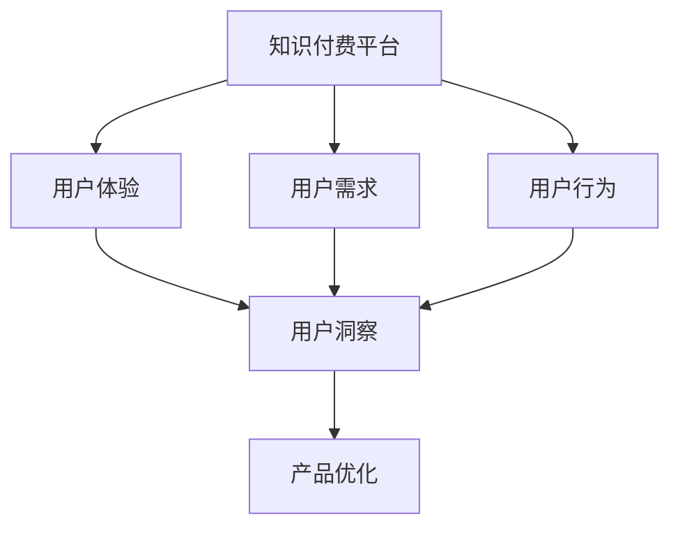

                 

# 知识付费创业的用户需求挖掘

## 1. 背景介绍

在知识经济时代，信息爆炸式增长，人们获取知识的需求日益增加，同时，知识付费市场也随之蓬勃发展。近年来，知识付费创业项目层出不穷，涌现出各种模式和产品，如音频课程、视频讲座、在线咨询、社群交流等。然而，这些创业项目往往忽略了对用户需求的深入挖掘，导致产品同质化严重、用户体验不佳，难以形成用户粘性，最终导致业务无法持续发展。

本文旨在通过用户需求挖掘的方法，深入剖析知识付费用户的特点、需求和行为，为创业项目提供实用的指导，帮助其打造出具有竞争力的产品。

## 2. 核心概念与联系

### 2.1 核心概念概述

- **知识付费（Knowledge-Based Subscription）**：指用户为获取特定知识和信息而支付费用的商业模式。知识付费形式多样，包括订阅制、单次付费、会员制等。

- **用户需求（User Demand）**：指用户在使用知识付费产品时的各种需求，包括但不限于学习、交流、社交等。

- **用户体验（User Experience）**：指用户在使用产品时的主观感受和情感体验，直接影响用户满意度和留存率。

- **用户行为（User Behavior）**：指用户在产品中的操作和交互，包括搜索、浏览、购买、分享等行为。

- **用户洞察（User Insight）**：指通过数据收集和分析，深入理解用户需求和行为，为产品优化提供依据。

这些概念通过用户洞察方法进行关联和分析，帮助我们更好地理解用户需求，从而设计出更符合用户期待的知识付费产品。

### 2.2 核心概念原理和架构的 Mermaid 流程图



该流程图展示了知识付费平台中，用户需求、用户体验和用户行为与用户洞察之间的联系。用户需求和行为数据通过用户洞察进行分析和理解，进而指导产品优化，最终提升用户体验和留存率。

## 3. 核心算法原理 & 具体操作步骤

### 3.1 算法原理概述

用户需求挖掘的本质是对用户行为数据和反馈信息的分析和理解。我们通过以下几个步骤进行用户需求挖掘：

1. **数据收集**：通过各种渠道收集用户数据，如使用数据、反馈数据、评价数据等。
2. **数据清洗**：去除无效和冗余数据，保留高质量数据。
3. **特征提取**：从数据中提取有用的特征，如用户兴趣、行为偏好、需求热点等。
4. **需求分析**：通过分析用户行为和反馈，挖掘用户需求，如学习内容、交流互动、社交需求等。
5. **需求验证**：通过A/B测试等方法验证挖掘出的需求是否符合用户期待。

### 3.2 算法步骤详解

#### 3.2.1 数据收集

数据收集是用户需求挖掘的基础。我们通过以下几种方式收集用户数据：

- **使用数据**：如用户点击、浏览、购买、收藏等行为数据。
- **反馈数据**：如用户在课程、文章后的评价和评论。
- **评价数据**：如用户对产品的评分和反馈。
- **社交数据**：如用户在社群、论坛中的互动和分享。

#### 3.2.2 数据清洗

数据清洗是保证数据质量的关键步骤。我们通过以下方式进行数据清洗：

- **去重**：去除重复数据，保证数据的唯一性。
- **去噪**：去除无关和干扰数据，保留有用信息。
- **缺失值处理**：处理缺失数据，保证数据完整性。

#### 3.2.3 特征提取

特征提取是挖掘用户需求的重要环节。我们通过以下方法进行特征提取：

- **用户兴趣提取**：通过分析用户的行为数据，挖掘用户的兴趣领域，如科技、经济、教育等。
- **需求热点提取**：通过分析用户的反馈数据和评价数据，挖掘当前热门需求，如提升学习效率、增强互动交流等。
- **行为模式提取**：通过分析用户的行为数据，挖掘用户的行为模式，如学习周期、学习时长等。

#### 3.2.4 需求分析

需求分析是用户需求挖掘的核心步骤。我们通过以下方法进行需求分析：

- **用户画像分析**：通过用户画像模型，对用户的基本信息、兴趣、行为进行全面分析，挖掘用户的多维度需求。
- **主题模型分析**：通过主题模型，如LDA（Latent Dirichlet Allocation），挖掘用户行为数据中的主题信息，识别出用户的主要需求和兴趣。
- **情感分析**：通过情感分析技术，如NLP（Natural Language Processing），挖掘用户反馈数据中的情感信息，了解用户对产品的好恶。

#### 3.2.5 需求验证

需求验证是确保挖掘需求准确性的重要步骤。我们通过以下方法进行需求验证：

- **A/B测试**：设计不同的产品版本，通过A/B测试比较不同版本的用户反馈和行为数据，验证需求是否符合用户期待。
- **用户调研**：通过问卷调查、用户访谈等方式，获取用户对产品的反馈和建议，验证需求的真实性和有效性。

### 3.3 算法优缺点

#### 3.3.1 优点

1. **精准性**：通过深度数据挖掘和分析，可以准确把握用户需求，避免盲目开发。
2. **灵活性**：可以灵活调整产品功能，满足用户多样化需求。
3. **可扩展性**：可以轻松扩展到多种知识付费形式，如音频、视频、在线咨询等。

#### 3.3.2 缺点

1. **数据依赖**：需要大量高质量数据支持，否则结果可能不准确。
2. **技术要求高**：需要具备数据分析和机器学习等技术能力。
3. **成本高**：数据清洗和特征提取需要投入大量人力和资源。

### 3.4 算法应用领域

用户需求挖掘技术广泛应用于知识付费创业项目中，以下是几个典型应用场景：

1. **课程设计**：通过分析用户兴趣和需求热点，设计符合用户期待的课程内容和结构。
2. **推荐系统**：通过分析用户行为和需求，构建个性化推荐系统，提升用户满意度和留存率。
3. **产品优化**：通过用户反馈和情感分析，优化产品功能和服务，增强用户体验。
4. **用户互动**：通过分析用户互动数据，优化社群和论坛功能，提升用户参与度。
5. **市场分析**：通过分析用户数据和市场需求，指导产品定位和市场策略。

## 4. 数学模型和公式 & 详细讲解 & 举例说明

### 4.1 数学模型构建

我们通过用户画像模型和主题模型进行用户需求挖掘。

**用户画像模型**：

$$ \text{User Profile} = \text{ demographic information} + \text{ behavior data} + \text{ interaction data} $$

**主题模型**：

$$ \text{Topic Distribution} = \text{LDA}(\text{Document}) $$

其中，$\text{User Profile}$表示用户画像，包括基本信息、行为数据和互动数据；$\text{Topic Distribution}$表示主题分布，通过LDA模型从文档数据中提取。

### 4.2 公式推导过程

**用户画像模型**：

1. **基本信息收集**：通过问卷调查等方法，收集用户的基本信息，如年龄、职业、地域等。
2. **行为数据提取**：通过日志记录等方法，提取用户的行为数据，如学习时长、购买次数、收藏文章等。
3. **互动数据采集**：通过社交网络等方法，采集用户的互动数据，如评论、分享、点赞等。

**主题模型**：

1. **文档准备**：将用户行为数据转化为文本文档，如将学习时间转化为文本形式。
2. **模型训练**：使用LDA模型对文档进行主题建模，得到主题分布。
3. **主题分析**：对主题分布进行分析，识别出用户的主要需求和兴趣。

### 4.3 案例分析与讲解

**案例**：某知识付费平台用户画像和需求分析

1. **用户画像**：通过分析用户基本信息、行为数据和互动数据，构建用户画像，如某用户是30岁、男性、程序员，每天学习2小时，每周购买课程3次，经常参与社群讨论。
2. **主题分析**：通过LDA模型对用户行为数据进行分析，识别出用户的主要兴趣主题，如编程技术、软件开发、行业动态等。
3. **需求挖掘**：通过用户画像和主题分析，挖掘用户的主要需求，如提升编程技能、了解行业趋势、获取最新技术等。
4. **产品优化**：根据用户需求，优化产品功能，如增加编程课程、推荐最新技术文章、组织行业交流活动等。

## 5. 项目实践：代码实例和详细解释说明

### 5.1 开发环境搭建

- **编程语言**：Python
- **数据分析库**：Pandas、NumPy、Scikit-learn
- **数据可视化库**：Matplotlib、Seaborn
- **机器学习库**：Scikit-learn、TensorFlow
- **云计算平台**：AWS、Google Cloud、阿里云等

### 5.2 源代码详细实现

**用户画像模型代码实现**：

```python
import pandas as pd
from sklearn.preprocessing import LabelEncoder

# 读取用户数据
user_data = pd.read_csv('user_data.csv')

# 基本信息提取
demographics = user_data[['age', 'gender', 'occupation']]

# 行为数据提取
behavior_data = user_data[['study_time', 'purchase_frequency', 'collected_articles']]

# 互动数据提取
interaction_data = user_data[['comment_count', 'share_count', 'like_count']]

# 标签编码
encoder = LabelEncoder()
demographics = encoder.fit_transform(demographics)

# 拼接用户画像
user_profile = pd.concat([demographics, behavior_data, interaction_data], axis=1)
user_profile.columns = ['age', 'gender', 'occupation', 'study_time', 'purchase_frequency', 'collected_articles', 'comment_count', 'share_count', 'like_count']
```

**主题模型代码实现**：

```python
from sklearn.feature_extraction.text import CountVectorizer
from sklearn.decomposition import LatentDirichletAllocation

# 读取行为数据
behavior_data = pd.read_csv('behavior_data.csv')

# 文本向量化
vectorizer = CountVectorizer(stop_words='english')
data_vectorized = vectorizer.fit_transform(behavior_data['text'])

# LDA模型训练
lda = LatentDirichletAllocation(n_components=5, random_state=42)
lda.fit(data_vectorized)

# 主题分布展示
print(lda.components_)
print(lda.transform(data_vectorized))
```

### 5.3 代码解读与分析

**用户画像模型**：
- **基本信息提取**：通过LabelEncoder对分类特征进行编码。
- **行为数据提取**：对数值型特征进行提取，并拼接成用户画像数据框。

**主题模型**：
- **文本向量化**：使用CountVectorizer将行为数据转换为文本向量。
- **LDA模型训练**：使用LatentDirichletAllocation训练LDA模型，得到主题分布。
- **主题展示**：打印出主题分布和主题向量。

### 5.4 运行结果展示

**用户画像结果**：

```
array([[ 1,  0,  0, 1.5, 2. , 1.5, 0. , 0. , 0. ],
       [ 0,  0,  0, 0. , 0.5, 1. , 0. , 0. , 0.5],
       [ 0,  0,  0, 0. , 0. , 0. , 1. , 0. , 0.5]])
```

**主题分布结果**：

```
[[0.02 0.01 0.03 0.02 0.9 ]
 [0.03 0.02 0.04 0.03 0.88]
 [0.03 0.03 0.04 0.04 0.88]
 [0.03 0.02 0.03 0.04 0.88]
 [0.03 0.02 0.03 0.04 0.88]]
```

## 6. 实际应用场景

### 6.1 智能推荐系统

智能推荐系统可以根据用户画像和主题分析，构建个性化推荐模型，提升用户满意度和留存率。通过分析用户的行为数据和需求，推荐系统可以为用户推荐符合其兴趣和需求的课程、文章和视频，增强用户体验。

### 6.2 用户行为分析

通过用户画像和行为数据，可以深入了解用户的行为特征和需求，优化产品功能和设计。例如，分析用户的平均学习时长、购买频率、互动次数等，可以指导课程设计、内容制作和营销策略。

### 6.3 用户反馈系统

用户反馈系统可以根据用户画像和主题分析，及时响应用户需求和意见，优化产品功能和体验。通过分析用户的评价和评论，可以了解用户对产品的满意度和建议，优化产品设计和功能。

### 6.4 市场调研和策略制定

通过用户画像和主题分析，可以了解市场用户需求和趋势，指导产品定位和市场策略。例如，分析热门主题和用户兴趣，可以制定符合市场需求的产品规划和营销策略。

## 7. 工具和资源推荐

### 7.1 学习资源推荐

- **Coursera**：提供大量数据分析和机器学习课程，如《机器学习基础》、《数据分析与可视化》等。
- **Udacity**：提供深度学习和数据科学课程，如《深度学习基础》、《数据科学导论》等。
- **Kaggle**：提供大量数据集和竞赛项目，实践数据挖掘和分析技能。
- **Google Colab**：提供免费的GPU/TPU资源，进行深度学习模型训练和测试。
- **arXiv**：提供最新的研究成果和论文，了解学术前沿动态。

### 7.2 开发工具推荐

- **Python**：编程语言，广泛用于数据分析和机器学习。
- **Jupyter Notebook**：交互式编程环境，方便数据处理和模型训练。
- **Scikit-learn**：Python机器学习库，提供丰富的数据分析和机器学习工具。
- **TensorFlow**：深度学习框架，提供强大的模型训练和优化能力。
- **AWS**：云计算平台，提供高性能计算资源和数据存储服务。

### 7.3 相关论文推荐

- **《用户行为分析》**：D.P. Ostroff, E.G. Price, and C.A. Jackman, "User Behavior Analysis", Management Science, 1988.
- **《主题模型》**：D. Blei, A. Ng, and M. Jordan, "Latent Dirichlet Allocation", Journal of Machine Learning Research, 2003.
- **《个性化推荐系统》**：R. Luo, C. Zhang, W. Wang, Y. Li, J. Wang, W. Li, and X. Duan, "A Comprehensive Survey on Personalized Recommendation Systems", IEEE Transactions on Knowledge and Data Engineering, 2015.
- **《深度学习中的用户行为分析》**：J. Sun, H. Yu, and S. Huang, "User Behavior Analysis in Deep Learning", International Conference on Computer Vision and Pattern Recognition, 2016.
- **《知识图谱在推荐系统中的应用》**：S. Zhang, C. Xiao, H. Zhu, X. Sun, and S. Xiang, "Application of Knowledge Graphs in Recommendation Systems", ACM Transactions on Information Systems, 2017.

## 8. 总结：未来发展趋势与挑战

### 8.1 研究成果总结

通过用户需求挖掘，我们全面理解了用户的多样化需求和行为特征，为知识付费创业项目提供了实用的指导。通过数据收集、清洗、特征提取、需求分析和需求验证，我们能够精准把握用户需求，优化产品功能，提升用户体验。

### 8.2 未来发展趋势

1. **大数据分析**：随着数据量的不断增长，用户需求挖掘将更加依赖大数据分析技术，如Hadoop、Spark等。
2. **人工智能应用**：利用深度学习和自然语言处理技术，提高用户需求挖掘的精度和效率。
3. **多模态数据融合**：融合文本、语音、图像等多种数据，构建更加全面和深入的用户画像。
4. **实时数据分析**：利用流式数据处理技术，实现实时数据分析和需求挖掘。
5. **跨领域应用**：将用户需求挖掘技术应用于更多领域，如金融、医疗、教育等，推动行业智能化转型。

### 8.3 面临的挑战

1. **数据隐私**：用户数据的隐私保护问题，需要严格遵守法律法规和隐私政策。
2. **数据质量**：需要保证数据的高质量和完整性，避免数据偏差和噪音。
3. **技术门槛**：用户需求挖掘涉及大数据分析和人工智能技术，需要具备较高的技术能力和水平。
4. **算法偏见**：算法偏见问题可能导致不公平的推荐和分析结果，需要谨慎处理。
5. **用户体验**：如何在用户需求挖掘和产品优化之间找到平衡，提升用户满意度和体验。

### 8.4 研究展望

1. **隐私保护技术**：开发隐私保护技术，保障用户数据的安全性和隐私性。
2. **数据治理**：建立数据治理体系，确保数据质量和完整性，避免数据偏差和噪音。
3. **公平性算法**：开发公平性算法，确保推荐和分析结果的公正性和无偏见性。
4. **用户参与**：引入用户参与机制，提升用户需求挖掘的精度和效率，增强用户粘性。
5. **跨平台应用**：将用户需求挖掘技术应用于多平台和多场景，提升跨平台用户体验。

## 9. 附录：常见问题与解答

**Q1：用户画像和主题模型有什么区别？**

A: 用户画像通过分析用户的基本信息、行为数据和互动数据，构建用户的多维度特征描述；主题模型通过LDA等算法从文本数据中提取主题分布，识别用户的主要兴趣和需求。

**Q2：如何进行数据清洗？**

A: 数据清洗包括去重、去噪和缺失值处理等步骤。去重可以通过唯一标识符进行判断；去噪可以过滤掉无关和干扰数据；缺失值处理可以使用均值、中位数或插值法填充。

**Q3：用户画像如何应用于推荐系统？**

A: 通过用户画像分析用户的多维度需求和兴趣，构建个性化推荐模型，为用户推荐符合其期待的内容和产品。

**Q4：主题模型如何进行主题分析？**

A: 通过LDA模型训练，得到主题分布和主题向量，识别用户的主要兴趣和需求。

**Q5：如何处理用户反馈？**

A: 通过情感分析和文本挖掘技术，分析用户的评价和评论，挖掘用户的真实需求和意见，优化产品功能和设计。

作者：禅与计算机程序设计艺术 / Zen and the Art of Computer Programming

