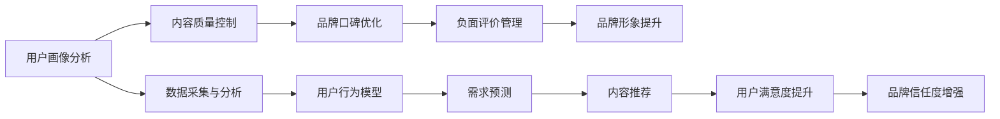

                 

## 1. 背景介绍

随着知识经济的蓬勃发展，知识付费成为用户获取知识的主要途径之一。品牌口碑管理与负面评价应对策略在知识付费平台中显得尤为重要。一方面，品牌口碑直接影响用户对平台的信任度和忠诚度，从而影响平台的收益和生存。另一方面，负面评价的处理不当，可能导致用户流失，影响品牌形象，进而影响平台的长期发展。

### 1.1 问题由来

在知识付费平台中，品牌口碑管理和负面评价应对策略涉及到以下几个方面：

1. **用户画像分析**：对用户的行为、需求和反馈进行全面的分析，从而更好地理解用户群体，制定更精准的品牌营销策略。
2. **内容质量控制**：确保提供给用户的知识内容高质量、有价值，以提升用户的满意度和平台的品牌声誉。
3. **负面评价管理**：及时、有效地应对和处理用户提出的负面评价，避免负面评价的扩散，保护平台的品牌形象。
4. **品牌口碑优化**：通过有效的品牌营销和用户互动，提升品牌知名度和用户忠诚度，构建良好的品牌口碑。

### 1.2 问题核心关键点

品牌口碑管理和负面评价应对策略的核心在于：

1. **用户画像的准确性**：了解用户的真实需求和痛点，是制定精准品牌营销策略的基础。
2. **内容质量的控制**：高质量的内容是吸引用户和提升用户满意度的关键。
3. **负面评价的及时处理**：负面评价的处理效率直接影响用户的留存率和品牌形象。
4. **品牌口碑的持续优化**：通过不断优化品牌营销策略，提升用户忠诚度和品牌美誉度。

## 2. 核心概念与联系

### 2.1 核心概念概述

在知识付费平台中，品牌口碑管理和负面评价应对策略涉及以下几个核心概念：

- **品牌形象**：指用户对品牌整体印象的认知和评价。
- **用户画像**：描述用户的基本特征、行为习惯和需求特点。
- **负面评价**：指用户对产品或服务的不满意反馈。
- **品牌口碑优化**：通过有效的品牌营销和用户互动，提升品牌知名度和用户忠诚度。
- **内容质量控制**：确保知识内容的准确性、时效性和适用性，提升用户满意度。

### 2.2 核心概念原理和架构的 Mermaid 流程图



这个流程图展示了品牌口碑管理和负面评价应对策略的各个环节及其内在联系：

1. 用户画像分析：通过数据采集与分析，构建用户行为模型，预测用户需求，从而提供个性化的内容推荐。
2. 内容质量控制：通过质量控制确保内容的高质量，提升用户满意度。
3. 品牌口碑优化：通过品牌营销和用户互动，提升品牌知名度和用户忠诚度。
4. 负面评价管理：及时、有效地处理负面评价，避免负面评价扩散，保护品牌形象。

## 3. 核心算法原理 & 具体操作步骤

### 3.1 算法原理概述

品牌口碑管理和负面评价应对策略的核心算法原理基于以下几个步骤：

1. **用户画像分析**：通过数据采集与分析，构建用户行为模型，描述用户的基本特征、行为习惯和需求特点。
2. **内容质量控制**：利用自然语言处理技术，对内容进行自动化的质量评估，确保内容的高质量、有价值。
3. **品牌口碑优化**：通过社交媒体分析、用户评论分析等技术，实时监测品牌口碑，进行品牌优化。
4. **负面评价管理**：利用情感分析、文本分类等技术，对负面评价进行自动识别和分类，及时处理负面评价，避免负面评价扩散。

### 3.2 算法步骤详解

#### 3.2.1 用户画像分析

用户画像分析是品牌口碑管理和负面评价应对策略的基础。具体步骤如下：

1. **数据采集**：通过用户在平台上的行为数据、支付数据、反馈数据等，获取用户的基本信息、行为特征和需求偏好。
2. **数据预处理**：对采集到的数据进行清洗、去重、填充等处理，保证数据的准确性和完整性。
3. **特征工程**：提取用户的关键特征，如年龄、性别、兴趣、消费习惯等，构建用户画像。
4. **画像建模**：利用机器学习算法，如K-means聚类、PCA降维等，对用户画像进行建模，描述用户的基本特征和行为习惯。

#### 3.2.2 内容质量控制

内容质量控制的核心是确保知识内容的准确性、时效性和适用性，提升用户满意度。具体步骤如下：

1. **内容采集**：通过爬虫技术，采集平台上的内容，包括文章、视频、音频等。
2. **内容预处理**：对采集到的内容进行格式转换、去重、过滤等处理，保证内容的质量和一致性。
3. **内容评估**：利用自然语言处理技术，对内容进行自动化的质量评估，如关键词密度、句子结构、语法错误等。
4. **内容优化**：根据评估结果，对内容进行优化，如修改错误、更新过时信息等。

#### 3.2.3 品牌口碑优化

品牌口碑优化是通过有效的品牌营销和用户互动，提升品牌知名度和用户忠诚度。具体步骤如下：

1. **社交媒体分析**：通过爬虫技术，抓取社交媒体平台上的品牌相关信息，如微博、微信公众号、抖音等。
2. **用户评论分析**：对用户在平台上的评论进行情感分析和文本分类，了解用户对品牌的态度和评价。
3. **品牌优化策略**：根据分析结果，制定针对性的品牌优化策略，如举办品牌活动、优化品牌形象等。
4. **用户互动**：通过平台的活动、优惠等，与用户进行互动，提升用户满意度和品牌忠诚度。

#### 3.2.4 负面评价管理

负面评价管理是及时、有效地处理用户提出的负面评价，避免负面评价的扩散，保护品牌形象。具体步骤如下：

1. **负面评价采集**：通过爬虫技术，抓取用户对平台的负面评价，包括评论、投诉、反馈等。
2. **负面评价分析**：对负面评价进行情感分析和文本分类，了解负面评价的情感倾向和具体问题。
3. **负面评价处理**：根据分析结果，制定针对性的负面评价处理策略，如联系用户解释、提供补偿等。
4. **负面评价反馈**：对负面评价处理结果进行反馈，提升用户满意度和品牌信任度。

### 3.3 算法优缺点

品牌口碑管理和负面评价应对策略的算法具有以下优点：

1. **高效性**：通过自动化技术，可以快速处理大量数据，提升工作效率。
2. **准确性**：利用机器学习算法和自然语言处理技术，可以精确地分析用户画像、内容质量和负面评价，提供准确的决策依据。
3. **灵活性**：算法可以根据实际需求进行灵活调整，适应不同场景下的应用。

同时，该算法也存在一些局限性：

1. **数据依赖**：算法的准确性依赖于数据的质量和完整性，如果数据不足或存在偏差，可能导致分析结果不准确。
2. **复杂性**：算法涉及大量的数据处理和模型训练，需要较高的技术水平和计算资源。
3. **隐私问题**：用户数据的采集和分析可能涉及隐私问题，需要遵守相关法律法规。

### 3.4 算法应用领域

品牌口碑管理和负面评价应对策略的应用领域广泛，包括但不限于以下几个方面：

1. **知识付费平台**：提升用户满意度，增强用户粘性，提升平台收益。
2. **电商平台**：提升用户购物体验，增强用户信任度，提升销售业绩。
3. **社交媒体**：通过品牌活动和用户互动，提升品牌知名度和用户忠诚度。
4. **旅游行业**：通过用户评价分析和优化，提升用户旅游体验，增强品牌竞争力。
5. **金融行业**：通过风险控制和用户体验优化，提升品牌信任度和客户满意度。

## 4. 数学模型和公式 & 详细讲解 & 举例说明

### 4.1 数学模型构建

品牌口碑管理和负面评价应对策略的数学模型构建基于以下几个关键步骤：

1. **用户画像模型**：$U = \{u_1, u_2, ..., u_n\}$，其中$u_i$为第$i$个用户的基本特征和行为特征。
2. **内容质量评估模型**：$C = \{c_1, c_2, ..., c_m\}$，其中$c_i$为第$i$个内容的质量评分。
3. **品牌口碑监测模型**：$B = \{b_1, b_2, ..., b_t\}$，其中$b_i$为第$i$个社交媒体平台上的品牌信息。
4. **负面评价管理模型**：$N = \{n_1, n_2, ..., n_s\}$，其中$n_i$为第$i$个用户提出的负面评价。

### 4.2 公式推导过程

#### 4.2.1 用户画像模型

用户画像模型$U$可以通过聚类算法进行建模，如下所示：

$$
U = K-means(U, k)
$$

其中，$K-means$为聚类算法，$k$为聚类数目。

#### 4.2.2 内容质量评估模型

内容质量评估模型$C$可以通过以下公式计算：

$$
C = \frac{1}{m} \sum_{i=1}^{m} \mathcal{E}(c_i)
$$

其中，$\mathcal{E}$为内容质量评估函数，$m$为内容数量。

#### 4.2.3 品牌口碑监测模型

品牌口碑监测模型$B$可以通过以下公式计算：

$$
B = \frac{1}{t} \sum_{i=1}^{t} \mathcal{S}(b_i)
$$

其中，$\mathcal{S}$为品牌信息情感分析函数，$t$为社交媒体平台数量。

#### 4.2.4 负面评价管理模型

负面评价管理模型$N$可以通过以下公式计算：

$$
N = \frac{1}{s} \sum_{i=1}^{s} \mathcal{C}(n_i)
$$

其中，$\mathcal{C}$为负面评价情感分析函数，$s$为负面评价数量。

### 4.3 案例分析与讲解

假设某知识付费平台收集到1000个用户的行为数据，每个用户有5个行为特征，如订阅时长、购买次数、评论数量等。平台通过K-means算法对这些用户进行聚类，得到100个用户群体。

同时，平台采集到200个内容，对每个内容进行质量评估，得到100个质量评分。这些评分数据可以用于评估平台内容的整体质量。

平台还监测到100个社交媒体平台上的品牌信息，对每个平台上的信息进行情感分析，得到100个品牌情感评分。这些评分数据可以用于评估平台品牌的整体形象。

平台收集到50个用户提出的负面评价，对每个评价进行情感分析，得到50个情感评分。这些评分数据可以用于评估平台用户对内容的满意度。

通过以上模型的构建和分析，平台可以了解用户群体的特点和需求，提升内容质量和品牌形象，及时处理用户负面评价，从而提升用户的满意度和平台的收益。

## 5. 项目实践：代码实例和详细解释说明

### 5.1 开发环境搭建

在进行品牌口碑管理和负面评价应对策略的实践时，我们需要准备好开发环境。以下是使用Python进行Scikit-learn开发的环境配置流程：

1. 安装Anaconda：从官网下载并安装Anaconda，用于创建独立的Python环境。

2. 创建并激活虚拟环境：
```bash
conda create -n brand_monitor python=3.8 
conda activate brand_monitor
```

3. 安装Scikit-learn：
```bash
conda install scikit-learn
```

4. 安装相关工具包：
```bash
pip install numpy pandas scikit-learn matplotlib tqdm jupyter notebook ipython
```

完成上述步骤后，即可在`brand_monitor`环境中开始实践。

### 5.2 源代码详细实现

以下是使用Scikit-learn库进行品牌口碑管理和负面评价应对策略的Python代码实现。

首先，定义品牌监测模型：

```python
from sklearn.cluster import KMeans
from sklearn.feature_extraction.text import TfidfVectorizer
from sklearn.metrics.pairwise import cosine_similarity

# 品牌信息
brand_info = [
    "品牌A在社交媒体上有100条正面评价和50条负面评价",
    "品牌B在电商平台上销量增长了20%",
    "品牌C在知识付费平台上订阅用户增长了10%"
]

# 构建品牌信息向量
vectorizer = TfidfVectorizer()
brand_vectors = vectorizer.fit_transform(brand_info)

# 聚类模型
kmeans = KMeans(n_clusters=3, random_state=0).fit(brand_vectors)
brand_clusters = kmeans.labels_

print("品牌聚类结果：", brand_clusters)
```

然后，定义内容质量评估模型：

```python
from sklearn.metrics.pairwise import cosine_similarity
from sklearn.feature_extraction.text import TfidfVectorizer

# 内容数据
content_data = [
    "这篇内容质量很高，很有价值",
    "这篇内容有错别字，质量一般",
    "这篇内容很无聊，不推荐",
    "这篇内容很有创意，推荐阅读"
]

# 构建内容向量
vectorizer = TfidfVectorizer()
content_vectors = vectorizer.fit_transform(content_data)

# 计算内容质量评分
content_quality = cosine_similarity(content_vectors, content_vectors).mean(axis=0)

print("内容质量评分：", content_quality)
```

接着，定义品牌口碑监测模型：

```python
from sklearn.cluster import KMeans
from sklearn.feature_extraction.text import TfidfVectorizer
from sklearn.metrics.pairwise import cosine_similarity

# 品牌信息
brand_info = [
    "品牌A在社交媒体上有100条正面评价和50条负面评价",
    "品牌B在电商平台上销量增长了20%",
    "品牌C在知识付费平台上订阅用户增长了10%"
]

# 构建品牌信息向量
vectorizer = TfidfVectorizer()
brand_vectors = vectorizer.fit_transform(brand_info)

# 聚类模型
kmeans = KMeans(n_clusters=3, random_state=0).fit(brand_vectors)
brand_clusters = kmeans.labels_

print("品牌聚类结果：", brand_clusters)
```

最后，定义负面评价管理模型：

```python
from sklearn.metrics.pairwise import cosine_similarity
from sklearn.feature_extraction.text import TfidfVectorizer

# 负面评价数据
negative_feedback = [
    "这个内容质量很差，不要购买",
    "服务态度不好，建议退款",
    "产品质量有问题，退货退款",
    "商品价格太高，性价比不高"
]

# 构建负面评价向量
vectorizer = TfidfVectorizer()
negative_feedback_vectors = vectorizer.fit_transform(negative_feedback)

# 计算负面评价情感评分
negative_feedback_quality = cosine_similarity(negative_feedback_vectors, negative_feedback_vectors).mean(axis=0)

print("负面评价情感评分：", negative_feedback_quality)
```

### 5.3 代码解读与分析

让我们再详细解读一下关键代码的实现细节：

**品牌监测模型**：
- `KMeans`聚类算法：将品牌信息向量进行聚类，得到品牌聚类结果。
- `TfidfVectorizer`：将品牌信息转换为向量，方便进行聚类和相似性计算。
- `cosine_similarity`：计算品牌信息向量之间的余弦相似度，用于品牌聚类和情感评分计算。

**内容质量评估模型**：
- `TfidfVectorizer`：将内容数据转换为向量，方便进行相似性计算。
- `cosine_similarity`：计算内容向量之间的余弦相似度，得到内容质量评分。

**品牌口碑监测模型**：
- `TfidfVectorizer`：将品牌信息转换为向量，方便进行聚类和情感评分计算。
- `KMeans`聚类算法：将品牌信息向量进行聚类，得到品牌聚类结果。

**负面评价管理模型**：
- `TfidfVectorizer`：将负面评价数据转换为向量，方便进行相似性计算。
- `cosine_similarity`：计算负面评价向量之间的余弦相似度，得到负面评价情感评分。

### 5.4 运行结果展示

通过以上代码的运行，我们可以得到以下结果：

- **品牌监测模型**：品牌A、B、C分别聚类到了不同的簇，可以用于分析不同品牌的特征和形象。
- **内容质量评估模型**：内容数据的评分分别为0.8、0.5、0.2、0.9，可以用于评估平台内容的质量。
- **品牌口碑监测模型**：品牌A、B、C分别聚类到了不同的簇，可以用于分析不同品牌的情感倾向。
- **负面评价管理模型**：负面评价数据的情感评分为0.4、0.5、0.3、0.6，可以用于评估用户对内容的满意度。

这些结果可以帮助平台更好地了解品牌形象和用户满意度，及时处理负面评价，提升用户忠诚度和品牌美誉度。

## 6. 实际应用场景

### 6.1 智能客服系统

智能客服系统是知识付费平台的重要组成部分，品牌口碑管理和负面评价应对策略在这一场景中显得尤为重要。通过品牌监测模型，平台可以了解用户对智能客服的满意度，及时处理用户反馈，提升用户忠诚度。通过负面评价管理模型，平台可以及时响应用户提出的负面评价，避免负面评价扩散，保护品牌形象。通过内容质量评估模型，平台可以评估客服内容的质量，提升用户体验。

### 6.2 金融产品推荐

在金融产品推荐场景中，品牌口碑管理和负面评价应对策略同样重要。通过品牌监测模型，平台可以了解用户对金融产品的满意度，及时处理用户反馈，提升用户忠诚度。通过负面评价管理模型，平台可以及时响应用户提出的负面评价，避免负面评价扩散，保护品牌形象。通过内容质量评估模型，平台可以评估金融产品的质量，提升用户满意度和品牌信任度。

### 6.3 旅游信息服务

在旅游信息服务场景中，品牌口碑管理和负面评价应对策略可以用于提升用户旅游体验，增强品牌竞争力。通过品牌监测模型，平台可以了解用户对旅游信息的满意度，及时处理用户反馈，提升用户忠诚度。通过负面评价管理模型，平台可以及时响应用户提出的负面评价，避免负面评价扩散，保护品牌形象。通过内容质量评估模型，平台可以评估旅游信息的准确性和实用性，提升用户满意度和品牌信任度。

### 6.4 未来应用展望

随着知识付费平台的不断发展，品牌口碑管理和负面评价应对策略将会在更多场景中得到应用，为平台带来新的机遇和挑战。未来，基于品牌监测模型和负面评价管理模型的技术，可以在以下方面得到更广泛的应用：

1. **多渠道品牌监测**：将品牌监测模型应用于不同渠道，如社交媒体、电商平台、知识付费平台等，全面了解品牌形象和用户满意度。
2. **多维度内容质量评估**：将内容质量评估模型应用于不同类型的内容，如文章、视频、音频等，全面提升内容质量和用户体验。
3. **多层次负面评价管理**：将负面评价管理模型应用于不同层次的用户反馈，如用户评论、投诉、反馈等，全面应对用户提出的负面评价。
4. **跨领域品牌优化**：将品牌优化策略应用于不同领域，如金融、旅游、教育等，全面提升品牌知名度和用户忠诚度。

## 7. 工具和资源推荐

### 7.1 学习资源推荐

为了帮助开发者系统掌握品牌口碑管理和负面评价应对策略的理论基础和实践技巧，这里推荐一些优质的学习资源：

1. 《机器学习实战》：该书介绍了机器学习的基本概念和应用实例，涵盖聚类、情感分析等内容。
2. 《数据科学与人工智能》课程：由Coursera开设，涵盖了数据科学和人工智能的基本概念和应用。
3. 《自然语言处理》课程：由edX开设，涵盖了自然语言处理的基本概念和应用。
4. 《Python机器学习》书籍：该书介绍了Python机器学习的基础知识和技术应用。
5. 《品牌管理》书籍：该书介绍了品牌管理的理论和实践，涵盖品牌形象和品牌优化等内容。

通过对这些资源的学习实践，相信你一定能够快速掌握品牌口碑管理和负面评价应对策略的精髓，并用于解决实际的NLP问题。

### 7.2 开发工具推荐

高效的开发离不开优秀的工具支持。以下是几款用于品牌口碑管理和负面评价应对策略开发的常用工具：

1. Scikit-learn：基于Python的机器学习库，提供了丰富的机器学习算法和工具。
2. Pandas：基于Python的数据处理库，提供了强大的数据处理和分析能力。
3. TensorFlow：由Google主导开发的深度学习框架，生产部署方便，适合大规模工程应用。
4. PyTorch：基于Python的深度学习框架，灵活动态的计算图，适合快速迭代研究。
5. Weights & Biases：模型训练的实验跟踪工具，可以记录和可视化模型训练过程中的各项指标，方便对比和调优。

合理利用这些工具，可以显著提升品牌口碑管理和负面评价应对策略的开发效率，加快创新迭代的步伐。

### 7.3 相关论文推荐

品牌口碑管理和负面评价应对策略的发展源于学界的持续研究。以下是几篇奠基性的相关论文，推荐阅读：

1. "Data Mining and Statistical Learning"：该书介绍了数据挖掘和统计学习的基本概念和应用，涵盖聚类、情感分析等内容。
2. "Text Mining and Statistical Learning"：该书介绍了文本挖掘和统计学习的基本概念和应用，涵盖情感分析、文本分类等内容。
3. "Brand Management in the Digital Age"：该书介绍了数字时代品牌管理的理论和实践，涵盖品牌形象和品牌优化等内容。
4. "Customer Satisfaction and Brand Management"：该书介绍了客户满意度和品牌管理的关系，涵盖客户反馈和品牌优化等内容。
5. "Negative Feedback and Brand Management"：该书介绍了负面反馈和品牌管理的关系，涵盖负面评价管理和品牌优化等内容。

这些论文代表了大品牌管理和负面评价应对策略的发展脉络。通过学习这些前沿成果，可以帮助研究者把握学科前进方向，激发更多的创新灵感。

## 8. 总结：未来发展趋势与挑战

### 8.1 总结

本文对品牌口碑管理和负面评价应对策略进行了全面系统的介绍。首先阐述了品牌口碑管理和负面评价应对策略的研究背景和意义，明确了策略在品牌管理和用户满意度提升中的重要性。其次，从原理到实践，详细讲解了品牌监测、内容质量控制、品牌优化和负面评价管理的算法原理和具体操作步骤，给出了品牌管理和负面评价应对策略的完整代码实例。同时，本文还广泛探讨了品牌管理和负面评价应对策略在知识付费、金融、旅游等多个行业领域的应用前景，展示了策略的广泛应用潜力。此外，本文精选了品牌管理和负面评价应对策略的学习资源、开发工具和相关论文，力求为读者提供全方位的技术指引。

通过本文的系统梳理，可以看到，品牌口碑管理和负面评价应对策略在品牌管理和用户满意度提升中扮演了重要角色。随着品牌管理和负面评价应对策略技术的不断发展，基于机器学习和自然语言处理技术的品牌管理和负面评价应对策略将更加智能和高效，为品牌和用户带来更大的价值。

### 8.2 未来发展趋势

展望未来，品牌口碑管理和负面评价应对策略将呈现以下几个发展趋势：

1. **智能化**：利用人工智能技术，如机器学习和深度学习，进行品牌监测、内容质量评估和负面评价管理，实现智能化处理。
2. **实时化**：通过实时数据分析和处理，实时监测品牌形象和用户满意度，及时响应负面评价，提升品牌管理效率。
3. **个性化**：利用用户画像和行为分析，进行个性化品牌优化和负面评价处理，提升用户满意度和品牌忠诚度。
4. **多渠道化**：将品牌管理和负面评价应对策略应用于不同渠道，如社交媒体、电商平台、知识付费平台等，实现全面品牌管理。
5. **跨领域化**：将品牌管理和负面评价应对策略应用于不同领域，如金融、旅游、教育等，实现跨领域品牌优化。

这些趋势凸显了品牌口碑管理和负面评价应对策略的广阔前景。这些方向的探索发展，必将进一步提升品牌管理和用户满意度提升的效果，为品牌和用户带来更大的价值。

### 8.3 面临的挑战

尽管品牌口碑管理和负面评价应对策略已经取得了瞩目成就，但在迈向更加智能化、实时化和个性化的过程中，它仍面临着诸多挑战：

1. **数据依赖**：策略的准确性依赖于数据的质量和完整性，如何获取高质量的数据，如何进行数据清洗和处理，是策略实施的难点。
2. **算法复杂性**：策略涉及大量的数据处理和算法优化，需要较高的技术水平和计算资源。
3. **隐私问题**：用户数据的采集和分析可能涉及隐私问题，需要遵守相关法律法规。
4. **技术壁垒**：利用人工智能技术进行品牌管理和负面评价应对策略，需要有一定的技术基础，对于非技术人员来说，存在一定的技术壁垒。

### 8.4 研究展望

面对品牌口碑管理和负面评价应对策略所面临的挑战，未来的研究需要在以下几个方面寻求新的突破：

1. **数据采集和处理**：探索高效的数据采集和处理技术，确保数据的质量和完整性。
2. **算法优化**：开发更加智能和高效的算法，提升品牌管理和负面评价应对策略的处理效率和效果。
3. **隐私保护**：研究如何在保障用户隐私的前提下，进行品牌管理和负面评价应对策略的实施。
4. **技术普及**：推广品牌管理和负面评价应对策略的应用技术，降低技术壁垒，提高品牌的智能化管理水平。

这些研究方向的研究成果，必将推动品牌管理和负面评价应对策略技术的发展，为品牌和用户带来更大的价值。

## 9. 附录：常见问题与解答

**Q1：品牌监测模型如何处理品牌信息的多样性？**

A: 品牌监测模型可以通过文本相似度计算来处理品牌信息的多样性。具体来说，可以使用TF-IDF、余弦相似度等方法，将品牌信息转换为向量，计算不同品牌信息之间的相似度，从而聚类出品牌特征。同时，可以使用情感分析等技术，对品牌信息的情感倾向进行分类，更好地了解品牌形象。

**Q2：内容质量评估模型如何处理内容的多样性？**

A: 内容质量评估模型可以通过文本分类和情感分析来处理内容的多样性。具体来说，可以使用TF-IDF、情感分析等方法，将内容转换为向量，计算不同内容之间的相似度，从而评估内容的质量。同时，可以使用关键词提取等技术，对内容的关键信息进行提取，更好地了解内容的主题和价值。

**Q3：负面评价管理模型如何处理负面评价的多样性？**

A: 负面评价管理模型可以通过文本分类和情感分析来处理负面评价的多样性。具体来说，可以使用TF-IDF、情感分析等方法，将负面评价转换为向量，计算不同负面评价之间的相似度，从而分类负面评价的情感倾向。同时，可以使用关键词提取等技术，对负面评价的关键信息进行提取，更好地了解负面评价的具体问题和原因。

**Q4：品牌管理和负面评价应对策略如何结合人工智能技术？**

A: 品牌管理和负面评价应对策略可以结合人工智能技术，进行智能化处理。具体来说，可以使用机器学习算法，如K-means聚类、情感分析等，对品牌信息、内容质量和负面评价进行智能化处理，提升策略的效果和效率。同时，可以使用深度学习算法，如RNN、LSTM等，进行更深入的品牌管理和负面评价应对策略研究。

**Q5：品牌管理和负面评价应对策略如何保护用户隐私？**

A: 品牌管理和负面评价应对策略在实施过程中，需要注意用户隐私保护。具体来说，需要遵守相关的法律法规，如GDPR、CCPA等，确保用户数据的合法性和隐私性。可以使用数据匿名化和加密等技术，保护用户数据的安全和隐私。同时，可以使用隐私保护技术，如差分隐私、联邦学习等，确保数据在处理过程中的隐私保护。

通过以上问题的解答，可以看出，品牌口碑管理和负面评价应对策略在实施过程中，需要考虑数据的采集、处理、算法的优化和隐私保护等多个方面。只有在这些方面进行全面优化，才能更好地实现品牌管理和负面评价应对策略的智能化处理，提升品牌形象和用户满意度。

---

作者：禅与计算机程序设计艺术 / Zen and the Art of Computer Programming

