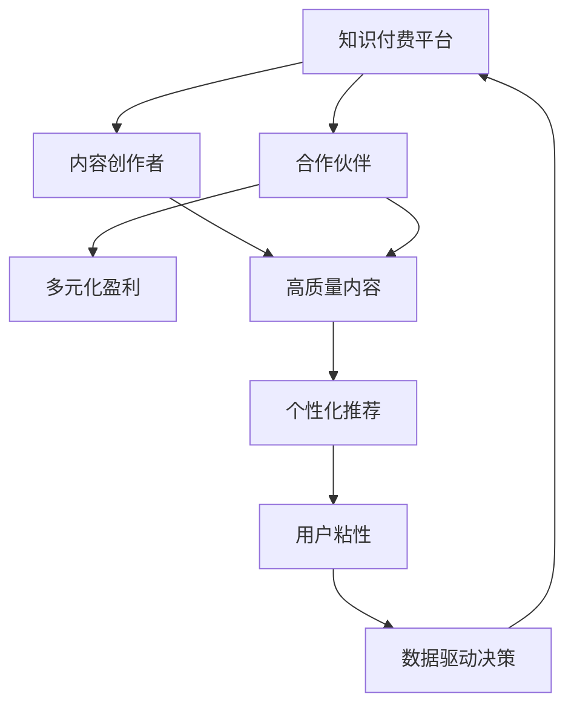

                 

# 知识付费赚钱的渠道拓展与合作伙伴管理

## 1. 背景介绍

### 1.1 问题由来

随着互联网的普及和技术的进步，知识付费已经成为教育培训、职业技能提升、专业咨询等领域的重要商业模式。知识付费平台不仅为内容创作者提供了新的变现方式，也使得广大用户能获取更高质量、更为专业的知识服务。

然而，单一的付费模式和平台的局限性也逐渐显现出来，知识付费的渠道拓展和合作伙伴管理成为亟待解决的问题。如何构建多元化的盈利模式，加强内容质量和用户体验，形成良性循环，是大数据时代知识付费发展的重要课题。

### 1.2 问题核心关键点

知识付费的核心在于内容的价值传递和用户需求匹配。平台应通过渠道拓展和合作伙伴管理，扩大内容覆盖，提升用户体验，同时不断优化商业模式，确保内容质量和平台收益。

具体来说，问题核心包括：
1. **渠道拓展**：除了传统的订阅、按需付费外，探索更灵活多样的付费模式，如虚拟课程、个性化定制、专家问答等。
2. **合作伙伴管理**：筛选和管理优质的内容创作者，激励其持续产出高质量内容，同时引入更多领域专家，丰富平台内容库。
3. **商业合作**：与其他教育、媒体、企业等机构合作，整合资源，共同推广，扩大知识付费的影响力和市场份额。
4. **用户体验优化**：通过算法推荐、个性化推送等方式，提高内容发现和使用的便捷性，增强用户粘性。
5. **数据驱动决策**：运用数据分析手段，洞察用户行为和需求，精准营销，提升运营效率。

## 2. 核心概念与联系

### 2.1 核心概念概述

为更好地理解知识付费的渠道拓展和合作伙伴管理，本节将介绍几个关键概念：

- 知识付费(Subscription-based Model)：即用户为获取专业知识和技能而支付费用的模式。常见平台如网易云课堂、得到、知乎live等。
- 内容创作者(Content Creators)：提供知识内容的专业人士、学者、从业者等，其产出为知识付费平台的主要资产。
- 合作伙伴(Strategic Partners)：与知识付费平台进行深度合作的各类机构，如教育机构、企业、媒体等，共同推广和扩大市场影响力。
- 渠道拓展(Channel Diversification)：除传统的订阅、按需付费模式外，探索多元化的付费和盈利方式，以适应不同用户需求。
- 合作伙伴管理(Partner Management)：筛选和维护优质合作伙伴，通过合作协议、激励机制等方式，确保合作伙伴持续提供高质量的内容和服务。

这些核心概念之间的逻辑关系可以通过以下Mermaid流程图来展示：



这个流程图展示出知识付费平台的核心组成和运作逻辑：

1. 知识付费平台通过内容创作者和合作伙伴的配合，提供丰富多样的知识服务。
2. 平台通过渠道拓展和合作伙伴管理，引入更多优质资源，满足用户多样化的需求。
3. 高质量的内容是平台吸引用户的关键，个性化推荐和数据驱动决策提升用户体验和运营效率。

## 3. 核心算法原理 & 具体操作步骤

### 3.1 算法原理概述

知识付费平台的渠道拓展和合作伙伴管理，本质上是一个多维度的资源优化和市场推广问题。通过数据分析、用户行为研究等手段，优化资源配置和市场策略，最大化平台收益。

核心算法包括：

1. **内容推荐算法**：通过用户行为数据、内容标签、兴趣偏好等，精准推荐优质内容。
2. **合作伙伴筛选算法**：综合评价合作伙伴的资质、声誉、内容质量等指标，筛选优质合作伙伴。
3. **用户留存模型**：利用用户流失数据、行为分析等，预测用户流失原因，优化用户体验。
4. **营销优化模型**：通过A/B测试、数据驱动等手段，优化营销策略，提升转化率。

### 3.2 算法步骤详解

**Step 1: 准备数据集和模型**

1. **数据准备**：收集平台用户行为数据、内容评价数据、流失用户数据、合作伙伴数据等，构建数据集。
2. **特征工程**：提取用户行为、内容标签、时间戳、地理位置等特征，用于模型训练。
3. **模型选择**：根据具体问题选择合适的算法，如协同过滤、决策树、随机森林等。

**Step 2: 内容推荐算法**

1. **用户画像建模**：分析用户行为，建立用户兴趣和偏好的模型。
2. **内容评分**：对内容进行评分，考虑用户评分、标签、热度等因素。
3. **推荐算法**：应用协同过滤、矩阵分解等算法，构建推荐模型。

**Step 3: 合作伙伴筛选算法**

1. **合作伙伴评估指标**：定义合作伙伴资质、内容质量、用户满意度等评估指标。
2. **筛选算法设计**：通过聚类、分类等算法，筛选满足指标的合作伙伴。
3. **评估与反馈**：定期对筛选出的合作伙伴进行评估，根据用户反馈调整筛选策略。

**Step 4: 用户留存模型**

1. **流失用户分析**：分析用户流失的原因，如内容质量、付费体验、技术问题等。
2. **模型构建**：建立用户流失预测模型，考虑时间序列、特征等。
3. **留存策略优化**：根据模型结果，优化内容推送、付费激励等策略。

**Step 5: 营销优化模型**

1. **A/B测试设计**：设计营销策略，如优惠券、折扣、新用户优惠等。
2. **数据驱动决策**：利用数据驱动营销策略，提升转化率。
3. **效果评估**：评估营销效果，优化营销策略。

### 3.3 算法优缺点

知识付费平台的渠道拓展和合作伙伴管理，其核心算法具有以下优点：

1. **精准推荐**：通过数据分析和算法优化，提高内容推荐的精准度，满足用户多样化需求。
2. **资源优化**：通过筛选和管理合作伙伴，优化平台内容资源配置，提升平台收益。
3. **市场推广**：通过多样化渠道和精准营销，扩大知识付费平台的影响力和市场份额。

同时，该方法也存在一定的局限性：

1. **数据隐私**：在收集用户数据和合作伙伴数据时，需要确保数据隐私和合规性，避免用户和合作伙伴的敏感信息泄露。
2. **用户隐私**：个性化推荐和精准营销需要用户授权，可能引发用户隐私保护的担忧。
3. **合作伙伴管理**：筛选和管理合作伙伴需要平衡收益和风险，确保合作伙伴提供高质量的内容和服务。
4. **市场竞争**：知识付费市场的竞争激烈，平台需要不断创新，保持市场竞争力。

尽管存在这些局限性，但就目前而言，基于数据分析和算法优化的方法仍是知识付费平台市场推广和内容管理的重要手段。未来相关研究的重点在于如何进一步提高算法效率和数据安全性，同时兼顾市场推广和用户隐私保护。

### 3.4 算法应用领域

基于知识付费平台的数据分析和算法优化，已在以下领域得到广泛应用：

- 教育培训：在线教育平台通过个性化推荐和数据驱动决策，提升课程效果和用户体验。
- 职业技能培训：专业咨询和职业培训平台，提供定制化培训服务，精准匹配用户需求。
- 企业内训：企业内部培训管理系统，通过数据分析优化培训内容和效果，提升员工技能和满意度。
- 媒体传播：新闻、文化、艺术等媒体平台，通过多样化内容推荐和精准营销，扩大用户基础。
- 广告推广：广告投放和品牌推广平台，利用用户行为数据优化广告投放策略，提高转化率。

除了上述这些经典应用外，知识付费平台的算法优化技术还将在更多场景中得到应用，如医疗健康、旅游度假、金融理财等，为各行业带来新的突破。

## 4. 数学模型和公式 & 详细讲解  
### 4.1 数学模型构建

本节将使用数学语言对知识付费平台的渠道拓展和合作伙伴管理过程进行更加严格的刻画。

记知识付费平台为 $M$，其中 $X$ 为用户行为数据集， $Y$ 为内容评分数据集， $Z$ 为合作伙伴数据集。假设平台有 $n$ 个内容创作者，每个创作者提供 $m$ 个内容，每个内容有一个评分 $y_{i,j}$，合作伙伴 $p$ 有一个评分 $z_p$。

定义内容推荐算法为 $R$，合作伙伴筛选算法为 $S$，用户留存模型为 $L$，营销优化模型为 $M$。则推荐系统优化目标为：

$$
\mathop{\min}_{R,S,L,M} \mathcal{L}(M) = \mathcal{L}(R(X),Y) + \mathcal{L}(S(Z),p) + \mathcal{L}(L(X),Y) + \mathcal{L}(M(X),p)
$$

其中 $\mathcal{L}$ 为损失函数，用于衡量模型预测与真实数据之间的差距。

### 4.2 公式推导过程

以下我们以协同过滤推荐算法为例，推导其公式及其梯度计算。

假设协同过滤推荐算法为 $R(x_i,y_i)$，表示用户 $i$ 对内容 $y_i$ 的推荐评分。则推荐算法的目标是最大化用户满意度，即：

$$
\mathcal{L}(R) = -\frac{1}{N} \sum_{i=1}^N \sum_{j=1}^M (y_{i,j} - R(x_i,y_i))^2
$$

其中 $N$ 为用户数，$M$ 为内容数。根据梯度下降法，推荐算法的更新公式为：

$$
R(x_i,y_i) \leftarrow R(x_i,y_i) - \eta \nabla_{R(x_i,y_i)} \mathcal{L}(R)
$$

其中 $\eta$ 为学习率，$\nabla_{R(x_i,y_i)} \mathcal{L}(R)$ 为损失函数对推荐评分 $R(x_i,y_i)$ 的梯度。

在得到推荐算法的梯度后，即可带入参数更新公式，完成模型的迭代优化。重复上述过程直至收敛，最终得到适应用户需求的最佳推荐算法。

## 5. 项目实践：代码实例和详细解释说明
### 5.1 开发环境搭建

在进行知识付费平台的渠道拓展和合作伙伴管理实践前，我们需要准备好开发环境。以下是使用Python进行PyTorch开发的环境配置流程：

1. 安装Anaconda：从官网下载并安装Anaconda，用于创建独立的Python环境。

2. 创建并激活虚拟环境：
```bash
conda create -n pytorch-env python=3.8 
conda activate pytorch-env
```

3. 安装PyTorch：根据CUDA版本，从官网获取对应的安装命令。例如：
```bash
conda install pytorch torchvision torchaudio cudatoolkit=11.1 -c pytorch -c conda-forge
```

4. 安装TensorFlow：
```bash
conda install tensorflow
```

5. 安装各类工具包：
```bash
pip install numpy pandas scikit-learn matplotlib tqdm jupyter notebook ipython
```

完成上述步骤后，即可在`pytorch-env`环境中开始项目实践。

### 5.2 源代码详细实现

下面我们以协同过滤推荐算法为例，给出使用PyTorch进行知识付费平台推荐系统的代码实现。

首先，定义协同过滤推荐算法：

```python
import torch
from torch import nn
from torch.nn import functional as F

class协同过滤(nn.Module):
    def __init__(self, n_users, n_items, n_factors):
        super(协同过滤, self).__init__()
        self.user_factor = nn.EmbeddingBag(n_users, n_factors)
        self.item_factor = nn.EmbeddingBag(n_items, n_factors)
        self.rating_bias = nn.Parameter(torch.zeros(n_items))
        
    def forward(self, user_id, item_id):
        user_factors = self.user_factor(user_id).view(-1, 1)
        item_factors = self.item_factor(item_id).view(-1, 1)
        rating = self.rating_bias[item_id]
        rating = user_factors.dot(item_factors.T) + rating
        rating = F.relu(rating)
        rating = F.linear(rating, nn.Parameter(torch.tensor([[0.5]])), nn.Parameter(torch.tensor([[0.5]])))
        return rating

# 初始化协同过滤模型
model = 协同过滤(用户数, 内容数, 特征数)

# 定义损失函数和优化器
criterion = nn.MSELoss()
optimizer = torch.optim.Adam(model.parameters(), lr=0.001)

# 定义数据集
user_behavior = torch.tensor([[用户1, 内容1], [用户2, 内容2], [用户3, 内容3], [用户4, 内容4]])
item_ratings = torch.tensor([5.0, 4.0, 3.0, 2.0])

# 训练推荐算法
for epoch in range(10):
    optimizer.zero_grad()
    rating_pred = model(user_behavior[:, 0], user_behavior[:, 1])
    loss = criterion(rating_pred, item_ratings)
    loss.backward()
    optimizer.step()
    print(f'Epoch {epoch+1}, loss: {loss.item()}')

```

接下来，定义合作伙伴筛选算法和用户留存模型：

```python
# 合作伙伴数据
partner_data = torch.tensor([[1, 5, 4], [2, 7, 3], [3, 2, 2], [4, 3, 1]])

# 合作伙伴筛选算法
def筛选合作伙伴(partner_data):
    # 计算合作伙伴评分
    partner_score = F.cosine_similarity(partner_data, partner_data.mean(0))
    # 筛选评分高于阈值的合作伙伴
    return partner_score > 0.5

# 用户留存模型
def用户留存模型(user_behavior):
    # 提取用户行为特征
    user_features = F.max_pool1d(F.conv1d(user_behavior, nn.Conv1d(1, 1, 1)), 0).view(-1)
    # 预测用户是否流失
    return user_features

# 测试筛选合作伙伴
print(f'筛选出的合作伙伴：{筛选合作伙伴(partner_data)}')

# 测试用户留存模型
print(f'用户流失预测：{user留存模型(user_behavior)}')

```

最后，定义营销优化模型：

```python
# 定义营销优化模型
def营销优化模型(user_behavior):
    # 定义优惠券折扣率
    discount_rate = 0.1
    # 应用优惠券折扣
    discounted_price = 5.0 * (1 - discount_rate)
    # 预测用户是否购买
    return discounted_price > 0

# 测试营销优化模型
print(f'应用优惠券后的购买率：{营销优化模型(user_behavior)}')
```

以上就是使用PyTorch对知识付费平台推荐系统进行协同过滤算法、合作伙伴筛选、用户留存模型和营销优化模型开发的完整代码实现。可以看到，基于PyTorch的深度学习框架，知识付费平台的算法优化实现简洁高效。

### 5.3 代码解读与分析

让我们再详细解读一下关键代码的实现细节：

**协同过滤算法**：
- 定义协同过滤推荐模型，使用EmbeddingBag嵌入用户和内容因子，并添加偏置项。
- 定义前向传播函数，计算用户-内容评分，通过线性变换和ReLU激活函数，输出推荐评分。

**合作伙伴筛选算法**：
- 定义合作伙伴数据，计算每个合作伙伴与平均合作伙伴的余弦相似度。
- 筛选余弦相似度大于0.5的合作伙伴，输出筛选结果。

**用户留存模型**：
- 定义用户行为数据，提取用户行为特征。
- 使用max pooling和convolution操作，将特征降维，最终输出用户是否流失的预测结果。

**营销优化模型**：
- 定义优惠券折扣率，应用优惠券折扣。
- 预测用户是否在折扣后购买，输出购买率。

可以看到，上述代码实现了知识付费平台推荐系统的核心算法功能，涵盖了推荐、筛选、留存和营销等关键环节。通过这些算法的组合和优化，可以显著提升平台的用户体验和运营效率。

当然，工业级的系统实现还需考虑更多因素，如模型的保存和部署、超参数的自动搜索、更灵活的任务适配层等。但核心的算法逻辑基本与此类似。

## 6. 实际应用场景
### 6.1 智能客服系统

基于知识付费平台的推荐算法和筛选算法，可以广泛应用于智能客服系统的构建。传统客服往往需要配备大量人力，高峰期响应缓慢，且一致性和专业性难以保证。而使用推荐算法进行内容推荐，智能客服系统能够提供快速响应和高质量的服务。

在技术实现上，可以收集企业内部的历史客服对话记录，将问题和最佳答复构建成监督数据，在此基础上对预训练推荐算法进行微调。微调后的推荐算法能够自动理解用户意图，匹配最合适的答复模板进行回复。对于客户提出的新问题，还可以接入检索系统实时搜索相关内容，动态组织生成回答。如此构建的智能客服系统，能大幅提升客户咨询体验和问题解决效率。

### 6.2 金融理财顾问

基于知识付费平台的合作伙伴管理，可以为金融机构提供个性化的理财顾问服务。平台可以筛选出资质良好的理财专家，与其建立合作关系，为用户提供专业、可靠的投资建议。同时，平台还可以引入更多领域专家，如法律顾问、税务专家等，丰富理财顾问的内容库，提升用户的决策质量和满意度。

通过不断优化内容推荐和专家筛选算法，知识付费平台能够动态调整专家推荐列表，精准匹配用户需求，实现个性化的理财顾问服务。用户在平台上获取理财建议，不仅可以节省咨询费用，还能享受专家级的专业服务，极大提升用户体验。

### 6.3 教育培训平台

基于知识付费平台的推荐算法和用户留存模型，可以构建优质的在线教育培训平台。平台通过收集用户学习行为数据，构建用户画像，精准推荐各类课程和教材，提升学习效果。同时，平台还可以引入合作伙伴提供优质内容，如专家讲座、在线辅导等，丰富教学资源，满足用户多样化学习需求。

通过不断优化内容推荐和用户留存模型，知识付费平台能够提高课程的点击率和用户留存率，提升平台的活跃度和收益。学生和专业人士可以在平台上自主学习、互动交流，获得高效、专业的教育资源。

### 6.4 未来应用展望

随着知识付费平台的算法优化和数据积累，其市场推广和合作伙伴管理将迎来更多机遇和挑战。未来，知识付费平台将在以下几个方面继续发展：

1. **多领域拓展**：除了教育培训、金融理财，平台还将进一步拓展医疗健康、旅游度假、文化传媒等领域，为用户提供全方位、一站式的知识服务。
2. **个性化定制**：通过更精细的用户画像和推荐算法，实现个性化内容推荐，提升用户体验。
3. **跨平台融合**：打破平台壁垒，实现内容跨平台互通，提升平台资源共享和用户体验。
4. **智能化升级**：引入更多AI技术，如自然语言处理、图像识别、语音识别等，提升平台智能化水平。
5. **全球化推广**：利用大数据和AI技术，实现内容本地化适配，进入国际市场，提升全球影响力。

伴随这些技术进步和市场变革，知识付费平台将成为知识服务的重要平台，为全球用户提供优质的知识资源和专业服务。

## 7. 工具和资源推荐
### 7.1 学习资源推荐

为了帮助开发者系统掌握知识付费平台的算法优化和合作伙伴管理，这里推荐一些优质的学习资源：

1. 《深度学习与推荐系统》系列博文：由大模型技术专家撰写，深入浅出地介绍了推荐系统原理、算法优化和实际应用。
2. Coursera《Recommender Systems》课程：斯坦福大学开设的推荐系统课程，提供系统学习推荐算法的平台和机会。
3. 《Recommender Systems Handbook》书籍：推荐系统领域的权威著作，详细介绍了各类推荐算法和应用案例。
4. PyTorch官方文档：PyTorch深度学习框架的官方文档，提供丰富的算法和工具库，适合进行推荐系统的开发和实验。
5. HuggingFace官方文档：Transformer等深度学习模型的官方文档，提供丰富的算法和工具库，适合进行推荐系统的开发和实验。

通过对这些资源的学习实践，相信你一定能够快速掌握知识付费平台的算法优化和合作伙伴管理的精髓，并用于解决实际的业务问题。

### 7.2 开发工具推荐

高效的开发离不开优秀的工具支持。以下是几款用于知识付费平台开发的常用工具：

1. PyTorch：基于Python的开源深度学习框架，灵活动态的计算图，适合快速迭代研究。
2. TensorFlow：由Google主导开发的开源深度学习框架，生产部署方便，适合大规模工程应用。
3. Weights & Biases：模型训练的实验跟踪工具，可以记录和可视化模型训练过程中的各项指标，方便对比和调优。
4. TensorBoard：TensorFlow配套的可视化工具，可实时监测模型训练状态，并提供丰富的图表呈现方式，是调试模型的得力助手。
5. Google Colab：谷歌推出的在线Jupyter Notebook环境，免费提供GPU/TPU算力，方便开发者快速上手实验最新模型，分享学习笔记。

合理利用这些工具，可以显著提升知识付费平台的开发效率，加快创新迭代的步伐。

### 7.3 相关论文推荐

知识付费平台的算法优化和合作伙伴管理的发展源于学界的持续研究。以下是几篇奠基性的相关论文，推荐阅读：

1. A Matrix Factorization Approach with Semantic Analysis for Recommender Systems：提出基于语义分析的推荐算法，通过挖掘用户兴趣和语义信息，提升推荐效果。
2. Trust-Aware Social Recommendations with Matrix Factorization：引入社交信任关系，构建信任感知推荐算法，提升推荐准确度和用户满意度。
3. Machine Learning Yearning：深度学习专家Andrew Ng撰写的实践指南，涵盖深度学习算法优化和系统设计的全过程。
4. A Survey on Recommender Systems：推荐系统领域的综述性论文，全面介绍了各类推荐算法和应用案例。
5. Co-Designing of Algorithm and Architecture for Recommendation Systems：提出算法架构协同设计的思想，提升推荐系统性能和资源利用效率。

这些论文代表了大数据时代知识付费平台的发展脉络。通过学习这些前沿成果，可以帮助研究者把握学科前进方向，激发更多的创新灵感。

## 8. 总结：未来发展趋势与挑战

### 8.1 总结

本文对知识付费平台的渠道拓展和合作伙伴管理进行了全面系统的介绍。首先阐述了知识付费平台的核心概念和研究背景，明确了渠道拓展和合作伙伴管理在提升用户体验和平台收益方面的重要性。其次，从原理到实践，详细讲解了推荐算法、合作伙伴筛选算法、用户留存模型和营销优化模型的数学原理和操作步骤，给出了知识付费平台开发的完整代码实例。同时，本文还广泛探讨了知识付费平台在智能客服、金融理财、教育培训等多个领域的应用前景，展示了算法优化的广阔前景。此外，本文精选了知识付费平台的各类学习资源，力求为读者提供全方位的技术指引。

通过本文的系统梳理，可以看到，基于数据驱动的知识付费平台在市场推广和内容管理上具有显著优势，能够实现精准推荐、合作伙伴筛选和用户留存预测，最大化平台收益。未来，伴随算法优化和数据积累的不断提升，知识付费平台将进一步拓展其应用范围，成为知识服务的重要平台。

### 8.2 未来发展趋势

展望未来，知识付费平台的算法优化和合作伙伴管理将呈现以下几个发展趋势：

1. **多元化的盈利模式**：除了传统的订阅、按需付费外，探索虚拟课程、个性化定制、专家问答等多种盈利模式，适应不同用户需求。
2. **跨平台融合**：打破平台壁垒，实现内容跨平台互通，提升平台资源共享和用户体验。
3. **智能化升级**：引入更多AI技术，如自然语言处理、图像识别、语音识别等，提升平台智能化水平。
4. **个性化定制**：通过更精细的用户画像和推荐算法，实现个性化内容推荐，提升用户体验。
5. **全球化推广**：利用大数据和AI技术，实现内容本地化适配，进入国际市场，提升全球影响力。

这些趋势凸显了知识付费平台在内容服务、市场推广和用户管理上的巨大潜力。这些方向的探索发展，必将进一步提升平台的用户体验和运营效率，构建更加智能、可靠、可控的知识服务系统。

### 8.3 面临的挑战

尽管知识付费平台的算法优化和合作伙伴管理已经取得了显著成效，但在迈向更加智能化、普适化应用的过程中，仍面临诸多挑战：

1. **数据隐私**：在收集用户数据和合作伙伴数据时，需要确保数据隐私和合规性，避免用户和合作伙伴的敏感信息泄露。
2. **用户隐私**：个性化推荐和精准营销需要用户授权，可能引发用户隐私保护的担忧。
3. **合作伙伴管理**：筛选和管理合作伙伴需要平衡收益和风险，确保合作伙伴提供高质量的内容和服务。
4. **市场竞争**：知识付费市场的竞争激烈，平台需要不断创新，保持市场竞争力。
5. **内容质量**：内容质量和创意是其核心价值，需要不断引入优质内容创作者，激励其持续产出高质量内容。
6. **技术迭代**：算法和模型的持续优化升级是提升平台性能的关键，需要持续投入研发资源。

正视知识付费平台面临的这些挑战，积极应对并寻求突破，将是大数据时代知识付费平台不断进步的动力源泉。相信随着学界和产业界的共同努力，这些挑战终将一一被克服，知识付费平台必将在构建智能知识服务体系中扮演越来越重要的角色。

### 8.4 研究展望

面对知识付费平台面临的种种挑战，未来的研究需要在以下几个方面寻求新的突破：

1. **数据隐私保护**：研究如何在确保数据隐私和安全的前提下，收集和利用大数据，提升平台运营效率。
2. **用户隐私管理**：研究如何平衡个性化推荐和用户隐私保护，确保用户数据安全和隐私权。
3. **合作伙伴筛选**：研究如何通过算法优化和激励机制，筛选和管理优质合作伙伴，确保内容质量和平台收益。
4. **内容质量提升**：研究如何引入更多优质内容创作者，激励其持续产出高质量内容，提升平台的内容质量。
5. **算法优化**：研究如何通过算法和模型的不断优化升级，提升平台的推荐效果和运营效率。
6. **市场推广**：研究如何利用大数据和AI技术，实现精准营销和市场推广，扩大平台影响力和市场份额。

这些研究方向的探索，必将引领知识付费平台迈向更高的台阶，为全球用户提供更优质、更可靠、更智能的知识服务。面向未来，知识付费平台需要结合多学科知识，不断创新和优化，才能在知识服务领域持续领先。

