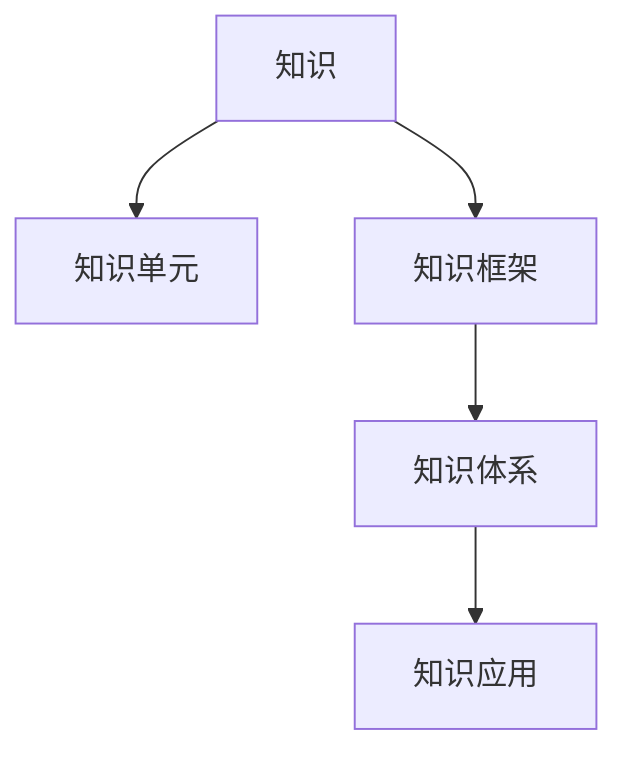

                 

# 知识体系的构建：从基本元素到复杂结构

## 1. 背景介绍

### 1.1 问题由来

在信息爆炸的今天，掌握和应用知识变得比以往任何时候都更加重要。然而，知识的结构化和体系化构建，不仅需要深厚的学科基础，还需要对知识内在联系的深刻理解。本文将从基础知识体系构建的角度出发，深入探讨如何构建高效、灵活的知识体系，从而促进知识和能力的迁移与应用。

### 1.2 问题核心关键点

知识体系的构建，核心在于理解知识的本质，以及如何将分散的知识点整合成一个连贯、合理的结构。这涉及到知识分类、结构设计、应用场景、评估标准等多个方面。本文将围绕这些核心关键点，系统性地介绍知识体系构建的方法和实践。

### 1.3 问题研究意义

构建高效的知识体系，能够帮助学习者更快、更好地掌握新知识，并能够将已有知识应用于新的问题场景。这对提升学习效率、增强知识迁移能力具有重要意义。

在信息化快速发展的当下，能够高效构建知识体系，快速理解和应用新知识，是每个人面对复杂问题的基本能力。本文的研究不仅对于学术研究有指导意义，对社会各行各业的知识管理和应用同样具有广泛的参考价值。

## 2. 核心概念与联系

### 2.1 核心概念概述

构建知识体系，首先需要理解核心概念及其内在联系。以下是构建知识体系过程中涉及的几个关键概念：

- **知识(Knowledge)**：通过学习、实践积累的对事物的认知和理解。
- **知识单元(Knowledge Unit)**：可以独立存在的最小知识单位，如概念、定义、定理等。
- **知识框架(Knowledge Framework)**：将知识单元按照某种逻辑关系组织起来的结构，如课程体系、学科知识体系等。
- **知识体系(Knowledge System)**：由多个知识框架构成，包含不同层次和类型的知识，形成连贯的知识结构。
- **知识应用(Knowledge Application)**：将知识应用于实际问题，形成解决问题的过程和方法。

### 2.2 核心概念原理和架构的 Mermaid 流程图



这个流程图展示了知识体系构建的基本架构：

1. **知识(Knowledge)**：来源于日常学习、实践和观察。
2. **知识单元(Knowledge Unit)**：构建知识体系的基本模块，如“牛顿三大定律”、“光电效应”等。
3. **知识框架(Knowledge Framework)**：将知识单元按照某种逻辑关系组织起来，形成层次分明、逻辑连贯的框架。
4. **知识体系(Knowledge System)**：由多个知识框架构成，形成复杂、多层次的知识结构。
5. **知识应用(Knowledge Application)**：将知识体系应用于实际问题，形成有效的解决方案。

## 3. 核心算法原理 & 具体操作步骤

### 3.1 算法原理概述

知识体系的构建，本质上是一个知识整合和组织的过程。其核心算法原理包括以下几个步骤：

1. **知识分类**：将知识单元按照某种分类标准进行划分，如按照学科、领域、主题等。
2. **知识关联**：建立知识单元之间的关联关系，如父子关系、并列关系等。
3. **知识组织**：将知识单元按照逻辑关系组织起来，形成层次分明、逻辑连贯的知识框架。
4. **知识应用**：将知识框架应用于实际问题，形成有效的知识应用方法。

### 3.2 算法步骤详解

知识体系的构建算法步骤可以细化为以下六个阶段：

#### 3.2.1 知识收集与整理

1. **确定知识收集范围**：明确需要构建的知识体系覆盖哪些领域和主题。
2. **收集相关资料**：通过阅读书籍、查找文献、观看视频等方式，收集相关知识。
3. **整理知识单元**：对收集到的知识进行梳理，去除重复和冗余内容，形成独立的知识单元。

#### 3.2.2 知识分类与标记

1. **知识分类标准**：确定知识分类的标准，如按照学科、领域、主题等。
2. **知识分类实施**：将知识单元按照分类标准进行归类，形成层次结构。
3. **知识标记**：为每个知识单元添加标记信息，如类型、来源、引用等。

#### 3.2.3 知识关联与组织

1. **建立关联关系**：通过引用、继承、扩展等方式，建立知识单元之间的关联关系。
2. **组织知识框架**：将知识单元按照逻辑关系组织起来，形成连贯的知识框架。
3. **迭代优化**：根据知识框架的适用性和完整性，不断调整和优化知识关联和组织方式。

#### 3.2.4 知识应用与实践

1. **选择应用场景**：根据知识体系的应用目标，选择具体的应用场景。
2. **知识应用实施**：将知识框架应用于实际问题，形成解决方案或方法。
3. **反馈与迭代**：根据应用效果，收集反馈信息，对知识体系进行迭代优化。

#### 3.2.5 知识评估与更新

1. **评估知识体系**：通过测试和验证，评估知识体系的准确性和实用性。
2. **识别知识漏洞**：识别知识体系中存在的漏洞和不足。
3. **更新知识体系**：根据评估结果和反馈信息，对知识体系进行更新和完善。

#### 3.2.6 知识传播与共享

1. **创建知识库**：将知识体系存储在可检索的知识库中，方便检索和分享。
2. **知识传播**：通过多种方式传播知识体系，如在线课程、学术论文、开源项目等。
3. **知识交流**：与同行进行交流和讨论，共同提升知识体系的质量和深度。

### 3.3 算法优缺点

知识体系的构建算法具有以下优点：

1. **系统化整理知识**：通过分类和组织，将分散的知识单元系统化、结构化，有助于快速获取和应用知识。
2. **促进知识迁移**：通过建立关联关系，促进知识的迁移和应用，能够解决更复杂的问题。
3. **便于知识维护**：知识体系可以动态更新和维护，保持其时效性和实用性。

但该算法也存在一定的局限性：

1. **依赖知识单元的完整性**：知识体系的构建需要大量的知识单元作为基础，难以覆盖所有领域。
2. **知识关联的复杂性**：建立知识关联关系需要深入理解知识的内在联系，具有较高的难度。
3. **应用场景的局限性**：知识体系适用于某些领域和问题，对于特定问题，可能需要建立专用的知识体系。
4. **知识更新的成本高**：知识体系需要不断地进行更新和维护，成本较高。

### 3.4 算法应用领域

知识体系的构建方法，广泛应用于多个领域，包括但不限于：

- **教育领域**：帮助学生构建知识框架，促进学习效果。
- **科学研究**：组织和整理研究成果，形成系统的研究体系。
- **项目管理**：构建项目管理知识库，提升项目管理能力。
- **软件开发**：构建软件开发知识体系，促进技术积累和知识共享。
- **商业管理**：构建商业管理知识体系，提升决策和执行能力。

## 4. 数学模型和公式 & 详细讲解 & 举例说明

### 4.1 数学模型构建

知识体系的构建，可以通过数学模型来形式化描述。以下是一个简单的知识体系数学模型：

假设有一个知识框架$F$，包含多个知识单元$U$，每个知识单元$u$都有一个属性向量$A(u)$，表示该知识单元的关键信息，如定义、应用、实例等。知识单元之间的关联关系用图表示，其中每个知识单元$u$都有一个邻居集合$N(u)$，表示与$u$直接相关的其他知识单元。

知识框架的组织方式可以用图$G=(U,E)$表示，其中$U$是知识单元集合，$E$是知识单元之间的边集合。

### 4.2 公式推导过程

知识体系的数学模型可以用如下公式表示：

$$
\begin{aligned}
&\text{知识单元} \ u \in U \\
&\text{属性向量} \ A(u) \in \mathbb{R}^n \\
&\text{邻居集合} \ N(u) \subseteq U \\
&\text{知识框架} \ F = (U,E)
\end{aligned}
$$

其中，$A(u)$是知识单元$u$的属性向量，$N(u)$是知识单元$u$的邻居集合，$F$是知识框架。

知识框架的组织方式可以用如下公式表示：

$$
\begin{aligned}
&\text{知识单元} \ u \in U \\
&\text{邻居集合} \ N(u) \subseteq U \\
&\text{边} \ (u,v) \in E \Leftrightarrow u \in N(v) \wedge v \in N(u)
\end{aligned}
$$

其中，$(u,v)$是知识单元$u$和$v$之间的边，表示$u$是$v$的邻居，$v$是$u$的邻居。

### 4.3 案例分析与讲解

以机器学习为例，可以构建如下的知识体系：

1. **知识收集与整理**：收集机器学习的相关知识，如算法、理论、应用等。
2. **知识分类与标记**：将知识按照算法类型、应用领域、理论基础等分类。
3. **知识关联与组织**：建立知识单元之间的关联关系，如算法之间的优缺点、理论的应用场景等。
4. **知识应用与实践**：将知识应用于实际问题，如模型选择、数据预处理、特征工程等。
5. **知识评估与更新**：通过项目实践，评估知识体系的实用性，并根据反馈进行更新和完善。
6. **知识传播与共享**：将知识体系存储在可检索的知识库中，便于其他开发者使用。

## 5. 项目实践：代码实例和详细解释说明

### 5.1 开发环境搭建

构建知识体系，需要借助一些工具和平台。以下是几个常用的开发环境：

1. **Jupyter Notebook**：用于编写代码和分析数据，支持多种编程语言。
2. **Python**：作为主要的编程语言，提供了丰富的库和框架，如NumPy、Pandas、Matplotlib等。
3. **Git**：用于版本控制，方便知识体系的迭代更新和协作开发。
4. **Markdown**：用于编写和格式化文档，方便知识体系的传播和共享。

### 5.2 源代码详细实现

以下是一个简单的Python代码示例，用于构建和查询知识体系：

```python
import pandas as pd

# 定义知识单元
knowledge_units = pd.DataFrame({
    'id': ['A1', 'A2', 'A3', 'A4'],
    'name': ['算法1', '算法2', '算法3', '算法4'],
    'description': ['算法1的描述', '算法2的描述', '算法3的描述', '算法4的描述'],
    'category': ['算法', '算法', '理论', '应用']
})

# 定义知识单元之间的关联关系
relationships = pd.DataFrame({
    'id': ['R1', 'R2', 'R3'],
    'source': ['A1', 'A2', 'A3'],
    'target': ['A2', 'A3', 'A4'],
    'type': ['优缺点', '理论基础', '应用场景']
})

# 构建知识框架
knowledge_graph = pd.merge(knowledge_units, relationships, on='source', how='left')
knowledge_graph = knowledge_graph.rename(columns={'target': 'neighbor'})
knowledge_graph = knowledge_graph[~knowledge_graph.neighbor.isnull()]

# 查询知识体系
query = '查询算法2的理论基础是什么？'
query_result = knowledge_graph[knowledge_graph.name == '算法2']

# 输出查询结果
print(query_result['neighbor'].tolist())
```

### 5.3 代码解读与分析

这个代码示例展示了如何构建和查询一个简单的知识体系。具体步骤如下：

1. **定义知识单元**：将算法、理论、应用等知识单元存储在DataFrame中，包括id、name、description、category等属性。
2. **定义知识单元之间的关联关系**：将知识单元之间的关联关系存储在DataFrame中，包括id、source、target、type等属性。
3. **构建知识框架**：将知识单元和关联关系合并，构建知识框架，存储在DataFrame中。
4. **查询知识体系**：根据查询条件，从知识框架中查询相关知识单元的邻居，输出结果。

## 6. 实际应用场景

### 6.1 教育领域

在教育领域，构建知识体系能够帮助学生系统地学习知识，提升学习效果。通过构建科学的知识框架，学生可以更好地理解知识的内在联系，促进知识的迁移和应用。

例如，在计算机科学课程中，教师可以构建如下知识体系：

1. **数据结构与算法**：涵盖基础数据结构、排序算法、图算法等。
2. **计算机网络**：涵盖网络协议、路由算法、分布式系统等。
3. **操作系统**：涵盖进程管理、内存管理、文件系统等。

学生在学习过程中，可以通过查询知识体系，快速找到相关知识点的解释、应用案例和习题等，提升学习效率。

### 6.2 科学研究

在科学研究中，构建知识体系能够帮助研究人员系统地整理研究成果，形成科学的知识体系。通过构建科学的知识框架，研究人员可以更好地理解领域内的前沿进展，促进知识的共享和传播。

例如，在人工智能领域，研究人员可以构建如下知识体系：

1. **机器学习**：涵盖监督学习、无监督学习、强化学习等。
2. **深度学习**：涵盖卷积神经网络、循环神经网络、生成对抗网络等。
3. **自然语言处理**：涵盖文本分类、情感分析、机器翻译等。

研究人员可以通过查询知识体系，快速找到相关算法、理论、应用案例等，提升科研效率。

### 6.3 软件开发

在软件开发中，构建知识体系能够帮助开发人员系统地掌握技术栈，提升开发能力。通过构建技术栈的知识框架，开发人员可以更好地理解不同技术的优缺点、适用场景等，促进技术的迁移和应用。

例如，在Web开发中，开发人员可以构建如下知识体系：

1. **前端技术**：涵盖HTML、CSS、JavaScript等。
2. **后端技术**：涵盖Python、Java、Ruby等。
3. **数据库技术**：涵盖SQL、NoSQL、数据库优化等。

开发人员可以通过查询知识体系，快速找到相关技术的优缺点、应用场景、实例代码等，提升开发效率。

### 6.4 商业管理

在商业管理中，构建知识体系能够帮助管理者系统地掌握管理知识，提升决策能力。通过构建管理知识体系，管理者可以更好地理解不同管理理论、方法和案例，促进知识的迁移和应用。

例如，在企业管理中，管理者可以构建如下知识体系：

1. **战略管理**：涵盖企业战略规划、市场分析、竞争策略等。
2. **人力资源管理**：涵盖招聘、培训、绩效考核等。
3. **财务管理**：涵盖财务分析、预算管理、风险控制等。

管理者可以通过查询知识体系，快速找到相关管理理论、方法和案例，提升决策效率。

### 6.5 未来应用展望

未来，知识体系的构建将更加智能化、自动化。以下是一些未来的发展趋势：

1. **自动化构建**：利用人工智能技术，自动构建和优化知识体系，提升构建效率。
2. **跨领域整合**：将不同领域的知识体系进行整合，形成更加全面的知识体系。
3. **智能查询**：利用自然语言处理技术，实现更加智能的查询方式，提升查询效率。
4. **实时更新**：利用大数据和云计算技术，实现知识体系的实时更新和维护，保持其时效性。

这些发展趋势将进一步提升知识体系的构建和应用效果，为各行各业的知识管理和应用提供更高效、更智能的解决方案。

## 7. 工具和资源推荐

### 7.1 学习资源推荐

为了帮助读者系统掌握知识体系构建的方法和实践，以下是一些优质的学习资源：

1. **Coursera《数据科学与人工智能导论》课程**：由斯坦福大学教授讲授，系统介绍数据科学和人工智能的基本概念和方法。
2. **Kaggle数据科学竞赛平台**：提供丰富的数据集和竞赛项目，实践数据科学和人工智能技术。
3. **edX《知识管理的艺术》课程**：由麻省理工学院教授讲授，系统介绍知识管理的原理和方法。
4. **Google Scholar学术搜索**：提供广泛的学术论文资源，帮助读者了解最新的研究成果。
5. **GitHub开源项目**：提供丰富的开源项目资源，学习代码实现和实践应用。

### 7.2 开发工具推荐

构建知识体系，需要借助一些优秀的工具和平台。以下是一些常用的开发工具：

1. **Jupyter Notebook**：用于编写代码和分析数据，支持多种编程语言。
2. **Python**：作为主要的编程语言，提供了丰富的库和框架，如NumPy、Pandas、Matplotlib等。
3. **Git**：用于版本控制，方便知识体系的迭代更新和协作开发。
4. **Markdown**：用于编写和格式化文档，方便知识体系的传播和共享。

### 7.3 相关论文推荐

知识体系的构建和应用，涉及多个学科领域，以下是一些相关领域的经典论文，推荐阅读：

1. **Knowledge Mining and Statistical Learning (KMSL)**：Judea Pearl等，2021年，探讨了知识挖掘和统计学习的结合，提出了一些新的方法和技术。
2. **Knowledge-Based Systems (KBS)**：Jorge Bayardo等，2021年，介绍了知识表示、知识推理和知识应用的相关研究。
3. **Artificial Intelligence (AI)**：John McCarthy等，1956年，探讨了人工智能的基本概念和研究方法。
4. **Machine Learning (ML)**：Tom Mitchell，1997年，介绍了机器学习的基本概念、方法和应用。
5. **Knowledge-Based Programming (KBP)**：Michael Harrison，1973年，介绍了知识驱动编程的基本原理和实现方法。

这些论文代表了知识体系构建和应用的研究方向，值得读者深入学习。

## 8. 总结：未来发展趋势与挑战

### 8.1 研究成果总结

本文从基础知识体系构建的角度出发，系统介绍了知识体系构建的算法原理和操作步骤。通过深入分析知识体系构建的核心概念和内在联系，展示了知识体系构建的框架和方法。

### 8.2 未来发展趋势

未来，知识体系的构建将更加智能化、自动化，更加跨领域整合。利用人工智能和云计算技术，知识体系将更加高效、智能、全面，为各行各业的知识管理和应用提供更加优质的解决方案。

### 8.3 面临的挑战

尽管知识体系的构建方法已经取得了一些进展，但在实际应用中仍然面临一些挑战：

1. **数据收集和整理的难度**：构建知识体系需要大量的数据和信息，数据的收集和整理工作量大，难度高。
2. **知识关联的复杂性**：建立知识单元之间的关联关系需要深入理解知识的内在联系，具有较高的难度。
3. **知识体系的更新和维护**：知识体系需要不断地进行更新和维护，成本较高。
4. **知识体系的应用效果**：构建的知识体系是否能够真正应用于实际问题，仍需要进一步验证和优化。

### 8.4 研究展望

未来的研究应聚焦于以下几个方面：

1. **自动化构建**：利用人工智能技术，自动构建和优化知识体系，提升构建效率。
2. **跨领域整合**：将不同领域的知识体系进行整合，形成更加全面的知识体系。
3. **智能查询**：利用自然语言处理技术，实现更加智能的查询方式，提升查询效率。
4. **实时更新**：利用大数据和云计算技术，实现知识体系的实时更新和维护，保持其时效性。
5. **知识传播与共享**：构建更加智能化的知识库，方便知识体系的传播和共享。

这些研究方向的探索和发展，将进一步提升知识体系的构建和应用效果，为各行各业的知识管理和应用提供更高效、更智能的解决方案。

## 9. 附录：常见问题与解答

**Q1: 如何构建高效的知识体系？**

A: 构建高效的知识体系，需要系统性地进行知识收集、分类、关联和组织。可以参考以下步骤：

1. **确定知识收集范围**：明确需要构建的知识体系覆盖哪些领域和主题。
2. **收集相关资料**：通过阅读书籍、查找文献、观看视频等方式，收集相关知识。
3. **整理知识单元**：对收集到的知识进行梳理，去除重复和冗余内容，形成独立的知识单元。
4. **知识分类与标记**：将知识按照某种分类标准进行归类，并添加标记信息。
5. **知识关联与组织**：建立知识单元之间的关联关系，并按照逻辑关系组织起来，形成知识框架。
6. **知识应用与实践**：将知识应用于实际问题，形成解决方案或方法。
7. **知识评估与更新**：通过测试和验证，评估知识体系的准确性和实用性，并根据反馈进行更新和完善。

**Q2: 知识体系的构建需要哪些关键要素？**

A: 知识体系的构建需要以下关键要素：

1. **知识单元**：可以独立存在的最小知识单位，如概念、定义、定理等。
2. **知识框架**：将知识单元按照某种逻辑关系组织起来的结构，如课程体系、学科知识体系等。
3. **知识体系**：由多个知识框架构成，包含不同层次和类型的知识，形成连贯的知识结构。
4. **知识应用**：将知识体系应用于实际问题，形成有效的解决方案。
5. **知识评估与更新**：通过测试和验证，评估知识体系的准确性和实用性，并根据反馈进行更新和完善。

**Q3: 知识体系的构建有哪些优势？**

A: 知识体系的构建具有以下优势：

1. **系统化整理知识**：通过分类和组织，将分散的知识单元系统化、结构化，有助于快速获取和应用知识。
2. **促进知识迁移**：通过建立关联关系，促进知识的迁移和应用，能够解决更复杂的问题。
3. **便于知识维护**：知识体系可以动态更新和维护，保持其时效性和实用性。

**Q4: 知识体系的构建有哪些挑战？**

A: 知识体系的构建面临以下挑战：

1. **数据收集和整理的难度**：构建知识体系需要大量的数据和信息，数据的收集和整理工作量大，难度高。
2. **知识关联的复杂性**：建立知识单元之间的关联关系需要深入理解知识的内在联系，具有较高的难度。
3. **知识体系的更新和维护**：知识体系需要不断地进行更新和维护，成本较高。
4. **知识体系的应用效果**：构建的知识体系是否能够真正应用于实际问题，仍需要进一步验证和优化。

**Q5: 未来知识体系的发展趋势有哪些？**

A: 未来知识体系的发展趋势包括：

1. **自动化构建**：利用人工智能技术，自动构建和优化知识体系，提升构建效率。
2. **跨领域整合**：将不同领域的知识体系进行整合，形成更加全面的知识体系。
3. **智能查询**：利用自然语言处理技术，实现更加智能的查询方式，提升查询效率。
4. **实时更新**：利用大数据和云计算技术，实现知识体系的实时更新和维护，保持其时效性。

作者：禅与计算机程序设计艺术 / Zen and the Art of Computer Programming

