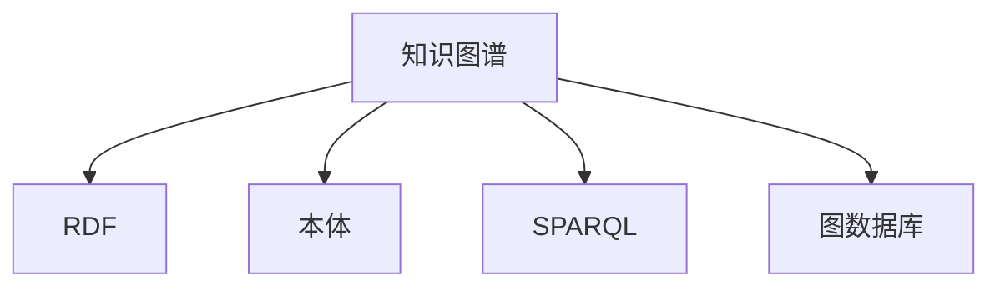

                 

# 知识图谱 原理与代码实例讲解

## 1. 背景介绍

知识图谱(Knowledge Graph)是一种结构化的语义知识表示方式，旨在以实体和关系为中心，描述现实世界中的各种概念和实体之间的关系。随着人工智能技术的不断发展，知识图谱作为AI基础设施的重要组成部分，正逐渐在智能搜索、问答系统、推荐系统、智能客服、医疗诊断等多个领域发挥重要作用。本文将从知识图谱的基本概念入手，深入探讨其原理与核心算法，并通过代码实例详细讲解其实现细节，力图为读者提供一个全面的知识图谱理解与应用框架。

## 2. 核心概念与联系

### 2.1 核心概念概述

为更好地理解知识图谱的工作原理和应用范式，本节将介绍几个关键概念：

- **知识图谱(Knowledge Graph)**：以实体和关系为中心，表示实体间语义关系的图结构数据。知识图谱由节点(实体)和边(关系)构成，节点属性和边属性进一步丰富了图谱的语义信息。
- **RDF(资源描述框架)**：用于描述语义数据的标准，支持属性、类型、关系等概念的灵活定义和表示。RDF由资源(RI)、属性(P)、值(O)构成，表示为形式化的三元组(RI, P, O)。
- **本体(Ontology)**：描述概念、属性和关系的定义和约束，定义知识图谱的语义模型，便于推理、查询和交互。
- **SPARQL(SPARQL协议和查询语言)**：用于查询和更新RDF数据的标准语言，支持复杂的语义查询和计算。
- **图数据库(Graph Database)**：用于存储和管理知识图谱的数据库系统，支持高效的关系查询和图遍历。

这些核心概念之间的逻辑关系可以通过以下Mermaid流程图来展示：



这个流程图展示了知识图谱与其他核心概念之间的关系：

1. 知识图谱基于RDF进行描述，本体定义了图谱的语义模型。
2. SPARQL提供查询语言，用于访问和操作图谱数据。
3. 图数据库用于存储和管理图谱数据，支持高效的关系查询。

这些概念共同构成了知识图谱的技术框架，使其能够灵活地表示和查询现实世界中的语义知识。

## 3. 核心算法原理 & 具体操作步骤

### 3.1 算法原理概述

知识图谱的构建和查询主要基于图算法和语义推理。其核心思想是：

- **构建过程**：使用本体定义知识图谱的语义模型，将现实世界中的实体和关系映射到图谱中，通过RDF形式化的三元组表示。构建过程中可以使用知识抽取、语义标注等技术自动生成图谱，也可以由人工编辑和维护。
- **查询过程**：使用SPARQL语言描述查询意图，将自然语言查询转化为逻辑查询图，遍历图数据库，获取匹配的实体和关系。查询过程中可以结合语义推理技术，利用图谱的语义关系，推理出未知的实体和关系。

### 3.2 算法步骤详解

知识图谱的构建和查询主要包括以下几个关键步骤：

**Step 1: 定义本体和语义模型**
- 选择合适的本体语言(如OWL、RDFS等)，定义实体和关系的属性、类型、约束等。
- 利用本体建模工具(如Protegé、Neo4j等)可视化编辑本体模型，保存为RDF/XML格式。

**Step 2: 知识抽取**
- 收集不同数据源(如数据库、文本、网页等)中的数据，清洗和标注数据。
- 使用抽取技术(如规则抽取、基于深度学习的抽取等)从数据中抽取出实体和关系，并将结果保存为RDF格式。

**Step 3: 构建知识图谱**
- 将抽取的实体和关系按照本体定义，映射到图谱中。如果存在歧义或矛盾，需要人工验证和修正。
- 使用图数据库(如Neo4j、ArangoDB等)存储和管理知识图谱数据，构建图谱索引和查询引擎。

**Step 4: 语义查询与推理**
- 使用SPARQL语言构建查询语句，查询知识图谱中的实体和关系。
- 利用图数据库的查询引擎执行查询，返回查询结果。
- 结合语义推理技术，利用图谱中的关系和属性，推导出新的实体和关系。

**Step 5: 测试与优化**
- 使用测试数据和用户反馈，评估知识图谱的查询效果和推理能力。
- 根据评估结果，优化图谱结构和查询策略，提高查询性能和准确性。

### 3.3 算法优缺点

知识图谱构建和查询算法具有以下优点：
- 语义丰富：通过RDF和本体的定义，能够描述丰富的实体关系，支持复杂的多属性查询。
- 支持推理：结合语义推理技术，可以推导出新的实体和关系，增强知识图谱的预测能力和适应性。
- 可扩展性强：可以动态添加和更新实体和关系，适应数据的变化和领域的拓展。
- 支持多种查询方式：SPARQL语言支持丰富的查询方式，可以灵活定制查询条件和返回结果。

同时，该方法也存在一定的局限性：
- 构建复杂：本体定义和知识抽取需要专家参与，技术门槛较高。
- 数据稀疏：在缺乏足够数据的情况下，知识图谱的构建和查询效果有限。
- 推理困难：语义推理技术复杂，推理结果依赖于图谱的完整性和正确性。
- 存储空间大：知识图谱通常规模较大，存储和查询需要消耗大量资源。

尽管存在这些局限性，但就目前而言，知识图谱的构建和查询方法仍然是大数据、AI等领域的重要技术手段。未来相关研究的重点在于如何进一步降低构建和查询的技术门槛，提高图谱的实时性和可扩展性，同时增强推理能力和知识表示的全面性。

### 3.4 算法应用领域

知识图谱在多个领域都有广泛的应用，例如：

- 智能搜索：通过知识图谱实现精准搜索结果排序，提升搜索相关性和用户体验。
- 问答系统：基于知识图谱，通过语义查询和推理，回答用户自然语言问题。
- 推荐系统：结合用户行为和商品信息，构建知识图谱推荐模型，实现个性化推荐。
- 医疗诊断：构建医疗知识图谱，利用语义推理技术，辅助医生进行诊断和治疗。
- 金融分析：构建金融知识图谱，通过语义查询和推理，预测市场趋势和风险。
- 社交网络：分析社交网络中的实体关系，挖掘潜在的关系网络。

除了上述这些经典应用外，知识图谱还被创新性地应用到更多场景中，如可控推荐、智能客服、企业知识管理等，为各行各业带来了新的发展机遇。随着知识图谱技术的不断发展，相信其在更多领域的应用前景将更加广阔。

## 4. 数学模型和公式 & 详细讲解

### 4.1 数学模型构建

知识图谱的数学模型通常基于图论和语义网络。以RDF和OWL本体为例，知识图谱的数学模型可以表示为：

1. **实体-属性-值三元组表示法**：
$$
(\text{实体}_e, \text{属性}_p, \text{值}_o)
$$
其中实体 $e$、属性 $p$ 和值 $o$ 分别表示图谱中的节点、边和节点的属性值。

2. **本体定义**：
- 属性定义：
$$
\text{属性}_p \in \{\text{属性}_p, \text{属性}_2, ..., \text{属性}_n\}
$$
其中 $\text{属性}_p$ 表示图谱中所有的属性，属性值可以是字符串、数字、日期等多种类型。
- 关系定义：
$$
\text{关系}_r \in \{\text{关系}_r, \text{关系}_2, ..., \text{关系}_m\}
$$
其中 $\text{关系}_r$ 表示图谱中所有的关系，关系可以是一对一、一对多或多对多等多种形式。
- 实体定义：
$$
\text{实体}_e \in \{\text{实体}_e, \text{实体}_2, ..., \text{实体}_k\}
$$
其中 $\text{实体}_e$ 表示图谱中所有的实体，实体具有属性和关系。

### 4.2 公式推导过程

以查询知识图谱中的所有男性实体为例，使用SPARQL语言进行查询：

1. **查询表达式**：
$$
SELECT ?person WHERE {
  ?person rdf:type foaf:Person .
  ?person foaf:gender "male"^^xsd:string .
}
$$
其中 $\?person$ 表示所有符合条件的实体，`rdf:type` 表示实体类型，`foaf:gender` 表示属性名，`"male"` 表示属性值，`^^xsd:string` 表示属性值的类型。

2. **查询图谱**：
   - 首先，图谱数据库根据查询表达式生成查询图，如下图所示：
     ```mermaid
     graph LR
       A[?person] --> B[foaf:gender]
         B --> C["male"] (类型xsd:string)
     ```
   - 然后，遍历图谱数据库，匹配查询图，返回所有符合条件的实体。

3. **查询结果**：
   - 查询结果表示为RDF三元组的形式，例如：
     ```rdf
     <http://example.org/person-1> foaf:gender "male"^^xsd:string .
     ```
   - 结果中的 `<http://example.org/person-1>` 表示实体URI，`foaf:gender` 表示属性名，`"male"` 表示属性值。

### 4.3 案例分析与讲解

以下是一个简单的知识图谱案例，包含三个实体和两个关系：

1. **实体定义**：
   - 人（Person）：具有姓名（name）和年龄（age）属性。
   - 动物（Animal）：具有名称（name）和种类（species）属性。
   - 食物（Food）：具有名称（name）和热量（calories）属性。

2. **关系定义**：
   - 饲喂（feed）：动物和食物之间的双向关系，表示动物吃某种食物。
   - 认识（know）：人与人之间的双向关系，表示两个人互相认识。

3. **数据示例**：
   - 人：
     - 约翰（John）：年龄30岁，认识玛丽（Mary）
     - 玛丽（Mary）：年龄25岁，认识约翰（John），饲喂猫咪（Cat）
     - 约翰（John）：认识汤姆（Tom）
   - 动物：
     - 猫咪（Cat）：种类为猫，饲喂鸡肉（Chicken）

   - 食物：
     - 鸡肉（Chicken）：热量为200卡

   - RDF表示法：
     ```rdf
     <http://example.org/John> foaf:name "John"^^xsd:string .
     <http://example.org/John> foaf:age "30"^^xsd:int .
     <http://example.org/John> know <http://example.org/Mary> .
     <http://example.org/Mary> foaf:name "Mary"^^xsd:string .
     <http://example.org/Mary> foaf:age "25"^^xsd:int .
     <http://example.org/Mary> know <http://example.org/John> .
     <http://example.org/Mary> feed <http://example.org/Cat> .
     <http://example.org/Cat> foaf:name "Cat"^^xsd:string .
     <http://example.org/Cat> foaf:species "猫"^^xsd:string .
     <http://example.org/Cat> feed <http://example.org/Chicken> .
     <http://example.org/Chicken> foaf:name "Chicken"^^xsd:string .
     <http://example.org/Chicken> foaf:calories "200"^^xsd:double .
     ```

4. **查询分析**：
   - 查询所有饲喂猫咪的动物：
     - 查询表达式：
     ```rdf
     SELECT ?animal WHERE {
       ?animal feed <http://example.org/Cat> .
     }
     ```
     - 查询图谱：
       ```mermaid
       graph LR
         ?animal --> C[<http://example.org/Cat>] (饲喂 cat)
       ```
     - 查询结果：
       ```rdf
       <http://example.org/Mary> feed <http://example.org/Cat> .
       ```

通过这个简单的案例，可以看到知识图谱的构建和查询过程。知识图谱不仅能够表示实体的属性和关系，还能够进行语义推理，解决复杂的多属性查询问题。

## 5. 项目实践：代码实例和详细解释说明

### 5.1 开发环境搭建

在进行知识图谱的构建和查询实践前，我们需要准备好开发环境。以下是使用Python进行SPARQL查询的开发环境配置流程：

1. 安装Python：从官网下载并安装Python，推荐使用3.x版本。
2. 安装RDF库：使用pip安装rdflib库，支持RDF解析和构建。
3. 安装Graph Database：选择适合的图数据库系统，如Neo4j、ArangoDB等，并下载和安装。
4. 安装SPARQL查询工具：选择适合的查询工具，如SparqlWizard、Sesame等，并下载和安装。

完成上述步骤后，即可在开发环境中进行知识图谱的构建和查询实践。

### 5.2 源代码详细实现

下面我们以查询所有饲喂猫咪的动物为例，给出使用Python进行SPARQL查询的代码实现。

首先，定义查询语句：

```python
from rdflib import Graph, Namespace, SPARQL

# 定义命名空间
ns = Namespace('http://example.org/')

# 查询语句
query = SPARQLQuery("""
SELECT ?animal WHERE {
    ?animal feed <ns:Cat> .
}
""")

# 创建图数据库连接
g = Graph()
g.load('example.nt')

# 执行查询
result = g.query(query)
```

然后，遍历查询结果：

```python
for row in result:
    print(row)
```

### 5.3 代码解读与分析

让我们再详细解读一下关键代码的实现细节：

**rdflib库**：
- `Graph`类：用于存储和管理RDF图数据。
- `Namespace`类：用于定义命名空间，避免命名冲突。
- `SPARQLQuery`类：用于构建和执行SPARQL查询。

**查询语句**：
- 使用SPARQL语言定义查询意图，`SELECT`语句选择返回的实体。
- 使用`WHERE`语句定义查询条件，`feed`表示饲喂关系，`<ns:Cat>`表示实体URI。

**图数据库连接**：
- 使用`Graph`类创建一个新的RDF图，用于存储和查询数据。
- 使用`load`方法加载图谱数据，一般从NT格式文件或RDF格式文件中读取。

**查询执行**：
- 使用`query`方法执行查询，返回查询结果。
- 遍历查询结果，输出每个实体URI。

通过以上代码实现，可以直观地看到知识图谱的查询过程。在实际应用中，还可以结合图谱构建、数据导入、查询优化等技术，进一步完善知识图谱系统。

## 6. 实际应用场景

### 6.1 智能搜索

智能搜索系统通常需要构建大规模的知识图谱，以实现对海量的网页信息进行深度语义理解。在搜索结果排序中，知识图谱通过实体和关系推理，可以提升搜索结果的相关性和准确性。例如，Google Scholar和Baidu Scholar等学术搜索系统，利用知识图谱进行论文推荐和引用关系分析，帮助用户发现高质量的论文。

### 6.2 问答系统

问答系统基于知识图谱，能够理解用户自然语言问题，并给出准确的回答。例如，IBM的Watson问答系统，通过构建医疗、金融、旅游等多个领域的知识图谱，回答用户涉及特定领域的问答。通过语义查询和推理，系统能够解决复杂的多属性问题，提供精准的答案。

### 6.3 推荐系统

推荐系统利用用户行为和商品信息构建知识图谱，利用语义查询和推理，实现个性化推荐。例如，Amazon利用商品信息和用户行为构建知识图谱，通过语义查询和推理，提供个性化的商品推荐。

### 6.4 医疗诊断

医疗诊断系统利用医学知识图谱，结合临床数据和病历信息，辅助医生进行疾病诊断和治疗方案推荐。例如，Hopkins的CWMed系统，利用医学知识图谱进行疾病诊断和药品推荐，帮助医生制定科学的治疗方案。

### 6.5 金融分析

金融分析系统利用金融知识图谱，通过语义查询和推理，预测市场趋势和风险。例如，Virtuoso公司开发的金融知识图谱，通过语义查询和推理，帮助分析师进行市场分析和投资决策。

## 7. 工具和资源推荐

### 7.1 学习资源推荐

为了帮助开发者系统掌握知识图谱的理论基础和实践技巧，这里推荐一些优质的学习资源：

1. 《Knowledge Graphs: A Beginner's Guide to Building and Querying Your Own Graph》书籍：从基础知识到实际应用，全面介绍知识图谱的构建和查询方法。
2. Stanford CS224N《Natural Language Processing with Deep Learning》课程：讲解知识图谱在自然语言处理中的应用。
3. 《Linking Open Data》论文：回顾知识图谱的发展历程，介绍Open Data联盟的知识图谱构建实践。
4. 《Graph Analytics and Data Science with Neo4j》书籍：讲解如何使用Neo4j进行知识图谱的构建和查询。
5. 《Ontologies and Knowledge Graphs in Practice》书籍：介绍本体和知识图谱的构建和应用实践。

通过对这些资源的学习实践，相信你一定能够快速掌握知识图谱的精髓，并用于解决实际的NLP问题。

### 7.2 开发工具推荐

高效的开发离不开优秀的工具支持。以下是几款用于知识图谱开发的常用工具：

1. Neo4j：功能强大的图数据库系统，支持大规模知识图谱的存储和管理。
2. RDF4J：Java语言的RDF API，用于构建和查询RDF数据。
3. SparqlWizard：Web界面化的SPARQL查询工具，方便进行交互式查询。
4. SPARQL Query Builder：Web界面化的SPARQL查询构建工具，支持代码生成和执行。
5. OWL ontology modeling tool：如Protegé，用于可视化编辑本体模型。

合理利用这些工具，可以显著提升知识图谱的开发效率，加快创新迭代的步伐。

### 7.3 相关论文推荐

知识图谱领域的研究发展迅速，以下是几篇奠基性的相关论文，推荐阅读：

1. Biregular Graphs: A 2.5-Dimensional View of Knowledge Graphs: A Survey and Challenges，H.Lin等，总结了知识图谱的研究现状和未来挑战。
2. Practical Reasoning over Knowledge Graphs，L.Simonett等，介绍了知识图谱的推理框架和应用实例。
3. Transductive Learning via Spectral Optimization on Graphs，A.M.Chiang等，探讨了知识图谱的谱学习方法和应用。
4. Consistent Query Answering in RDF，J.Grau等，介绍了知识图谱一致性查询的方法和技术。
5. Scalable Graph Answering Queries，A.Tarlow等，探讨了知识图谱查询优化和索引构建的方法。

这些论文代表了大规模知识图谱的研究脉络。通过学习这些前沿成果，可以帮助研究者把握学科前进方向，激发更多的创新灵感。

## 8. 总结：未来发展趋势与挑战

### 8.1 总结

本文对知识图谱的基本概念、核心算法和应用场景进行了全面系统的介绍。首先从本体定义和语义模型入手，介绍了知识图谱的基本框架和构建方法。其次，通过SPARQL查询和语义推理，详细讲解了知识图谱的查询过程。最后，探讨了知识图谱在智能搜索、问答系统、推荐系统、医疗诊断、金融分析等多个领域的应用前景。

通过本文的系统梳理，可以看到，知识图谱作为一种强大的语义表示方式，在AI技术中占据了重要地位。借助知识图谱，可以实现深度语义理解和推理，解决复杂的多属性查询问题，极大地提升了系统的智能水平和应用范围。

### 8.2 未来发展趋势

展望未来，知识图谱技术将呈现以下几个发展趋势：

1. 数据驱动：知识图谱的构建和查询将更多依赖于大数据技术，从结构化数据中自动提取实体和关系。
2. 跨领域融合：知识图谱将与其他AI技术(如深度学习、增强学习等)进行融合，实现更全面、高效的语义建模。
3. 多模态融合：知识图谱将融合视觉、音频、文本等多模态信息，形成统一的知识表示系统。
4. 实时性提升：通过流式数据处理技术，实现知识图谱的实时更新和查询，提升系统的时效性。
5. 自动化构建：利用自动化构建技术，如本体自动生成、知识抽取等，降低知识图谱构建的技术门槛。
6. 推理能力增强：结合语义推理和因果推理技术，增强知识图谱的推理能力和泛化能力。
7. 可扩展性提升：通过分布式存储和计算技术，实现知识图谱的可扩展性和高可用性。

这些趋势凸显了知识图谱技术的广阔前景。未来的研究需要在数据融合、推理能力、自动化构建等多个方向上寻求新的突破，为构建智能系统和智能应用提供更强大的技术支撑。

### 8.3 面临的挑战

尽管知识图谱技术已经取得了重要进展，但在实际应用过程中仍面临诸多挑战：

1. 数据质量瓶颈：知识图谱的构建需要高质量的数据，数据稀疏、标注不一致等问题影响构建效果。
2. 推理复杂度：知识图谱的推理过程复杂，容易受到推理错误和推理不一致的影响。
3. 系统复杂度：知识图谱的系统实现复杂，需要处理大量的语义关系和查询图谱。
4. 存储和查询开销：知识图谱的规模较大，存储和查询开销较高，需要优化存储和查询算法。
5. 可解释性不足：知识图谱的推理过程复杂，难以解释和验证，限制了系统的可解释性和可控性。
6. 安全性问题：知识图谱中可能包含敏感数据和有害信息，需要保护用户隐私和数据安全。

解决这些挑战需要研究者不断探索新的技术手段和算法框架，同时结合实际应用需求，进行综合优化和改进。

### 8.4 研究展望

面向未来，知识图谱的研究需要在以下几个方向上寻求新的突破：

1. 自动化构建技术：研究基于深度学习和自动标注的自动化构建方法，降低构建技术门槛，提升构建效率和质量。
2. 跨模态融合技术：研究跨模态数据融合和知识表示技术，实现多模态信息的统一建模。
3. 语义推理技术：研究基于因果推理和符号推理的语义推理技术，提升知识图谱的推理能力和泛化能力。
4. 可解释性增强技术：研究知识图谱的可解释性和可控性，增强系统的透明性和可信度。
5. 分布式存储与计算：研究分布式存储和计算技术，提升知识图谱的可扩展性和高可用性。
6. 智能知识图谱构建：研究基于智能推荐和自适应学习的知识图谱构建方法，提升构建过程的自动化和智能化。

这些研究方向将为知识图谱技术带来新的突破，推动其在更多领域的应用落地，构建智能人机交互系统，促进社会的数字化转型。

## 9. 附录：常见问题与解答

**Q1：知识图谱在构建过程中需要哪些步骤？**

A: 知识图谱的构建主要包括以下几个步骤：
1. 定义本体和语义模型，选择合适的本体语言，定义实体、属性、关系等。
2. 数据收集和清洗，从不同数据源收集实体和关系数据，并进行清洗和标注。
3. 知识抽取，使用抽取技术从数据中抽取出实体和关系，并将结果保存为RDF格式。
4. 图谱构建，将抽取的实体和关系按照本体定义，映射到图谱中，存储在图数据库中。
5. 图谱测试和优化，使用测试数据评估图谱的查询效果和推理能力，优化图谱结构和查询策略。

**Q2：如何使用SPARQL进行知识图谱查询？**

A: 使用SPARQL进行知识图谱查询主要包括以下几个步骤：
1. 定义查询表达式，使用SPARQL语言描述查询意图。
2. 创建图谱连接，使用rdflib库连接到图数据库，加载图谱数据。
3. 执行查询，使用图谱数据库的查询引擎执行查询，返回查询结果。
4. 遍历结果，使用Python等语言解析和输出查询结果。

**Q3：知识图谱在实际应用中有哪些场景？**

A: 知识图谱在多个领域都有广泛的应用，例如：
1. 智能搜索：构建大规模的知识图谱，实现深度语义理解。
2. 问答系统：基于知识图谱，实现自然语言问答。
3. 推荐系统：利用知识图谱进行个性化推荐。
4. 医疗诊断：利用医学知识图谱，辅助医生进行诊断和治疗。
5. 金融分析：利用金融知识图谱，预测市场趋势和风险。
6. 社交网络：分析社交网络中的实体关系，挖掘潜在的关系网络。

**Q4：知识图谱在构建过程中需要注意哪些技术问题？**

A: 知识图谱在构建过程中需要注意以下几个技术问题：
1. 数据质量：确保数据标注的一致性和完整性，避免数据噪声影响构建效果。
2. 本体设计：设计合适的本体模型，定义实体、属性和关系等。
3. 抽取技术：选择高效的知识抽取方法，确保实体和关系的正确性。
4. 存储和查询：选择适合的图数据库系统，优化存储和查询算法，提升查询性能。
5. 推理能力：结合语义推理和因果推理技术，增强推理能力和泛化能力。

**Q5：知识图谱在应用中需要注意哪些问题？**

A: 知识图谱在应用中需要注意以下几个问题：
1. 数据隐私：保护用户隐私，避免敏感数据泄露。
2. 系统可解释性：增强系统的透明性和可信度，提供可解释的推理过程。
3. 存储和查询开销：优化存储和查询算法，减少开销。
4. 推理错误：避免推理错误和推理不一致，提高推理的准确性和可靠性。
5. 系统可扩展性：提升系统的可扩展性和高可用性，支持大规模数据处理。

这些问题是知识图谱在实际应用中需要注意的关键问题，需要通过技术手段和算法优化进行综合解决。

---

作者：禅与计算机程序设计艺术 / Zen and the Art of Computer Programming

