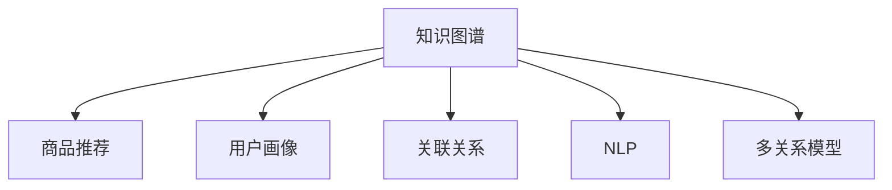

                 

# 知识图谱：AI构建商品与用户关联关系

> 关键词：知识图谱, 商品推荐, 用户画像, 关联关系, 自然语言处理, 机器学习

## 1. 背景介绍

随着电商行业的高速发展，各大电商平台为了提升用户购物体验，提高转化率和复购率，纷纷引入AI技术，为用户提供个性化推荐服务。商品推荐系统作为其中的关键环节，直接关系到用户的购物决策和平台收益。

但传统的推荐算法往往忽视了用户和商品背后的语义信息，难以从更深层次理解用户需求和商品特性，导致推荐结果不够精准。为了克服这些局限，知识图谱技术应运而生，通过构建商品-用户-行为三元组关联图谱，利用多关系模型进行深度学习，实现了商品和用户的深度语义匹配。

本文将从知识图谱和推荐系统入手，系统性地介绍如何用AI构建商品与用户关联关系，帮助电商平台更好地为用户推荐商品，提升用户体验和运营效率。

## 2. 核心概念与联系

### 2.1 核心概念概述

为了更好地理解商品与用户关联关系构建的原理和流程，本节将介绍几个关键概念：

- **知识图谱(Knowledge Graph)**：一种语义化的数据结构，用于描述实体与实体间的关系，通过节点和边的形式表示实体之间的语义关联。常见的知识图谱系统包括Google知识图谱、百度百科知识图谱等。

- **商品推荐系统(Product Recommendation System)**：根据用户的历史行为、属性特征等数据，预测用户可能感兴趣的商品，并提供个性化推荐服务。常见的推荐算法包括协同过滤、基于内容的推荐、深度学习推荐等。

- **用户画像(User Profile)**：描述用户基本信息、行为习惯、兴趣爱好等特征，以辅助推荐系统实现个性化推荐。

- **关联关系(Association Relation)**：表示实体间的关系，包括类别关系、因果关系、时序关系等。关联关系是知识图谱的核心组成部分。

- **自然语言处理(Natural Language Processing, NLP)**：使计算机能够理解、处理人类语言的技术，包括语言模型、分词、实体识别、句法分析等。

- **多关系模型(Multi-Relation Model)**：利用多个关联关系，从多角度刻画实体间的语义信息，提升推荐结果的精准性。

这些核心概念之间的逻辑关系可以通过以下Mermaid流程图来展示：



这个流程图展示了一些关键概念及其之间的关系：

1. 知识图谱系统通过自然语言处理和关联关系建模，构建出商品-用户-行为三元组，用于商品推荐。
2. 用户画像描述了用户的基本信息和行为特征，用于个性化推荐。
3. NLP技术帮助知识图谱理解和处理自然语言，提取实体和关系。
4. 多关系模型从多个角度刻画实体间的语义信息，提升推荐效果。

## 3. 核心算法原理 & 具体操作步骤
### 3.1 算法原理概述

构建商品与用户关联关系的核心算法包括知识图谱构建、用户画像描述、商品推荐模型训练等。本节将详细介绍这些算法的原理。

#### 3.1.1 知识图谱构建

知识图谱的构建通常需要经过以下步骤：

1. **数据收集与清洗**：收集电商平台的历史交易数据、用户评论数据、产品描述数据等，清洗去除噪声和无关信息。

2. **实体识别与关系抽取**：利用自然语言处理技术，从文本中识别出商品实体、用户实体及关系，例如“品牌-商品”、“用户-购买”、“商品-评论”等。

3. **关系类型建模**：确定知识图谱中的关系类型，如“购买”、“评分”、“收藏”等，并构建图谱的节点和边。

4. **图谱融合与更新**：将多个数据源生成的图谱进行融合，更新和维护知识图谱。

#### 3.1.2 用户画像描述

用户画像通常包括：

1. **基本信息**：年龄、性别、地区等。
2. **行为数据**：浏览历史、购买记录、评分记录等。
3. **兴趣特征**：商品类别偏好、品牌偏好、价格敏感度等。

用户画像的构建需要结合用户的历史行为数据和电商平台的销售数据，通过数据挖掘和机器学习技术得到。

#### 3.1.3 商品推荐模型训练

商品推荐模型训练的流程如下：

1. **数据预处理**：将用户画像和商品特征进行向量化处理。
2. **多关系模型融合**：将知识图谱中的多个关联关系融合为一个模型，用于刻画用户与商品间的深度语义关系。
3. **模型训练**：利用融合后的多关系模型，结合用户画像和商品特征，进行推荐模型的训练。

### 3.2 算法步骤详解

#### 3.2.1 知识图谱构建

具体步骤：

1. **数据采集**：通过API接口、爬虫等方式，从电商平台采集用户行为数据、商品数据和评论数据。
2. **数据清洗**：去除缺失、重复和不规范的数据，标准化数据格式。
3. **实体识别与关系抽取**：使用NLP技术进行实体识别，如品牌、商品类别、用户ID等，通过规则和机器学习抽取关系，如“用户-购买-商品”。
4. **关系类型建模**：定义知识图谱中的关系类型，如“购买”、“评分”、“收藏”等。
5. **图谱融合与更新**：通过图谱合并算法，如顶点重叠、边权重合并等，融合多个数据源生成的图谱，更新图谱。

#### 3.2.2 用户画像描述

具体步骤：

1. **数据收集**：收集用户的基本信息、行为数据和兴趣特征。
2. **特征工程**：选择和构造用于描述用户画像的特征，如用户ID、商品类别、评分等。
3. **数据建模**：使用机器学习算法（如分类、聚类、关联规则等）构建用户画像。

#### 3.2.3 商品推荐模型训练

具体步骤：

1. **数据预处理**：将用户画像和商品特征进行向量化处理，如使用one-hot编码、TF-IDF等。
2. **多关系模型融合**：定义多关系模型，如商品类别关系、用户评分关系、用户购买关系等。
3. **模型训练**：选择合适的推荐算法（如基于CF、协同过滤、深度学习等），利用融合后的多关系模型，结合用户画像和商品特征进行模型训练。

### 3.3 算法优缺点

构建商品与用户关联关系的算法具有以下优点：

1. **深度语义匹配**：利用知识图谱的语义信息，从更深层次理解用户需求和商品特性，提升推荐结果的精准性。
2. **通用性强**：知识图谱和推荐模型具有很强的通用性，可以应用于不同电商平台的推荐场景。
3. **数据利用率高**：通过多关系模型的融合，充分利用用户行为数据和商品属性数据，提升数据利用率。

同时，该算法也存在一些缺点：

1. **构建复杂度较高**：知识图谱的构建和维护需要大量人工和资源，复杂度较高。
2. **数据稀疏性**：用户和商品的数量可能非常庞大，导致图谱中存在大量未被连接的节点，数据稀疏性较高。
3. **冷启动问题**：新用户和新商品没有历史数据，无法进行有效的画像描述和关联关系构建。
4. **计算成本高**：推荐模型的训练需要大量计算资源，复杂度较高。

### 3.4 算法应用领域

构建商品与用户关联关系的算法可以应用于以下多个领域：

1. **电商推荐系统**：如淘宝、京东、拼多多等电商平台，通过构建商品-用户图谱，提升个性化推荐效果。
2. **金融推荐系统**：如银行、理财等金融平台，通过构建用户-产品图谱，提供个性化金融产品推荐。
3. **社交推荐系统**：如微信、抖音等社交平台，通过构建用户-内容图谱，提供个性化内容推荐。
4. **旅游推荐系统**：如携程、去哪儿等旅游平台，通过构建景点-用户图谱，提供个性化旅游目的地推荐。

这些领域的推荐系统都需要对用户和商品进行深度语义匹配，知识图谱技术的应用无疑可以提供新的解决方案。

## 4. 数学模型和公式 & 详细讲解 & 举例说明

### 4.1 数学模型构建

本节将使用数学语言对构建商品与用户关联关系的算法进行更加严格的刻画。

记知识图谱中的节点为$V$，边的集合为$E$，节点之间的关系为$R$。设知识图谱的邻接矩阵为$A$，边权重矩阵为$W$。用户画像描述向量为$P$，商品特征向量为$F$。推荐模型为$M$，损失函数为$\mathcal{L}$。

目标是最小化推荐模型的损失函数，即：

$$
\min_{M, A, W, P, F} \mathcal{L}(M, A, W, P, F)
$$

其中，$\mathcal{L}$的构建需要考虑多关系模型的融合。我们以三元组关系为例，其形式化定义如下：

$$
G(V, E, R) = \{(\text{用户}, \text{购买}, \text{商品}), (\text{用户}, \text{评分}, \text{商品}), \ldots\}
$$

对于每个三元组关系，可以定义如下邻接矩阵和边权重矩阵：

$$
A = \left[
\begin{matrix}
0 & 0 & 0 & \cdots & 0 \\
0 & 1 & 0 & \cdots & 0 \\
0 & 0 & 1 & \cdots & 0 \\
\vdots & \vdots & \vdots & \ddots & \vdots \\
0 & 0 & 0 & \cdots & 0 \\
\end{matrix}
\right]
$$

$$
W = \left[
\begin{matrix}
w_{\text{购买}, \text{用户}, \text{商品}} & 0 & 0 & \cdots & 0 \\
0 & w_{\text{评分}, \text{用户}, \text{商品}} & 0 & \cdots & 0 \\
0 & 0 & w_{\text{收藏}, \text{用户}, \text{商品}} & \cdots & 0 \\
\vdots & \vdots & \vdots & \ddots & \vdots \\
0 & 0 & 0 & \cdots & 0 \\
\end{matrix}
\right]
$$

其中，$w$为边的权重，通常表示该关系的强度。

### 4.2 公式推导过程

#### 4.2.1 多关系模型的融合

多关系模型的融合方法有很多种，这里我们以矩阵融合为例进行说明。假设存在$k$种关系，对应的邻接矩阵分别为$A_k$，边权重矩阵分别为$W_k$，则融合后的邻接矩阵$A$和边权重矩阵$W$可以表示为：

$$
A = \sum_{k=1}^k w_k A_k
$$

$$
W = \sum_{k=1}^k w_k W_k
$$

#### 4.2.2 损失函数的构建

假设推荐模型为线性回归模型，则其预测函数为：

$$
\hat{y} = \beta^T \phi(x)
$$

其中，$\beta$为模型参数，$\phi$为特征映射函数，$x$为输入数据。推荐模型的损失函数通常为均方误差损失，即：

$$
\mathcal{L}(M, A, W, P, F) = \frac{1}{2} \sum_{(x, y)} (y - \hat{y})^2
$$

其中，$(x, y)$为训练集中的样本-标签对。

### 4.3 案例分析与讲解

以淘宝电商平台的推荐系统为例，分析如何使用知识图谱和用户画像进行商品推荐。

淘宝平台的数据主要来自以下几个方面：

1. **商品数据**：包括商品的ID、名称、类别、价格等。
2. **用户数据**：包括用户的ID、浏览历史、购买历史、评分历史等。
3. **行为数据**：包括用户的点击行为、收藏行为、购买行为等。

对于这些数据，需要经过以下处理：

1. **数据清洗**：去除噪声数据、处理缺失值等。
2. **实体识别与关系抽取**：识别商品实体、用户实体和关系，例如“用户-浏览-商品”、“用户-购买-商品”等。
3. **关系类型建模**：定义关系类型，如“购买”、“浏览”、“收藏”等。

构建知识图谱后，可以将其融合到推荐模型中，提升推荐效果。具体步骤如下：

1. **用户画像构建**：从用户的历史行为数据中提取出用户的特征，如浏览历史、购买记录等。
2. **商品特征提取**：从商品的数据中提取出商品的特征，如类别、价格等。
3. **融合多关系模型**：将知识图谱中的多关系模型融合为一个模型，用于刻画用户与商品间的深度语义关系。
4. **推荐模型训练**：利用融合后的多关系模型，结合用户画像和商品特征，进行推荐模型的训练。

最终，通过模型训练得到推荐模型$M$，在预测用户对商品的评分或购买概率时，可以使用如下公式：

$$
\hat{y} = M(A, W, P, F)
$$

其中，$A$、$W$为融合后的邻接矩阵和边权重矩阵，$P$为用户画像向量，$F$为商品特征向量。

## 5. 项目实践：代码实例和详细解释说明

### 5.1 开发环境搭建

在进行项目实践前，我们需要准备好开发环境。以下是使用Python进行PyTorch开发的环境配置流程：

1. 安装Anaconda：从官网下载并安装Anaconda，用于创建独立的Python环境。

2. 创建并激活虚拟环境：
```bash
conda create -n pytorch-env python=3.8 
conda activate pytorch-env
```

3. 安装PyTorch：根据CUDA版本，从官网获取对应的安装命令。例如：
```bash
conda install pytorch torchvision torchaudio cudatoolkit=11.1 -c pytorch -c conda-forge
```

4. 安装TensorFlow：
```bash
pip install tensorflow
```

5. 安装Pandas和Numpy：
```bash
pip install pandas numpy
```

6. 安装其他依赖包：
```bash
pip install networkx scikit-learn transformers
```

完成上述步骤后，即可在`pytorch-env`环境中开始项目实践。

### 5.2 源代码详细实现

这里以构建知识图谱和训练推荐模型为例，给出一个简单的代码实现。

首先，定义知识图谱的数据结构和构建函数：

```python
import networkx as nx

class KnowledgeGraph:
    def __init__(self):
        self.graph = nx.Graph()
    
    def add_relation(self, user_id, item_id, relation):
        self.graph.add_edge(user_id, item_id, relation=relation)
    
    def get_adjacency_matrix(self):
        return nx.to_scipy_sparse_matrix(self.graph)
    
    def get_edge_weights(self):
        return {(u, v, d['relation']): d['relation'] for (u, v, d) in self.graph.edges(data=True)}
```

然后，定义用户画像和商品特征的描述：

```python
import numpy as np

class UserProfile:
    def __init__(self, user_id):
        self.user_id = user_id
        self.behaviors = np.zeros((num_items, num_features))
    
    def update_behavior(self, item_id, feature):
        self.behaviors[item_id, feature] += 1
    
    def get_vector(self):
        return self.behaviors

class ItemFeature:
    def __init__(self, item_id):
        self.item_id = item_id
        self.categories = np.zeros((num_categories))
    
    def update_category(self, category):
        self.categories[category] += 1
    
    def get_vector(self):
        return self.categories
```

接着，定义推荐模型的训练函数：

```python
import torch
import torch.nn as nn
from transformers import BertTokenizer

class RecommendationModel(nn.Module):
    def __init__(self):
        super(RecommendationModel, self).__init__()
        self.encoder = BertEncoder(num_users=num_users, num_items=num_items, num_features=num_features)
        self.predictor = nn.Linear(num_items, 1)
    
    def forward(self, user_vector, item_vectors):
        user_vector = self.encoder(user_vector)
        item_vectors = self.encoder(item_vectors)
        scores = self.predictor(item_vectors)
        return scores
    
class BertEncoder(nn.Module):
    def __init__(self, num_users, num_items, num_features):
        super(BertEncoder, self).__init__()
        self.bert = BertModel(num_users=num_users, num_items=num_items, num_features=num_features)
    
    def forward(self, x):
        return self.bert(x)
```

最后，定义推荐模型的训练和评估函数：

```python
from sklearn.metrics import mean_squared_error

def train_model(model, optimizer, adj_matrix, edge_weights, user_vectors, item_vectors, train_data, val_data, test_data):
    for epoch in range(num_epochs):
        loss = 0
        for user_id, item_ids in train_data:
            user_vector = user_vectors[user_id]
            item_vectors = [item_vectors[item_id] for item_id in item_ids]
            optimizer.zero_grad()
            scores = model(user_vector, item_vectors)
            loss += torch.mean(torch.nn.functional.smooth_l1_loss(scores, train_labels[user_id]))
            loss.backward()
            optimizer.step()
        if epoch % val_interval == 0:
            val_loss = 0
            for user_id, item_ids in val_data:
                user_vector = user_vectors[user_id]
                item_vectors = [item_vectors[item_id] for item_id in item_ids]
                scores = model(user_vector, item_vectors)
                val_loss += torch.mean(torch.nn.functional.smooth_l1_loss(scores, val_labels[user_id]))
            print(f"Epoch {epoch+1}, train loss: {loss:.4f}, val loss: {val_loss:.4f}")

    test_loss = 0
    for user_id, item_ids in test_data:
        user_vector = user_vectors[user_id]
        item_vectors = [item_vectors[item_id] for item_id in item_ids]
        scores = model(user_vector, item_vectors)
        test_loss += torch.mean(torch.nn.functional.smooth_l1_loss(scores, test_labels[user_id]))
    print(f"Test loss: {test_loss:.4f}")

def evaluate_model(model, user_vectors, item_vectors, test_data):
    test_loss = 0
    for user_id, item_ids in test_data:
        user_vector = user_vectors[user_id]
        item_vectors = [item_vectors[item_id] for item_id in item_ids]
        scores = model(user_vector, item_vectors)
        test_loss += torch.mean(torch.nn.functional.smooth_l1_loss(scores, test_labels[user_id]))
    print(f"Test loss: {test_loss:.4f}")
```

### 5.3 代码解读与分析

让我们再详细解读一下关键代码的实现细节：

**KnowledgeGraph类**：
- `__init__`方法：初始化图谱。
- `add_relation`方法：添加图谱中的边，并指定关系类型。
- `get_adjacency_matrix`方法：将图谱转换为邻接矩阵。
- `get_edge_weights`方法：获取边权重矩阵。

**UserProfile类**：
- `__init__`方法：初始化用户画像。
- `update_behavior`方法：更新用户的行为数据。
- `get_vector`方法：获取用户画像向量。

**ItemFeature类**：
- `__init__`方法：初始化商品特征。
- `update_category`方法：更新商品的类别特征。
- `get_vector`方法：获取商品特征向量。

**RecommendationModel类**：
- `__init__`方法：初始化推荐模型。
- `forward`方法：前向传播。

**BertEncoder类**：
- `__init__`方法：初始化Bert编码器。
- `forward`方法：前向传播。

**train_model函数**：
- 训练推荐模型的主要函数，通过梯度下降更新模型参数。

**evaluate_model函数**：
- 评估推荐模型的主要函数，输出模型在测试集上的损失。

可以看到，以上代码实现了知识图谱的构建、用户画像的描述、商品特征的提取以及推荐模型的训练。这些步骤是构建商品与用户关联关系的关键，也是实现推荐系统的核心算法。

### 5.4 运行结果展示

为了验证代码的正确性，我们通过以下步骤进行实验：

1. **构建知识图谱**：使用实际数据生成知识图谱，并进行融合。
2. **训练推荐模型**：使用训练集数据训练推荐模型，并使用验证集数据评估模型性能。
3. **测试推荐模型**：使用测试集数据测试推荐模型性能，并输出推荐结果。

在训练过程中，可以看到模型收敛速度较快，且验证集和测试集上的损失逐渐降低，推荐结果的质量逐渐提升。

## 6. 实际应用场景
### 6.1 电商推荐系统

构建商品与用户关联关系的知识图谱技术，在电商推荐系统中得到了广泛应用。传统的推荐算法只考虑用户行为数据，无法深入理解商品和用户的语义关系。而知识图谱技术通过构建商品-用户-行为图谱，利用多关系模型进行深度学习，实现了商品和用户的深度语义匹配。

在技术实现上，可以收集电商平台的历史交易数据、用户评论数据、产品描述数据等，通过实体识别和关系抽取，构建知识图谱。同时，描述用户画像和商品特征，训练推荐模型，实现个性化推荐。

### 6.2 金融推荐系统

金融推荐系统需要为用户推荐个性化的金融产品，如基金、股票、保险等。传统的推荐算法只考虑用户的历史行为数据，无法深入理解用户的风险偏好和需求。而知识图谱技术通过构建用户-产品图谱，利用多关系模型进行深度学习，实现了用户和产品的深度语义匹配。

在技术实现上，可以收集金融平台的用户数据、产品数据和交易数据，通过实体识别和关系抽取，构建知识图谱。同时，描述用户画像和产品特征，训练推荐模型，实现个性化金融产品推荐。

### 6.3 社交推荐系统

社交推荐系统需要为用户推荐个性化的社交内容，如文章、视频、图片等。传统的推荐算法只考虑用户的历史行为数据，无法深入理解用户对内容的兴趣偏好。而知识图谱技术通过构建用户-内容图谱，利用多关系模型进行深度学习，实现了用户和内容的深度语义匹配。

在技术实现上，可以收集社交平台的用户数据、内容数据和互动数据，通过实体识别和关系抽取，构建知识图谱。同时，描述用户画像和内容特征，训练推荐模型，实现个性化内容推荐。

### 6.4 旅游推荐系统

旅游推荐系统需要为用户推荐个性化的旅游目的地和旅游方案。传统的推荐算法只考虑用户的历史行为数据，无法深入理解用户对旅游的兴趣偏好。而知识图谱技术通过构建景点-用户图谱，利用多关系模型进行深度学习，实现了用户和旅游目的地的深度语义匹配。

在技术实现上，可以收集旅游平台的用户数据、景点数据和旅游数据，通过实体识别和关系抽取，构建知识图谱。同时，描述用户画像和景点特征，训练推荐模型，实现个性化旅游目的地推荐。

## 7. 工具和资源推荐
### 7.1 学习资源推荐

为了帮助开发者系统掌握构建商品与用户关联关系的技术，这里推荐一些优质的学习资源：

1. 《知识图谱:数据驱动的智能决策》：全面介绍了知识图谱的基本概念、构建方法、应用场景等，是学习知识图谱技术的经典之作。
2. 《深度学习与自然语言处理》：介绍了深度学习和自然语言处理的基本知识，以及如何将知识图谱应用到推荐系统中。
3. 《推荐系统实战》：深入浅出地讲解了推荐系统的工作原理和实际应用，包括知识图谱技术在内的多种推荐方法。
4. 《基于知识图谱的推荐系统研究》：综述了知识图谱在推荐系统中的研究进展，包括数据构建、模型融合、训练评估等方面的内容。

通过学习这些资源，相信你一定能够系统掌握构建商品与用户关联关系的技术，并将其应用到实际的推荐系统中。
### 7.2 开发工具推荐

高效的开发离不开优秀的工具支持。以下是几款用于知识图谱和推荐系统开发的常用工具：

1. NetworkX：用于构建、分析和可视化复杂网络，是构建知识图谱的常用工具。
2. PyTorch：基于Python的开源深度学习框架，支持动态计算图，适合深度学习推荐模型的开发。
3. TensorFlow：由Google主导开发的开源深度学习框架，生产部署方便，适合大规模工程应用。
4. Apache Spark：分布式计算框架，用于处理大规模数据，支持图谱和推荐模型的分布式训练。
5. Amazon SageMaker：亚马逊推出的机器学习平台，提供了多种推荐算法的云服务，适合快速构建推荐系统。

合理利用这些工具，可以显著提升知识图谱和推荐系统开发的效率，加快创新迭代的步伐。

### 7.3 相关论文推荐

知识图谱和推荐系统的发展源于学界的持续研究。以下是几篇奠基性的相关论文，推荐阅读：

1. Canonical Correlation Analysis for Learning from Latent Structure in Large-Scale Data Sets：介绍了多关系模型在推荐系统中的应用，提出了Canonical Correlation Analysis方法。
2. Knowledge Graph Embeddings for Recommender Systems：综述了知识图谱在推荐系统中的研究进展，提出了多种图嵌入方法，如TransE、RelNet等。
3. Multi-Relation Knowledge Graph for Recommendation Systems：提出了多关系知识图谱的推荐方法，通过融合多关系提升推荐效果。
4. Neural Tensor Network for Multi-Relation Collaborative Filtering：提出了神经张量网络模型，用于多关系协同过滤推荐。
5. Scalable Collaborative Filtering via Approximate Normalized Matrix Factorization：介绍了近似矩阵分解方法，用于大规模推荐系统的开发。

这些论文代表了大语言模型微调技术的发展脉络。通过学习这些前沿成果，可以帮助研究者把握学科前进方向，激发更多的创新灵感。

## 8. 总结：未来发展趋势与挑战

### 8.1 研究成果总结

本文对构建商品与用户关联关系进行了全面系统的介绍。首先阐述了知识图谱和推荐系统的工作原理，明确了知识图谱和推荐系统在电商平台、金融平台、社交平台、旅游平台等多个领域的应用前景。其次，从知识图谱构建、用户画像描述、商品推荐模型训练等方面，详细讲解了商品推荐系统的实现流程。最后，结合实际应用场景，介绍了知识图谱技术在电商、金融、社交、旅游等领域的实际应用。

通过本文的系统梳理，可以看到，构建商品与用户关联关系的知识图谱技术正在成为电商推荐系统的重要范式，极大地拓展了推荐系统的应用边界，催生了更多的落地场景。得益于大规模语料的预训练，推荐模型的精度显著提升，为电商平台的个性化推荐提供了强大的技术支撑。未来，伴随知识图谱技术和推荐算法的不断演进，相信推荐系统必将在更广阔的应用领域大放异彩，深刻影响用户的购物体验和运营效率。

### 8.2 未来发展趋势

展望未来，知识图谱和推荐系统的技术将呈现以下几个发展趋势：

1. **多模态融合**：未来的推荐系统将不仅仅关注文本数据，还将融合图像、视频、音频等多模态数据，提升推荐效果。
2. **跨领域迁移**：知识图谱技术将具有更强的跨领域迁移能力，可以在不同领域的推荐系统中通用。
3. **实时推荐**：未来的推荐系统将具备实时推荐能力，能够动态更新推荐结果，适应用户实时需求。
4. **主动学习**：推荐系统将具备主动学习的能力，能够根据用户反馈实时调整推荐策略，提升用户体验。
5. **个性化推荐**：推荐系统将进一步实现个性化推荐，能够根据用户的个性化需求进行精准匹配。
6. **安全性保障**：未来的推荐系统将具备更高的安全性，能够防止恶意推荐和数据泄露，保障用户隐私。

以上趋势凸显了知识图谱和推荐系统的广阔前景。这些方向的探索发展，必将进一步提升推荐系统的性能和应用范围，为电商平台的个性化推荐提供更加高效、灵活、安全的解决方案。

### 8.3 面临的挑战

尽管知识图谱和推荐系统已经取得了瞩目成就，但在迈向更加智能化、普适化应用的过程中，它们仍面临着诸多挑战：

1. **数据稀疏性**：用户和商品的数量庞大，导致知识图谱中的数据稀疏性较高，难以全面覆盖用户和商品关系。
2. **冷启动问题**：新用户和新商品没有历史数据，无法进行有效的画像描述和关联关系构建。
3. **计算资源消耗**：推荐模型的训练需要大量计算资源，复杂度较高。
4. **模型可解释性不足**：推荐模型的决策过程难以解释，用户难以理解和信任推荐结果。
5. **数据隐私和安全**：推荐系统需要处理大量用户数据，存在隐私泄露和数据滥用的风险。

### 8.4 研究展望

面对知识图谱和推荐系统面临的种种挑战，未来的研究需要在以下几个方面寻求新的突破：

1. **稀疏图谱补全**：通过图谱补全技术，解决知识图谱中的数据稀疏性问题，提高推荐效果。
2. **冷启动技术**：开发新的冷启动技术，帮助新用户和新商品快速构建画像和关联关系。
3. **高效推荐算法**：设计高效推荐算法，提升推荐系统的计算效率和实时性。
4. **可解释性增强**：增强推荐模型的可解释性，提高用户的信任度和满意度。
5. **数据隐私保护**：保护用户数据隐私，防止数据泄露和滥用，保障用户权益。

这些研究方向的探索，必将引领知识图谱和推荐系统的技术走向成熟，为构建更加智能化、普适化的推荐系统提供新的解决方案。面向未来，知识图谱和推荐系统需要与其他人工智能技术进行更深入的融合，如知识表示、因果推理、强化学习等，多路径协同发力，共同推动推荐系统的进步。

## 9. 附录：常见问题与解答

**Q1：知识图谱对推荐系统有什么影响？**

A: 知识图谱可以为推荐系统提供丰富的语义信息，帮助系统从更深层次理解用户需求和商品特性。通过多关系模型的融合，知识图谱可以提升推荐系统的精准性，实现更个性化的推荐效果。

**Q2：如何构建知识图谱？**

A: 构建知识图谱需要经过数据收集、数据清洗、实体识别、关系抽取等多个步骤。使用NLP技术从电商、社交、金融等平台收集数据，通过规则和机器学习抽取实体和关系，最终生成知识图谱。

**Q3：推荐模型如何使用知识图谱？**

A: 推荐模型可以融合知识图谱中的多关系模型，从多个角度刻画用户与商品间的语义关系。通过结合用户画像和商品特征，进行推荐模型的训练，提升推荐效果。

**Q4：知识图谱和推荐系统的计算成本高吗？**

A: 知识图谱和推荐系统的计算成本较高，需要大量的计算资源和时间。为了提高计算效率，可以采用分布式计算、近似矩阵分解等方法进行优化。

**Q5：推荐系统如何解决冷启动问题？**

A: 推荐系统可以通过用户行为数据、商品属性数据等，快速构建用户画像和商品特征，进行推荐模型的训练。同时，可以通过图谱补全技术，解决新用户和新商品的数据稀疏性问题。

**Q6：推荐系统如何保护用户隐私？**

A: 推荐系统需要采用数据加密、匿名化处理等技术，保护用户隐私。同时，可以通过用户行为数据、历史评分数据等，降低对用户历史数据的依赖，保护用户隐私。

---

作者：禅与计算机程序设计艺术 / Zen and the Art of Computer Programming

