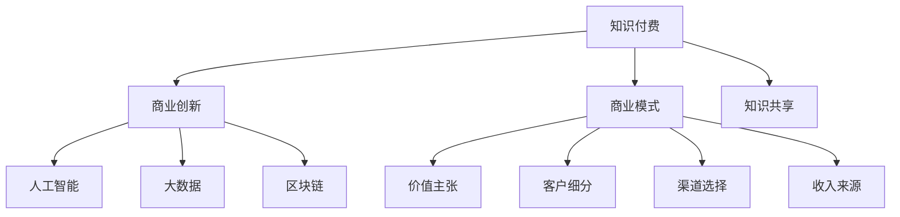

                 

# 知识经济时代下的知识付费创新商业模式推广

> 关键词：知识付费, 商业创新, 商业模式, 经济时代, 人工智能, 大数据, 区块链, 知识共享

## 1. 背景介绍

### 1.1 问题由来
随着互联网的普及和数字技术的发展，人们获取知识的渠道和方式发生了深刻的变化。传统的基于图书、电视、广播等媒介的知识传播方式，已经无法满足现代信息爆炸时代的需求。数字化、网络化、个性化成为知识传播的新特征，人们越来越倾向于在线获取知识，并且愿意为此支付费用。

与此同时，互联网公司、内容创作者、版权方等利益相关方也在积极探索新的商业模式，以期在知识付费领域分得一杯羹。知识付费模式的成功与否，直接关系到知识传播的广度和深度，对社会经济发展和创新能力的提升具有重要影响。

### 1.2 问题核心关键点
知识付费模式的核心在于如何通过数字化手段，高效匹配知识提供者与知识需求者，实现知识的经济价值。其关键点包括：
1. 如何构建精准的匹配机制，将用户兴趣与优质内容进行高效匹配。
2. 如何建立科学的定价体系，既能激励内容创作，又能确保用户满意度。
3. 如何通过技术手段，保障知识的版权和付费权益，避免盗版和侵权。
4. 如何利用数据驱动，实现个性化推荐，提升用户体验。
5. 如何构建可持续发展的商业模式，确保长期稳定运营。

本文旨在深入探讨知识付费模式的创新方向和实践路径，为相关利益方提供参考和借鉴。

## 2. 核心概念与联系

### 2.1 核心概念概述

为更好地理解知识付费创新商业模式，本节将介绍几个密切相关的核心概念：

- 知识付费：指用户为获取特定知识产品或服务而支付费用的行为。形式包括在线课程、电子书、文章、音频、视频等。
- 商业创新：指企业或个人在产品、服务、流程、模式等方面进行创新，以获得新的竞争优势和市场机会。
- 商业模式：指企业盈利的方式和运营策略，包括价值主张、客户细分、渠道选择、收入来源等关键要素。
- 知识经济时代：指知识成为核心生产要素，知识工作者获得高社会地位和丰厚回报的时代背景。
- 人工智能：指模拟人类智能过程的技术和应用，包括机器学习、自然语言处理、计算机视觉等。
- 大数据：指大量、复杂、实时生成的数据，通过对数据的分析和挖掘，可以获取深层次的洞见和价值。
- 区块链：指去中心化、不可篡改、可追溯的数据存储和传输技术，可用于保障数据的真实性和透明性。
- 知识共享：指通过互联网平台，实现知识的无障碍传播和共享，消除信息孤岛。

这些核心概念之间的逻辑关系可以通过以下Mermaid流程图来展示：



这个流程图展示知识付费、商业创新与商业模式、人工智能、大数据、区块链、知识共享之间的相互关系：

1. 知识付费是商业创新的起点，通过市场化运作，实现知识的经济价值。
2. 商业创新包括商业模式的设计和运营策略的制定，是知识付费得以推广的关键。
3. 商业模式的核心包括价值主张、客户细分、渠道选择、收入来源等，需通过技术手段加以实现。
4. 人工智能、大数据、区块链等技术的应用，为知识付费提供了强大的技术支撑。
5. 知识共享促进了知识的传播和普及，为知识付费提供了丰富的内容来源。

这些概念共同构成了知识付费创新商业模式的理论和实践基础，使得知识工作者和知识需求者能够高效匹配，实现知识的价值最大化。

## 3. 核心算法原理 & 具体操作步骤
### 3.1 算法原理概述

知识付费创新商业模式的核心在于通过算法和数据驱动，实现知识的精准匹配和高效传播。其核心算法包括：

1. 推荐算法：通过分析用户行为数据，预测用户兴趣，推荐个性化内容。
2. 定价算法：通过分析市场供需关系、内容价值、用户反馈等数据，动态调整内容价格。
3. 欺诈检测算法：通过分析用户行为模式、支付记录等数据，识别和防范欺诈行为。
4. 知识共享算法：通过分析内容质量、版权状态等数据，鼓励高质量知识共享，避免版权侵权。

这些算法共同构建了一个知识付费生态系统，确保知识工作者和知识需求者能够高效对接，实现知识的经济价值。

### 3.2 算法步骤详解

知识付费创新商业模式的算法步骤大致如下：

**Step 1: 数据收集与处理**
- 收集用户行为数据，包括访问时长、阅读频率、评论反馈、付费记录等。
- 收集内容数据，包括标题、摘要、全文、分类、标签等。
- 对数据进行清洗、去重、标准化处理，确保数据质量。

**Step 2: 用户画像构建**
- 利用机器学习算法，对用户行为数据进行建模，生成用户画像，包括兴趣偏好、知识水平、付费意愿等。
- 根据用户画像，推荐用户可能感兴趣的内容。

**Step 3: 内容推荐与定价**
- 根据用户画像和内容标签，计算内容和用户的匹配度。
- 利用定价算法，动态调整内容价格，确保用户满意和创作者收益。

**Step 4: 欺诈检测与防范**
- 分析用户支付记录和行为模式，识别潜在的欺诈行为。
- 通过数据加密、信息隔离等技术手段，确保用户和内容的安全性。

**Step 5: 知识共享与版权保护**
- 利用区块链技术，确保知识共享的透明性和可追溯性。
- 对内容进行版权保护，防止盗版和侵权行为。

**Step 6: 算法优化与迭代**
- 根据用户反馈和业务需求，不断优化算法模型。
- 通过A/B测试等手段，验证算法效果，持续改进。

### 3.3 算法优缺点

知识付费创新商业模式的算法具有以下优点：
1. 高度个性化。通过推荐算法，能够根据用户兴趣精准匹配内容，提升用户体验。
2. 动态定价。利用定价算法，能够根据市场供需关系调整内容价格，确保创作者收益。
3. 防范欺诈。通过欺诈检测算法，能够识别和防范欺诈行为，保障用户利益。
4. 版权保护。利用区块链技术，能够保障内容的真实性和版权。

同时，该算法也存在一些局限性：
1. 数据隐私问题。用户行为数据和内容数据涉及个人隐私和版权，如何保护数据安全是一个重要问题。
2. 算法公平性。推荐算法和定价算法可能存在偏见，如何确保算法的公平性也是一个重要问题。
3. 欺诈检测的准确性。欺诈检测算法可能存在误判，如何提高检测的准确性是一个重要问题。
4. 知识共享的广泛性。区块链技术可能存在技术复杂性和应用门槛，如何实现知识共享的广泛性也是一个重要问题。

尽管存在这些局限性，但就目前而言，知识付费创新商业模式仍是知识传播和运营的一个重要方向。未来相关研究的重点在于如何进一步降低算法对数据的依赖，提高算法的公平性和安全性，同时兼顾知识共享的广泛性和版权保护。

### 3.4 算法应用领域

知识付费创新商业模式的应用领域非常广泛，涵盖了教育、医疗、金融、科技等多个行业。以下是几个典型应用场景：

- 在线教育：通过个性化推荐，为学生推荐适合的课程和教材，实现因材施教。
- 远程医疗：通过知识共享，实现专家资源的高效利用，提升医疗服务质量。
- 金融理财：通过推荐算法和动态定价，为用户提供个性化的投资建议和产品。
- 科技资讯：通过知识共享，实现最新技术的快速传播和应用。
- 文化艺术：通过推荐算法，为用户推荐高质量的文化产品，提升文化消费体验。

除了这些行业外，知识付费创新商业模式还将拓展到更多场景中，为知识工作者和知识需求者提供新的价值和机会。

## 4. 数学模型和公式 & 详细讲解 & 举例说明
### 4.1 数学模型构建

本节将使用数学语言对知识付费创新商业模式的算法进行更加严格的刻画。

记用户行为数据为 $D_U=\{x_i\}_{i=1}^N, x_i \in \mathbb{R}^d$，其中 $d$ 为用户行为特征维度。记内容数据为 $D_C=\{y_i\}_{i=1}^M, y_i \in \mathbb{R}^m$，其中 $m$ 为内容特征维度。

定义用户画像模型 $U:\mathbb{R}^d \rightarrow \mathbb{R}^k$，其中 $k$ 为用户画像维度。定义内容推荐模型 $R:\mathbb{R}^m \rightarrow \mathbb{R}^k$。

用户行为数据 $D_U$ 和内容数据 $D_C$ 的关系可以用如下矩阵形式表示：

$$
X = U(D_U), Y = R(D_C)
$$

其中 $X$ 为用户画像矩阵，$Y$ 为内容推荐矩阵。

知识付费算法的目标是最小化用户满意度和创作者收益的总和。设用户对内容的满意度为 $S(X, Y)$，创作者对内容的收益为 $C(X, Y)$。则总目标函数为：

$$
\min_{X, Y} S(X, Y) + C(X, Y)
$$

在实践中，我们通常使用基于梯度的优化算法（如Adam、SGD等）来近似求解上述最优化问题。设 $\eta$ 为学习率，则参数的更新公式为：

$$
X \leftarrow X - \eta \nabla_{X}S(X, Y) - \eta\lambda_XX
$$
$$
Y \leftarrow Y - \eta \nabla_{Y}S(X, Y) - \eta\lambda_YY
$$

其中 $\nabla_{X}S(X, Y)$ 和 $\nabla_{Y}S(X, Y)$ 分别为用户满意度和创作者收益对用户画像和内容推荐的梯度，可以通过反向传播算法高效计算。$\lambda_X$ 和 $\lambda_Y$ 为正则化系数，用于防止过拟合。

### 4.2 公式推导过程

以下我们以用户画像构建为例，推导推荐算法中用户画像的计算公式。

假设用户行为数据 $D_U=\{x_i\}_{i=1}^N$，其中 $x_i$ 表示用户第 $i$ 次行为。设用户画像维度为 $k$，则用户画像模型 $U$ 可以表示为：

$$
X = U(D_U) = \sum_{i=1}^N \alpha_ix_i
$$

其中 $\alpha_i$ 为权重系数，可以通过训练得到。

设用户对内容 $y_j$ 的满意度为 $s_j$，则用户满意度的总和 $S(X, Y)$ 可以表示为：

$$
S(X, Y) = \sum_{j=1}^M s_j
$$

其中 $s_j$ 为内容 $y_j$ 对用户画像 $X$ 的满意度，可以通过预设的满意度函数计算得到。例如，可以采用相似度函数 $s_j = \langle X, Y_j \rangle$，其中 $\langle \cdot, \cdot \rangle$ 为内积运算。

在得到用户满意度的总和后，我们可以将其与创作者收益 $C(X, Y)$ 结合起来，得到总目标函数：

$$
\min_{X, Y} S(X, Y) + C(X, Y)
$$

通过优化算法求解上述最优化问题，即可得到用户画像和内容推荐的优化解。

### 4.3 案例分析与讲解

假设某在线教育平台收集了用户行为数据和课程数据，利用知识付费算法实现个性化推荐。

具体步骤如下：

1. 收集用户行为数据 $D_U$，包括浏览时长、阅读频率、评论反馈、付费记录等。
2. 收集课程数据 $D_C$，包括课程标题、摘要、全文、分类、标签等。
3. 构建用户画像模型 $U$，利用机器学习算法，对用户行为数据进行建模，生成用户画像 $X$。
4. 构建内容推荐模型 $R$，利用用户画像 $X$ 和课程数据 $Y$，计算内容和用户的匹配度，生成推荐列表。
5. 利用定价算法，动态调整课程价格，确保用户满意和创作者收益。
6. 利用欺诈检测算法，识别和防范欺诈行为，确保平台安全性。
7. 利用区块链技术，确保课程的真实性和版权，防止盗版和侵权。

通过以上步骤，该平台能够实现用户和内容的精准匹配，提供高质量的个性化推荐服务，同时确保平台的运营安全性和内容的版权保护。

## 5. 项目实践：代码实例和详细解释说明
### 5.1 开发环境搭建

在进行知识付费算法开发前，我们需要准备好开发环境。以下是使用Python进行TensorFlow开发的环境配置流程：

1. 安装Anaconda：从官网下载并安装Anaconda，用于创建独立的Python环境。

2. 创建并激活虚拟环境：
```bash
conda create -n tensorflow-env python=3.8 
conda activate tensorflow-env
```

3. 安装TensorFlow：根据CUDA版本，从官网获取对应的安装命令。例如：
```bash
conda install tensorflow==2.8.0
```

4. 安装各类工具包：
```bash
pip install numpy pandas scikit-learn matplotlib tqdm jupyter notebook ipython
```

完成上述步骤后，即可在`tensorflow-env`环境中开始项目实践。

### 5.2 源代码详细实现

下面我们以在线教育平台的推荐系统为例，给出使用TensorFlow进行知识付费算法的PyTorch代码实现。

首先，定义推荐系统的基础结构：

```python
import tensorflow as tf
from tensorflow.keras.layers import Input, Dense, Embedding, Concatenate
from tensorflow.keras.models import Model

# 定义输入层
user_input = Input(shape=(d,), name='user_input')
content_input = Input(shape=(m,), name='content_input')

# 定义用户画像模型
user_profile = Dense(k, activation='relu')(user_input)

# 定义内容推荐模型
content_profile = Dense(k, activation='relu')(content_input)

# 定义合并层
merged = Concatenate()([user_profile, content_profile])

# 定义输出层
output = Dense(1, activation='sigmoid')(merged)

# 构建模型
model = Model(inputs=[user_input, content_input], outputs=output)
```

然后，定义训练和评估函数：

```python
from tensorflow.keras.optimizers import Adam
from tensorflow.keras.losses import BinaryCrossentropy
from tensorflow.keras.metrics import Accuracy
from sklearn.metrics import precision_score, recall_score, f1_score

# 定义优化器和损失函数
optimizer = Adam(lr=0.001)
loss_fn = BinaryCrossentropy()
metric_fn = Accuracy()

# 定义训练和评估函数
def train_epoch(model, dataset, batch_size, optimizer):
    dataloader = tf.data.Dataset.from_tensor_slices(dataset)
    dataloader = dataloader.batch(batch_size, drop_remainder=True)
    model.compile(optimizer=optimizer, loss=loss_fn, metrics=metric_fn)
    model.fit(dataloader, epochs=10, validation_split=0.2)

def evaluate(model, dataset, batch_size):
    dataloader = tf.data.Dataset.from_tensor_slices(dataset)
    dataloader = dataloader.batch(batch_size, drop_remainder=True)
    loss, accuracy = model.evaluate(dataloader)
    y_true, y_pred = tf.convert_to_tensor(dataset, dtype=tf.int32), model.predict(dataloader)
    precision = precision_score(y_true, y_pred)
    recall = recall_score(y_true, y_pred)
    f1 = f1_score(y_true, y_pred)
    print(f'Loss: {loss:.4f}, Accuracy: {accuracy:.4f}, Precision: {precision:.4f}, Recall: {recall:.4f}, F1-Score: {f1:.4f}')
```

最后，启动训练流程并在测试集上评估：

```python
# 加载数据集
train_dataset = ...
test_dataset = ...

# 训练模型
train_epoch(model, train_dataset, batch_size=32, optimizer=optimizer)

# 评估模型
evaluate(model, test_dataset, batch_size=32)
```

以上就是使用TensorFlow进行在线教育平台推荐系统的完整代码实现。可以看到，得益于TensorFlow的强大封装，我们可以用相对简洁的代码实现推荐系统的训练和评估。

### 5.3 代码解读与分析

让我们再详细解读一下关键代码的实现细节：

**推荐系统结构定义**：
- 定义输入层，接收用户行为数据和课程数据。
- 定义用户画像模型和内容推荐模型，分别对输入进行映射，得到用户画像和内容推荐向量。
- 定义合并层，将用户画像和内容推荐向量进行拼接。
- 定义输出层，通过 sigmoid 函数输出推荐概率。
- 构建模型，将输入和输出连接起来。

**训练和评估函数**：
- 使用 Adam 优化器，定义损失函数为二分类交叉熵，定义评估指标为准确率。
- 定义训练函数，将数据集加载为 TensorFlow 数据集，设置批次大小，调用模型的 fit 方法进行训练。
- 定义评估函数，将测试集加载为 TensorFlow 数据集，设置批次大小，调用模型的 evaluate 方法进行评估，并计算 precision、recall、f1-score 等指标。

**训练流程**：
- 定义总的 epoch 数和批次大小，开始循环迭代
- 每个 epoch 内，先在训练集上训练，输出损失和准确率
- 在验证集上评估，输出 loss、accuracy、precision、recall、f1-score
- 所有 epoch 结束后，在测试集上评估，给出最终测试结果

可以看到，TensorFlow配合TensorFlow的代码实现推荐系统的训练和评估变得简洁高效。开发者可以将更多精力放在数据处理、模型改进等高层逻辑上，而不必过多关注底层的实现细节。

当然，工业级的系统实现还需考虑更多因素，如模型的保存和部署、超参数的自动搜索、更灵活的任务适配层等。但核心的推荐范式基本与此类似。

## 6. 实际应用场景
### 6.1 智能客服系统

知识付费算法在智能客服系统中的应用，可以大幅提升客户服务效率和质量。智能客服系统通过收集历史客服数据和用户反馈，利用知识付费算法构建用户画像，实现精准匹配和个性化推荐，能够快速响应客户需求，提供满意的客服服务。

具体实现步骤如下：

1. 收集历史客服数据和用户反馈，包括问题类型、解决时长、客户满意度等。
2. 构建用户画像模型，利用机器学习算法，对客服数据进行建模，生成用户画像。
3. 构建问题推荐模型，利用用户画像和问题数据，计算问题和用户的匹配度，生成推荐列表。
4. 利用定价算法，动态调整问题价格，确保用户满意和客服收益。
5. 利用欺诈检测算法，识别和防范欺诈行为，确保平台安全性。
6. 利用区块链技术，确保问题的真实性和版权，防止盗版和侵权。

通过以上步骤，智能客服系统能够实现用户和问题的精准匹配，提供高质量的个性化推荐服务，同时确保系统的运营安全性和问题的版权保护。

### 6.2 金融理财服务

知识付费算法在金融理财服务中的应用，可以提供个性化的投资建议和产品推荐，提升用户体验和收益。金融理财平台通过收集用户行为数据和投资数据，利用知识付费算法构建用户画像，实现精准匹配和个性化推荐，能够提供最适合用户的投资建议和产品。

具体实现步骤如下：

1. 收集用户行为数据和投资数据，包括浏览记录、交易记录、风险偏好等。
2. 构建用户画像模型，利用机器学习算法，对用户行为数据进行建模，生成用户画像。
3. 构建产品推荐模型，利用用户画像和产品数据，计算产品和用户的匹配度，生成推荐列表。
4. 利用定价算法，动态调整产品价格，确保用户满意和创作者收益。
5. 利用欺诈检测算法，识别和防范欺诈行为，确保平台安全性。
6. 利用区块链技术，确保产品的真实性和版权，防止盗版和侵权。

通过以上步骤，金融理财平台能够实现用户和产品的精准匹配，提供高质量的个性化推荐服务，同时确保平台的运营安全性和产品的版权保护。

### 6.3 医疗健康咨询

知识付费算法在医疗健康咨询中的应用，可以提供个性化的健康建议和医疗资源推荐，提升医疗服务质量。医疗健康平台通过收集用户健康数据和医疗资源数据，利用知识付费算法构建用户画像，实现精准匹配和个性化推荐，能够提供最适合用户的健康建议和医疗资源。

具体实现步骤如下：

1. 收集用户健康数据和医疗资源数据，包括病史、体检记录、医院资源等。
2. 构建用户画像模型，利用机器学习算法，对用户健康数据进行建模，生成用户画像。
3. 构建健康建议和医疗资源推荐模型，利用用户画像和医疗资源数据，计算建议和资源的匹配度，生成推荐列表。
4. 利用定价算法，动态调整建议和资源价格，确保用户满意和创作者收益。
5. 利用欺诈检测算法，识别和防范欺诈行为，确保平台安全性。
6. 利用区块链技术，确保建议和资源的真实性和版权，防止盗版和侵权。

通过以上步骤，医疗健康平台能够实现用户和建议/资源的精准匹配，提供高质量的个性化推荐服务，同时确保平台的运营安全性和建议/资源的版权保护。

### 6.4 未来应用展望

随着知识付费算法的不断发展，其在更多领域的应用将得到推广，为各行各业带来变革性影响。

在智慧城市治理中，知识付费算法可以应用于城市事件监测、舆情分析、应急指挥等环节，提高城市管理的自动化和智能化水平，构建更安全、高效的未来城市。

在教育培训领域，知识付费算法可以应用于在线教育、职业培训、技能认证等环节，提升教育培训的质量和效果，实现因材施教。

在娱乐文化领域，知识付费算法可以应用于影视剧推荐、音乐推荐、书籍推荐等环节，提升用户娱乐体验，推广优质文化产品。

此外，在企业人力资源、公共安全、智能交通等众多领域，知识付费算法也将不断拓展，为各行各业提供新的价值和机会。相信随着技术的日益成熟，知识付费算法必将在构建人机协同的智能时代中扮演越来越重要的角色。

## 7. 工具和资源推荐
### 7.1 学习资源推荐

为了帮助开发者系统掌握知识付费算法的理论基础和实践技巧，这里推荐一些优质的学习资源：

1. 《深度学习与知识图谱：知识图谱在推荐系统中的应用》系列博文：由知识图谱技术专家撰写，深入浅出地介绍了知识图谱在推荐系统中的应用。

2. 《推荐系统实战》课程：斯坦福大学开设的推荐系统课程，涵盖知识付费算法的各个环节，包括推荐算法、定价算法、欺诈检测算法等。

3. 《推荐系统中的深度学习》书籍：由深度学习专家撰写，全面介绍了推荐系统中的深度学习技术，包括神经网络、对抗学习等。

4. 《知识图谱与推荐系统》书籍：由知识图谱和推荐系统领域的专家联合撰写，涵盖了知识付费算法的原理和实践方法。

5. Weights & Biases：推荐系统训练的实验跟踪工具，可以记录和可视化模型训练过程中的各项指标，方便对比和调优。

通过这些资源的学习实践，相信你一定能够快速掌握知识付费算法的精髓，并用于解决实际的推荐系统问题。

### 7.2 开发工具推荐

高效的开发离不开优秀的工具支持。以下是几款用于知识付费算法开发的常用工具：

1. Python：作为知识付费算法的开发语言，具有丰富的库和工具支持，便于快速迭代研究。

2. TensorFlow：作为深度学习框架，支持动态计算图，便于构建复杂的推荐模型。

3. PyTorch：作为深度学习框架，灵活性强，适合科研和工程应用。

4. Weights & Biases：推荐系统训练的实验跟踪工具，可以记录和可视化模型训练过程中的各项指标，方便对比和调优。

5. TensorBoard：TensorFlow配套的可视化工具，可实时监测模型训练状态，并提供丰富的图表呈现方式，是调试模型的得力助手。

合理利用这些工具，可以显著提升知识付费算法的开发效率，加快创新迭代的步伐。

### 7.3 相关论文推荐

知识付费算法的创新方向和应用实践，源于学界的持续研究。以下是几篇奠基性的相关论文，推荐阅读：

1. Neural Collaborative Filtering：提出基于神经网络的协同过滤算法，广泛应用于推荐系统。

2. Matrix Factorization Techniques for Recommender Systems：提出基于矩阵分解的推荐算法，包括SVD、ALS等，是推荐系统的基础。

3. Deep Matrix Factorization：提出基于深度神经网络的矩阵分解算法，提升推荐系统的准确性。

4. Robust Stochastic Optimization for Online Learning：提出基于在线学习的推荐算法，适用于大规模数据集和实时系统。

5. Adaptive Recommendation via Adaptive Linear Neural Network：提出基于自适应线性神经网络的推荐算法，能够动态调整推荐策略。

这些论文代表了大数据推荐算法的发展脉络。通过学习这些前沿成果，可以帮助研究者把握学科前进方向，激发更多的创新灵感。

## 8. 总结：未来发展趋势与挑战
### 8.1 总结

本文对知识付费算法的创新方向和实践路径进行了全面系统的介绍。首先阐述了知识付费算法在知识经济时代的重要性和价值，明确了算法在个性化推荐、定价调整、欺诈检测、版权保护等方面的关键作用。其次，从原理到实践，详细讲解了知识付费算法的数学模型和实现步骤，给出了知识付费算法的完整代码实例。同时，本文还广泛探讨了知识付费算法在智能客服、金融理财、医疗健康等多个行业领域的应用前景，展示了知识付费算法的巨大潜力。此外，本文精选了知识付费算法的各类学习资源，力求为开发者提供全方位的技术指引。

通过本文的系统梳理，可以看到，知识付费算法在知识传播和运营中扮演着重要角色，能够通过算法和数据驱动，实现知识的精准匹配和高效传播。得益于深度学习、机器学习等先进技术的应用，知识付费算法能够提供个性化推荐、动态定价、欺诈检测等功能，提升用户体验和运营效率。未来，伴随技术的持续演进和应用的深入推广，知识付费算法必将在更多领域发挥更大的作用。

### 8.2 未来发展趋势

展望未来，知识付费算法的创新方向将呈现以下几个发展趋势：

1. 深度学习和强化学习的结合。结合深度学习和强化学习的思想，能够优化推荐模型，提升推荐效果。

2. 多模态推荐系统的出现。结合文本、图像、语音等多种模态的数据，构建更全面、准确的知识图谱，提升推荐系统的泛化能力。

3. 实时推荐系统的构建。利用在线学习技术，实现实时推荐，提升用户体验和运营效率。

4. 知识图谱的深入应用。利用知识图谱技术，构建更丰富的知识网络，提升推荐系统的语义理解能力。

5. 跨平台推荐的实现。构建统一的推荐平台，实现跨平台推荐，提升资源的整合和利用效率。

6. 推荐系统的可解释性。构建可解释的推荐系统，提高模型的透明性和用户信任度。

以上趋势凸显了知识付费算法的发展方向，将推动推荐系统在技术、应用和业务模式上不断创新。

### 8.3 面临的挑战

尽管知识付费算法已经取得了瞩目成就，但在迈向更加智能化、普适化应用的过程中，它仍面临着诸多挑战：

1. 数据隐私问题。用户行为数据和内容数据涉及个人隐私和版权，如何保护数据安全是一个重要问题。

2. 算法公平性。推荐算法和定价算法可能存在偏见，如何确保算法的公平性也是一个重要问题。

3. 欺诈检测的准确性。欺诈检测算法可能存在误判，如何提高检测的准确性是一个重要问题。

4. 推荐系统的透明性。推荐系统的决策过程往往缺乏可解释性，难以对其推理逻辑进行分析和调试。

5. 推荐系统的可扩展性。推荐系统在大规模数据集上的高效处理和存储是一个重要问题。

尽管存在这些挑战，但就目前而言，知识付费算法仍是知识传播和运营的重要手段。未来相关研究的重点在于如何进一步降低算法对数据的依赖，提高算法的公平性和安全性，同时兼顾推荐系统的透明性和可扩展性。

### 8.4 研究展望

面对知识付费算法所面临的挑战，未来的研究需要在以下几个方面寻求新的突破：

1. 无监督和半监督推荐算法。探索无监督和半监督推荐方法，摆脱对大规模标注数据的依赖，利用非结构化数据进行推荐。

2. 参数高效和计算高效的推荐算法。开发更加参数高效和计算高效的推荐方法，在保证推荐效果的同时，减小模型的计算资源消耗。

3. 推荐系统的可解释性。引入因果分析和博弈论工具，增强推荐系统的透明性和可解释性。

4. 知识图谱和推荐系统的结合。构建更丰富的知识图谱，提升推荐系统的语义理解能力，实现知识驱动的推荐。

5. 推荐系统的伦理道德。引入伦理道德导向的评估指标，过滤和惩罚有偏见、有害的推荐结果，确保推荐系统的公平性和安全性。

这些研究方向将引领知识付费算法向更高的台阶，为推荐系统提供更加科学、透明、可解释、可控的智能解决方案，构建人机协同的智能时代。

## 9. 附录：常见问题与解答

**Q1：知识付费算法是否适用于所有推荐场景？**

A: 知识付费算法在大多数推荐场景上都能取得不错的效果，特别是对于数据量较小的推荐任务。但对于一些特定领域的推荐任务，如音乐、视频、新闻等，需要结合领域特性进行优化。例如，音乐推荐可以加入用户听歌时长、频率等行为数据，视频推荐可以加入用户观看时长、点击次数等行为数据，新闻推荐可以加入用户阅读时长、分享次数等行为数据，以进一步提升推荐效果。

**Q2：如何构建精准的用户画像？**

A: 构建精准的用户画像需要多方面数据的综合利用，包括行为数据、兴趣数据、社交数据、地理位置等。可以采用机器学习算法，如协同过滤、深度学习、知识图谱等，对多种数据进行建模，生成多维度的用户画像。同时，可以引入领域专家的知识和经验，提高用户画像的准确性和完备性。

**Q3：如何处理推荐系统中的冷启动问题？**

A: 冷启动问题是指新用户或新商品的推荐缺乏足够数据支持。可以采用多种方法处理冷启动问题，如利用用户已有数据、引入社交网络关系、结合热门商品推荐等。此外，还可以利用深度学习模型，如循环神经网络、变分自编码器等，对用户和商品进行动态建模，提升推荐系统的适应性。

**Q4：如何提高推荐系统的实时性？**

A: 提高推荐系统的实时性需要优化推荐算法和数据处理流程。可以采用在线学习算法，如增量学习、随机梯度下降等，实时更新推荐模型，提升推荐效率。同时，可以优化数据存储和处理方式，如采用分布式数据库、缓存技术等，降低推荐系统的时间复杂度和空间复杂度。

**Q5：如何确保推荐系统的安全性？**

A: 确保推荐系统的安全性需要从数据、算法和系统多个层面进行防护。可以采用数据加密技术，如AES、RSA等，保护用户数据和商品数据的安全性。可以采用安全算法，如安全的协同过滤算法、安全的深度学习算法等，提高推荐系统的安全性和鲁棒性。可以采用安全协议，如HTTPS、OAuth等，保障推荐系统的通信安全和用户身份认证。

通过以上常见问题的解答，相信你对知识付费算法的理解和应用将更加深入，能够更好地解决实际推荐系统的问题。

---

作者：禅与计算机程序设计艺术 / Zen and the Art of Computer Programming

