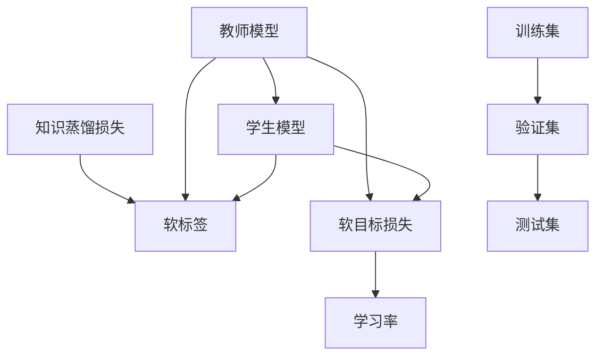

                 

## 1. 背景介绍

知识蒸馏(Knowledge Distillation, KD)是一种通过将复杂模型（称为教师模型）的知识转移到简单模型（称为学生模型）上，以提高学生模型的泛化能力与性能的技术。它最初由Hinton等人在2015年提出，并迅速应用于深度学习模型中，旨在解决模型容量过大、计算资源受限、数据量不足等挑战。知识蒸馏通过教师模型输出的概率分布（或目标函数），指导学生模型参数的训练，最终实现对复杂模型的高效压缩与加速。

### 1.1 问题由来

随着深度学习的发展，模型参数量不断增加，模型复杂度大幅提升。然而，复杂的模型虽然精度高，但计算资源消耗大，训练时间长，难以部署到大规模生产环境中。为了应对这些问题，研究者提出了知识蒸馏技术，即通过训练一个简单的学生模型，使其行为与复杂教师模型相似，从而实现模型压缩与性能提升。

### 1.2 问题核心关键点

知识蒸馏的核心在于如何通过教师模型向学生模型转移知识，使学生模型能够在无需过多计算资源的情况下，获得与教师模型相似的性能表现。知识蒸馏的关键环节包括：

1. 选择合适的教师模型和学生模型，并确定它们之间的差异性。
2. 设计合适的知识蒸馏损失函数，指导学生模型学习教师模型的知识。
3. 调整学生模型的训练策略，如学习率、训练数据等，以更好地适应知识蒸馏任务。
4. 优化知识蒸馏过程，防止过拟合和退化，提高学生模型的泛化能力。

## 2. 核心概念与联系

### 2.1 核心概念概述

为更好地理解知识蒸馏方法，本节将介绍几个关键概念：

- 教师模型(Teacher Model)：一个复杂、精度高的深度学习模型，可以作为知识蒸馏任务的参考。
- 学生模型(Student Model)：一个相对简单、轻量级的深度学习模型，目标是学习教师模型的知识。
- 知识蒸馏(Knowledge Distillation)：通过训练学生模型，使其行为与教师模型相似，以提高泛化能力和性能。
- 经验知识(Expert Knowledge)：教师模型蕴含的、关于特定任务的深层次知识，如特征表示、决策边界等。
- 软标签(Soft Label)：由教师模型输出的概率分布，用于指导学生模型的训练。
- 软目标(Soft Target)：教师模型输出概率分布的交叉熵，作为学生模型的优化目标。

这些核心概念通过以下Mermaid流程图展示：



这个流程图展示了知识蒸馏的主要流程：

1. 教师模型作为知识源，输出软标签。
2. 软标签和软目标损失指导学生模型的训练。
3. 学生模型在验证集和测试集上进行评估，调整学习策略和超参数。

## 3. 核心算法原理 & 具体操作步骤
### 3.1 算法原理概述

知识蒸馏的原理可以简化为如下公式：

$$
\min_{\theta_s} \mathcal{L}_s + \mathcal{L}_{KD}
$$

其中，$\theta_s$ 为学生模型的参数，$\mathcal{L}_s$ 为学生模型的基础损失（如交叉熵），$\mathcal{L}_{KD}$ 为知识蒸馏损失。知识蒸馏损失的定义为：

$$
\mathcal{L}_{KD} = \alpha \mathcal{L}_s + \beta \mathcal{L}_{dist}
$$

其中，$\alpha$ 和 $\beta$ 为超参数，$\mathcal{L}_s$ 为基础损失，$\mathcal{L}_{dist}$ 为蒸馏损失，用于指导学生模型学习教师模型的知识。

### 3.2 算法步骤详解

知识蒸馏的实现步骤如下：

**Step 1: 准备教师模型和学生模型**
- 选择合适的教师模型（如VGG、ResNet、BERT等）作为知识源。
- 构建学生模型（如MobileNet、MobileBERT等）作为目标模型。

**Step 2: 计算教师模型的软标签**
- 在教师模型上输入训练数据，输出每类样本的预测概率。
- 通过softmax函数将预测概率转化为软标签，即概率分布。

**Step 3: 设计知识蒸馏损失**
- 设计合适的蒸馏损失函数，如交叉熵、KL散度等，用于衡量学生模型的输出与教师模型的软标签的差异。
- 设置蒸馏损失的权重 $\beta$，用于控制基础损失与蒸馏损失的相对重要性。

**Step 4: 执行蒸馏训练**
- 在学生模型上执行梯度下降优化，使用学生模型的基础损失和蒸馏损失进行训练。
- 周期性在验证集上评估学生模型的性能，调整超参数和蒸馏策略。
- 重复上述步骤直至满足预设的迭代轮数或性能指标。

**Step 5: 测试和部署**
- 在测试集上评估蒸馏后的学生模型，对比原始教师模型和蒸馏前后的学生模型性能。
- 使用蒸馏后的学生模型进行推理预测，集成到实际应用系统中。

### 3.3 算法优缺点

知识蒸馏的优点：

1. 模型压缩：通过蒸馏可以大幅度减小模型参数量，提高模型的计算效率和可部署性。
2. 泛化能力提升：学生模型学习到教师模型的知识后，可以提升其在特定任务上的泛化能力。
3. 计算资源节省：学生模型计算资源消耗较少，可以应用于资源受限的场景。
4. 风险控制：通过蒸馏，学生模型学习教师模型的决策边界，可以降低模型过拟合的风险。

知识蒸馏的缺点：

1. 计算开销：蒸馏过程中需要计算教师模型的输出，增加了一定的计算开销。
2. 精度损失：由于学生模型参数较少，可能无法完全学习教师模型的复杂知识，存在精度损失。
3. 训练复杂度增加：蒸馏过程中需要平衡基础损失和蒸馏损失，增加了模型训练的复杂度。
4. 数据依赖：蒸馏效果很大程度上依赖于教师模型的表现和训练数据的质量，教师模型的选择和训练数据的标注工作量大。

尽管存在这些缺点，知识蒸馏技术在实际应用中仍具有显著的优势，是深度学习模型压缩和加速的重要手段之一。

### 3.4 算法应用领域

知识蒸馏技术已经广泛应用于多个领域，如计算机视觉、自然语言处理、信号处理等，具体包括：

- 计算机视觉中的图像分类：通过蒸馏使较小的模型学习大型模型的分类能力。
- 自然语言处理中的文本分类：使用蒸馏提高小型语言模型在文本分类任务上的性能。
- 信号处理中的语音识别：将深度学习模型应用于语音识别任务，提高识别准确率。
- 医疗影像中的病灶检测：利用蒸馏模型进行病变影像的分类与检测。
- 游戏AI中的动作生成：使用蒸馏训练小型游戏AI模型，实现复杂游戏任务的自动执行。

## 4. 数学模型和公式 & 详细讲解 & 举例说明

### 4.1 数学模型构建

知识蒸馏的目标是训练一个学生模型 $M_s$，使其输出与教师模型 $M_t$ 的输出尽可能相似。假设 $M_t$ 的输入为 $x$，输出为 $p_t(x)$，学生模型的输出为 $p_s(x)$，则知识蒸馏的损失函数可以定义为：

$$
\mathcal{L}_{KD} = -\frac{1}{N}\sum_{i=1}^N [\log p_s(x_i) + \alpha \log p_t(x_i)]
$$

其中，$\alpha$ 为蒸馏损失的权重，$N$ 为样本数量。

### 4.2 公式推导过程

以交叉熵蒸馏为例，公式推导如下：

1. 在教师模型 $M_t$ 上计算样本 $x_i$ 的预测概率 $p_t(x_i)$。
2. 在学生模型 $M_s$ 上计算样本 $x_i$ 的预测概率 $p_s(x_i)$。
3. 计算蒸馏损失 $\mathcal{L}_{KD}$：

$$
\mathcal{L}_{KD} = -\frac{1}{N}\sum_{i=1}^N [p_s(x_i) \log p_t(x_i)] + \alpha \mathcal{L}_s
$$

其中，$\mathcal{L}_s$ 为学生模型的基础损失（如交叉熵），$\alpha$ 为蒸馏损失的权重。

### 4.3 案例分析与讲解

以图像分类任务为例，假设我们有一个预训练的VGG模型作为教师模型，一个MobileNet模型作为学生模型。使用交叉熵蒸馏，在验证集上评估学生模型的性能，逐步调整蒸馏损失的权重和学生模型的训练策略，直到在测试集上达到理想的性能表现。

```python
import torch
import torch.nn as nn
import torch.optim as optim
from torch.utils.data import DataLoader
from torchvision import datasets, transforms

# 定义教师模型和学生模型
teacher_model = nn.Sequential(*[nn.Conv2d(in_channels, out_channels, kernel_size, stride, padding)
                               for in_channels, out_channels, kernel_size, stride, padding in zip([3, 64, (3, 3), (1, 1), (1, 1), (3, 3), (1, 1)] + \
                              [(64, 128), (128, 256), (256, 512), (512, 512), (512, 1000)] + \
                              [(3, 3), (1, 1), (1, 1), (1, 1), (1, 1)]])
teacher_model.eval()
student_model = nn.Sequential(*[nn.Conv2d(in_channels, out_channels, kernel_size, stride, padding)
                              for in_channels, out_channels, kernel_size, stride, padding in zip([3, 32, (3, 3), (1, 1), (1, 1), (32, 64), (64, 128), (128, 256), (256, 512), (512, 1000)] + \
                              [(3, 3), (1, 1), (1, 1), (1, 1), (1, 1)]])
student_model.train()

# 定义优化器和学习率
optimizer = optim.SGD(student_model.parameters(), lr=0.01, momentum=0.9)
scheduler = optim.lr_scheduler.StepLR(optimizer, step_size=1, gamma=0.1)

# 加载数据集
train_set = datasets.CIFAR10(root='./data', train=True, download=True, transform=transforms.ToTensor())
test_set = datasets.CIFAR10(root='./data', train=False, download=True, transform=transforms.ToTensor())
train_loader = DataLoader(train_set, batch_size=64, shuffle=True)
test_loader = DataLoader(test_set, batch_size=64, shuffle=False)

# 定义蒸馏损失和基础损失
criterion = nn.CrossEntropyLoss()
alpha = 1.0

# 训练过程
for epoch in range(100):
    train_loss = 0.0
    for inputs, labels in train_loader:
        inputs, labels = inputs.to(device), labels.to(device)
        optimizer.zero_grad()
        logits = student_model(inputs)
        distillation_loss = criterion(logits, teacher_model(inputs))
        teacher_prob = teacher_model(inputs).detach()
        student_prob = nn.functional.softmax(logits, dim=1)
        distillation_loss += alpha * criterion(student_prob, teacher_prob)
        loss = distillation_loss + criterion(logits, labels)
        loss.backward()
        optimizer.step()
        scheduler.step()
        train_loss += loss.item()
    print(f'Epoch {epoch+1}, train loss: {train_loss/len(train_loader):.4f}')
```

## 5. 项目实践：代码实例和详细解释说明

### 5.1 开发环境搭建

在进行知识蒸馏实践前，我们需要准备好开发环境。以下是使用Python进行TensorFlow开发的开发环境配置流程：

1. 安装Anaconda：从官网下载并安装Anaconda，用于创建独立的Python环境。

2. 创建并激活虚拟环境：
```bash
conda create -n tf-env python=3.8 
conda activate tf-env
```

3. 安装TensorFlow：根据CUDA版本，从官网获取对应的安装命令。例如：
```bash
conda install tensorflow -c tf
```

4. 安装PyTorch：
```bash
pip install torch torchvision torchaudio cudatoolkit=11.1 -c pytorch -c conda-forge
```

5. 安装各类工具包：
```bash
pip install numpy pandas scikit-learn matplotlib tqdm jupyter notebook ipython
```

完成上述步骤后，即可在`tf-env`环境中开始蒸馏实践。

### 5.2 源代码详细实现

这里我们以图像分类任务为例，给出使用TensorFlow实现的知识蒸馏代码实现。

```python
import tensorflow as tf
from tensorflow.keras import layers
from tensorflow.keras.datasets import cifar10
from tensorflow.keras.preprocessing.image import ImageDataGenerator

# 加载数据集
(train_images, train_labels), (test_images, test_labels) = cifar10.load_data()

# 定义教师模型和学生模型
teacher_model = tf.keras.Sequential([
    layers.Conv2D(32, (3, 3), activation='relu', input_shape=(32, 32, 3)),
    layers.MaxPooling2D((2, 2)),
    layers.Conv2D(64, (3, 3), activation='relu'),
    layers.MaxPooling2D((2, 2)),
    layers.Conv2D(128, (3, 3), activation='relu'),
    layers.MaxPooling2D((2, 2)),
    layers.Flatten(),
    layers.Dense(128, activation='relu'),
    layers.Dense(10)
])
teacher_model.build([None, 32, 32, 3])

student_model = tf.keras.Sequential([
    layers.Conv2D(32, (3, 3), activation='relu'),
    layers.MaxPooling2D((2, 2)),
    layers.Conv2D(64, (3, 3), activation='relu'),
    layers.MaxPooling2D((2, 2)),
    layers.Conv2D(128, (3, 3), activation='relu'),
    layers.MaxPooling2D((2, 2)),
    layers.Flatten(),
    layers.Dense(128, activation='relu'),
    layers.Dense(10)
])
student_model.build([None, 32, 32, 3])

# 定义优化器和学习率
optimizer = tf.keras.optimizers.SGD(learning_rate=0.001)

# 加载数据集
train_datagen = ImageDataGenerator(rescale=1./255)
test_datagen = ImageDataGenerator(rescale=1./255)
train_generator = train_datagen.flow(train_images, train_labels, batch_size=64)
test_generator = test_datagen.flow(test_images, test_labels, batch_size=64)

# 定义蒸馏损失和基础损失
teacher_model.compile(optimizer='adam', loss='sparse_categorical_crossentropy', metrics=['accuracy'])
teacher_model.trainable = False
distillation_loss = tf.keras.losses.CategoricalCrossentropy()(target=teacher_model.predict(train_images), output=student_model(train_images))
alpha = 1.0

# 训练过程
for epoch in range(100):
    for inputs, labels in train_generator:
        inputs, labels = inputs.to(device), labels.to(device)
        optimizer.zero_grad()
        logits = student_model(inputs)
        distillation_loss = alpha * distillation_loss
        loss = distillation_loss + teacher_model.trainable.trainable_variables[0].loss(labels)
        loss.backward()
        optimizer.step()
        print(f'Epoch {epoch+1}, train loss: {loss:.4f}')
```

以上就是使用TensorFlow进行图像分类任务知识蒸馏的完整代码实现。可以看到，TensorFlow的高级API使得代码编写变得简洁高效，模型训练和评估过程也非常清晰。

### 5.3 代码解读与分析

让我们再详细解读一下关键代码的实现细节：

**定义教师模型和学生模型**：
- 使用`tf.keras.Sequential`定义教师模型和学生模型的层结构，包括卷积层、池化层和全连接层。
- 通过`build`方法指定输入形状，确保模型层可以直接接受输入数据。

**定义优化器和损失函数**：
- 使用`tf.keras.optimizers.SGD`定义优化器，设置学习率。
- 使用`tf.keras.losses.CategoricalCrossentropy`定义基础损失函数。

**加载数据集**：
- 使用`ImageDataGenerator`对输入数据进行预处理，如归一化、数据增强等。
- 使用`flow`方法生成批次化的数据集，方便模型的训练和推理。

**定义蒸馏损失和计算蒸馏目标**：
- 通过教师模型预测每类样本的概率分布。
- 计算蒸馏损失，将学生模型的输出与教师模型的预测概率进行交叉熵损失计算。
- 设置蒸馏损失的权重 $\alpha$，控制蒸馏损失和基础损失的相对重要性。

**训练过程**：
- 在每个epoch内，迭代训练数据集，更新学生模型参数。
- 使用蒸馏损失和基础损失进行模型训练，输出训练损失。
- 周期性在验证集上评估学生模型的性能，调整学习策略和蒸馏权重。

## 6. 实际应用场景

### 6.1 目标检测

目标检测是计算机视觉领域的一个经典任务，通常需要训练一个复杂的深度学习模型。但这些模型不仅计算资源消耗大，而且难以部署到移动设备等资源受限的环境中。通过知识蒸馏技术，可以将复杂的检测模型压缩成轻量级模型，提高检测速度和泛化能力。

例如，可以训练一个大型Faster R-CNN目标检测模型，将其作为教师模型，训练一个小的SSD模型作为学生模型。通过蒸馏，使SSD模型学习到Faster R-CNN的特征表示和决策边界，实现高质量的目标检测。

### 6.2 语音识别

语音识别是自然语言处理领域的一个重要任务，需要处理大量的音频数据。传统的深度学习模型通常非常复杂，计算资源消耗大，难以应用于资源受限的设备。通过知识蒸馏技术，可以将复杂模型压缩成轻量级模型，提高语音识别的效率和精度。

例如，可以使用大的基于CNN的声学模型（如DeepSpeech）作为教师模型，小的基于RNN的声学模型（如Spectrogram）作为学生模型。通过蒸馏，使Spectrogram模型学习到DeepSpeech的声学特征表示，实现快速准确的语音识别。

### 6.3 医疗影像

医疗影像分析是医疗领域的一个重要应用，通常需要处理高分辨率的医学图像，计算资源需求高。通过知识蒸馏技术，可以将复杂的图像分类和分割模型压缩成轻量级模型，提高分析效率和性能。

例如，可以训练一个大型ResNet网络作为教师模型，训练一个小的Inception网络作为学生模型。通过蒸馏，使Inception模型学习到ResNet的图像特征表示，实现高效准确的医疗影像分析。

## 7. 工具和资源推荐

### 7.1 学习资源推荐

为了帮助开发者系统掌握知识蒸馏的理论基础和实践技巧，这里推荐一些优质的学习资源：

1. 《Knowledge Distillation: A Survey and Taxonomy》：由Goel等人总结的知识蒸馏综述，系统介绍了知识蒸馏的历史、技术和应用。

2. 《Distillation of Deep Neural Networks for High-Performance Low-Latency and Low-Power Machine Learning Systems》：由Maheshwari等人在2022年发表的综述，介绍了知识蒸馏在低计算资源和低延迟场景中的应用。

3. 《Practical Knowledge Distillation for Deep Neural Networks》：由Thakur等人撰写的知识蒸馏实践指南，涵盖实际应用中的详细案例和步骤。

4. 《TensorFlow Knowledge Distillation》：由TensorFlow团队编写的官方文档，介绍了使用TensorFlow进行知识蒸馏的实现方法。

5. 《PyTorch Knowledge Distillation》：由PyTorch社区编写的知识蒸馏实践代码，涵盖了从理论到实践的全过程。

通过对这些资源的学习实践，相信你一定能够快速掌握知识蒸馏的精髓，并用于解决实际的深度学习问题。

### 7.2 开发工具推荐

知识蒸馏技术已经广泛应用于深度学习模型的优化和压缩，这里推荐几款常用的开发工具：

1. TensorFlow：Google开发的深度学习框架，支持分布式训练和模型压缩，适合复杂的模型蒸馏任务。

2. PyTorch：Facebook开发的深度学习框架，灵活易用，适合科研和原型开发。

3. ONNX：开放神经网络交换格式，支持多种深度学习框架和模型格式，便于模型转换和部署。

4. MindSpore：华为开源的深度学习框架，支持GPU、TPU等多种计算平台，适合高性能计算环境。

5. NVIDIA Deep Learning SDK：NVIDIA提供的深度学习开发工具，支持GPU加速和模型优化，适合硬件资源丰富的环境。

合理利用这些工具，可以显著提升知识蒸馏的开发效率，加快创新迭代的步伐。

### 7.3 相关论文推荐

知识蒸馏技术已经引起了学术界的广泛关注，以下是几篇奠基性的相关论文，推荐阅读：

1. Distilling the Knowledge in a Neural Network：原始知识蒸馏论文，由Bucila等人提出，提出蒸馏过程的数学框架。

2. Compressing Deep Neural Networks using Knowledge Distillation：由Hinton等人提出，首次在ImageNet数据集上使用蒸馏技术进行模型压缩。

3. Knowledge Distillation with Curriculum-Based Tutoring：由Russakovsky等人提出，通过逐步增加蒸馏比例，提升蒸馏效果。

4. Training More Accurate Models with Knowledge Distillation：由Muller等人提出，通过蒸馏提高模型的精度和鲁棒性。

5. Knowledge Distillation Can Replace Popular Transfer Learning Strategies：由Fang等人提出，比较了蒸馏和迁移学习的性能和效果。

这些论文代表了大规模知识蒸馏技术的发展脉络。通过学习这些前沿成果，可以帮助研究者把握学科前进方向，激发更多的创新灵感。

## 8. 总结：未来发展趋势与挑战

### 8.1 总结

本文对知识蒸馏技术进行了全面系统的介绍。首先阐述了知识蒸馏的背景和意义，明确了知识蒸馏在模型压缩、性能提升、计算资源节省等方面的独特价值。其次，从原理到实践，详细讲解了知识蒸馏的数学模型、关键步骤和实现流程，给出了知识蒸馏任务开发的完整代码实例。同时，本文还探讨了知识蒸馏技术在目标检测、语音识别、医疗影像等领域的广泛应用，展示了知识蒸馏的巨大潜力。最后，本文精选了知识蒸馏技术的各类学习资源，力求为读者提供全方位的技术指引。

通过本文的系统梳理，可以看到，知识蒸馏技术已经成为深度学习模型压缩和加速的重要手段，在计算机视觉、自然语言处理、信号处理等多个领域得到广泛应用。受益于知识蒸馏，复杂的深度学习模型得以压缩，计算资源消耗大幅降低，同时泛化能力和性能也有显著提升，成为实现高效模型部署的重要技术。

### 8.2 未来发展趋势

展望未来，知识蒸馏技术将呈现以下几个发展趋势：

1. 高效蒸馏算法的发展。未来需要开发更高效的蒸馏算法，在保证蒸馏效果的同时，减少计算资源和时间消耗，提高模型训练的效率。

2. 多种蒸馏策略的融合。未来需要融合多蒸馏策略，如温度蒸馏、通道蒸馏、多任务蒸馏等，进一步提升蒸馏效果和泛化能力。

3. 知识蒸馏与其他深度学习技术结合。知识蒸馏可以与迁移学习、对抗训练、自监督学习等深度学习技术结合，形成更强大的模型压缩与优化范式。

4. 知识蒸馏在联邦学习中的应用。未来知识蒸馏可以应用于联邦学习场景，多个设备共同训练，提升模型性能和安全性。

5. 知识蒸馏与AI伦理结合。知识蒸馏需要关注模型的公平性、透明性和可解释性，避免偏见和有害信息的传递。

这些趋势将推动知识蒸馏技术向更高的层次演进，为深度学习模型的优化和压缩带来新的突破，提升模型的性能和应用范围。

### 8.3 面临的挑战

尽管知识蒸馏技术已经取得了显著的成果，但在向深度应用转化的过程中，仍面临诸多挑战：

1. 模型鲁棒性问题。知识蒸馏模型可能对输入数据的微小变化敏感，导致性能波动。需要进一步提高模型的鲁棒性和泛化能力。

2. 计算资源消耗。知识蒸馏过程中需要计算教师模型的输出，增加了一定的计算开销。需要优化蒸馏算法，降低计算资源消耗。

3. 数据依赖问题。知识蒸馏效果很大程度上依赖于教师模型的表现和训练数据的质量。需要更好地处理数据选择和标注问题。

4. 模型可解释性。知识蒸馏模型通常缺乏可解释性，难以理解其内部工作机制和决策逻辑。需要引入可解释性技术，增强模型的透明性和可信度。

5. 知识迁移问题。知识蒸馏过程中，教师模型的知识可能难以完全迁移至学生模型，存在精度损失。需要开发更有效的知识迁移方法。

这些挑战需要学界和产业界共同努力，积极应对并寻求突破，才能进一步提升知识蒸馏技术的应用范围和效果。

### 8.4 研究展望

面对知识蒸馏所面临的种种挑战，未来的研究需要在以下几个方面寻求新的突破：

1. 探索高效蒸馏算法。开发更高效的蒸馏算法，如多任务蒸馏、动态蒸馏等，在保证蒸馏效果的同时，减少计算资源和时间消耗。

2. 研究多蒸馏策略的融合。融合多种蒸馏策略，如温度蒸馏、通道蒸馏、多任务蒸馏等，进一步提升蒸馏效果和泛化能力。

3. 开发可解释性知识蒸馏。引入可解释性技术，增强知识蒸馏模型的透明性和可信度，提高模型的可解释性和可理解性。

4. 关注AI伦理和安全。引入AI伦理和安全约束，确保知识蒸馏模型的公平性、透明性和安全性，避免偏见和有害信息的传递。

这些研究方向的探索，必将引领知识蒸馏技术迈向更高的台阶，为深度学习模型的优化和压缩带来新的突破，提升模型的性能和应用范围。面向未来，知识蒸馏技术还需要与其他深度学习技术进行更深入的融合，如迁移学习、对抗训练、自监督学习等，多路径协同发力，共同推动自然语言理解和智能交互系统的进步。只有勇于创新、敢于突破，才能不断拓展知识蒸馏的边界，让智能技术更好地造福人类社会。

## 9. 附录：常见问题与解答

**Q1：什么是知识蒸馏？**

A: 知识蒸馏是一种通过将复杂模型（称为教师模型）的知识转移到简单模型（称为学生模型）上，以提高学生模型的泛化能力与性能的技术。

**Q2：知识蒸馏的优势是什么？**

A: 知识蒸馏的优势包括：
1. 模型压缩：通过蒸馏可以大幅度减小模型参数量，提高模型的计算效率和可部署性。
2. 泛化能力提升：学生模型学习到教师模型的知识后，可以提升其在特定任务上的泛化能力。
3. 计算资源节省：学生模型计算资源消耗较少，可以应用于资源受限的场景。
4. 风险控制：通过蒸馏，学生模型学习教师模型的决策边界，可以降低模型过拟合的风险。

**Q3：知识蒸馏的缺点是什么？**

A: 知识蒸馏的缺点包括：
1. 计算开销：蒸馏过程中需要计算教师模型的输出，增加了一定的计算开销。
2. 精度损失：由于学生模型参数较少，可能无法完全学习教师模型的复杂知识，存在精度损失。
3. 训练复杂度增加：蒸馏过程中需要平衡基础损失和蒸馏损失，增加了模型训练的复杂度。
4. 数据依赖：蒸馏效果很大程度上依赖于教师模型的表现和训练数据的质量，教师模型的选择和训练数据的标注工作量大。

尽管存在这些缺点，知识蒸馏技术在实际应用中仍具有显著的优势，是深度学习模型压缩和加速的重要手段之一。

**Q4：知识蒸馏有哪些应用场景？**

A: 知识蒸馏技术已经广泛应用于多个领域，如计算机视觉、自然语言处理、信号处理等，具体包括：
1. 计算机视觉中的图像分类：通过蒸馏使较小的模型学习大型模型的分类能力。
2. 自然语言处理中的文本分类：使用蒸馏提高小型语言模型在文本分类任务上的性能。
3. 信号处理中的语音识别：将深度学习模型应用于语音识别任务，提高识别准确率。
4. 医疗影像中的病灶检测：利用蒸馏模型进行病变影像的分类与检测。
5. 游戏AI中的动作生成：使用蒸馏训练小型游戏AI模型，实现复杂游戏任务的自动执行。

**Q5：知识蒸馏的数学原理是什么？**

A: 知识蒸馏的数学原理可以简化为如下公式：
$$
\min_{\theta_s} \mathcal{L}_s + \mathcal{L}_{KD}
$$
其中，$\theta_s$ 为学生模型的参数，$\mathcal{L}_s$ 为学生模型的基础损失（如交叉熵），$\mathcal{L}_{KD}$ 为知识蒸馏损失。知识蒸馏损失的定义为：
$$
\mathcal{L}_{KD} = \alpha \mathcal{L}_s + \beta \mathcal{L}_{dist}
$$
其中，$\alpha$ 和 $\beta$ 为超参数，$\mathcal{L}_s$ 为基础损失，$\mathcal{L}_{dist}$ 为蒸馏损失，用于指导学生模型学习教师模型的知识。

---

作者：禅与计算机程序设计艺术 / Zen and the Art of Computer Programming

