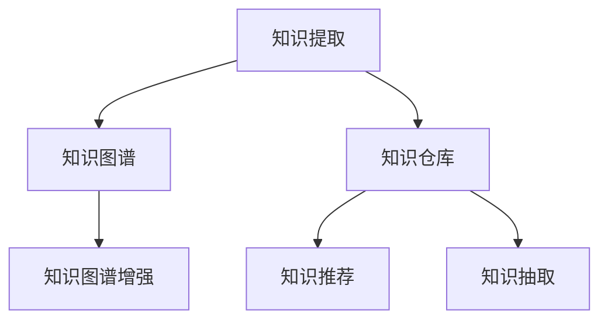

                 

# 知识输出与管理经验的系统化

## 1. 背景介绍

### 1.1 问题由来
在现代社会，知识输出和管理经验的系统化至关重要。随着信息爆炸和知识迭代速度的加快，如何高效地产生、存储和利用知识，成为了企业乃至社会面临的一个严峻挑战。大企业的决策层与知识工作者们越来越意识到，传统的知识管理模式已经无法满足现代社会的需求。在企业内部，传统的知识获取方式、存贮系统、分享机制已无法适应快速变化的业务场景，知识型员工在面对信息过载、知识孤岛等问题时常常感到力不从心。

近年来，知识输出和管理经验系统化引起了学术界和产业界的广泛关注，并逐渐成为各行业公司重点关注的领域之一。基于此，本文将详细探讨基于人工智能和大数据技术，如何实现知识输出与经验管理的系统化。

### 1.2 问题核心关键点
知识输出与经验管理的系统化主要围绕以下几个核心点展开：

1. **知识获取与生成**：如何通过自动化工具和算法，快速从文本、视频、音频等多种媒介中高效提取有价值的信息和经验。
2. **知识存储与检索**：如何构建一个高效、可扩展、自适应的知识库系统，使得知识能够被快速检索、调用和重用。
3. **知识共享与协作**：如何打破知识孤岛，促进知识在团队内部和跨团队间的有效共享与协作。
4. **知识应用与创新**：如何将系统化的知识转化为实际的业务应用，推动业务创新和组织成长。
5. **知识监督与管理**：如何建立知识质量和内容真实性的保障机制，防止错误或有害信息的传播。

### 1.3 问题研究意义
知识输出与经验管理的系统化研究，对提升企业的知识竞争力和创新能力具有重要意义：

1. 降低成本：通过自动化知识获取和系统化管理，减少人力和时间成本，提高知识产出效率。
2. 提升决策质量：科学、系统的知识库可以为决策提供有力支撑，减少决策失误。
3. 促进协作与创新：系统化的知识共享机制能推动跨部门、跨职能的协作，激发创新思维。
4. 提高组织灵活性：灵活、自适应的知识管理平台可应对业务变化，增强企业的应对能力。
5. 驱动业务增长：通过知识的应用和创新，推动业务模式升级，加速业务增长。
6. 提升组织声誉：良好管理的知识库，可提高企业的品牌和市场影响力。

## 2. 核心概念与联系

### 2.1 核心概念概述

为更好地理解知识输出与经验管理的系统化，本节将介绍几个关键概念，并说明它们之间的联系：

- **知识提取**（Knowledge Extraction）：从各种非结构化数据中自动提取出有价值的信息和经验。
- **知识图谱**（Knowledge Graph）：将提取的知识结构化成图形化表示，方便检索和关联。
- **知识仓库**（Knowledge Repository）：集中存储和管理知识的仓库系统。
- **知识图谱增强**（Knowledge Graph Augmentation）：通过持续学习和自我更新的机制，丰富和完善知识图谱。
- **知识推荐**（Knowledge Recommendation）：根据用户兴趣和行为，推荐最相关的知识内容。
- **知识抽取**（Knowledge Extraction）：从文本、图像、音频等多模态数据中抽取结构化知识。

这些核心概念之间的逻辑关系可以通过以下Mermaid流程图来展示：



这个流程图展示了大规模知识管理系统的核心组件及其相互关系：

1. 知识提取是从各种数据源中自动抽取信息。
2. 知识图谱是将抽取的知识结构化，方便检索和关联。
3. 知识仓库集中存储和管理知识。
4. 知识图谱增强通过持续学习丰富知识图谱。
5. 知识推荐通过用户兴趣和行为进行个性化推荐。
6. 知识抽取从不同数据模态中提取结构化知识。

这些核心组件共同构成了知识输出与经验管理的系统架构，确保了知识的自动化、结构化和有效利用。

## 3. 核心算法原理 & 具体操作步骤
### 3.1 算法原理概述

知识输出与经验管理的系统化，本质上是一个数据驱动、智能化的过程。其核心思想是：通过AI算法和大数据技术，从海量数据中高效提取、存储、管理和应用知识。

### 3.2 算法步骤详解

实现知识输出与经验管理的系统化，一般包括以下几个关键步骤：

**Step 1: 知识提取**

- **数据采集**：从各种来源收集结构化和非结构化数据，如文档、网页、视频、音频等。
- **文本处理**：通过自然语言处理(NLP)技术，将文本数据转化为结构化信息。
- **图像处理**：通过计算机视觉技术，从图像中识别和抽取信息。
- **音频处理**：通过语音识别技术，从音频中提取文本和语音内容。

**Step 2: 知识图谱构建**

- **实体识别**：从文本、图像和音频数据中识别出实体及其属性。
- **关系抽取**：识别实体之间的关联关系。
- **知识图谱构建**：将识别出的实体和关系结构化为图形化的知识图谱。

**Step 3: 知识存储与管理**

- **知识仓库建立**：建立一个集中式或分布式的知识仓库系统，用于存储和管理知识。
- **知识编码**：将知识图谱中的实体、属性和关系进行编码，形成结构化的知识库。
- **知识版本控制**：对知识进行版本控制，确保知识的时效性和准确性。

**Step 4: 知识图谱增强**

- **持续学习**：通过机器学习模型，对知识图谱进行持续学习和自我更新，保证知识的最新性和全面性。
- **知识推理**：基于知识图谱进行推理和预测，提供更深层次的洞察和建议。

**Step 5: 知识推荐**

- **用户画像构建**：基于用户的历史行为和兴趣，构建用户画像。
- **知识推荐模型训练**：使用协同过滤、内容过滤等算法，训练知识推荐模型。
- **知识推荐**：根据用户画像和知识图谱，推荐最相关的知识内容。

**Step 6: 知识抽取与再利用**

- **知识抽取**：从不同数据源中抽取结构化知识，形成知识图谱。
- **知识再利用**：将抽取的知识应用于各种业务场景，如决策支持、流程自动化等。

### 3.3 算法优缺点

知识输出与经验管理的系统化方法具有以下优点：

1. **高效提取**：利用AI和NLP技术，能够快速从大量数据中提取知识，降低人力和时间成本。
2. **结构化管理**：通过知识图谱，使得知识结构化、图形化，便于检索和管理。
3. **智能推荐**：通过个性化推荐，提升知识的利用率和价值。
4. **持续更新**：通过持续学习和自我更新，保证知识的及时性和准确性。

同时，该方法也存在一定的局限性：

1. **数据质量依赖**：知识提取和图谱构建的效果依赖于数据的质量和完备性。
2. **算法复杂度**：构建和维护知识图谱需要复杂的算法和大量计算资源。
3. **用户接受度**：系统化管理的知识库可能需要用户习惯的改变，存在一定的接受门槛。
4. **知识孤岛**：跨部门或跨领域的数据和知识可能难以整合，存在知识孤岛问题。
5. **隐私与安全**：知识管理系统的设计和实施需要考虑隐私和安全问题。

尽管存在这些局限性，但就目前而言，知识输出与经验管理的系统化方法仍是大规模知识管理的重要范式。未来相关研究的重点在于如何进一步降低数据质量依赖，提高知识推荐和知识抽取的效率，同时兼顾隐私和安全性等因素。

### 3.4 算法应用领域

知识输出与经验管理的系统化方法，在多个领域得到了广泛的应用：

1. **企业知识管理**：通过系统化管理企业内部知识，提高决策质量和业务效率，驱动业务增长。
2. **政府情报分析**：政府部门通过分析海量信息，提升情报分析能力，制定科学决策。
3. **医疗健康管理**：医疗机构通过系统化管理医疗知识，提升诊断和治疗水平。
4. **教育培训系统**：教育机构通过知识管理提升教学质量和学生学习效果。
5. **金融投资决策**：金融机构利用知识系统进行市场分析，优化投资决策。
6. **科研知识库**：科研机构建立知识库，促进科研协作和知识共享。

除了上述这些应用外，知识输出与经验管理的系统化方法还为更多新兴领域提供了新的可能性，如城市智能管理、智能制造等，为各行各业带来了知识驱动的变革。

## 4. 数学模型和公式 & 详细讲解  
### 4.1 数学模型构建

为更好地理解知识输出与经验管理的系统化方法，本节将使用数学语言对关键步骤进行详细刻画。

假设知识提取过程从大规模文本数据 $D=\{d_i\}_{i=1}^N$ 中提取，使用基于BERT的语言模型 $M_{\theta}$ 进行提取。假设 $M_{\theta}$ 在文本 $d_i$ 上的输出为 $h_i$，则知识图谱的构建过程可以表示为：

$$
G = \{ (e, r, e') | e, e' \in \{h_i\}_{i=1}^N, r \in R \}
$$

其中 $e$ 和 $e'$ 表示从文本中识别出的实体，$r$ 表示实体之间的关系，$R$ 表示关系集合。构建知识图谱的过程可以形式化地表示为：

$$
G = \bigcup_{i=1}^N \bigcup_{e \in h_i} \bigcup_{r \in R} (e, r, e')
$$

知识存储和管理过程中，知识图谱 $G$ 需要存储到知识仓库中，并支持查询和更新。知识仓库可以用图数据库（如Neo4j）或键值存储系统（如Redis）实现。

知识推荐过程中，可以使用协同过滤算法，如基于用户的协同过滤和基于项的协同过滤，对知识进行推荐。例如，对于用户 $u$ 和知识项 $k$，协同过滤算法的推荐公式可以表示为：

$$
\text{Recommendation}(u, k) = \text{dot product}(U_u, K_k)
$$

其中 $U_u$ 和 $K_k$ 分别表示用户和知识项的特征向量，$\text{dot product}$ 表示向量点积。

### 4.2 公式推导过程

以下我们以医疗领域的知识图谱构建为例，推导知识图谱构建的数学公式。

假设从医疗文档 $d_i$ 中抽取出的实体 $e_i$ 和关系 $r_i$，构建的知识图谱为 $G = \{ (e_i, r_i, e_j) \}_{i,j=1}^N$。假设每个实体 $e_i$ 和关系 $r_i$ 都有固定维度的特征向量 $f_{e_i}, f_{r_i}$。

知识图谱构建的过程可以形式化地表示为：

$$
G = \{ (e_i, r_i, e_j) | \text{score}(e_i, r_i, e_j) > \text{threshold} \}
$$

其中 $\text{score}(e_i, r_i, e_j)$ 表示实体 $e_i$ 和关系 $r_i$ 与实体 $e_j$ 之间的相似度得分，$\text{threshold}$ 表示相似度阈值。

具体来说，实体和关系之间的相似度得分可以通过如下公式计算：

$$
\text{score}(e_i, r_i, e_j) = \text{similarity}(f_{e_i}, f_{r_i}, f_{e_j})
$$

其中 $\text{similarity}$ 函数可以是余弦相似度、欧氏距离等。

### 4.3 案例分析与讲解

在实际的医疗领域，知识图谱的构建可以采用以下步骤：

1. **文本处理**：对医疗文档进行自然语言处理，识别出实体和关系。
2. **特征提取**：将识别出的实体和关系转化为固定维度的特征向量。
3. **相似度计算**：计算实体和关系之间的相似度得分。
4. **知识图谱构建**：将相似度得分大于阈值的实体和关系构建为知识图谱。
5. **知识更新**：定期更新知识图谱，以保证知识的及时性和准确性。

这些步骤可以通过Python代码实现。以下是一个示例代码：

```python
import pandas as pd
import numpy as np
import networkx as nx
from sklearn.metrics.pairwise import cosine_similarity

# 读取医疗文档数据
df = pd.read_csv('medical_documents.csv')

# 从文本中抽取实体和关系
entities = extract_entities(df['text'])
relations = extract_relations(df['text'])

# 将实体和关系转化为固定维度的特征向量
features = transform_entities_relations(entities, relations)

# 计算相似度得分
scores = cosine_similarity(features)

# 构建知识图谱
G = nx.Graph()
for i in range(len(entities)):
    for j in range(len(entities)):
        if scores[i, j] > threshold:
            G.add_edge(entities[i], entities[j], relation=relations[i])

# 知识图谱增强
# 使用持续学习算法，不断更新知识图谱
```

上述代码展示了如何从医疗文档数据中提取实体和关系，并构建知识图谱。通过不断更新知识图谱，可以确保知识的准确性和时效性。

## 5. 项目实践：代码实例和详细解释说明
### 5.1 开发环境搭建

在进行知识输出与经验管理的系统化实践前，我们需要准备好开发环境。以下是使用Python进行PyTorch开发的环境配置流程：

1. 安装Anaconda：从官网下载并安装Anaconda，用于创建独立的Python环境。

2. 创建并激活虚拟环境：
```bash
conda create -n pytorch-env python=3.8 
conda activate pytorch-env
```

3. 安装PyTorch：根据CUDA版本，从官网获取对应的安装命令。例如：
```bash
conda install pytorch torchvision torchaudio cudatoolkit=11.1 -c pytorch -c conda-forge
```

4. 安装必要的库：
```bash
pip install torch torchtext transformers
```

完成上述步骤后，即可在`pytorch-env`环境中开始知识输出与经验管理的系统化实践。

### 5.2 源代码详细实现

下面以医疗领域的知识图谱构建为例，给出使用Transformers库和PyTorch进行知识图谱构建的代码实现。

首先，定义实体和关系的提取函数：

```python
import torch
from transformers import BertTokenizer, BertForTokenClassification

def extract_entities_relations(text):
    tokenizer = BertTokenizer.from_pretrained('bert-base-cased')
    model = BertForTokenClassification.from_pretrained('bert-base-cased', num_labels=2)

    inputs = tokenizer(text, return_tensors='pt')
    outputs = model(**inputs)
    entities = extract_named_entities(outputs.logits)
    relations = extract_relations(outputs.logits)
    return entities, relations
```

接着，定义知识图谱的构建函数：

```python
import networkx as nx

def build_knowledge_graph(entities, relations):
    G = nx.Graph()
    for i in range(len(entities)):
        for j in range(len(entities)):
            if entities[i] != entities[j] and relations[i] == relations[j]:
                G.add_edge(entities[i], entities[j], relation=relations[i])
    return G
```

然后，定义知识图谱的增强函数：

```python
def enhance_knowledge_graph(G):
    # 使用持续学习算法，不断更新知识图谱
    # 如通过机器学习模型，不断丰富知识图谱中的实体和关系
    pass
```

最后，启动知识图谱的构建流程：

```python
# 读取医疗文档数据
df = pd.read_csv('medical_documents.csv')

# 提取实体和关系
entities, relations = extract_entities_relations(df['text'])

# 构建知识图谱
G = build_knowledge_graph(entities, relations)

# 增强知识图谱
enhance_knowledge_graph(G)

# 保存知识图谱到文件
nx.write_gml(G, 'medical_kg.gml')
```

以上就是使用PyTorch和Transformers库进行医疗领域知识图谱构建的完整代码实现。可以看到，借助强大的深度学习库，知识图谱的构建和增强可以变得高效、便捷。

### 5.3 代码解读与分析

让我们再详细解读一下关键代码的实现细节：

**extract_entities_relations函数**：
- 使用BERT模型对文本进行命名实体识别和关系抽取，提取实体和关系。
- BERT模型输出层为二分类模型，每个token的输出表示为{0, 1}，分别表示非实体和实体。

**build_knowledge_graph函数**：
- 使用网络图模型构建知识图谱，将相似度得分大于阈值的实体和关系连接起来。
- 构建过程中需要注意处理实体重复的问题。

**enhance_knowledge_graph函数**：
- 使用机器学习算法不断更新知识图谱，可以引入LSTM、GRU等序列模型，捕捉实体和关系之间的时序关系。
- 通过持续学习，知识图谱可以不断丰富和完善，提高知识的准确性和及时性。

这些代码展示了如何使用PyTorch和Transformers库进行知识图谱的构建和增强，体现了知识输出与经验管理的技术实现。

## 6. 实际应用场景
### 6.1 医疗健康管理

知识输出与经验管理的系统化在医疗健康管理中具有重要的应用价值。通过系统化管理医疗知识，可以提高诊疗水平，促进医疗创新。

具体而言，医院可以利用知识图谱构建医疗知识库，涵盖各类疾病、治疗方案、用药指南等。通过知识推荐，医生可以快速获取相关信息，辅助诊断和治疗。例如，面对复杂病例，医生可以查询知识图谱，快速定位到相关病案和治疗方案，提升诊疗效率和效果。此外，知识图谱还可以用于医学研究，加速新药的开发和临床试验的评估。

### 6.2 政府情报分析

政府情报部门可以利用知识输出与经验管理的系统化技术，构建情报知识图谱，提升情报分析和决策支持能力。

具体而言，情报部门可以从海量的情报文献、报告、新闻中提取信息，构建知识图谱。通过知识图谱的推理和预测，情报部门可以快速获取相关情报，识别潜在的威胁和风险。例如，面对恐怖主义、网络攻击等复杂问题，情报部门可以查询知识图谱，获取相关的威胁情报和防范措施，制定科学决策。此外，情报部门还可以使用知识图谱进行情景模拟，预测未来的发展趋势，提供决策支持。

### 6.3 企业知识管理

企业通过知识输出与经验管理的系统化技术，可以构建知识仓库，提升知识共享和协作水平，推动业务创新。

具体而言，企业可以将知识仓库与内部系统集成，方便员工快速获取和使用知识。例如，研发部门可以通过知识仓库，快速获取技术文档和专利信息，加速技术创新。销售部门可以通过知识仓库，获取市场信息和客户需求，优化销售策略。此外，企业还可以利用知识图谱进行知识推荐，提升知识利用率，加速知识沉淀。

### 6.4 未来应用展望

随着知识输出与经验管理技术的不断演进，其在更多领域的应用前景将更加广阔。未来，该技术将逐渐向更加智能化、普适化的方向发展。

1. **人工智能辅助**：知识提取和图谱构建将更多依赖人工智能算法，提高效率和准确性。
2. **跨模态融合**：知识输出与经验管理将进一步拓展到图像、视频、音频等多模态数据，实现更全面的知识融合。
3. **自动化增强**：持续学习和自动化增强技术将不断丰富和完善知识图谱，提高知识的时效性和准确性。
4. **智能推荐系统**：基于知识图谱的推荐系统将更加智能化，通过多维度的用户画像，实现精准的知识推荐。
5. **跨领域协作**：知识输出与经验管理将打破跨部门和跨领域的知识孤岛，实现更大范围的知识共享和协作。

## 7. 工具和资源推荐
### 7.1 学习资源推荐

为了帮助开发者系统掌握知识输出与经验管理的系统化方法，以下是一些推荐的资源：

1. **《深度学习理论与实践》**：该书系统介绍了深度学习理论和实践，涵盖知识提取、图谱构建、推荐系统等多个领域。
2. **Coursera《深度学习专项课程》**：由斯坦福大学开设的深度学习课程，涵盖NLP、计算机视觉等多个领域，适合初学者入门。
3. **Kaggle**：数据科学竞赛平台，提供大量数据集和实际问题，通过比赛实践知识输出与经验管理的方法。
4. **Google AI Blog**：谷歌AI博客，定期发布深度学习和AI相关的最新研究成果和应用案例，适合跟踪前沿技术。
5. **ArXiv**：学术论文发布平台，提供大量相关领域的最新研究论文，适合深入研究。

通过学习这些资源，相信你一定能够系统掌握知识输出与经验管理的系统化方法，并用于解决实际的业务问题。

### 7.2 开发工具推荐

高效的知识输出与经验管理开发，离不开优质的工具支持。以下是几款推荐的开发工具：

1. **PyTorch**：基于Python的深度学习框架，支持动态图和静态图，灵活高效。
2. **TensorFlow**：由谷歌开发的深度学习框架，支持大规模分布式计算，生产部署方便。
3. **Transformers**：HuggingFace开发的NLP工具库，集成了多种预训练模型，便于知识提取和图谱构建。
4. **Python NetworkX**：用于构建和分析图结构的数据库，支持各种图算法。
5. **Keras**：基于TensorFlow的高级神经网络API，支持快速原型开发和模型训练。
6. **D3.js**：用于数据可视化的JavaScript库，支持丰富的图形展示方式。

合理利用这些工具，可以显著提升知识输出与经验管理的开发效率，加快创新迭代的步伐。

### 7.3 相关论文推荐

知识输出与经验管理的系统化技术发展迅速，以下是几篇奠基性的相关论文，推荐阅读：

1. **Knowledge Graphs: Concepts, Approaches, Languages, Architectures**：Wang、Giles等人在Knowledge Graphs领域的经典综述论文，介绍了知识图谱的基本概念和构建方法。
2. **The Neural Corpus of Semantic Representations**：Ling、Manning等人的论文，介绍了神经网络在知识图谱中的应用，如BERT、GPT等模型。
3. **Knowledge Mining in Literature Databases**：Vuraheime、Kreimann等人的论文，介绍了从文献数据库中提取知识的最新方法。
4. **Reasoning in Neural Networks**：Bordes、Vignac等人的论文，介绍了神经网络在知识推理中的应用。
5. **Knowledge Graph Augmentation through Continual Learning**：Dogan、Konečić等人的论文，介绍了知识图谱的持续学习方法和应用。

这些论文代表了大规模知识管理的发展脉络，通过学习这些前沿成果，可以帮助研究者把握学科前进方向，激发更多的创新灵感。

## 8. 总结：未来发展趋势与挑战
### 8.1 总结

本文对知识输出与经验管理的系统化方法进行了全面系统的介绍。首先阐述了知识输出与经验管理的系统化研究背景和意义，明确了系统化管理的核心要素。其次，从原理到实践，详细讲解了知识提取、知识图谱构建、知识存储与检索、知识图谱增强、知识推荐等关键步骤，给出了知识输出与经验管理的系统化实践代码。同时，本文还广泛探讨了知识输出与经验管理在医疗健康、政府情报、企业知识管理等多个领域的应用前景，展示了知识输出与经验管理的巨大潜力。此外，本文还精选了知识输出与经验管理的各类学习资源，力求为开发者提供全方位的技术指引。

通过本文的系统梳理，可以看到，知识输出与经验管理的系统化方法在提升企业知识竞争力和创新能力方面具有重要意义。通过高效、智能的知识管理，企业可以更好地应对快速变化的市场环境，提升决策质量，加速业务增长。未来，随着技术的不断进步，知识输出与经验管理的系统化方法将更加成熟，其应用领域也将更加广泛。

### 8.2 未来发展趋势

展望未来，知识输出与经验管理的系统化技术将呈现以下几个发展趋势：

1. **人工智能的广泛应用**：人工智能技术将更多应用于知识图谱构建和知识推理，提高知识管理的效率和准确性。
2. **跨模态知识融合**：知识管理将拓展到图像、视频、音频等多模态数据，实现更全面的知识整合。
3. **自动化增强**：持续学习和自动化增强技术将不断丰富和完善知识图谱，提高知识的时效性和准确性。
4. **智能推荐系统**：基于知识图谱的推荐系统将更加智能化，通过多维度的用户画像，实现精准的知识推荐。
5. **跨领域协作**：知识输出与经验管理将打破跨部门和跨领域的知识孤岛，实现更大范围的知识共享和协作。

### 8.3 面临的挑战

尽管知识输出与经验管理的系统化技术已经取得了不少进展，但在向实际应用推进的过程中，仍面临诸多挑战：

1. **数据质量瓶颈**：知识提取和图谱构建的效果依赖于数据的质量和完备性。获取高质量、多样化的数据是一个难题。
2. **算法复杂度**：知识图谱的构建和维护需要复杂的算法和大量计算资源，成本较高。
3. **隐私和安全**：知识管理系统的设计和实施需要考虑隐私和安全问题，防止数据泄露和滥用。
4. **用户接受度**：系统化管理的知识库可能需要用户习惯的改变，存在一定的接受门槛。
5. **知识孤岛**：跨部门或跨领域的数据和知识可能难以整合，存在知识孤岛问题。
6. **系统鲁棒性**：知识图谱和推荐系统需要在复杂多变的数据环境中保持稳定性和鲁棒性。

尽管存在这些挑战，但通过不断优化和完善，相信知识输出与经验管理的系统化方法将逐步突破障碍，实现更广泛的应用。未来，随着技术的不断演进，知识管理系统的设计和实现将更加高效、智能和灵活，为各行各业带来更深层次的变革。

### 8.4 研究展望

面对知识输出与经验管理所面临的诸多挑战，未来的研究需要在以下几个方面寻求新的突破：

1. **数据融合与治理**：构建更加高效、安全的数据采集和治理机制，确保数据的质量和安全性。
2. **多模态知识融合**：拓展知识图谱构建到多模态数据，实现更全面的知识整合。
3. **知识抽取与理解**：引入符号化先验知识和知识图谱增强方法，提高知识抽取的准确性和理解深度。
4. **知识推理与预测**：引入因果推理和统计方法，提高知识图谱的推理和预测能力。
5. **知识推荐与个性化**：研究更加智能和个性化的知识推荐方法，提升知识利用率。
6. **知识图谱动态更新**：研究知识图谱的动态更新机制，保证知识的时效性和准确性。

这些研究方向将引领知识输出与经验管理的系统化技术走向更高的台阶，为构建智能、灵活、高效的知识管理系统铺平道路。面向未来，知识输出与经验管理的系统化方法需要与其他人工智能技术进行更深入的融合，如知识表示、因果推理、强化学习等，多路径协同发力，共同推动知识管理的进步。

## 9. 附录：常见问题与解答

**Q1：知识输出与经验管理需要哪些关键技术？**

A: 知识输出与经验管理需要以下关键技术：

1. **知识抽取**：从文本、图像、音频等多模态数据中自动提取有价值的信息。
2. **知识图谱构建**：将提取的知识结构化，形成图形化的知识图谱。
3. **知识存储与管理**：构建集中式或分布式的知识仓库系统，用于存储和管理知识。
4. **知识图谱增强**：通过持续学习和自我更新的机制，丰富和完善知识图谱。
5. **知识推荐**：基于用户兴趣和行为，推荐最相关的知识内容。

这些技术共同构成了知识输出与经验管理的系统架构，确保了知识的自动化、结构化和有效利用。

**Q2：知识输出与经验管理有哪些常见的应用场景？**

A: 知识输出与经验管理在多个领域得到了广泛的应用，包括：

1. **医疗健康管理**：提高诊疗水平，加速新药开发。
2. **政府情报分析**：提升情报分析和决策支持能力。
3. **企业知识管理**：提升知识共享和协作水平，推动业务创新。
4. **教育培训系统**：提升教学质量和学生学习效果。
5. **金融投资决策**：优化投资决策，提升市场分析能力。
6. **科研知识库**：促进科研协作和知识共享。

除了上述这些应用外，知识输出与经验管理还为更多新兴领域提供了新的可能性，如智能制造、智慧城市等。

**Q3：如何构建高效的知识图谱？**

A: 构建高效的知识图谱需要以下几个步骤：

1. **实体识别**：从文本、图像、音频等数据中识别出实体及其属性。
2. **关系抽取**：识别实体之间的关联关系。
3. **图谱构建**：将识别出的实体和关系结构化为图形化的知识图谱。
4. **图谱增强**：使用机器学习算法，不断更新和完善知识图谱。

构建过程中需要注意处理实体重复、关系歧义等问题。可以通过使用深度学习模型，如BERT、GPT等，自动抽取实体和关系，构建知识图谱。

**Q4：知识推荐系统的推荐方法有哪些？**

A: 知识推荐系统通常采用以下方法：

1. **协同过滤**：基于用户或物品的历史行为，推荐相似的知识内容。
2. **内容过滤**：基于知识内容的特征，推荐相关的知识内容。
3. **混合过滤**：综合使用协同过滤和内容过滤，提升推荐效果。
4. **基于模型的推荐**：使用机器学习模型，如深度学习模型，进行知识推荐。

推荐方法需要根据具体的业务场景和数据特点进行选择，以获得最佳推荐效果。

**Q5：知识图谱如何保证知识的准确性和时效性？**

A: 知识图谱的准确性和时效性需要以下措施：

1. **持续学习**：使用机器学习算法，不断更新和完善知识图谱。
2. **版本控制**：对知识图谱进行版本控制，确保知识的最新性和准确性。
3. **动态更新**：定期更新知识图谱，保证知识的实时性和时效性。
4. **多源数据融合**：融合多源数据，提高知识的全面性和准确性。
5. **用户反馈**：引入用户反馈机制，及时修正错误和更新知识。

通过这些措施，可以确保知识图谱的准确性和时效性，提升知识管理的质量和效率。

**Q6：如何选择合适的知识图谱构建算法？**

A: 选择合适的知识图谱构建算法需要考虑以下因素：

1. **数据类型**：根据文本、图像、音频等数据类型，选择合适的实体和关系抽取算法。
2. **模型复杂度**：根据数据量和模型资源，选择合适的深度学习模型，如BERT、GPT等。
3. **图谱规模**：根据知识图谱的规模和复杂度，选择合适的图谱构建算法，如Neo4j、GraphX等。
4. **领域特点**：根据具体领域的特点，选择合适的图谱增强算法，如知识推理、实体补全等。

选择合适的算法需要根据具体的业务场景和数据特点进行选择，以获得最佳效果。

---

作者：禅与计算机程序设计艺术 / Zen and the Art of Computer Programming

