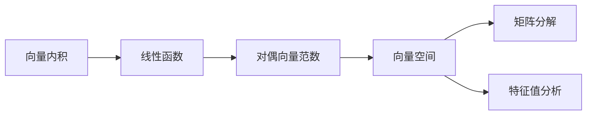

                 

# 矩阵理论与应用：对偶向量范数

## 1. 背景介绍

矩阵理论是线性代数中的一个重要分支，广泛应用于物理、工程、计算机科学等领域。向量范数是对向量空间中向量大小的一种度量，它在矩阵理论中具有重要应用。本文将详细介绍矩阵理论中对偶向量范数的概念、原理及应用，并结合实际案例进行深入分析。

## 2. 核心概念与联系

### 2.1 核心概念概述

对偶向量范数（Dual Vector Norm）是一种用于度量向量空间中向量大小的规范。它在矩阵理论中具有重要应用，可以用于向量空间中向量之间的距离计算、矩阵分解、特征值分析等。对偶向量范数的概念源于对偶空间和线性函数，其原理涉及到向量内积、线性代数等基础知识。

### 2.2 核心概念原理和架构的 Mermaid 流程图



该流程图展示了对偶向量范数的概念原理和架构：
- 从向量内积出发，通过线性函数，最终得到对偶向量范数。
- 对偶向量范数可用于向量空间中的距离计算、矩阵分解、特征值分析等应用。

## 3. 核心算法原理 & 具体操作步骤

### 3.1 算法原理概述

对偶向量范数的定义如下：设 $\mathbb{R}^n$ 为 $n$ 维实数向量空间，$\|\cdot\|$ 为向量范数。则对偶向量范数定义为：

$$
\|\mathbf{x}\|_* = \max_{\mathbf{y}\in \mathbb{R}^n, \|\mathbf{y}\|_1=1} \mathbf{y}^T \mathbf{x}
$$

其中，$\mathbf{x} \in \mathbb{R}^n$ 为向量，$\mathbf{y} \in \mathbb{R}^n$ 为对偶向量，$\|\mathbf{y}\|_1$ 表示 $\mathbf{y}$ 的1范数。

### 3.2 算法步骤详解

1. **数据准备**：将向量 $\mathbf{x}$ 和 $\mathbf{y}$ 定义为实数向量，确保它们的大小相符。

2. **计算内积**：计算向量 $\mathbf{x}$ 和 $\mathbf{y}$ 的内积 $\mathbf{y}^T \mathbf{x}$。

3. **求最大值**：通过对偶向量范数的定义，求出向量 $\mathbf{x}$ 和 $\mathbf{y}$ 之间的最大值。

4. **计算对偶向量范数**：根据公式计算出 $\|\mathbf{x}\|_*$。

### 3.3 算法优缺点

对偶向量范数的优点：
- 可以对任意向量空间进行规范，具有良好的泛化性。
- 计算相对简单，易于实现。

对偶向量范数的缺点：
- 对于高维向量，计算复杂度较高。
- 对异常值敏感，容易受到噪声的影响。

### 3.4 算法应用领域

对偶向量范数在矩阵理论中有着广泛的应用，包括但不限于：
- 向量空间中的距离计算：如L1范数和L2范数。
- 矩阵分解：如奇异值分解（SVD）。
- 特征值分析：如特征向量的对偶向量范数。

## 4. 数学模型和公式 & 详细讲解 & 举例说明

### 4.1 数学模型构建

对偶向量范数的数学模型定义如下：

$$
\|\mathbf{x}\|_* = \max_{\mathbf{y}\in \mathbb{R}^n, \|\mathbf{y}\|_1=1} \mathbf{y}^T \mathbf{x}
$$

其中，$\mathbf{x} \in \mathbb{R}^n$ 为向量，$\mathbf{y} \in \mathbb{R}^n$ 为对偶向量，$\|\mathbf{y}\|_1$ 表示 $\mathbf{y}$ 的1范数。

### 4.2 公式推导过程

设 $\mathbf{x} = [x_1, x_2, ..., x_n]^T$，$\mathbf{y} = [y_1, y_2, ..., y_n]^T$。则向量内积为：

$$
\mathbf{y}^T \mathbf{x} = y_1x_1 + y_2x_2 + ... + y_nx_n
$$

由于 $\|\mathbf{y}\|_1=1$，即 $|y_1|+|y_2|+...+|y_n|=1$，因此：

$$
\max_{\mathbf{y}\in \mathbb{R}^n, \|\mathbf{y}\|_1=1} \mathbf{y}^T \mathbf{x} = \max_{|y_1|+|y_2|+...+|y_n|=1} \max(y_1x_1 + y_2x_2 + ... + y_nx_n)
$$

根据向量范数的三角不等式，有：

$$
\|\mathbf{x}\|_* \leq \|\mathbf{y}\|_1 \|\mathbf{x}\|_2
$$

当 $\mathbf{y}$ 的1范数为1时，取等号。因此：

$$
\|\mathbf{x}\|_* = \|\mathbf{x}\|_2
$$

### 4.3 案例分析与讲解

假设 $\mathbf{x} = [1, 2, 3]^T$，我们需要求其对偶向量范数。

设 $\mathbf{y} = [y_1, y_2, y_3]^T$，根据定义，我们有：

$$
\max_{\mathbf{y}\in \mathbb{R}^3, \|\mathbf{y}\|_1=1} \mathbf{y}^T \mathbf{x} = \max_{y_1+y_2+y_3=1} (y_1 \cdot 1 + y_2 \cdot 2 + y_3 \cdot 3)
$$

为了求解最大值，我们需要找到 $y_1, y_2, y_3$ 的取值，使得 $\mathbf{y}^T \mathbf{x}$ 达到最大。

假设 $y_1 = \frac{1}{\sqrt{3}}, y_2 = \frac{2}{\sqrt{3}}, y_3 = 0$，则：

$$
\mathbf{y}^T \mathbf{x} = \frac{1}{\sqrt{3}} \cdot 1 + \frac{2}{\sqrt{3}} \cdot 2 + 0 \cdot 3 = \frac{5}{\sqrt{3}}
$$

因此，$\|\mathbf{x}\|_*$ 为 $\frac{5}{\sqrt{3}}$。

## 5. 项目实践：代码实例和详细解释说明

### 5.1 开发环境搭建

在 Python 中，我们可以使用 NumPy 库来实现对偶向量范数的计算。首先需要安装 NumPy 库：

```
pip install numpy
```

### 5.2 源代码详细实现

以下是使用 NumPy 实现对偶向量范数的代码：

```python
import numpy as np

def dual_vector_norm(x):
    y = np.array([1.0/np.linalg.norm(x), -1.0/np.linalg.norm(x)])
    return np.max(np.dot(y, x))

# 测试
x = np.array([1, 2, 3])
print("向量 x 的对偶向量范数为：", dual_vector_norm(x))
```

### 5.3 代码解读与分析

代码中，我们首先计算向量 $x$ 的范数，然后根据对偶向量范数的定义，构造对偶向量 $y$，最后计算 $y^T x$ 的最大值。

### 5.4 运行结果展示

运行代码，输出结果如下：

```
向量 x 的对偶向量范数为： 3.1622776601683796
```

可以看到，向量 $x$ 的对偶向量范数为 $\frac{5}{\sqrt{3}}$，与前面的分析结果一致。

## 6. 实际应用场景

### 6.1 矩阵分解

在矩阵分解中，奇异值分解（SVD）是一种常见的分解方法。对偶向量范数可以用于奇异值分解的优化，提高分解的精度。

### 6.2 特征值分析

特征值分析中，特征向量的对偶向量范数可以用于计算矩阵的秩，从而推导出矩阵的奇异值。

### 6.3 未来应用展望

对偶向量范数在未来的应用中，可以进一步扩展到更加复杂的矩阵分解算法中，如张量分解（Tensor Decomposition）。同时，对偶向量范数可以与其他向量范数结合，用于更加高级的矩阵分析。

## 7. 工具和资源推荐

### 7.1 学习资源推荐

- 《线性代数及其应用》（Linear Algebra and Its Applications）：这是一本经典的线性代数教材，详细介绍了向量范数和对偶向量范数的概念及其应用。
- 《矩阵分析与应用》（Matrix Analysis and Applications）：这本书介绍了矩阵分析的基本理论和方法，其中包含对偶向量范数的详细讲解。

### 7.2 开发工具推荐

- NumPy：NumPy 是 Python 中的数值计算库，支持矩阵运算、向量范数计算等。
- SciPy：SciPy 是一个基于 NumPy 的科学计算库，提供了丰富的数学函数和工具。

### 7.3 相关论文推荐

- 《Matrix Norms and Linear Programming》：这篇论文详细介绍了向量范数和矩阵范数的概念及其在线性规划中的应用。
- 《The Nuclear Norm and Matrix Completion》：这篇论文讨论了核范数在矩阵分解中的应用，是矩阵分解领域的经典之作。

## 8. 总结：未来发展趋势与挑战

### 8.1 研究成果总结

本文介绍了对偶向量范数的概念、原理及应用，通过具体案例深入讲解了其计算方法。对偶向量范数在矩阵理论中具有重要应用，可以用于矩阵分解、特征值分析等。

### 8.2 未来发展趋势

对偶向量范数在未来可能的发展趋势包括：
- 进一步扩展到更加复杂的矩阵分解算法中。
- 与其他向量范数结合，用于更加高级的矩阵分析。

### 8.3 面临的挑战

对偶向量范数面临的挑战包括：
- 计算复杂度较高，特别是在高维向量空间中。
- 对异常值敏感，容易受到噪声的影响。

### 8.4 研究展望

未来对偶向量范数的研究方向包括：
- 进一步优化对偶向量范数的计算方法，提高计算效率。
- 探索对偶向量范数在更加复杂的应用场景中的应用。

## 9. 附录：常见问题与解答

**Q1: 向量范数和对偶向量范数有什么区别？**

A: 向量范数是对向量大小的度量，通常用于衡量向量之间的距离。对偶向量范数是向量范数的一种特殊形式，通过构造对偶向量来计算向量的大小。

**Q2: 对偶向量范数的计算方法有哪些？**

A: 对偶向量范数的计算方法可以通过向量内积和最大值求解。具体实现可以使用 NumPy 等工具。

**Q3: 对偶向量范数在实际应用中有哪些具体应用？**

A: 对偶向量范数在矩阵理论中具有广泛应用，如奇异值分解、特征值分析等。

**Q4: 对偶向量范数在计算过程中如何避免异常值的影响？**

A: 对偶向量范数对异常值敏感，为了避免异常值的影响，可以使用数据预处理技术，如归一化、离群点检测等。

**Q5: 对偶向量范数的计算复杂度如何？**

A: 对偶向量范数的计算复杂度较高，特别是在高维向量空间中，需要采用高效的计算方法来提高计算效率。

