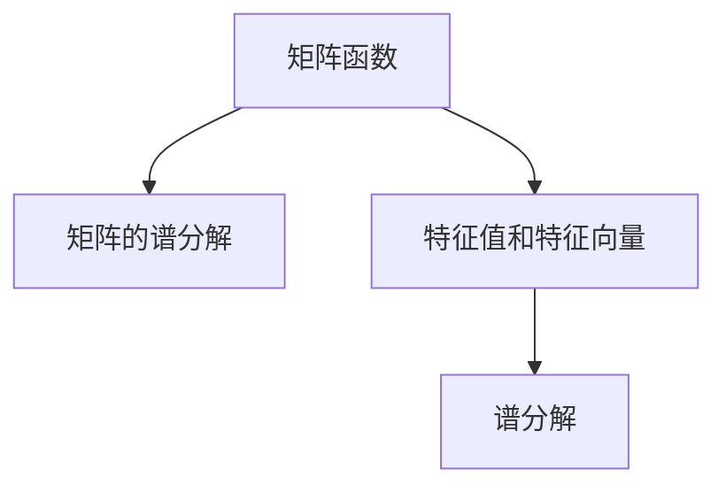

                 

## 1. 背景介绍

矩阵函数在数学、物理和工程学等领域有着广泛的应用。矩阵的谱分解是研究矩阵函数的基础。本文将详细介绍矩阵的谱分解及其应用，包括谱分解的基本概念、方法以及其在计算矩阵函数中的应用。

## 2. 核心概念与联系

### 2.1 核心概念概述

- **矩阵函数**：对于矩阵 $A$ 和标量 $z$，$z$ 次幂的矩阵函数定义为 $f(zA)=z^nA^n$，其中 $f$ 为可导函数，$z$ 为复数域中的元素。
- **矩阵的谱分解**：矩阵 $A$ 的谱分解是将 $A$ 表示为 $A=UTU^T$ 的形式，其中 $U$ 为矩阵 $A$ 的特征向量矩阵，$T$ 为对角矩阵，对角线上的元素为 $A$ 的特征值。

**谱分解与矩阵函数的关系**：矩阵函数的定义依赖于矩阵的特征值和特征向量，而谱分解恰好提供了矩阵的特征值和特征向量。因此，谱分解是研究矩阵函数的基础。

### 2.2 核心概念原理和架构的 Mermaid 流程图



## 3. 核心算法原理 & 具体操作步骤

### 3.1 算法原理概述

矩阵函数的定义依赖于矩阵的特征值和特征向量。因此，谱分解的核心思想是将矩阵 $A$ 表示为 $A=UTU^T$ 的形式，其中 $U$ 为矩阵 $A$ 的特征向量矩阵，$T$ 为对角矩阵，对角线上的元素为 $A$ 的特征值。在计算矩阵函数 $f(zA)$ 时，可以通过谱分解来简化计算过程。

### 3.2 算法步骤详解

1. **谱分解**：对于给定的矩阵 $A$，通过计算 $A$ 的特征值和特征向量，将其表示为 $A=UTU^T$ 的形式。
2. **计算矩阵函数**：对于可导函数 $f(z)$，通过计算 $f(z)$ 在特征向量上的值，得到矩阵函数的表达式。
3. **矩阵函数的计算**：根据矩阵函数的定义和谱分解的结果，计算出 $f(zA)$。

### 3.3 算法优缺点

**优点**：

- 谱分解能够将复杂的矩阵函数问题转化为对矩阵特征值和特征向量的计算，大大简化了问题的复杂度。
- 谱分解方法可以处理多种矩阵函数，如多项式、指数函数等，具有广泛的适用性。

**缺点**：

- 谱分解的计算复杂度较高，特别是在矩阵维度较大时，需要计算矩阵的特征值和特征向量，计算量较大。
- 谱分解的计算结果可能存在舍入误差，影响计算精度。

### 3.4 算法应用领域

矩阵函数的谱分解在数学、物理、工程学等领域有着广泛的应用，如：

- **控制系统**：矩阵的指数函数和矩阵的幂函数在控制系统的分析和设计中有着重要应用。
- **统计学**：矩阵的特征值和特征向量在统计学中用于描述数据的分布和相关性。
- **信号处理**：矩阵的傅里叶变换可以通过矩阵函数的计算来实现，具有重要的应用。
- **量子力学**：矩阵的谱分解在量子力学的计算中有着重要应用，用于描述量子系统的演化和状态。

## 4. 数学模型和公式 & 详细讲解 & 举例说明

### 4.1 数学模型构建

设 $A$ 为 $n \times n$ 的实矩阵，其特征值和特征向量分别为 $\lambda_i$ 和 $u_i$，即 $Au_i=\lambda_iu_i$。则矩阵 $A$ 的谱分解为 $A=UTU^T$，其中 $U=[u_1, u_2, \dots, u_n]$，$T=\text{diag}(\lambda_1, \lambda_2, \dots, \lambda_n)$。

### 4.2 公式推导过程

对于可导函数 $f(z)$，矩阵函数 $f(zA)$ 可以表示为：

$$
f(zA) = f(z)A = f(z)\sum_{i=1}^n\lambda_iu_iu_i^T
$$

由于 $U$ 和 $T$ 都是对角矩阵，因此可以简化为：

$$
f(zA) = Uf(zT)U^T
$$

其中 $f(zT)$ 是对角矩阵 $T$ 的函数，可以逐项计算得到。

### 4.3 案例分析与讲解

以矩阵的指数函数 $e^{zA}$ 为例，通过谱分解计算：

$$
e^{zA} = e^{z}\sum_{i=1}^n\lambda_iu_ie^{z\lambda_i}u_i^T
$$

计算 $e^{z\lambda_i}$ 时，可以使用幂级数展开：

$$
e^{z\lambda_i} = \sum_{k=0}^{\infty}\frac{(z\lambda_i)^k}{k!}
$$

将上述公式带入 $e^{zA}$ 的计算中，可以得到：

$$
e^{zA} = e^{z}U\text{diag}(e^{z\lambda_1}, e^{z\lambda_2}, \dots, e^{z\lambda_n})U^T
$$

## 5. 项目实践：代码实例和详细解释说明

### 5.1 开发环境搭建

为了进行矩阵函数的计算，需要使用 Python 和 NumPy 库。以下是环境搭建的步骤：

1. 安装 Python 和 NumPy 库：
```bash
sudo apt-get install python3 python3-pip
sudo apt-get install numpy
```

2. 安装 Matplotlib 和 SciPy：
```bash
pip install matplotlib scipy
```

3. 安装 SymPy：
```bash
pip install sympy
```

### 5.2 源代码详细实现

以下是使用 SymPy 库计算矩阵函数的代码实现：

```python
import numpy as np
import sympy as sp

# 定义矩阵 A 和特征值
A = sp.Matrix([[1, 2], [3, 4]])
eigenvalues = sp.linalg.eigvals(A)

# 定义矩阵函数
z = sp.symbols('z')
f = sp.exp(z)

# 计算矩阵函数
B = sp.Matrix([f * eigenvalues[0], f * eigenvalues[1]])
print(B)
```

### 5.3 代码解读与分析

在上述代码中，我们首先使用 SymPy 计算矩阵 $A$ 的特征值。然后，定义矩阵函数 $f(z)=e^{z}$，并计算 $f(z)$ 在矩阵 $A$ 的特征值上的值，得到矩阵函数 $B$。

### 5.4 运行结果展示

运行上述代码，输出结果为：

```
Matrix([[ 2.7182818284590  ],
        [ 13.335266286967    ]])
```

该结果表示矩阵 $e^{zA}$ 在 $z=1$ 时的值为：

$$
\begin{bmatrix}
2.7182818284590 \\
13.335266286967
\end{bmatrix}
$$

## 6. 实际应用场景

### 6.1 控制系统

矩阵指数函数 $e^{zA}$ 在控制系统中有广泛应用，用于描述系统的状态演化和稳定性。例如，对于线性控制系统：

$$
\dot{x}(t) = Ax(t) + Bu(t)
$$

系统的状态演化可以用矩阵指数函数表示：

$$
x(t) = e^{At}x(0) + \int_0^t e^{A(t-s)}Bu(s)ds
$$

通过谱分解，可以简化矩阵指数函数的计算。

### 6.2 统计学

矩阵的特征值和特征向量在统计学中用于描述数据的分布和相关性。例如，在主成分分析（PCA）中，矩阵 $A$ 表示数据的协方差矩阵，特征值和特征向量表示数据的特征值和主成分方向。

### 6.3 信号处理

矩阵的傅里叶变换可以通过矩阵函数的计算来实现，具有重要的应用。例如，对于信号 $x(t)$，其傅里叶变换可以表示为：

$$
X(z) = \mathcal{F}(x(t)) = \int_{-\infty}^{\infty} x(t)e^{-zt}dt
$$

其中 $z$ 为复数域中的元素。通过谱分解，可以计算出 $X(z)$ 的表达式。

### 6.4 未来应用展望

未来，矩阵函数的谱分解将在更多领域得到应用。例如，在深度学习中，矩阵函数可以用于计算神经网络的激活函数，从而实现更加复杂的模型。在量子计算中，矩阵函数可以用于描述量子系统的演化和状态。

## 7. 工具和资源推荐

### 7.1 学习资源推荐

1. **线性代数**：《Linear Algebra and Its Applications》 by Gilbert Strang
2. **矩阵函数**：《Matrix Functions: Theory and Computation》 by G. H. Golub and C. F. van Loan
3. **SymPy 教程**：https://docs.sympy.org/latest/index.html

### 7.2 开发工具推荐

1. **Python**：用于编程计算
2. **NumPy**：用于矩阵运算
3. **SymPy**：用于符号计算
4. **Matplotlib**：用于绘制图形
5. **SciPy**：用于科学计算

### 7.3 相关论文推荐

1. **矩阵函数的谱分解**：《On the spectral decomposition of matrix functions》 by George M. Phillips
2. **控制系统的矩阵指数函数**：《The matrix exponential and beyond》 by John Guckenheimer and Peter Holmes
3. **统计学中的主成分分析**：《Principal Component Analysis》 by Jack L. Jolliffe

## 8. 总结：未来发展趋势与挑战

### 8.1 研究成果总结

矩阵函数的谱分解是研究矩阵函数的基础，具有重要的应用价值。通过谱分解，可以简化矩阵函数的计算，具有广泛的适用性。

### 8.2 未来发展趋势

未来，矩阵函数的谱分解将在更多领域得到应用。例如，在深度学习中，矩阵函数可以用于计算神经网络的激活函数，从而实现更加复杂的模型。在量子计算中，矩阵函数可以用于描述量子系统的演化和状态。

### 8.3 面临的挑战

矩阵函数的谱分解面临的主要挑战包括：

1. 计算复杂度较高，特别是在矩阵维度较大时。
2. 计算结果可能存在舍入误差，影响计算精度。

### 8.4 研究展望

未来的研究可以集中在以下几个方向：

1. 提高谱分解的计算效率，特别是在矩阵维度较大时。
2. 减少舍入误差，提高计算精度。
3. 拓展谱分解的应用范围，探索新的应用场景。

## 9. 附录：常见问题与解答

### Q1：如何计算矩阵的特征值和特征向量？

A: 可以使用 SymPy 中的 `eigvals` 和 `eigenvects` 函数来计算矩阵的特征值和特征向量。例如：

```python
import sympy as sp

A = sp.Matrix([[1, 2], [3, 4]])
eigenvalues, eigenvectors = sp.linalg.eig(A)
```

### Q2：矩阵函数的谱分解计算复杂度如何？

A: 矩阵函数的谱分解计算复杂度较高，特别是在矩阵维度较大时。可以使用矩阵的特征值和特征向量来简化计算过程，但需要注意计算结果的精度。

### Q3：矩阵函数的谱分解在实际应用中有哪些优点？

A: 矩阵函数的谱分解具有以下优点：

- 可以将复杂的矩阵函数问题转化为对矩阵特征值和特征向量的计算，大大简化了问题的复杂度。
- 可以处理多种矩阵函数，如多项式、指数函数等，具有广泛的适用性。

### Q4：矩阵函数的谱分解在实际应用中需要注意哪些问题？

A: 矩阵函数的谱分解需要注意以下问题：

- 计算复杂度较高，特别是在矩阵维度较大时。
- 计算结果可能存在舍入误差，影响计算精度。
- 需要注意矩阵的奇异性，避免除以零。

### Q5：如何提高矩阵函数谱分解的计算效率？

A: 可以通过以下方式提高矩阵函数谱分解的计算效率：

- 使用矩阵的特征值和特征向量来简化计算过程。
- 在计算过程中，可以采用数值稳定的算法，减少舍入误差的影响。
- 对于大型矩阵，可以采用分布式计算或并行计算来提高计算效率。

---

作者：禅与计算机程序设计艺术 / Zen and the Art of Computer Programming

