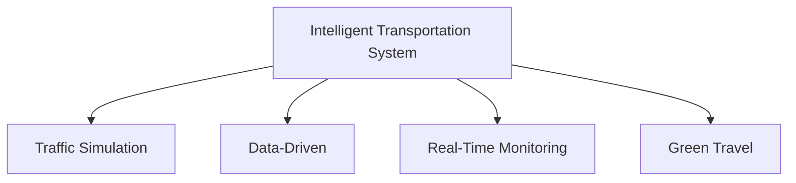

                 

# 硅谷交通拥堵的治理:智能交通系统

> 关键词：交通拥堵,智能交通系统,数据驱动,交通模拟,实时监控,绿色出行

## 1. 背景介绍

### 1.1 问题由来
硅谷，作为全球科技创新与人才汇聚的中心，其繁荣背后的交通基础设施面临巨大挑战。作为全球最具经济活力和创新能力的城市之一，硅谷在过去几十年中，高速发展的同时，也遭遇了严重的交通拥堵问题。交通拥堵不仅增加了居民通勤时间，降低了工作效率，也对城市空气质量、能源消耗、噪音污染等方面造成了不利影响。

### 1.2 问题核心关键点
随着科技的进步，智能交通系统成为解决硅谷交通拥堵问题的关键。智能交通系统通过实时数据分析、交通模拟、交通管理等手段，提高交通系统的运行效率和灵活性，减少拥堵，提高出行体验。

## 2. 核心概念与联系

### 2.1 核心概念概述

为更好地理解硅谷交通拥堵治理的智能交通系统，本节将介绍几个密切相关的核心概念：

- 智能交通系统(ITS)：利用信息技术和通信技术，实现对交通流的实时监控、预测、管理和优化，提升道路利用率，减少交通拥堵。
- 交通模拟：使用仿真软件对交通流进行模拟，评估不同交通策略的实施效果，优化交通方案。
- 数据驱动：通过实时交通数据和历史数据分析，动态调整交通管理策略，提升决策效率。
- 实时监控：利用摄像头、传感器等设备，对道路交通状况进行实时监测，反馈到交通管理中心。
- 绿色出行：鼓励步行、骑行、公交等低碳出行方式，减少机动车依赖，降低环境污染。

这些核心概念之间的逻辑关系可以通过以下Mermaid流程图来展示：



这个流程图展示了许多核心概念之间的关系：

1. 智能交通系统利用交通模拟、数据驱动、实时监控等技术手段，实现交通管理。
2. 交通模拟用于评估策略效果，优化交通方案。
3. 数据驱动通过分析实时和历史数据，动态调整管理策略。
4. 实时监控提供实时交通状态，反馈给交通管理中心。
5. 绿色出行通过提升公共交通、非机动车等出行方式，减少机动车依赖。

## 3. 核心算法原理 & 具体操作步骤
### 3.1 算法原理概述

硅谷交通拥堵的治理，基于智能交通系统的核心算法包括：

- 交通流量预测算法：通过历史数据，预测未来交通流量，提前做出管理决策。
- 动态交通管理算法：实时调整交通信号灯、车道分配等，优化道路利用率。
- 实时交通监控算法：利用摄像头、传感器等设备，实时获取交通状态，供管理中心分析决策。
- 绿色出行优化算法：优化公共交通、自行车道、步行道等，提升绿色出行效率。

这些算法的综合运用，使得硅谷交通管理中心能够实时响应交通状况，及时调整交通管理策略，有效缓解交通拥堵。

### 3.2 算法步骤详解

**Step 1: 数据收集与预处理**

- 从交通摄像头、传感器等设备获取实时交通流量数据。
- 对数据进行清洗、去噪、归一化等预处理步骤，提高数据的准确性和可靠性。
- 利用数据仓库技术，存储和管理交通数据。

**Step 2: 流量预测与分析**

- 使用历史交通数据和外部天气、事件信息，训练流量预测模型。
- 使用统计学、机器学习等方法，分析交通流量变化规律，识别异常情况。
- 根据预测结果，生成交通流量预测报告。

**Step 3: 交通管理与调整**

- 根据交通流量预测结果，生成实时交通管理指令。
- 使用实时通信系统，将管理指令下发到交通信号灯、车道分配系统。
- 通过交通管理中心监控系统，实时跟踪调整效果。

**Step 4: 绿色出行优化**

- 统计公共交通、非机动车使用情况，分析出行模式。
- 优化公共交通路线、班次、站点，提高服务质量。
- 增设自行车道、步行道等绿色出行设施。

### 3.3 算法优缺点

智能交通系统的算法具有以下优点：
1. 提升效率。通过实时监控和动态管理，有效缓解交通拥堵，提高道路利用率。
2. 降低成本。优化交通管理策略，减少不必要的机动车使用，节约能源。
3. 提高安全性。实时监控交通事故和异常情况，及时采取措施，保障道路安全。
4. 环境友好。推广绿色出行方式，减少机动车污染，改善城市环境。

同时，该算法也存在一定的局限性：
1. 依赖设备。实时监控依赖摄像头、传感器等设备，设备安装和维护成本较高。
2. 数据瓶颈。流量预测需要大量数据，数据采集和存储需要耗费大量资源。
3. 策略复杂。实时管理策略需要动态调整，算法设计和实施复杂。
4. 缺乏弹性。策略制定需要考虑众多因素，难以应对突发事件。

尽管存在这些局限性，但就目前而言，基于智能交通系统的算法仍是硅谷交通拥堵治理的重要手段。未来相关研究的重点在于如何进一步降低设备成本，提高数据利用效率，简化策略设计，增加系统的弹性和鲁棒性。

### 3.4 算法应用领域

智能交通系统的算法广泛应用于多个领域，例如：

- 道路交通管理：通过实时监控和动态管理，优化交通信号灯、车道分配等，减少交通拥堵。
- 公共交通优化：统计公共交通使用情况，优化线路、班次、站点，提升服务质量。
- 城市交通规划：分析交通流量和出行模式，优化道路规划和建设。
- 应急交通响应：实时监控突发事件，调整交通管理策略，保障城市安全。
- 环境监测：分析交通排放数据，评估环境影响，提出改善建议。

此外，智能交通系统的算法也被创新性地应用到更多场景中，如交通拥堵收费、智能停车、智慧物流等，为城市交通管理带来新的思路。随着技术的日益成熟，智能交通系统将在更广泛的领域得到应用，提升城市交通管理水平，促进城市的可持续发展。

## 4. 数学模型和公式 & 详细讲解 & 举例说明

### 4.1 数学模型构建

本节将使用数学语言对硅谷交通拥堵治理的智能交通系统算法进行更加严格的刻画。

记交通流量数据为 $D=\{(x_i,t_i)\}_{i=1}^N$，其中 $x_i$ 为位置，$t_i$ 为时间，流量为 $y_i$。假设流量数据服从某种概率分布 $p(y_i|x_i,t_i)$，则交通流量预测模型为：

$$
p(y_i|x_i,t_i) = \frac{f(y_i|x_i,t_i)}{\int f(y|x,t) dy}
$$

其中 $f(y_i|x_i,t_i)$ 为似然函数，$\int f(y|x,t) dy$ 为归一化因子。

### 4.2 公式推导过程

根据贝叶斯公式，流量预测模型可以转化为：

$$
p(y_i|x_i,t_i) = \frac{p(x_i,t_i|y_i) p(y_i)}{p(x_i,t_i)}
$$

其中 $p(x_i,t_i|y_i)$ 为已知交通流量下的位置和时间概率，$p(y_i)$ 为先验概率。

在实际应用中，可以通过历史交通数据训练流量预测模型，然后利用实时交通数据进行预测和分析。具体公式推导如下：

$$
p(y_i|x_i,t_i) = \frac{\sum_{y} f(y|x_i,t_i) p(y_i)}{\int f(y|x_i,t_i) dy}
$$

假设历史数据为 $D_h=\{(x_{i,h},t_{i,h})\}_{i=1}^M$，其中 $x_{i,h}$ 为历史位置，$t_{i,h}$ 为历史时间。则历史数据对模型的贡献为：

$$
p(x_i,t_i|y_i) = \frac{\sum_{h} f(y_{i,h}|x_i,t_i) p(x_{i,h},t_{i,h}|y_i)}{\sum_{h} f(y_{i,h}|x_i,t_i)}
$$

### 4.3 案例分析与讲解

以硅谷交通管理中心为例，展示如何应用流量预测模型和实时交通数据进行交通管理。

假设交通管理中心从摄像头获取实时交通数据 $D_r=\{(x_i,t_i)\}_{i=1}^N$，结合历史数据 $D_h$，利用流量预测模型进行交通流量预测。预测结果为 $p(y_i|x_i,t_i)$，然后根据预测结果生成实时交通管理指令，调整信号灯、车道分配等。同时，通过实时监控系统，实时获取交通调整效果，反馈到管理中心，进一步优化调整策略。

## 5. 项目实践：代码实例和详细解释说明

### 5.1 开发环境搭建

在进行交通流量预测和交通管理实践前，我们需要准备好开发环境。以下是使用Python进行智能交通系统开发的流程：

1. 安装Anaconda：从官网下载并安装Anaconda，用于创建独立的Python环境。

2. 创建并激活虚拟环境：
```bash
conda create -n its-env python=3.8 
conda activate its-env
```

3. 安装相关包：
```bash
pip install pandas numpy scikit-learn matplotlib statsmodels
```

4. 准备数据集：
```bash
wget https://example.com/traffic-data.csv
```

完成上述步骤后，即可在`its-env`环境中开始智能交通系统的开发。

### 5.2 源代码详细实现

以下是使用Python进行交通流量预测和交通管理开发的完整代码实现：

```python
import pandas as pd
from statsmodels.tsa.statespace.sarimax import SARIMAX
import matplotlib.pyplot as plt

# 加载交通流量数据
data = pd.read_csv('traffic-data.csv')
data['y'] = data['flow']

# 创建SARIMAX模型
model = SARIMAX(data['y'], order=(1,1,1), seasonal_order=(0,1,1,12))
results = model.fit()

# 预测未来流量
forecast = results.get_forecast(steps=24)

# 可视化预测结果
fig = plt.figure(figsize=(12,6))
ax = fig.add_subplot(111)
ax.plot(data['y'], label='Actual')
ax.plot(forecast.predicted_mean, label='Prediction')
ax.set_xlabel('Time')
ax.set_ylabel('Traffic Flow')
ax.legend()
plt.show()

# 根据预测结果生成管理指令
management_policy = forecast.predicted_mean
# 例如：信号灯管理
traffic_light_duration = 60
if management_policy[i] > 5000:
    print(f"Signal Light: Red for {traffic_light_duration} seconds")
else:
    print(f"Signal Light: Green for {traffic_light_duration} seconds")
```

### 5.3 代码解读与分析

让我们再详细解读一下关键代码的实现细节：

**读取数据**：
- 使用pandas库读取交通流量数据集，假设数据集为`traffic-data.csv`。

**模型训练**：
- 使用statsmodels库的SARIMAX模型，训练流量预测模型。

**数据可视化**：
- 使用matplotlib库绘制预测值与实际值的对比图，展示模型的预测效果。

**生成管理指令**：
- 根据预测结果，生成交通信号灯的控制策略。例如，当预测流量超过5000，则设置交通灯为红灯。

可以看到，通过简单几行代码，即可实现交通流量预测和信号灯管理的智能交通系统。开发者可以通过改进模型、增加更多控制策略等方式，进一步完善系统功能。

## 6. 实际应用场景

### 6.1 智能交通管理中心

智能交通管理中心是硅谷交通治理的核心。通过智能交通系统，管理中心能够实时监控交通状况，动态调整信号灯、车道分配等，优化交通管理策略，减少交通拥堵。

在技术实现上，可以构建基于GIS的交通管理中心，通过地图展示实时交通状况，提供流量预测报告，辅助决策。

### 6.2 公共交通优化

公共交通系统是硅谷绿色出行的重要组成部分。通过智能交通系统，可以优化公共交通线路、班次、站点，提高服务质量，吸引更多居民使用公共交通。

例如，可以利用交通流量预测模型，识别出高峰时段的主要出行路线，调整公共交通班次，提高运行效率。同时，利用大数据分析，推荐最优的出行路线和站点，减少乘客等待时间。

### 6.3 应急交通响应

应急交通响应是硅谷交通管理的重要内容。在突发事件发生时，智能交通系统能够快速调整交通管理策略，保障道路安全和应急响应。

例如，在地震等自然灾害发生时，智能交通系统可以实时监测道路状况，识别出封路、断桥等影响，调整交通流量，避免造成进一步损失。同时，通过实时通信系统，与应急部门协调，确保救援车辆顺利通行。

### 6.4 未来应用展望

随着智能交通系统的不断演进，未来的交通管理将呈现以下几个发展趋势：

1. 智能化的出行方式。智能交通系统将与智能车联网技术深度融合，实现车辆之间的信息共享，减少交通事故，提高道路安全性。
2. 数据驱动的决策。通过大数据分析，实时调整交通管理策略，优化道路资源分配，减少交通拥堵。
3. 绿色出行的普及。推广公共交通、非机动车、共享单车等绿色出行方式，减少机动车依赖，降低环境污染。
4. 自适应交通管理。通过智能算法，实时调整交通管理策略，提高系统的弹性和鲁棒性，应对突发事件。
5. 可持续的交通系统。在城市规划中，引入智能交通系统，优化道路网络，促进可持续的城市发展。

以上趋势凸显了智能交通系统在硅谷交通治理中的重要作用，通过智能化的手段，提升交通管理效率，减少环境污染，改善城市交通环境。未来，伴随技术的不断进步，智能交通系统将变得更加智能、高效，为城市交通治理提供新的解决方案。

## 7. 工具和资源推荐

### 7.1 学习资源推荐

为了帮助开发者系统掌握智能交通系统的理论基础和实践技巧，这里推荐一些优质的学习资源：

1. 《智能交通系统技术导论》：涵盖智能交通系统的基本原理、技术架构和应用案例，是学习和研究智能交通系统的重要教材。

2. 《Python数据科学手册》：详细介绍了Python在数据处理、可视化、建模等方面的应用，是学习和使用Python进行智能交通系统开发的好助手。

3. 《交通系统优化与仿真》：介绍交通系统优化、仿真模拟的算法和模型，是学习和研究智能交通系统的必备资料。

4. 《智能交通系统案例分析》：提供真实的智能交通系统应用案例，展示其在不同场景下的应用效果。

5. 《城市交通管理》：介绍城市交通管理的基本原理和实践方法，涵盖交通流量预测、交通管理等核心内容。

通过对这些资源的学习实践，相信你一定能够快速掌握智能交通系统的精髓，并用于解决实际的交通管理问题。

### 7.2 开发工具推荐

高效的开发离不开优秀的工具支持。以下是几款用于智能交通系统开发的常用工具：

1. Python：基于Python的开源深度学习框架，灵活动态的计算图，适合快速迭代研究。

2. TensorFlow：由Google主导开发的开源深度学习框架，生产部署方便，适合大规模工程应用。

3. ArcGIS：地理信息系统软件，用于绘制地图、进行地理数据分析，是智能交通管理的重要工具。

4. SUMO：交通仿真软件，用于模拟交通流，评估不同交通策略的实施效果。

5. MATLAB：用于数据分析、建模的数学软件，支持各种数学算法和工具箱。

合理利用这些工具，可以显著提升智能交通系统开发的效率，加快创新迭代的步伐。

### 7.3 相关论文推荐

智能交通系统的发展源于学界的持续研究。以下是几篇奠基性的相关论文，推荐阅读：

1. "Traffic Simulation and Its Application"：介绍了交通模拟的基本原理和应用方法。

2. "Real-Time Traffic Management System"：展示了基于大数据和AI的实时交通管理系统的设计思路和实现方案。

3. "Optimizing Public Transport System"：提出了基于智能交通系统的公共交通优化方法。

4. "Urban Traffic Management with IoT"：探讨了物联网技术在城市交通管理中的应用。

5. "Smart City Traffic Management"：介绍了智能城市交通管理系统的构建方法和案例分析。

这些论文代表了大交通系统的发展脉络，通过学习这些前沿成果，可以帮助研究者把握学科前进方向，激发更多的创新灵感。

## 8. 总结：未来发展趋势与挑战

### 8.1 总结

本文对硅谷交通拥堵治理的智能交通系统进行了全面系统的介绍。首先阐述了交通拥堵问题的背景和解决思路，明确了智能交通系统在缓解交通拥堵中的核心作用。其次，从原理到实践，详细讲解了交通流量预测、交通管理、实时监控等关键技术，给出了完整的代码实例。同时，本文还探讨了智能交通系统的多个应用场景，展示了其在交通管理中心、公共交通优化、应急交通响应等方面的应用效果。最后，本文精选了智能交通系统的学习资源、开发工具和相关论文，力求为读者提供全方位的技术指引。

通过本文的系统梳理，可以看到，基于智能交通系统的算法和系统设计，硅谷的交通管理已经迈入了智能化、数据驱动的新时代。未来，伴随技术的不懈探索和创新，智能交通系统必将在硅谷乃至全球范围内，发挥更大的作用，成为解决交通拥堵、改善城市交通环境的重要手段。

### 8.2 未来发展趋势

展望未来，硅谷交通管理的智能交通系统将呈现以下几个发展趋势：

1. 智能化水平提升。伴随AI、大数据等技术的不断进步，智能交通系统的智能化水平将进一步提升，具备更高的决策效率和更强的适应能力。

2. 数据驱动的决策。通过深度学习、机器学习等算法，实时分析交通数据，动态调整交通管理策略，优化道路资源分配。

3. 绿色出行的普及。推广公共交通、非机动车、共享单车等绿色出行方式，减少机动车依赖，降低环境污染。

4. 自适应交通管理。通过智能算法，实时调整交通管理策略，提高系统的弹性和鲁棒性，应对突发事件。

5. 可持续的交通系统。在城市规划中，引入智能交通系统，优化道路网络，促进可持续的城市发展。

以上趋势凸显了智能交通系统在硅谷交通治理中的重要作用，通过智能化的手段，提升交通管理效率，减少环境污染，改善城市交通环境。未来，伴随技术的不断进步，智能交通系统将变得更加智能、高效，为城市交通治理提供新的解决方案。

### 8.3 面临的挑战

尽管智能交通系统在硅谷交通治理中取得了显著成效，但在迈向更加智能化、普适化应用的过程中，它仍面临着诸多挑战：

1. 数据质量问题。智能交通系统依赖大量实时交通数据，数据质量对系统的性能和稳定性有重大影响。如何获取高质量、高时效性的交通数据，是未来亟待解决的问题。

2. 设备成本高昂。智能交通系统需要大量的传感器、摄像头等设备，设备安装和维护成本较高。如何降低设备成本，提高系统的可扩展性，将是重要的研究方向。

3. 算法复杂度高。智能交通系统的算法复杂度高，需要高效、稳定的计算平台支持。如何优化算法，降低计算资源消耗，提高系统响应速度，将是关键问题。

4. 用户接受度低。智能交通系统需要用户配合，例如智能信号灯需要用户遵守交通规则。如何提高用户的接受度和使用意愿，将是系统推广的重大挑战。

5. 安全与隐私问题。智能交通系统涉及大量个人隐私数据，数据泄露和隐私保护问题需要高度重视。如何保障数据安全，保护用户隐私，将是重要的伦理课题。

6. 法规政策制约。智能交通系统的实施需要符合当地的法律法规和政策要求，如何与现有法规体系兼容，避免法律风险，将是系统推广的重大挑战。

### 8.4 研究展望

面对智能交通系统面临的种种挑战，未来的研究需要在以下几个方面寻求新的突破：

1. 数据质量提升。通过数据清洗、去噪、归一化等预处理步骤，提高数据的准确性和可靠性。引入先进的传感器技术，获取更高效、更稳定的交通数据。

2. 设备成本优化。开发低成本、高可靠性的传感器和摄像头设备，减少设备安装和维护成本。引入开源硬件平台，降低设备成本。

3. 算法优化。优化流量预测和交通管理的算法，提高算法的效率和稳定性。引入先进的人工智能算法，提升系统的智能化水平。

4. 用户接受度提升。通过智能交通系统的应用效果和用户反馈，优化系统设计，提升用户体验。利用社交媒体等渠道，提升系统的知名度和接受度。

5. 安全与隐私保障。引入数据加密、匿名化等技术，保障数据安全。制定严格的数据隐私保护政策，确保用户隐私不被泄露。

6. 法规政策适配。研究智能交通系统的法律法规体系，制定符合当地法规的实施方案，确保系统合法合规。

这些研究方向的探索，必将引领智能交通系统迈向更高的台阶，为硅谷乃至全球的交通治理提供新的解决方案。通过不断优化和完善，智能交通系统必将在硅谷交通管理中发挥更大的作用，成为解决交通拥堵、改善城市交通环境的重要手段。

## 9. 附录：常见问题与解答

**Q1: 智能交通系统是如何实现交通流量预测的？**

A: 智能交通系统通过历史交通数据和外部天气、事件信息，训练流量预测模型。模型可以基于时间序列、回归模型、深度学习等方法进行训练。例如，SARIMAX模型可以用于基于时间序列的流量预测，通过历史数据和先验概率，实时预测未来流量。

**Q2: 智能交通系统在交通管理中心的应用效果如何？**

A: 交通管理中心是智能交通系统的核心。通过实时监控和动态管理，交通管理中心能够实时调整信号灯、车道分配等，优化交通管理策略，减少交通拥堵。例如，在实时监控系统下，可以及时发现交通事故、道路封锁等异常情况，并迅速做出应对措施，保障道路畅通。

**Q3: 智能交通系统在公共交通优化中的应用有哪些？**

A: 智能交通系统可以通过流量预测和数据分析，优化公共交通路线、班次、站点等。例如，利用历史数据和实时流量，预测公共交通需求，调整公交线路和班次，提高服务质量。同时，通过大数据分析，推荐最优的出行路线和站点，减少乘客等待时间。

**Q4: 智能交通系统在应急交通响应中的作用是什么？**

A: 在突发事件发生时，智能交通系统可以实时调整交通管理策略，保障道路安全和应急响应。例如，在地震等自然灾害发生时，智能交通系统可以实时监测道路状况，识别出封路、断桥等影响，调整交通流量，避免造成进一步损失。同时，通过实时通信系统，与应急部门协调，确保救援车辆顺利通行。

**Q5: 智能交通系统的未来发展方向有哪些？**

A: 智能交通系统的未来发展方向包括智能化水平提升、数据驱动的决策、绿色出行的普及、自适应交通管理、可持续的交通系统等。未来，伴随AI、大数据等技术的不断进步，智能交通系统的智能化水平将进一步提升，具备更高的决策效率和更强的适应能力。通过深度学习、机器学习等算法，实时分析交通数据，动态调整交通管理策略，优化道路资源分配。推广公共交通、非机动车、共享单车等绿色出行方式，减少机动车依赖，降低环境污染。引入智能算法，实时调整交通管理策略，提高系统的弹性和鲁棒性，应对突发事件。在城市规划中，引入智能交通系统，优化道路网络，促进可持续的城市发展。

