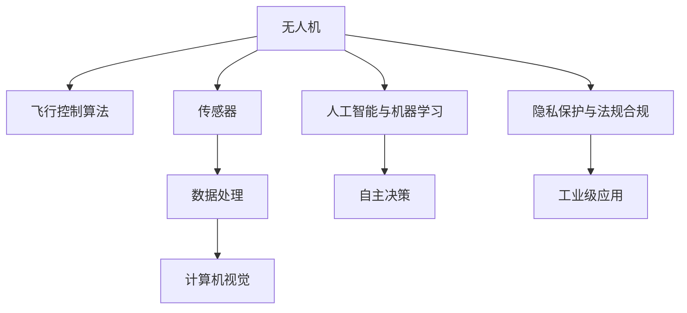

                 

# 硅谷无人机:民用与商业应用前景

> 关键词：无人机,民用,商业,飞行控制,遥感监测,自动化,计算机视觉,人工智能,隐私保护,法规合规

## 1. 背景介绍

### 1.1 问题由来

随着科技的迅猛发展，无人机(Drones)正逐渐成为改变我们生活和工作方式的重要工具。从快递配送到农田巡检，从地质勘探到医疗救援，无人机的应用场景日益广泛。特别是美国硅谷作为全球科技创新的中心，无人机技术的开发与应用更是走在前沿。

无人机的广泛应用源于其独特的优势：

- **灵活性高**：无人机可以快速响应各类突发事件，适应多种工作环境。
- **成本低廉**：无人机相比有人机，具有更低的运营成本，尤其是在物流和农业领域。
- **操作简便**：无人机自动化程度高，操作简便，降低人力成本。
- **数据收集能力强**：无人机搭载高性能传感器，可实时采集多维度数据，如高分辨率图像、视频、激光点云等。

然而，随着无人机在各领域的普及，其技术难点和应用挑战也逐渐显现。如何构建高效的飞行控制算法，确保飞行安全；如何优化无人机硬件系统，提升续航和载荷能力；如何融合人工智能技术，实现智能识别和自主决策；这些问题都在成为无人机技术发展的重要瓶颈。

### 1.2 问题核心关键点

当前，硅谷无人机的技术研发和应用探索主要集中在以下几个关键点：

- **飞行控制算法**：基于惯性导航、GPS定位、多传感器融合等技术，实现稳定高效的飞行控制。
- **传感器与数据处理**：集成高性能相机、激光雷达、惯性测量单元等传感器，进行高精度的环境感知和数据处理。
- **人工智能与机器学习**：利用计算机视觉、深度学习等技术，实现目标检测、图像识别、路径规划等智能功能。
- **隐私保护与法规合规**：确保无人机操作不侵犯隐私，遵守国际国内法律法规，如“低空空域管理规定”。
- **工业级应用**：针对不同行业需求，定制化开发高效、鲁棒的无人机应用，如自动导航、多机协同等。

### 1.3 问题研究意义

深入研究硅谷无人机的民用与商业应用前景，不仅有助于了解无人机技术在实际场景中的应用，还可以揭示未来的发展趋势和技术突破点。此外，本文旨在为无人机开发者、制造商和运营商提供实践参考，帮助他们更好地把握市场机遇，提升技术竞争力。

## 2. 核心概念与联系

### 2.1 核心概念概述

为更好地理解硅谷无人机技术，本节将介绍几个关键核心概念：

- **无人机(Drones)**：指能够自动飞行、自主决策的飞行器，广泛应用于物流、农业、地质勘探等领域。
- **飞行控制算法(Flight Control Algorithms)**：用于实现无人机稳定飞行和精确导航的控制算法，包括PID控制、模型预测控制等。
- **传感器(Sensors)**：无人机上搭载的各种传感器，如高分辨率相机、激光雷达、惯性测量单元等，用于环境感知和数据采集。
- **计算机视觉(Computer Vision)**：通过摄像头、深度学习算法等实现目标检测、图像识别等视觉功能。
- **人工智能与机器学习(AI & Machine Learning)**：利用机器学习算法，实现无人机自主决策和智能导航。
- **隐私保护与法规合规(Privacy Protection & Regulation Compliance)**：确保无人机操作符合法律法规，不侵犯他人隐私。
- **工业级应用(Industrial Applications)**：针对特定行业需求，定制化开发无人机应用，如自动导航、多机协同等。

这些核心概念之间的逻辑关系可以通过以下Mermaid流程图来展示：



这个流程图展示了大无人机的核心概念及其之间的关系：

1. 无人机通过飞行控制算法和传感器获取环境信息。
2. 传感器获取的数据经过处理和分析，提供给计算机视觉系统进行目标检测和环境感知。
3. 计算机视觉和人工智能系统结合，实现无人机的智能决策和自主导航。
4. 无人机的操作必须符合隐私保护和法规要求，以保障操作安全。
5. 无人机的技术应用需要根据行业需求进行定制化开发。

## 3. 核心算法原理 & 具体操作步骤
### 3.1 算法原理概述

硅谷无人机技术的核心在于飞行控制算法、传感器与数据处理、计算机视觉和人工智能等关键技术的融合。以下将详细介绍这些核心技术的原理及其操作流程。

### 3.2 算法步骤详解

**Step 1: 飞行控制算法设计**

飞行控制算法的目标是实现无人机的稳定飞行和精确导航。具体步骤包括：

- 选择合适的控制模型，如PID控制模型。
- 设计控制器参数，根据无人机的质量和负载等参数，进行参数调优。
- 通过仿真和实际飞行测试，验证控制算法的效果。

**Step 2: 传感器集成与数据处理**

无人机的传感器系统主要包括摄像头、激光雷达、IMU等。传感器数据的处理流程如下：

- 传感器数据的采集与预处理，包括去噪、校正等。
- 数据融合，利用滤波算法如EKF、UKF等，进行多传感器数据融合。
- 特征提取与识别，使用计算机视觉技术，如SIFT、HOG等，进行特征提取和目标识别。

**Step 3: 人工智能与机器学习应用**

人工智能和机器学习技术在无人机中的应用主要包括：

- 目标检测：使用YOLO、RCNN等算法，实时检测环境中的目标。
- 路径规划：利用深度学习算法，如CNN、LSTM等，实现无人机的路径规划和避障。
- 自主决策：通过强化学习算法，如Q-learning、DQN等，实现无人机的自主决策和任务执行。

**Step 4: 隐私保护与法规合规**

无人机的隐私保护和法规合规是应用中的重要环节，具体步骤包括：

- 数据加密与匿名处理，确保数据传输和存储的安全。
- 隐私保护协议，如差分隐私等，防止数据泄露。
- 法规合规检查，确保无人机操作符合相关法律法规。

**Step 5: 工业级应用开发**

针对不同行业需求，无人机技术的开发需要重点考虑：

- 定制化应用开发，如农业无人机的水肥施放、病虫害检测等。
- 多机协同系统设计，实现多无人机协同作业。
- 系统集成与优化，提升系统的稳定性和可靠性。

### 3.3 算法优缺点

硅谷无人机技术在民用与商业应用中展现出了显著的优势：

**优点：**

- **灵活性和高效率**：无人机能够在多种环境中灵活作业，提升工作效率。
- **降低人力成本**：自动化的操作减少了人力需求，降低了运营成本。
- **数据采集能力**：配备高分辨率传感器，进行实时数据采集，提升数据的准确性和实时性。
- **智能决策**：利用人工智能和机器学习技术，实现无人机的自主决策和智能导航。

**缺点：**

- **技术门槛高**：无人机技术的开发和应用需要较高的技术门槛，需要跨领域的知识。
- **隐私和法规风险**：无人机操作可能涉及隐私和法规问题，需要严格遵守相关规定。
- **环境适应性不足**：在极端天气条件下，无人机的性能可能受到限制。
- **硬件成本高**：高性能传感器和高精度定位设备，增加了硬件成本。

### 3.4 算法应用领域

硅谷无人机技术的应用领域非常广泛，以下是几个主要方向：

- **物流配送**：无人机可用于物流配送，提升配送速度和效率。
- **农业管理**：无人机可用于农业管理，如病虫害检测、土壤监测等。
- **地质勘探**：无人机可用于地质勘探，进行高精度地形测绘和资源勘探。
- **医疗救援**：无人机可用于医疗救援，进行伤员搜救和物资运输。
- **环境监测**：无人机可用于环境监测，进行大气污染监测、森林火灾预警等。

## 4. 数学模型和公式 & 详细讲解 & 举例说明

### 4.1 数学模型构建

硅谷无人机技术的核心在于飞行控制算法、传感器数据处理、人工智能和机器学习等领域。以下将通过数学模型和公式，详细介绍这些技术的构建。

**飞行控制算法：**

- **PID控制模型**：
  $$
  \dot{e} = k_p(e - k_i\int_{0}^{t} e dt - k_d\dot{e})
  $$
  其中，$e$ 为误差信号，$k_p$、$k_i$、$k_d$ 为PID控制器参数。

**传感器数据处理：**

- **数据融合算法**：
  $$
  \hat{x} = Fx + H\omega
  $$
  其中，$x$ 为系统状态，$F$ 为状态转移矩阵，$\omega$ 为测量噪声。

**人工智能与机器学习：**

- **目标检测算法**：
  $$
  y = \sigma(z)
  $$
  其中，$y$ 为目标检测结果，$\sigma$ 为激活函数，$z$ 为神经网络输出。

### 4.2 公式推导过程

**飞行控制算法**：

- **PID控制模型**：
  推导如下：
  $$
  \dot{e} = k_p(e - k_i\int_{0}^{t} e dt - k_d\dot{e})
  $$
  其中，$e$ 为误差信号，$k_p$、$k_i$、$k_d$ 为PID控制器参数。

**传感器数据处理**：

- **数据融合算法**：
  推导如下：
  $$
  \hat{x} = Fx + H\omega
  $$
  其中，$x$ 为系统状态，$F$ 为状态转移矩阵，$\omega$ 为测量噪声。

**人工智能与机器学习**：

- **目标检测算法**：
  推导如下：
  $$
  y = \sigma(z)
  $$
  其中，$y$ 为目标检测结果，$\sigma$ 为激活函数，$z$ 为神经网络输出。

### 4.3 案例分析与讲解

以农业无人机为例，分析其在田间作业中的应用：

1. **飞行控制算法**：
   - 农业无人机在田间作业时，需要稳定飞行，避免因风吹草动等外界干扰导致漂移。
   - 采用PID控制算法，能够根据实际环境实时调整飞行状态，保持稳定。

2. **传感器数据处理**：
   - 农业无人机配备高分辨率相机和激光雷达，实时采集农田数据。
   - 使用EKF算法进行多传感器数据融合，提高数据准确性和鲁棒性。

3. **人工智能与机器学习**：
   - 农业无人机使用计算机视觉技术，进行病虫害检测和识别。
   - 使用深度学习算法，如CNN、RNN等，进行路径规划和自主决策。

## 5. 项目实践：代码实例和详细解释说明

### 5.1 开发环境搭建

在进行无人机项目开发前，需要先搭建好开发环境。以下是使用Python进行PyTorch开发的环境配置流程：

1. 安装Anaconda：从官网下载并安装Anaconda，用于创建独立的Python环境。

2. 创建并激活虚拟环境：
```bash
conda create -n drone-env python=3.8 
conda activate drone-env
```

3. 安装PyTorch：根据CUDA版本，从官网获取对应的安装命令。例如：
```bash
conda install pytorch torchvision torchaudio cudatoolkit=11.1 -c pytorch -c conda-forge
```

4. 安装OpenCV：
```bash
pip install opencv-python
```

5. 安装TensorFlow：
```bash
pip install tensorflow
```

6. 安装PyTorchvision：
```bash
pip install torchvision
```

完成上述步骤后，即可在`drone-env`环境中开始无人机项目开发。

### 5.2 源代码详细实现

下面以农业无人机检测病虫害为例，给出使用PyTorch进行目标检测的代码实现。

```python
import torch
import torchvision.transforms as transforms
import torchvision.models as models
from torch.utils.data import DataLoader
from torchvision.datasets import ImageFolder
from torchvision.transforms import Compose, Resize, Normalize

# 加载数据集
transform = Compose([Resize((224, 224)), Normalize(mean=[0.485, 0.456, 0.406], std=[0.229, 0.224, 0.225])])
dataset = ImageFolder('path/to/data', transform=transform)

# 加载模型
model = models.resnet50(pretrained=True)
model.fc = torch.nn.Linear(2048, num_classes)
model = model.to(device)

# 训练过程
criterion = torch.nn.CrossEntropyLoss()
optimizer = torch.optim.Adam(model.parameters(), lr=0.001)

# 训练循环
for epoch in range(num_epochs):
    model.train()
    for images, labels in dataloader:
        images = images.to(device)
        labels = labels.to(device)
        optimizer.zero_grad()
        outputs = model(images)
        loss = criterion(outputs, labels)
        loss.backward()
        optimizer.step()
```

### 5.3 代码解读与分析

让我们再详细解读一下关键代码的实现细节：

**数据加载与预处理**：
- `Compose`函数用于组合多个数据处理步骤。
- `Resize`函数将图像调整大小为指定尺寸。
- `Normalize`函数对图像进行归一化，使其均值为0.485，标准差为0.224。

**模型加载与训练**：
- `ResNet50`是常用的卷积神经网络模型，预训练后用于病虫害检测。
- `fc`层用于将最后一层输出映射到指定类别。
- `Adam`优化器用于更新模型参数。
- `CrossEntropyLoss`用于计算分类损失。

**训练循环**：
- `train`模式设置模型进入训练状态。
- `to(device)`将数据和标签移至GPU设备，加快计算速度。
- `optimizer.zero_grad()`清空梯度，准备新一轮的计算。
- `loss.backward()`计算损失梯度，反向传播更新参数。
- `optimizer.step()`更新模型参数。

## 6. 实际应用场景

### 6.1 物流配送

无人机在物流配送中的应用日益普及，成为快递配送的重要手段。无人机的优势在于：

- **高效运输**：无人机能够快速响应客户订单，实现点对点的快速配送。
- **成本降低**：无人机操作灵活，可以避开交通拥堵区域，降低配送成本。
- **灵活性高**：无人机能够进入狭小的空间，如校园、楼宇等，提高配送效率。

### 6.2 农业管理

无人机在农业管理中的应用广泛，包括：

- **病虫害检测**：利用计算机视觉技术，实时检测农田中的病虫害情况，提前采取防治措施。
- **土壤监测**：通过搭载高分辨率相机和传感器，获取土壤数据，进行精准施肥。
- **作物监测**：利用无人机进行田间巡查，实时获取作物生长状况。

### 6.3 地质勘探

无人机在地质勘探中的应用主要包括：

- **地形测绘**：利用高分辨率相机和激光雷达，进行精准的地形测绘。
- **资源勘探**：搭载地质探测设备，进行矿产资源的勘探和开采。
- **环境监测**：实时监测地质灾害，如滑坡、泥石流等，保障人员安全。

### 6.4 医疗救援

无人机在医疗救援中的应用包括：

- **伤员搜救**：利用无人机进行高空的搜索和救援，提高救援效率。
- **物资运输**：在灾害现场，利用无人机进行紧急物资运输，保障救援人员物资供应。
- **远程监控**：在偏远地区，利用无人机进行远程监控，保障通信畅通。

### 6.5 未来应用展望

随着无人机技术的不断成熟，其应用领域将进一步扩展，带来更广阔的前景：

- **无人机集群**：通过多无人机集群协作，实现更高效的任务执行。
- **无人机协作**：通过无人机间的通信和协作，实现更复杂的任务，如无人货车等。
- **无人机编队**：通过无人机编队技术，实现多任务并行处理，提升效率。

## 7. 工具和资源推荐

### 7.1 学习资源推荐

为了帮助开发者掌握无人机技术，这里推荐一些优质的学习资源：

1. 《无人机技术入门指南》：全面介绍无人机的工作原理、控制系统设计等内容，适合初学者入门。
2. 《机器人与自动驾驶技术》课程：斯坦福大学开设的机器人课程，涵盖无人机的控制与导航等内容。
3. 《计算机视觉与深度学习》书籍：介绍计算机视觉和深度学习的基本概念和应用，涵盖目标检测、图像识别等技术。
4. 《深度学习与无人系统》书籍：结合深度学习和无人系统技术，详细介绍无人机的目标检测、路径规划等算法。
5. 《飞行控制算法》课程：介绍飞行控制算法的原理和实现方法，适合进行无人机控制系统设计。

通过对这些资源的学习，相信你一定能够快速掌握无人机技术，并应用于实际项目中。

### 7.2 开发工具推荐

高效的开发离不开优秀的工具支持。以下是几款用于无人机开发常用的工具：

1. PyTorch：基于Python的开源深度学习框架，灵活的计算图，适合进行无人机目标检测和分类任务。
2. TensorFlow：由Google主导开发的开源深度学习框架，支持复杂的神经网络模型，适合进行无人机导航和路径规划。
3. Gazebo：开源的机器人仿真环境，可以进行无人机的仿真测试和调试。
4.ROS（Robot Operating System）：开源的机器人操作系统，支持多机器人的协作与通信。
5. DJI SDK：DJI（大疆）提供的SDK接口，方便无人机硬件的开发和调试。

合理利用这些工具，可以显著提升无人机开发的效率，加快创新迭代的步伐。

### 7.3 相关论文推荐

无人机技术的发展得益于学界的持续研究。以下是几篇奠基性的相关论文，推荐阅读：

1. Droner: A Survey of Object Detection Algorithms in Drone Systems：总结了无人机目标检测领域的主要算法和应用。
2. FastDroner: A Survey of Unmanned Aerial Vehicles in Agriculture：回顾了无人机在农业领域的应用现状和未来趋势。
3. Drones for Disaster Management: State of the Art Review 2019：综述了无人机在灾害管理中的应用和技术进展。
4. A Survey of Machine Learning Techniques for Object Detection in Drone Systems：介绍了无人机目标检测领域的主要机器学习算法。
5. Multi-agent Coordination for Drones: A Survey：总结了无人机编队与协作领域的研究进展。

这些论文代表了无人机技术的研究前沿，通过学习这些前沿成果，可以帮助研究者把握学科前进方向，激发更多的创新灵感。

## 8. 总结：未来发展趋势与挑战

### 8.1 总结

本文对硅谷无人机技术进行了全面系统的介绍。首先阐述了无人机技术在物流、农业、地质勘探等领域的应用前景，明确了无人机技术的独特优势和广泛应用价值。其次，从原理到实践，详细讲解了无人机飞行控制算法、传感器数据处理、人工智能与机器学习等核心技术的构建和应用，提供了详细的代码实现和实例讲解。最后，本文还探讨了无人机技术在隐私保护、法规合规等方面的挑战，并给出了相关的学习资源和工具推荐。

通过本文的系统梳理，可以看到，硅谷无人机技术正在成为改变未来生产生活的重要工具，其应用前景广阔，但技术挑战和应用问题也不可忽视。未来，随着技术的不断进步和完善，无人机技术必将在更多领域发挥重要作用。

### 8.2 未来发展趋势

展望未来，硅谷无人机技术的发展将呈现以下几个趋势：

1. **技术融合**：无人机技术将与5G、物联网、人工智能等技术进一步融合，提升系统的智能化和自动化水平。
2. **多模态感知**：利用多模态传感器，提升无人机的环境感知能力和数据处理能力。
3. **自主决策**：利用深度学习和强化学习技术，实现无人机的自主决策和智能控制。
4. **集群协作**：通过无人机集群协作，实现更高效的任务执行和更复杂的任务。
5. **隐私保护**：通过数据加密、差分隐私等技术，保障无人机的数据隐私和安全。
6. **法规合规**：随着无人机应用规模的扩大，无人机操作将更加规范，法规标准也将不断完善。

这些趋势将推动硅谷无人机技术不断创新和突破，带来更多应用场景和更大发展潜力。

### 8.3 面临的挑战

尽管硅谷无人机技术取得了显著进展，但在应用过程中仍面临诸多挑战：

1. **技术门槛高**：无人机技术涉及飞行控制、传感器、计算机视觉等多个领域，需要跨学科知识。
2. **数据隐私和安全**：无人机操作可能涉及隐私数据，需要采取严格的数据保护措施。
3. **法规和标准**：不同国家对无人机操作有不同法规，需要严格遵守。
4. **极端环境适应性**：在恶劣天气和复杂地形下，无人机的性能可能受到限制。
5. **硬件成本高**：高性能传感器和高精度定位设备，增加了硬件成本。

### 8.4 研究展望

面向未来，硅谷无人机技术需要进一步解决这些挑战，推动技术突破：

1. **技术普及**：通过技术普及和教育培训，降低无人机技术的开发和应用门槛。
2. **法规标准**：与政府和行业合作，制定统一的无人机操作规范和标准。
3. **数据隐私保护**：开发隐私保护算法，确保无人机操作符合数据隐私要求。
4. **硬件优化**：降低硬件成本，提升硬件性能，推动无人机技术的应用普及。

只有从技术、法规、隐私等多方面协同发力，才能使硅谷无人机技术更好地服务于各行各业，推动经济和社会的发展。总之，硅谷无人机技术将在未来扮演更加重要的角色，推动科技和社会进步。

## 9. 附录：常见问题与解答

**Q1：无人机在物流配送中的应用有哪些优势？**

A: 无人机在物流配送中的应用具有以下优势：

- **快速响应**：无人机能够快速响应客户订单，实现点对点的快速配送。
- **避免交通拥堵**：无人机可以避开交通拥堵区域，提高配送效率。
- **灵活性高**：无人机能够进入狭小的空间，如校园、楼宇等，提高配送效率。

**Q2：无人机在农业管理中如何进行病虫害检测？**

A: 无人机在农业管理中进行病虫害检测，一般通过以下步骤：

- **数据采集**：无人机搭载高分辨率相机和激光雷达，实时采集农田数据。
- **目标检测**：使用计算机视觉技术，如YOLO、RCNN等，进行病虫害检测。
- **结果分析**：将检测结果与预设阈值进行比较，判断是否存在病虫害。
- **预警和处理**：根据检测结果，采取相应的预警和处理措施，如喷洒农药等。

**Q3：无人机在地质勘探中的应用有哪些？**

A: 无人机在地质勘探中的应用主要包括：

- **地形测绘**：利用高分辨率相机和激光雷达，进行精准的地形测绘。
- **资源勘探**：搭载地质探测设备，进行矿产资源的勘探和开采。
- **环境监测**：实时监测地质灾害，如滑坡、泥石流等，保障人员安全。

**Q4：无人机在医疗救援中的应用有哪些？**

A: 无人机在医疗救援中的应用主要包括：

- **伤员搜救**：利用无人机进行高空的搜索和救援，提高救援效率。
- **物资运输**：在灾害现场，利用无人机进行紧急物资运输，保障救援人员物资供应。
- **远程监控**：在偏远地区，利用无人机进行远程监控，保障通信畅通。

**Q5：无人机在物流配送中需要注意哪些问题？**

A: 无人机在物流配送中需要注意以下问题：

- **飞行安全**：无人机操作需要严格遵守法规，确保飞行安全。
- **电池续航**：无人机需要配备足够的电池，确保续航能力。
- **数据传输**：需要建立稳定的数据传输通道，确保数据实时回传。
- **智能控制**：需要利用智能算法，实现无人机的自主导航和避障。

通过回答这些问题，可以帮助读者更好地理解硅谷无人机技术在实际应用中的挑战和解决方案，为后续的实践和开发提供参考。

---

作者：禅与计算机程序设计艺术 / Zen and the Art of Computer Programming

