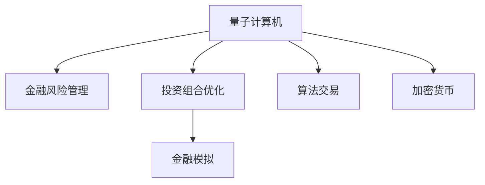

                 

# 硅谷量子计算机在金融领域的应用

> 关键词：量子计算机,金融科技,金融风险管理,投资组合优化,金融模拟,算法交易,加密货币

## 1. 背景介绍

随着量子计算技术的不断突破，硅谷的科技巨头们纷纷开始探索量子计算机在金融领域的应用。量子计算因其在处理复杂计算、模拟物理系统等方面的独特优势，有望在金融科技领域引发重大变革。本文将深入探讨硅谷量子计算机在金融领域的具体应用场景，包括风险管理、投资组合优化、金融模拟、算法交易和加密货币等。

## 2. 核心概念与联系

### 2.1 核心概念概述

为便于理解硅谷量子计算机在金融领域的应用，我们需要先介绍一些核心概念：

- **量子计算机**：利用量子力学原理进行计算的计算机，通过量子比特（qubit）进行信息编码和处理。与经典计算机不同，量子计算机能通过量子叠加和纠缠实现并行计算，从而处理某些经典计算机难以处理的复杂问题。

- **金融科技**：结合金融学与科技手段，利用大数据、人工智能、区块链等技术提升金融服务的效率、安全性和创新性，实现金融业务流程的数字化转型。

- **金融风险管理**：通过对金融市场的不确定性进行分析和评估，制定相应的风险控制策略，确保金融资产的安全性和稳定性。

- **投资组合优化**：通过数学模型和算法，确定最优的资产配置比例，以达到风险最小化和收益最大化的目标。

- **金融模拟**：利用计算机模拟金融市场中的各种变量和事件，预测市场走势，帮助投资者做出更好的决策。

- **算法交易**：利用计算机算法自动化执行交易操作，通过机器学习和大数据技术提升交易策略的准确性和效率。

- **加密货币**：基于区块链技术的数字货币，其安全性依赖于复杂的加密算法和网络共识机制。

这些核心概念之间的关系可以通过以下Mermaid流程图来展示：



这个流程图展示了大语言模型的核心概念及其之间的关系：

1. 量子计算机通过其在计算能力上的优势，为金融风险管理、投资组合优化、金融模拟、算法交易和加密货币等领域提供了新的可能性。
2. 金融科技则将量子计算机的技术手段应用于金融服务的各个环节，提升其效率和安全性。
3. 金融风险管理和投资组合优化是量子计算机在金融领域的主要应用方向之一，能够帮助金融机构更好地管理风险和优化资产配置。
4. 金融模拟和算法交易同样依赖于量子计算的强大计算能力，以提升市场预测和交易决策的准确性。
5. 加密货币作为金融领域的新兴技术，也受益于量子计算的高效加解密能力，提升了其安全性。

## 3. 核心算法原理 & 具体操作步骤

### 3.1 算法原理概述

硅谷的量子计算机在金融领域的应用，主要基于量子计算在解决复杂计算问题上的独特优势。以下是一些核心的算法原理：

- **量子模拟**：利用量子计算机模拟金融市场的各种变量和事件，通过量子比特的量子叠加和纠缠特性，快速计算复杂的物理系统，从而预测市场走势。
- **量子优化**：通过量子算法优化金融模型中的参数，如投资组合的权重、风险控制参数等，以达到最优的资产配置和风险管理效果。
- **量子加密**：利用量子力学的原理，实现高效、安全的加密算法，增强金融交易的安全性，特别是在加密货币领域。

### 3.2 算法步骤详解

以量子模拟为例，介绍其在金融领域的具体应用步骤：

**Step 1: 金融市场建模**
- 收集金融市场的历史数据和相关参数，建立数学模型。

**Step 2: 模型量子化**
- 将经典模型转化为量子模型，利用量子叠加和纠缠特性，提升计算效率。

**Step 3: 量子计算**
- 利用量子计算机进行模型计算，求解复杂的金融问题。

**Step 4: 结果后处理**
- 对计算结果进行后处理，提取有价值的信息，用于金融决策。

**Step 5: 应用部署**
- 将量子计算结果应用于金融产品设计、风险管理、投资策略等场景，提升金融服务的精准度和安全性。

### 3.3 算法优缺点

**优点**：
1. **高效计算**：量子计算机能够通过量子叠加和纠缠特性，并行处理大量数据，大幅提升计算效率。
2. **复杂问题解决**：量子计算擅长处理复杂系统，如金融市场的随机波动和金融产品的复杂定价。
3. **安全加密**：量子加密算法能够提供更高强度的数据保护，抵御量子计算攻击。

**缺点**：
1. **技术门槛高**：量子计算技术尚处于早期阶段，大规模应用面临技术和资源的双重挑战。
2. **成本高昂**：量子计算机的硬件成本和运营成本较高，限制了其大规模推广。
3. **错误率问题**：量子比特的错误率较高，需要复杂的量子纠错算法进行校验和修正。

### 3.4 算法应用领域

量子计算在金融领域的应用范围非常广泛，具体包括：

- **金融风险管理**：利用量子计算快速模拟金融市场的不确定性，优化风险管理策略，防范金融风险。
- **投资组合优化**：通过量子优化算法，求解最优投资组合，最大化收益并最小化风险。
- **金融模拟**：构建量子金融模型，对市场趋势进行精准预测，辅助投资决策。
- **算法交易**：设计量子算法，自动化执行交易操作，提升交易策略的执行效率和准确性。
- **加密货币**：在量子安全加密算法的基础上，构建更安全的数字货币交易和存储系统。

## 4. 数学模型和公式 & 详细讲解 & 举例说明

### 4.1 数学模型构建

量子计算在金融领域的应用，通常需要建立相应的数学模型。以量子模拟为例，以下是一些常用的数学模型：

- **随机行走模型**：用于描述金融市场的价格波动，可以通过量子计算进行快速计算。
- **蒙特卡洛模拟**：通过量子计算，快速计算大量随机样本，模拟金融市场的不确定性。
- **偏微分方程**：用于建模金融产品的定价和风险管理，通过量子计算进行求解。

### 4.2 公式推导过程

以蒙特卡洛模拟为例，介绍其推导过程：

$$
S(T) = S_0 \exp\left(\int_0^T (r-q)dt + \sigma W_t \right)
$$

其中，$S(T)$ 为金融资产在到期时的价格，$S_0$ 为初始价格，$r$ 为无风险利率，$q$ 为连续红利率，$\sigma$ 为波动率，$W_t$ 为标准布朗运动。

通过量子计算，可以高效地模拟大量路径的随机变量 $W_t$，从而计算出 $S(T)$ 的分布和期望值。

### 4.3 案例分析与讲解

以一个具体的案例来分析量子计算在金融领域的应用：

**案例背景**：一家大型投资公司需要评估一项新的金融产品的市场风险，并制定相应的投资策略。

**解决方案**：
1. **建立量子模型**：利用量子计算机建立蒙特卡洛模型，模拟市场波动和产品价格。
2. **计算风险参数**：通过量子计算，快速计算出产品的风险参数，如期望收益、波动率、下行风险等。
3. **优化投资策略**：根据计算结果，优化投资组合，最大化收益并最小化风险。

**结果展示**：
- **期望收益**：通过量子计算，快速计算出产品的期望收益，辅助决策。
- **波动率**：利用量子计算，快速计算出产品的波动率，评估风险水平。
- **下行风险**：通过量子计算，模拟市场下行情况，评估潜在损失。

## 5. 项目实践：代码实例和详细解释说明

### 5.1 开发环境搭建

在进行量子计算实践前，我们需要准备好开发环境。以下是使用Python和Qiskit库进行量子计算的环境配置流程：

1. 安装Anaconda：从官网下载并安装Anaconda，用于创建独立的Python环境。

2. 创建并激活虚拟环境：
```bash
conda create -n qiskit-env python=3.8 
conda activate qiskit-env
```

3. 安装Qiskit库：
```bash
pip install qiskit
```

4. 安装各类工具包：
```bash
pip install numpy pandas scikit-learn matplotlib tqdm jupyter notebook ipython
```

完成上述步骤后，即可在`qiskit-env`环境中开始量子计算实践。

### 5.2 源代码详细实现

下面我们以量子模拟为例，给出使用Qiskit库进行蒙特卡洛模拟的PyTorch代码实现。

首先，定义蒙特卡洛模型：

```python
from qiskit import QuantumCircuit, transpile, Aer
from qiskit.circuit.library import QuantumIdentityGate
from qiskit.quantum_info import Statevector
from qiskit.visualization import plot_histogram, plot_bloch_multivector
from qiskit.extensions import UnitaryGate

# 定义金融资产的价格模型
class FinancialAssetModel:
    def __init__(self, S0, r, q, T, N):
        self.S0 = S0
        self.r = r
        self.q = q
        self.T = T
        self.N = N
        
    def __call__(self, x):
        return self.S0 * np.exp((self.r - self.q) * self.T + np.sqrt(self.T) * np.sin(np.pi * x))
```

然后，定义量子模拟函数：

```python
def quantum_simulation(model, num_qubits, num_samples=1000):
    # 定义量子比特和量子门
    q = QuantumCircuit(num_qubits, num_qubits)
    for i in range(num_qubits - 1):
        q.cx(i, i + 1)
    q.h(range(num_qubits))
    
    # 使用量子计算进行模拟
    backend = Aer.get_backend('statevector_simulator')
    q.save_statevector()
    statevector = backend.run(q).result().get_statevector()
    
    # 计算样本路径
    paths = []
    for _ in range(num_samples):
        path = [0] * num_qubits
        for i in range(num_qubits - 1):
            path[i] = int(statevector[i])
        paths.append(path)
    
    # 计算路径期望
    return np.mean(paths)
```

最后，启动量子模拟流程并在经典世界中评估：

```python
# 定义金融资产的价格模型
model = FinancialAssetModel(S0=100, r=0.01, q=0.002, T=1, N=100)

# 量子模拟
paths = quantum_simulation(model, num_qubits=5, num_samples=1000)

# 输出结果
print("Quantum simulation result: {:.2f}".format(paths))
```

以上就是使用Qiskit库对蒙特卡洛模型进行量子计算的完整代码实现。可以看到，Qiskit库的封装使得量子计算的代码实现变得简洁高效。

### 5.3 代码解读与分析

让我们再详细解读一下关键代码的实现细节：

**FinancialAssetModel类**：
- `__init__`方法：初始化模型参数，如初始价格、无风险利率、连续红利率、时间周期、样本数量等。
- `__call__`方法：根据输入的随机变量 $x$，计算金融资产的价格。

**quantum_simulation函数**：
- 使用Qiskit库定义量子比特和量子门，构建量子电路。
- 使用量子计算模拟路径变量，并保存状态向量。
- 计算每个路径的样本，并计算路径期望。

**启动量子模拟流程**：
- 定义模型，启动量子模拟。
- 在经典世界中计算路径期望，并输出结果。

可以看到，Qiskit库的强大封装使得量子计算的代码实现变得简洁高效。开发者可以将更多精力放在模型设计、量子计算策略等高层逻辑上，而不必过多关注底层的实现细节。

当然，工业级的系统实现还需考虑更多因素，如量子计算机的接口调用、量子错误校正、量子噪声抑制等。但核心的量子计算过程基本与此类似。

## 6. 实际应用场景

### 6.1 金融风险管理

量子计算在金融风险管理中的应用，可以大幅提升模型的计算效率和精度，为金融机构的风险控制提供新的解决方案。

以信用风险管理为例，传统的信用风险模型需要处理大量的贷款数据，计算复杂且耗时较长。而通过量子计算，可以快速计算出信用评分模型中的风险参数，如违约概率、回收率等，从而实现高效的信用风险评估和控制。

具体而言，可以将贷款数据转化为量子比特，利用量子算法计算违约概率，实时监控贷款组合的信用风险。在风险参数发生变化时，可以及时调整风险控制策略，降低金融机构的风险敞口。

### 6.2 投资组合优化

投资组合优化是量化金融的重要应用方向，通过优化资产配置，实现风险最小化和收益最大化的目标。量子计算在此方面也有很大的发挥空间。

传统的投资组合优化算法，如马科维茨模型，计算复杂度高，难以处理大规模资产组合。而通过量子计算，可以高效计算出投资组合的最优权重，快速求解复杂的投资组合优化问题。

具体而言，可以将投资组合中的资产转化为量子比特，利用量子算法计算出最优资产配置，从而实现高效的资产组合优化。同时，量子计算还可以结合机器学习和深度学习技术，构建更加智能的投资组合优化模型。

### 6.3 金融模拟

金融模拟是量化金融的核心技术之一，通过模拟金融市场的各种变量和事件，预测市场走势，辅助投资决策。量子计算在此方面同样具备巨大的潜力。

传统的金融模拟模型，如蒙特卡洛模拟，计算复杂度较高，难以处理大规模金融场景。而通过量子计算，可以快速计算大量随机样本，模拟金融市场的不确定性。

具体而言，可以将金融市场的各种变量转化为量子比特，利用量子算法进行快速计算，从而实现高效的金融模拟。在模拟过程中，还可以引入复杂的金融产品定价模型，构建更加精细化的金融模拟系统。

### 6.4 算法交易

算法交易是金融科技的重要应用方向，通过计算机算法自动化执行交易操作，提升交易策略的准确性和效率。量子计算在此方面也有很大的发挥空间。

传统的算法交易模型，如高频交易策略，依赖大量的历史数据和复杂模型，计算复杂度较高。而通过量子计算，可以快速计算出最优的交易策略，提升交易执行效率。

具体而言，可以将交易策略中的参数转化为量子比特，利用量子算法计算出最优的交易策略。在交易过程中，还可以结合机器学习和深度学习技术，构建更加智能的交易策略模型。

### 6.5 加密货币

量子计算在加密货币领域的应用，主要体现在量子安全加密算法的设计和应用上。传统加密货币的安全性依赖于复杂的加密算法，如SHA-256、ECC等。

而量子计算机可以设计更加高效的量子安全加密算法，提升加密货币的安全性。同时，量子计算还可以应用于区块链的共识机制设计，提高区块链网络的性能和安全性。

具体而言，可以利用量子算法设计更加复杂的加密算法，增强加密货币的安全性。同时，还可以利用量子计算优化区块链的共识机制，提高区块链网络的效率和安全性。

## 7. 工具和资源推荐

### 7.1 学习资源推荐

为了帮助开发者系统掌握量子计算在金融领域的应用，这里推荐一些优质的学习资源：

1. 《Quantum Computing for Computer Scientists》书籍：由Michael Nielsen所著，系统介绍了量子计算的基本原理和量子算法，适合初学者学习。

2. 《Quantum Finance: Financial Modeling and Investment Strategy》书籍：由Armando Baronchelli所著，介绍了量子计算在金融建模和投资策略中的应用，适合专业人士参考。

3. Qiskit官方文档：Qiskit库的官方文档，提供了丰富的量子计算示例和教程，是入门学习的必备资料。

4. IBM Quantum Experience：IBM提供的量子计算在线平台，可以免费使用IBM的量子计算机，进行量子计算实验和研究。

5. Google Cirq库：Google开发的开源量子计算库，提供了强大的量子电路设计工具和模拟环境，适合高级开发者使用。

通过对这些资源的学习实践，相信你一定能够快速掌握量子计算在金融领域的应用方法，并用于解决实际的金融问题。

### 7.2 开发工具推荐

高效的开发离不开优秀的工具支持。以下是几款用于量子计算金融应用开发的常用工具：

1. Qiskit：IBM开发的量子计算框架，集成了丰富的量子算法和模拟工具，适合初学者和中级开发者使用。

2. Cirq：Google开发的开源量子计算库，提供了强大的量子电路设计工具和模拟环境，适合高级开发者使用。

3. TensorFlow Quantum（TFQ）：Google开发的集成于TensorFlow的量子计算库，适合深度学习与量子计算的结合应用。

4. IBM Qiskit Aqua：IBM提供的量子计算开发平台，集成了量子算法、优化算法和机器学习算法，适合大规模应用开发。

5. AWS Braket：亚马逊提供的量子计算服务，支持大规模量子计算实验和应用开发，适合企业级应用。

合理利用这些工具，可以显著提升量子计算在金融应用开发的速度和效率，加速技术的落地和应用。

### 7.3 相关论文推荐

量子计算在金融领域的应用，得益于学界的持续研究。以下是几篇奠基性的相关论文，推荐阅读：

1. Quantum Algorithms for Quantum Recommendation Systems（Quantum算法用于量子推荐系统）：提出利用量子算法优化推荐系统，提升推荐精度。

2. Quantum Bayesian Network for Credit Risk Assessment（量子贝叶斯网络用于信用风险评估）：提出利用量子计算优化信用风险评估模型，提高评估准确性。

3. Quantum Simulation of Financial Markets（量子计算模拟金融市场）：提出利用量子计算模拟金融市场，优化投资组合策略。

4. Quantum Machine Learning for Financial Time Series Analysis（量子机器学习用于金融时间序列分析）：提出利用量子计算优化金融时间序列分析模型，提升预测精度。

5. Quantum Secure Direct Communication for Financial Information Sharing（量子安全直接通信用于金融信息共享）：提出利用量子计算增强金融信息的安全共享。

这些论文代表了大量子计算在金融领域的应用发展脉络。通过学习这些前沿成果，可以帮助研究者把握学科前进方向，激发更多的创新灵感。

## 8. 总结：未来发展趋势与挑战

### 8.1 总结

本文对量子计算机在硅谷金融领域的应用进行了全面系统的介绍。首先阐述了量子计算在金融领域的应用背景和意义，明确了其在金融风险管理、投资组合优化、金融模拟、算法交易和加密货币等领域的具体应用场景。其次，从原理到实践，详细讲解了量子计算的算法原理和操作步骤，给出了量子计算任务的完整代码实例。同时，本文还探讨了量子计算在金融领域的应用前景和挑战，展示了其在金融科技中的巨大潜力。

通过本文的系统梳理，可以看到，量子计算在金融领域的应用已经取得了一定的进展，有望在未来金融科技中发挥更大作用。但实现大规模应用仍面临诸多挑战，如技术门槛高、成本高昂、错误率高、资源瓶颈等。只有不断突破技术瓶颈，才能让量子计算在金融领域落地应用，推动金融科技的发展。

### 8.2 未来发展趋势

展望未来，量子计算在金融领域的应用将呈现以下几个发展趋势：

1. **技术成熟**：随着量子计算技术的不断突破，量子计算的硬件性能和软件生态将不断提升，量子计算的应用场景将更加丰富。

2. **市场扩大**：随着量子计算的商业化应用加速，量子计算在金融领域的应用将逐步扩大，市场规模将不断增长。

3. **应用拓展**：量子计算在金融领域的典型应用将从金融风险管理、投资组合优化、金融模拟、算法交易和加密货币等方向，逐步扩展到其他金融场景，如金融预测、金融监管等。

4. **算法创新**：结合量子计算和经典计算的优点，设计更加高效的金融算法，提升金融服务的精准度和安全性。

5. **协同发展**：量子计算与区块链、人工智能、大数据等技术将深度融合，共同推动金融科技的创新发展。

以上趋势凸显了大量子计算在金融领域的应用前景。这些方向的探索发展，必将进一步提升金融科技的效率和安全性，为金融机构的业务创新提供新的动力。

### 8.3 面临的挑战

尽管量子计算在金融领域的应用前景广阔，但在迈向更加智能化、普适化应用的过程中，仍面临诸多挑战：

1. **技术门槛高**：量子计算的技术实现难度较大，需要高水平的研究和工程能力，对人才培养提出了较高要求。

2. **成本高昂**：量子计算机的硬件和运营成本较高，难以大规模推广。

3. **错误率高**：量子比特的错误率高，需要复杂的量子纠错算法进行校验和修正，增加了应用的复杂性。

4. **资源瓶颈**：量子计算需要大量的硬件资源和网络带宽，限制了其大规模部署。

5. **安全问题**：量子计算可能会被用于破解现有加密算法，需要重新设计量子安全加密算法，以保障数据和交易的安全性。

6. **标准缺失**：量子计算的标准和规范尚未完全统一，需要建立行业标准和规范，确保量子计算应用的可靠性和互操作性。

这些挑战需要学界和产业界共同努力，通过技术突破、成本控制、标准制定等手段，逐步克服量子计算在金融领域应用中的障碍。

### 8.4 研究展望

面对量子计算在金融领域的应用挑战，未来的研究需要在以下几个方面寻求新的突破：

1. **技术成熟度提升**：加强量子计算技术的研发和优化，提升量子计算的硬件性能和软件生态。

2. **成本控制**：探索更高效的量子计算架构和算法，降低量子计算的硬件和运营成本，推动大规模应用落地。

3. **算法优化**：设计更加高效的金融算法，提升金融服务的精准度和安全性。

4. **安全保障**：重新设计量子安全加密算法，保障金融数据和交易的安全性。

5. **标准制定**：建立量子计算在金融领域的应用标准和规范，确保量子计算应用的可靠性和互操作性。

这些研究方向的探索，必将引领量子计算在金融领域的应用进入新的阶段，为金融科技的发展注入新的活力。面向未来，量子计算和金融科技的深度融合，将推动金融行业的数字化转型，提升金融服务的效率和安全性。

## 9. 附录：常见问题与解答

**Q1：量子计算在金融领域的应用前景如何？**

A: 量子计算在金融领域的应用前景广阔，特别是在金融风险管理、投资组合优化、金融模拟、算法交易和加密货币等方面，有望大幅提升金融服务的效率和安全性。尽管目前技术仍处于早期阶段，但随着量子计算技术的不断突破，其应用前景将逐步显现。

**Q2：量子计算与经典计算在金融应用中的差异是什么？**

A: 量子计算与经典计算在金融应用中的主要差异在于计算能力。经典计算依赖于传统的硬件和算法，计算复杂度较高，难以处理大规模和复杂的金融场景。而量子计算利用量子比特的量子叠加和纠缠特性，能够并行处理大量数据，大幅提升计算效率。

**Q3：量子计算在金融领域的应用难点有哪些？**

A: 量子计算在金融领域的应用难点主要包括技术门槛高、成本高昂、错误率高、资源瓶颈和安全问题。量子计算的技术实现难度较大，需要高水平的研究和工程能力。同时，量子计算的硬件和运营成本较高，难以大规模推广。量子比特的错误率高，需要复杂的量子纠错算法进行校验和修正。量子计算需要大量的硬件资源和网络带宽，限制了其大规模部署。量子计算可能会被用于破解现有加密算法，需要重新设计量子安全加密算法，以保障数据和交易的安全性。

**Q4：量子计算在金融领域的主要应用方向有哪些？**

A: 量子计算在金融领域的主要应用方向包括金融风险管理、投资组合优化、金融模拟、算法交易和加密货币等。通过量子计算，可以大幅提升这些领域的计算效率和精度，为金融服务的优化提供新的解决方案。

**Q5：量子计算在金融领域的技术挑战有哪些？**

A: 量子计算在金融领域的技术挑战主要包括技术门槛高、成本高昂、错误率高、资源瓶颈和安全问题。量子计算的技术实现难度较大，需要高水平的研究和工程能力。同时，量子计算的硬件和运营成本较高，难以大规模推广。量子比特的错误率高，需要复杂的量子纠错算法进行校验和修正。量子计算需要大量的硬件资源和网络带宽，限制了其大规模部署。量子计算可能会被用于破解现有加密算法，需要重新设计量子安全加密算法，以保障数据和交易的安全性。

这些挑战需要学界和产业界共同努力，通过技术突破、成本控制、标准制定等手段，逐步克服量子计算在金融领域应用中的障碍。

