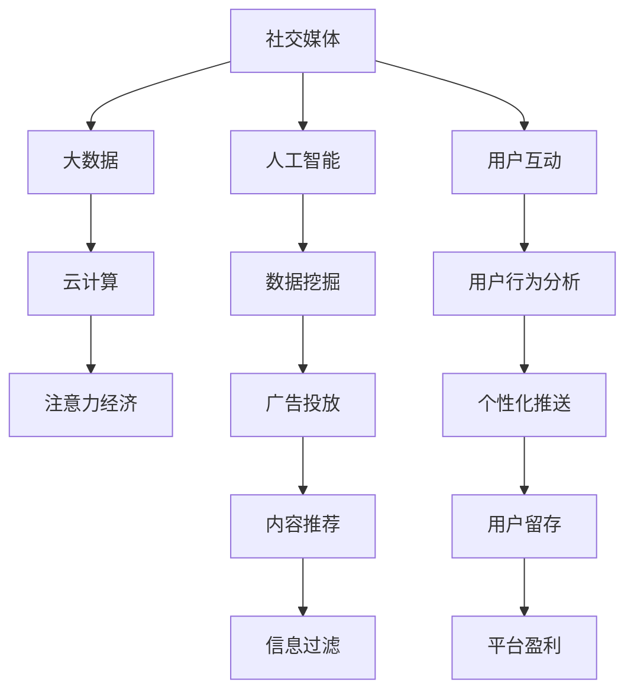

                 

## 1. 背景介绍

### 1.1 问题由来
社交媒体（Social Media）的崛起标志着人类信息传播方式的深刻变革。伴随着移动互联网的普及，社交网络成为人们获取信息、表达意见、维系关系的重要平台。与此同时，随着大数据、云计算等技术的成熟，注意力经济（Attention Economy）作为社交媒体的副产品应运而生。

### 1.2 问题核心关键点
注意力经济的核心在于如何高效分配用户的注意力资源，以实现商业价值的最大化。社交媒体平台通过对用户行为数据的挖掘和分析，可以精准投放广告、内容推荐、话题引导等，驱动用户持续互动，产生价值。

### 1.3 问题研究意义
研究社交媒体与注意力经济，对于理解现代互联网时代的商业逻辑、优化信息传播效率、推动数字经济的发展，具有重要意义：

1. **用户行为分析**：通过对用户互动数据的深入分析，发现用户的兴趣和行为模式，提升广告投放和内容推荐的精准度。
2. **信息过滤与推送**：利用数据挖掘技术，实现信息过滤与个性化推送，提升用户满意度，增加平台黏性。
3. **数据驱动决策**：以数据为基础，进行科学决策和优化，推动企业业务创新和运营效率的提升。
4. **社会影响研究**：分析社交媒体如何影响舆论、文化、教育等领域，评估注意力经济对社会的影响。
5. **道德与隐私**：探讨数据收集和处理中的道德问题，保护用户隐私，构建健康的网络环境。

## 2. 核心概念与联系

### 2.1 核心概念概述

在研究社交媒体与注意力经济时，涉及到的几个核心概念如下：

- **社交媒体（Social Media）**：基于互联网技术，允许用户创建个人资料，分享信息、图片、视频等内容的平台。如Facebook、Twitter、Instagram等。
- **注意力经济（Attention Economy）**：以用户注意力为商品，通过广告、推荐等手段吸引并保持用户注意力的经济形态。
- **大数据（Big Data）**：具有体量大、多样性、高速生成、真实性等特点的数据集合。
- **云计算（Cloud Computing）**：基于互联网的计算方式，提供按需计算资源和弹性扩展服务。
- **人工智能（AI）**：通过机器学习、深度学习等技术，实现自主决策和智能化的计算能力。

这些概念之间的联系可以从以下Mermaid流程图进行展示：



这个流程图展示了社交媒体如何通过大数据、云计算、人工智能等技术手段，吸引并保持用户注意力，从而实现注意力经济。

## 3. 核心算法原理 & 具体操作步骤
### 3.1 算法原理概述

社交媒体与注意力经济的崛起，依赖于一系列复杂的算法和数据处理技术。以下是对其中几个核心算法原理的概述：

- **推荐系统（Recommendation System）**：基于用户行为数据和物品属性，通过机器学习算法推荐用户可能感兴趣的内容。
- **广告算法（Ad Algorithm）**：基于用户画像和行为数据，优化广告展示时机和位置，提升广告效果。
- **情感分析（Sentiment Analysis）**：通过自然语言处理技术，分析用户对内容的情感倾向，评估用户满意度和舆情变化。
- **社交网络分析（Social Network Analysis）**：分析用户关系网络，挖掘社交影响力，实现更精准的话题引导和话题分析。

### 3.2 算法步骤详解

以下将详细讲解社交媒体平台如何通过数据驱动算法，实现用户注意力的高效分配：

**Step 1: 数据收集与处理**
- 收集社交媒体平台上的用户互动数据，包括点赞、评论、分享、关注、搜索等行为。
- 数据预处理，包括数据清洗、特征提取、数据标准化等。

**Step 2: 用户画像构建**
- 通过数据挖掘技术，分析用户行为数据，构建用户画像，包括兴趣、年龄、性别、地域等。
- 利用聚类算法，将用户分为不同的兴趣群体，便于后续的精准投放和个性化推荐。

**Step 3: 推荐系统训练与优化**
- 选择推荐算法模型，如协同过滤、基于内容的推荐、深度学习等。
- 利用历史数据训练模型，进行模型评估和优化，提升推荐效果。
- 引入A/B测试，不断迭代改进推荐算法。

**Step 4: 广告投放与效果评估**
- 根据用户画像和行为数据，设计广告素材和投放策略。
- 利用优化算法，实时调整广告投放策略，最大化广告效果。
- 收集广告点击、展示、转化等数据，进行效果评估和优化。

**Step 5: 信息过滤与个性化推送**
- 分析用户互动数据，识别出高频话题和热点事件。
- 利用机器学习算法，对信息进行分类、过滤和排序。
- 根据用户画像和行为数据，进行个性化推送，提升用户满意度。

### 3.3 算法优缺点

社交媒体与注意力经济中常用的算法技术具有以下优点：

- **精准性高**：通过大数据和机器学习技术，推荐和广告投放的精准度大大提升，提高了用户的满意度和平台的盈利能力。
- **效率高**：自动化算法能够快速处理海量数据，实现快速决策和调整。
- **用户互动增加**：个性化的内容推荐和广告投放，增加了用户互动频率和时长，提升了平台活跃度。

同时，这些算法也存在一些局限性：

- **数据隐私问题**：用户数据的收集和处理可能涉及隐私问题，需要采取严格的隐私保护措施。
- **算法偏见**：算法可能学习到数据中的偏见，导致推荐和广告投放的不公平性。
- **模型复杂度高**：部分算法模型较为复杂，需要大量的计算资源和数据支持，难以在小规模平台上部署。
- **过度依赖数据**：算法的表现高度依赖于数据质量，数据缺失或不准确可能影响效果。

### 3.4 算法应用领域

社交媒体与注意力经济的应用领域非常广泛，涵盖多个行业和领域：

- **电子商务**：通过推荐系统，提高商品推荐精准度，增加用户购买转化率。
- **媒体与新闻**：利用个性化推送和情感分析，提升新闻阅读量，引导舆论方向。
- **社交网络**：通过社交网络分析，发现关键意见领袖，实现话题引导和舆情监控。
- **健康医疗**：利用数据分析和推荐系统，提供个性化的健康建议和疾病预防措施。
- **金融服务**：通过用户行为分析和情感分析，提供个性化的金融产品推荐和风险预警。

这些领域的应用展示了社交媒体与注意力经济在现代社会中的广泛影响力和应用潜力。

## 4. 数学模型和公式 & 详细讲解 & 举例说明

### 4.1 数学模型构建

社交媒体与注意力经济中的算法模型通常基于以下数学模型：

- **协同过滤推荐算法（Collaborative Filtering）**：基于用户和物品的评分数据，构建用户-物品相似矩阵，推荐相似物品。

  $$
  \hat{y}_{ui} = \frac{\sum_{v} P_{uv} r_{vi}}{\sum_{v} P_{uv}} + \frac{\sum_{v} Q_{vi} r_{vi}}{\sum_{v} Q_{vi}}
  $$

- **深度学习推荐模型（Deep Learning-based Recommender）**：利用神经网络，提取用户行为和物品属性的高层次特征，实现更精准的推荐。

  $$
  \text{Embedding}_h = \text{MLP}(\text{User}_{i}, \text{Item}_{h})
  $$

- **广告点击率预测模型（CTR Prediction）**：利用逻辑回归或深度学习模型，预测广告点击率，优化广告投放策略。

  $$
  \text{CTR} = \text{sigmoid}(\text{Linear}(\text{User}_{i}, \text{Item}_{h}))
  $$

- **情感分析模型（Sentiment Analysis）**：通过情感词典、LSTM等技术，分析用户情感倾向。

  $$
  \text{Sentiment}_{i} = \text{LSTM}(\text{Sentence}_{i})
  $$

### 4.2 公式推导过程

- **协同过滤推荐算法**：基于用户-物品评分矩阵 $R$ 和用户相似度矩阵 $P$、物品相似度矩阵 $Q$，计算推荐结果。
- **深度学习推荐模型**：利用多层感知器（MLP），将用户和物品的原始特征映射到高维空间，提取特征表示。
- **广告点击率预测模型**：通过逻辑回归或深度学习模型，预测广告点击率，利用梯度下降等优化算法更新模型参数。
- **情感分析模型**：利用情感词典和LSTM模型，将句子转化为情感向量，进行情感分类。

### 4.3 案例分析与讲解

以某电商平台的个性化推荐系统为例，该系统通过收集用户的浏览、购买记录，构建用户画像，使用协同过滤和深度学习模型进行推荐。具体步骤如下：

1. 数据收集：从电商平台收集用户和物品的评分数据。
2. 数据预处理：对数据进行清洗、归一化处理。
3. 协同过滤模型训练：使用协同过滤算法训练用户-物品相似矩阵 $P$ 和 $Q$。
4. 深度学习模型训练：使用深度学习模型训练用户和物品的特征表示。
5. 推荐结果计算：将用户特征表示和物品特征表示进行加权平均，得到推荐结果。

## 5. 项目实践：代码实例和详细解释说明

### 5.1 开发环境搭建

在进行社交媒体与注意力经济的算法实践时，需要搭建相应的开发环境。以下是使用Python进行PyTorch开发的环境配置流程：

1. 安装Anaconda：从官网下载并安装Anaconda，用于创建独立的Python环境。

2. 创建并激活虚拟环境：
```bash
conda create -n attention-economy python=3.8 
conda activate attention-economy
```

3. 安装PyTorch：根据CUDA版本，从官网获取对应的安装命令。例如：
```bash
conda install pytorch torchvision torchaudio cudatoolkit=11.1 -c pytorch -c conda-forge
```

4. 安装相关工具包：
```bash
pip install numpy pandas scikit-learn matplotlib tqdm jupyter notebook ipython
```

完成上述步骤后，即可在`attention-economy`环境中开始实践。

### 5.2 源代码详细实现

以下是使用PyTorch实现电商平台的个性化推荐系统的代码实现：

```python
import torch
import torch.nn as nn
import torch.optim as optim
import torch.nn.functional as F
from torch.utils.data import Dataset, DataLoader
from sklearn.metrics import precision_recall_fscore_support

class MovieLensDataset(Dataset):
    def __init__(self, data, ratings=None, user_ids=None, item_ids=None, user_to_id=None, item_to_id=None):
        self.data = data
        self.ratings = ratings
        self.user_ids = user_ids
        self.item_ids = item_ids
        self.user_to_id = user_to_id
        self.item_to_id = item_to_id

    def __len__(self):
        return len(self.data)

    def __getitem__(self, idx):
        user_id = self.user_to_id[self.user_ids[idx]]
        item_id = self.item_to_id[self.item_ids[idx]]
        rating = self.ratings[idx]
        return user_id, item_id, rating

class DeepRecommender(nn.Module):
    def __init__(self, n_users, n_items, n_factors, n_epochs, learning_rate):
        super(DeepRecommender, self).__init__()
        self.n_users = n_users
        self.n_items = n_items
        self.n_factors = n_factors
        self.learning_rate = learning_rate
        self.user_factors = nn.Embedding(n_users, n_factors)
        self.item_factors = nn.Embedding(n_items, n_factors)
        self.w1 = nn.Parameter(torch.randn(n_factors))
        self.w2 = nn.Parameter(torch.randn(n_factors))
        self.bias = nn.Parameter(torch.randn(1))

    def forward(self, user_id, item_id):
        user_factors = self.user_factors(user_id)
        item_factors = self.item_factors(item_id)
        user_item_interaction = torch.dot(user_factors, item_factors.t())
        rating_pred = torch.sigmoid(torch.dot(user_item_interaction, self.w1) + torch.dot(item_factors, self.w2) + self.bias)
        return rating_pred

def train_epoch(model, data_loader, optimizer):
    model.train()
    for user_id, item_id, rating in data_loader:
        user_id = torch.tensor(user_id)
        item_id = torch.tensor(item_id)
        rating = torch.tensor(rating).unsqueeze(1)
        optimizer.zero_grad()
        pred = model(user_id, item_id)
        loss = F.mse_loss(pred, rating)
        loss.backward()
        optimizer.step()
    return loss.item()

def evaluate(model, data_loader):
    model.eval()
    preds, labels = [], []
    with torch.no_grad():
        for user_id, item_id, rating in data_loader:
            pred = model(user_id, item_id)
            preds.append(pred.item())
            labels.append(rating.item())
    return preds, labels

n_users = 10000
n_items = 10000
n_factors = 10
n_epochs = 5
learning_rate = 1e-4

dataset = MovieLensDataset(data, ratings, user_ids, item_ids, user_to_id, item_to_id)
train_loader = DataLoader(dataset, batch_size=64, shuffle=True)
test_loader = DataLoader(dataset, batch_size=64, shuffle=False)

model = DeepRecommender(n_users, n_items, n_factors, n_epochs, learning_rate)
optimizer = optim.Adam(model.parameters(), lr=learning_rate)

for epoch in range(n_epochs):
    train_loss = train_epoch(model, train_loader, optimizer)
    print(f'Epoch {epoch+1}, Train Loss: {train_loss:.4f}')
    preds, labels = evaluate(model, test_loader)
    precision, recall, f1, _ = precision_recall_fscore_support(labels, preds, average='binary')
    print(f'Precision: {precision:.4f}, Recall: {recall:.4f}, F1-score: {f1:.4f}')
```

这个代码实现了一个基于深度学习的协同过滤推荐模型，通过收集用户的浏览、购买记录，构建用户画像，进行推荐。

### 5.3 代码解读与分析

- **MovieLensDataset类**：用于数据集的处理，将用户ID、物品ID和评分作为模型的输入。
- **DeepRecommender类**：定义了推荐模型的结构，包括用户和物品的嵌入层、线性层、激活函数等。
- **train_epoch函数**：用于单次训练迭代，计算损失并更新模型参数。
- **evaluate函数**：用于模型评估，计算预测值和真实值之间的误差。
- **训练和评估流程**：循环迭代训练，每次迭代计算训练损失和评估指标，输出结果。

## 6. 实际应用场景

### 6.1 智能推荐系统

在智能推荐系统中，通过社交媒体数据的分析和挖掘，能够实现精准的个性化推荐。推荐系统可以根据用户的历史行为数据，预测其未来的兴趣和需求，提供相关商品、内容或服务。例如，电商平台通过用户浏览、购买记录和社交互动数据，提供商品推荐和个性化广告。

### 6.2 社交媒体广告

社交媒体平台通过用户行为数据和画像，精准投放广告，提升广告效果和转化率。例如，通过分析用户的兴趣爱好、地理位置、活跃时间等数据，为用户定制个性化的广告内容，提高用户点击率和广告收入。

### 6.3 舆情监测与品牌管理

社交媒体平台通过情感分析、社交网络分析等技术，监测舆情变化，帮助企业进行品牌管理。例如，通过分析用户对品牌或产品的情感倾向，及时发现和应对负面舆情，提升品牌形象和市场竞争力。

### 6.4 未来应用展望

随着社交媒体和注意力经济的发展，未来在以下几个领域将会有更广泛的应用：

- **健康医疗**：通过分析用户的健康数据和社交互动，提供个性化的健康建议和疾病预防措施，提升健康管理和公共卫生水平。
- **教育培训**：通过分析学生的学习行为和社交互动，提供个性化的学习资源和推荐，提升学习效果和教育质量。
- **金融服务**：通过分析用户的金融行为和社交互动，提供个性化的金融产品推荐和风险预警，提升金融服务的智能化水平。
- **城市治理**：通过分析市民的社交互动和舆情变化，提升城市治理的智能化和精准化水平，构建智慧城市。

## 7. 工具和资源推荐

### 7.1 学习资源推荐

为了帮助开发者系统掌握社交媒体与注意力经济的技术基础和实践技巧，这里推荐一些优质的学习资源：

1. **《机器学习实战》（周志华）**：经典机器学习入门书籍，涵盖推荐系统、广告算法等基础知识。
2. **《深度学习与推荐系统》（向勇）**：深度学习在推荐系统中的应用，讲解推荐算法、深度神经网络等。
3. **Coursera课程**：斯坦福大学《数据科学导论》、《机器学习》等课程，讲解大数据和机器学习基础。
4. **Kaggle竞赛**：参与推荐系统、广告算法等相关竞赛，实践数据挖掘和模型优化。
5. **Medium文章**：网站Medium上有大量关于推荐系统、广告算法的技术文章和案例分析。

### 7.2 开发工具推荐

高效的开发离不开优秀的工具支持。以下是几款用于社交媒体与注意力经济的算法开发的常用工具：

1. **PyTorch**：基于Python的开源深度学习框架，灵活动态的计算图，适合快速迭代研究。
2. **TensorFlow**：由Google主导开发的开源深度学习框架，生产部署方便，适合大规模工程应用。
3. **TensorBoard**：TensorFlow配套的可视化工具，可实时监测模型训练状态，并提供丰富的图表呈现方式。
4. **Weights & Biases**：模型训练的实验跟踪工具，可以记录和可视化模型训练过程中的各项指标。
5. **PyTorch Lightning**：基于PyTorch的分布式训练框架，支持模型并行、混合精度训练等优化技术。

### 7.3 相关论文推荐

社交媒体与注意力经济的发展源于学界的持续研究。以下是几篇奠基性的相关论文，推荐阅读：

1. **《ClickBait! How to Craft Viral News Headlines》（Blei et al.）**：利用文本生成技术，研究新闻标题的点击率预测模型。
2. **《Deep Fake News Detection with a CNN-LSTM Model》（Gupta et al.）**：利用深度学习模型，检测假新闻，提升新闻真实性。
3. **《Advertising Impact on Network Information Sharing》（Adams et al.）**：分析广告对社交网络信息传播的影响，优化广告投放策略。
4. **《Exploring User Behavior in Social Networks》（Li et al.）**：通过社交网络分析，探索用户行为模式，进行话题引导和舆情监测。
5. **《Recommender Systems in Advertising》（Wang et al.）**：探讨推荐系统在广告投放中的应用，提升广告效果和用户满意度。

这些论文代表了大数据、社交媒体与注意力经济的研究进展，能够帮助研究者掌握前沿技术和方法。

## 8. 总结：未来发展趋势与挑战

### 8.1 总结

本文对社交媒体与注意力经济进行了全面系统的介绍。首先阐述了社交媒体平台的崛起和注意力经济的发展背景，明确了注意力经济在现代互联网中的重要地位。其次，从原理到实践，详细讲解了注意力经济中常用的算法和数据处理技术，给出了推荐系统、广告算法等技术的代码实例。同时，本文还广泛探讨了注意力经济在多个领域的应用前景，展示了其广阔的应用潜力。

通过本文的系统梳理，可以看到，社交媒体与注意力经济在现代社会中的巨大影响力和应用价值。伴随大数据、云计算、人工智能等技术的不断发展，未来将会有更多创新的应用场景出现，推动社会和经济的高质量发展。

### 8.2 未来发展趋势

展望未来，社交媒体与注意力经济的发展趋势如下：

1. **数据驱动决策**：未来的决策将更加依赖于数据和算法，通过数据驱动的精准决策，提升各行业的运营效率和用户满意度。
2. **跨界融合**：社交媒体与注意力经济将与其他新兴技术进行更深度的融合，如区块链、边缘计算等，推动技术的不断创新和应用。
3. **个性化服务**：基于大数据和机器学习技术，提供更加个性化和智能化的服务，提升用户体验和平台价值。
4. **智能化治理**：通过数据分析和人工智能技术，实现更高效、精准的社会治理和公共管理。
5. **伦理和隐私**：数据隐私和伦理问题将受到更多关注，平台和企业需要采取更为严格的数据保护措施，构建健康、透明的网络环境。

### 8.3 面临的挑战

尽管社交媒体与注意力经济已经取得了瞩目成就，但在迈向更加智能化、普适化应用的过程中，仍面临以下挑战：

1. **数据质量**：数据收集和处理的准确性和完整性直接影响算法的性能，数据质量问题是一个重要挑战。
2. **算法偏见**：算法可能学习到数据中的偏见，导致不公平的推荐和广告投放，需要采取措施进行校正。
3. **隐私保护**：用户数据的收集和处理可能涉及隐私问题，需要严格遵守法律法规和道德标准。
4. **计算资源**：大数据和深度学习模型需要大量的计算资源，如何高效利用计算资源是一个技术难题。
5. **用户接受度**：用户对算法推荐和广告投放的接受度问题，需要通过个性化服务和透明度提升用户信任。

### 8.4 研究展望

面对社交媒体与注意力经济所面临的挑战，未来的研究需要在以下几个方面寻求新的突破：

1. **高效数据处理**：开发更高效的数据处理和清洗算法，提升数据质量，优化算法性能。
2. **公平算法设计**：研究公平性优化算法，消除数据中的偏见，提升算法的公平性和透明性。
3. **隐私保护技术**：引入隐私保护技术，如差分隐私、联邦学习等，保障用户数据的隐私和安全。
4. **跨领域应用**：推动社交媒体与注意力经济在更多领域的应用，如智能城市、智慧医疗等。
5. **伦理道德建设**：加强算法伦理和道德建设，提升算法的社会责任感和公信力。

这些研究方向的探索，将引领社交媒体与注意力经济技术迈向更高的台阶，为构建安全、可靠、可解释、可控的智能系统铺平道路。面向未来，社交媒体与注意力经济必将实现更广泛的应用，带来深远的影响和变革。

## 9. 附录：常见问题与解答

**Q1: 什么是社交媒体？**

A: 社交媒体是基于互联网技术，允许用户创建个人资料，分享信息、图片、视频等内容的平台。如Facebook、Twitter、Instagram等。

**Q2: 什么是注意力经济？**

A: 注意力经济是以用户注意力为商品，通过广告、推荐等手段吸引并保持用户注意力的经济形态。

**Q3: 推荐系统的主要算法有哪些？**

A: 推荐系统的主要算法包括协同过滤、基于内容的推荐、深度学习推荐等。

**Q4: 如何优化推荐算法的性能？**

A: 通过A/B测试，不断迭代改进推荐算法；引入深度学习模型，提取高层次特征；优化数据处理和特征工程等。

**Q5: 社交媒体广告的投放策略有哪些？**

A: 根据用户画像和行为数据，设计广告素材和投放策略；利用优化算法，实时调整广告投放策略；收集广告点击、展示、转化等数据，进行效果评估和优化。

---

作者：禅与计算机程序设计艺术 / Zen and the Art of Computer Programming

