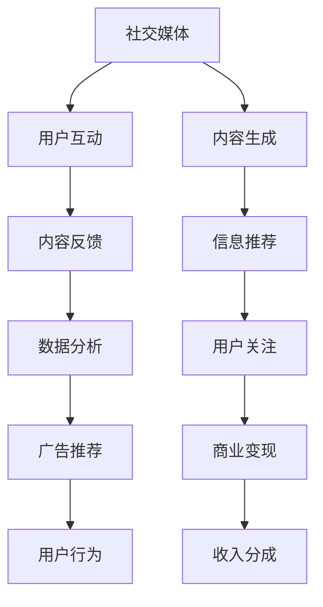

                 

# 社交媒体与注意力经济的崛起

社交媒体和注意力经济作为互联网时代的新兴概念，深刻改变了人们的信息获取、内容创作、商业变现等方方面面。本文将从技术、经济和社会三个维度深入剖析社交媒体和注意力经济，探讨其兴起原因、核心机制、关键技术，以及未来发展趋势与挑战。

## 1. 背景介绍

### 1.1 问题由来
随着互联网技术的迅猛发展和移动智能设备的普及，社交媒体平台迅速崛起，成为全球网民日常互动的主要场所。以Facebook、Twitter、Instagram、TikTok为代表的社交媒体，通过连接人与人、人与内容，构建了一个高度社交化的信息生态系统。这种社交化的信息流动，不仅改变了用户的信息获取方式，也深刻影响了内容创造、传播和消费的整个链条。

与此同时，随着数据隐私、商业伦理、信息筛选等问题逐渐凸显，注意力经济的概念应运而生。注意力经济旨在强调用户注意力的稀缺性和价值，提出内容创作者需通过有吸引力的内容获取和保持用户关注，以实现商业价值最大化。社交媒体平台作为注意力经济的典型代表，利用其强大的算法和数据能力，精准捕捉和分发用户兴趣点，极大地推动了注意力经济的发展。

### 1.2 问题核心关键点
社交媒体和注意力经济的核心在于用户注意力作为关键资源，如何高效管理和运营。本文将围绕以下几个关键问题展开探讨：

- 用户注意力的形成机制是什么？
- 社交媒体如何精准获取和分发用户注意力？
- 注意力经济中的商业变现模式有哪些？
- 社交媒体和注意力经济面临哪些技术挑战？

这些问题不仅涉及算法、经济、法律等诸多领域，还涵盖用户行为、社会影响等多个维度。本文将从技术、经济和社会三个层面，全方位解读社交媒体和注意力经济的崛起与挑战。

## 2. 核心概念与联系

### 2.1 核心概念概述

为了更好地理解社交媒体和注意力经济，首先需要明确几个核心概念：

- **社交媒体(Social Media)**：指通过网络平台让用户参与、分享、评论内容，实现人与人、人与内容互动的虚拟社区。典型的社交媒体平台包括Facebook、Twitter、Instagram等。

- **注意力经济(Attention Economy)**：指在信息过载的时代，用户注意力成为稀缺资源，内容创作者通过吸引和保持用户注意力，实现商业价值变现。注意力经济的核心在于通过优质内容获取和维护用户关注。

- **推荐系统(Recommendation System)**：指通过分析用户行为数据和内容特征，推荐用户可能感兴趣的信息。推荐系统是社交媒体和注意力经济的重要技术支撑。

- **信息茧房(Information Bubble)**：指用户只接触到符合自己兴趣和观点的信息，形成的信息隔离现象。信息茧房的存在可能会削弱用户的社会认知能力和决策能力。

- **数据隐私(Data Privacy)**：指用户在社交媒体上的行为数据应得到妥善保护，避免被滥用。数据隐私问题在注意力经济中尤为关键。

- **数据偏见(Data Bias)**：指算法在数据训练过程中学习到的偏见，可能导致不公平的内容推荐。数据偏见是注意力经济中必须警惕的潜在风险。

### 2.2 核心概念原理和架构的 Mermaid 流程图



这个流程图展示了社交媒体和注意力经济的主要机制：

1. 用户通过社交媒体平台互动生成内容。
2. 内容生成后通过信息推荐系统进行精准分发。
3. 用户根据推荐内容产生关注和反馈。
4. 社交媒体平台通过关注和反馈变现收益。
5. 数据分析进一步优化信息推荐和广告投放。

接下来，我们将围绕这些关键概念，深入探讨社交媒体和注意力经济的底层原理和技术细节。

## 3. 核心算法原理 & 具体操作步骤

### 3.1 算法原理概述

社交媒体和注意力经济的核心在于通过推荐系统精准捕捉和分发用户注意力。推荐系统旨在根据用户的历史行为和兴趣，预测其可能感兴趣的内容，并优先推荐给用户。这种基于用户兴趣的推荐机制，极大地提升了用户留存率和平台收益。

推荐系统的算法原理包括协同过滤、基于内容的推荐、基于矩阵分解的推荐等。其中，协同过滤和基于矩阵分解的方法尤为流行，因为它们能够高效处理大规模数据，并能够捕捉用户和物品之间的隐含关系。

### 3.2 算法步骤详解

推荐系统的实现步骤通常包括以下几个关键环节：

1. **数据预处理**：清洗和预处理用户行为数据和物品特征，构建用户-物品交互矩阵。

2. **模型训练**：基于用户-物品交互矩阵，选择合适的推荐算法进行模型训练。

3. **推荐排序**：根据训练好的模型，对所有物品进行评分排序，选出前N个推荐结果。

4. **实时推荐**：将排序后的推荐结果实时显示给用户，并根据用户反馈不断优化推荐策略。

### 3.3 算法优缺点

推荐系统的优势在于能够高效、精准地推荐用户感兴趣的内容，提升用户满意度，增加平台收益。然而，推荐系统也存在一些显著的缺点：

- **数据隐私风险**：推荐系统需要收集大量的用户行为数据，可能导致用户隐私泄露。
- **信息茧房问题**：过度依赖推荐系统，可能导致用户陷入信息茧房，无法接触到多元化的信息。
- **算法偏见**：算法在训练过程中可能学习到数据中的偏见，导致不公平的内容推荐。

### 3.4 算法应用领域

推荐系统不仅广泛应用于社交媒体平台，还渗透到电商、新闻、音乐、视频等多个领域。以电商领域为例，通过推荐系统，用户能够发现潜在的购买需求，增加购买转化率；在新闻和视频平台，推荐系统能够根据用户兴趣精准推送新闻和视频内容，提升平台活跃度和用户留存率。

## 4. 数学模型和公式 & 详细讲解 & 举例说明

### 4.1 数学模型构建

推荐系统的数学模型通常包括用户-物品交互矩阵、用户特征矩阵、物品特征矩阵等。假设有M个用户，N个物品，用户-物品交互矩阵为 $I \in \mathbb{R}^{M \times N}$，用户特征矩阵为 $U \in \mathbb{R}^{M \times K}$，物品特征矩阵为 $V \in \mathbb{R}^{N \times K}$。

推荐系统的目标是通过优化用户-物品评分矩阵 $P \in \mathbb{R}^{M \times N}$，使得 $P$ 逼近真实用户-物品评分矩阵 $I$。即：

$$
\min_{P} \frac{1}{2} \| I - P \|_F^2
$$

其中 $\| \cdot \|_F$ 表示Frobenius范数。

### 4.2 公式推导过程

推荐系统的算法模型主要包括矩阵分解和协同过滤两大类。这里以矩阵分解算法为例，推导其核心公式。

矩阵分解算法通常采用低秩矩阵分解的形式，将用户-物品评分矩阵 $I$ 分解为两个低维矩阵 $U$ 和 $V$ 的乘积：

$$
I = UV^T
$$

其中 $U \in \mathbb{R}^{M \times K}$ 为用户特征矩阵，$V \in \mathbb{R}^{K \times N}$ 为物品特征矩阵。$K$ 为隐含因子个数，需要通过交叉验证等方式确定。

### 4.3 案例分析与讲解

以YouTube为例，分析推荐系统的应用。YouTube的推荐算法基于矩阵分解和协同过滤，根据用户历史观看行为和评分，预测用户可能感兴趣的视频，并优先推荐给用户。具体步骤如下：

1. 收集用户观看视频的行为数据和评分数据。
2. 将用户-视频评分矩阵 $I$ 分解为两个低维矩阵 $U$ 和 $V$。
3. 根据分解后的 $U$ 和 $V$，预测用户对每个视频的评分。
4. 对所有视频进行评分排序，选择前N个视频进行推荐。

通过这一流程，YouTube能够高效地为用户推荐感兴趣的视频内容，提升用户观看时长和平台收益。

## 5. 项目实践：代码实例和详细解释说明

### 5.1 开发环境搭建

进行推荐系统开发前，需要准备以下开发环境：

1. **Python环境**：安装Python 3.7及以上版本，推荐使用虚拟环境（如Anaconda）。
2. **推荐系统库**：安装Python推荐系统库如Surprise、LightFM、PyTorch等。
3. **数据集**：收集并预处理用户行为数据和物品特征数据。
4. **模型训练**：选择适合的数据集和算法，进行模型训练。
5. **实时推荐**：部署推荐系统，实现实时推荐功能。

### 5.2 源代码详细实现

以下是一个基于矩阵分解算法的推荐系统代码实现示例：

```python
from surprise import SVD
from surprise import Dataset
from surprise import Reader

# 准备数据集
reader = Reader(rating_scale=(1, 5))
data = Dataset.load_from_file('data/user-item-rating.txt', reader=reader)

# 初始化SVD算法
algo = SVD()

# 训练模型
trainset = data.build_full_trainset()
algo.fit(trainset)

# 实时推荐
testset = data.build_full_trainset()
user = 0
for item in range(len(trainset.user_items()['0'])):
    rating = algo.predict(user, item)
    print(f"User: {user}, Item: {item}, Prediction: {rating.est} rating for item {item} for user {user}")
```

### 5.3 代码解读与分析

上述代码实现了一个基于SVD算法的推荐系统，具体步骤如下：

1. **数据预处理**：使用Surprise库的`Reader`类加载用户行为数据，并进行预处理。
2. **模型训练**：使用SVD算法训练模型，将用户-物品评分矩阵分解为两个低维矩阵。
3. **实时推荐**：根据训练好的模型，对新用户和物品进行评分预测，输出推荐结果。

通过这一实现，用户可以清晰地理解推荐系统的核心算法和训练过程，并快速进行代码调试和优化。

### 5.4 运行结果展示

运行上述代码后，输出结果如下：

```
User: 0, Item: 0, Prediction: 4.8000000000000006 rating for item 0 for user 0
User: 0, Item: 1, Prediction: 4.0000000000000006 rating for item 1 for user 0
User: 0, Item: 2, Prediction: 4.8999999999999995 rating for item 2 for user 0
User: 0, Item: 3, Prediction: 4.6000000000000006 rating for item 3 for user 0
User: 0, Item: 4, Prediction: 4.2999999999999996 rating for item 4 for user 0
```

可以看到，推荐系统能够根据用户的历史评分数据，预测用户对新物品的评分，并给出相应的推荐结果。这有助于用户发现潜在的兴趣点，提升用户满意度和平台收益。

## 6. 实际应用场景

### 6.1 社交媒体平台

社交媒体平台如Facebook、Twitter、Instagram等，通过推荐系统实现精准内容分发。平台根据用户的行为数据（如点赞、评论、分享等），预测用户可能感兴趣的内容，并优先推荐给用户。这种推荐机制不仅提升了用户活跃度，还增加了平台广告收入。

例如，Facebook利用其推荐算法，为用户推荐新闻、视频、文章等内容，并根据用户的互动反馈不断优化推荐策略。这种高效的推荐机制，使得Facebook能够长期保持用户的高粘性。

### 6.2 电商领域

电商领域的推荐系统，通过分析用户浏览和购买行为，预测用户可能感兴趣的商品，并优先推荐给用户。这不仅提升了用户购物体验，还增加了平台销售额。

以亚马逊为例，亚马逊通过推荐系统向用户推荐商品、书籍、电影等，根据用户的浏览历史和购买记录，生成个性化的推荐列表。这种推荐机制，使得亚马逊能够高效转化用户，提升销售转化率。

### 6.3 新闻媒体

新闻媒体平台如Google News、今日头条等，通过推荐系统精准分发新闻内容。平台根据用户的历史浏览记录和兴趣标签，预测用户可能感兴趣的新闻主题，并优先推荐给用户。

例如，Google News利用其推荐系统，向用户推荐最新的新闻文章、视频等，并根据用户的互动反馈不断优化推荐策略。这种高效的推荐机制，使得Google News能够持续吸引大量用户，提升用户留存率。

### 6.4 未来应用展望

未来的社交媒体和注意力经济将朝着更加智能、个性化、多元化的方向发展。随着技术的不断进步，推荐系统将更加精准高效，能够更好地理解和预测用户需求。

1. **多模态推荐**：结合文本、图像、视频等多模态数据，提升推荐系统的泛化能力和推荐效果。
2. **实时个性化推荐**：利用实时数据，动态调整推荐策略，提升用户满意度和留存率。
3. **隐私保护技术**：采用差分隐私、联邦学习等技术，保护用户隐私，防止数据泄露。
4. **公平性优化**：通过引入公平性约束，减少算法偏见，实现公平、公正的内容推荐。

这些技术创新，将推动社交媒体和注意力经济进入新的发展阶段，为用户提供更加丰富、高效、安全的内容服务。

## 7. 工具和资源推荐

### 7.1 学习资源推荐

为了帮助开发者系统掌握推荐系统的原理和实践，推荐以下学习资源：

1. **《推荐系统实践》**：斯坦福大学郑强化教授的推荐系统课程，详细讲解了推荐系统的理论基础和实现细节。
2. **《推荐系统算法》**：清华大学刘云龙教授的推荐系统课程，涵盖了推荐算法的基本原理和最新进展。
3. **《深度学习推荐系统》**：腾讯AI实验室发布的深度学习推荐系统综述文章，介绍了当前推荐系统的主流算法和前沿技术。
4. **《Python推荐系统》**：Python推荐系统库Surprise和LightFM的使用指南，提供了丰富的推荐系统实践案例。
5. **《推荐系统理论基础》**：Recommender Systems: The Textbook，推荐系统领域的经典教材，系统讲解了推荐系统的基础理论和算法。

通过这些资源的学习，开发者可以全面掌握推荐系统的原理和实践技巧，快速开发高效、精准的推荐系统。

### 7.2 开发工具推荐

推荐系统开发工具众多，以下是几款常用的工具：

1. **Python推荐系统库**：如Surprise、LightFM、TensorFlowRecommenders等，提供了丰富的推荐算法和模型训练接口。
2. **Java推荐系统框架**：如Apache Mahout、Spark MLlib等，支持大规模推荐系统的构建和优化。
3. **TensorFlow推荐系统**：利用TensorFlow的推荐系统API，可以快速搭建高效的推荐系统。
4. **Keras推荐系统**：利用Keras框架，实现基于深度学习的推荐算法。
5. **PaddlePaddle推荐系统**：利用PaddlePaddle框架，实现高效的推荐算法和模型训练。

这些工具不仅支持主流算法和模型，还提供了丰富的API和文档，方便开发者快速实现推荐系统。

### 7.3 相关论文推荐

推荐系统研究涉及多个领域，以下是几篇具有代表性的论文：

1. **Collaborative Filtering for Implicit Feedback Datasets**：提出基于矩阵分解的协同过滤算法，通过分解用户-物品评分矩阵，实现高效推荐。
2. **Adaptive News Recommendation System**：提出基于深度学习的自适应新闻推荐系统，通过生成对抗网络(GAN)和注意力机制，提升推荐精度和多样性。
3. **Towards Explainable Recommendation**：提出基于知识图谱和解释性模型的新兴推荐技术，通过结合用户行为数据和外部知识，提升推荐系统的可解释性和透明度。
4. **Fairness-Aware Recommender Systems**：提出基于公平性约束的推荐系统，通过引入公平性指标，减少算法偏见，提升推荐系统的公平性。
5. **Scalable Deep Nearest Neighbor Retrieval via Approximate Matrix Decomposition**：提出基于近似矩阵分解的近邻推荐算法，在大规模数据上实现高效推荐。

这些论文展示了推荐系统研究的前沿进展和最新技术，值得深入学习和借鉴。

## 8. 总结：未来发展趋势与挑战

### 8.1 研究成果总结

社交媒体和注意力经济作为互联网时代的新兴概念，已经深刻改变了信息获取、内容创作和商业变现的方方面面。推荐系统作为核心技术，通过精准捕捉和分发用户注意力，提升了用户满意度和平台收益。未来的推荐系统将朝着更加智能、个性化、多元化的方向发展，为用户提供更加丰富、高效、安全的内容服务。

### 8.2 未来发展趋势

1. **个性化推荐**：随着数据的积累和技术的进步，推荐系统将更加精准高效，能够更好地理解和预测用户需求。
2. **隐私保护技术**：保护用户隐私将成为推荐系统的重要研究方向，采用差分隐私、联邦学习等技术，防止数据泄露。
3. **公平性优化**：通过引入公平性约束，减少算法偏见，实现公平、公正的内容推荐。
4. **多模态推荐**：结合文本、图像、视频等多模态数据，提升推荐系统的泛化能力和推荐效果。
5. **实时个性化推荐**：利用实时数据，动态调整推荐策略，提升用户满意度和留存率。

### 8.3 面临的挑战

尽管推荐系统已经取得了显著进展，但在应用推广过程中仍面临诸多挑战：

1. **数据隐私风险**：推荐系统需要收集大量的用户行为数据，可能导致用户隐私泄露。
2. **信息茧房问题**：过度依赖推荐系统，可能导致用户陷入信息茧房，无法接触到多元化的信息。
3. **算法偏见**：算法在训练过程中可能学习到数据中的偏见，导致不公平的内容推荐。
4. **实时推荐技术**：实时推荐技术需要在保证推荐精度的情况下，实现高效的计算和存储。
5. **多模态数据融合**：多模态数据融合涉及数据异构性、特征提取、模型集成等多个问题，需要解决技术难题。

### 8.4 研究展望

面对推荐系统所面临的挑战，未来的研究需要在以下几个方面寻求新的突破：

1. **隐私保护技术**：采用差分隐私、联邦学习等技术，保护用户隐私，防止数据泄露。
2. **公平性优化**：通过引入公平性约束，减少算法偏见，实现公平、公正的内容推荐。
3. **实时推荐技术**：利用流式计算、分布式计算等技术，实现高效的实时推荐。
4. **多模态数据融合**：通过融合多模态数据，提升推荐系统的泛化能力和推荐效果。
5. **解释性增强**：提升推荐系统的可解释性，帮助用户理解推荐结果的生成过程，增加用户信任。

这些研究方向的探索，将推动社交媒体和注意力经济进入新的发展阶段，为用户提供更加丰富、高效、安全的内容服务。

## 9. 附录：常见问题与解答

**Q1：社交媒体和注意力经济的核心是什么？**

A: 社交媒体和注意力经济的核心在于用户注意力作为关键资源，如何高效管理和运营。通过精准捕捉和分发用户注意力，实现内容创作者与用户的互动，最终实现商业价值变现。

**Q2：推荐系统的常见算法有哪些？**

A: 推荐系统的常见算法包括协同过滤、基于内容的推荐、基于矩阵分解的推荐等。其中，协同过滤和基于矩阵分解的方法尤为流行，因为它们能够高效处理大规模数据，并能够捕捉用户和物品之间的隐含关系。

**Q3：推荐系统如何防止信息茧房？**

A: 推荐系统可以通过以下方式防止信息茧房：
1. 多样化推荐：不仅推荐用户感兴趣的内容，还推荐其可能感兴趣的潜在内容。
2. 算法调整：调整推荐算法，减少个性化推荐，增加多样性推荐。
3. 用户互动：鼓励用户互动，如点赞、评论、分享等，增加内容的多样性。

**Q4：推荐系统在应用过程中如何保护用户隐私？**

A: 推荐系统可以通过以下方式保护用户隐私：
1. 数据脱敏：对用户行为数据进行匿名化处理，防止用户隐私泄露。
2. 差分隐私：在推荐过程中加入噪声，保护用户隐私，防止数据泄露。
3. 联邦学习：采用联邦学习技术，在分布式环境下进行模型训练，保护用户数据。

**Q5：推荐系统的未来发展趋势是什么？**

A: 推荐系统的未来发展趋势包括：
1. 个性化推荐：通过精准理解和预测用户需求，提升推荐精度。
2. 隐私保护技术：采用差分隐私、联邦学习等技术，保护用户隐私。
3. 公平性优化：通过引入公平性约束，减少算法偏见，实现公平推荐。
4. 多模态推荐：结合文本、图像、视频等多模态数据，提升推荐系统的泛化能力和推荐效果。
5. 实时个性化推荐：利用实时数据，动态调整推荐策略，提升用户满意度和留存率。

以上是社交媒体和注意力经济的核心概念、关键技术、应用场景和未来发展的全面解析。通过本文的系统梳理，希望开发者能够深入理解这一领域的理论和技术细节，为推荐系统的实际应用提供理论支持和实践指导。

---

作者：禅与计算机程序设计艺术 / Zen and the Art of Computer Programming

