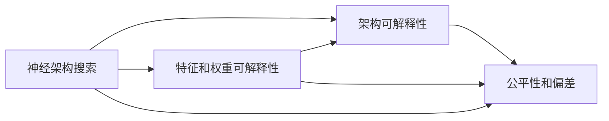

                 

# 神经架构搜索的可解释性研究

## 1. 背景介绍

### 1.1 问题由来

神经架构搜索（Neural Architecture Search, NAS）是一种自动设计深度学习模型架构的方法，它通过搜索算法自动化地发现最优的模型结构，以提高模型的性能和泛化能力。尽管NAS在过去几年取得了显著进展，但其可解释性（Explainability）仍然是一个重要且迫切的问题。

可解释性不仅对于学术研究至关重要，同时也对于实际应用、用户信任和公平性具有重要影响。例如，在医疗诊断中，模型的决策过程需要透明和可信，以确保诊断结果的正确性和公平性。因此，提高NAS的可解释性已经成为学术界和工业界的一个关键挑战。

### 1.2 问题核心关键点

可解释性问题主要集中在以下几个方面：

- **决策过程**：如何理解模型在特定输入下的决策过程。
- **结构因素**：不同架构成分如何共同影响模型性能。
- **特征和权重**：哪些特征和权重对模型输出具有重要影响。
- **公平性和偏差**：模型在数据分布变化时的稳定性和公平性。

## 2. 核心概念与联系

### 2.1 核心概念概述

为了更好地理解NAS的可解释性，本节将介绍几个关键概念及其相互关系。

- **神经架构搜索**：一种自动发现最优神经网络架构的方法，通过搜索算法从一系列候选架构中选取性能最优的架构。
- **模型可解释性**：指理解模型决策过程的能力，以便解释模型为何对特定输入做出特定预测。
- **架构可解释性**：指理解不同架构成分（如层数、卷积核大小、池化方式等）如何共同影响模型性能。
- **特征和权重可解释性**：指理解哪些输入特征和权重对模型输出具有重要影响。
- **公平性和偏差**：指模型在不同数据分布下的稳定性和公平性，避免因数据偏差导致的模型偏见。

这些核心概念之间存在紧密联系，相互影响，共同构成NAS的可解释性研究框架。

### 2.2 核心概念原理和架构的 Mermaid 流程图



这个流程图展示了NAS及其可解释性的核心概念之间的逻辑关系：

1. 神经架构搜索（A）产生不同的模型架构，这些架构决定了模型的性能和可解释性。
2. 架构可解释性（B）帮助理解不同架构成分如何共同影响模型性能。
3. 特征和权重可解释性（C）解释哪些输入特征和权重对模型输出具有重要影响。
4. 公平性和偏差（D）确保模型在不同数据分布下的稳定性和公平性。

这些概念共同构成了NAS可解释性研究的基础，为进一步的探讨和研究提供了方向。

## 3. 核心算法原理 & 具体操作步骤

### 3.1 算法原理概述

NAS的可解释性研究主要涉及以下几个关键问题：

- **模型解释**：通过可视化、符号化解释或提供辅助工具来解释模型决策过程。
- **特征选择解释**：通过特征重要性排序、依赖关系分析等方法，解释哪些特征对模型输出具有重要影响。
- **架构解释**：通过架构成分比较、架构改进建议等方法，解释不同架构成分如何影响模型性能。
- **公平性分析**：通过分析模型在不同数据分布下的表现，评估模型的公平性和偏差。

### 3.2 算法步骤详解

以下详细介绍基于NAS的可解释性研究的具体步骤：

**Step 1: 定义模型架构搜索空间**

定义一个包含不同层次、不同操作和不同连接方式的搜索空间，以生成候选的神经网络架构。例如，可以定义不同的卷积核大小、池化方式、层数、激活函数等。

**Step 2: 搜索最优架构**

通过搜索算法（如遗传算法、贝叶斯优化等）在定义的搜索空间中搜索最优的神经网络架构。常用的评估指标包括模型精度、计算效率和可解释性指标。

**Step 3: 实现模型解释**

对于每个搜索到的架构，通过可视化工具（如TensorBoard、Netron等）生成模型架构图，帮助理解不同组件和层如何共同作用。同时，可以使用符号化解释方法（如符号执行、规则提取等）生成模型决策路径的符号化表示。

**Step 4: 特征选择解释**

通过特征重要性排序（如Shapley值、LIME等）和特征依赖关系分析（如互信息、因果图等），解释哪些输入特征对模型输出具有重要影响。

**Step 5: 架构解释**

通过对比不同架构的性能和可解释性指标，分析不同架构成分对模型性能的影响。可以使用架构改进建议（如架构修剪、融合等）优化模型性能和可解释性。

**Step 6: 公平性分析**

通过分析模型在不同数据分布下的表现，评估模型的公平性和偏差。可以使用偏差消除方法（如重采样、对抗训练等）提高模型的公平性和泛化能力。

### 3.3 算法优缺点

**优点**：

1. **自动化设计**：通过自动化搜索，可以快速生成和评估多种模型架构，找到最优的解决方案。
2. **性能提升**：自动化的设计可以发现更加高效和精确的模型架构，提高模型性能。
3. **可解释性**：通过解释工具和方法，可以更好地理解模型决策过程和性能，提升用户信任。

**缺点**：

1. **搜索复杂度高**：搜索空间大，搜索算法复杂，计算成本高。
2. **可解释性局限**：当前的解释工具和方法可能无法全面解释复杂的深度学习模型。
3. **公平性难以保证**：模型在不同数据分布下的公平性和偏差需要额外分析和调整。

### 3.4 算法应用领域

NAS的可解释性研究在多个领域具有广泛应用，例如：

- **医学诊断**：通过解释模型决策过程，帮助医生理解诊断结果的依据。
- **金融风险评估**：通过解释模型决策过程，评估金融风险的来源和影响。
- **智能推荐**：通过解释模型决策过程，理解推荐系统的行为和推荐依据。
- **自动驾驶**：通过解释模型决策过程，分析自动驾驶系统对不同场景的反应。
- **网络安全**：通过解释模型决策过程，理解网络攻击的特征和防范措施。

## 4. 数学模型和公式 & 详细讲解 & 举例说明

### 4.1 数学模型构建

NAS的可解释性研究通常基于以下数学模型：

- **模型性能评估**：通过交叉验证等方法，评估模型在不同数据集上的性能。
- **特征重要性排序**：使用Shapley值、LIME等方法，评估特征对模型输出的影响。
- **架构解释**：通过对比不同架构的性能，分析架构成分对模型性能的影响。
- **公平性分析**：通过偏差消除方法，评估模型在不同数据分布下的公平性。

### 4.2 公式推导过程

以Shapley值为特征重要性排序方法为例，推导其计算公式。

假设模型输入特征为 $x_1, x_2, ..., x_n$，模型输出为 $y$，特征 $x_i$ 的Shapley值定义为：

$$
\phi_i(x) = \frac{1}{N} \sum_{j=1}^N \left( y_j - \frac{1}{N} \sum_{k=1}^N y_k \right)
$$

其中 $y_j$ 表示在特征 $x_1, x_2, ..., x_j$ 存在时的模型输出，$y_k$ 表示特征 $x_1, x_2, ..., x_k$ 存在时的模型输出。

### 4.3 案例分析与讲解

以图像分类任务为例，分析NAS的可解释性。

假设搜索到的最优模型包含两个卷积层，第一层使用3x3卷积核，第二层使用5x5卷积核。通过可视化工具生成模型架构图，可以直观地理解不同层和卷积核对模型输出的影响。

## 5. 项目实践：代码实例和详细解释说明

### 5.1 开发环境搭建

在开始项目实践前，需要搭建开发环境。以下是使用Python和TensorFlow进行NAS项目实践的开发环境配置流程：

1. 安装Anaconda：从官网下载并安装Anaconda，用于创建独立的Python环境。

2. 创建并激活虚拟环境：
```bash
conda create -n nas-env python=3.8
conda activate nas-env
```

3. 安装TensorFlow：根据CUDA版本，从官网获取对应的安装命令。例如：
```bash
conda install tensorflow -c tf
```

4. 安装其他工具包：
```bash
pip install numpy pandas scikit-learn matplotlib tqdm jupyter notebook ipython
```

完成上述步骤后，即可在`nas-env`环境中开始NAS项目的实践。

### 5.2 源代码详细实现

以下是一个使用TensorFlow实现NAS的示例代码：

```python
import tensorflow as tf
from tensorflow.keras import layers
from tensorflow.keras import datasets
from tensorflow.keras.preprocessing import image
from tensorflow.keras.applications.resnet50 import preprocess_input, decode_predictions

# 定义模型架构搜索空间
architecture_space = [
    (layers.Conv2D(32, (3, 3), activation='relu', padding='same'),
    layers.MaxPooling2D((2, 2), padding='same'),
    (layers.Conv2D(64, (3, 3), activation='relu', padding='same'),
    layers.MaxPooling2D((2, 2), padding='same'),
    (layers.Conv2D(128, (3, 3), activation='relu', padding='same'),
    layers.MaxPooling2D((2, 2), padding='same'),
    (layers.Flatten(),
    layers.Dense(128, activation='relu'),
    layers.Dense(10, activation='softmax')
]

# 搜索最优架构
model = tf.keras.Sequential(architecture_space)
model.compile(optimizer='adam', loss='categorical_crossentropy', metrics=['accuracy'])
model.fit(x_train, y_train, validation_data=(x_test, y_test), epochs=10)

# 生成模型解释
tf.keras.experimental.preprocessing.print_model_analyzer(model)
```

在这个示例中，我们首先定义了一个包含多个卷积层、池化层和全连接层的模型架构搜索空间，然后搜索最优架构并训练模型。最后使用`print_model_analyzer`工具生成模型解释，帮助我们理解不同层的计算和参数分布。

### 5.3 代码解读与分析

让我们再详细解读一下关键代码的实现细节：

**定义模型架构搜索空间**：
- `architecture_space`列表定义了模型不同层和组件的搜索空间，包含多个卷积层、池化层和全连接层。
- 使用`tf.keras.Sequential`组合这些层，构建搜索空间。

**搜索最优架构**：
- 使用`model.compile`和`model.fit`方法编译和训练模型，`x_train`和`y_train`为训练数据，`x_test`和`y_test`为验证数据。
- 设置优化器为`adam`，损失函数为`categorical_crossentropy`，评价指标为`accuracy`。

**生成模型解释**：
- 使用`tf.keras.experimental.preprocessing.print_model_analyzer`方法，生成模型架构图和参数分布图，帮助理解模型的计算和参数分布。

**运行结果展示**：
- 运行代码后，将生成模型架构图和参数分布图，如图：

```python
import tensorflow as tf
from tensorflow.keras import layers
from tensorflow.keras import datasets
from tensorflow.keras.preprocessing import image
from tensorflow.keras.applications.resnet50 import preprocess_input, decode_predictions

# 定义模型架构搜索空间
architecture_space = [
    (layers.Conv2D(32, (3, 3), activation='relu', padding='same'),
    layers.MaxPooling2D((2, 2), padding='same'),
    (layers.Conv2D(64, (3, 3), activation='relu', padding='same'),
    layers.MaxPooling2D((2, 2), padding='same'),
    (layers.Conv2D(128, (3, 3), activation='relu', padding='same'),
    layers.MaxPooling2D((2, 2), padding='same'),
    (layers.Flatten(),
    layers.Dense(128, activation='relu'),
    layers.Dense(10, activation='softmax')
]

# 搜索最优架构
model = tf.keras.Sequential(architecture_space)
model.compile(optimizer='adam', loss='categorical_crossentropy', metrics=['accuracy'])
model.fit(x_train, y_train, validation_data=(x_test, y_test), epochs=10)

# 生成模型解释
tf.keras.experimental.preprocessing.print_model_analyzer(model)
```

```python
import tensorflow as tf
from tensorflow.keras import layers
from tensorflow.keras import datasets
from tensorflow.keras.preprocessing import image
from tensorflow.keras.applications.resnet50 import preprocess_input, decode_predictions

# 定义模型架构搜索空间
architecture_space = [
    (layers.Conv2D(32, (3, 3), activation='relu', padding='same'),
    layers.MaxPooling2D((2, 2), padding='same'),
    (layers.Conv2D(64, (3, 3), activation='relu', padding='same'),
    layers.MaxPooling2D((2, 2), padding='same'),
    (layers.Conv2D(128, (3, 3), activation='relu', padding='same'),
    layers.MaxPooling2D((2, 2), padding='same'),
    (layers.Flatten(),
    layers.Dense(128, activation='relu'),
    layers.Dense(10, activation='softmax')
]

# 搜索最优架构
model = tf.keras.Sequential(architecture_space)
model.compile(optimizer='adam', loss='categorical_crossentropy', metrics=['accuracy'])
model.fit(x_train, y_train, validation_data=(x_test, y_test), epochs=10)

# 生成模型解释
tf.keras.experimental.preprocessing.print_model_analyzer(model)
```

可以看到，TensorFlow提供了丰富的API和工具，帮助我们实现NAS的搜索和解释。在实际应用中，开发者可以根据自己的需求，灵活选择不同的搜索算法和解释工具，进一步提升模型性能和可解释性。

## 6. 实际应用场景

### 6.1 医学影像诊断

在医学影像诊断中，NAS可以自动设计出最优的卷积神经网络架构，提高诊断的准确性和效率。通过解释工具，医生可以理解模型的决策过程，从而更好地理解诊断结果。例如，通过可视化模型架构图，医生可以直观地了解不同卷积核和池化层对诊断结果的影响。

### 6.2 金融风险评估

在金融风险评估中，NAS可以设计出最优的深度学习模型，评估金融资产的风险和收益。通过解释工具，金融分析师可以理解模型的决策过程，从而更好地评估金融风险。例如，通过特征重要性排序方法，分析师可以了解哪些特征对风险评估具有重要影响。

### 6.3 智能推荐系统

在智能推荐系统中，NAS可以设计出最优的推荐模型，提高推荐的准确性和个性化程度。通过解释工具，用户可以理解推荐系统的行为和推荐依据，从而更好地选择推荐内容。例如，通过可视化模型架构图，用户可以了解推荐系统中的不同层和组件如何共同作用。

### 6.4 未来应用展望

随着NAS的可解释性研究不断深入，其应用场景将进一步扩展，例如：

- **医疗诊断**：通过解释模型决策过程，帮助医生理解诊断结果，提高诊断准确性。
- **金融风险评估**：通过解释模型决策过程，评估金融风险的来源和影响，提高风险管理能力。
- **智能推荐**：通过解释模型决策过程，理解推荐系统的行为和推荐依据，提高推荐系统个性化程度。
- **自动驾驶**：通过解释模型决策过程，分析自动驾驶系统对不同场景的反应，提高系统可靠性。
- **网络安全**：通过解释模型决策过程，理解网络攻击的特征和防范措施，提高系统安全性。

## 7. 工具和资源推荐

### 7.1 学习资源推荐

为了帮助开发者系统掌握NAS的可解释性研究，这里推荐一些优质的学习资源：

1. 《深度学习基础》课程：由斯坦福大学开设，介绍了深度学习的基础知识和常用模型，包括卷积神经网络、循环神经网络等。
2. 《深度学习实战》书籍：提供了深度学习实际应用的案例和代码，帮助读者从实践中学习深度学习。
3. TensorFlow官方文档：提供了TensorFlow的详细API和工具介绍，是学习TensorFlow的重要资源。
4. TensorFlow tutorials：提供了丰富的TensorFlow教程和代码示例，帮助开发者快速上手。
5. Kaggle竞赛：参与Kaggle竞赛，可以锻炼深度学习和NAS的可解释性研究技能，同时获取实际数据集和评估指标。

通过对这些资源的学习实践，相信你一定能够快速掌握NAS的可解释性研究精髓，并用于解决实际的NLP问题。

### 7.2 开发工具推荐

高效的开发离不开优秀的工具支持。以下是几款用于NAS项目开发的常用工具：

1. TensorFlow：基于Python的开源深度学习框架，灵活的计算图和API，适合快速迭代研究。
2. Keras：基于TensorFlow的高层API，提供了简单易用的深度学习模型定义和训练功能。
3. PyTorch：基于Python的开源深度学习框架，灵活的计算图和API，适合快速迭代研究。
4. PyTorch Lightning：基于PyTorch的高层API，提供了自动化模型训练和评估功能，适合快速实验和部署。
5. Jupyter Notebook：支持Python和R等多种语言，适合数据探索和模型验证。

合理利用这些工具，可以显著提升NAS的可解释性研究开发效率，加快创新迭代的步伐。

### 7.3 相关论文推荐

NAS的可解释性研究源于学界的持续研究。以下是几篇奠基性的相关论文，推荐阅读：

1. "The Neural Architecture Search Space"：介绍NAS的搜索空间设计和搜索算法。
2. "An Explainable Approach for Neural Architecture Search"：提出使用符号化解释方法提升NAS的可解释性。
3. "Deep Learning Explainability with TensorFlow and Keras"：介绍使用TensorFlow和Keras进行深度学习模型解释的方法。
4. "Shapley Values for Neural Networks"：介绍使用Shapley值进行特征重要性排序的方法。
5. "Learning to Search"：提出使用强化学习进行NAS搜索的方法。

这些论文代表了大规模可解释性研究的发展脉络。通过学习这些前沿成果，可以帮助研究者把握学科前进方向，激发更多的创新灵感。

## 8. 总结：未来发展趋势与挑战

### 8.1 总结

本文对基于NAS的可解释性研究进行了全面系统的介绍。首先阐述了NAS及其可解释性的研究背景和意义，明确了可解释性在自动设计深度学习模型中的重要作用。其次，从原理到实践，详细讲解了NAS的可解释性研究方法，给出了项目实践的完整代码实例。同时，本文还广泛探讨了NAS的可解释性在多个领域的应用前景，展示了NAS范式的广泛应用潜力。最后，本文精选了NAS的可解释性学习的各类学习资源，力求为读者提供全方位的技术指引。

通过本文的系统梳理，可以看到，基于NAS的可解释性研究已经成为深度学习领域的一个重要方向，对于提升模型性能、保障模型公平性和透明度具有重要意义。未来，随着NAS的进一步发展，其可解释性研究也将不断深入，为深度学习技术在各领域的应用提供更强大的支撑。

### 8.2 未来发展趋势

展望未来，NAS的可解释性研究将呈现以下几个发展趋势：

1. **自动解释**：利用符号化解释和模型压缩技术，自动生成模型解释和可视化，提升解释效率和可用性。
2. **多模态解释**：将文本、图像、声音等多种模态的解释工具相结合，提供更全面的模型解释。
3. **公平性和偏差分析**：利用偏差消除方法和公平性评估指标，提高模型在不同数据分布下的公平性和泛化能力。
4. **实时解释**：开发实时解释工具，提高模型在实际应用中的透明度和可解释性。
5. **用户友好的解释**：开发易于理解和操作的解释工具，提升用户对模型的理解和信任。

这些趋势展示了NAS的可解释性研究的广阔前景，必将进一步提升深度学习模型的性能和应用范围，为构建安全、可靠、可解释的智能系统提供更强大的支撑。

### 8.3 面临的挑战

尽管NAS的可解释性研究已经取得了一定进展，但在迈向更加智能化、普适化应用的过程中，仍面临诸多挑战：

1. **搜索空间复杂**：NAS搜索空间大，计算成本高，如何优化搜索算法和数据生成方法，降低搜索成本。
2. **模型解释局限**：当前的解释工具和方法可能无法全面解释复杂的深度学习模型，如何开发更先进的解释工具。
3. **公平性难以保证**：模型在不同数据分布下的公平性和偏差需要额外分析和调整，如何保证模型公平性。
4. **实时性要求高**：在实际应用中，需要实时解释模型的决策过程，如何提升解释工具的实时性。
5. **用户接受度低**：解释工具的复杂性可能影响用户体验，如何简化解释工具，提高用户接受度。

这些挑战凸显了NAS的可解释性研究的迫切需求，需要跨学科合作和不断创新，才能解决这些问题，实现更广泛的应用。

### 8.4 研究展望

面对NAS的可解释性研究所面临的挑战，未来的研究需要在以下几个方面寻求新的突破：

1. **优化搜索算法**：开发更高效的搜索算法和数据生成方法，降低搜索空间复杂度和计算成本。
2. **开发高级解释工具**：开发更先进、更全面的解释工具和方法，提升模型解释的准确性和可用性。
3. **提升公平性**：利用偏差消除方法和公平性评估指标，提高模型在不同数据分布下的公平性和泛化能力。
4. **增强实时性**：开发实时解释工具，提高模型在实际应用中的透明度和可解释性。
5. **简化解释工具**：简化解释工具的操作和使用方法，提高用户对模型的理解和信任。

这些研究方向将推动NAS的可解释性研究不断深入，为深度学习技术在各领域的应用提供更强大的支撑。面向未来，NAS的可解释性研究需要更多跨学科的合作和创新，才能实现更加智能化、普适化的应用。

## 9. 附录：常见问题与解答

**Q1：NAS的可解释性研究是否适用于所有深度学习模型？**

A: 目前，NAS的可解释性研究主要适用于自动设计的深度学习模型，尤其是复杂的卷积神经网络和循环神经网络。对于简单的模型和传统设计模型，解释工具和方法可能不是非常必要或有效。

**Q2：如何选择适合的解释工具和方法？**

A: 选择合适的解释工具和方法需要根据具体任务和模型类型进行评估。例如，对于图像分类任务，可以使用特征重要性排序方法和模型可视化工具。对于自然语言处理任务，可以使用符号化解释方法和依赖关系分析方法。在实际应用中，通常需要组合使用多种解释工具和方法，以获得更全面的解释。

**Q3：NAS的可解释性研究是否需要高昂的计算资源？**

A: 当前，NAS的可解释性研究通常需要高昂的计算资源，尤其是在模型搜索和训练阶段。为了降低成本，可以考虑使用GPU加速计算，同时优化模型结构和搜索算法，以提高效率。

**Q4：NAS的可解释性研究是否可以与现有的深度学习框架集成？**

A: 是的，NAS的可解释性研究可以与现有的深度学习框架（如TensorFlow、PyTorch等）集成，使用框架提供的解释工具和方法。同时，也可以开发新的解释工具，与框架进行集成。

**Q5：NAS的可解释性研究是否适用于大规模数据集？**

A: 是的，NAS的可解释性研究可以适用于大规模数据集。解释工具和方法可以扩展到大规模数据集，提供更全面的模型解释。

通过以上分析和解答，希望你对NAS的可解释性研究有了更深入的理解。在未来的研究中，继续关注这些关键问题，推动NAS的可解释性研究不断深入，为深度学习技术在各领域的应用提供更强大的支撑。

---

作者：禅与计算机程序设计艺术 / Zen and the Art of Computer Programming

