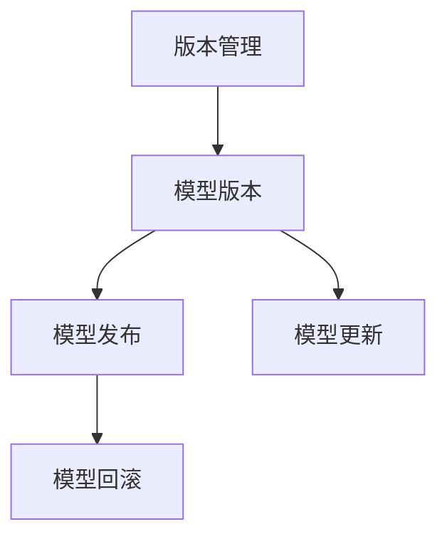

                 

## 1. 背景介绍

随着人工智能技术的快速发展，神经网络模型在各个行业的应用越来越广泛，从图像识别、自然语言处理到推荐系统，都离不开高效、准确、可解释的神经网络模型。然而，模型版本的管理也逐渐成为开发过程中的一大难题。模型版本多、更新频繁、代码庞大、更新不一致等问题，会导致模型应用和维护成本大大增加，且容易导致错误和遗漏。因此，本文将探讨如何通过科学合理地版本管理策略，保证模型版本的安全性和一致性，提升模型应用的稳定性和可维护性。

## 2. 核心概念与联系

### 2.1 核心概念概述

在讨论版本管理策略之前，我们先概述一下涉及的核心概念：

- **版本管理（Version Control）**：指在软件开发过程中，通过版本控制系统对代码、模型、文档等进行管理和维护。常见的版本控制系统包括Git、SVN等，可记录每次更新，并支持分支、合并等操作，确保开发过程的透明性和可追溯性。

- **模型版本（Model Version）**：指不同时间点上训练完成的神经网络模型，模型版本包含模型参数、训练日志、超参数设置等信息，用于指导模型应用和部署。

- **模型发布（Model Release）**：指将经过严格测试和验证的模型版本发布到生产环境，供用户使用，保障模型的生产稳定性。

- **模型更新（Model Update）**：指对现有模型版本进行优化和改进，以保证模型在新环境下的准确性和稳定性。

- **模型回滚（Model Rollback）**：指在模型发布后，由于某些原因需要将模型版本回退到之前的版本，保障模型的稳定性。

这些核心概念之间的关系可以通过以下Mermaid流程图来展示：



### 2.2 核心概念原理和架构

**版本管理原理**

版本管理的基本原理是通过时间戳、分支和标签等机制，记录每次代码或模型版本的历史变更，方便团队协作和问题追踪。典型的版本管理工具如Git，它通过“仓库”（Repository）的概念，将代码或模型文件存放在仓库中，每个文件都有一个唯一标识（即“commit”）。每次更新时，系统会生成一个新的commit，记录变更内容、作者、时间等信息，并自动与之前版本进行对比，生成变更日志。

**模型版本架构**

模型版本架构主要包括以下几个部分：

- **版本记录（Version Record）**：记录每个版本的时间戳、作者、变更内容等信息。
- **模型文件（Model File）**：存储每个版本的具体模型参数、配置文件等。
- **训练日志（Training Log）**：记录模型训练的详细信息，包括训练轮数、超参数设置、验证集误差等。
- **模型发布（Model Release）**：记录每个版本的发布信息和发布日志，包括发布时间、负责人、发布后的应用情况等。

**模型发布与回滚**

模型发布是指将经过测试的模型版本发布到生产环境，供用户使用。模型发布时，需要生成新的模型发布记录，并更新发布日志。模型回滚是指在模型发布后发现问题，需要将模型版本回退到之前的版本，以保障生产稳定性。模型回滚时，需要找到最近的有效版本，重新发布到生产环境，并更新回滚记录。

## 3. 核心算法原理 & 具体操作步骤

### 3.1 算法原理概述

模型版本管理的基本原理是记录每次模型的训练和发布历史，通过版本控制系统（如Git）进行管理和维护。版本控制系统提供了时间戳、分支和标签等机制，方便记录每个版本的历史变更。模型版本架构则将模型参数、配置文件和训练日志等存储在版本记录中，确保模型版本的完整性和一致性。

### 3.2 算法步骤详解

模型版本管理的具体操作步骤如下：

1. **初始化版本控制库**：在项目根目录下初始化Git仓库，并设置版本控制系统。

2. **记录模型训练过程**：每次训练完成后，将模型参数、配置文件和训练日志等保存到版本记录中，并生成新的commit。

3. **创建分支进行模型开发**：在Git中创建新的分支进行模型开发，在新分支上进行模型优化、调试等工作，确保模型开发过程的独立性和可追溯性。

4. **合并分支进行模型发布**：将开发完成的模型合并到主分支，并进行全面的测试和验证。测试通过后，将模型发布到生产环境，并更新发布记录。

5. **管理模型更新和回滚**：通过版本控制系统的标签和分支管理机制，记录每次模型更新和发布的历史，并在必要时进行回滚。

### 3.3 算法优缺点

**优点**：

- 通过版本控制系统记录每次模型版本的变更历史，确保模型的完整性和一致性。
- 支持分支和标签管理，方便团队协作和模型开发。
- 支持模型发布和回滚，保障模型的生产稳定性和可追溯性。

**缺点**：

- 版本控制系统的学习成本较高，需要团队成员掌握基本的版本控制技能。
- 版本记录和变更日志较多，可能会导致版本库过大，影响开发和维护效率。
- 如果模型更新频繁，可能会增加版本管理的复杂度。

### 3.4 算法应用领域

模型版本管理技术广泛应用于以下几个领域：

- **软件开发**：在软件开发过程中，版本管理技术可以记录每次代码变更的历史，方便团队协作和问题追踪。
- **机器学习项目**：在机器学习项目中，版本管理技术可以记录每次模型训练和发布的历史，确保模型版本的稳定性和可追溯性。
- **数据分析项目**：在数据分析项目中，版本管理技术可以记录每次数据集和分析模型的历史，确保数据和模型的可靠性。
- **测试自动化**：在测试自动化项目中，版本管理技术可以记录每次测试用例和测试结果的历史，方便测试用例的管理和维护。

## 4. 数学模型和公式 & 详细讲解 & 举例说明

### 4.1 数学模型构建

模型版本管理的数学模型主要涉及版本控制系统和模型架构的记录和管理。通过时间戳、分支和标签等机制，记录每次模型版本的变更历史，确保模型版本的完整性和一致性。

### 4.2 公式推导过程

假设模型版本控制系统的状态为$S_t$，其中$t$表示时间。每次更新时，状态从$S_t$变为$S_{t+1}$，具体更新规则如下：

1. 时间戳更新：$S_{t+1}=\{t+1, S_t\}$。
2. 分支更新：$S_{t+1}=\{S_t, B_t\}$。
3. 标签更新：$S_{t+1}=\{S_t, L_t\}$。

其中$B_t$和$L_t$分别表示当前分支和标签的状态。

### 4.3 案例分析与讲解

假设一个机器学习项目中，有多个团队同时进行模型开发。每个团队通过Git进行版本管理。当团队A在模型优化过程中，需要将新的参数更新到模型版本中。具体步骤为：

1. 团队A创建一个新的分支，开始模型优化工作。
2. 每次模型优化完成后，团队A将新参数保存到当前分支的版本记录中，并生成新的commit。
3. 团队A将优化后的模型参数合并到主分支中，并进行全面的测试和验证。
4. 如果测试通过，团队A将模型发布到生产环境，并更新发布记录。

通过这种模型版本管理方式，可以确保每个团队的工作独立进行，并且每次变更都有记录，方便问题追踪和版本回滚。

## 5. 项目实践：代码实例和详细解释说明

### 5.1 开发环境搭建

在进行模型版本管理时，需要先搭建开发环境。以下是使用Git进行版本控制的基本步骤：

1. 在项目根目录下安装Git：
```bash
git --version
```
2. 初始化Git仓库：
```bash
git init
```
3. 添加远程仓库：
```bash
git remote add origin <repository-url>
```
4. 克隆仓库到本地：
```bash
git clone origin <repository-name>
```

### 5.2 源代码详细实现

以下是一个简单的Git仓库示例，展示如何记录模型版本的变更历史。假设我们有一个简单的模型，存储在`model.py`文件中。

1. 创建Git仓库：
```bash
mkdir model-version
cd model-version
git init
```

2. 提交模型文件：
```bash
git add model.py
git commit -m "Initial commit"
```

3. 修改模型文件：
```bash
git add model.py
git commit -m "Updated model parameters"
```

4. 创建分支进行模型开发：
```bash
git branch dev
git checkout dev
```

5. 进行模型优化和调试：
```bash
# 修改模型参数
git add model.py
git commit -m "Optimized model parameters"
```

6. 合并分支进行模型发布：
```bash
git checkout main
git merge dev
```

7. 更新发布记录：
```bash
git tag v1.0
git push --tags
```

### 5.3 代码解读与分析

这段代码展示了如何使用Git进行模型版本管理的基本操作：

- 首先，通过`git init`初始化Git仓库。
- 其次，通过`git add`和`git commit`添加和提交模型文件。
- 然后，通过`git branch`创建新分支进行模型开发。
- 接着，在新分支上进行修改和优化。
- 最后，通过`git merge`将优化后的模型合并到主分支，并更新发布记录。

## 6. 实际应用场景

### 6.1 软件开发

在软件开发过程中，版本管理技术可以记录每次代码变更的历史，方便团队协作和问题追踪。例如，在敏捷开发中，开发团队可以通过Git进行版本管理，每次迭代结束后提交新的代码变更，并记录变更日志。

### 6.2 机器学习项目

在机器学习项目中，版本管理技术可以记录每次模型训练和发布的历史，确保模型版本的稳定性和可追溯性。例如，在Kaggle比赛中，每个参赛团队可以通过Git进行版本管理，每次模型训练和提交新版本时，记录训练日志和模型参数。

### 6.3 数据分析项目

在数据分析项目中，版本管理技术可以记录每次数据集和分析模型的历史，确保数据和模型的可靠性。例如，在金融数据分析中，每个分析师可以通过Git进行版本管理，每次使用新的数据集和模型进行分析，并记录分析和模型的版本。

### 6.4 测试自动化

在测试自动化项目中，版本管理技术可以记录每次测试用例和测试结果的历史，方便测试用例的管理和维护。例如，在软件测试中，每个测试工程师可以通过Git进行版本管理，每次更新测试用例和运行测试时，记录测试结果和变更日志。

## 7. 工具和资源推荐

### 7.1 学习资源推荐

- **Git官方文档**：Git官网提供了全面的文档，介绍Git的基本用法和高级功能，适合初学者和进阶者。
- **Git教程**：网上有很多Git教程，如Coursera上的《Git for Data Science》等，适合系统学习Git的使用。
- **Git入门书籍**：《Git权威指南》、《Pro Git》等书籍，详细介绍了Git的基本用法和高级功能，适合深入学习。

### 7.2 开发工具推荐

- **Git客户端**：Visual Studio Code、GitKraken等Git客户端，提供了丰富的Git功能，方便版本管理操作。
- **版本控制工具**：JIRA、Redmine等项目管理系统，可以与Git无缝集成，方便项目管理和问题追踪。
- **测试管理工具**：TestRail、Zephyr等测试管理工具，可以与Git无缝集成，方便测试用例的管理和维护。

### 7.3 相关论文推荐

- **《版本控制系统中的并发冲突问题研究》**：研究版本控制系统中的并发冲突问题，提出了一些解决冲突的策略。
- **《机器学习模型的版本管理》**：研究机器学习模型版本管理的方法，提出了基于Git的版本管理策略。
- **《软件工程中的版本控制技术》**：介绍了版本控制技术的基本原理和应用场景，适合理解版本控制的核心概念。

## 8. 总结：未来发展趋势与挑战

### 8.1 研究成果总结

本文探讨了基于Git的版本管理技术在神经网络模型版本管理中的应用。通过时间戳、分支和标签等机制，记录每次模型版本的变更历史，确保模型版本的完整性和一致性。同时，通过模型发布和回滚等机制，保障模型的生产稳定性和可追溯性。

### 8.2 未来发展趋势

未来，模型版本管理技术将会向以下几个方向发展：

1. **自动化管理**：随着自动化技术的进步，模型版本管理将会更加自动化，减少人工干预，提高管理效率。
2. **云原生支持**：云原生技术将会被引入模型版本管理，支持模型在云端进行管理和部署。
3. **集成AI工具**：AI工具如自动调参、自动化测试等将集成到模型版本管理中，提升模型管理的智能化水平。

### 8.3 面临的挑战

模型版本管理技术虽然已经有了一定的发展，但还面临着一些挑战：

1. **数据版本管理**：除了代码和模型，数据集的版本管理也是一大挑战。如何在版本控制系统中记录数据集的变更历史，是一个值得研究的问题。
2. **版本冲突**：在多团队协作的情况下，版本冲突问题难以避免。如何在版本冲突时进行有效的协调和解决，是一个需要研究的问题。
3. **模型兼容性**：不同版本的模型可能存在兼容性问题，如何在版本切换时进行兼容性测试，是一个需要研究的问题。

### 8.4 研究展望

未来的研究可以从以下几个方面进行：

1. **数据版本管理**：研究如何在版本控制系统中记录数据集的变更历史，确保数据版本的完整性和一致性。
2. **版本冲突解决**：研究如何在版本冲突时进行有效的协调和解决，确保模型版本的稳定性和可追溯性。
3. **模型兼容性测试**：研究如何在新旧版本切换时进行兼容性测试，确保模型应用的稳定性。

总之，模型版本管理技术在人工智能领域的应用将会越来越广泛。通过科学合理的版本管理策略，可以有效提升模型应用的稳定性和可维护性，保障模型生产的可靠性。

## 9. 附录：常见问题与解答

**Q1：版本控制系统的学习成本较高，如何解决？**

A: 可以通过内部培训、外部培训等方式，帮助团队成员掌握版本控制的基本技能。同时，可以提供详细的文档和教程，方便团队成员自学。

**Q2：版本控制系统的学习成本较高，如何解决？**

A: 可以借助一些开源的Git客户端工具，如Visual Studio Code、GitKraken等，这些工具提供了丰富的Git功能，并且界面友好，易于上手。

**Q3：版本控制系统的学习成本较高，如何解决？**

A: 可以通过在线培训平台，如Coursera、Udemy等，提供系统的Git培训课程，帮助团队成员快速掌握版本控制技能。

**Q4：版本控制系统的学习成本较高，如何解决？**

A: 可以借助一些项目管理工具，如JIRA、Redmine等，这些工具与Git无缝集成，可以方便地进行版本管理操作。

总之，通过科学合理的版本管理策略，可以有效提升模型应用的稳定性和可维护性，保障模型生产的可靠性。开发者应结合项目需求和团队实际情况，选择适合自己的版本管理工具和技术，不断优化和改进版本管理过程，提升工作效率和模型质量。

