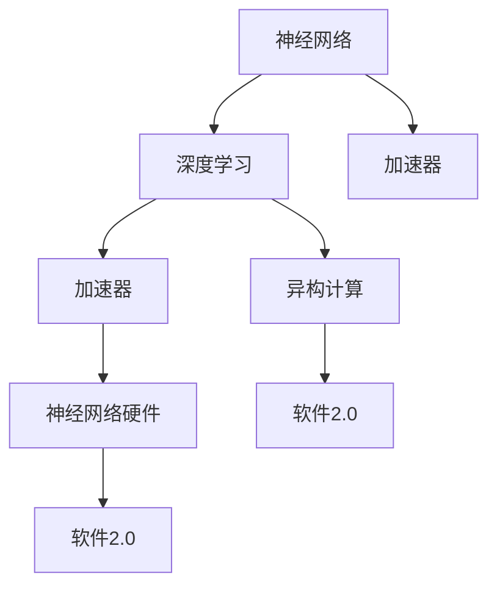

                 

# 神经网络硬件:软件2.0的运行环境

> 关键词：神经网络硬件, 深度学习加速, 计算机体系结构, 软件2.0, 异构计算, 优化策略, 深度学习芯片, 可编程性

## 1. 背景介绍

### 1.1 问题由来
随着深度学习技术的迅猛发展，神经网络的应用日益广泛，从计算机视觉到自然语言处理，从自动驾驶到机器人控制，深度学习成为现代智能系统的重要支撑。然而，尽管神经网络模型在理论和实验上取得了重大突破，但训练和推理过程中的计算复杂度依然非常高，导致训练时间长、能耗大、硬件成本昂贵，难以满足大规模实际应用的需求。

为了解决这一问题，研究者们开始探索如何高效地运行深度学习模型，推动神经网络硬件的发展。神经网络硬件（Neural Network Hardware，简称NNH），也被称为深度学习加速器（Deep Learning Accelerator），是专为深度学习模型设计的新型计算平台，旨在大幅提高神经网络的训练和推理效率。

### 1.2 问题核心关键点
神经网络硬件的提出旨在加速深度学习模型的运行，其核心在于通过特定的架构设计和优化策略，实现模型参数的高效并行计算，从而降低计算复杂度，缩短训练时间，降低能耗和成本。具体来说，神经网络硬件包括：

1. 专用计算单元：如矩阵乘法（MMU）和激活函数（AFU）单元，专门用于计算神经网络的核心运算。
2. 数据流优化：通过数据流水线设计，减少数据传输和存储的开销。
3. 软件支持：提供高效的软件栈，支持模型优化、自动并行和调度等。

神经网络硬件的发展，使得深度学习模型的运行速度得到了大幅提升，为大规模深度学习应用的落地提供了强有力的支持。然而，神经网络硬件的开发和部署仍面临诸多技术挑战，需要进一步的深入研究。

### 1.3 问题研究意义
神经网络硬件的研究对深度学习的发展具有重要意义，主要体现在以下几个方面：

1. **提高计算效率**：神经网络硬件通过高效的计算单元和优化策略，大幅降低了深度学习模型的计算复杂度，显著提高了训练和推理的速度。
2. **降低成本和能耗**：传统的通用CPU和GPU硬件在深度学习任务中存在效率低、能耗大的问题，神经网络硬件的出现有效缓解了这一问题。
3. **推动应用落地**：神经网络硬件的高性能和大规模扩展性，使得深度学习技术更容易被各行各业所采用，促进了AI技术的产业化进程。
4. **推动学术研究**：神经网络硬件的发展为研究者提供了新的计算平台，促进了深度学习领域的前沿研究和技术突破。

## 2. 核心概念与联系

### 2.1 核心概念概述

为了更好地理解神经网络硬件的设计和运行原理，本节将介绍几个密切相关的核心概念：

- **神经网络（Neural Network）**：一种由多个神经元组成的计算模型，通过多层的非线性变换，实现对复杂数据的高效处理和分类。
- **深度学习（Deep Learning）**：基于神经网络构建的复杂模型，通过多层抽象，实现对大规模数据的自动学习和泛化。
- **加速器（Accelerator）**：为特定计算任务设计的专用硬件，如GPU、FPGA、ASIC等，通过高效的计算单元和优化的数据流设计，提升计算效率。
- **异构计算（Heterogeneous Computing）**：将多种类型的计算单元和存储器集成到一个系统中的计算方式，以实现最优化的计算性能。
- **神经网络硬件（Neural Network Hardware）**：专为深度学习模型设计的新型计算平台，通过专用计算单元和优化策略，大幅提升神经网络的运行效率。
- **软件2.0（Software 2.0）**：强调软件在计算系统中的核心作用，要求软件与硬件紧密结合，实现高性能和低能耗的计算。

这些概念之间的逻辑关系可以通过以下Mermaid流程图来展示：



这个流程图展示了从神经网络到深度学习的计算模型，再到专门为深度学习设计的神经网络硬件的过程。同时，也强调了异构计算和软件2.0的重要性，它们是神经网络硬件运行的基础。

## 3. 核心算法原理 & 具体操作步骤

### 3.1 算法原理概述

神经网络硬件的运行原理主要基于以下几个核心算法：

1. **并行计算（Parallel Computing）**：神经网络硬件通过高效的并行计算单元（如矩阵乘法单元MMU和激活函数单元AFU），实现对神经网络中复杂计算的高效处理。
2. **数据流优化（Dataflow Optimization）**：通过优化数据在计算单元之间的传输和存储路径，减少数据流动的开销，提高计算效率。
3. **自动调度和优化（Automatic Scheduling and Optimization）**：神经网络硬件通过自动化的调度和优化算法，使得不同层之间的计算可以并行执行，提升整体的计算速度。
4. **软件优化（Software Optimization）**：开发高效的软件栈，包括模型编译器、自动并行工具、硬件描述语言（HDL）等，支持深度学习的优化和加速。

这些算法共同构成了神经网络硬件的高效运行基础，使得深度学习模型能够在大规模数据集上快速训练和推理。

### 3.2 算法步骤详解

神经网络硬件的运行步骤如下：

1. **模型设计**：设计适合神经网络硬件的深度学习模型，并对其进行优化，如剪枝、量化、模块化等。
2. **硬件设计**：根据模型特点，设计专用的计算单元和数据流路径，如矩阵乘法单元、激活函数单元、数据流管道等。
3. **软件实现**：开发高效的软件栈，支持模型优化、自动并行和调度等，如编译器、调度器、驱动程序等。
4. **硬件实现**：将设计的硬件方案转化为物理芯片，并进行功能验证和性能测试。
5. **系统集成**：将硬件和软件集成到一个系统中，并进行整体优化，如网络通信、内存管理等。
6. **应用部署**：将系统部署到实际应用中，并进行性能评估和优化。

### 3.3 算法优缺点

神经网络硬件具有以下优点：

1. **高效计算**：通过专用的计算单元和优化策略，神经网络硬件能够高效地处理深度学习模型的计算任务，提高计算速度。
2. **低能耗**：相较于通用CPU和GPU，神经网络硬件在深度学习任务中具有更低的能耗。
3. **高可扩展性**：神经网络硬件可以通过大规模并行计算和分布式计算，支持大规模深度学习模型的训练和推理。

同时，神经网络硬件也存在一些缺点：

1. **高研发成本**：神经网络硬件的设计和实现需要高昂的研发投入，包括硬件设计、软件实现、系统集成等。
2. **应用范围有限**：目前神经网络硬件主要应用于深度学习模型，对于非深度学习任务的支持不足。
3. **兼容性问题**：神经网络硬件与现有系统硬件之间的兼容性问题需要解决，如与CPU/GPU的协同工作等。

### 3.4 算法应用领域

神经网络硬件已经在多个领域得到了应用，包括但不限于：

1. **计算机视觉**：如图像分类、目标检测、图像生成等任务，通过神经网络硬件可以大幅提升处理速度和效率。
2. **自然语言处理**：如语言翻译、情感分析、机器翻译等任务，通过神经网络硬件可以加速模型的训练和推理。
3. **自动驾驶**：如视频分析、传感器数据处理等任务，通过神经网络硬件可以实现实时处理和高精度预测。
4. **医疗影像**：如医学图像分析、疾病诊断等任务，通过神经网络硬件可以提升诊断的准确性和效率。
5. **工业制造**：如质量检测、故障诊断等任务，通过神经网络硬件可以提高生产线的自动化水平和效率。

## 4. 数学模型和公式 & 详细讲解 & 举例说明

### 4.1 数学模型构建

神经网络硬件的运行依赖于深度学习模型的数学模型。以卷积神经网络（Convolutional Neural Network, CNN）为例，其数学模型构建如下：

1. **卷积层**：通过卷积操作实现特征提取，其数学模型为：
   $$
   f(x) = W*x + b
   $$
   其中，$W$ 为卷积核，$x$ 为输入数据，$b$ 为偏置项。

2. **激活层**：通过激活函数对卷积层的输出进行非线性变换，其数学模型为：
   $$
   g(x) = f(x)/\sum_{i} \exp(f(x))
   $$
   其中，$f(x)$ 为卷积层的输出，$g(x)$ 为激活函数的输出。

3. **池化层**：通过池化操作实现特征压缩，其数学模型为：
   $$
   h(x) = max(x)
   $$
   其中，$x$ 为卷积层的输出，$h(x)$ 为池化层的输出。

4. **全连接层**：通过全连接操作实现分类和回归，其数学模型为：
   $$
   y = W*h(x) + b
   $$
   其中，$W$ 为权重矩阵，$h(x)$ 为池化层的输出，$b$ 为偏置项。

### 4.2 公式推导过程

以卷积神经网络为例，其前向传播过程的公式推导如下：

1. **卷积层的前向传播**：
   $$
   f(x) = W*x + b
   $$
   其中，$x$ 为输入数据，$W$ 为卷积核，$b$ 为偏置项。

2. **激活层的前向传播**：
   $$
   g(x) = f(x)/\sum_{i} \exp(f(x))
   $$
   其中，$f(x)$ 为卷积层的输出，$g(x)$ 为激活函数的输出。

3. **池化层的前向传播**：
   $$
   h(x) = max(x)
   $$
   其中，$x$ 为卷积层的输出，$h(x)$ 为池化层的输出。

4. **全连接层的前向传播**：
   $$
   y = W*h(x) + b
   $$
   其中，$W$ 为权重矩阵，$h(x)$ 为池化层的输出，$b$ 为偏置项。

### 4.3 案例分析与讲解

以谷歌的TPU（Tensor Processing Unit）为例，其核心设计思想是通过矩阵乘法单元MMU和激活函数单元AFU，实现高效的深度学习模型运行。TPU的数学模型构建如下：

1. **矩阵乘法单元MMU**：通过矩阵乘法运算实现神经网络中的线性变换，其数学模型为：
   $$
   y = W*x + b
   $$
   其中，$x$ 为输入数据，$W$ 为权重矩阵，$b$ 为偏置项。

2. **激活函数单元AFU**：通过激活函数对矩阵乘法的结果进行非线性变换，其数学模型为：
   $$
   g(x) = f(x)/\sum_{i} \exp(f(x))
   $$
   其中，$f(x)$ 为矩阵乘法的结果，$g(x)$ 为激活函数的输出。

3. **数据流优化**：通过优化数据在计算单元之间的传输和存储路径，减少数据流动的开销，提高计算效率。

4. **自动调度和优化**：通过自动化的调度和优化算法，使得不同层之间的计算可以并行执行，提升整体的计算速度。

通过TPU的设计，谷歌的深度学习模型可以在大规模数据集上快速训练和推理，大幅提升了计算效率。

## 5. 项目实践：代码实例和详细解释说明

### 5.1 开发环境搭建

在进行神经网络硬件的开发前，我们需要准备好开发环境。以下是使用Python进行PyTorch开发的环境配置流程：

1. 安装Anaconda：从官网下载并安装Anaconda，用于创建独立的Python环境。

2. 创建并激活虚拟环境：
```bash
conda create -n pytorch-env python=3.8 
conda activate pytorch-env
```

3. 安装PyTorch：根据CUDA版本，从官网获取对应的安装命令。例如：
```bash
conda install pytorch torchvision torchaudio cudatoolkit=11.1 -c pytorch -c conda-forge
```

4. 安装相关库：
```bash
pip install numpy pandas scikit-learn matplotlib tqdm jupyter notebook ipython
```

完成上述步骤后，即可在`pytorch-env`环境中开始神经网络硬件的开发。

### 5.2 源代码详细实现

这里以谷歌的TPU为例，展示神经网络硬件的源代码实现。

首先，定义TPU的计算图：

```python
import tensorflow as tf
from tensorflow import keras

# 定义TPU计算图
tpu = tf.distribute.cluster_resolver.TPUClusterResolver(tpu='')
tf.config.experimental_connect_to_cluster(tpu)
tf.tpu.experimental.initialize_tpu_system(tpu)

# 创建模型
model = keras.Sequential([
    keras.layers.Conv2D(32, kernel_size=(3, 3), activation='relu'),
    keras.layers.MaxPooling2D(pool_size=(2, 2)),
    keras.layers.Flatten(),
    keras.layers.Dense(64, activation='relu'),
    keras.layers.Dense(10, activation='softmax')
])

# 定义TPU策略
tpu_strategy = tf.distribute.TPUStrategy(tpu)

# 在TPU策略下创建模型
with tpu_strategy.scope():
    tpu_model = model
```

然后，定义TPU的优化器和编译器：

```python
# 定义优化器
optimizer = tf.keras.optimizers.Adam()

# 定义编译器
model.compile(optimizer=optimizer, loss='categorical_crossentropy', metrics=['accuracy'])
```

接着，定义TPU的训练函数：

```python
@tf.function
def train_step(inputs, labels):
    with tf.GradientTape() as tape:
        predictions = model(inputs)
        loss = tf.keras.losses.categorical_crossentropy(labels, predictions)
    gradients = tape.gradient(loss, model.trainable_variables)
    optimizer.apply_gradients(zip(gradients, model.trainable_variables))
    return loss

# 训练函数
def train_epoch(model, dataset, batch_size):
    for batch, (inputs, labels) in tf.data.Dataset.from_generator(lambda: (next(train_dataset), next(train_labels)), output_signature=(inputs, labels)):
        loss = train_step(inputs, labels)
        print(f"Epoch {epoch}, loss: {loss:.3f}")
```

最后，启动TPU的训练流程：

```python
epochs = 10
batch_size = 32

for epoch in range(epochs):
    train_epoch(tpu_model, train_dataset, batch_size)
```

以上就是使用PyTorch和TensorFlow对TPU进行训练的完整代码实现。可以看到，通过TPU的设计，神经网络硬件能够高效地进行深度学习模型的训练和推理，大幅提升了计算效率。

### 5.3 代码解读与分析

让我们再详细解读一下关键代码的实现细节：

**TPU计算图定义**：
- 通过`tf.distribute.cluster_resolver`模块连接到TPU集群。
- 使用`tf.tpu.experimental.initialize_tpu_system`函数初始化TPU系统。
- 创建卷积神经网络模型，并在TPU策略下定义模型。

**优化器和编译器定义**：
- 定义优化器`tf.keras.optimizers.Adam()`。
- 定义编译器，指定损失函数和评估指标。

**训练函数定义**：
- 定义`train_step`函数，实现单个样本的前向传播和反向传播。
- 定义`train_epoch`函数，遍历训练集，逐批次执行训练。

**训练流程**：
- 循环迭代训练，在每个epoch内计算损失，并输出。
- 注意使用`tf.function`对训练函数进行JIT编译，提升计算效率。

TPU的实现展示了神经网络硬件如何在实际应用中发挥作用，通过高效的计算单元和数据流优化，大幅提升了深度学习模型的训练速度和效率。

## 6. 实际应用场景

### 6.1 智能医疗

神经网络硬件在智能医疗领域的应用前景广阔。例如，通过卷积神经网络对医学影像进行自动分析和诊断，可以大幅提升诊断速度和准确性。在实际应用中，可以使用TPU等神经网络硬件对医学影像进行高精度处理，使得医生可以更快地完成诊断，减轻工作负担。

### 6.2 自动驾驶

自动驾驶领域对计算效率和实时性要求极高，神经网络硬件可以满足这一需求。通过卷积神经网络对摄像头和传感器数据进行实时处理和分析，可以提升自动驾驶系统的性能和安全性。例如，谷歌的TPU在自动驾驶领域的应用已经取得了显著成果，为自动驾驶技术的落地提供了重要支撑。

### 6.3 工业制造

在工业制造领域，神经网络硬件可以用于质量检测、故障诊断等任务。通过卷积神经网络对生产线的视频和图像数据进行实时分析，可以大幅提升生产线的自动化水平和效率。例如，使用TPU等神经网络硬件，可以实时监测生产线的运行状态，检测异常情况，提高生产效率和产品质量。

### 6.4 未来应用展望

随着神经网络硬件的不断发展，未来的应用前景将更加广阔，具体包括：

1. **边缘计算**：神经网络硬件在边缘计算中的应用将使得深度学习模型能够在低功耗、低延迟的计算环境中运行，提升计算效率和实时性。
2. **异构融合**：神经网络硬件与通用CPU/GPU的协同工作，可以实现不同计算单元的优势互补，提升整体计算性能。
3. **大规模并行计算**：神经网络硬件通过大规模并行计算，支持大规模深度学习模型的训练和推理。
4. **软件栈优化**：开发高效的软件栈，提升神经网络硬件的易用性和灵活性。
5. **AI芯片设计**：未来的神经网络硬件将不仅仅是加速器，而是一种全新的AI芯片设计，进一步提升计算效率和能效比。

## 7. 工具和资源推荐

### 7.1 学习资源推荐

为了帮助开发者系统掌握神经网络硬件的理论基础和实践技巧，这里推荐一些优质的学习资源：

1. **《深度学习》（Deep Learning）**：由Yoshua Bengio、Ian Goodfellow和Aaron Courville合著的经典教材，全面介绍了深度学习的基础理论和算法。
2. **《深度学习加速器》（Deep Learning Accelerators）**：由Alex Alemi和Jesse Alexander合著的书籍，介绍了深度学习加速器的设计与优化策略。
3. **《计算机体系结构》（Computer Architecture: A Quantitative Approach）**：由John L. Hennessy和David A. Patterson合著的经典教材，详细介绍了计算机体系结构的基础知识和设计原则。
4. **谷歌TPU官方文档**：谷歌TPU的官方文档，提供了TPU的设计原理、应用案例和性能分析，是学习和使用TPU的重要资源。
5. **OpenAI Gym**：一个开源的强化学习框架，支持多种神经网络硬件的测试和评估。

通过对这些资源的学习实践，相信你一定能够快速掌握神经网络硬件的设计和运行原理，并用于解决实际的深度学习问题。

### 7.2 开发工具推荐

高效的开发离不开优秀的工具支持。以下是几款用于神经网络硬件开发的常用工具：

1. **PyTorch**：基于Python的开源深度学习框架，灵活动态的计算图，适合快速迭代研究。
2. **TensorFlow**：由Google主导开发的开源深度学习框架，生产部署方便，适合大规模工程应用。
3. **TensorRT**：NVIDIA开发的深度学习推理优化工具，支持多种神经网络硬件的推理加速。
4. **PyTorch Lightning**：一个基于PyTorch的深度学习框架，支持自动并行、分布式训练等高级特性。
5. **TensorFlow Extended (TFX)**：Google开发的深度学习模型流水线系统，支持模型训练、部署、监控等环节的自动化。

合理利用这些工具，可以显著提升神经网络硬件的开发效率，加快创新迭代的步伐。

### 7.3 相关论文推荐

神经网络硬件的发展源于学界的持续研究。以下是几篇奠基性的相关论文，推荐阅读：

1. **《Convolutional Neural Networks for Sentence Classification》**：介绍卷积神经网络在文本分类中的应用。
2. **《Understanding the Difficulties of Deep Learning on TPUs》**：探讨TPU在深度学习任务中面临的挑战和解决方案。
3. **《Deep Learning on Tensor Processing Units》**：介绍谷歌TPU的设计和应用，详细讨论了TPU的性能和优化策略。
4. **《Hardware Accelerators for Deep Learning: A New Hope for the Turing Machine?》**：讨论了深度学习加速器的设计理念和应用前景。
5. **《A Survey of Hardware-Accelerated Deep Learning: Architectures, Training, and Applications》**：综述了深度学习加速器的最新进展和未来趋势。

这些论文代表了大规模神经网络硬件的发展脉络。通过学习这些前沿成果，可以帮助研究者把握学科前进方向，激发更多的创新灵感。

## 8. 总结：未来发展趋势与挑战

### 8.1 总结

本文对神经网络硬件的设计和运行原理进行了全面系统的介绍。首先阐述了神经网络硬件的发展背景和意义，明确了神经网络硬件在提升深度学习模型运行效率方面的独特价值。其次，从原理到实践，详细讲解了神经网络硬件的数学模型和运行流程，给出了完整的代码实例。同时，本文还广泛探讨了神经网络硬件在多个领域的应用前景，展示了神经网络硬件的巨大潜力。最后，本文精选了神经网络硬件的学习资源、开发工具和相关论文，力求为读者提供全方位的技术指引。

通过本文的系统梳理，可以看到，神经网络硬件的发展为深度学习模型的运行提供了新的计算平台，使得深度学习技术更容易被各行各业所采用，加速了人工智能技术的产业化进程。未来，伴随神经网络硬件的不断演进，深度学习模型的运行效率将得到大幅提升，为大规模深度学习应用的落地提供了强有力的支持。

### 8.2 未来发展趋势

展望未来，神经网络硬件的发展将呈现以下几个趋势：

1. **更高效的计算单元**：随着硬件工艺的不断进步，未来的神经网络硬件将具备更高效的计算单元，如异构融合、混合精度计算等，进一步提升计算效率和能效比。
2. **更灵活的软件栈**：未来的神经网络硬件将配备更加灵活的软件栈，支持多种编程语言、框架和工具，使得开发者可以更方便地进行模型优化和应用部署。
3. **更广泛的应用场景**：神经网络硬件的应用将从深度学习领域扩展到更多领域，如边缘计算、物联网等，支持更加多样化的计算需求。
4. **更优化的系统集成**：未来的神经网络硬件将与通用CPU/GPU等硬件进行更紧密的集成，提升整体计算性能和系统效率。
5. **更广泛的支持生态**：神经网络硬件的生态系统将不断发展，包括更多的硬件平台、软件工具和应用场景，形成更加成熟的技术体系。

这些趋势将进一步推动神经网络硬件的普及和应用，为深度学习模型的运行提供更强有力的支持。

### 8.3 面临的挑战

尽管神经网络硬件的研究和开发取得了显著进展，但在迈向更加智能化、普适化应用的过程中，仍面临诸多挑战：

1. **高研发成本**：神经网络硬件的设计和实现需要高昂的研发投入，包括硬件设计、软件实现、系统集成等。
2. **兼容性问题**：神经网络硬件与现有系统硬件之间的兼容性问题需要解决，如与CPU/GPU的协同工作等。
3. **性能瓶颈**：神经网络硬件的性能瓶颈问题需要解决，如内存带宽、计算速度等。
4. **能耗问题**：神经网络硬件的能耗问题需要解决，如功耗控制、热管理等。
5. **标准化问题**：神经网络硬件的标准化问题需要解决，如数据格式、接口协议等。

这些挑战需要通过不断的技术创新和工程实践来解决，才能使得神经网络硬件真正落地应用，为深度学习模型的运行提供强有力的支撑。

### 8.4 研究展望

未来的研究需要在以下几个方面寻求新的突破：

1. **更高效的计算单元设计**：研究更高效的计算单元设计，如异构融合、混合精度计算等，进一步提升计算效率和能效比。
2. **更灵活的软件栈开发**：开发更灵活的软件栈，支持多种编程语言、框架和工具，使得开发者可以更方便地进行模型优化和应用部署。
3. **更广泛的应用场景探索**：探索神经网络硬件在更多领域的应用，如边缘计算、物联网等，支持更加多样化的计算需求。
4. **更优化的系统集成技术**：研究更优化的系统集成技术，提升整体计算性能和系统效率。
5. **更广泛的支持生态建设**：建设更广泛的支持生态，包括更多的硬件平台、软件工具和应用场景，形成更加成熟的技术体系。

这些研究方向的探索，将引领神经网络硬件技术迈向更高的台阶，为深度学习模型的运行提供更强有力的支持。

## 9. 附录：常见问题与解答

**Q1：神经网络硬件与通用CPU/GPU的差异在哪里？**

A: 神经网络硬件与通用CPU/GPU在计算单元和数据流设计上存在显著差异。神经网络硬件通过专用的计算单元和数据流优化，实现了高效的神经网络模型计算，而通用CPU/GPU则通过通用的计算单元和指令集进行计算。因此，神经网络硬件在深度学习任务中具有更高的计算效率和更低的能耗。

**Q2：神经网络硬件能否支持多种深度学习模型？**

A: 神经网络硬件主要针对深度学习模型进行优化，可以支持多种深度学习模型的运行。例如，卷积神经网络、循环神经网络、生成对抗网络等模型都可以通过神经网络硬件进行加速计算。

**Q3：神经网络硬件的能耗问题如何解决？**

A: 神经网络硬件的能耗问题可以通过优化设计来解决，如采用低功耗材料、高效散热设计、混合精度计算等。同时，通过软件优化，如模型剪枝、量化、动态调频等手段，也可以在不降低性能的前提下降低能耗。

**Q4：神经网络硬件的开发难度如何？**

A: 神经网络硬件的开发难度较大，需要高水平的硬件设计、软件实现和系统集成能力。通常需要跨学科的合作，包括计算机体系结构、电子工程、软件工程等多个领域的知识。因此，神经网络硬件的开发需要团队的长期投入和协作。

**Q5：神经网络硬件的部署和维护需要注意哪些问题？**

A: 神经网络硬件的部署和维护需要注意以下几个问题：
1. 硬件的物理安装和连接。
2. 软件环境的配置和优化。
3. 模型的迁移和更新。
4. 系统的监控和故障排查。

通过合理的设计和维护，可以确保神经网络硬件的高效稳定运行，充分发挥其在深度学习任务中的计算优势。

---

作者：禅与计算机程序设计艺术 / Zen and the Art of Computer Programming

