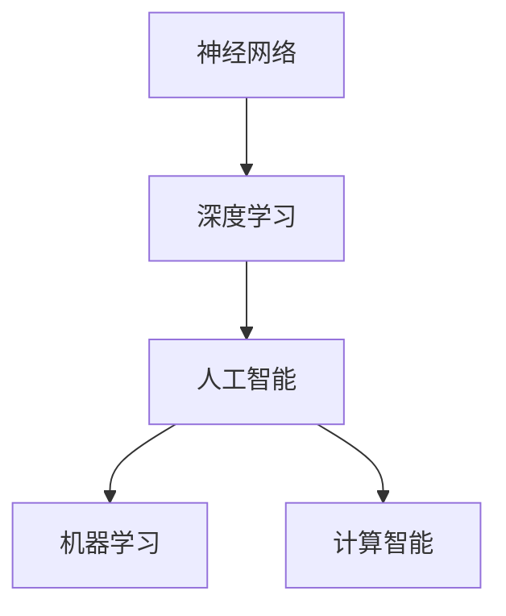

                 

# 神经网络：人类智慧的解放

> 关键词：神经网络,深度学习,人工智能,人类智慧,机器学习,计算智能,算法优化

## 1. 背景介绍

### 1.1 问题由来
当今世界，信息爆炸、数据溢出，人类智慧正面临着前所未有的考验。面对海量的信息，如何从中快速提炼有用知识、洞察复杂现象，成为了亟需解决的问题。深度学习尤其是神经网络，凭借其强大的处理能力和广泛的适用性，逐渐成为现代科技领域的佼佼者。

深度学习是机器学习领域的重要分支，基于多层神经网络结构，通过数据驱动的方式，学习和模拟人类大脑的神经元连接和信息处理机制。神经网络通过不断迭代训练，能够从数据中学习模式和规律，进而实现对新数据的预测和生成，展现出强大的自主学习能力。

## 2. 核心概念与联系

### 2.1 核心概念概述

为更好地理解神经网络在人工智能中的应用，本节将介绍几个密切相关的核心概念：

- 神经网络(Neural Network)：一种由多个节点构成的网络结构，其中节点（神经元）之间通过连接传递信号，实现信息处理和特征学习。

- 深度学习(Deep Learning)：一种基于神经网络的人工智能技术，通过多层网络结构来处理和分析数据，具有较强的自动特征学习能力。

- 人工智能(Artificial Intelligence, AI)：一种旨在模仿人类智能行为的计算机技术，包括感知、学习、推理、决策等功能。

- 机器学习(Machine Learning, ML)：一种数据驱动的技术，通过算法和模型，让计算机系统能够自主学习和适应环境，从而提升性能。

- 计算智能(Computational Intelligence, CI)：一种融合了神经网络、进化计算和模糊逻辑等技术的智能模型，用于模拟人类智慧中的某些特定行为。

这些核心概念之间的逻辑关系可以通过以下Mermaid流程图来展示：



这个流程图展示了几者之间的关联性：

1. 神经网络是深度学习和计算智能的底层实现机制。
2. 深度学习利用神经网络，具有更强的特征提取和处理能力。
3. 人工智能涵盖了深度学习和计算智能，追求更广泛的智能行为。
4. 机器学习则是深度学习和计算智能的普遍基础，依赖于数据驱动的模型训练。

## 3. 核心算法原理 & 具体操作步骤
### 3.1 算法原理概述

神经网络的算法原理基于反向传播算法（Backpropagation）。该算法通过反向传播误差信号，不断调整网络参数，使得网络的预测输出尽可能接近真实值。反向传播算法包括前向传播、误差计算、梯度计算和参数更新四个步骤。

- **前向传播**：将输入数据通过神经网络，逐层传递信号，生成最终的输出结果。

- **误差计算**：使用损失函数计算网络输出与真实值之间的误差。

- **梯度计算**：通过链式法则，计算误差对各层参数的梯度。

- **参数更新**：根据梯度信息和预设的学习率，调整网络参数，使得误差逐步减小。

以上四个步骤形成一个闭环，不断迭代，直到误差收敛或达到预设的停止条件。

### 3.2 算法步骤详解

**Step 1: 数据准备**
- 收集数据，并将其分为训练集、验证集和测试集。
- 对数据进行预处理，如归一化、标准化等。

**Step 2: 模型构建**
- 选择合适的神经网络结构，如全连接网络、卷积神经网络、循环神经网络等。
- 定义网络各层的参数，包括神经元个数、激活函数、损失函数等。

**Step 3: 初始化参数**
- 对网络参数进行随机初始化。

**Step 4: 前向传播**
- 将训练数据输入网络，逐层传递信号，得到预测输出。

**Step 5: 误差计算**
- 使用损失函数计算预测输出与真实值之间的误差。

**Step 6: 梯度计算**
- 通过链式法则，计算误差对各层参数的梯度。

**Step 7: 参数更新**
- 根据梯度信息和预设的学习率，调整网络参数。

**Step 8: 迭代优化**
- 重复前向传播、误差计算、梯度计算和参数更新步骤，直至误差收敛或达到预设的停止条件。

**Step 9: 模型评估**
- 在验证集和测试集上评估模型性能，选择合适的超参数。

### 3.3 算法优缺点

神经网络算法具有以下优点：

1. **高效特征提取**：能够从原始数据中自动学习特征，不需要手动设计特征。
2. **非线性映射能力**：通过多层非线性映射，可以处理复杂非线性关系。
3. **自适应学习能力**：通过反向传播算法，能够不断优化网络参数，提升模型性能。
4. **可扩展性强**：网络结构可以灵活调整，适应各种任务和数据类型。

同时，神经网络算法也存在一些缺点：

1. **计算资源需求高**：由于深度网络的参数量庞大，计算和存储需求高。
2. **易受噪声干扰**：小样本和高噪声数据可能导致梯度爆炸或消失问题。
3. **模型复杂度高**：深层网络结构复杂，难以解释和调试。
4. **训练时间长**：大型网络训练时间长，容易陷入局部最优解。

尽管存在这些缺点，但神经网络算法在图像识别、语音识别、自然语言处理等领域展示了强大的应用潜力，成为当前人工智能研究的热点。

### 3.4 算法应用领域

神经网络在多个领域展现了广泛的应用前景，具体包括：

- **计算机视觉**：用于图像分类、目标检测、图像分割等任务。通过卷积神经网络（CNN）实现对图像特征的自动学习。

- **自然语言处理**：用于语言翻译、情感分析、文本生成等任务。通过循环神经网络（RNN）和Transformer网络实现对文本序列的处理。

- **语音识别**：用于语音转文字、语音合成等任务。通过递归神经网络（RNN）和卷积神经网络（CNN）实现对语音信号的处理。

- **机器人控制**：用于机器人路径规划、动作识别等任务。通过强化学习和神经网络实现对机器人行为的自主控制。

- **医疗诊断**：用于疾病诊断、影像分析等任务。通过卷积神经网络（CNN）和循环神经网络（RNN）实现对医学图像和数据的自动分析。

以上领域展示了神经网络算法的强大应用潜力，未来还将有更多领域受益于这一技术。

## 4. 数学模型和公式 & 详细讲解 & 举例说明
### 4.1 数学模型构建

神经网络通常由输入层、隐藏层和输出层构成。其中隐藏层可以是多个，形成一个多层的神经网络结构。

以一个简单的全连接神经网络为例，其数学模型可以表示为：

$$
y = f(Wx + b)
$$

其中，$y$ 为输出结果，$x$ 为输入数据，$W$ 为权重矩阵，$b$ 为偏置向量，$f$ 为激活函数。

### 4.2 公式推导过程

以一个简单的全连接神经网络为例，其前向传播和反向传播算法的公式推导如下：

**前向传播算法**：

$$
z^{(1)} = wx^{(1)} + b^{(1)}
$$

$$
a^{(1)} = f(z^{(1)})
$$

$$
z^{(2)} = Wa^{(1)} + b^{(2)}
$$

$$
a^{(2)} = f(z^{(2)})
$$

...

**反向传播算法**：

$$
\delta^{(l)} = \frac{\partial L}{\partial z^{(l)}}f'(z^{(l)}) = \delta^{(l+1)}W^T
$$

$$
\Delta^{(l)} = \delta^{(l)} \cdot a^{(l)} = \Delta^{(l+1)} \cdot W^T \cdot a^{(l)}
$$

$$
\Delta^{(l)} = \frac{\partial L}{\partial W^{(l)}} = \Delta^{(l)}a^{(l-1)}{}^T
$$

$$
\Delta^{(l)} = \frac{\partial L}{\partial b^{(l)}} = \Delta^{(l)}
$$

以上公式展示了神经网络的前向传播和反向传播过程。

### 4.3 案例分析与讲解

以图像分类任务为例，神经网络可以通过多层卷积和池化操作，提取图像的特征，并通过全连接层进行分类。

以下是一个简单的卷积神经网络（CNN）的实现：

```python
import tensorflow as tf
from tensorflow.keras import layers

model = tf.keras.Sequential()
model.add(layers.Conv2D(32, (3,3), activation='relu', input_shape=(28, 28, 1)))
model.add(layers.MaxPooling2D((2,2)))
model.add(layers.Conv2D(64, (3,3), activation='relu'))
model.add(layers.MaxPooling2D((2,2)))
model.add(layers.Flatten())
model.add(layers.Dense(64, activation='relu'))
model.add(layers.Dense(10, activation='softmax'))

model.compile(optimizer='adam', loss='categorical_crossentropy', metrics=['accuracy'])
```

在这个例子中，神经网络首先通过卷积层提取图像的局部特征，通过池化层减小特征图的大小，最后通过全连接层进行分类。

## 5. 项目实践：代码实例和详细解释说明
### 5.1 开发环境搭建

在进行神经网络项目实践前，我们需要准备好开发环境。以下是使用Python进行TensorFlow开发的环境配置流程：

1. 安装Anaconda：从官网下载并安装Anaconda，用于创建独立的Python环境。

2. 创建并激活虚拟环境：
```bash
conda create -n tensorflow-env python=3.8 
conda activate tensorflow-env
```

3. 安装TensorFlow：根据CUDA版本，从官网获取对应的安装命令。例如：
```bash
pip install tensorflow
```

4. 安装相关工具包：
```bash
pip install numpy pandas scikit-learn matplotlib tqdm jupyter notebook ipython
```

完成上述步骤后，即可在`tensorflow-env`环境中开始神经网络项目的开发。

### 5.2 源代码详细实现

这里我们以手写数字识别（MNIST）为例，展示神经网络的实现。

首先，定义神经网络的结构：

```python
import tensorflow as tf
from tensorflow.keras import layers

model = tf.keras.Sequential()
model.add(layers.Conv2D(32, (3,3), activation='relu', input_shape=(28, 28, 1)))
model.add(layers.MaxPooling2D((2,2)))
model.add(layers.Conv2D(64, (3,3), activation='relu'))
model.add(layers.MaxPooling2D((2,2)))
model.add(layers.Flatten())
model.add(layers.Dense(64, activation='relu'))
model.add(layers.Dense(10, activation='softmax'))
```

然后，编译模型：

```python
model.compile(optimizer='adam', loss='categorical_crossentropy', metrics=['accuracy'])
```

接着，加载数据集并进行预处理：

```python
(x_train, y_train), (x_test, y_test) = tf.keras.datasets.mnist.load_data()
x_train = x_train.reshape(-1, 28, 28, 1) / 255.0
x_test = x_test.reshape(-1, 28, 28, 1) / 255.0
y_train = tf.keras.utils.to_categorical(y_train)
y_test = tf.keras.utils.to_categorical(y_test)
```

最后，训练和评估模型：

```python
history = model.fit(x_train, y_train, batch_size=32, epochs=10, validation_data=(x_test, y_test))
model.evaluate(x_test, y_test)
```

以上就是使用TensorFlow进行手写数字识别任务的神经网络微调的完整代码实现。可以看到，借助TensorFlow的高级API，神经网络的实现变得简洁高效。

### 5.3 代码解读与分析

让我们再详细解读一下关键代码的实现细节：

**Sequential模型定义**：
- 通过`tf.keras.Sequential`定义了模型结构，一层一层地添加网络层。

**卷积层和池化层**：
- `tf.keras.layers.Conv2D`用于定义卷积层，`tf.keras.layers.MaxPooling2D`用于定义池化层。卷积层通过滑动窗口的方式提取图像特征，池化层通过降低特征图的大小减少参数量，提升计算效率。

**全连接层**：
- `tf.keras.layers.Flatten`用于将卷积层输出的二维特征图展平成一维向量，`tf.keras.layers.Dense`用于定义全连接层。

**softmax激活函数**：
- 使用`softmax`激活函数，将模型输出转化为概率分布，方便进行多分类任务。

**模型编译**：
- `model.compile`用于编译模型，指定优化器、损失函数和评估指标。

**数据加载和预处理**：
- 使用`tf.keras.datasets.mnist.load_data`加载MNIST数据集，并进行预处理，将图像归一化并转化为四维张量。

**模型训练和评估**：
- 使用`model.fit`训练模型，指定训练集、验证集和批量大小，通过`model.evaluate`评估模型在测试集上的性能。

**模型保存**：
- 训练完毕后，模型可以通过`model.save`保存到磁盘，方便后续使用。

## 6. 实际应用场景
### 6.1 智能推荐系统

神经网络在智能推荐系统中的应用，可以显著提升用户的个性化推荐体验。通过分析用户的历史行为数据，神经网络可以自动学习用户的偏好，从而推荐用户可能感兴趣的商品、内容等。

在技术实现上，可以收集用户浏览、点击、购买等行为数据，提取和商品、内容相关的文本信息。将文本数据输入神经网络，通过多层网络结构学习特征表示，最后进行推荐。通过不断迭代训练，神经网络能够自适应地调整推荐策略，提升推荐效果。

### 6.2 语音识别

语音识别是神经网络在自然语言处理领域的重要应用之一。通过将语音信号转化为文本，神经网络可以实现对语音的自动转录和理解。

在技术实现上，可以收集大量的语音数据和对应的文本数据，构建标注好的语音识别数据集。使用神经网络模型，如循环神经网络（RNN）和卷积神经网络（CNN），对语音信号进行处理，最终生成文本输出。通过不断优化模型参数，提升语音识别的准确率和鲁棒性。

### 6.3 医学影像分析

医学影像分析是神经网络在医疗领域的重要应用之一。通过分析医学图像，神经网络可以自动进行病灶识别、疾病诊断等任务。

在技术实现上，可以收集大量的医学影像数据和对应的病理报告，构建标注好的医学影像数据集。使用神经网络模型，如卷积神经网络（CNN）和循环神经网络（RNN），对医学影像进行处理，最终生成病理报告。通过不断优化模型参数，提升医学影像分析的准确率和可靠性。

### 6.4 未来应用展望

随着神经网络的不断发展和应用，未来将有更多领域受益于这一技术。以下展示了几个可能的未来应用场景：

- **智能交通**：通过分析交通流量、车辆行为等数据，神经网络可以自动优化交通信号灯控制、预测交通拥堵等。

- **金融风险预测**：通过分析金融市场数据，神经网络可以自动预测股市走势、识别异常交易行为等。

- **智能家居**：通过分析用户的居住习惯和行为数据，神经网络可以实现智能家居设备的自动控制和优化。

- **智能客服**：通过分析客户咨询内容，神经网络可以实现智能客服自动回复、情感分析等。

## 7. 工具和资源推荐
### 7.1 学习资源推荐

为了帮助开发者系统掌握神经网络的理论基础和实践技巧，这里推荐一些优质的学习资源：

1. 《深度学习》（Ian Goodfellow、Yoshua Bengio、Aaron Courville合著）：全面介绍了深度学习的理论和实践，涵盖神经网络、优化算法、卷积神经网络、循环神经网络等。

2. 《Python深度学习》（Francois Chollet著）：基于TensorFlow实现，深入浅出地介绍了神经网络的实现方法和应用技巧。

3. 《TensorFlow实战Google深度学习》（Aurélien Géron著）：结合实际案例，展示了如何使用TensorFlow进行深度学习模型的开发和应用。

4. 《神经网络与深度学习》（Michael Nielsen著）：通过生动的示例和图形，帮助读者理解神经网络的数学原理和实际应用。

5. 《Deep Learning with Python》（Francois Chollet著）：基于Keras实现，介绍了深度学习的基本概念、框架和应用场景。

6. CS231n《卷积神经网络》课程：斯坦福大学开设的深度学习课程，涵盖神经网络的理论、实现和应用。

通过对这些资源的学习实践，相信你一定能够快速掌握神经网络的核心知识和实践技能。

### 7.2 开发工具推荐

高效的开发离不开优秀的工具支持。以下是几款用于神经网络开发的常用工具：

1. TensorFlow：由Google主导开发的开源深度学习框架，生产部署方便，适合大规模工程应用。

2. PyTorch：由Facebook主导开发的深度学习框架，灵活性高，适合学术研究和原型开发。

3. Keras：基于TensorFlow和Theano的高级API，简单易用，适合初学者入门。

4. Microsoft Cognitive Toolkit（CNTK）：微软开发的深度学习框架，具有高效的分布式计算能力。

5. MXNet：由Apache开发的深度学习框架，支持多种编程语言，适合大规模分布式训练。

6. JAX：由Google开发的Python深度学习框架，支持自动微分和分布式计算，适合研究和工业应用。

合理利用这些工具，可以显著提升神经网络开发的效率和性能，加速创新迭代的步伐。

### 7.3 相关论文推荐

神经网络技术的发展源于学界的持续研究。以下是几篇奠基性的相关论文，推荐阅读：

1. 《A Tutorial on Deep Learning》（D. Helmbold、D. W. Brandt著）：介绍了深度学习的基本概念、理论和应用。

2. 《Deep Learning》（Y. LeCun、Y. Bengio、G. Hinton合著）：介绍了深度学习的理论和实践，涵盖神经网络、优化算法、卷积神经网络、循环神经网络等。

3. 《ImageNet Classification with Deep Convolutional Neural Networks》（A. Krizhevsky、I. Sutskever、G. Hinton著）：展示了卷积神经网络在图像分类任务上的强大性能。

4. 《Learning Word Vectors in Vector Space》（T. Mikolov、I. Sutskever、K. Chen、G. S. Corrado、J. Dean著）：展示了词向量的嵌入技术，为自然语言处理任务提供了有力支持。

5. 《Deep Architectures for Semantic Segmentation》（G. Farabet、H. Najibi、C. Couprie、M. Cord、J. Najman、F. Ponce、A. Douze著）：展示了卷积神经网络在语义分割任务上的应用。

这些论文代表了大神经网络技术的发展脉络。通过学习这些前沿成果，可以帮助研究者把握学科前进方向，激发更多的创新灵感。

## 8. 总结：未来发展趋势与挑战

### 8.1 总结

本文对神经网络在人工智能中的应用进行了全面系统的介绍。首先阐述了神经网络的基本原理和核心算法，展示了其强大的数据处理能力。其次，从原理到实践，详细讲解了神经网络的基本结构和训练方法，给出了神经网络项目开发的完整代码实例。同时，本文还广泛探讨了神经网络在多个领域的应用前景，展示了其广泛的应用潜力。

通过本文的系统梳理，可以看到，神经网络技术已经成为人工智能领域的重要支柱，其应用范围和性能不断拓展。未来，伴随神经网络技术的不断进步，必将有更多领域受益于这一技术，推动人工智能技术的发展和应用。

### 8.2 未来发展趋势

展望未来，神经网络技术将呈现以下几个发展趋势：

1. **模型规模不断增大**：随着计算能力的提升和数据量的增加，神经网络的规模将不断增大，模型的复杂性和表现力也将进一步提升。

2. **模型结构日益复杂**：神经网络的深度和宽度将继续增加，更多层次和更多神经元将被引入，以提升模型的性能。

3. **算法和框架不断优化**：神经网络的训练和推理算法将不断优化，如自适应学习率、分布式训练等技术将得到广泛应用。

4. **跨领域应用更加广泛**：神经网络将应用于更多领域，如医疗、金融、交通、农业等，实现跨领域的智能优化。

5. **多模态融合加强**：神经网络将融合视觉、语音、文本等多种模态数据，实现更加全面和准确的智能感知。

6. **自主学习和迁移学习能力增强**：神经网络将具备更强的自主学习和迁移学习能力，能够从少量数据中快速适应新任务。

7. **跨领域模型共享**：跨领域模型共享和迁移学习的思路将得到进一步发展，提升模型泛化能力和应用灵活性。

以上趋势凸显了神经网络技术的巨大潜力和发展方向。这些方向的探索发展，必将进一步提升神经网络的性能和应用范围，为人工智能技术的发展注入新的动力。

### 8.3 面临的挑战

尽管神经网络技术已经取得了显著成就，但在迈向更加智能化、普适化应用的过程中，它仍面临着诸多挑战：

1. **计算资源需求高**：神经网络的参数量庞大，对计算和存储资源的需求高。

2. **模型鲁棒性不足**：神经网络在处理异常数据和噪声数据时容易产生误差，导致鲁棒性不足。

3. **模型复杂度高**：神经网络的复杂度较高，难以解释和调试。

4. **训练时间长**：大型神经网络训练时间长，容易陷入局部最优解。

5. **数据依赖性高**：神经网络的性能依赖于数据的质量和数量，缺乏数据可能导致性能下降。

6. **知识整合能力不足**：现有神经网络难以灵活吸收和运用更广泛的先验知识，缺乏知识整合能力。

正视神经网络面临的这些挑战，积极应对并寻求突破，将是大神经网络技术走向成熟的必由之路。相信随着学界和产业界的共同努力，这些挑战终将一一被克服，神经网络技术必将在构建智能系统的过程中发挥更大的作用。

### 8.4 研究展望

面对神经网络技术面临的挑战，未来的研究需要在以下几个方面寻求新的突破：

1. **探索无监督和半监督学习**：摆脱对大规模标注数据的依赖，利用自监督学习、主动学习等方法，最大限度利用非结构化数据。

2. **研究参数高效和计算高效的神经网络**：开发更加参数高效和计算高效的神经网络，如轻量级网络、模型压缩技术等。

3. **融合因果和对比学习范式**：引入因果推断和对比学习思想，增强神经网络的泛化能力和鲁棒性。

4. **引入更多先验知识**：将符号化的先验知识，如知识图谱、逻辑规则等，与神经网络模型进行融合，引导模型学习更准确、合理的知识。

5. **结合因果分析和博弈论工具**：将因果分析方法引入神经网络，识别出模型决策的关键特征，增强输出解释的因果性和逻辑性。

6. **纳入伦理道德约束**：在神经网络训练目标中引入伦理导向的评估指标，过滤和惩罚有偏见、有害的输出倾向。

这些研究方向的探索，必将引领神经网络技术迈向更高的台阶，为构建安全、可靠、可解释、可控的智能系统铺平道路。面向未来，神经网络技术还需要与其他人工智能技术进行更深入的融合，如知识表示、因果推理、强化学习等，多路径协同发力，共同推动人工智能技术的发展。

## 9. 附录：常见问题与解答

**Q1：神经网络是否适用于所有类型的任务？**

A: 神经网络适用于处理具有非线性关系的数据，但对于一些线性可分的问题，如线性回归等，使用线性模型可能更为合适。此外，对于一些需要精确计算和逻辑推理的任务，如数学证明等，神经网络可能难以胜任。

**Q2：如何选择合适的网络结构？**

A: 选择合适的网络结构需要根据具体任务和数据特点进行设计。一般来说，对于图像处理任务，可以使用卷积神经网络（CNN）；对于序列数据处理任务，可以使用循环神经网络（RNN）或长短期记忆网络（LSTM）；对于非结构化数据处理任务，可以使用深度学习网络（DLN）。

**Q3：如何优化神经网络的训练过程？**

A: 优化神经网络的训练过程需要关注多个方面：

1. 选择合适的优化器，如Adam、SGD等。
2. 调整学习率，确保收敛速度和稳定性。
3. 应用正则化技术，如L2正则、Dropout等，防止过拟合。
4. 引入早停技术，避免过拟合。
5. 使用数据增强技术，扩充训练集，提高模型泛化能力。

这些方法可以有效提升神经网络的训练效果和性能。

**Q4：神经网络的性能受哪些因素影响？**

A: 神经网络的性能受多种因素影响：

1. 数据质量：数据量越大、质量越高，模型的性能越好。
2. 网络结构：网络层数、节点数、激活函数等对性能有重要影响。
3. 优化算法：优化算法的选择和参数设置对收敛速度和性能有重要影响。
4. 正则化技术：正则化技术可以防止过拟合，提升模型泛化能力。
5. 初始化方法：合理的初始化方法可以加速收敛，提升性能。

理解这些因素，可以帮助开发者更好地设计和管理神经网络模型。

**Q5：如何评估神经网络的性能？**

A: 评估神经网络的性能通常需要关注以下几个指标：

1. 准确率：衡量模型在测试集上的预测准确率。
2. 精确率和召回率：用于多分类任务，衡量模型在不同类别上的表现。
3. F1分数：综合精确率和召回率，衡量模型的综合性能。
4. 混淆矩阵：用于分类任务，直观展示模型的分类效果。
5. ROC曲线：用于二分类任务，衡量模型在不同阈值下的分类效果。

选择合适的评估指标，可以帮助开发者更好地了解模型的性能表现。

---

作者：禅与计算机程序设计艺术 / Zen and the Art of Computer Programming

