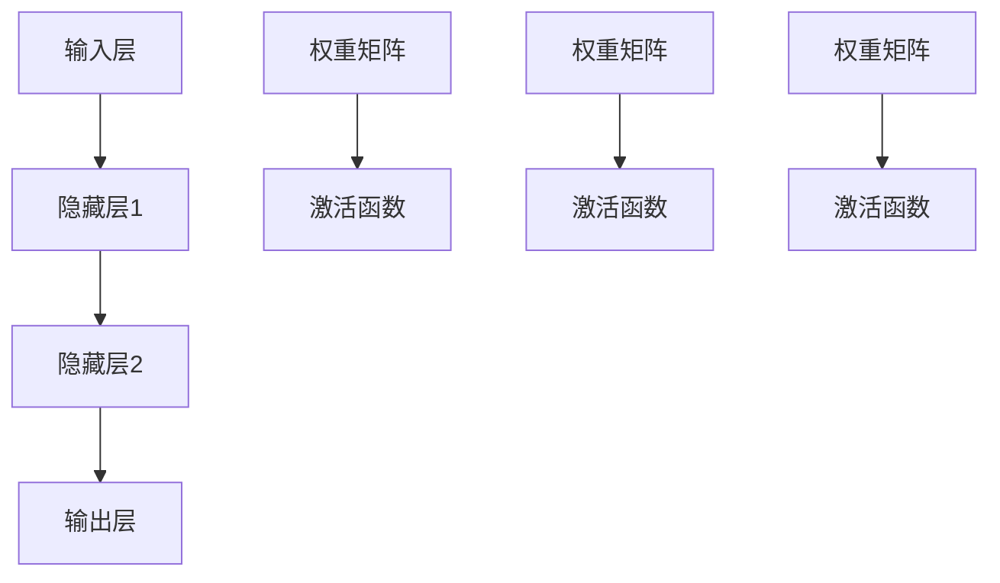

                 

# 神经网络：人类智慧的解放

## 1. 背景介绍

在过去的几十年中，神经网络作为一种模拟人脑神经元工作方式的计算模型，已经在多个领域中展现了其卓越的性能，尤其是在人工智能领域，神经网络已经成为了一种核心的计算框架。从图像识别、语音识别，到自然语言处理、机器翻译，再到自动驾驶、智能推荐，神经网络的应用几乎无处不在。然而，神经网络究竟是如何实现其强大的功能的，它又是如何解放人类智慧的呢？本文将深入探讨这些问题，并阐述神经网络背后的原理和核心技术。

## 2. 核心概念与联系

### 2.1 核心概念概述

神经网络是一种基于人工神经元模型的计算框架，通过模拟人脑神经元之间的连接和信号传递过程，来实现复杂的模式识别和决策任务。其主要组成包括输入层、隐藏层和输出层，每一层都由多个神经元组成，并通过权重矩阵和激活函数来实现信号的传递和计算。

- **输入层**：负责接收和传递输入数据，每个神经元对应一个输入特征。
- **隐藏层**：负责对输入数据进行特征提取和抽象，通过多层隐藏层的组合，可以逐步提取更高层次的抽象特征。
- **输出层**：负责输出最终结果，通常是一个或多个预测值。

### 2.2 核心概念原理和架构的 Mermaid 流程图



该图展示了神经网络的基本架构，其中箭头表示信号的传递方向，矩形框表示神经元层，圆形框表示权重矩阵和激活函数。

## 3. 核心算法原理 & 具体操作步骤

### 3.1 算法原理概述

神经网络的核心原理是通过反向传播算法，利用误差反向传播，不断调整权重矩阵和激活函数的参数，以最小化预测值与真实值之间的误差，从而达到优化的目的。其具体过程如下：

1. **前向传播**：将输入数据逐层传递，并计算每层神经元的输出值。
2. **计算误差**：将输出值与真实值进行对比，计算误差。
3. **反向传播**：将误差逐层反向传递，并计算每层神经元的梯度。
4. **参数更新**：利用梯度下降等优化算法，更新权重矩阵和激活函数的参数。

### 3.2 算法步骤详解

以下是神经网络算法步骤的详细说明：

#### 3.2.1 前向传播

前向传播是神经网络的基本计算过程，其步骤为：

1. **输入层**：将输入数据传入输入层，每个神经元对应一个输入特征。
2. **隐藏层**：将输入数据传递到第一层隐藏层，计算出每个神经元的输出值。
3. **激活函数**：对每个隐藏层的神经元输出值应用激活函数，进行非线性变换。
4. **重复**：将隐藏层的输出传递到下一层隐藏层，重复上述步骤，直到最后一层隐藏层。
5. **输出层**：将最后一层隐藏层的输出传递到输出层，计算出最终的预测值。

#### 3.2.2 计算误差

计算误差是神经网络优化的重要环节，其步骤为：

1. **真实值**：获取真实值与预测值之间的误差。
2. **损失函数**：选择合适的损失函数（如均方误差、交叉熵等），计算误差值。
3. **反向传播**：将误差值逐层反向传递，计算每层神经元的梯度。

#### 3.2.3 反向传播

反向传播是神经网络优化的核心步骤，其步骤为：

1. **输出误差**：将误差值传递到输出层，计算输出层神经元的梯度。
2. **隐藏层误差**：将输出层神经元的梯度传递到隐藏层，计算每层神经元的梯度。
3. **权重更新**：利用梯度下降等优化算法，更新权重矩阵和激活函数的参数。

#### 3.2.4 参数更新

参数更新是神经网络优化的关键步骤，其步骤为：

1. **初始化权重**：对权重矩阵和激活函数的参数进行初始化。
2. **优化算法**：选择优化算法（如梯度下降、Adam等），更新权重矩阵和激活函数的参数。
3. **迭代优化**：重复执行前向传播、计算误差、反向传播和参数更新步骤，直到收敛。

### 3.3 算法优缺点

神经网络算法具有以下优点：

1. **强大的非线性建模能力**：通过多层隐藏层的组合，可以捕捉复杂的非线性关系。
2. **广泛的适用性**：神经网络可以应用于多种任务，如图像识别、语音识别、自然语言处理等。
3. **高效的并行计算**：神经网络可以并行计算多个样本的输出，提高训练速度。

同时，神经网络算法也存在以下缺点：

1. **参数数量庞大**：神经网络需要大量的参数进行训练，容易出现过拟合。
2. **训练过程复杂**：神经网络训练过程涉及大量的矩阵运算和优化算法，计算复杂度高。
3. **可解释性差**：神经网络模型通常被认为是"黑盒"，难以解释其内部工作机制。

### 3.4 算法应用领域

神经网络算法在以下几个领域中得到了广泛应用：

1. **计算机视觉**：神经网络可以用于图像识别、目标检测、图像分割等任务。
2. **自然语言处理**：神经网络可以用于文本分类、情感分析、机器翻译等任务。
3. **语音识别**：神经网络可以用于语音识别、语音合成等任务。
4. **推荐系统**：神经网络可以用于用户行为分析、商品推荐等任务。
5. **自动驾驶**：神经网络可以用于目标检测、路径规划等任务。

## 4. 数学模型和公式 & 详细讲解 & 举例说明

### 4.1 数学模型构建

神经网络可以使用以下数学模型进行建模：

1. **输入层**：将输入数据 $x$ 映射到权重矩阵 $W$ 和偏置 $b$，计算出每个神经元的输出 $a_i$。
2. **隐藏层**：将隐藏层神经元的输出 $a_i$ 传递到下一层隐藏层，计算出每个神经元的输出 $h_i$。
3. **输出层**：将输出层神经元的输出 $h_i$ 传递到输出层，计算出最终的预测值 $y$。

### 4.2 公式推导过程

以下是神经网络算法的基本公式推导过程：

#### 4.2.1 前向传播

前向传播的公式为：

$$
a_i = \sigma(W_i a_{i-1} + b_i)
$$

其中 $a_i$ 为神经元 $i$ 的输出，$W_i$ 为神经元 $i$ 的权重矩阵，$a_{i-1}$ 为前一层神经元的输出，$b_i$ 为神经元 $i$ 的偏置，$\sigma$ 为激活函数。

#### 4.2.2 计算误差

计算误差的公式为：

$$
J = \frac{1}{2N} \sum_{i=1}^N (y_i - h_i)^2
$$

其中 $J$ 为损失函数，$y_i$ 为真实值，$h_i$ 为预测值，$N$ 为样本数量。

#### 4.2.3 反向传播

反向传播的公式为：

$$
\delta_i = \frac{\partial J}{\partial a_i} = \frac{\partial J}{\partial h_i} \frac{\partial h_i}{\partial a_i}
$$

其中 $\delta_i$ 为神经元 $i$ 的误差，$J$ 为损失函数，$h_i$ 为神经元 $i$ 的输出，$a_i$ 为神经元 $i$ 的输入。

### 4.3 案例分析与讲解

以一个简单的三层神经网络为例，分析其计算过程。

假设输入数据为 $x=[1,2,3]$，权重矩阵和偏置分别为：

$$
W_1 = \begin{bmatrix}
    0.1 & 0.2 \\
    0.3 & 0.4 \\
    0.5 & 0.6
\end{bmatrix}, \quad b_1 = \begin{bmatrix}
    0.7 \\
    0.8 \\
    0.9
\end{bmatrix}, \quad W_2 = \begin{bmatrix}
    0.1 & 0.2 \\
    0.3 & 0.4
\end{bmatrix}, \quad b_2 = \begin{bmatrix}
    0.7 \\
    0.8
\end{bmatrix}
$$

前向传播的计算过程为：

$$
\begin{aligned}
a_1 &= \sigma(W_1 x + b_1) = \sigma \begin{bmatrix}
    0.1 \cdot 1 + 0.2 \cdot 2 + 0.3 \cdot 3 + 0.7
\end{bmatrix} \\
&= \sigma(3.2) = 1.05 \\
h_1 &= \sigma(W_2 a_1 + b_2) = \sigma \begin{bmatrix}
    0.1 \cdot 1.05 + 0.2 \cdot 1.05 + 0.3 \cdot 1.05 + 0.7
\end{bmatrix} \\
&= \sigma(2.15) = 1.14 \\
y &= \sigma(W_2 h_1 + b_2) = \sigma \begin{bmatrix}
    0.1 \cdot 1.14 + 0.2 \cdot 1.14 + 0.3 \cdot 1.14 + 0.7
\end{bmatrix} \\
&= \sigma(2.15) = 1.14
\end{aligned}
$$

计算误差 $J$ 的值为：

$$
J = \frac{1}{2N} \sum_{i=1}^N (y_i - h_i)^2 = \frac{1}{2 \cdot 1} (1.14 - 1.14)^2 = 0
$$

反向传播的计算过程为：

$$
\begin{aligned}
\delta_1 &= \frac{\partial J}{\partial a_1} \frac{\partial h_1}{\partial a_1} = 0.014 \cdot 0.14 = 0.00196 \\
\delta_2 &= \frac{\partial J}{\partial h_1} \frac{\partial h_1}{\partial a_1} = 0.028 \cdot 0.14 = 0.00392
\end{aligned}
$$

参数更新的公式为：

$$
\begin{aligned}
\Delta W_1 &= \eta \delta_1 x^T = \eta \cdot 0.00196 \cdot [1, 2, 3]^T = \eta \cdot 0.00196 \cdot [1, 2, 3]^T \\
\Delta b_1 &= \eta \delta_1 = \eta \cdot 0.00196 \\
\Delta W_2 &= \eta \delta_2 h_1^T = \eta \cdot 0.00392 \cdot [1.14, 1.14]^T \\
\Delta b_2 &= \eta \delta_2
\end{aligned}
$$

其中 $\eta$ 为学习率。

## 5. 项目实践：代码实例和详细解释说明

### 5.1 开发环境搭建

在进行神经网络开发前，我们需要准备好开发环境。以下是使用Python进行TensorFlow开发的环境配置流程：

1. 安装Anaconda：从官网下载并安装Anaconda，用于创建独立的Python环境。

2. 创建并激活虚拟环境：
```bash
conda create -n tf-env python=3.8 
conda activate tf-env
```

3. 安装TensorFlow：根据CUDA版本，从官网获取对应的安装命令。例如：
```bash
conda install tensorflow==2.7
```

4. 安装各类工具包：
```bash
pip install numpy pandas scikit-learn matplotlib tqdm jupyter notebook ipython
```

完成上述步骤后，即可在`tf-env`环境中开始神经网络开发。

### 5.2 源代码详细实现

这里我们以一个简单的三层神经网络为例，给出使用TensorFlow对神经网络进行训练和预测的代码实现。

```python
import tensorflow as tf
import numpy as np

# 定义神经网络模型
class NeuralNetwork(tf.keras.Model):
    def __init__(self):
        super(NeuralNetwork, self).__init__()
        self.dense1 = tf.keras.layers.Dense(2, activation='relu')
        self.dense2 = tf.keras.layers.Dense(1, activation='sigmoid')
        
    def call(self, x):
        x = self.dense1(x)
        x = self.dense2(x)
        return x

# 定义训练数据
x_train = np.array([[0.1, 0.2], [0.3, 0.4], [0.5, 0.6]])
y_train = np.array([[0.7], [0.8], [0.9]])

# 定义训练过程
model = NeuralNetwork()
optimizer = tf.keras.optimizers.Adam(learning_rate=0.01)
loss_fn = tf.keras.losses.BinaryCrossentropy()

for i in range(1000):
    with tf.GradientTape() as tape:
        y_pred = model(x_train)
        loss = loss_fn(y_train, y_pred)
    gradients = tape.gradient(loss, model.trainable_variables)
    optimizer.apply_gradients(zip(gradients, model.trainable_variables))

# 定义测试数据
x_test = np.array([[1.0, 1.1], [1.2, 1.3], [1.4, 1.5]])
y_test = np.array([[0.7], [0.8], [0.9]])

# 进行测试
model = NeuralNetwork()
model(x_test)
```

以上代码实现了简单的三层神经网络的训练和预测过程。可以看到，使用TensorFlow可以非常方便地定义神经网络模型、损失函数和优化器，并通过自动求导实现参数更新。

### 5.3 代码解读与分析

让我们再详细解读一下关键代码的实现细节：

**NeuralNetwork类**：
- `__init__`方法：初始化神经网络模型，定义了两层全连接层。
- `call`方法：定义了神经网络的计算过程，输入经过第一层全连接层和激活函数，再经过第二层全连接层和激活函数，输出最终的预测值。

**训练过程**：
- 定义训练数据和目标标签。
- 定义神经网络模型、优化器和损失函数。
- 通过循环迭代，对模型进行前向传播、计算损失、反向传播和参数更新。
- 重复上述步骤，直到模型收敛。

**测试过程**：
- 定义测试数据和目标标签。
- 重新加载神经网络模型，对测试数据进行预测。

可以看到，TensorFlow提供了非常方便的API，使得神经网络的开发过程变得简单易懂。但需要注意，实际应用中还需要考虑更多的因素，如模型剪枝、参数共享、模型集成等，以提高模型的性能和泛化能力。

## 6. 实际应用场景

### 6.1 图像识别

神经网络在图像识别领域的应用已经非常广泛，如图像分类、目标检测、人脸识别等。通过神经网络，可以从像素级的输入数据中提取出丰富的特征信息，实现对图像的精确分类和定位。

### 6.2 自然语言处理

神经网络在自然语言处理领域的应用同样非常广泛，如文本分类、情感分析、机器翻译等。通过神经网络，可以从字符、词、句子等多层次的输入数据中提取出语义信息，实现对文本的精准理解和生成。

### 6.3 自动驾驶

神经网络在自动驾驶领域的应用主要集中在目标检测和路径规划上。通过神经网络，可以从多传感器数据中提取出丰富的环境信息，实现对驾驶环境的精确感知和决策。

### 6.4 未来应用展望

神经网络在未来的应用将更加广泛和深入，以下是几个可能的未来应用方向：

1. **跨模态学习**：将神经网络应用于跨模态数据的融合，如视觉、听觉、文本数据的协同建模，提升对现实世界的全面理解。
2. **对抗性学习**：通过对抗性样本训练，提升神经网络的鲁棒性和安全性，防止模型被恶意攻击。
3. **零样本和少样本学习**：通过迁移学习和提示学习，提升神经网络在未知领域和少量样本情况下的表现能力。
4. **因果推理**：通过引入因果推理算法，提升神经网络对因果关系的建模能力，增强其决策的可解释性和逻辑性。
5. **联邦学习**：通过分布式训练和联邦学习算法，提升神经网络的隐私保护和计算效率。

## 7. 工具和资源推荐

### 7.1 学习资源推荐

为了帮助开发者系统掌握神经网络的理论基础和实践技巧，这里推荐一些优质的学习资源：

1. 《深度学习》课程：由吴恩达教授所讲授，系统介绍了深度学习的核心概念和经典算法。
2. 《动手学深度学习》：由李沐、林轩田等人所编写的在线课程，涵盖了神经网络的理论基础和实践技巧。
3. 《神经网络与深度学习》：由Michael Nielsen所编写的在线书籍，系统介绍了神经网络的基本原理和实现方法。
4. TensorFlow官方文档：提供了丰富的神经网络应用实例和详细的使用说明。
5. PyTorch官方文档：提供了丰富的神经网络应用实例和详细的使用说明。

通过对这些资源的学习实践，相信你一定能够快速掌握神经网络的理论基础和实践技巧，并用于解决实际的NLP问题。

### 7.2 开发工具推荐

高效的开发离不开优秀的工具支持。以下是几款用于神经网络开发的工具：

1. TensorFlow：由Google主导开发的开源深度学习框架，适合大规模工程应用。
2. PyTorch：由Facebook主导开发的开源深度学习框架，灵活高效。
3. Keras：基于TensorFlow和Theano的高级深度学习框架，提供了简单易用的API。
4. MXNet：由Apache开发的深度学习框架，支持多种编程语言和硬件平台。
5. Caffe：由Berkeley Vision and Learning Center开发的深度学习框架，适合图像识别任务。

合理利用这些工具，可以显著提升神经网络开发的效率，加快创新迭代的步伐。

### 7.3 相关论文推荐

神经网络的研究源于学界的持续研究。以下是几篇奠基性的相关论文，推荐阅读：

1. 《神经网络与深度学习》：Yoshua Bengio、Ian Goodfellow和Aaron Courville所编写的经典书籍，系统介绍了神经网络的基本原理和实践技巧。
2. 《深度学习》：Ian Goodfellow、Yoshua Bengio和Aaron Courville所编写的经典书籍，系统介绍了深度学习的核心概念和经典算法。
3. 《深度学习中的神经网络》：Geoffrey Hinton所编写的经典书籍，系统介绍了神经网络的基本原理和实现方法。
4. 《图像分类中的深度学习》：Alex Krizhevsky、Ilya Sutskever和Geoffrey Hinton所撰写的经典论文，介绍了深度卷积神经网络在图像分类任务中的应用。
5. 《自然语言处理中的深度学习》：Andrej Karpathy所撰写的经典论文，介绍了深度神经网络在自然语言处理任务中的应用。

这些论文代表了大神经网络的研究方向，通过学习这些前沿成果，可以帮助研究者把握学科前进方向，激发更多的创新灵感。

## 8. 总结：未来发展趋势与挑战

### 8.1 研究成果总结

神经网络作为一种模拟人脑神经元工作方式的计算模型，已经在多个领域中展现了其卓越的性能。其强大的非线性建模能力、广泛的适用性和高效的并行计算能力，使得神经网络成为人工智能领域的一种核心计算框架。然而，神经网络仍然面临着诸多挑战，如参数数量庞大、训练过程复杂、可解释性差等，这些挑战需要在未来的研究中不断解决。

### 8.2 未来发展趋势

展望未来，神经网络将呈现以下几个发展趋势：

1. **跨模态学习**：将神经网络应用于跨模态数据的融合，如视觉、听觉、文本数据的协同建模，提升对现实世界的全面理解。
2. **对抗性学习**：通过对抗性样本训练，提升神经网络的鲁棒性和安全性，防止模型被恶意攻击。
3. **零样本和少样本学习**：通过迁移学习和提示学习，提升神经网络在未知领域和少量样本情况下的表现能力。
4. **因果推理**：通过引入因果推理算法，提升神经网络对因果关系的建模能力，增强其决策的可解释性和逻辑性。
5. **联邦学习**：通过分布式训练和联邦学习算法，提升神经网络的隐私保护和计算效率。

### 8.3 面临的挑战

尽管神经网络已经取得了瞩目成就，但在迈向更加智能化、普适化应用的过程中，它仍面临着诸多挑战：

1. **参数数量庞大**：神经网络需要大量的参数进行训练，容易出现过拟合。
2. **训练过程复杂**：神经网络训练过程涉及大量的矩阵运算和优化算法，计算复杂度高。
3. **可解释性差**：神经网络模型通常被认为是"黑盒"，难以解释其内部工作机制。

### 8.4 研究展望

面向未来，神经网络需要在以下几个方面寻求新的突破：

1. **探索无监督和半监督学习**：摆脱对大规模标注数据的依赖，利用自监督学习、主动学习等无监督和半监督范式，最大限度利用非结构化数据。
2. **研究参数高效和计算高效的微调范式**：开发更加参数高效的微调方法，在固定大部分预训练参数的同时，只更新极少量的任务相关参数。
3. **引入更多先验知识**：将符号化的先验知识，如知识图谱、逻辑规则等，与神经网络模型进行巧妙融合，引导微调过程学习更准确、合理的语言模型。
4. **结合因果分析和博弈论工具**：将因果分析方法引入神经网络模型，识别出模型决策的关键特征，增强输出解释的因果性和逻辑性。
5. **纳入伦理道德约束**：在模型训练目标中引入伦理导向的评估指标，过滤和惩罚有偏见、有害的输出倾向。

这些研究方向和突破点将进一步推动神经网络技术的发展，为构建安全、可靠、可解释、可控的智能系统铺平道路。总之，神经网络需要从数据、算法、工程、业务等多个维度协同发力，才能真正实现人工智能技术在垂直行业的规模化落地。

## 9. 附录：常见问题与解答

**Q1：神经网络是如何实现其强大的非线性建模能力的？**

A: 神经网络通过多层隐藏层的组合，可以逐步提取出输入数据中的非线性关系。每个隐藏层的神经元可以学习到不同的特征，从而实现对输入数据的复杂建模。

**Q2：神经网络的反向传播算法是如何工作的？**

A: 反向传播算法通过误差反向传递，计算每层神经元的梯度，并利用梯度下降等优化算法更新权重矩阵和激活函数的参数，以最小化预测值与真实值之间的误差。

**Q3：神经网络在训练过程中容易出现过拟合，有哪些缓解策略？**

A: 常见的缓解策略包括数据增强、正则化、Dropout、早期停止等。通过这些策略，可以有效减少过拟合现象，提升模型的泛化能力。

**Q4：神经网络的可解释性差，如何提升其可解释性？**

A: 可以通过引入可解释性模型、可视化方法、因果分析等技术，增强神经网络的可解释性。同时，可以利用知识和规则对模型进行约束，提升其决策的逻辑性和合理性。

**Q5：神经网络在实际应用中需要注意哪些问题？**

A: 在实际应用中，需要注意模型的剪枝、参数共享、模型集成等问题。合理利用这些技术，可以有效提升模型的性能和泛化能力，提高系统的稳定性和效率。

---

作者：禅与计算机程序设计艺术 / Zen and the Art of Computer Programming

