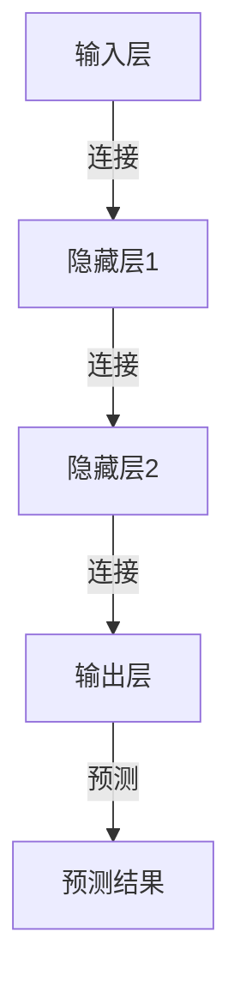

                 

# 神经网络：人类智慧的解放

> 关键词：神经网络,深度学习,人工智能,认知科学,人机交互

## 1. 背景介绍

### 1.1 问题由来

随着人工智能技术的飞速发展，深度学习技术在各种领域都取得了令人瞩目的突破。其中，神经网络作为深度学习的重要组成部分，已经成为实现人工智能的重要工具。然而，神经网络在实际应用中仍然存在一些问题和挑战，亟待解决。

深度学习技术在图像识别、语音识别、自然语言处理、智能推荐等领域取得了卓越的成绩。但同时，神经网络在应用中的一些问题也逐渐显现出来，例如：

- 训练数据量巨大，需要大量标注数据，成本较高。
- 神经网络模型结构复杂，难以解释，缺乏透明度。
- 模型参数较多，训练和推理过程计算量大，效率较低。
- 对抗攻击脆弱，容易受到攻击，影响安全性。

这些问题严重限制了神经网络技术在实际应用中的推广和普及。因此，研究神经网络技术的应用领域，提高神经网络的透明度和安全性，降低神经网络的计算复杂度，成为了当前深度学习研究的重要方向。

### 1.2 问题核心关键点

神经网络技术的研究核心包括以下几个方面：

- 如何设计高效的神经网络结构，降低模型计算复杂度。
- 如何提高神经网络的透明度，增强模型可解释性。
- 如何增强神经网络的安全性，防止对抗攻击。
- 如何将神经网络应用到更广泛领域，如生物、物理、工程等。

这些核心问题在神经网络研究中具有重要的地位，对于神经网络技术的推广和应用有着深远的影响。

## 2. 核心概念与联系

### 2.1 核心概念概述

神经网络是一种基于生物神经网络的计算模型，通过模拟生物神经元之间的连接方式，来实现信息的传递和处理。深度学习中的神经网络通常包含多个隐藏层，每个隐藏层由大量的神经元组成，神经元之间通过权重连接。神经网络的输入通过多个隐藏层处理后，最终输出一个预测结果。

神经网络在实际应用中，通常用于分类、回归、聚类、生成等任务。其中，分类任务是指将输入数据分为多个类别，如图像分类、文本分类等；回归任务是指预测一个数值结果，如房价预测、股票预测等；聚类任务是指将输入数据划分为多个群组，如图像分割、文本聚类等；生成任务是指生成新的数据样本，如图像生成、文本生成等。

### 2.2 核心概念原理和架构的 Mermaid 流程图



这个流程图展示了神经网络的整体架构，其中输入层将输入数据传递给多个隐藏层，每个隐藏层通过神经元之间的权重连接进行信息处理，最终输出层的预测结果用于任务预测。

### 2.3 核心概念间的联系

神经网络中的各个概念之间具有紧密的联系，如输入层、隐藏层、输出层、连接权重等，这些概念构成了神经网络的整体结构和计算模型。

- 输入层：是神经网络的起始层，负责将输入数据传递给神经网络。
- 隐藏层：是神经网络的核心部分，包含多个神经元，通过权重连接实现信息的传递和处理。
- 输出层：是神经网络的最终输出层，负责将处理后的信息输出为预测结果。
- 连接权重：是神经网络中各个神经元之间的连接参数，用于传递和处理信息。

这些概念之间的联系和作用，使得神经网络在各种任务中发挥了重要的作用，推动了人工智能技术的发展。

## 3. 核心算法原理 & 具体操作步骤

### 3.1 算法原理概述

神经网络的核心算法是反向传播算法（Backpropagation Algorithm），用于训练神经网络模型。反向传播算法通过反向传播误差信号，更新模型参数，实现模型的训练和优化。

反向传播算法的基本思想是，通过前向传播计算输出结果，然后通过后向传播计算误差信号，利用误差信号更新模型参数，从而提高模型性能。

反向传播算法的基本步骤包括：

- 前向传播：将输入数据传递给神经网络，通过多个隐藏层处理后，输出预测结果。
- 后向传播：计算预测结果与真实结果之间的误差，通过链式法则计算误差信号对各个参数的偏导数。
- 更新参数：根据误差信号对各个参数进行更新，优化模型性能。

### 3.2 算法步骤详解

反向传播算法的详细步骤如下：

1. 前向传播：将输入数据传递给神经网络，通过多个隐藏层处理后，输出预测结果。

2. 计算误差：计算预测结果与真实结果之间的误差，通常使用均方误差（MSE）或交叉熵（Cross-Entropy）等损失函数。

3. 后向传播：利用误差信号，通过链式法则计算误差信号对各个参数的偏导数。

4. 更新参数：根据误差信号对各个参数进行更新，优化模型性能。

5. 重复迭代：重复执行前向传播、计算误差、后向传播、更新参数等步骤，直至达到预设的迭代次数或误差满足要求。

### 3.3 算法优缺点

神经网络的优点包括：

- 强大的学习能力：神经网络能够自动学习数据特征，从数据中提取规律和模式，适应各种任务。
- 鲁棒性：神经网络具有较强的泛化能力，能够处理各种未知数据和噪声。
- 可扩展性：神经网络能够通过增加隐藏层和神经元数量，实现模型复杂度的提升。

神经网络的缺点包括：

- 需要大量标注数据：神经网络的训练需要大量的标注数据，标注数据的获取成本较高。
- 计算复杂度高：神经网络模型参数较多，训练和推理过程计算复杂度较高，需要大量计算资源。
- 难以解释：神经网络的结构和参数复杂，难以解释其内部工作机制和决策逻辑。
- 对抗攻击脆弱：神经网络模型对抗攻击脆弱，容易受到对抗样本攻击。

### 3.4 算法应用领域

神经网络技术已经广泛应用于图像识别、语音识别、自然语言处理、智能推荐等多个领域。

- 图像识别：神经网络在图像识别领域取得了卓越的成绩，如AlexNet、VGG、ResNet等经典模型。
- 语音识别：神经网络在语音识别领域也有广泛应用，如Wav2Vec、Transformer等模型。
- 自然语言处理：神经网络在自然语言处理领域也有广泛应用，如BERT、GPT等模型。
- 智能推荐：神经网络在智能推荐领域也有广泛应用，如DeepFM、XGBoost等模型。

## 4. 数学模型和公式 & 详细讲解 & 举例说明

### 4.1 数学模型构建

神经网络的基本数学模型为：

$$
y = f(Wx + b)
$$

其中，$x$为输入向量，$W$为权重矩阵，$b$为偏置向量，$f$为激活函数。

激活函数通常使用sigmoid、ReLU、tanh等函数。sigmoid函数可以将输出值映射到0到1之间，ReLU函数在输入为正数时返回输入值，负数时返回0，tanh函数将输出值映射到-1到1之间。

### 4.2 公式推导过程

以sigmoid激活函数为例，前向传播的公式如下：

$$
a_i = \sum_{j=1}^{n}w_{ij}x_j + b_i
$$

$$
z_i = \sigma(a_i)
$$

其中，$w_{ij}$为第$i$个神经元与第$j$个输入的权重，$x_j$为第$j$个输入，$b_i$为第$i$个神经元的偏置，$\sigma$为sigmoid函数。

后向传播的公式如下：

$$
\delta_i = \frac{\partial C}{\partial z_i} \cdot \frac{\partial \sigma(z_i)}{\partial a_i}
$$

$$
\delta_j = \frac{\partial C}{\partial z_j} \cdot w_{ij}
$$

其中，$\delta_i$为第$i$个神经元的误差信号，$C$为损失函数，$\sigma(z_i)$为sigmoid函数，$w_{ij}$为第$i$个神经元与第$j$个输入的权重。

### 4.3 案例分析与讲解

以手写数字识别为例，分析神经网络的数学模型和训练过程。

手写数字识别任务可以使用MNIST数据集，数据集包含60000个训练样本和10000个测试样本，每个样本是28x28像素的灰度图像。将图像展开成784维向量作为输入，输出为0到9之间的整数，表示手写的数字。

构建一个具有2个隐藏层、每个隐藏层包含256个神经元的神经网络模型，使用sigmoid激活函数。训练过程中，使用交叉熵损失函数。

假设模型已经训练了10000个样本，其中前5000个样本用于训练，后5000个样本用于验证。

在前向传播中，输入向量通过两个隐藏层进行处理，最终输出预测结果。

在后向传播中，计算预测结果与真实结果之间的误差，通过链式法则计算误差信号对各个参数的偏导数。

通过更新参数，优化模型性能。在验证集上评估模型性能，如果发现误差较大，重新调整学习率等参数，继续训练。

## 5. 项目实践：代码实例和详细解释说明

### 5.1 开发环境搭建

在进行神经网络实践前，需要准备好开发环境。以下是使用Python进行TensorFlow开发的Python环境配置流程：

1. 安装Anaconda：从官网下载并安装Anaconda，用于创建独立的Python环境。

2. 创建并激活虚拟环境：
```bash
conda create -n tf-env python=3.8 
conda activate tf-env
```

3. 安装TensorFlow：根据CUDA版本，从官网获取对应的安装命令。例如：
```bash
conda install tensorflow -c pytorch -c conda-forge
```

4. 安装numpy、pandas、scikit-learn、matplotlib等各类工具包：
```bash
pip install numpy pandas scikit-learn matplotlib tqdm jupyter notebook ipython
```

完成上述步骤后，即可在`tf-env`环境中开始神经网络实践。

### 5.2 源代码详细实现

以下是一个简单的神经网络模型实现示例：

```python
import tensorflow as tf
import numpy as np
import matplotlib.pyplot as plt

# 定义sigmoid激活函数
def sigmoid(x):
    return 1 / (1 + np.exp(-x))

# 定义神经网络模型
class NeuralNetwork:
    def __init__(self, input_size, hidden_size, output_size):
        self.input_size = input_size
        self.hidden_size = hidden_size
        self.output_size = output_size
        
        # 定义权重和偏置
        self.W1 = np.random.randn(input_size, hidden_size)
        self.b1 = np.zeros(hidden_size)
        self.W2 = np.random.randn(hidden_size, output_size)
        self.b2 = np.zeros(output_size)
        
    def forward(self, X):
        # 前向传播
        self.z1 = np.dot(X, self.W1) + self.b1
        self.a1 = sigmoid(self.z1)
        self.z2 = np.dot(self.a1, self.W2) + self.b2
        self.y_hat = sigmoid(self.z2)
        return self.y_hat
    
    def loss(self, y, y_hat):
        # 计算损失函数
        return -np.mean(np.multiply(y, np.log(y_hat)) + np.multiply(1 - y, np.log(1 - y_hat)))
    
    def backward(self, X, y, learning_rate=0.01):
        # 反向传播
        delta3 = np.multiply(y - self.y_hat, self.y_hat * (1 - self.y_hat))
        delta2 = np.dot(delta3, self.W2.T) * self.a1 * (1 - self.a1)
        dW2 = np.dot(self.a1.T, delta3)
        db2 = np.sum(delta3, axis=0, keepdims=True)
        dW1 = np.dot(X.T, delta2)
        db1 = np.sum(delta2, axis=0, keepdims=True)
        
        # 更新参数
        self.W2 -= learning_rate * dW2
        self.b2 -= learning_rate * db2
        self.W1 -= learning_rate * dW1
        self.b1 -= learning_rate * db1
    
    def train(self, X, y, epochs=1000):
        # 训练模型
        for i in range(epochs):
            self.y_hat = self.forward(X)
            self.loss_value = self.loss(y, self.y_hat)
            self.backward(X, y)
            if i % 100 == 0:
                print(f"Epoch {i}, Loss: {self.loss_value}")
        
        return self
    
    def predict(self, X):
        # 预测输出
        return self.forward(X)
```

以上代码实现了一个具有2个隐藏层、每个隐藏层包含256个神经元的神经网络模型，使用sigmoid激活函数。在训练过程中，使用交叉熵损失函数。

### 5.3 代码解读与分析

让我们再详细解读一下关键代码的实现细节：

**NeuralNetwork类**：
- `__init__`方法：初始化神经网络模型的输入大小、隐藏大小和输出大小，定义权重和偏置。
- `forward`方法：实现前向传播过程，计算输出结果。
- `loss`方法：实现损失函数计算过程，通常使用交叉熵损失函数。
- `backward`方法：实现反向传播过程，计算误差信号对各个参数的偏导数，并更新参数。
- `train`方法：实现模型训练过程，迭代更新参数。
- `predict`方法：实现模型预测过程，计算输出结果。

**激活函数**：
- `sigmoid`函数：定义sigmoid激活函数，将输出值映射到0到1之间。

**训练过程**：
- 定义训练样本和标签，初始化神经网络模型。
- 定义训练轮数，迭代训练模型。
- 在每个训练轮次中，计算损失函数和误差信号，更新模型参数。
- 每隔100个轮次打印一次损失函数值。
- 在训练完成后，返回训练好的神经网络模型。

**预测过程**：
- 定义测试样本，使用训练好的模型进行预测。
- 计算预测结果和标签之间的误差，评估模型性能。

## 6. 实际应用场景

### 6.1 智能推荐系统

神经网络在智能推荐系统中有广泛应用，通过用户行为数据和商品特征数据，预测用户对商品的兴趣和偏好，实现个性化推荐。智能推荐系统可以帮助电商平台提高用户满意度，增加销售额。

神经网络在推荐系统中通常用于用户行为预测和商品特征建模。通过前向传播和反向传播算法，模型学习用户行为和商品特征之间的关系，预测用户对商品的兴趣和偏好。模型在预测过程中，可以输出商品的点击率、转化率等指标，指导电商平台的广告投放和商品推荐。

### 6.2 医疗诊断系统

神经网络在医疗诊断系统中也有广泛应用，通过医学影像数据和病历数据，预测疾病类型和病变程度。医疗诊断系统可以帮助医院提高诊断效率，减少误诊和漏诊。

神经网络在医疗诊断系统中通常用于医学影像分类和病变检测。通过前向传播和反向传播算法，模型学习医学影像和病历数据之间的关系，预测疾病类型和病变程度。模型在预测过程中，可以输出疾病的分类结果和病变区域，指导医生的诊断和治疗。

### 6.3 金融风控系统

神经网络在金融风控系统中也有广泛应用，通过用户行为数据和金融数据，预测用户的信用风险和金融风险。金融风控系统可以帮助银行和保险公司提高风控效率，减少损失。

神经网络在金融风控系统中通常用于信用风险预测和金融风险评估。通过前向传播和反向传播算法，模型学习用户行为和金融数据之间的关系，预测用户的信用风险和金融风险。模型在预测过程中，可以输出用户的信用评分和金融风险评级，指导银行和保险公司的风险管理。

### 6.4 未来应用展望

随着神经网络技术的发展，未来神经网络将在更多领域得到应用，为人类生产生活带来新的变革。

- 在智慧医疗领域，神经网络可以用于医学影像分类、病变检测、基因分析等任务，提高诊断准确性和治疗效果。
- 在智能制造领域，神经网络可以用于生产过程优化、设备预测维护、质量控制等任务，提高生产效率和产品质量。
- 在智慧农业领域，神经网络可以用于作物生长监测、病虫害预测、农机自动化等任务，提高农业生产效率和资源利用率。
- 在智慧交通领域，神经网络可以用于交通流量预测、自动驾驶、智能调度等任务，提高交通系统的运行效率和安全性。
- 在智慧城市领域，神经网络可以用于城市运行监测、能源管理、环境监测等任务，提高城市管理的智能化水平和资源利用率。

神经网络在各个领域的应用前景广阔，未来将在更多的场景中发挥重要作用，推动人类社会的发展和进步。

## 7. 工具和资源推荐

### 7.1 学习资源推荐

为了帮助开发者系统掌握神经网络技术的理论基础和实践技巧，这里推荐一些优质的学习资源：

1. 《深度学习》书籍：Ian Goodfellow、Yoshua Bengio、Aaron Courville所著，深入浅出地介绍了深度学习的基本概念和核心算法。

2. 《TensorFlow实战》书籍：由Google开发，详细介绍了TensorFlow的实现和使用，适合深度学习初学者。

3. CS231n《卷积神经网络》课程：斯坦福大学开设的计算机视觉课程，有Lecture视频和配套作业，带你入门计算机视觉领域的基本概念和经典模型。

4. CS224N《自然语言处理》课程：斯坦福大学开设的自然语言处理课程，有Lecture视频和配套作业，适合深度学习初学者。

5. Coursera《深度学习专项课程》：由Andrew Ng教授主讲，涵盖深度学习的基本概念、算法和应用，适合深度学习入门和进阶者。

通过对这些资源的学习实践，相信你一定能够快速掌握神经网络技术的精髓，并用于解决实际的NLP问题。

### 7.2 开发工具推荐

高效的开发离不开优秀的工具支持。以下是几款用于神经网络开发的常用工具：

1. TensorFlow：由Google主导开发的深度学习框架，功能强大，支持多种算法和模型。

2. PyTorch：由Facebook主导开发的深度学习框架，灵活易用，适合研究和原型开发。

3. Keras：由François Chollet开发的深度学习框架，易于使用，支持多种深度学习模型。

4. Jupyter Notebook：免费的交互式编程环境，支持多种编程语言和深度学习框架。

5. Weights & Biases：模型训练的实验跟踪工具，可以记录和可视化模型训练过程中的各项指标，方便对比和调优。

6. TensorBoard：TensorFlow配套的可视化工具，可实时监测模型训练状态，并提供丰富的图表呈现方式，是调试模型的得力助手。

合理利用这些工具，可以显著提升神经网络开发的效率，加快创新迭代的步伐。

### 7.3 相关论文推荐

神经网络技术的研究起源于学界持续的研究，以下是几篇奠基性的相关论文，推荐阅读：

1. "Deep Blue Book"：Ian Goodfellow、Yoshua Bengio、Aaron Courville所著，全面介绍了深度学习的基本概念、算法和应用。

2. "ImageNet Classification with Deep Convolutional Neural Networks"：Alex Krizhevsky、Ilya Sutskever、Geoffrey Hinton所著，展示了卷积神经网络在图像分类任务上的卓越表现。

3. "Playing Atari with Deep Reinforcement Learning"：Volodymyr Mnih等人所著，展示了深度强化学习在复杂环境中的表现。

4. "Attention is All You Need"：Ashish Vaswani等人所著，展示了自注意力机制在自然语言处理任务上的卓越表现。

5. "Deep Neural Networks for Large-Scale Image Recognition"：Alex Krizhevsky等人所著，展示了深度神经网络在图像识别任务上的卓越表现。

这些论文代表了大神经网络技术的发展脉络。通过学习这些前沿成果，可以帮助研究者把握学科前进方向，激发更多的创新灵感。

## 8. 总结：未来发展趋势与挑战

### 8.1 总结

本文对神经网络技术进行了全面系统的介绍。首先阐述了神经网络的研究背景和意义，明确了神经网络在各种任务中发挥的重要作用。其次，从原理到实践，详细讲解了神经网络的数学模型和训练算法，给出了神经网络项目开发的完整代码实例。同时，本文还广泛探讨了神经网络技术在智能推荐、医疗诊断、金融风控等多个领域的应用前景，展示了神经网络技术的巨大潜力。此外，本文精选了神经网络技术的各类学习资源，力求为读者提供全方位的技术指引。

通过本文的系统梳理，可以看到，神经网络技术在各个领域的应用前景广阔，推动了人工智能技术的发展。未来，伴随神经网络技术的不断发展，其在更多领域的应用必将进一步拓展，为人类生产生活带来新的变革。

### 8.2 未来发展趋势

展望未来，神经网络技术将呈现以下几个发展趋势：

1. 模型规模持续增大：随着算力成本的下降和数据规模的扩张，神经网络模型的参数量还将持续增长，超大规模神经网络在各种任务中发挥的作用将更加重要。

2. 模型结构更加灵活：神经网络模型的结构将更加灵活，可以根据具体任务设计不同的网络结构，提高模型的适应性和泛化能力。

3. 模型训练更加高效：神经网络模型的训练过程将更加高效，通过优化算法和硬件设备的提升，降低模型的训练时间，提高训练效率。

4. 模型应用更加广泛：神经网络模型将在更多领域得到应用，如生物、物理、工程等，推动人工智能技术的进一步发展。

5. 模型可解释性增强：神经网络模型的可解释性将进一步增强，通过可视化工具和解释方法，提高模型的透明性和可信度。

6. 模型安全性得到保障：神经网络模型的安全性将得到保障，通过对抗攻击防御和鲁棒性提升，提高模型的鲁棒性和安全性。

以上趋势凸显了神经网络技术的发展前景，这些方向的探索发展，必将进一步推动人工智能技术的进步。

### 8.3 面临的挑战

尽管神经网络技术已经取得了瞩目成就，但在迈向更加智能化、普适化应用的过程中，它仍面临着诸多挑战：

1. 计算资源需求高：神经网络模型的参数量和计算量巨大，需要高性能的计算设备和大量的计算资源。

2. 数据标注成本高：神经网络模型的训练需要大量的标注数据，标注数据的获取成本较高，且标注数据的质量和数量直接影响模型性能。

3. 模型复杂度高：神经网络模型的结构复杂，难以解释其内部工作机制和决策逻辑，缺乏透明度。

4. 对抗攻击脆弱：神经网络模型对抗攻击脆弱，容易受到对抗样本攻击，影响模型的鲁棒性和安全性。

5. 模型泛化能力不足：神经网络模型在面对新数据和新场景时，泛化能力有限，容易过拟合和欠拟合。

6. 模型公平性和偏见问题：神经网络模型在训练过程中，容易引入偏见和歧视，导致模型公平性问题。

这些挑战需要研究者不断进行探索和优化，推动神经网络技术的发展和应用。

### 8.4 研究展望

面对神经网络技术所面临的挑战，未来的研究需要在以下几个方面寻求新的突破：

1. 探索更高效的神经网络模型结构，如轻量级模型、低秩矩阵分解等，降低模型参数量和计算量。

2. 引入对抗攻击防御和鲁棒性提升的方法，提高神经网络模型的鲁棒性和安全性。

3. 引入更多的先验知识，如知识图谱、逻辑规则等，引导神经网络模型的学习，提高模型的泛化能力和解释能力。

4. 引入因果推断和博弈论思想，提高神经网络模型的可解释性和决策逻辑的透明性。

5. 引入伦理道德约束，避免神经网络模型的偏见和歧视问题，确保模型的公平性和可信度。

这些研究方向的探索，必将引领神经网络技术迈向更高的台阶，为构建安全、可靠、可解释、可控的智能系统铺平道路。面向未来，神经网络技术还需要与其他人工智能技术进行更深入的融合，如知识表示、因果推理、强化学习等，多路径协同发力，共同推动人工智能技术的发展和应用。

## 9. 附录：常见问题与解答

**Q1：神经网络在实际应用中需要注意哪些问题？**

A: 神经网络在实际应用中需要注意以下问题：

1. 数据标注成本高：神经网络模型的训练需要大量的标注数据，标注数据的获取成本较高，且标注数据的质量和数量直接影响模型性能。

2. 模型复杂度高：神经网络模型的结构复杂，难以解释其内部工作机制和决策逻辑，缺乏透明度。

3. 对抗攻击脆弱：神经网络模型对抗攻击脆弱，容易受到对抗样本攻击，影响模型的鲁棒性和安全性。

4. 模型泛化能力不足：神经网络模型在面对新数据和新场景时，泛化能力有限，容易过拟合和欠拟合。

5. 模型公平性和偏见问题：神经网络模型在训练过程中，容易引入偏见和歧视，导致模型公平性问题。

6. 计算资源需求高：神经网络模型的参数量和计算量巨大，需要高性能的计算设备和大量的计算资源。

这些问题是神经网络技术在实际应用中需要面对的重要问题，需要通过技术手段进行优化和改进。

**Q2：如何提高神经网络模型的泛化能力？**

A: 提高神经网络模型的泛化能力，可以通过以下方法：

1. 数据增强：通过回译、近义替换等方式扩充训练集，增加数据的多样性。

2. 正则化：使用L2正则、Dropout等方法，防止模型过拟合。

3. 参数共享：通过参数共享，减少模型参数量，降低过拟合风险。

4. 集成学习：通过集成多个神经网络模型的预测结果，提高模型的泛化能力和鲁棒性。

5. 对抗训练：引入对抗样本，提高模型的鲁棒性和泛化能力。

这些方法可以有效提高神经网络模型的泛化能力，使其在面对新数据和新场景时表现更加稳定和可靠。

**Q3：如何提高神经网络模型的可解释性？**

A: 提高神经网络模型的可解释性，可以通过以下方法：

1. 可视化工具：使用可视化工具，如TensorBoard，查看神经网络模型的内部结构和学习过程，提高模型的透明性。

2. 解释方法：使用解释方法，如Shapley值、LIME等，解释神经网络模型的决策逻辑和特征重要性，提高模型的透明性。

3. 因果推断：引入因果推断方法，识别出神经网络模型的关键特征，增强模型的因果解释能力。

4. 博弈论思想：引入博弈论思想，分析神经网络模型的决策逻辑和行为，提高模型的透明性和可信度。

这些方法可以有效提高神经网络模型的可解释性，使其在应用过程中更加可靠和可信。

**Q4：如何提高神经网络模型的安全性？**

A: 提高神经网络模型的安全性，可以通过以下方法：

1. 对抗攻击防御：引入对抗攻击防御方法，如对抗样本生成、对抗训练等，提高模型的鲁棒性和安全性。

2. 鲁棒性提升：通过鲁棒性提升方法，如模型剪枝、参数稀疏化等，提高模型的鲁棒性和安全性。

3. 模型公平性：引入公平性约束，避免神经网络模型引入偏见和歧视，确保模型的公平性和可信度。

4. 鲁棒性评估：通过鲁棒性评估方法，如鲁棒性测试、鲁棒性验证等，评估模型的鲁棒性和安全性。

这些方法可以有效提高神经网络模型的安全性，使其在应用过程中更加可靠和可信。

**Q5：如何优化神经网络模型的训练过程？**

A: 优化神经网络模型的训练过程，可以通过以下方法：

1. 学习率调度：使用学习率调度方法，如学习率衰减、学习率自适应等，提高模型的训练效果。

2. 批处理大小：选择合适的批处理大小，平衡模型训练速度和效果。

3. 优化器选择：选择合适的优化器，如SGD、Adam等，提高模型的训练效果。

4. 正则化技术：使用正则化技术，如L2正则、Dropout等，防止模型过拟合。

5. 数据增强：通过数据增强方法，如回译、近义替换等，扩充训练集，提高模型的泛化能力。

6. 对抗训练：引入对抗训练方法，如对抗样本生成等，提高模型的鲁棒性和泛化能力。

这些方法可以有效优化神经网络模型的训练过程，提高模型的训练效果和泛化能力。

通过这些常见问题的解答，相信你一定能够更好地理解和应用神经网络技术，推动其在更多领域的发展和应用。

---

作者：禅与计算机程序设计艺术 / Zen and the Art of Computer Programming

